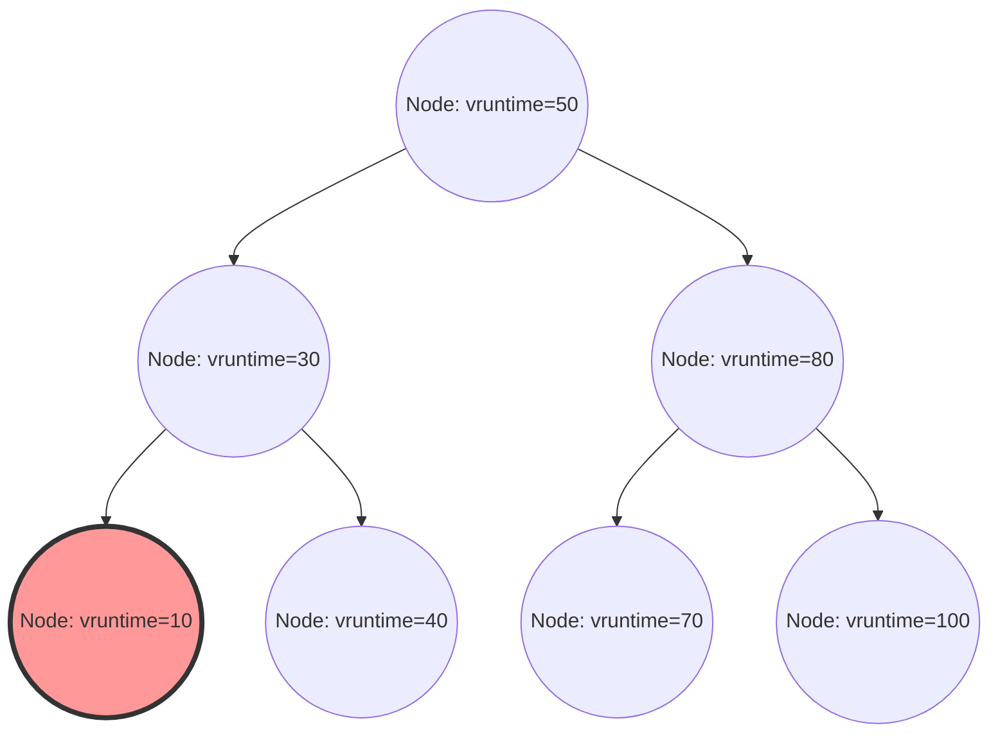

In the Linux kernel, one of the most critical components determining overall system performance, throughput, and responsiveness is the process scheduler. The "Completely Fair Scheduler (CFS)," which has reigned as the default scheduler for many years in modern Linux (from kernel 2.6.23 to 6.5), is a masterpiece that completely broke away from traditional heuristic-based scheduling, pursuing "complete fairness" based on a rigorous mathematical model.

In this article, from the perspectives of Linux kernel internal structure and scheduling theory, we will explain in extreme detail, at the source code resolution level, the architecture of CFS, the mathematical calculation of virtual runtime (vruntime), runqueue management using Red-Black Trees, the load balancing algorithm in multi-core environments, and even the evolution to EEVDF (Earliest Eligible Virtual Deadline First) introduced in the latest kernel 6.6 and later. For kernel hackers, system programmers, and engineers tackling low-level performance tuning, deeply understanding the internal structure of CFS is an unavoidable path.

## Chapter 1: The Evolutionary History of Linux Schedulers and the Background of CFS's Birth

To deeply understand the design philosophy and beauty of CFS, it is necessary to unravel what challenges the scheduler faced and how it evolved in the history of the Linux kernel. The evolution of scheduling algorithms has also been a history of fierce battles with the trade-off of conflicting requirements: throughput (processing volume per unit time) and latency (response time).

### Before the 2.4 Kernel Era: The Limits of the O(N) Scheduler and the Epoch-based Dilemma

The scheduler in the Linux 2.4 era was simple but sufficient for standard workloads of the time. This scheduler adopted an Epoch-based algorithm, allocating a time slice to each process, and when all processes used up their time slices, a new epoch would begin.

However, as multiprocessor systems began to spread, this scheduler started exposing a fatal architectural flaw. That was its time complexity of $O(N)$ (where N is the number of runnable processes). It only had one global runqueue for the entire system, and every time scheduling occurred, it scanned "all processes" in the queue to determine the optimal process to execute next (the one with the highest dynamic priority).
Even more serious was mutual exclusion. Because the entire runqueue was protected by a single global spinlock (`runqueue_lock`), lock contention intensified as the number of CPU cores increased. While one CPU was searching for the next process to execute, all other CPUs were blocked, wasting precious CPU cycles waiting for the spinlock (busy looping), which caused a severe bottleneck in scalability (cache line bouncing).

### 2.6 Kernel: Ingo Molnar and the Innovation of the O(1) Scheduler

To fundamentally resolve these scalability and computational complexity issues, the "O(1) scheduler" was introduced during the development process of the Linux 2.6 kernel by the renowned kernel hacker Ingo Molnar. As the name suggests, this scheduler featured a revolutionary algorithm that could always select the next process in constant time $O(1)$, entirely independent of the number of processes in the system.

The O(1) scheduler drastically improved scalability problems in multiprocessor environments by having completely independent runqueues per CPU (Per-CPU Runqueue) and abolishing the global lock. Each runqueue maintained two priority arrays: the "Active array" and the "Expired array". The arrays were composed of linked lists (`list_head`) for each of the 140 priority levels (0-139, of which 0-99 corresponded to real-time priorities, and 100-139 corresponded to normal nice values).

Process selection was extremely fast. A bitmap for each priority was prepared, and the bit for a priority where a runnable process existed was set to 1. By using the "find first set" instruction provided by the hardware (such as `bsfl` or `lzcnt` on x86), the CPU could identify the highest priority in constant clock cycles and fetch the process at the head of that priority list in $O(1)$. When a process used up its time slice, it moved to the "Expired array," and when the "Active array" became empty, a new epoch started instantly simply by swapping the pointers of the two arrays.

However, although the O(1) scheduler was perfect in terms of performance, it embraced another massive dilemma: "determining interactivity." To enhance the user experience (mouse tracking and window drawing responsiveness) in desktop environments, the scheduler guessed whether a process was I/O bound (interactive) or CPU bound using heuristics based on the ratio of past sleep time to execution time. Processes judged as interactive were given dynamic priority boosts (bonuses) and received special treatment where they remained in the Active array without moving to the Expired array even when their time slice ran out.
This heuristic logic became more complex and bizarre with every kernel version upgrade, and in edge cases, it caused severe audio skipping in multimedia applications and inexplicable behavior where CPU-bound processes completely fell into a state of starvation.

### Con Kolivas's RSDL and the Paradigm Shift to Complete Fairness

It was Con Kolivas, an anesthesiologist who was also active as a kernel hacker, who objected to the extremely complex heuristics and swamp of tuning in the O(1) scheduler. He argued, "Desktop responsiveness can be improved purely through fair allocation, without the need for complex guessing logic," and proposed patches such as the Staircase scheduler and the RSDL (Rotating Staircase Deadline) scheduler to the ML (Mailing List).

Although Kolivas's RSDL scheduler was never merged into the mainline, its philosophy gave decisive inspiration to Ingo Molnar. Ingo Molnar completely abandoned the complex dynamic priority calculations and heuristic code of the O(1) scheduler, and in just a few weeks, he wrote a completely new scheduler based on the single beautiful principle of "completely fairly dividing CPU time among processes." This was the "Completely Fair Scheduler (CFS)."
CFS was merged into the mainline in Linux 2.6.23, and since then, it has continued to operate as the heart of Linux for over 15 years. This was an extremely important paradigm shift in OS history, marking a return from complex rules of thumb to mathematical models.

## Chapter 2: The Mathematical Foundation of Fair Queuing and the GPS Model

The concept of "Completely Fair" in CFS is not just a slogan but is rooted in the "ideal resource allocation model" in operating system theory and network theory.

### The Utopia of the GPS (Generalized Processor Sharing) Model

The ultimate ideal form in scheduling theory is the concept called the GPS (Generalized Processor Sharing) or Fluid model.
An ideal GPS processor is virtual hardware that ignores physical constraints. If there are $N$ runnable processes in the system, the GPS processor continuously provides exactly $1/N$ of the CPU power to each process simultaneously and in parallel. In other words, rather than "temporally dividing (time slicing)" the CPU resource to execute alternately, it refers to a state where the resource is "spatially (or performance-wise) divided" and processes advance with infinitely zero delay.

When there are differences in priority (Weight) among processes, the GPS model is extended to Weighted Fair Queuing (WFQ). When each process $i$ in the system has a weight $w_i$, process $i$ "continuously" receives processing capacity proportional to the ratio of its own weight to the total weight of the system. Expressed mathematically, the CPU bandwidth $C_i$ received by process $i$ is as follows:

$$
C_i = \text{CPU Total Capacity} \times \frac{w_i}{\sum_{j=1}^{N} w_j}
$$

In this model, the context switch overhead is zero, and a process always continues to advance by consuming its entitled CPU bandwidth.

### Approximation of GPS in Discrete Time and the Fundamental Theorem of CFS

However, an actual physical CPU core can only execute one sequence of instructions (thread) at any given moment (excluding SMT/Hyper-Threading). Implementing the GPS model as-is on physical hardware is impossible due to the laws of physics.
Therefore, it is necessary to approximate (emulate) the GPS model on a macroscopic level by dividing time into fine slices and rapidly switching processes (time-division multiplexing). This is the fundamental principle of CFS, which applies the concept of packet scheduling (WFQ) in network routers to CPU scheduling.

The algorithm of CFS constantly calculates and tracks the "ideal CPU time" that a process running on the system would have obtained if it had been running on an ideal GPS processor. It then performs scheduling to next execute the process with the largest "error (lag)" from the time actually consumed on the real CPU.
The virtual clock for tracking this "degree of progress on an ideal GPS processor" is exactly the "virtual runtime (vruntime)," which will be explained in detail in Chapter 3.

## Chapter 3: The Mathematics and Calculation Mechanism of Virtual Runtime (vruntime)

The core of the CFS algorithm, which governs everything, is an unsigned 64-bit integer variable called `vruntime` (Virtual Runtime), maintained by all processes (more precisely, `sched_entity`, the basic unit of scheduling).
The scheduling rules of CFS do not have complex array operations like the O(1) scheduler and are surprisingly simple:
**"Always select the task with the smallest vruntime in the runqueue, and execute it next."**

### Conversion Formula from nice Value to Weight

In Linux, nice values from `-20` (highest priority) to `19` (lowest priority) are used to adjust the priority of a process from user space. The default value is `0`.
CFS does not use this nice value directly for calculations. Instead, it converts it into a "Weight" that indicates a relative CPU allocation ratio.

The design requirement here was that "if the nice value goes down by 1 (priority goes up), it acquires about 10% more CPU time compared to other processes, and if the nice value goes up by 1, it acquires about 10% less." To realize this mathematically, the weight is defined to change geometrically with respect to the nice value. Specifically, the ratio of weights (multiplier) between adjacent nice values is set to approximately $1.25$.
Since $1.25^3 \approx 1.953 \approx 2.0$, a beautiful relationship is derived where if the nice value changes by 3, the CPU time allocated to the process doubles or halves.

Inside the kernel, in `kernel/sched/core.c`, a lookup table `sched_prio_to_weight` based on this theory is statically defined.

```c
const int sched_prio_to_weight[40] = {
 /* -20 */     88761,     71755,     56483,     46273,     36291,
 /* -15 */     29154,     23254,     18705,     14949,     11916,
 /* -10 */      9548,      7620,      6100,      4904,      3906,
 /*  -5 */      3121,      2501,      1991,      1586,      1277,
 /*   0 */      1024,       820,       655,       526,       423,
 /*   5 */       335,       272,       215,       172,       137,
 /*  10 */       110,        87,        70,        56,        45,
 /*  15 */        36,        29,        23,        18,        15,
};
```
The weight of a task with a nice value of `0` is defined as `1024`, and this is handled as the macro constant `NICE_0_LOAD` within the kernel. All calculations are performed based on this `1024`.

### The Mathematical Model and Formula for vruntime Increment

When a process is executed on an actual physical CPU for a real time of $\Delta exec$ (in nanoseconds), the `vruntime` of that process increases according to the following formula:

$$
vruntime \mathrel{+}= \Delta exec \times \frac{NICE\_0\_LOAD}{weight}
$$

Let's apply this formula to specific nice values and examine what it means.

1. **When the nice value is `0` (weight `1024`)**:
   $\frac{1024}{1024} = 1$. Therefore, $vruntime$ increases at exactly the same pace as the real time $\Delta exec$. If executed for 10ms in real time, vruntime also advances by 10ms (10,000,000ns).
2. **When the nice value is `-5` (weight `3121`, high priority)**:
   $\frac{1024}{3121} \approx 0.328$. This means that $vruntime$ only increases at about 1/3 the pace of real time. The slow increase of vruntime means that it can maintain the state of having the "smallest vruntime" compared to other processes for a longer time, and as a result, it can occupy the CPU for a longer period.
3. **When the nice value is `5` (weight `335`, low priority)**:
   $\frac{1024}{335} \approx 3.05$. $vruntime$ increases at a furious pace of about three times real time. Because vruntime becomes extremely large after just a little execution, it is quickly overtaken by other tasks, surrendering the seat of "minimum vruntime" and yielding the CPU.

In this way, by normalizing the physical execution time with the "weight" of each process, CFS drops it into the dimension of a single absolute indicator `vruntime`, simultaneously achieving priority control and fairness.

### Avoiding Division and Fixed-Point Arithmetic in Kernel Implementation

Although the mathematical model is as described above, in the scheduler path called tens of thousands of times per millisecond deep inside the OS kernel, executing division (division instructions) by $\frac{1}{weight}$ every time incurs an extremely severe performance penalty (delays of tens to hundreds of clock cycles, especially on older architectures).

Therefore, the Linux kernel employs clever optimization to completely eliminate division. It prepares another lookup table `sched_prio_to_wmult` where $\frac{2^{32}}{weight}$ (the reciprocal multiplied by $2^{32}$) is precalculated in advance, and completely replaces division with multiplication and 32-bit right shifts (a basic technique of fixed-point arithmetic).

```c
/* kernel/sched/fair.c : Logical structure of calc_delta_fair() */
static inline u64 calc_delta_fair(u64 delta, struct sched_entity *se)
{
    if (unlikely(se->load.weight != NICE_0_LOAD)) {
        /*
         * Avoid division, and calculate
         * delta = delta * (NICE_0_LOAD / weight) using only multiplication and shift instructions
         */
        delta = __calc_delta(delta, NICE_0_LOAD, &se->load);
    }
    return delta;
}
```
Every time a timer interrupt (Tick) occurs, or every time a context switch occurs, the `update_curr()` function in `kernel/sched/fair.c` is called. The actual execution time of the currently running task is precisely measured, and `vruntime` is strictly updated through the above function.

## Chapter 4: Runqueue Management and Scheduling Entities via Red-Black Trees

While the O(1) scheduler used priority-based array structures, CFS adopted a sophisticated data structure called a "Red-Black Tree (RB-tree)," a type of balanced binary search tree.

### The cfs_rq Structure and Abstraction of sched_entity

Each CPU holds a dedicated CFS runqueue structure `struct cfs_rq` in memory. Interestingly, the objects directly stored and scheduled within the runqueue are not `task_struct`s that represent processes themselves. CFS abstracts the target of scheduling one level further and treats it as a structure called `struct sched_entity` (scheduling entity).

This abstraction is extremely important. This is because, whether the scheduled target is a single process or a group of processes grouped by cgroups (Control Groups), CFS can transparently treat them as exactly the same single `sched_entity`. This elegantly realizes hierarchical group scheduling.

### Operations on Red-Black Trees and Computational Complexity of the Algorithm

CFS stores all runnable entities present in the runqueue in a Red-Black tree using `vruntime` as the key (sorting criteria). Due to the nature of binary search trees, there is a rule that left child nodes are smaller than the parent node, and right child nodes are larger than the parent node.

- **Searching (fetching) for the best process**:
  The rule of CFS is "always execute the one with the smallest vruntime next." The smallest node in a Red-Black tree is at the very end reached by following left from the root, that is, the "bottom-leftmost node of the tree (`rb_leftmost`)".
  CFS always caches and maintains a pointer to this `rb_leftmost` node (`cfs_rq->rb_leftmost`) every time an insertion or deletion is performed on the tree. Therefore, the process of the scheduler selecting the next process to execute (`pick_next_task_fair()`) does not require searching the tree, but merely reading the cached pointer, so the computational complexity completes in $O(1)$.

- **Insertion and deletion of nodes**:
  When a process wakes up from a sleep state and becomes runnable, or when it finishes execution and yields the CPU to return to the queue, the computational complexity of inserting (`enqueue_entity()`) or deleting (`dequeue_entity()`) into the Red-Black tree is $O(\log N)$, where N is the number of elements in the queue.
  Compared to the O(1) scheduler, the computational complexity order has worsened, but the Red-Black tree always maintains self-balance, and the height of the tree is limited to $\log N$. Even if there are tens of thousands of processes in the system, the height of the tree will only be a dozen or so steps. Considering cache locality as well, the overhead as practical CPU cycles is extremely small, and it was proven to be far cheaper than the cost of executing the complex heuristic logic of O(1).


*Figure: The logical structure of a Red-Black tree with vruntime as the key. The leftmost node (vruntime=10) is always cached as the next process to be executed.*

### Overflow Prevention and Wake-up Compensation via min_vruntime

`vruntime` is a 64-bit unsigned integer (`u64`) and continues to increase continuously in nanoseconds. In long-running enterprise servers, there is always a mathematical possibility of overflow (a wraparound phenomenon where the value exceeds its limit and returns to 0).

Moreover, a problem that occurs much more frequently in practice is the handling of newly created processes or processes that have been sleeping for a long time due to I/O waits and woke up after several hours. If the `vruntime` of these processes remains 0 or an old value, it would become overwhelmingly small compared to the `vruntime` (for example, trillions of nanoseconds) of other processes in the system. As a result, CFS would misidentify that "this process has not used the CPU at all and is in an extremely disadvantageous state," and it would allow the process to completely monopolize the CPU (causing all other processes to fall into starvation) until its `vruntime` caught up with the other processes.

To completely prevent this, the `cfs_rq` structure maintains an important tracking variable called `min_vruntime`.
`min_vruntime` is a variable that tracks the minimum `vruntime` among all processes currently present in that runqueue, but a strict rule is imposed that **it is only allowed to "monotonically increase"**. In other words, it never goes backward in time.

- **Initialization of new processes (at fork)**:
  When a new process is created, its initial `vruntime` does not start from zero, but is offset adjusted (initialized) to a reasonable value based on the parent process's `vruntime` or the current runqueue's `min_vruntime`.
- **Compensation for wake-up processes**:
  When a process that has slept for a long time wakes up and returns to the runqueue, strict compensation is performed within the `enqueue_entity()` function. The process's old `vruntime` is compared with a value obtained by subtracting a specific penalty value (calculated from `sysctl_sched_latency`, etc.) from the runqueue's `min_vruntime`, and the larger one is adopted.
  That is, `se->vruntime = max_vruntime(se->vruntime, cfs_rq->min_vruntime - penalty_value)`, and the time is forcibly "pulled up" to match the overall system clock. This prevents the unjust monopolization of the CPU when returning from a long sleep, while providing an appropriate delay bonus to ensure responsiveness when returning from a short sleep (like waiting for keyboard input).

Also, in the Red-Black tree comparison functions (`entity_before()`, etc.) inside the kernel, when comparing the magnitude of two `u64` values, instead of comparing them directly, they are first cast to signed 64-bit integers (`s64`), subtracted, and the magnitude is determined by the sign (positive/negative) of the result. This is a hack leveraging modular arithmetic of two's complement representation. As long as the difference between the two values is less than $2^{63}$, the correct chronological order relationship can be determined even if one has overflowed and returned to 0, thus completely rendering the wraparound problem harmless.

## Chapter 5: The Mechanism of Load Balancing in Multi-core and NUMA Architectures

In modern hardware architectures, single-core processors no longer exist, and multi-core processors with tens to hundreds of cores, or NUMA (Non-Uniform Memory Access) architectures where memory access latency depends on physical distance, are common.
No matter how perfectly the Red-Black tree algorithm of CFS itself achieves fairness on a single CPU, if one CPU's queue has 100 processes piled up and is screaming, while the adjacent CPU is completely idle and playing, the throughput of the system as a whole will be the worst. Therefore, task migration and load balancing in multi-core environments are extremely critical subsystems.

### The Complex Hierarchical Topology of sched_domain and sched_group

The Linux kernel constructs hierarchical data structures called `sched_domain` and `sched_group` to abstract and efficiently manage the complex CPU topology of physical hardware. At system boot, it reads hardware information from ACPI and the device tree to construct a logical hierarchical tree.

For example, imagine a system with two physical sockets (NUMA nodes), each having four physical cores, and each enabling SMT (such as Hyper-Threading) for a total of 16 logical threads. In this case, the scheduler builds a hierarchy (domains) from bottom to top as follows:

1. **SMT (Simultaneous Multithreading) Domain**:
   The lowest level. It handles load balancing between two logical threads sharing the same physical core. Since the L1/L2 cache and execution units are completely shared here, the cost (penalty) of moving a task is minimal.
2. **MC (Multi-Core) Domain**:
   Handles load balancing between multiple physical cores residing on the same physical socket (CPU package). Usually, because they share an L3 cache (LLC: Last Level Cache), the penalty due to cache misses when moving a task is moderate.
3. **NUMA Domain**:
   The top level. Handles load balancing between different physical sockets (NUMA nodes). Moving a process across this boundary turns accesses to the memory the process was using into remote memory accesses, causing severe latency degradation, so the movement penalty (resistance value) is set extremely high.

Load Balancing is triggered at two timings: periodic execution by timer interrupts (Periodic Load Balance), and execution just before a CPU's runqueue becomes empty and transitions to an idle state (NewIdle Load Balance).
The algorithm traverses the domains in order from the bottom of the hierarchy (SMT) to the top (NUMA). Within each domain, it calculates the average load between the constituent `sched_group`s, and only performs the operation of pulling tasks from the group with the highest load to the group with the lowest load (itself) if the penalty threshold for the domain is exceeded.

### The Mathematics of the PELT (Per-Entity Load Tracking) Algorithm

To accurately compare "load between groups" in load balancing, one must be able to accurately measure the "load of a task" in the first place. In the older Linux kernels, a rough method of instantaneously sampling the number of tasks lined up in the runqueue (queue length) was used, but this could not accurately estimate the load of bursty tasks that repeatedly turned ON/OFF rapidly, causing inappropriate task migrations.

To solve this problem, the **PELT (Per-Entity Load Tracking)** algorithm was introduced recently, dramatically improving the scheduling accuracy of the kernel.
PELT is an algorithm that continuously tracks and decays the "history" of how much time each entity (process or cgroup) has consumed the CPU in the past, using an Exponentially Weighted Moving Average (EWMA) at a millisecond resolution.

The load $L_t$ of a task at time $t$ is calculated by the following recurrence formula using the CPU consumption $C_t$ of the current period and the load $L_{t-1}$ accumulated from the past:

$$ L_t = C_t + y \times L_{t-1} $$

Here, $y$ is the decay factor (a value greater than 0 and less than 1). In the Linux kernel, the value of $y$ is adjusted so that the influence of past history is exactly halved in 32 milliseconds (a half-life of 32ms) ($y^{32} = 0.5$).
Because of this, when a task starts using the CPU, its load value rises smoothly, and when it sleeps, it decays smoothly. The extremely accurate and stable load index obtained by PELT is not only directly supplied to CFS's load balancing but also to the power-saving governor (cpufreq's Schedutil governor) that dynamically changes the CPU operating frequency, making it a core technology for achieving the optimal balance between performance and power efficiency.

### CFS Bandwidth Control (Quotas and Throttling)

An absolutely essential feature for the foundation of modern cloud infrastructure and container technologies (Docker, Kubernetes) is strict CPU resource usage restriction (Bandwidth Control) via cgroups. CFS inherently contains a fully controlled bandwidth allocation mechanism.

CFS bandwidth control is defined by two parameters: `cpu.cfs_period_us` (period) and `cpu.cfs_quota_us` (quota/limit).
For instance, a group of processes belonging to a cgroup set with a period of `100000` (100ms) and a quota of `50000` (50ms) is only allowed to use the physical CPU for a combined maximum of 50ms (50% of one CPU core) within a 100ms time frame.

When a process is executed, the kernel uses high-precision timers to measure the consumed execution time and subtracts it from the quota allocated to the cgroup. When the quota is completely exhausted by the process, drastic measures are taken. CFS physically extracts (dequeues) all entities belonging to that cgroup from the runqueue's Red-Black tree and isolates them into a dedicated waiting list in an unrunnable "Throttled" state.
Once in this state, the process is not allocated any CPU at all, no matter how much it desires execution. When the next period starts, a hardware timer fires, the quota is fully replenished (refreshed), and the isolated entities are re-inserted (enqueued) into the Red-Black tree to resume execution.
This throttling mechanism is extremely robust and functions as an ironclad defensive wall against the "Noisy Neighbor Problem," where a specific container runs out of control and consumes the CPU resources of other containers in a multi-tenant environment.

## Chapter 6: Real-time Schedulers and the Evolution to the Latest EEVDF (Earliest Eligible Virtual Deadline First)

Linux has POSIX-compliant real-time scheduling policies (`SCHED_FIFO`, `SCHED_RR`) that are completely separated from CFS (which is for normal processes: `SCHED_NORMAL`, `SCHED_BATCH`, `SCHED_IDLE`).
Real-time processes have absolute priorities from 0 to 99 (RT prio), and as long as there is even one runnable real-time process in the system, all CFS processes (in the 100 to 139 priority space) are completely stripped of their right to execute on the CPU. Real-time schedulers do not use Red-Black trees but are managed by an extremely simple $O(1)$ algorithm using priority-based arrays and bitmaps, much like the O(1) scheduler. They are used for industrial control and audio processing requiring deterministic responsiveness at the microsecond level.

### The Structural Limits of CFS and the Lack of Latency Guarantees

Now, in regular process environments, CFS literally achieved near-perfect performance in terms of "mathematically complete fairness in long-term throughput." However, as systems evolved and the requirements of desktop and mobile environments (such as Android) became stricter, the architectural limits of CFS began to show from the perspective of "guaranteeing specific latency (response time) within a few milliseconds."

As a price for eliminating heuristics and making judgments purely based on the magnitude of vruntime, I/O bound tasks (for example, UI drawing tasks that react to a user's key touch to execute for a few dozen microseconds and then immediately sleep again) would sometimes get temporarily "buried" amidst a herd of heavy CPU bound tasks (like video encoding). By having their scheduling order delayed, they could cause unpleasant screen stuttering (UI jitter).
To mitigate this, kernel developers applied patches to the pure mathematical model of CFS, adding tuning parameters like `sysctl kernel.sched_wakeup_granularity_ns` (preemption threshold on wakeup) and `sched_min_granularity_ns`, and continually adding many fine heuristic codes (ironically, just like in the O(1) era). However, these were mere symptomatic treatments and did not lead to a fundamental mathematical guarantee of latency.

### The Linux 6.6 Revolution: Introduction of the EEVDF Scheduler

To put an end to this longstanding dilemma, thanks to the immense efforts of CFS maintainer Peter Zijlstra and others, the core algorithm of CFS was completely replaced by a brand new algorithm called **EEVDF (Earliest Eligible Virtual Deadline First)** in the Linux 6.6 kernel. While the class names in the source code (`fair.c` and `sched_class fair_sched_class`) were maintained for compatibility, the core logic was revamped from the ground up.

EEVDF is actually an algorithm from a historical academic paper published by Ion Stoica and Hussein Abdel-Wahab in 1995, and it possesses the astonishing property of mathematically reconciling "Fairness" for processes with a "strict Latency Guarantee."
Instead of CFS's single `vruntime`, the EEVDF algorithm calculates and tracks two crucial temporal metrics to manage process execution.

1. **Determining Eligible Time and Lag**:
   EEVDF calculates how much "Lag" a process currently has compared to the ideal GPS model. Processes with a positive Lag value (those receiving less CPU allocation than ideal, meaning they are being treated unfairly) are judged to be "Eligible." Conversely, processes consuming more CPU than ideal become non-eligible.
2. **Calculating Virtual Deadline**:
   It calculates a virtual deadline time by which the process should finish digesting its requested time slice (CPU time) on an ideal GPS processor.

The scheduling rules of EEVDF are one step more advanced than CFS, as follows:
**"From the set of currently 'Eligible' (meeting the qualification) tasks, select the one with the earliest Virtual Deadline and execute it next."**

The benefits of transitioning to this EEVDF algorithm are immeasurable. The "numerous heuristic logics regarding wakeup" that had accumulated over decades in CFS and bloated the codebase became unnecessary and were swept away (deleted).
Furthermore, a framework was prepared that allows explicitly specifying the "requested time slice length" per process (which is planned to be exposed to user space through cgroups extensions or a new `sched_setattr` system call in the future).
Consequently, extremely short (early) Virtual Deadlines are calculated and set for interactive UI tasks requesting extremely short time slices. Therefore, it is mathematically guaranteed that they will reliably preempt heavy calculation tasks and be executed immediately. It has become possible to completely control micro-latency on the millisecond scale without sacrificing throughput.

## Conclusion

The Linux Completely Fair Scheduler (CFS) and its evolutionary successor, EEVDF, can be said to be the pinnacle of software engineering. They possess profound theoretical backgrounds—the ideal GPS model and network-derived WFQ—and realized them under extreme performance constraints within kernel space using the mathematics of `vruntime` and a sophisticated self-balancing data structure, the Red-Black tree.

Starting from the challenges of lock contention in the dawn of multiprocessors, going through the trap of heuristics in the O(1) scheduler, CFS accomplished a return to mathematical fairness. The Linux scheduler has continued to evolve relentlessly—through the integration of the PELT algorithm to address the extreme complexity of multi-core and NUMA topologies, the realization of strict bandwidth control via cgroups supporting the cloud era, and now EEVDF, which incorporates the final holy grail of absolute latency guarantees.

Deeply understanding the historical evolution of the scheduler, the core of the operating system, and its internal structure backed by mathematical formulas, will not only satisfy intellectual curiosity. It will serve as an immensely powerful weapon in identifying performance bottlenecks of the entire system, predicting behavior in multi-threaded programming, and designing highly sophisticated application architectures.

This concludes our exploration into the profound world of the scheduler, the heart of the Linux kernel that holds the fate of all processes.
