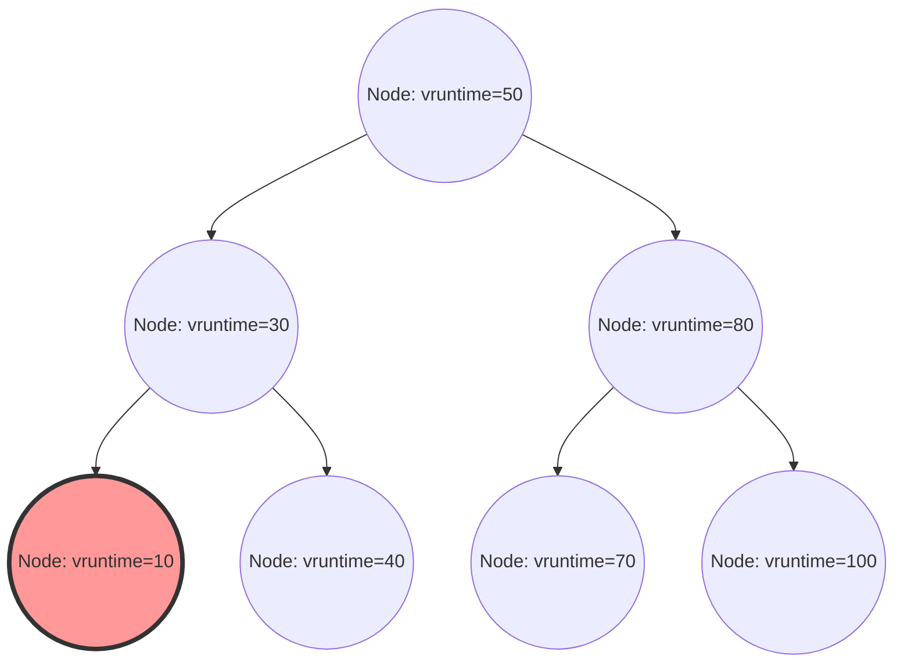

En el kernel de Linux, uno de los componentes más importantes que determina el rendimiento, el rendimiento global (throughput) y la capacidad de respuesta de todo el sistema es el planificador de procesos (scheduler). El "Completely Fair Scheduler (CFS)", que ha reinado durante mucho tiempo como el planificador predeterminado en el Linux moderno (desde el kernel 2.6.23 hasta el 6.5), se considera una obra maestra que se alejó por completo de la planificación tradicional basada en heurísticas en busca de una "equidad perfecta" fundamentada en un modelo matemático estricto.

En este artículo, desde la perspectiva de la estructura interna del kernel de Linux y la teoría de planificación, explicaremos con gran detalle y a nivel de código fuente la arquitectura del CFS, el cálculo matemático del tiempo de ejecución virtual (vruntime), la gestión de la cola de ejecución (runqueue) mediante árboles rojo-negro (Red-Black Tree), el algoritmo de balanceo de carga en entornos multinúcleo y su evolución hacia EEVDF (Earliest Eligible Virtual Deadline First) introducido en las versiones más recientes a partir del kernel 6.6. Para los hackers del kernel, programadores de sistemas e ingenieros que se enfrentan a la optimización de rendimiento de bajo nivel, comprender profundamente la estructura interna del CFS es un paso inevitable.

## Capítulo 1: La historia de la evolución de los planificadores de Linux y el contexto del nacimiento de CFS

Para comprender profundamente la filosofía de diseño del CFS y su belleza, es necesario desentrañar a qué tipo de desafíos se enfrentaron los planificadores a lo largo de la historia del kernel de Linux y cómo evolucionaron. La evolución de los algoritmos de planificación también ha sido una historia de intensa lucha con el compromiso (trade-off) de los requisitos contradictorios entre el rendimiento global (cantidad de procesamiento por unidad de tiempo) y la latencia (tiempo de respuesta).

### Antes de la era del kernel 2.4: Los límites del planificador O(N) y el dilema basado en épocas

El planificador de la era de Linux 2.4 era simple, pero suficientemente capaz de manejar las cargas de trabajo estándar de su época. Este planificador adoptaba un algoritmo basado en épocas (Epoch), en el cual se asignaba una porción de tiempo (time slice) a cada proceso, y cuando todos los procesos agotaban su porción de tiempo, se iniciaba una nueva época.

Sin embargo, a medida que los sistemas multiprocesador comenzaron a generalizarse, este planificador comenzó a exponer fallas arquitectónicas fatales. Su complejidad computacional era $O(N)$ (donde N es el número de procesos ejecutables). El sistema entero tenía una única cola de ejecución (runqueue) global, y en cada planificación, escaneaba "todos los procesos" en la cola para determinar el mejor proceso (el de mayor prioridad dinámica) a ejecutar a continuación.
Aún más grave era el control de concurrencia (exclusión mutua). Debido a que toda la cola de ejecución estaba protegida por un único spinlock global (`runqueue_lock`), la competencia por el bloqueo se intensificó a medida que aumentaba el número de núcleos de la CPU. Mientras una CPU buscaba el siguiente proceso a ejecutar, todas las demás CPUs quedaban bloqueadas, desperdiciando valiosos ciclos de CPU esperando el spinlock (bucle de espera activa o busy loop), lo que causaba un grave cuello de botella en la escalabilidad (rebote de líneas de caché o cache line bouncing).

### Kernel 2.6: Ingo Molnar y la innovación del planificador O(1)

Para resolver fundamentalmente este problema de escalabilidad y complejidad computacional, el renombrado hacker del kernel Ingo Molnar introdujo el "planificador O(1)" durante el desarrollo del kernel Linux 2.6. Como su nombre indica, este planificador contaba con un algoritmo revolucionario que podía seleccionar el siguiente proceso en un tiempo constante $O(1)$, de forma totalmente independiente del número de procesos en el sistema.

El planificador O(1) tenía una cola de ejecución completamente independiente por CPU (Per-CPU Runqueue), eliminando el bloqueo global para mejorar drásticamente los problemas de escalabilidad en entornos multiprocesador. Cada cola de ejecución mantenía dos matrices de prioridad: un "Active array" (matriz activa) y un "Expired array" (matriz caducada). Las matrices consistían en listas enlazadas (`list_head`) para 140 niveles de prioridad (de 0 a 139, donde 0 a 99 eran para prioridades de tiempo real y 100 a 139 correspondían a valores nice normales).

La selección de procesos era extremadamente rápida. Se preparaba un mapa de bits por prioridad, estableciendo en 1 el bit de las prioridades donde existían procesos ejecutables. La CPU podía identificar la máxima prioridad en una cantidad constante de ciclos de reloj utilizando la "instrucción de búsqueda del bit más significativo" (como `bsfl` o `lzcnt` en x86) proporcionada por el hardware, permitiendo recuperar el proceso en la cabeza de esa lista de prioridad en tiempo $O(1)$. Cuando un proceso agotaba su porción de tiempo, pasaba a la "matriz caducada", y cuando la "matriz activa" se vaciaba, una nueva época comenzaba inmediatamente con solo intercambiar los punteros de ambas.

Sin embargo, aunque el planificador O(1) era perfecto en términos de rendimiento, conllevaba otro enorme dilema: "la determinación de la interactividad". Para mejorar la experiencia del usuario (como la respuesta del ratón y el dibujo fluido de ventanas) en un entorno de escritorio, el planificador intentaba adivinar mediante heurísticas (reglas empíricas) si un proceso estaba limitado por I/O (interactivo) o limitado por CPU (CPU-bound) basándose en la proporción de su tiempo de sueño y tiempo de ejecución pasados. A los procesos clasificados como interactivos se les otorgaba un aumento (bonus) en su prioridad dinámica y recibían un tratamiento especial: permanecían en la matriz activa incluso si habían agotado su porción de tiempo, en lugar de ser trasladados a la matriz caducada.
Esta lógica heurística se volvía cada vez más inescrutable y compleja con cada actualización de versión del kernel. En casos extremos, causaba comportamientos inexplicables, como saltos de audio severos en aplicaciones multimedia o procesos limitados por CPU cayendo en un estado de inanición (starvation) completo.

### RSDL de Con Kolivas y el cambio de paradigma hacia la equidad completa

Quien levantó la voz contra las extremadamente complejas heurísticas y los ajustes empantanados del planificador O(1) fue Con Kolivas, un anestesista que también trabajaba como hacker del kernel. Sostuvo que "la capacidad de respuesta del escritorio se puede mejorar realizando una distribución puramente equitativa, sin necesidad de lógicas de conjeturas complejas", y propuso parches en las listas de correo como el planificador Staircase y el planificador RSDL (Rotating Staircase Deadline).

Aunque el planificador RSDL de Kolivas nunca se integró en la línea principal, sus ideas sirvieron como una inspiración decisiva para Ingo Molnar. Molnar abandonó por completo el complejo código de cálculo dinámico de prioridad y las heurísticas del planificador O(1), y en tan solo unas semanas escribió un planificador totalmente nuevo, fundamentado en un único y hermoso principio: "dividir el tiempo de CPU de forma completamente equitativa entre los procesos". Éste es el "Completely Fair Scheduler (CFS)".
El CFS fue fusionado en la línea principal de Linux 2.6.23 y desde entonces ha continuado funcionando como el corazón de Linux por más de 15 años. Fue un cambio de paradigma crucial en la historia de los sistemas operativos, un regreso a un modelo matemático dejando atrás reglas empíricas complejas.

## Capítulo 2: Fundamentos matemáticos de la equidad completa (Fair Queuing) y el modelo GPS

El concepto de "Completely Fair (Equidad Completa)" en el CFS no es un simple eslogan, sino que está arraigado en un "modelo ideal de asignación de recursos" proveniente de la teoría de sistemas operativos y la teoría de redes.

### La utopía del modelo GPS (Generalized Processor Sharing)

La forma ideal en la teoría de planificación es un concepto llamado modelo GPS (Generalized Processor Sharing) o modelo de fluidos (Fluid).
Un procesador GPS ideal es un hardware virtual que ignora las restricciones físicas. Si existen $N$ procesos ejecutables en el sistema, el procesador GPS proporciona a cada proceso simultáneamente, en paralelo, de manera exacta $1/N$ de la potencia de CPU. En otras palabras, en lugar de "dividir temporalmente" el recurso de la CPU (time slicing) para ejecutarlos alternadamente, se "divide espacialmente" (o por rendimiento), indicando un estado en el que los procesos avanzan de manera continua y sin retrasos (retraso cero).

Cuando los procesos tienen diferencias en sus prioridades (peso: Weight), el modelo GPS se amplía al modelo Weighted Fair Queuing (WFQ). Cuando cada proceso $i$ en el sistema tiene un peso $w_i$, el proceso $i$ siempre recibe de forma "continua" una capacidad de procesamiento proporcional a la relación de su peso frente a la suma total de los pesos. Expresado en una fórmula, el ancho de banda de CPU $C_i$ que recibe el proceso $i$ es el siguiente:

$$
C_i = \text{CPU Total Capacity} \times \frac{w_i}{\sum_{j=1}^{N} w_j}
$$

En este modelo, la sobrecarga por los cambios de contexto es cero y un proceso siempre avanza consumiendo el ancho de banda de la CPU al que tiene derecho.

### Aproximación del GPS en tiempo discreto y el teorema fundamental del CFS

Sin embargo, en realidad, un núcleo de CPU físico real solo puede ejecutar una secuencia de instrucciones (hilo) simultáneamente en un momento dado (a excepción del SMT/Hyper-threading). Es físicamente imposible implementar el modelo GPS directamente en hardware físico.
Por lo tanto, al dividir el tiempo en fracciones finas y cambiar rápidamente entre procesos (multiplexación por división de tiempo), es necesario aproximar (emular) macroscópicamente el modelo GPS. Este es el principio básico del CFS, aplicando a la planificación de CPU el concepto de planificación de paquetes (WFQ) en enrutadores de red.

El algoritmo del CFS calcula y rastrea constantemente el "tiempo ideal de CPU" que habrían obtenido los procesos en ejecución en el sistema, si se estuvieran ejecutando en el procesador GPS ideal. Luego realiza la planificación seleccionando para la próxima ejecución el proceso con el mayor "error (retraso)" en comparación con el tiempo que realmente ha consumido en una CPU real.
Este reloj virtual para rastrear el "progreso en un procesador GPS ideal" es el "tiempo de ejecución virtual (vruntime)", que se explicará detalladamente en el Capítulo 3.

## Capítulo 3: Matemáticas y mecanismo de cálculo del tiempo de ejecución virtual (vruntime)

El núcleo del algoritmo del CFS, que lo rige todo, es una variable entera de 64 bits sin signo llamada `vruntime` (Virtual Runtime), la cual es mantenida por todos los procesos (más precisamente, la unidad básica de planificación, la `sched_entity`).
La regla de planificación del CFS no implica las complejas manipulaciones de matrices del planificador O(1) y es sorprendentemente simple.
**"Seleccionar y ejecutar a continuación siempre la tarea con el menor vruntime en la cola de ejecución"**

### Fórmula de conversión de valor nice a peso (Weight)

En Linux, para ajustar la prioridad de los procesos desde el espacio de usuario, se utilizan valores nice que van desde `-20` (máxima prioridad) hasta `19` (mínima prioridad). El valor predeterminado es `0`.
El CFS no utiliza directamente este valor nice en sus cálculos. En cambio, se convierte en un "peso (Weight)" que indica una relación relativa de asignación de CPU.

El requisito de diseño aquí era que "si un valor nice disminuye en 1 (la prioridad aumenta), obtiene aproximadamente un 10% más de tiempo de CPU en comparación con otros procesos, y si un valor nice aumenta en 1, obtiene aproximadamente un 10% menos". Para lograr esto matemáticamente, el peso está definido para cambiar de manera geométrica respecto a los valores nice. Específicamente, la relación de peso (multiplicador) entre valores nice adyacentes es aproximadamente $1.25$.
Dado que $1.25^3 \approx 1.953 \approx 2.0$, se deriva una hermosa relación donde una variación de 3 en el valor nice hace que el tiempo de CPU asignado a un proceso se duplique o se reduzca a la mitad.

En el código del kernel, en `kernel/sched/core.c`, se define estáticamente una tabla de búsqueda (lookup table) `sched_prio_to_weight` basada en esta teoría.

```c
const int sched_prio_to_weight[40] = {
 /* -20 */     88761,     71755,     56483,     46273,     36291,
 /* -15 */     29154,     23254,     18705,     14949,     11916,
 /* -10 */      9548,      7620,      6100,      4904,      3906,
 /*  -5 */      3121,      2501,      1991,      1586,      1277,
 /*   0 */      1024,       820,       655,       526,       423,
 /*   5 */       335,       272,       215,       172,       137,
 /*  10 */       110,        87,        70,        56,        45,
 /*  15 */        36,        29,        23,        18,        15,
};
```
El peso para una tarea con valor nice `0` está definido como `1024`, el cual se trata como la constante macro `NICE_0_LOAD` dentro del kernel. Todos los cálculos se realizan tomando este `1024` como referencia.

### Modelo matemático y fórmula de cálculo del incremento del vruntime

Cuando un proceso se ejecuta en una CPU física real por un tiempo real $\Delta exec$ (en nanosegundos), su `vruntime` aumenta de acuerdo con la siguiente fórmula:

$$
vruntime \mathrel{+}= \Delta exec \times \frac{NICE\_0\_LOAD}{weight}
$$

Consideremos el significado de esta ecuación aplicándola a valores nice específicos.

1. **Cuando el valor nice es `0` (peso `1024`)**:
   Será $\frac{1024}{1024} = 1$. Por lo tanto, el $vruntime$ avanza exactamente al mismo ritmo que el tiempo real $\Delta exec$. Si se ejecuta en tiempo real durante 10 ms, el vruntime también avanza 10 ms (10.000.000 ns).
2. **Cuando el valor nice es `-5` (peso `3121`, prioridad alta)**:
   Será $\frac{1024}{3121} \approx 0.328$. Es decir, el $vruntime$ aumenta solo a aproximadamente 1/3 de la velocidad del tiempo real. El hecho de que el vruntime aumente más despacio significa que puede mantenerse en estado de ser "el vruntime mínimo" en comparación con otros procesos por más tiempo, por lo que resultará en ocupar la CPU por más tiempo.
3. **Cuando el valor nice es `5` (peso `335`, prioridad baja)**:
   Será $\frac{1024}{335} \approx 3.05$. El $vruntime$ aumenta a un ritmo frenético, alrededor de 3 veces el tiempo real. Incluso con poco tiempo de ejecución, su vruntime aumentará drásticamente, lo que hará que sea superado rápidamente por otras tareas, cediendo su posición de "vruntime mínimo" y entregando la CPU.

De esta manera, el CFS normaliza el tiempo de ejecución físico con los "pesos" de cada proceso, comprimiéndolos en una única dimensión métrica absoluta `vruntime`, y logrando control de prioridad y equidad al mismo tiempo.

### Evitando divisiones en la implementación del kernel y usando aritmética de punto fijo

Si bien el modelo matemático es el descrito anteriormente, ejecutar una operación de división $\frac{1}{weight}$ (una instrucción de división) cada vez en las rutas de planificación profundas en el sistema operativo, invocadas decenas de miles de veces por milisegundo, supondría una penalización extremadamente grave para el rendimiento (un retraso de entre decenas y cientos de ciclos de reloj, especialmente en arquitecturas antiguas).

Por lo tanto, el kernel de Linux realiza una ingeniosa optimización para eliminar completamente las divisiones. Existe otra tabla de búsqueda `sched_prio_to_wmult` donde se ha calculado previamente $\frac{2^{32}}{weight}$ (el valor recíproco multiplicado por $2^{32}$). Reemplaza totalmente la división por medio de una multiplicación y un desplazamiento (shift) a la derecha de 32 bits (técnica básica de la aritmética de punto fijo).

```c
/* kernel/sched/fair.c : Estructura lógica de calc_delta_fair() */
static inline u64 calc_delta_fair(u64 delta, struct sched_entity *se)
{
    if (unlikely(se->load.weight != NICE_0_LOAD)) {
        /*
         * Evita la división; utiliza solo instrucciones de multiplicación y desplazamiento
         * para calcular delta = delta * (NICE_0_LOAD / weight)
         */
        delta = __calc_delta(delta, NICE_0_LOAD, &se->load);
    }
    return delta;
}
```
Cada vez que se produce una interrupción del temporizador (Tick) o un cambio de contexto, se llama a la función `update_curr()` de `kernel/sched/fair.c`, que mide con precisión el tiempo real de ejecución de la tarea actualmente en curso y actualiza el `vruntime` de manera estricta a través de la función anterior.

## Capítulo 4: Gestión de la cola de ejecución (Runqueue) con árboles rojo-negro (Red-Black Tree) y la entidad de planificación (Scheduling Entity)

Mientras que el planificador O(1) utilizaba matrices basadas en prioridades, el CFS adoptó una estructura de datos sofisticada conocida como "árbol rojo-negro" (Red-Black Tree, RB-tree), un tipo de árbol de búsqueda binario equilibrado.

### Estructura cfs_rq y abstracción de sched_entity

Cada CPU mantiene en memoria su propia estructura dedicada a la cola de ejecución del CFS, `struct cfs_rq`. Curiosamente, los objetos almacenados y planificados directamente en la cola de ejecución no son los descriptores de los procesos mismos, `task_struct`. El CFS abstrae aún más el objetivo de la planificación, tratándolos mediante una estructura denominada `struct sched_entity` (entidad de planificación).

Esta abstracción es sumamente importante. Significa que el CFS puede tratar de manera completamente transparente a un solo proceso, o a un conjunto de procesos agrupados por cgroups (Control Groups), de forma idéntica como una única `sched_entity`. De esta manera, se implementa elegantemente la planificación jerárquica de grupos (Group Scheduling).

### Operaciones en el árbol rojo-negro y complejidad computacional del algoritmo

El CFS almacena todas las entidades ejecutables de la cola de ejecución en un árbol rojo-negro, utilizando su `vruntime` como la clave (criterio de ordenación). Dada la naturaleza de un árbol de búsqueda binario, hay una regla: el nodo hijo izquierdo tiene un valor menor que su nodo padre, y el nodo hijo derecho tiene un valor mayor que su nodo padre.

- **Búsqueda (obtención) del mejor proceso**:
  La regla del CFS es: "Ejecutar a continuación siempre el que tenga el vruntime mínimo". En un árbol rojo-negro, el nodo mínimo se encuentra recorriendo desde la raíz siempre a la izquierda hasta llegar al extremo, es decir, el "nodo ubicado más a la izquierda e inferior en el árbol (`rb_leftmost`)".
  Cada vez que se inserta o elimina algo en el árbol, el CFS siempre mantiene en caché (guarda) el puntero a este nodo `rb_leftmost` (`cfs_rq->rb_leftmost`). Por lo tanto, en la operación del planificador para seleccionar el siguiente proceso a ejecutar (`pick_next_task_fair()`), no hay necesidad de explorar el árbol, y es suficiente con leer el puntero en caché, completando el proceso con una complejidad de $O(1)$.

- **Inserción y eliminación de nodos**:
  Cuando un proceso se despierta (Wake-up) del estado de sueño y se convierte en ejecutable, o cuando finaliza su ejecución, cede la CPU y vuelve a la cola, la complejidad computacional para insertarlo (`enqueue_entity()`) o eliminarlo (`dequeue_entity()`) del árbol rojo-negro es de $O(\log N)$, siendo N el número de elementos en la cola.
  En comparación con el planificador O(1), el orden de complejidad se ha deteriorado, pero debido a que el árbol rojo-negro siempre mantiene el equilibrio automático y limita la altura del árbol a $\log N$, incluso si hay decenas de miles de procesos en el sistema, la altura del árbol será solo de unas pocas decenas de niveles. Teniendo en cuenta la localidad de la caché, la sobrecarga práctica en los ciclos de CPU es extremadamente pequeña. Se demostró que este costo es mucho menor que el de ejecutar la compleja lógica heurística de un algoritmo O(1).


*Figura: Estructura lógica del árbol rojo-negro que utiliza vruntime como clave. Siempre se mantiene en caché el nodo más a la izquierda (vruntime=10) como el próximo proceso a ejecutar.*

### Medidas para evitar el desbordamiento (overflow) usando min_vruntime y correcciones al despertar

`vruntime` es un entero sin signo de 64 bits (`u64`) y aumenta constantemente en incrementos de nanosegundos. En servidores empresariales que operan continuamente durante largos periodos de tiempo, matemáticamente siempre existe la posibilidad de que se produzca un desbordamiento (overflow, también llamado wraparound, un fenómeno en el que el valor supera el límite y vuelve a 0).

Un problema que se presenta con mayor frecuencia en la práctica es cómo tratar los procesos recién creados, o aquellos que han estado dormidos durante mucho tiempo esperando por I/O y se despiertan horas después. Si el `vruntime` de estos procesos permanece en 0 o en un valor antiguo, resultaría un valor abrumadoramente menor en comparación con el `vruntime` actual de los otros procesos en el sistema (por ejemplo, billones de nanosegundos). En consecuencia, el CFS creería erróneamente que "este proceso no ha utilizado la CPU en absoluto y está en una situación de desventaja extrema", dándole el monopolio exclusivo de la CPU hasta que su `vruntime` alcance el de los otros procesos (provocando inanición o starvation en el resto).

Para evitar esto por completo, la estructura `cfs_rq` mantiene una variable de seguimiento vital llamada `min_vruntime`.
`min_vruntime` es la variable que realiza un seguimiento del menor `vruntime` entre todos los procesos presentes actualmente en esa cola de ejecución. Sin embargo, se le impone una regla estricta: **solo se permite un "incremento monótono"**. Es decir, nunca se puede retroceder en el tiempo.

- **Inicialización de procesos nuevos (en el momento del fork)**:
  Cuando se genera un nuevo proceso, su `vruntime` inicial no comienza desde cero; en su lugar, se ajusta (se inicializa con un offset) a un valor razonable basado en el `vruntime` del proceso padre o en el `min_vruntime` actual de la cola de ejecución.
- **Correcciones para procesos al despertar (Wake-up)**:
  Cuando un proceso que durmió largo rato despierta y vuelve a la cola de ejecución, se hace una estricta corrección en la función `enqueue_entity()`. Se compara el `vruntime` anterior del proceso con un valor obtenido al restar cierta penalización (calculada desde `sysctl_sched_latency`, etc.) al `min_vruntime` de la cola, y se elige el mayor de los dos.
  Es decir, se calcula `se->vruntime = max_vruntime(se->vruntime, cfs_rq->min_vruntime - valor_de_corrección)`, lo cual fuerza un "ascenso" en el tiempo para coincidir con el reloj general del sistema. Esto evita un monopolio indebido de la CPU tras el despertar de un largo letargo, a la vez que proporciona una bonificación adecuada de retraso para garantizar tiempos de respuesta rápidos tras sueños breves (por ejemplo, esperando una pulsación en el teclado).

Además, en las funciones internas de comparación del árbol rojo-negro en el kernel (`entity_before()`), cuando se comparan los tamaños de dos valores `u64`, no se realiza una comparación directa; primero se hace un "cast" a enteros de 64 bits con signo (`s64`) y luego se restan, usando el signo (positivo o negativo) del resultado para determinar su magnitud relativa. Este es un truco (hack) que aprovecha la aritmética modular en el complemento a dos. Siempre que la diferencia entre ambos valores sea inferior a $2^{63}$, se puede determinar el orden cronológico preciso, incluso si uno de los valores se desbordó (overflow) y volvió a 0. Esto neutraliza por completo el problema del wraparound.

## Capítulo 5: Balanceo de carga (Load Balancing) en multinúcleos y NUMA

En la arquitectura de hardware moderna, los procesadores de núcleo único (single-core) ya no existen, y lo común son arquitecturas de múltiples núcleos con decenas o cientos de ellos, y arquitecturas NUMA (Non-Uniform Memory Access) donde el retraso del acceso a la memoria depende de la distancia física.
Por muy perfecta que sea la equidad conseguida por el algoritmo de árbol rojo-negro del CFS en una única CPU, si una CPU tiene 100 procesos acumulados sufriendo en su cola mientras la CPU vecina está inactiva sin hacer nada (idle), el rendimiento total del sistema (throughput) será nefasto. Por este motivo, la migración de tareas y el balanceo de carga en entornos multinúcleo constituyen un subsistema de vital importancia.

### sched_domain y sched_group: Topologías jerárquicas complejas

El kernel de Linux abstrae y gestiona de forma eficiente la compleja topología de la CPU del hardware físico, construyendo estructuras de datos jerárquicas llamadas `sched_domain` y `sched_group`. Durante el inicio del sistema, se lee la información del hardware, mediante ACPI o Device Tree, y se construye un árbol jerárquico lógico.

Por ejemplo, imagínese un sistema con 2 sockets físicos (nodos NUMA), cada uno con 4 núcleos físicos, todos con SMT (como Hyper-Threading) habilitado, lo que da un total de 16 hilos lógicos. En este escenario, el planificador construye los siguientes niveles jerárquicos (dominios) de abajo a arriba:

1. **Dominio SMT (Simultaneous Multithreading)**:
   Es la capa más baja. Se encarga de equilibrar la carga entre los dos hilos lógicos que comparten un mismo núcleo físico. Dado que en este nivel las cachés L1/L2 y las unidades de ejecución están totalmente compartidas, el coste (penalización) de mover tareas aquí es el mínimo.
2. **Dominio MC (Multi-Core)**:
   Se encarga del balanceo de carga entre varios núcleos físicos ubicados en el mismo socket (encapsulado de la CPU). Puesto que normalmente comparten la caché de nivel 3 (LLC: Last Level Cache), la penalización debida a fallos de caché al mover tareas es moderada.
3. **Dominio NUMA**:
   Es la capa superior. Se encarga del balanceo de carga entre diferentes sockets físicos (nodos NUMA). Mover un proceso a través de este límite provoca que el acceso a la memoria usada por el proceso se convierta en un acceso a memoria remota, produciendo una grave degradación en la latencia. Por tanto, la penalización (resistencia) al movimiento se configura extremadamente alta.

El balanceo de carga (Load Balancing) se desencadena principalmente en dos momentos: en una ejecución periódica provocada por la interrupción del temporizador (Periodic Load Balance) y en una ejecución disparada justo antes de que la cola de ejecución de una CPU se quede vacía y la CPU esté a punto de entrar en reposo (NewIdle Load Balance).
El algoritmo recorre secuencialmente los dominios jerárquicos desde la base (SMT) hacia la cima (NUMA). En cada dominio, calcula la carga media de los `sched_group` miembros, e intentará mover (pull) tareas desde el grupo con más carga al grupo con menos carga (hacia el mismo núcleo que efectúa la comprobación) únicamente si se supera un umbral de penalización específico de ese dominio.

### Matemática del algoritmo PELT (Per-Entity Load Tracking)

Para comparar con exactitud la "carga entre grupos" durante el balanceo de carga, es indispensable, antes que nada, ser capaz de medir con exactitud la "carga de las tareas". Antiguamente, el kernel de Linux utilizaba un método muy aproximado de muestreo puntual de la cantidad de tareas formadas en la cola de ejecución (longitud de la cola). Con ese método no se podía estimar correctamente el peso de las tareas con cargas en ráfagas (burst), de las que se encienden y se apagan velozmente (ON/OFF), provocando migraciones erróneas.

Para solucionar este problema, se introdujo recientemente el algoritmo **PELT (Per-Entity Load Tracking)**, que mejoró drásticamente la precisión del planificador del kernel.
El algoritmo PELT rastrea y atenúa el "historial" de la cantidad de tiempo de CPU consumido por cada entidad (proceso o cgroup) en el pasado utilizando medias móviles de atenuación exponencial (EWMA: Exponentially Weighted Moving Average) a una resolución de milisegundos de forma constante.

La carga $L_t$ de una tarea en el tiempo $t$ se calcula por medio de la siguiente relación de recurrencia, en base al consumo de CPU en el período actual $C_t$ y a la carga acumulada del pasado $L_{t-1}$.

$$ L_t = C_t + y \times L_{t-1} $$

Donde $y$ es un factor de decaimiento (un valor estrictamente mayor a 0 y menor a 1). En el kernel de Linux, el valor de $y$ está ajustado de modo que la influencia del registro pasado se reduzca a la mitad en exactamente 32 milisegundos (vida media de 32 ms, o $y^{32} = 0.5$).
En virtud de ello, en cuanto una tarea empieza a usar la CPU, la cifra de carga asciende de forma suave, y cuando duerme (sleep), decrece suavemente. El indicador de carga, sumamente estable y preciso, proporcionado por PELT se utiliza directamente no sólo en el balanceo de carga del CFS, sino también para suministrar métricas al controlador de ahorro de energía que modifica dinámicamente la frecuencia de operación de la CPU (el gobernador Schedutil en cpufreq), convirtiéndose en la tecnología nuclear para lograr el equilibrio óptimo entre el rendimiento y la eficiencia energética.

### CFS Bandwidth Control (Control de ancho de banda: Cuotas y estrangulamiento / Throttling)

Una característica absolutamente vital como pilar de la infraestructura de nubes actual y de la tecnología de contenedores (Docker, Kubernetes) es el estricto límite en la utilización de los recursos de CPU mediado por cgroups (Bandwidth Control). El CFS contiene de serie un mecanismo de asignación de cuota de ancho de banda plenamente controlado.

El control de ancho de banda en el CFS está definido por dos parámetros: `cpu.cfs_period_us` (período) y `cpu.cfs_quota_us` (cuota/límite superior).
Por ejemplo, a un grupo de procesos pertenecientes a un cgroup donde el period se fijó en `100000` (100 ms) y la quota en `50000` (50 ms), tan sólo se les permitirá un uso total de un máximo de 50 ms (el 50% de un núcleo de CPU) de CPU física dentro de cada franja de tiempo de 100 ms.

A medida que el proceso se ejecuta, el kernel cronometra el tiempo de ejecución consumido mediante temporizadores de alta precisión y lo va sustrayendo de la cuota dispuesta para el cgroup. En cuanto los procesos exprimen por completo su cuota, se toman medidas drásticas. El CFS extraerá (dequeue) materialmente de los árboles rojo-negros a todas las entidades del cgroup y las aislará como inejecutables en una lista de reserva especial por hallarse en un estado de estrangulamiento ("Throttled").
Al caer en dicho estado, sin importar cuán imperiosamente solicite su ejecución el proceso, no se le brindará en modo alguno recurso de CPU. Cuando empieza el período (period) siguiente, salta el temporizador del hardware reponiendo al 100% las cuotas (refresh), momento en el cual las entidades aisladas tornarán a insertarse (enqueue) en el árbol rojo-negro, recuperando la marcha.
Este dispositivo de estrangulamiento resulta colosalmente firme y cumple el papel de blindaje definitivo frente al problema de "vecino ruidoso" (Noisy Neighbor Problem), consistente en que, en un medio multitenant, un contenedor determinado acabe saliéndose de control y fagocitando todos los recursos de la CPU a expensas de los otros.

## Capítulo 6: Planificador en tiempo real y su evolución hacia el novísimo EEVDF (Earliest Eligible Virtual Deadline First)

El entorno Linux posee su política de planificación en tiempo real (Real-Time, conformando un estándar POSIX: `SCHED_FIFO` y `SCHED_RR`), completamente escindida del CFS (encargado de los procesos normales: `SCHED_NORMAL`, `SCHED_BATCH` y `SCHED_IDLE`).
Los procesos de tiempo real tienen asignada una prioridad absoluta entre 0 y 99 (RT prio). En el hipotético caso de existir aunque sea uno solo de tales procesos de forma ejecutable en todo el sistema, a los procesos de CFS (albergados en el espacio de prioridad del 100 al 139) se les arrancará sin contemplaciones todo derecho de manejo en la CPU. El planificador de tiempo real no hace uso de los árboles rojo-negro, sino que es administrado mediante un rudimentario algoritmo $O(1)$ fundamentado en un bit-map y arreglos de prioridad, análogamente al planificador O(1), prestándose especialmente a menesteres que demanden una capacidad de reacción determinista y calibrada en microsegundos, aplicados frecuentemente a la acústica y el control industrial.

### Limitaciones arquitecturales de CFS y su omisión de la garantía de latencia (Retardo)

Pues bien, encuadrándolo en las circunstancias procesales comunes, el CFS materializó a un nivel literalmente insuperable la pretendida "equidad matemática cabal enfocada en el throughput prolongado". Sin embargo, conforme los sistemas iban refinándose y los requisitos de uso sobre entornos de escritorio o dispositivos móviles (Android) devinieron paulatinamente más perentorios, pronto empezó a revelarse el límite en la arquitectura general de diseño que adolecía del CFS con relación a una garantía: la de "garantizar una determinada latencia (tiempo de reacción) tasada en tan solo unos pocos milisegundos".

De descartar el tanteo heurístico por un crudo análisis exclusivo a los tamaños de vruntime (la piedra angular del CFS), brotaba la penalización: las tareas confinadas a I/O (una encomienda dedicada a dibujar parte de la interfaz y espoleada instantáneamente durante unas decenas de microsegundos ante la reactividad a un botón del teclado para acto seguido volver a dormirse) caían pasajeramente "sepultadas", y desplazadas, por un tropel de gravosas tareas constreñidas a la CPU (p. ej., a la codificación de video). Como resultado de un retraso arbitrario del calendario, estallaban episodios desagradables de lag o vibraciones de la UI (UI Jitter).
Tratando de aliviar esta lacra, los arquitectos del kernel remendaron el esquema matemático purista original anexando parámetros y mandos (`sysctl kernel.sched_wakeup_granularity_ns`, determinando umbrales de expropiación (pre-emption) al amanecer de los hilos, y `sched_min_granularity_ns`, etc.). Con adición paulatina y (curiosamente) acumulando nuevamente vastas porciones de código heurístico (como en las épocas de O(1)), se perpetró una perpetua reforma, la cual por desgracia nunca surtió un remedio radical en detrimento del paliativo sintomático que representaba, no dando lugar a una formal garantía algorítmica para la referida latencia.

### La revolución en Linux 6.6: Introducción del planificador EEVDF

Deseando zanjar definitivamente tan pertinaz dilema, merced al inconmensurable esfuerzo del encargado a sostener el CFS, Peter Zijlstra, y sus adláteres, el kernel Linux 6.6 propinó a los entresijos elementales una depuración cabal donde la totalidad del algoritmo se reemplazó unánimemente por un paradigma absolutamente inusitado, acuñado por el nombre de **EEVDF (Earliest Eligible Virtual Deadline First)**. Aun cuando en las trazas del código, para salvaguardar una simple retrocompatibilidad, pervive la nomenclatura primigenia de clase (como en `fair.c` o `sched_class fair_sched_class`), lo cierto es que la médula silogística y la propia esencia motriz mutaron desde lo hondo de su ser.

A decir verdad, EEVDF no es otra cosa que un algoritmo amparado por un ensayo pericial de raigambre longeva, expuesto académicamente en el año 1995 por los expertos Ion Stoica y Hussein Abdel-Wahab. En su haber recae un asombroso predicamento en su virtud, esto es, cohonesta lógicamente, mediante postulados de pura matemática, la "equidad (Fairness)" con respecto a los procesos en liza junto con la "Garantía fidedigna de Latencia (Latency Guarantee)".
En la heurística del algoritmo EEVDF, abjurando de una singular ponderación mediante `vruntime`, los dictámenes de las asignaciones temporales a la ejecución penden de la fiscalización y computación simultánea a dos vectores cardinales.

1. **Juzgamiento de Eligible Time (Tiempo Elegible) y Lag (Retraso)**:
   EEVDF cuantifica actualmente cuánto es el "Lag (Atraso)" de un proyecto si lo sopesáramos con aquel idealizado modelo GPS. Cuando dicho Lag en un hilo ostenta valores netamente positivos (es decir, la distribución genuina de CPU ha escatimado por debajo del ideal normativo pervirtiendo su causa real), dicho hilo asciende al rango de "Eligible (elegible o merecedor de ello)". De modo correlativo, todo hilo favorecido exageradamente al compás ideal y rebasando de consumo a los márgenes justicieros devendrá sin concesiones a la categorización de incapacitado, ajeno a elección.
2. **Cálculo del Virtual Deadline (Límite Virtual)**:
   Se trata del cómputo sobre un horizonte terminante y virtual; un mojón por el que una tarea deberá culminar de tragarse irremediablemente toda su parcela de tajada asignada de tiempo (time slice/CPU time), bajo la égida siempre virtual de un hipotético y prístino procesador GPS.

La providencia algorítmica dictaminada en las ordenanzas del EEVDF atestigua un grado infinitamente superior y majestuoso a lo preconizado en CFS, atendiéndose ahora a lo siguiente:
**"Dentro de la asamblea y cohorte que se engalana con el atributo de 'Eligible' (los dignos de merecer la acción), siempre se postulará inexcusablemente en primacía quien albergue la Virtual Deadline (Límite Virtual) más anticipada".**

Los beneficios de emigrar a esta nueva filosofía resultan indeciblemente formidables. Abatieron íntegramente las catervas de lógica heurística, las cuales concernían al evento del desperezamiento (wakeup), enraizadas a lo largo de décadas en CFS y conllevando sobre la masa de codificación unas dimensiones hipertrofiadas, erradicándolas radical e higiénicamente.
A mayores, se instrumentó institucionalmente el andamiaje a tenor de prescribir paladinamente la "magnitud de las porciones de tiempo (time slice) a solicitar" individualizadas por cada proceso, previsión en la agenda encaminada a patentarse a la larga para su disposición sobre los usuarios corrientes gracias a una extensión en los cgroups y un flamante comando de llamadas al sistema `sched_setattr`.
Por consiguiente, los proyectos atados a componentes reactivos de UI sumamente inmersivos en la exigencia de latencia ultracorta verán indefectiblemente despuntadas unas proyecciones de Límite Virtual sumamente inminentes, propinando al amparo axiomático y metódico del canon matemático un destronamiento insoslayable sobre las tareas gravosas, para incrustarse imperiosamente sobre la CPU. Ahora ya se domina absolutamente la esfera del micro-retraso (al rasante microscópico de los milisegundos), sin sacrificar en lo concerniente a un ápice el volumen del throughput del computador.

## Conclusión

El planificador Completamente Justo de Linux (CFS) y, paralelamente a él, el EEVDF (la cúspide en su evolución), detentan formidables ascendencias conceptuales anidadas a la conjunción perfecta del modelo GPS con las nociones incipientes de origen reticular del WFQ. Dicho de otro modo, esto simboliza para las disciplinas computacionales la encarnación suma y cenit culminante de la ingeniería informática, concretando estas virtudes con ataduras limitantes feroces de rendimiento encuadradas dentro del propio espacio protegido del kernel (kernel space), mediado y facilitado sobre una balanza y calibrado algebraico del `vruntime` apoyado insoslayablemente sobre el refinamiento dinámico natural de autoequilibramiento enarbolado en la morfología del árbol rojinegro (Red-Black tree).

Asomándose a la encrucijada de competencias por los cerrojos (lock contentions) que enlutaron el despunte de la era de los procesadores multiprocesador; tras tropezar en los pantanos empíricos de las heurísticas de los planificadores O(1); tras fraguar con CFS una epifanía al redil de las conjeturas del equitativismo purista, atracamos al apogeo y encarnación máxima de todos los sistemas con PELT. Esta técnica amparaba a las colosales mallas logarítmicas atisbadas a raíz del despegue en el pluriprocesamiento masivo o esquemas abigarrados de NUMA y por otro, la implantación a sangre fría mediante cgroups que dotó a la era Cloud de una asombrosa y severa sujeción del ancho de banda; todo esto discurrido con una imparable evolución indómita a cargo de sus promotores y arquitectos en pro del hallazgo del último grial con el EEVDF, un talismán de garantía irrefutable y tajante a nivel de retrasos y latencias.

No en balde, interiorizar hondamente el desarrollo y vicisitudes acontecidos en las entrañas de este componente del núcleo fundamental del Sistema Operativo, analizando al pormenor este laberinto orgánico amparado bajo rocas firmes de matemáticas puras, resulta a la sazón un armamento extraordinariamente vigoroso, no ceñido únicamente a la deleitación cognitiva. Propiciará el instinto previsor en favor del adivinamiento empírico de las trabas al comportamiento multifilar, detectará infaliblemente el cuello de botella general del sistema e inspirará brillantemente la orquestación a una sublime magnitud para arquitecturas superiores de toda plataforma aplicable.

Sin otro afán por ahondar a mayores, éste fue el viaje de introspección hacia los insondables y magnánimos parajes del Planificador: la entidad neural del kernel Linux providencial a gobernar el destino y la suerte de cada proceso existente.
