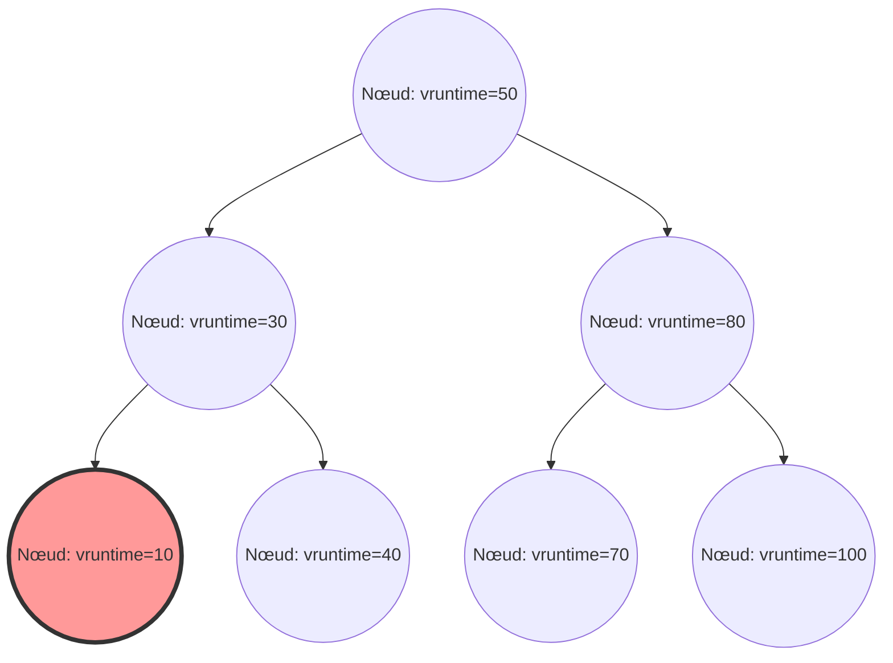

Dans le noyau Linux, l'un des composants les plus cruciaux qui détermine les performances globales du système, le débit et la réactivité, est le planificateur de processus (process scheduler). Le « Completely Fair Scheduler (CFS) », qui a régné en maître comme planificateur par défaut dans le Linux moderne (du noyau 2.6.23 jusqu'au 6.5), peut être considéré comme un chef-d'œuvre qui s'écarte complètement de la planification traditionnelle basée sur des heuristiques pour poursuivre une « équité totale » fondée sur des modèles mathématiques rigoureux.

Dans cet article, nous expliquerons en détail, avec une résolution au niveau du code source, l'architecture du CFS, les mathématiques du temps d'exécution virtuel (vruntime), la gestion de la file d'attente d'exécution (runqueue) à l'aide d'un arbre rouge-noir (Red-Black Tree), les algorithmes d'équilibrage de charge dans les environnements multicœurs, du point de vue de la structure interne du noyau Linux et de la théorie de la planification, ainsi que son évolution vers l'EEVDF (Earliest Eligible Virtual Deadline First) introduit dans les derniers noyaux à partir du 6.6. Pour les hackers du noyau, les programmeurs système et les ingénieurs s'attaquant au réglage des performances à bas niveau, une compréhension approfondie du fonctionnement interne du CFS est un passage obligé.

## Chapitre 1 : L'histoire de l'évolution du planificateur Linux et le contexte de la naissance du CFS

Afin de comprendre profondément la philosophie de conception du CFS et sa beauté, il est nécessaire de se pencher sur les défis rencontrés par le planificateur au cours de l'histoire du noyau Linux et sur son évolution. L'évolution des algorithmes de planification a également été l'histoire d'une lutte acharnée contre le compromis entre deux exigences contradictoires : le débit (quantité de traitement par unité de temps) et la latence (temps de réponse).

### Avant l'ère du noyau 2.4 : Les limites du planificateur O(N) et le dilemme basé sur l'époque

Le planificateur de l'époque de Linux 2.4 était simple mais tout à fait capable de gérer les charges de travail standard de ce temps. Ce planificateur adoptait un algorithme basé sur l'époque (Epoch), où une tranche de temps (time slice) était allouée à chaque processus, et une nouvelle époque commençait lorsque tous les processus avaient épuisé leurs tranches de temps.

Cependant, avec la démocratisation des systèmes multiprocesseurs, ce planificateur a commencé à révéler un défaut architectural fatal. Il s'agissait de sa complexité temporelle en $O(N)$ (où N est le nombre de processus exécutables). Le système entier ne possédait qu'une seule file d'attente d'exécution globale (runqueue), et à chaque planification, il devait parcourir « tous les processus » de la file d'attente pour déterminer le meilleur processus suivant à exécuter (celui avec la priorité dynamique la plus élevée).
L'exclusion mutuelle posait un problème encore plus grave. Puisque la file d'attente entière était protégée par un verrou tournant global unique (`runqueue_lock`), la contention pour le verrou s'intensifiait à mesure que le nombre de cœurs de processeur augmentait. Pendant qu'un CPU cherchait le prochain processus à exécuter, tous les autres CPU étaient bloqués, gaspillant de précieux cycles CPU en attente sur le verrou (busy loop), créant un goulot d'étranglement majeur de l'évolutivité (rebond de ligne de cache ou cache line bouncing).

### Noyau 2.6 : Ingo Molnar et l'innovation du planificateur O(1)

Pour résoudre radicalement ces problèmes d'évolutivité et de complexité temporelle, le célèbre hacker du noyau Ingo Molnar a introduit le « planificateur O(1) » lors du processus de développement du noyau Linux 2.6. Comme son nom l'indique, ce planificateur disposait d'un algorithme révolutionnaire capable de sélectionner le prochain processus en un temps constant $O(1)$, de manière totalement indépendante du nombre de processus dans le système.

Le planificateur O(1) a considérablement amélioré les problèmes d'évolutivité dans les environnements multiprocesseurs en disposant d'une file d'attente d'exécution complètement indépendante par CPU (Per-CPU Runqueue) et en éliminant le verrou global. Chaque file d'attente conservait deux tableaux avec priorités : le tableau « Active » et le tableau « Expired ». Les tableaux étaient constitués de listes chaînées (`list_head`) pour 140 niveaux de priorité (de 0 à 139, dont 0 à 99 pour les priorités temps réel, et 100 à 139 correspondant aux valeurs nice normales).

La sélection des processus est extrêmement rapide. Une carte de bits (bitmap) par priorité est préparée, et le bit de la priorité pour laquelle il existe des processus exécutables est mis à 1. Le CPU pouvait identifier la priorité la plus élevée en un temps d'horloge constant en utilisant l'instruction de recherche du bit de poids fort (comme `bsfl` ou `lzcnt` sur x86) fournie par le matériel, et récupérer le processus au début de cette liste de priorités en $O(1)$. Lorsqu'un processus épuisait sa tranche de temps, il était déplacé vers le tableau « Expired », et lorsque le tableau « Active » devenait vide, une simple permutation des pointeurs des deux tableaux démarrait immédiatement une nouvelle époque.

Cependant, bien que le planificateur O(1) fût parfait en termes de performances, il s'est heurté à un autre énorme dilemme : la « détermination de l'interactivité ». Pour améliorer l'expérience utilisateur dans les environnements de bureau (le suivi de la souris et la réactivité du dessin des fenêtres), le planificateur devinait par heuristique (règle empirique) si un processus était lié aux E/S (interactif) ou au CPU (CPU bound), à partir du ratio entre ses temps de sommeil et d'exécution passés. Les processus déterminés comme interactifs bénéficiaient d'un boost (bonus) de priorité dynamique et étaient traités de manière exceptionnelle, restant dans le tableau Active sans être déplacés vers le tableau Expired même si leur tranche de temps était épuisée.
Cette logique heuristique devenait de plus en plus complexe à chaque mise à jour de la version du noyau, causant dans certains cas limites des sautes de son graves dans les applications multimédias ou provoquant un comportement inexplicable où les processus liés au CPU étaient complètement affamés (starvation).

### Con Kolivas, le RSDL et le changement de paradigme vers une équité totale

Celui qui s'est opposé à l'heuristique extrêmement complexe et aux ajustements laborieux du planificateur O(1) fut Con Kolivas, un anesthésiste qui était également actif en tant que hacker du noyau. Il a fait valoir que « la réactivité du bureau peut être améliorée en effectuant simplement une allocation purement équitable, sans logique de devinette complexe », et a proposé des correctifs tels que le planificateur Staircase et le planificateur RSDL (Rotating Staircase Deadline) sur la liste de diffusion (ML).

Bien que le planificateur RSDL de Kolivas n'ait pas été intégré dans la branche principale, ses idées ont donné une inspiration décisive à Ingo Molnar. Ingo Molnar a complètement abandonné le calcul de la priorité dynamique complexe et le code heuristique du planificateur O(1), et a écrit en quelques semaines seulement un tout nouveau planificateur basé sur un principe simple et magnifique : « diviser le temps CPU de manière totalement équitable entre les processus ». C'est ainsi qu'est né le « Completely Fair Scheduler (CFS) ».
Le CFS a été fusionné dans la branche principale de Linux 2.6.23 et a continué à fonctionner comme le cœur de Linux pendant plus de 15 ans depuis. Il s'agissait d'un changement de paradigme extrêmement important dans l'histoire des systèmes d'exploitation, marquant un retour d'une règle empirique complexe à un modèle mathématique.

## Chapitre 2 : Les bases mathématiques de l'équité totale (Fair Queuing) et le modèle GPS

Le concept d'« équité totale » (Completely Fair) du CFS n'est pas un simple slogan, mais est enraciné dans un « modèle d'allocation de ressources idéal » issu de la théorie des systèmes d'exploitation et de la théorie des réseaux.

### L'utopie du modèle GPS (Generalized Processor Sharing)

L'idéal ultime dans la théorie de la planification est le concept appelé modèle GPS (Generalized Processor Sharing) ou modèle Fluide.
Un processeur GPS idéal est un matériel virtuel qui ignore les contraintes physiques. Lorsqu'il y a $N$ processus exécutables dans le système, le processeur GPS fournit simultanément, en parallèle et de manière exacte, $1/N$ de la puissance du CPU à chaque processus. En d'autres termes, il ne s'agit pas de « diviser dans le temps (time slice) » la ressource qu'est le CPU pour l'exécuter alternativement, mais de « la diviser spatialement (ou en termes de performance) » pour faire progresser les processus indéfiniment avec un délai nul.

S'il y a des différences de priorités (poids : Weight) entre les processus, le modèle GPS est étendu au Weighted Fair Queuing (WFQ). Lorsque chaque processus $i$ du système a un poids $w_i$, le processus $i$ reçoit toujours « continuellement » une capacité de traitement proportionnelle au rapport entre son propre poids et la somme de tous les poids. Exprimé mathématiquement, la bande passante CPU $C_i$ reçue par le processus $i$ est la suivante :

$$
C_i = \text{CPU Total Capacity} \times \frac{w_i}{\sum_{j=1}^{N} w_j}
$$

Dans ce modèle, la surcharge (overhead) de changement de contexte (context switch) est nulle, et le processus continue de progresser en consommant la bande passante CPU qui lui revient de droit à tout moment.

### L'approximation du GPS en temps discret et le théorème fondamental du CFS

Cependant, un cœur de CPU physique réel ne peut exécuter simultanément qu'une seule séquence d'instructions (thread) à un moment donné (hormis le SMT / Hyper-Threading). Implémenter le modèle GPS tel quel sur le matériel physique est impossible selon les lois de la physique.
Par conséquent, il est nécessaire d'approximer (émuler) le modèle GPS d'un point de vue macroscopique en divisant le temps en fines tranches et en changeant rapidement de processus (multiplexage par répartition dans le temps). C'est le principe fondamental du CFS, qui applique le concept de planification de paquets (WFQ) dans les routeurs de réseau à la planification du CPU.

L'algorithme du CFS calcule et suit en permanence le « temps CPU idéal » qu'aurait obtenu un processus en cours d'exécution sur le système s'il avait été exécuté sur un processeur GPS idéal. Ensuite, il effectue la planification pour exécuter le processus ayant la plus grande « erreur (retard) » par rapport au temps réellement consommé sur le CPU réel.
Cette horloge virtuelle permettant de suivre l'état de progression sur ce « processeur GPS idéal » n'est autre que le « temps d'exécution virtuel (vruntime) » expliqué en détail au chapitre 3.

## Chapitre 3 : Les mathématiques et les mécanismes de calcul du temps d'exécution virtuel (vruntime)

Le cœur de l'algorithme du CFS, qui régit tout, est une variable entière non signée sur 64 bits appelée `vruntime` (Virtual Runtime), conservée par tous les processus (plus précisément, l'unité de planification fondamentale `sched_entity`).
Les règles de planification du CFS sont étonnamment simples, dépourvues des opérations complexes sur les tableaux comme dans le planificateur O(1).
**« Toujours sélectionner la tâche avec le vruntime minimum dans la file d'attente d'exécution, et l'exécuter ensuite. »**

### Formule de conversion de la valeur nice au poids (Weight)

Sous Linux, pour ajuster la priorité d'un processus depuis l'espace utilisateur, on utilise une valeur nice allant de `-20` (priorité la plus élevée) à `19` (priorité la plus basse). La valeur par défaut est `0`.
Le CFS n'utilise pas directement cette valeur nice dans ses calculs. À la place, elle est convertie en un « poids (Weight) » indiquant le ratio relatif d'allocation du CPU.

L'exigence de conception ici était que « si la valeur nice diminue de 1 (la priorité augmente), le processus obtient environ 10 % de temps CPU en plus par rapport aux autres processus, et si la valeur nice augmente de 1, il en obtient environ 10 % de moins ». Pour réaliser cela mathématiquement, le poids est défini de sorte qu'il varie géométriquement par rapport à la valeur nice. Plus précisément, le ratio (multiplicateur) des poids entre des valeurs nice adjacentes est d'environ $1.25$.
Étant donné que $1.25^3 \approx 1.953 \approx 2.0$, une belle relation s'en déduit : un changement de 3 de la valeur nice signifie que le temps CPU alloué au processus est approximativement doublé ou divisé par deux.

Dans le noyau, dans `kernel/sched/core.c`, une table de recherche (lookup table) `sched_prio_to_weight` basée sur cette théorie est définie de manière statique.

```c
const int sched_prio_to_weight[40] = {
 /* -20 */     88761,     71755,     56483,     46273,     36291,
 /* -15 */     29154,     23254,     18705,     14949,     11916,
 /* -10 */      9548,      7620,      6100,      4904,      3906,
 /*  -5 */      3121,      2501,      1991,      1586,      1277,
 /*   0 */      1024,       820,       655,       526,       423,
 /*   5 */       335,       272,       215,       172,       137,
 /*  10 */       110,        87,        70,        56,        45,
 /*  15 */        36,        29,        23,        18,        15,
};
```
Le poids d'une tâche avec une valeur nice de `0` est défini comme `1024`, et est traité à l'intérieur du noyau en tant que macro-constante appelée `NICE_0_LOAD`. Tous les calculs sont basés sur ce `1024`.

### Modèle mathématique et formule d'augmentation du vruntime

Lorsqu'un processus est exécuté sur le CPU physique réel pendant un temps réel de $\Delta exec$ (en nanosecondes), le `vruntime` de ce processus augmente selon la formule mathématique suivante :

$$
vruntime \mathrel{+}= \Delta exec \times \frac{NICE\_0\_LOAD}{weight}
$$

Considérons ce que cette formule signifie en l'appliquant à des valeurs nice spécifiques.

1. **Si la valeur nice est `0` (poids `1024`)** :
   $\frac{1024}{1024} = 1$. Par conséquent, $vruntime$ augmente au même rythme exact que le temps réel $\Delta exec$. Si le processus s'exécute pendant un temps réel de 10 ms, le vruntime avance également de 10 ms (10 000 000 ns).
2. **Si la valeur nice est `-5` (poids `3121`, priorité élevée)** :
   $\frac{1024}{3121} \approx 0.328$. Cela signifie que le $vruntime$ n'augmente qu'à environ 1/3 du rythme du temps réel. Le fait que l'augmentation du vruntime soit plus lente signifie que le processus peut maintenir un état de « vruntime minimum » par rapport aux autres processus plus longtemps, lui permettant ainsi d'occuper le CPU pendant un laps de temps plus long au final.
3. **Si la valeur nice est `5` (poids `335`, faible priorité)** :
   $\frac{1024}{335} \approx 3.05$. Le $vruntime$ augmente à un rythme furieux, soit environ 3 fois celui du temps réel. Puisque le vruntime grandit rapidement après seulement un peu d'exécution, le processus sera vite dépassé par d'autres tâches, abandonnera la position de « vruntime minimum » et cèdera le CPU.

De cette manière, le CFS normalise le temps d'exécution physique par le « poids » de chaque processus, le ramenant à la dimension d'un indicateur absolu unique, le `vruntime`, réalisant ainsi simultanément le contrôle des priorités et l'équité.

### L'évitement des divisions dans l'implémentation du noyau et l'arithmétique en virgule fixe

Bien que le modèle mathématique soit décrit ci-dessus, exécuter une division (instruction de division) $\frac{1}{weight}$ à chaque fois dans le chemin critique du planificateur, qui est appelé des dizaines de milliers de fois par seconde au plus profond du noyau de l'OS, entraînerait une pénalité de performance extrêmement sévère (en particulier sur les anciennes architectures, causant un retard de dizaines à centaines de cycles d'horloge).

Par conséquent, le noyau Linux utilise une optimisation ingénieuse pour éliminer complètement la division. Il pré-calcule $\frac{2^{32}}{weight}$ (la réciproque multipliée par $2^{32}$) dans une autre table de recherche `sched_prio_to_wmult`, et remplace entièrement la division par une multiplication et un décalage vers la droite de 32 bits (technique de base de l'arithmétique en virgule fixe).

```c
/* kernel/sched/fair.c : structure logique de calc_delta_fair() */
static inline u64 calc_delta_fair(u64 delta, struct sched_entity *se)
{
    if (unlikely(se->load.weight != NICE_0_LOAD)) {
        /*
         * Évite la division, n'utilise que des instructions de multiplication et de décalage
         * pour calculer delta = delta * (NICE_0_LOAD / weight)
         */
        delta = __calc_delta(delta, NICE_0_LOAD, &se->load);
    }
    return delta;
}
```
À chaque interruption de la minuterie (Tick), ou à chaque changement de contexte, la fonction `update_curr()` dans `kernel/sched/fair.c` est appelée, mesurant précisément le temps d'exécution réel de la tâche en cours d'exécution, et le `vruntime` est strictement mis à jour à travers la fonction ci-dessus.

## Chapitre 4 : La gestion de la file d'attente d'exécution avec un arbre rouge-noir (Red-Black Tree) et les entités de planification

Alors que le planificateur O(1) utilisait une structure de tableaux par priorité, le CFS a adopté une structure de données sophistiquée appelée « arbre rouge-noir (Red-Black Tree, RB-tree) », qui est un type d'arbre binaire de recherche équilibré.

### Structure cfs_rq et abstraction de sched_entity

Chaque CPU maintient en mémoire sa propre structure de file d'attente CFS, `struct cfs_rq`. Fait intéressant, les objets stockés et planifiés directement dans la file d'attente d'exécution ne sont pas les structures `task_struct` représentant les processus eux-mêmes. Le CFS fait abstraction de la cible de la planification à un niveau supplémentaire, et la traite comme une structure appelée `struct sched_entity` (entité de planification).

Cette abstraction est extrêmement importante. En effet, elle permet au CFS de traiter de manière transparente, en tant que `sched_entity` identique et unique, que la cible planifiée soit un processus simple ou un groupe de processus regroupés via cgroups (Control Groups). Grâce à cela, la planification hiérarchique de groupes (Group Scheduling) est réalisée de manière élégante.

### Opérations sur l'arbre rouge-noir et complexité de l'algorithme

Le CFS stocke toutes les entités exécutables présentes dans la file d'attente d'exécution dans un arbre rouge-noir, en utilisant `vruntime` comme clé (critère de tri). De par la nature d'un arbre binaire de recherche, le nœud enfant de gauche est inférieur au nœud parent, et le nœud enfant de droite est supérieur.

- **Recherche (récupération) du meilleur processus** :
  La règle du CFS est : « Exécute toujours ensuite le processus avec le vruntime minimum ». Le nœud minimum dans l'arbre rouge-noir est celui situé à l'extrémité gauche en partant de la racine, c'est-à-dire le « nœud le plus en bas à gauche de l'arbre (`rb_leftmost`) ».
  Chaque fois qu'une insertion ou une suppression a lieu dans l'arbre, le CFS met toujours en cache et conserve le pointeur vers ce nœud `rb_leftmost` (`cfs_rq->rb_leftmost`). Par conséquent, le processus par lequel le planificateur sélectionne la tâche suivante à exécuter (`pick_next_task_fair()`) ne nécessite aucune recherche dans l'arbre ; il suffit de lire le pointeur mis en cache, ce qui donne une complexité temporelle de $O(1)$.

- **Insertion et suppression de nœuds** :
  Lorsqu'un processus se réveille du sommeil pour entrer dans un état exécutable, ou lorsqu'il termine son exécution et retourne dans la file d'attente en cédant le CPU, la complexité de l'insertion (`enqueue_entity()`) ou de la suppression (`dequeue_entity()`) dans l'arbre rouge-noir est de $O(\log N)$, où N est le nombre d'éléments dans la file.
  Bien que l'ordre de grandeur de la complexité soit moins bon comparé au planificateur O(1), l'arbre rouge-noir maintient toujours un auto-équilibrage, limitant la hauteur de l'arbre à $\log N$. Même s'il y a des dizaines de milliers de processus dans le système, la hauteur de l'arbre ne sera que de quelques dizaines de niveaux. En tenant compte également de la localité du cache, l'overhead en termes de cycles CPU en pratique est extrêmement minime, et il a été prouvé que c'était bien moins coûteux que d'exécuter la logique heuristique complexe de l'O(1).


*Figure : Structure logique d'un arbre rouge-noir avec vruntime comme clé. Le nœud le plus à gauche (vruntime=10) est toujours mis en cache comme prochain processus à exécuter.*

### Contre-mesures contre le débordement via min_vruntime et compensation au réveil

Le `vruntime` est un entier non signé sur 64 bits (`u64`) qui continue constamment à augmenter en nanosecondes. Dans les serveurs d'entreprise qui fonctionnent en continu sur de longues périodes, il existe toujours mathématiquement la possibilité d'un débordement (phénomène de wrap-around où la valeur dépasse la limite et revient à 0).

Un problème plus fréquent en pratique est le traitement des processus nouvellement créés, ou des processus se réveillant après un sommeil de plusieurs heures, en attente d'E/S par exemple. Si le `vruntime` de ces processus reste à 0 ou à une ancienne valeur, il devient extraordinairement petit comparé aux valeurs `vruntime` des autres processus du système (qui pourraient se chiffrer en milliers de milliards de nanosecondes). Par conséquent, le CFS croirait à tort que « ce processus n'a pas du tout utilisé le CPU et est dans une situation très désavantageuse », et lui permettrait de monopoliser complètement le CPU (affamant tous les autres processus) jusqu'à ce que son `vruntime` rattrape celui des autres.

Pour empêcher cela, la structure `cfs_rq` contient une variable de suivi vitale appelée `min_vruntime`.
Le `min_vruntime` suit le `vruntime` minimum parmi tous les processus résidant actuellement dans cette file d'attente, mais avec la règle stricte de **n'autoriser qu'une augmentation monotone**. En d'autres termes, il ne peut jamais reculer dans le temps.

- **Initialisation d'un nouveau processus (lors d'un fork)** :
  Lorsqu'un nouveau processus est créé, son `vruntime` initial ne commence pas à zéro. Il est compensé (initialisé) à une valeur raisonnable basée sur le `vruntime` du processus parent ou le `min_vruntime` de la file d'attente actuelle.
- **Compensation d'un processus au réveil (Wake-up)** :
  Lorsqu'un processus se réveille d'un long sommeil et retourne à la file d'attente d'exécution, une compensation stricte est effectuée à l'intérieur de la fonction `enqueue_entity()`. L'ancien `vruntime` du processus est comparé à la valeur du `min_vruntime` de la file d'attente à laquelle est soustraite une valeur de pénalité spécifique (calculée à partir de `sysctl_sched_latency`, etc.), et la plus grande des deux valeurs est retenue.
  Concrètement, `se->vruntime = max_vruntime(se->vruntime, cfs_rq->min_vruntime - valeur_de_compensation)`. Le temps est ainsi forcé vers le haut pour s'aligner sur l'horloge du système entier. Cela empêche le processus de monopoliser injustement le CPU à son retour d'un long sommeil, tout en accordant un bonus de retard raisonnable pour garantir la réactivité lors du retour d'un sommeil court (comme l'attente d'une entrée au clavier).

De plus, lors de la comparaison de deux valeurs `u64` dans la fonction de comparaison de l'arbre rouge-noir dans le noyau (`entity_before()`), elles ne sont pas comparées directement. Elles sont d'abord converties en entiers signés de 64 bits (`s64`) et soustraites, et l'ordre de grandeur est déterminé par le signe (positif ou négatif) du résultat. Il s'agit d'une astuce utilisant l'arithmétique modulaire de la représentation en complément à 2. Tant que la différence entre les deux valeurs est inférieure à $2^{63}$, la relation d'ordre temporel exacte peut être déterminée même si l'une a débordé et est revenue à 0, rendant ainsi le problème du wrap-around complètement inoffensif.

## Chapitre 5 : Le mécanisme de l'équilibrage de charge (Load Balancing) pour les multicœurs et NUMA

Dans les architectures matérielles modernes, les processeurs à un seul cœur n'existent plus. Les architectures multicœurs, avec des dizaines, voire des centaines de cœurs, et l'architecture NUMA (Non-Uniform Memory Access), où la latence d'accès à la mémoire dépend de la distance physique, sont devenues la norme.
Aussi parfaite que puisse être l'équité obtenue par l'algorithme de l'arbre rouge-noir du CFS sur un seul CPU, si une file d'attente de CPU gémit sous le poids de 100 processus accumulés tandis que le CPU voisin est inactif, le débit du système dans son ensemble sera déplorable. Par conséquent, la migration des tâches et l'équilibrage de charge dans les environnements multicœurs constituent un sous-système essentiel.

### La topologie hiérarchique complexe des sched_domain et sched_group

Le noyau Linux abstrait la topologie complexe du matériel physique du processeur et construit des structures de données hiérarchiques appelées `sched_domain` et `sched_group` pour la gérer efficacement. Au démarrage du système, il lit les informations matérielles depuis l'ACPI ou l'arborescence des périphériques (device tree) et construit une arborescence logique.

Imaginez, par exemple, un système avec 2 sockets physiques (nœuds NUMA), chacun avec 4 cœurs physiques, tous avec le SMT (Hyper-Threading, etc.) activé, totalisant 16 threads logiques. Dans ce cas, le planificateur construit la hiérarchie de domaines de bas en haut, comme suit :

1. **Domaine SMT (Simultaneous Multithreading)** :
   Le niveau le plus bas. Gère l'équilibrage de charge entre 2 threads logiques partageant le même cœur physique. Puisque les caches L1/L2 et les unités d'exécution sont complètement partagés à ce niveau, le coût (pénalité) du déplacement d'une tâche est minimal.
2. **Domaine MC (Multi-Core)** :
   Gère l'équilibrage de charge entre plusieurs cœurs physiques résidant sur le même socket physique (package CPU). En général, le cache L3 (LLC: Last Level Cache) est partagé, la pénalité de déplacement d'une tâche due à des échecs de cache est donc moyenne.
3. **Domaine NUMA** :
   Le niveau supérieur. Gère l'équilibrage de charge entre différents sockets physiques (nœuds NUMA). Déplacer un processus au-delà de cette limite signifie que l'accès à la mémoire utilisée par ce processus devient un accès mémoire distant, causant une détérioration sévère de la latence. La pénalité (résistance) de déplacement est donc réglée pour être extrêmement élevée.

L'équilibrage de charge (Load Balancing) est déclenché à deux moments : par une exécution périodique dictée par une interruption de minuterie (Periodic Load Balance), ou juste avant qu'une file d'attente de CPU ne se vide et passe en état d'inactivité (NewIdle Load Balance).
L'algorithme parcourt les domaines dans l'ordre, du bas de la hiérarchie (SMT) vers le haut (NUMA). Dans chaque domaine, il calcule la charge moyenne parmi les `sched_group` qui le composent. Seulement si cela dépasse le seuil de pénalité de chaque domaine, il extraira (pull) les tâches du groupe avec la charge la plus élevée vers le groupe avec la charge la plus faible (lui-même).

### Les mathématiques de l'algorithme PELT (Per-Entity Load Tracking)

Afin de comparer avec précision la « charge entre les groupes » lors de l'équilibrage, il faut d'abord pouvoir mesurer précisément la « charge de la tâche ». Les anciens noyaux Linux utilisaient une approche rudimentaire consistant à échantillonner instantanément le nombre de tâches alignées dans la file d'attente d'exécution (la longueur de la file). Cependant, il était impossible d'estimer correctement la charge des tâches de type "burst" qui s'allumaient et s'éteignaient rapidement, provoquant ainsi des migrations de tâches inappropriées.

La solution introduite récemment qui a considérablement amélioré la précision de la planification du noyau est l'algorithme **PELT (Per-Entity Load Tracking)**.
PELT est un algorithme qui suit et atténue constamment « l'historique » du temps CPU consommé par chaque entité (processus ou cgroup) avec une résolution milliseconde, en utilisant la moyenne mobile exponentielle pondérée (EWMA: Exponentially Weighted Moving Average).

La charge $L_t$ d'une tâche donnée à l'instant $t$ est calculée par la formule de récurrence suivante, en utilisant la consommation CPU de la période en cours $C_t$ et la charge accumulée par le passé $L_{t-1}$ :

$$ L_t = C_t + y \times L_{t-1} $$

Où $y$ est un facteur d'atténuation (supérieur à 0 et inférieur à 1). Dans le noyau Linux, la valeur de $y$ est ajustée de manière à ce que l'influence de l'historique passé soit exactement divisée par deux en 32 millisecondes (une demi-vie de 32 ms, $y^{32} = 0.5$).
En conséquence, la valeur de la charge augmente en douceur lorsqu'une tâche commence à consommer le CPU et s'atténue doucement lorsqu'elle se met en sommeil. La métrique de charge très précise et stable obtenue par PELT n'est pas seulement employée pour l'équilibrage de charge du CFS, elle est aussi directement alimentée au gouverneur d'économie d'énergie (gouverneur Schedutil de cpufreq) qui modifie dynamiquement la fréquence de fonctionnement du CPU, servant de technologie de base pour un équilibre optimal entre performances et efficacité énergétique.

### CFS Bandwidth Control (Contrôle de la bande passante : Quotas et Throttling)

Une fonctionnalité absolument indispensable dans les infrastructures cloud modernes et les technologies de conteneurs (Docker, Kubernetes) est la limitation stricte de l'utilisation des ressources CPU par le biais de cgroups (Bandwidth Control). Le CFS intègre un mécanisme d'allocation de bande passante rigoureusement contrôlé.

Le contrôle de la bande passante du CFS est défini par deux paramètres : `cpu.cfs_period_us` (la période) et `cpu.cfs_quota_us` (le quota/plafond).
Par exemple, un groupe de processus appartenant à un cgroup pour lequel la période est définie à `100000` (100 ms) et le quota à `50000` (50 ms) n'est autorisé à utiliser collectivement qu'un maximum de 50 ms de CPU physique (50 % d'un cœur CPU) dans une fenêtre de temps de 100 ms.

Lors de l'exécution d'un processus, le noyau utilise une minuterie haute précision pour mesurer le temps d'exécution consommé, et le déduit du quota alloué au cgroup. Lorsque les processus ont entièrement épuisé le quota, une mesure drastique est prise. Le CFS extrait (dequeue) physiquement toutes les entités appartenant à ce cgroup de l'arbre rouge-noir, et les isole dans une liste d'attente dédiée dans un état dit « étranglé » (Throttled) non exécutable.
Dans cet état, le processus ne se verra accorder aucun CPU, indépendamment de son désir d'exécution. Au début de la période suivante (period), une minuterie matérielle se déclenche, rechargeant intégralement (refresh) le quota, les entités isolées sont à nouveau insérées (enqueue) dans l'arbre rouge-noir, et l'exécution reprend.
Ce mécanisme de throttling est extrêmement robuste et agit comme un pare-feu infranchissable dans les environnements multilocataires pour empêcher le problème du « voisin bruyant (Noisy Neighbor Problem) », où un conteneur qui s'emballe accapare toutes les ressources CPU des autres conteneurs.

## Chapitre 6 : Le planificateur temps réel et l'évolution vers le nouvel EEVDF (Earliest Eligible Virtual Deadline First)

Linux possède des politiques de planification temps réel (Real-Time) conformes à la norme POSIX (`SCHED_FIFO`, `SCHED_RR`), qui sont totalement distinctes du CFS (pour les processus normaux : `SCHED_NORMAL`, `SCHED_BATCH`, `SCHED_IDLE`).
Les processus temps réel ont une priorité absolue allant de 0 à 99 (RT prio). Tant qu'il y a un seul processus temps réel exécutable sur le système, tous les processus du CFS (espace de priorité 100-139) sont complètement privés du droit d'exécution du CPU. Le planificateur temps réel n'utilise pas d'arbre rouge-noir, mais est géré par un algorithme $O(1)$ extrêmement simple utilisant des tableaux par priorité et des cartes de bits (bitmaps), à la manière de l'ancien planificateur O(1). Il est utilisé pour le contrôle industriel, le traitement audio, etc., qui exigent une réactivité déterministe à la microseconde près.

### Les limites structurelles du CFS et l'absence de garantie de latence (retard)

Or, dans un environnement de processus normaux, le CFS a littéralement atteint des performances quasi parfaites du point de vue de "l'équité mathématique totale dans le débit à long terme". Cependant, à mesure que les systèmes ont évolué et que les exigences des environnements de bureau et mobiles (comme Android) sont devenues plus strictes, les limites de l'architecture du CFS ont commencé à se manifester concernant la « garantie d'une latence (temps de réponse) spécifique en moins de quelques millisecondes ».

Le prix à payer pour l'approche du CFS, qui élimine l'heuristique et ne juge que par la taille du vruntime, était que les tâches liées aux E/S (par exemple, une tâche de rendu d'interface utilisateur qui s'exécute immédiatement pendant des dizaines de microsecondes en réponse à une frappe clavier de l'utilisateur, puis se rendort aussitôt) étaient temporairement « noyées » au milieu d'un essaim de tâches lourdes liées au CPU (comme de l'encodage vidéo). L'exécution était reléguée au second plan, entraînant des saccades inconfortables à l'écran (UI jitter).
Pour pallier cela, les développeurs du noyau ont patché le modèle mathématique pur du CFS, ajoutant des paramètres de réglage comme `sysctl kernel.sched_wakeup_granularity_ns` (le seuil de préemption au réveil) ou `sched_min_granularity_ns`, et ont continué (ironiquement, comme à l'époque du planificateur O(1)) d'ajouter à nouveau une multitude de minuscules codes heuristiques. Cependant, ce n'étaient que des traitements symptomatiques qui n'aboutissaient pas à une garantie mathématique fondamentale de la latence.

### La révolution de Linux 6.6 : L'introduction du planificateur EEVDF

Afin de mettre un terme à ce dilemme de longue date, grâce aux efforts considérables de Peter Zijlstra (mainteneur du CFS) et d'autres personnes, l'algorithme central du CFS a finalement été entièrement remplacé dans le noyau Linux 6.6 par un algorithme radicalement nouveau nommé **EEVDF (Earliest Eligible Virtual Deadline First)**. Bien que les noms de classe dans le code source (comme `fair.c` ou `sched_class fair_sched_class`) aient été conservés par souci de compatibilité, la logique en son cœur a été entièrement refondue.

L'EEVDF est en fait un algorithme issu d'un article académique historique publié en 1995 par Ion Stoica et Hussein Abdel-Wahab. Il possède la caractéristique phénoménale de réconcilier mathématiquement « l'équité (Fairness) » et la « garantie stricte de latence (Latency Guarantee) » pour les processus.
Au lieu du vruntime unique du CFS, l'algorithme EEVDF calcule et suit deux mesures temporelles importantes pour gérer l'exécution des processus.

1. **Détermination du Temps d'Éligibilité (Eligible Time) et du Retard (Lag)** :
   L'EEVDF calcule le « Retard (Lag) » qu'a un processus en comparaison avec le modèle GPS idéal. Un processus avec un retard positif (celui qui a reçu moins d'allocation CPU que l'idéal, en d'autres termes, traité injustement) est considéré comme « Éligible » (Eligible). Inversement, un processus qui a consommé plus de CPU que l'idéal n'est pas éligible.
2. **Calcul de la Date Limite Virtuelle (Virtual Deadline)** :
   Il calcule la date limite virtuelle à laquelle le processus est censé terminer la consommation de la tranche de temps (temps CPU) demandée, comme s'il était sur un processeur GPS idéal.

Les règles de planification de l'EEVDF sont un niveau au-dessus du CFS et sont les suivantes :
**« Parmi l'ensemble des tâches qui sont actuellement dans un état "Éligible" (Eligible), sélectionner celle dont la Virtual Deadline (Date limite virtuelle) est la plus proche pour l'exécuter ensuite. »**

Les avantages de ce changement d'algorithme vers l'EEVDF sont inestimables. La « multitude de logiques heuristiques concernant les réveils » qui s'était accumulée dans le CFS pendant des décennies, alourdissant le code de base, est devenue inutile et a été balayée (supprimée).
En outre, un cadre a été mis en place pour permettre aux processus de spécifier explicitement la « longueur de tranche de temps demandée » (cela devrait être mis à la disposition de l'espace utilisateur à l'avenir via des extensions de cgroups ou un nouvel appel système `sched_setattr`).
En conséquence, une Virtual Deadline extrêmement proche (rapide) est calculée et définie pour les tâches d'interface utilisateur interactives qui demandent une tranche de temps très courte. Ceci garantit mathématiquement qu'elles préempteront les tâches de calcul lourdes et seront exécutées instantanément. Il est devenu possible de contrôler totalement la micro-latence au niveau de la milliseconde sans sacrifier le débit.

## Conclusion

Le Completely Fair Scheduler (CFS) de Linux, et son évolution l'EEVDF, peuvent être qualifiés d'apogée du génie logiciel. Ils possèdent un fondement théorique profond dérivé du modèle GPS idéal et du WFQ issu du domaine des réseaux, réalisé grâce aux mathématiques du `vruntime` et de l'arbre rouge-noir (une structure de données auto-équilibrée sophistiquée) dans les contraintes de performances extrêmes de l'espace noyau.

Le CFS, né des défis posés par les contentions de verrouillage aux aurores de l'ère du multiprocesseur, passé par le piège de l'heuristique du planificateur O(1), a réussi à opérer un retour à l'équité mathématique. Puis, il s'est enrichi de l'intégration de l'algorithme PELT pour s'adapter à la complexité extrême des architectures multicœurs et NUMA, et de la réalisation d'un contrôle de bande passante strict via cgroups qui soutient l'ère du cloud. Aujourd'hui, avec l'EEVDF qui intègre le Saint Graal de la garantie absolue de latence, le planificateur Linux continue d'évoluer sans relâche.

Comprendre profondément les changements historiques et la structure interne étayée par les formules mathématiques du planificateur, cœur du système d'exploitation, ne satisfait pas seulement la soif de connaissances. C'est également une arme redoutable pour identifier les goulots d'étranglement des performances de l'ensemble du système, prévoir les comportements en programmation multithread et concevoir des architectures d'applications de haut niveau.

Ceci conclut notre exploration de ce monde profond qu'est le planificateur, centre nerveux du noyau Linux qui détient le destin de tous les processus.
