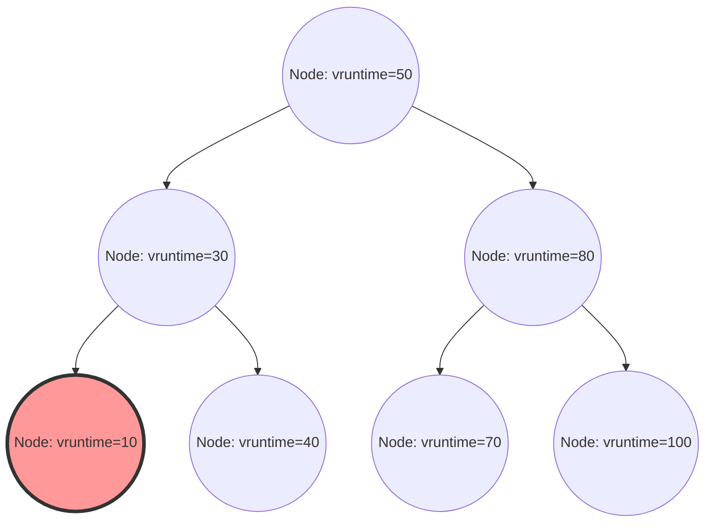

लिनक्स कर्नेल में, सिस्टम के समग्र प्रदर्शन, थ्रूपुट और प्रतिक्रियाशीलता को निर्धारित करने वाले सबसे महत्वपूर्ण घटकों में से एक प्रोसेस शेड्यूलर है। आधुनिक लिनक्स (कर्नेल 2.6.23 से 6.5 तक) में डिफॉल्ट शेड्यूलर के रूप में लंबे समय तक राज करने वाला "कम्प्लीटली फेयर शेड्यूलर (Completely Fair Scheduler - CFS)", पारंपरिक ह्यूरिस्टिक-आधारित शेड्यूलिंग से पूरी तरह दूर जाकर, सख्त गणितीय मॉडल पर आधारित "पूर्ण निष्पक्षता (complete fairness)" का अनुसरण करने वाली एक उत्कृष्ट कृति है।

इस लेख में, हम लिनक्स कर्नेल की आंतरिक संरचना और शेड्यूलिंग थ्योरी के दृष्टिकोण से CFS के आर्किटेक्चर, वर्चुअल रनटाइम (vruntime) की गणितीय गणना, रेड-ब्लैक ट्री (Red-Black Tree) द्वारा रनक्यू प्रबंधन, मल्टी-कोर वातावरण में लोड बैलेंसिंग एल्गोरिदम, और नवीनतम कर्नेल 6.6 और उसके बाद पेश किए गए EEVDF (Earliest Eligible Virtual Deadline First) में इसके विकास के बारे में सोर्स कोड स्तर के रिज़ॉल्यूशन के साथ बहुत विस्तार से चर्चा करेंगे। कर्नेल हैकर्स, सिस्टम प्रोग्रामर्स, और लो-लेवल परफॉर्मेंस ट्यूनिंग से निपटने वाले इंजीनियरों के लिए, CFS की आंतरिक संरचना को गहराई से समझना एक अनिवार्य मार्ग है।

## अध्याय 1: लिनक्स शेड्यूलर का विकास इतिहास और CFS की उत्पत्ति की पृष्ठभूमि

CFS के डिज़ाइन दर्शन और इसकी सुंदरता को गहराई से समझने के लिए, यह देखना आवश्यक है कि लिनक्स कर्नेल के इतिहास में शेड्यूलर को किन चुनौतियों का सामना करना पड़ा और यह कैसे विकसित हुआ। शेड्यूलिंग एल्गोरिदम का विकास भी थ्रूपुट (प्रति इकाई समय प्रसंस्करण मात्रा) और लेटेंसी (प्रतिक्रिया समय) की परस्पर विरोधी आवश्यकताओं के ट्रेड-ऑफ के साथ एक भयंकर संघर्ष का इतिहास रहा है।

### 2.4 कर्नेल युग से पहले: O(N) शेड्यूलर की सीमाएं और एपोक-आधारित दुविधा

लिनक्स 2.4 युग का शेड्यूलर सरल था, लेकिन उस समय के मानक वर्कलोड को संभालने के लिए पर्याप्त था। इस शेड्यूलर ने एपोक (Epoch) आधारित एल्गोरिदम को अपनाया था, जिसमें प्रत्येक प्रोसेस को एक टाइमस्लाइस आवंटित किया जाता था, और जब सभी प्रोसेस अपने टाइमस्लाइस का उपयोग कर लेते थे, तो एक नया एपोक शुरू होता था।

हालाँकि, जैसे-जैसे मल्टीप्रोसेसर सिस्टम लोकप्रिय होने लगे, इस शेड्यूलर ने गंभीर आर्किटेक्चरल खामियों को उजागर करना शुरू कर दिया। वह यह था कि इसकी जटिलता $O(N)$ (जहाँ N निष्पादन योग्य प्रक्रियाओं की संख्या है) थी। पूरे सिस्टम में केवल एक ग्लोबल रनक्यू (एग्जीक्यूशन वेटिंग क्यू) होता था, और प्रत्येक शेड्यूलिंग के समय क्यू में मौजूद "सभी प्रोसेस" को स्कैन करके, अगला निष्पादित होने वाला सबसे अच्छा प्रोसेस (सबसे अधिक डायनेमिक प्रायोरिटी वाला) तय किया जाता था।
इससे भी अधिक गंभीर एक्सक्लूसिव कंट्रोल (exclusive control) था। क्योंकि पूरा रनक्यू एक सिंगल ग्लोबल स्पिन लॉक (`runqueue_lock`) द्वारा संरक्षित था, CPU कोर की संख्या बढ़ने के साथ ही लॉक के लिए प्रतिस्पर्धा तीव्र हो गई। जब एक CPU अगला प्रोसेस खोजने में लगा होता था, तो अन्य सभी CPU ब्लॉक हो जाते थे, और मूल्यवान CPU साइकिल स्पिन लॉक के इंतज़ार (बिज़ी लूप) में बर्बाद हो जाते थे, जिससे स्केलेबिलिटी में एक गंभीर अड़चन (कैश लाइन बाउंसिंग) पैदा हुई।

### 2.6 कर्नेल: Ingo Molnar और O(1) शेड्यूलर का नवाचार

इस स्केलेबिलिटी और कम्प्यूटेशनल जटिलता की समस्या को जड़ से हल करने के लिए, लिनक्स 2.6 कर्नेल के विकास के दौरान प्रसिद्ध कर्नेल हैकर Ingo Molnar द्वारा "O(1) शेड्यूलर" पेश किया गया था। जैसा कि इसके नाम से पता चलता है, यह शेड्यूलर सिस्टम में प्रोसेस की संख्या पर बिल्कुल भी निर्भर नहीं था, और इसमें हमेशा निरंतर समय (constant time) $O(1)$ में अगले प्रोसेस का चयन करने में सक्षम होने का एक क्रांतिकारी एल्गोरिदम था।

O(1) शेड्यूलर में प्रत्येक CPU (प्रोसेसर) के लिए पूरी तरह से स्वतंत्र रनक्यू (Per-CPU Runqueue) था, और ग्लोबल लॉक को हटाकर मल्टीप्रोसेसर वातावरण में स्केलेबिलिटी की समस्याओं में नाटकीय रूप से सुधार किया। प्रत्येक रनक्यू दो प्राथमिकता-आधारित एरे (priority arrays) बनाए रखता था: "Active एरे" और "Expired एरे"। एरे को 140 प्राथमिकता स्तरों (0-139, जिसमें 0-99 रीयल-टाइम प्राथमिकताएं हैं, और 100-139 सामान्य nice मूल्यों के अनुरूप हैं) के लिए लिंक्ड लिस्ट (`list_head`) से बनाया गया था।

प्रोसेस का चयन अत्यंत तेज़ है। प्रत्येक प्राथमिकता के लिए एक बिटमैप तैयार किया जाता है, और जिस प्राथमिकता स्तर पर निष्पादन योग्य प्रोसेस मौजूद होते हैं, उस बिट को 1 पर सेट कर दिया जाता है। हार्डवेयर द्वारा प्रदान किए गए "फाइंड फर्स्ट सेट (find first set) निर्देश" (जैसे x86 का `bsfl` या `lzcnt`) का उपयोग करके, CPU एक स्थिर (constant) क्लॉक में उच्चतम प्राथमिकता की पहचान कर सकता है, और उस प्राथमिकता सूची की शुरुआत में स्थित प्रोसेस को $O(1)$ में प्राप्त कर सकता है। जब कोई प्रोसेस अपने टाइमस्लाइस का उपयोग कर लेता है, तो वह "Expired एरे" में चला जाता है, और जब "Active एरे" खाली हो जाता है, तो दोनों के पॉइंटर्स को स्वैप करके तुरंत एक नया एपोक शुरू कर दिया जाता है।

हालाँकि, O(1) शेड्यूलर प्रदर्शन के मामले में एकदम सही था, लेकिन इसे "इंटरैक्टिविटी के निर्धारण" नामक एक और बड़ी दुविधा का सामना करना पड़ा। डेस्कटॉप वातावरण में उपयोगकर्ता अनुभव (माउस ट्रैकिंग और विंडो रेंडरिंग रिस्पॉन्सिबिलिटी) को बेहतर बनाने के लिए, शेड्यूलर ह्यूरिस्टिक (अनुभवजन्य नियमों) के माध्यम से अनुमान लगाता था कि क्या कोई प्रोसेस I/O बाउंड (इंटरैक्टिव) है या CPU बाउंड, यह उनके पिछले स्लीप टाइम और रन टाइम के अनुपात से होता था। इंटरैक्टिव माने जाने वाले प्रोसेस को डायनेमिक प्रायोरिटी बूस्ट (बोनस) दिया जाता था, और उनके टाइमस्लाइस खत्म होने के बावजूद उन्हें Expired एरे में ले जाने के बजाय Active एरे में रखने का विशेष उपचार (special handling) किया जाता था।
यह ह्यूरिस्टिक लॉजिक कर्नेल के हर नए संस्करण के साथ अधिक जटिल और विचित्र होता गया, और एज केसेस (edge cases) में इसके कारण मल्टीमीडिया एप्लिकेशनों में गंभीर ऑडियो ड्रॉपआउट्स और CPU बाउंड प्रोसेस के पूरी तरह से भुखमरी (starvation) का शिकार होने जैसे अजीब व्यवहार उत्पन्न हुए।

### Con Kolivas का RSDL और पूर्ण निष्पक्षता की ओर पैराडाइम शिफ्ट

बेहोशी करने वाले डॉक्टर (anesthesiologist) और कर्नेल हैकर Con Kolivas ने O(1) शेड्यूलर के बेहद जटिल ह्यूरिस्टिक्स और दलदल जैसे ट्यूनिंग पर आपत्ति जताई। उन्होंने तर्क दिया, "जटिल अनुमान लॉजिक के बिना, केवल शुद्ध निष्पक्ष वितरण के माध्यम से डेस्कटॉप प्रतिक्रिया में सुधार किया जा सकता है," और मेलिंग लिस्ट (ML) में Staircase शेड्यूलर और RSDL (Rotating Staircase Deadline) शेड्यूलर जैसे पैच प्रस्तावित किए।

हालाँकि Kolivas के RSDL शेड्यूलर को कभी भी मेनलाइन (mainline) में शामिल नहीं किया गया, लेकिन इसके दर्शन ने Ingo Molnar को एक निर्णायक प्रेरणा दी। Ingo Molnar ने O(1) शेड्यूलर की जटिल डायनेमिक प्राथमिकता गणना और ह्यूरिस्टिक कोड को पूरी तरह से त्याग दिया, और केवल कुछ ही हफ्तों में "प्रोसेस के बीच CPU समय को पूरी तरह से निष्पक्ष रूप से विभाजित करने" के एकल, सुंदर सिद्धांत पर आधारित एक पूरी तरह से नया शेड्यूलर लिखा। यही है "कम्प्लीटली फेयर शेड्यूलर (CFS)"।
CFS को लिनक्स 2.6.23 में मेनलाइन में मर्ज किया गया था, और तब से यह 15 से अधिक वर्षों तक लिनक्स के दिल के रूप में काम करता आ रहा है। यह ओएस के इतिहास में एक अत्यंत महत्वपूर्ण पैराडाइम शिफ्ट था, जहाँ जटिल अनुभवजन्य नियमों से गणितीय मॉडल की ओर वापसी हुई।

## अध्याय 2: पूर्ण निष्पक्षता (Fair Queuing) की गणितीय नींव और GPS मॉडल

CFS की "कम्प्लीटली फेयर (पूर्ण निष्पक्षता)" की अवधारणा केवल एक नारा नहीं है, बल्कि ऑपरेटिंग सिस्टम सिद्धांत और नेटवर्क सिद्धांत में "आदर्श संसाधन आवंटन (ideal resource allocation) मॉडल" में निहित है।

### GPS (Generalized Processor Sharing) मॉडल का आदर्श रूप

शेड्यूलिंग थ्योरी में अंतिम आदर्श रूप वह अवधारणा है जिसे GPS (Generalized Processor Sharing) या फ्लूइड (Fluid) मॉडल कहा जाता है।
एक आदर्श GPS प्रोसेसर एक वर्चुअल हार्डवेयर है जो भौतिक बाधाओं को नज़रअंदाज़ करता है। यदि सिस्टम में $N$ निष्पादन योग्य प्रोसेस हैं, तो GPS प्रोसेसर लगातार सभी प्रोसेस को एक साथ, समानांतर रूप से, और ठीक $1/N$ CPU पावर प्रदान करता है। दूसरे शब्दों में, CPU संसाधनों को "समय के अनुसार विभाजित (टाइमस्लाइस)" करके बारी-बारी से निष्पादित करने के बजाय, यह स्थिति "स्थानिक (या प्रदर्शन के आधार पर) रूप से विभाजित" करने को दर्शाती है, जहाँ प्रोसेस को शून्य विलंब के साथ असीमित रूप से आगे बढ़ाया जाता है।

यदि प्रक्रियाओं में प्राथमिकताओं (Weight) का अंतर है, तो GPS मॉडल को Weighted Fair Queuing (WFQ) तक बढ़ाया जाता है। जब सिस्टम में प्रत्येक प्रोसेस $i$ का वजन $w_i$ होता है, तो प्रोसेस $i$ हमेशा कुल वजन के योग के सापेक्ष अपने वजन के अनुपात में "निरंतर" प्रसंस्करण शक्ति प्राप्त करता है। गणितीय रूप से, प्रोसेस $i$ द्वारा प्राप्त CPU बैंडविड्थ $C_i$ इस प्रकार है:

$$
C_i = \text{CPU Total Capacity} \times \frac{w_i}{\sum_{j=1}^{N} w_j}
$$

इस मॉडल में, कॉन्टेक्स्ट स्विच ओवरहेड शून्य है, और प्रोसेस हमेशा CPU बैंडविड्थ, जो उसका अधिकार है, का उपभोग करके आगे बढ़ता रहता है।

### डिस्क्रीट टाइम में GPS का अनुमान और CFS का मूल प्रमेय

हालाँकि, एक वास्तविक भौतिक CPU कोर किसी एक समय पर केवल एक ही निर्देश अनुक्रम (थ्रेड) निष्पादित कर सकता है (SMT/Hyper-Threading को छोड़कर)। भौतिक नियमों के अनुसार GPS मॉडल को सीधे भौतिक हार्डवेयर पर लागू करना असंभव है।
इसलिए, समय को छोटे स्लाइस में विभाजित करके और प्रक्रियाओं के बीच तेज़ी से स्विच करके (time-division multiplexing), मैक्रोस्कोपिक रूप से देखने पर GPS मॉडल का अनुमान लगाना (एम्यूलेट करना) आवश्यक है। यही वह मूल सिद्धांत है जिसने नेटवर्क राउटर में पैकेट शेड्यूलिंग (WFQ) की अवधारणा को CPU शेड्यूलिंग में लागू करके CFS का निर्माण किया।

CFS एल्गोरिदम हमेशा उस "आदर्श CPU समय" की गणना और ट्रैकिंग करता है जो सिस्टम पर चल रही प्रोसेस प्राप्त करती यदि वह एक आदर्श GPS प्रोसेसर पर चल रही होती। फिर यह उस प्रोसेस को अगले निष्पादन के लिए चुनता है जिसका वास्तविक CPU पर बिताए गए वास्तविक समय और इस आदर्श समय के बीच "त्रुटि (देरी)" सबसे अधिक है।
इस "आदर्श GPS प्रोसेसर पर प्रगति की डिग्री" को ट्रैक करने के लिए वर्चुअल घड़ी को "वर्चुअल रनटाइम (vruntime)" कहा जाता है, जिसे हम अध्याय 3 में विस्तार से समझाएंगे।

## अध्याय 3: वर्चुअल रनटाइम (vruntime) का गणित और गणना तंत्र

CFS एल्गोरिदम का मूल जो हर चीज़ को नियंत्रित करता है, वह `vruntime` (Virtual Runtime) नामक एक अनसाइंड 64-बिट इंटीजर चर है, जिसे सभी प्रोसेस (या अधिक सटीक रूप से, शेड्यूलिंग की मूल इकाई `sched_entity`) द्वारा रखा जाता है।
CFS शेड्यूलिंग नियम आश्चर्यजनक रूप से सरल है और इसमें O(1) शेड्यूलर जैसे जटिल एरे ऑपरेशन्स नहीं होते हैं।
**"हमेशा रनक्यू में सबसे कम vruntime वाले टास्क का चयन करें और उसे अगले निष्पादित करें"**

### nice वैल्यू से वज़न (Weight) में रूपांतरण सूत्र

लिनक्स में, यूजर स्पेस से प्रोसेस की प्राथमिकता को समायोजित करने के लिए `-20` (उच्चतम प्राथमिकता) से `19` (न्यूनतम प्राथमिकता) तक के nice वैल्यू का उपयोग किया जाता है। डिफ़ॉल्ट मान `0` है।
CFS में, गणना के लिए इस nice वैल्यू का सीधे उपयोग नहीं किया जाता है। इसके बजाय, इसे "वज़न (Weight)" में परिवर्तित किया जाता है जो सापेक्ष CPU आवंटन अनुपात को दर्शाता है।

यहां डिज़ाइन की आवश्यकता यह थी कि "यदि nice वैल्यू 1 से कम हो जाता है (प्राथमिकता बढ़ जाती है), तो इसे अन्य प्रोसेस की तुलना में लगभग 10% अधिक CPU समय मिलता है, और यदि nice वैल्यू 1 बढ़ जाता है, तो इसे लगभग 10% कम मिलता है।" इसे गणितीय रूप से प्राप्त करने के लिए, वज़न को nice वैल्यू के सापेक्ष ज्यामितीय प्रगति (geometric progression) के रूप में बदलने के लिए परिभाषित किया गया है। विशेष रूप से, आसन्न nice मानों के बीच वज़न का अनुपात (गुणक) लगभग $1.25$ सेट किया गया है।
चूंकि $1.25^3 \approx 1.953 \approx 2.0$, यह एक सुंदर संबंध बनाता है जहां nice वैल्यू में 3 के परिवर्तन का अर्थ है कि प्रोसेस को आवंटित CPU समय लगभग दोगुना या आधा हो जाता है।

कर्नेल के भीतर `kernel/sched/core.c` में, इस सिद्धांत पर आधारित एक लुकअप टेबल `sched_prio_to_weight` स्थिर रूप से परिभाषित है।

```c
const int sched_prio_to_weight[40] = {
 /* -20 */     88761,     71755,     56483,     46273,     36291,
 /* -15 */     29154,     23254,     18705,     14949,     11916,
 /* -10 */      9548,      7620,      6100,      4904,      3906,
 /*  -5 */      3121,      2501,      1991,      1586,      1277,
 /*   0 */      1024,       820,       655,       526,       423,
 /*   5 */       335,       272,       215,       172,       137,
 /*  10 */       110,        87,        70,        56,        45,
 /*  15 */        36,        29,        23,        18,        15,
};
```
nice वैल्यू `0` वाले टास्क का वज़न `1024` परिभाषित किया गया है, और इसे कर्नेल के भीतर `NICE_0_LOAD` मैक्रो स्थिरांक (macro constant) के रूप में माना जाता है। सभी गणनाएँ इस `1024` को आधार मानकर की जाती हैं।

### vruntime वृद्धि का गणितीय मॉडल और सूत्र

जब कोई प्रोसेस वास्तविक समय $\Delta exec$ (नैनोसेकंड में) के लिए वास्तविक भौतिक CPU पर चलता है, तो उस प्रोसेस का `vruntime` निम्नलिखित सूत्र के अनुसार बढ़ता है:

$$
vruntime \mathrel{+}= \Delta exec \times \frac{NICE\_0\_LOAD}{weight}
$$

आइए विचार करें कि विशिष्ट nice मानों पर लागू होने पर इस सूत्र का क्या अर्थ है।

1. **जब nice वैल्यू `0` (वज़न `1024`) हो**: 
   $\frac{1024}{1024} = 1$। इसलिए, $vruntime$ ठीक उसी गति से बढ़ता है जैसे वास्तविक समय $\Delta exec$। यदि इसे वास्तविक समय में 10ms के लिए निष्पादित किया जाता है, तो vruntime भी 10ms (10,000,000ns) आगे बढ़ता है।
2. **जब nice वैल्यू `-5` (वज़न `3121`, उच्च प्राथमिकता) हो**:
   $\frac{1024}{3121} \approx 0.328$। यानी, $vruntime$ वास्तविक समय की तुलना में केवल 1/3 गति से बढ़ता है। vruntime की धीमी वृद्धि का अर्थ है कि यह अन्य प्रोसेस की तुलना में लंबे समय तक "न्यूनतम vruntime" की स्थिति बनाए रख सकता है, जिसके परिणामस्वरूप यह लंबे समय तक CPU पर कब्ज़ा कर सकता है।
3. **जब nice वैल्यू `5` (वज़न `335`, निम्न प्राथमिकता) हो**:
   $\frac{1024}{335} \approx 3.05$। $vruntime$ वास्तविक समय की गति के लगभग 3 गुना तेज़ गति से बढ़ता है। चूँकि केवल थोड़ा सा निष्पादन vruntime को तेज़ी से बढ़ाता है, यह जल्द ही अन्य कार्यों से आगे निकल जाएगा, "न्यूनतम vruntime" की स्थिति छोड़ देगा, और CPU को दूसरों को सौंप देगा।

इस तरह, CFS प्रत्येक प्रोसेस के "वज़न" से भौतिक निष्पादन समय को सामान्यीकृत करके इसे एकल पूर्ण मीट्रिक `vruntime` के आयाम में लाता है, इस प्रकार प्राथमिकता नियंत्रण और निष्पक्षता को एक साथ प्राप्त करता है।

### कर्नेल कार्यान्वयन में भाग (division) से बचना और फिक्स्ड-पॉइंट अर्थमेटिक

यद्यपि गणितीय मॉडल ऊपर वर्णित है, ओएस कर्नेल की गहराई में, एक शेड्यूलर पथ में जिसे हर मिलीसेकंड में हज़ारों बार कॉल किया जाता है, हर बार $\frac{1}{weight}$ के लिए भाग (division instruction) निष्पादित करना प्रदर्शन पर एक बहुत ही गंभीर दंड (penalty) लाता है (विशेषकर पुराने आर्किटेक्चर पर दर्जनों से लेकर सैकड़ों क्लॉक साइकिल की देरी)।

इसलिए, लिनक्स कर्नेल ने भाग से पूरी तरह बचने के लिए चतुर अनुकूलन (clever optimization) किया है। यह एक और लुकअप टेबल `sched_prio_to_wmult` तैयार करता है, जहाँ $\frac{2^{32}}{weight}$ (व्युत्क्रम (reciprocal) गुणा $2^{32}$) की पहले से गणना की गई है, और भाग को पूरी तरह से गुणन (multiplication) और 32-बिट राइट शिफ्ट (फिक्स्ड-पॉइंट गणित की एक बुनियादी तकनीक) से बदल देता है।

```c
/* kernel/sched/fair.c : calc_delta_fair() की तार्किक संरचना */
static inline u64 calc_delta_fair(u64 delta, struct sched_entity *se)
{
    if (unlikely(se->load.weight != NICE_0_LOAD)) {
        /*
         * भाग से बचें, और केवल गुणा और शिफ्ट निर्देशों का उपयोग करके
         * delta = delta * (NICE_0_LOAD / weight) की गणना करें
         */
        delta = __calc_delta(delta, NICE_0_LOAD, &se->load);
    }
    return delta;
}
```
हर बार जब टाइमर इंटरप्ट (Tick) होता है या कॉन्टेक्स्ट स्विच होता है, तो `kernel/sched/fair.c` में `update_curr()` फ़ंक्शन को कॉल किया जाता है, वर्तमान में चल रहे टास्क के वास्तविक निष्पादन समय को सटीक रूप से मापा जाता है, और उपरोक्त फ़ंक्शन के माध्यम से `vruntime` को सख्ती से अपडेट किया जाता है।

## अध्याय 4: रेड-ब्लैक ट्री (Red-Black Tree) द्वारा रनक्यू प्रबंधन और शेड्यूलिंग एंटिटीज

O(1) शेड्यूलर ने प्राथमिकता-विशिष्ट एरे संरचनाओं का उपयोग किया, जबकि CFS ने एक परिष्कृत डेटा संरचना "रेड-ब्लैक ट्री (Red-Black Tree, RB-tree)" को अपनाया, जो एक प्रकार का बैलेंस्ड बाइनरी सर्च ट्री (balanced binary search tree) है।

### cfs_rq स्ट्रक्चर और sched_entity का एब्स्ट्रैक्शन

प्रत्येक CPU मेमोरी में एक समर्पित CFS रनक्यू स्ट्रक्चर `struct cfs_rq` रखता है। दिलचस्प बात यह है कि रनक्यू में सीधे संग्रहीत और शेड्यूल किए गए ऑब्जेक्ट प्रोसेस स्वयं को दर्शाने वाले `task_struct` नहीं होते हैं। CFS शेड्यूलिंग के लक्ष्यों को एक कदम आगे अमूर्त (abstract) करता है और उन्हें `struct sched_entity` (शेड्यूलिंग एंटिटी) नामक एक स्ट्रक्चर के रूप में मानता है।

यह एब्स्ट्रैक्शन बेहद महत्वपूर्ण है। क्योंकि इसके कारण, चाहे शेड्यूल किया जाने वाला लक्ष्य एकल प्रोसेस हो या cgroups (कंट्रोल ग्रुप्स) द्वारा समूहीकृत प्रोसेस का संग्रह, CFS इसे पूरी तरह से समान `sched_entity` के रूप में पारदर्शी ढंग से संभाल सकता है। यह पदानुक्रमित समूह शेड्यूलिंग (Hierarchical Group Scheduling) को सुरुचिपूर्ण ढंग से सक्षम बनाता है।

### रेड-ब्लैक ट्री पर ऑपरेशन और एल्गोरिदम जटिलता

CFS रनक्यू में मौजूद सभी निष्पादन योग्य एंटिटीज को `vruntime` को कुंजी (सॉर्टिंग मानदंड) के रूप में उपयोग करके रेड-ब्लैक ट्री में संग्रहीत करता है। बाइनरी सर्च ट्री की प्रकृति के कारण, बाईं ओर के चाइल्ड नोड का मान पैरेंट नोड से कम होता है, और दाईं ओर के चाइल्ड नोड का मान पैरेंट नोड से बड़ा होता है।

- **सर्वश्रेष्ठ प्रोसेस खोजना (Fetch)**:
  CFS का नियम है "हमेशा सबसे छोटे vruntime वाले को अगली बार निष्पादित करें"। रेड-ब्लैक ट्री में सबसे छोटा नोड वह होता है जो रूट से बाईं ओर और फिर बाईं ओर जाने पर अंत में मिलता है, यानी "ट्री का सबसे बायां नोड (`rb_leftmost`)"।
  हर बार जब ट्री में कुछ डाला या हटाया जाता है, तो CFS हमेशा इस `rb_leftmost` नोड के पॉइंटर को कैश (cache) में रखता है (`cfs_rq->rb_leftmost`)। इसलिए, शेड्यूलर के लिए अगला प्रोसेस चुनने का कार्य (`pick_next_task_fair()`) ट्री को खोजने की आवश्यकता के बिना कैश किए गए पॉइंटर को पढ़कर ही $O(1)$ समय जटिलता में पूरा हो जाता है।

- **नोड को डालना (Insert) और हटाना (Delete)**:
  जब कोई प्रोसेस स्लीप स्टेट से जागता है (Wake-up) और निष्पादन योग्य स्थिति में आता है, या जब वह अपना निष्पादन समाप्त करता है और CPU को छोड़कर क्यू में वापस आता है, तो रेड-ब्लैक ट्री में उसे डालने (`enqueue_entity()`) या हटाने (`dequeue_entity()`) की कम्प्यूटेशनल जटिलता $O(\log N)$ होती है (जहाँ N क्यू में तत्वों की संख्या है)।
  O(1) शेड्यूलर की तुलना में, जटिलता का क्रम बदतर हो गया है, लेकिन चूँकि रेड-ब्लैक ट्री हमेशा खुद को संतुलित रखता है, और ट्री की ऊँचाई $\log N$ तक सीमित रहती है, भले ही सिस्टम में हज़ारों प्रोसेस हों, ट्री की ऊँचाई केवल कुछ दर्जन स्तरों की होगी। कैश लोकेलिटी पर विचार करने पर, व्यावहारिक CPU साइकल्स के रूप में ओवरहेड बहुत कम है, और यह साबित हो गया है कि यह O(1) के जटिल ह्यूरिस्टिक लॉजिक को निष्पादित करने की लागत से बहुत सस्ता है।


*चित्र: vruntime को कुंजी के रूप में उपयोग करने वाले रेड-ब्लैक ट्री की तार्किक संरचना। सबसे बायां नोड (vruntime=10) हमेशा अगले निष्पादित किए जाने वाले प्रोसेस के रूप में कैश किया जाता है।*

### min_vruntime के साथ ओवरफ्लो से निपटना और वेक-अप सुधार

`vruntime` एक 64-बिट अनसाइंड इंटीजर (`u64`) है जो नैनोसेकंड में लगातार बढ़ता रहता है। एंटरप्राइज़ सर्वर जो लंबे समय तक लगातार चलते हैं, उनमें गणितीय रूप से ओवरफ्लो (जहाँ मान सीमा से अधिक हो जाता है और 0 पर वापस आ जाता है, जिसे रैप-अराउंड कहा जाता है) होने की हमेशा संभावना होती है।

इससे भी अधिक व्यावहारिक और अक्सर समस्या पैदा करने वाली बात नई बनाई गई प्रक्रियाओं या उन प्रक्रियाओं का प्रबंधन है जो I/O आदि के इंतज़ार में लंबे समय तक सोने के बाद (घंटों बाद) जागती हैं। यदि इन प्रक्रियाओं का `vruntime` 0 या उनके पुराने मान पर रहता है, तो सिस्टम में मौजूद अन्य प्रक्रियाओं के `vruntime` (जैसे खरबों नैनोसेकंड) की तुलना में यह मान अत्यधिक छोटा होगा। नतीजतन, CFS गलत तरीके से यह मान लेगा कि "इस प्रोसेस ने बिल्कुल भी CPU का उपयोग नहीं किया है और यह बेहद वंचित स्थिति में है", और वह इस प्रोसेस को तब तक पूरी तरह से CPU पर एकाधिकार करने देगा जब तक कि इसका `vruntime` अन्य प्रक्रियाओं के बराबर न हो जाए (जिससे अन्य सभी प्रक्रियाएं भुखमरी का शिकार हो जाएंगी)।

इसे पूरी तरह से रोकने के लिए, `cfs_rq` स्ट्रक्चर में `min_vruntime` नामक एक महत्वपूर्ण ट्रैकिंग चर होता है।
`min_vruntime` वर्तमान में रनक्यू में मौजूद सभी प्रक्रियाओं के `vruntime` में से सबसे छोटे मान को ट्रैक करता है, लेकिन इस पर एक सख्त नियम लागू होता है कि **यह केवल "मोनोटोनिकली इंक्रीजिंग (monotonically increasing - केवल बढ़ सकता है)" होगा**। इसका मतलब है कि यह कभी भी अतीत की ओर पीछे नहीं जाता है।

- **नई प्रक्रियाओं का इनिशियलाइज़ेशन (fork के समय)**:
  जब कोई नया प्रोसेस बनाया जाता है, तो उसका प्रारंभिक `vruntime` शून्य से शुरू नहीं होता है, बल्कि इसे पैरेंट प्रोसेस के `vruntime` या वर्तमान रनक्यू के `min_vruntime` के आधार पर उचित मान पर ऑफसेट (इनिशियलाइज़) किया जाता है।
- **जागने वाली प्रक्रियाओं (Wake-up) का सुधार**:
  जब लंबे समय से सो रहा कोई प्रोसेस जागता है और रनक्यू में वापस आता है, तो `enqueue_entity()` फ़ंक्शन में सख्त सुधार किया जाता है। प्रोसेस के पुराने `vruntime` की तुलना एक विशेष पेनल्टी मान (जैसे `sysctl_sched_latency` से गणना की गई) को रनक्यू के `min_vruntime` से घटाकर प्राप्त मान से की जाती है, और दोनों में से बड़े मान का उपयोग किया जाता है।
  दूसरे शब्दों में, `se->vruntime = max_vruntime(se->vruntime, cfs_rq->min_vruntime - सुधार मान)` हो जाता है, और समय को जबरन "खींचकर" सिस्टम की समग्र घड़ी के साथ मिला दिया जाता है। यह लंबे समय तक सोने के बाद वापस आने पर अनुचित रूप से CPU पर एकाधिकार करने से रोकता है, जबकि छोटे स्लीप (जैसे कीबोर्ड इनपुट का इंतज़ार करना) से लौटने पर उचित देरी बोनस देकर प्रतिक्रियाशीलता सुनिश्चित करता है।

इसके अलावा, कर्नेल के भीतर रेड-ब्लैक ट्री के तुलना कार्यों (जैसे `entity_before()`) में, जब दो `u64` मानों की तुलना की जाती है, तो उन्हें सीधे तुलना करने के बजाय, पहले उन्हें साइन्ड 64-बिट इंटीजर (`s64`) में कास्ट किया जाता है और फिर घटाया जाता है, और परिणाम के धनात्मक या ऋणात्मक होने के आधार पर तुलना की जाती है। यह 2 के पूरक (2's complement) प्रतिनिधित्व के मॉड्यूलर अंकगणित का उपयोग करने वाला एक हैक है। जब तक दो मानों के बीच का अंतर $2^{63}$ से कम है, भले ही कोई एक मान ओवरफ्लो होकर 0 पर आ गया हो, सटीक समय अनुक्रम निर्धारित किया जा सकता है, जिससे रैप-अराउंड समस्या पूरी तरह से हानिरहित हो जाती है।

## अध्याय 5: मल्टी-कोर और NUMA में लोड बैलेंसिंग (Load Balancing) का तंत्र

आधुनिक हार्डवेयर आर्किटेक्चर में, सिंगल-कोर प्रोसेसर अब मौजूद नहीं हैं। दर्जनों से सैकड़ों कोर वाले मल्टी-कोर, और यहां तक कि NUMA (Non-Uniform Memory Access) आर्किटेक्चर जहां मेमोरी एक्सेस देरी भौतिक दूरी पर निर्भर करती है, अब आम हैं।
भले ही CFS का रेड-ब्लैक ट्री एल्गोरिदम सिंगल CPU पर कितनी भी सही निष्पक्षता क्यों न प्राप्त कर ले, लेकिन अगर किसी एक CPU की क्यू में 100 प्रोसेस फंसी हुई हैं और वह स्ट्रगल कर रहा है, जबकि बगल वाला CPU पूरी तरह से खाली (idle) है, तो समग्र सिस्टम थ्रूपुट बेहद खराब होगा। इसलिए, मल्टी-कोर वातावरण में टास्क माइग्रेशन और लोड बैलेंसिंग अत्यंत महत्वपूर्ण सबसिस्टम हैं।

### sched_domain और sched_group की जटिल पदानुक्रमित टोपोलॉजी

भौतिक हार्डवेयर की जटिल CPU टोपोलॉजी को अमूर्त करने और इसे कुशलता से प्रबंधित करने के लिए, लिनक्स कर्नेल `sched_domain` और `sched_group` नामक पदानुक्रमित डेटा संरचनाएं बनाता है। सिस्टम स्टार्टअप के समय, यह ACPI और डिवाइस ट्री से हार्डवेयर जानकारी पढ़ता है और एक तार्किक पदानुक्रमित ट्री का निर्माण करता है।

उदाहरण के लिए, कल्पना करें कि एक सिस्टम में 2 भौतिक सॉकेट (NUMA नोड) हैं, प्रत्येक सॉकेट में 4 भौतिक कोर हैं, और प्रत्येक कोर में SMT (Hyper-Threading आदि) सक्षम है, जिससे कुल 16 तार्किक थ्रेड बनते हैं। इस स्थिति में, शेड्यूलर नीचे से ऊपर तक निम्नलिखित पदानुक्रम (डोमेन) का निर्माण करेगा:

1. **SMT (Simultaneous Multithreading) डोमेन**:
   यह सबसे निचला स्तर है। यह एक ही भौतिक कोर को साझा करने वाले दो तार्किक थ्रेड्स के बीच लोड को संतुलित करता है। चूँकि L1/L2 कैश और निष्पादन इकाइयाँ यहाँ पूरी तरह से साझा की जाती हैं, टास्क को स्थानांतरित करने की लागत (पेनल्टी) न्यूनतम होती है।
2. **MC (Multi-Core) डोमेन**:
   यह एक ही भौतिक सॉकेट (CPU पैकेज) पर मौजूद कई भौतिक कोर के बीच लोड को संतुलित करता है। चूँकि वे आमतौर पर L3 कैश (LLC: Last Level Cache) साझा करते हैं, टास्क को स्थानांतरित करते समय कैश मिस के कारण होने वाली पेनल्टी मध्यम होती है।
3. **NUMA डोमेन**:
   यह शीर्ष स्तर है। यह विभिन्न भौतिक सॉकेट्स (NUMA नोड्स) के बीच लोड को संतुलित करता है। यदि किसी प्रोसेस को यहाँ स्थानांतरित किया जाता है, तो उस प्रोसेस द्वारा उपयोग की जा रही मेमोरी तक पहुँच रिमोट मेमोरी एक्सेस बन जाती है, जिससे भयंकर लेटेंसी होती है, इसलिए माइग्रेशन पेनल्टी (प्रतिरोध मान) बहुत अधिक सेट किया जाता है।

लोड बैलेंसिंग दो अवसरों पर ट्रिगर होती है: टाइमर इंटरप्ट के माध्यम से आवधिक निष्पादन (Periodic Load Balance), और जब किसी CPU का रनक्यू खाली हो जाता है और वह आइडल अवस्था में प्रवेश करने वाला होता है (NewIdle Load Balance)।
एल्गोरिदम डोमेन के पदानुक्रम को नीचे (SMT) से ऊपर (NUMA) तक ट्रेस करता है। प्रत्येक डोमेन में, यह संबंधित `sched_group` के बीच औसत लोड की गणना करता है, और सबसे अधिक लोड वाले समूह से सबसे कम लोड वाले समूह (स्वयं) में टास्क्स को खींचने (pull करने) का कार्य केवल तभी करता है जब डोमेन-विशिष्ट पेनल्टी सीमा पार हो जाती है।

### PELT (Per-Entity Load Tracking) एल्गोरिदम का गणित

लोड बैलेंसिंग के दौरान "समूहों के बीच लोड" की सटीक तुलना करने के लिए, पहली बात यह है कि "टास्क के लोड" को सटीक रूप से मापना संभव होना चाहिए। अतीत में, लिनक्स कर्नेल रनक्यू में इंतज़ार कर रहे कार्यों की संख्या (क्यू की लंबाई) का तुरंत नमूना लेने की एक बहुत ही सरल विधि का उपयोग करता था, लेकिन यह उन कार्यों के लोड का सटीक अनुमान नहीं लगा सकता था जो तेज़ी से चालू और बंद (bursty tasks) होते थे, जिससे अनुचित टास्क माइग्रेशन होता था।

इस समस्या को हल करने और कर्नेल की शेड्यूलिंग सटीकता में काफी सुधार करने के लिए हाल ही में जो एल्गोरिदम पेश किया गया, वह है **PELT (Per-Entity Load Tracking)**।
PELT एक ऐसा एल्गोरिदम है जो एक्सपोनेंशियल वेटेड मूविंग एवरेज (EWMA: Exponentially Weighted Moving Average) का उपयोग करके मिलीसेकंड के रिज़ॉल्यूशन पर प्रत्येक एंटिटी (प्रोसेस या cgroup) द्वारा अतीत में उपयोग किए गए CPU समय के "इतिहास" को लगातार ट्रैक और कम (decay) करता है।

समय $t$ पर एक टास्क का लोड $L_t$, वर्तमान अवधि में CPU की खपत $C_t$ और अतीत से संचित लोड $L_{t-1}$ का उपयोग करके निम्न पुनरावृत्ति संबंध (recurrence relation) द्वारा गणना की जाती है:

$$ L_t = C_t + y \times L_{t-1} $$

यहाँ $y$ डेके (decay) फैक्टर है (0 से अधिक और 1 से कम मान)। लिनक्स कर्नेल में, $y$ के मान को इस तरह समायोजित किया गया है कि पिछले इतिहास का प्रभाव ठीक 32 मिलीसेकंड (32ms की हाफ-लाइफ) में आधा हो जाता है ($y^{32} = 0.5$)।
परिणामस्वरूप, जब कोई टास्क CPU का उपयोग करना शुरू करता है, तो लोड वैल्यू सुचारू रूप से बढ़ता है, और जब वह स्लीप करता है, तो सुचारू रूप से घटता है। PELT द्वारा प्रदान किया गया अत्यंत सटीक और स्थिर लोड मीट्रिक न केवल CFS की लोड बैलेंसिंग में उपयोग किया जाता है, बल्कि यह सीधे पावर सेविंग गवर्नर (cpufreq के Schedutil गवर्नर) को भी दिया जाता है जो गतिशील रूप से CPU ऑपरेटिंग आवृत्ति को बदलता है, जिससे यह प्रदर्शन और शक्ति दक्षता के बीच इष्टतम संतुलन प्राप्त करने के लिए एक मुख्य तकनीक बन जाता है।

### CFS Bandwidth Control (बैंडविड्थ नियंत्रण: कोटा और थ्रॉटलिंग)

आधुनिक क्लाउड इन्फ्रास्ट्रक्चर और कंटेनर तकनीक (Docker, Kubernetes) की नींव के लिए बिल्कुल आवश्यक विशेषता cgroups के माध्यम से सख्त CPU संसाधन उपयोग सीमा (Bandwidth Control) है। CFS में एक पूरी तरह से नियंत्रित बैंडविड्थ आवंटन तंत्र शामिल है।

CFS बैंडविड्थ नियंत्रण को दो मापदंडों द्वारा परिभाषित किया गया है: `cpu.cfs_period_us` (अवधि) और `cpu.cfs_quota_us` (कोटा/सीमा)।
उदाहरण के लिए, यदि किसी cgroup के लिए period `100000` (100ms) और quota `50000` (50ms) सेट किया गया है, तो उस cgroup से संबंधित प्रक्रियाओं को 100ms की समय सीमा में कुल मिलाकर अधिकतम 50ms (1 CPU कोर का 50%) तक ही भौतिक CPU का उपयोग करने की अनुमति है।

जैसे ही प्रोसेस निष्पादित होता है, कर्नेल उच्च-सटीकता वाले टाइमर का उपयोग करके उपभोग किए गए निष्पादन समय को मापता है और इसे cgroup को आवंटित कोटा से घटाता रहता है। जब कोई प्रोसेस अपने कोटा का पूरी तरह से उपयोग कर लेता है, तो नाटकीय कार्रवाई की जाती है। CFS उस cgroup से संबंधित सभी एंटिटीज को रनक्यू के रेड-ब्लैक ट्री से भौतिक रूप से बाहर निकाल लेता है (dequeue), और उन्हें निष्पादन-अयोग्य "थ्रॉटल (Throttled)" अवस्था के रूप में एक समर्पित वेटिंग लिस्ट में अलग-थलग कर देता है।
इस अवस्था में, प्रोसेस को बिल्कुल भी CPU आवंटित नहीं किया जाएगा, चाहे वह कितना भी निष्पादित होना चाहे। जब अगली अवधि (period) शुरू होती है, तो एक हार्डवेयर टाइमर फायर होता है, कोटा पूरी तरह से रिफ्रेश हो जाता है, और अलग-थलग की गई एंटिटीज को फिर से रेड-ब्लैक ट्री में डाल (enqueue) दिया जाता है और निष्पादन फिर से शुरू हो जाता है।
यह थ्रॉटलिंग तंत्र बेहद मजबूत है, और मल्टी-टेनेंट वातावरण में विशिष्ट कंटेनरों को बेकाबू होने और अन्य कंटेनरों के CPU संसाधनों को खा जाने ("Noisy Neighbor Problem") से रोकने के लिए एक अभेद्य रक्षा दीवार के रूप में कार्य करता है।

## अध्याय 6: रीयल-टाइम शेड्यूलर और नवीनतम EEVDF (Earliest Eligible Virtual Deadline First) की ओर विकास

लिनक्स में रीयल-टाइम शेड्यूलिंग पॉलिसियां (`SCHED_FIFO`, `SCHED_RR`) हैं जो POSIX मानकों का अनुपालन करती हैं और सामान्य प्रक्रियाओं के लिए CFS (`SCHED_NORMAL`, `SCHED_BATCH`, `SCHED_IDLE`) से पूरी तरह अलग हैं।
रीयल-टाइम प्रक्रियाओं में 0-99 (RT prio) की पूर्ण प्राथमिकता होती है, और जब तक सिस्टम में एक भी निष्पादन योग्य रीयल-टाइम प्रोसेस मौजूद है, तब तक सभी CFS प्रक्रियाओं (100-139 की प्राथमिकता वाले) से पूरी तरह से CPU निष्पादन अधिकार छीन लिए जाते हैं। रीयल-टाइम शेड्यूलर रेड-ब्लैक ट्री का उपयोग नहीं करता है, बल्कि प्राथमिकता-विशिष्ट एरे और बिटमैप का उपयोग करके O(1) शेड्यूलर के समान अत्यंत सरल $O(1)$ एल्गोरिदम द्वारा प्रबंधित किया जाता है। इसका उपयोग औद्योगिक नियंत्रण और ऑडियो प्रोसेसिंग आदि में किया जाता है, जहाँ माइक्रोसेकंड-स्तर की नियतात्मक (deterministic) प्रतिक्रिया की आवश्यकता होती है।

### CFS की संरचनात्मक सीमाएं और लेटेंसी (देरी) की गारंटी की कमी

खैर, सामान्य प्रोसेस वातावरण में, CFS ने "दीर्घकालिक थ्रूपुट में गणितीय पूर्ण निष्पक्षता" के संदर्भ में वस्तुतः लगभग-संपूर्ण प्रदर्शन प्राप्त किया। हालाँकि, जैसे-जैसे सिस्टम विकसित हुए और डेस्कटॉप और मोबाइल वातावरण (जैसे Android) की आवश्यकताएं अधिक सख्त होती गईं, "कुछ मिलीसेकंड के भीतर विशिष्ट लेटेंसी (प्रतिक्रिया समय) की गारंटी" के दृष्टिकोण से CFS की आर्किटेक्चरल सीमाएं उजागर होने लगीं।

CFS, जिसने ह्यूरिस्टिक्स को हटा दिया और पूरी तरह से केवल vruntime के आधार पर निर्णय लिया, की कीमत यह थी कि I/O बाउंड टास्क (उदाहरण के लिए, UI रेंडरिंग टास्क जो उपयोगकर्ता के की-टच के जवाब में तुरंत कुछ माइक्रोसेकंड के लिए निष्पादित होते हैं और फिर से स्लीप में चले जाते हैं) कभी-कभी भारी CPU बाउंड टास्क (जैसे वीडियो एन्कोडिंग) के झुंड में "दब" जाते थे। चूंकि उनके शेड्यूलिंग क्रम को पीछे धकेल दिया जाता था, इसके कारण स्क्रीन पर अप्रिय हकलाहट (UI जिटर) हो सकती थी।
इसको कम करने के लिए, कर्नेल डेवलपर्स ने CFS के शुद्ध गणितीय मॉडल को पैच किया, `sysctl kernel.sched_wakeup_granularity_ns` (वेक-अप प्रीएम्पशन थ्रेशोल्ड) और `sched_min_granularity_ns` जैसे ट्यूनिंग पैरामीटर जोड़े, और कई सूक्ष्म ह्यूरिस्टिक कोड (विडंबना यह है कि O(1) युग की तरह) को जोड़ना जारी रखा। हालाँकि, ये केवल लक्षण-आधारित उपचार थे, और लेटेंसी की आवश्यक गणितीय गारंटी प्रदान नहीं कर पाए।

### लिनक्स 6.6 की क्रांति: EEVDF शेड्यूलर का परिचय

इस लंबे समय से चली आ रही दुविधा को समाप्त करने के लिए, CFS के मेंटेनर Peter Zijlstra और अन्य लोगों के अथक प्रयासों से, लिनक्स 6.6 कर्नेल में CFS के मुख्य एल्गोरिदम को पूरी तरह से एक नए एल्गोरिदम से बदल दिया गया जिसे **EEVDF (Earliest Eligible Virtual Deadline First)** कहा जाता है। हालाँकि सोर्स कोड में क्लास के नाम (जैसे `fair.c` और `sched_class fair_sched_class`) संगतता (compatibility) के लिए बनाए रखे गए, लेकिन मुख्य तर्क को मौलिक रूप से नया रूप दिया गया।

EEVDF वास्तव में एक ऐतिहासिक अकादमिक पेपर का एल्गोरिदम है जिसे 1995 में Ion Stoica और Hussein Abdel-Wahab द्वारा प्रकाशित किया गया था, और इसमें प्रोसेस के लिए "निष्पक्षता (Fairness)" और "लेटेंसी की सख्त गारंटी (Latency Guarantee)" को गणितीय रूप से एक साथ प्राप्त करने की आश्चर्यजनक विशेषता है।
EEVDF एल्गोरिदम में, CFS के एकल `vruntime` के बजाय, प्रक्रियाओं के निष्पादन को प्रबंधित करने के लिए दो महत्वपूर्ण अस्थायी मेट्रिक्स की गणना और ट्रैकिंग की जाती है।

1. **एलिजिबल टाइम (Eligible Time) का निर्धारण और लैग (Lag)**:
   EEVDF गणना करता है कि एक आदर्श GPS मॉडल की तुलना में किसी प्रोसेस में वर्तमान में कितना "लैग (देरी)" है। एक प्रोसेस जिसका लैग सकारात्मक है (अर्थात, आदर्श से कम CPU आवंटन प्राप्त हुआ है, या जिसके साथ अनुचित व्यवहार किया गया है) उसे "एलिजिबल (Eligible - योग्य)" माना जाता है। इसके विपरीत, वे प्रक्रियाएं जो आदर्श से अधिक CPU का उपभोग कर चुकी हैं, वे गैर-योग्य (non-eligible) स्थिति में होती हैं।
2. **वर्चुअल डेडलाइन (Virtual Deadline) की गणना**:
   यह उस वर्चुअल समय सीमा की गणना करता है जिस तक एक प्रोसेस द्वारा अनुरोधित टाइमस्लाइस (CPU समय) आदर्श GPS प्रोसेसर पर पूरा हो जाना चाहिए था।

EEVDF शेड्यूलिंग नियम CFS की तुलना में एक कदम अधिक उन्नत है, और इस प्रकार है:
**"वर्तमान में 'एलिजिबल' (योग्य) अवस्था में मौजूद कार्यों के सेट में से, सबसे तेज़ (Earliest) वर्चुअल डेडलाइन वाले टास्क को चुनें और उसे अगली बार निष्पादित करें"**

EEVDF एल्गोरिदम में जाने के लाभ अपार हैं। "वेक-अप से संबंधित कई ह्यूरिस्टिक लॉजिक्स", जो दशकों से CFS में जमा हो रहे थे और कोडबेस को फुला रहे थे, अनावश्यक हो गए और उन्हें हटा (डिलीट कर) दिया गया।
इसके अलावा, एक ऐसा ढांचा तैयार किया गया है जहाँ प्रत्येक प्रोसेस स्पष्ट रूप से अपने "अनुरोधित टाइमस्लाइस की लंबाई" को निर्दिष्ट कर सकता है (भविष्य में इसे cgroups एक्सटेंशन या नए `sched_setattr` सिस्टम कॉल के माध्यम से यूज़र स्पेस में उजागर करने की योजना है)।
नतीजतन, अत्यधिक कम टाइमस्लाइस की मांग करने वाले इंटरैक्टिव UI कार्यों के लिए एक बहुत ही निकट (प्रारंभिक) वर्चुअल डेडलाइन की गणना और निर्धारण किया जाता है, जिससे गणितीय रूप से यह गारंटी मिलती है कि वे भारी कम्प्यूटेशनल कार्यों को मज़बूती से प्रीएम्प्ट (preempt - बीच में रोकना) करेंगे और तुरंत निष्पादित होंगे। थ्रूपुट का त्याग किए बिना मिलीसेकंड के स्तर पर माइक्रो-लेटेंसी को पूरी तरह से नियंत्रित करना संभव हो गया है।

## निष्कर्ष

लिनक्स का कम्प्लीटली फेयर शेड्यूलर (CFS) और इसका उन्नत रूप EEVDF, आदर्श GPS मॉडल और नेटवर्क-व्युत्पन्न WFQ की गहन सैद्धांतिक पृष्ठभूमि रखते हैं। सॉफ्टवेयर इंजीनियरिंग के चरम के रूप में, वे `vruntime` के गणित और रेड-ब्लैक ट्री जैसी परिष्कृत स्व-संतुलन डेटा संरचना का उपयोग करके कर्नेल स्पेस की अत्यधिक प्रदर्शन बाधाओं के भीतर इसे साकार करते हैं।

मल्टीप्रोसेसर के शुरुआती दिनों में लॉक कंटेंशन के मुद्दों से शुरू होकर, O(1) शेड्यूलर के ह्यूरिस्टिक्स के जाल से गुज़रते हुए, CFS ने गणितीय निष्पक्षता में वापसी की। इसके अलावा, मल्टी-कोर और NUMA टोपोलॉजी की अत्यधिक जटिलता को संभालने के लिए PELT एल्गोरिदम का एकीकरण, और क्लाउड युग का समर्थन करने वाले cgroups के माध्यम से सख्त बैंडविड्थ नियंत्रण का कार्यान्वयन हुआ, और अब, ईईवीडीएफ (EEVDF) के साथ जिसमें लेटेंसी की पूर्ण गारंटी की अंतिम पवित्र चुनौती शामिल है, लिनक्स शेड्यूलर का विकास लगातार जारी है।

ऑपरेटिंग सिस्टम के मूल, शेड्यूलर के ऐतिहासिक विकास और इसके गणितीय रूप से समर्थित आंतरिक कामकाज को गहराई से समझना, न केवल किसी की बौद्धिक जिज्ञासा को संतुष्ट करेगा, बल्कि यह संपूर्ण सिस्टम के प्रदर्शन बाधाओं की पहचान करने, मल्टी-थ्रेडेड प्रोग्रामिंग में व्यवहार की भविष्यवाणी करने, और उन्नत एप्लिकेशन आर्किटेक्चर को डिज़ाइन करने में भी एक बहुत शक्तिशाली हथियार बन जाएगा।

यहाँ लिनक्स कर्नेल के मुख्य भाग, शेड्यूलर की अथाह दुनिया का अन्वेषण समाप्त होता है, जो सभी प्रक्रियाओं का भाग्य तय करता है।
