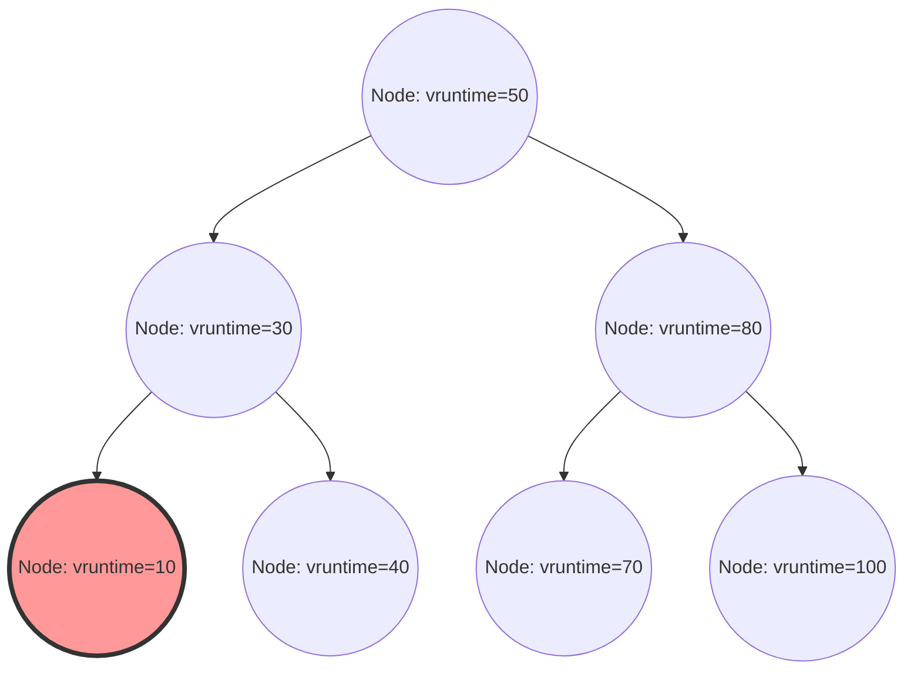

Di dalam kernel Linux, salah satu komponen terpenting yang menentukan performa, throughput, dan responsivitas sistem secara keseluruhan adalah penjadwal proses (process scheduler). "Completely Fair Scheduler (CFS)", yang telah mendominasi sebagai penjadwal default dalam Linux modern selama bertahun-tahun (dari kernel 2.6.23 hingga 6.5), dapat dikatakan sebagai mahakarya yang sepenuhnya meninggalkan penjadwalan berbasis heuristik tradisional demi mengejar "keadilan sempurna" berdasarkan model matematika yang ketat.

Artikel ini akan menjelaskan secara mendetail, pada tingkat resolusi kode sumber, mengenai arsitektur CFS, perhitungan matematis waktu eksekusi virtual (vruntime), manajemen runqueue melalui Pohon Merah-Hitam (Red-Black Tree), algoritma penyeimbangan beban (load balancing) di lingkungan multi-core, serta evolusi menuju EEVDF (Earliest Eligible Virtual Deadline First) yang diperkenalkan pada kernel terbaru 6.6 ke atas, dari perspektif struktur internal kernel Linux dan teori penjadwalan. Bagi para kernel hacker, pemrogram sistem, dan insinyur yang menantang penyetelan performa tingkat rendah, memahami secara mendalam struktur internal CFS adalah jalur yang tidak bisa dihindari.

## Bab 1: Sejarah Evolusi Penjadwal Linux dan Latar Belakang Lahirnya CFS

Untuk memahami secara mendalam filosofi desain CFS beserta keindahannya, kita perlu menelusuri tantangan apa saja yang dihadapi penjadwal dalam sejarah kernel Linux dan bagaimana penjadwal tersebut berevolusi. Evolusi algoritma penjadwalan juga merupakan sejarah pertempuran sengit melawan tarik-ulur (trade-off) antara dua kebutuhan yang saling bertentangan: throughput (jumlah pemrosesan per satuan waktu) dan latensi (waktu respons).

### Era Kernel 2.4 ke Bawah: Batas Penjadwal O(N) dan Dilema Berbasis Epoch

Penjadwal pada era Linux 2.4 cukup sederhana, namun mampu menangani beban kerja standar pada masa itu dengan baik. Penjadwal ini mengadopsi algoritma berbasis epoch (Epoch), di mana setiap proses dialokasikan irisan waktu (time slice), dan ketika semua proses telah menghabiskan time slice mereka, epoch baru akan dimulai.

Namun, ketika sistem multiprosesor mulai populer, penjadwal ini mulai memperlihatkan cacat arsitektur yang fatal. Kompleksitas komputasinya adalah $O(N)$ (di mana N adalah jumlah proses yang dapat dieksekusi). Sistem ini hanya memiliki satu runqueue (antrean tunggu eksekusi) global untuk seluruh sistem, dan setiap kali penjadwalan dilakukan, ia akan memindai "semua proses" di dalam antrean untuk menentukan proses paling optimal yang harus dieksekusi selanjutnya (yang memiliki prioritas dinamis tertinggi).
Masalah yang lebih serius adalah pada kontrol eksklusif (mutual exclusion). Karena seluruh runqueue dilindungi oleh sebuah spinlock global tunggal (`runqueue_lock`), seiring dengan bertambahnya jumlah core CPU, persaingan untuk mendapatkan kunci (lock) tersebut menjadi semakin intens. Sementara sebuah CPU sibuk mencari proses yang akan dieksekusi selanjutnya, semua CPU lain diblokir, mengakibatkan siklus CPU yang berharga terbuang percuma hanya untuk menunggu spinlock (busy loop). Hal ini menciptakan leher botol (bottleneck) yang sangat parah dalam skalabilitas (cache line bouncing).

### Kernel 2.6: Ingo Molnar dan Inovasi Penjadwal O(1)

Untuk mengatasi masalah skalabilitas dan kompleksitas komputasi secara mendasar, penjadwal "O(1)" diperkenalkan oleh kernel hacker terkemuka, Ingo Molnar, selama proses pengembangan kernel Linux 2.6. Seperti namanya, penjadwal ini memiliki algoritma revolusioner yang tidak bergantung sama sekali pada jumlah proses di dalam sistem dan selalu dapat memilih proses berikutnya dalam waktu konstan $O(1)$.

Penjadwal O(1) memiliki runqueue yang sepenuhnya independen (Per-CPU Runqueue) untuk setiap CPU (prosesor), yang menghapus penguncian global dan secara dramatis memperbaiki masalah skalabilitas dalam lingkungan multiprosesor. Setiap runqueue memelihara dua array berprioritas: "Active Array" dan "Expired Array". Array-array ini terdiri dari senarai berantai (linked list) (`list_head`) untuk setiap 140 tingkat prioritas (0–139, di mana 0–99 merupakan prioritas real-time dan 100–139 sesuai dengan nilai nice normal).

Pemilihan proses menjadi sangat cepat. Penjadwal menyiapkan bitmap untuk setiap tingkat prioritas, di mana bit untuk prioritas yang memiliki proses yang dapat dieksekusi diubah menjadi 1. CPU menggunakan instruksi pencarian bit paling signifikan yang disediakan oleh perangkat keras (seperti `bsfl` atau `lzcnt` pada x86) untuk mengidentifikasi prioritas tertinggi dalam jumlah clock konstan, dan dapat mengambil (fetch) proses di bagian paling depan dari daftar prioritas tersebut dalam $O(1)$. Ketika proses menghabiskan time slice-nya, proses tersebut dipindahkan ke "Expired Array", dan jika "Active Array" kosong, penunjuk (pointer) keduanya hanya ditukar (swap) untuk segera memulai epoch yang baru.

Akan tetapi, meskipun penjadwal O(1) sempurna dari segi performa, ia membawa dilema besar lainnya: "penentuan interaktivitas". Untuk meningkatkan pengalaman pengguna di lingkungan desktop (daya tanggap mouse dan perenderan jendela), penjadwal mencoba menebak apakah suatu proses bersifat I/O-bound (interaktif) atau CPU-bound dengan menggunakan heuristik (aturan empiris) berdasarkan rasio antara waktu tidur dan waktu eksekusi di masa lalu. Proses yang dianggap interaktif akan diberikan dorongan (boost/bonus) prioritas dinamis, dan perlakuan khusus diterapkan di mana mereka tidak dipindahkan ke Expired Array meskipun time slice mereka telah habis, melainkan tetap berada di Active Array.
Setiap kali versi kernel diperbarui, logika heuristik ini menjadi semakin kompleks dan aneh, yang dalam edge case menyebabkan masalah tersendatnya suara yang parah pada aplikasi multimedia, atau perilaku yang tidak dapat dijelaskan di mana proses CPU-bound sepenuhnya mengalami kelaparan (starvation).

### RSDL dari Con Kolivas dan Pergeseran Paradigma Menuju Keadilan Sempurna

Seseorang yang menyuarakan penentangan terhadap heuristik kompleks dan tuning tak berujung pada penjadwal O(1) adalah Con Kolivas, yang berprofesi sebagai ahli anestesi namun juga aktif sebagai kernel hacker. Ia berargumen bahwa "responsivitas desktop dapat diperbaiki murni dengan distribusi yang adil, tanpa memerlukan logika penebakan yang rumit," dan mengusulkan tambalan (patch) seperti Staircase Scheduler atau RSDL (Rotating Staircase Deadline) Scheduler ke mailing list (ML).

Meskipun penjadwal RSDL Kolivas tidak pernah digabungkan ke mainline, filosofinya memberikan inspirasi yang menentukan bagi Ingo Molnar. Ingo Molnar sepenuhnya membuang perhitungan prioritas dinamis yang kompleks dan kode heuristik penjadwal O(1), dan menulis penjadwal yang sepenuhnya baru hanya dalam beberapa minggu, berdasarkan sebuah prinsip tunggal yang indah: "membagi waktu CPU secara sepenuhnya adil di antara proses-proses." Inilah "Completely Fair Scheduler (CFS)".
CFS digabungkan ke mainline pada Linux 2.6.23, dan sejak itu terus beroperasi sebagai jantung dari Linux selama lebih dari 15 tahun. Ini adalah pergeseran paradigma (paradigm shift) yang sangat penting dalam sejarah OS: kembali dari aturan empiris yang rumit ke model matematika.

## Bab 2: Dasar Matematis Keadilan Sempurna (Fair Queuing) dan Model GPS

Konsep "Completely Fair" (Benar-benar Adil) dari CFS bukan sekadar slogan, melainkan berakar pada "model alokasi sumber daya ideal" dalam teori sistem operasi dan teori jaringan.

### Utopia Model GPS (Generalized Processor Sharing)

Bentuk ideal utama dalam teori penjadwalan adalah sebuah konsep yang disebut model GPS (Generalized Processor Sharing) atau model Fluid (fluida).
Prosesor GPS yang ideal adalah perangkat keras virtual yang mengabaikan batasan fisik. Jika ada $N$ proses yang dapat dieksekusi di dalam sistem, prosesor GPS memberikan $1/N$ dari daya CPU secara tepat, bersamaan, dan paralel kepada setiap proses. Dengan kata lain, ia tidak membagi sumber daya CPU "secara waktu" (time slice) untuk mengeksekusinya secara bergantian, melainkan "membaginya secara ruang (atau kinerja)" sehingga proses dapat terus berjalan dengan penundaan (delay) nol tanpa batas.

Jika terdapat perbedaan prioritas (bobot: Weight) antar proses, model GPS diperluas menjadi Weighted Fair Queuing (WFQ). Ketika setiap proses $i$ dalam sistem memiliki bobot $w_i$, proses $i$ secara "berkelanjutan" selalu menerima daya pemrosesan yang proporsional dengan rasio bobotnya terhadap total bobot keseluruhan. Secara matematis, bandwidth CPU $C_i$ yang diterima oleh proses $i$ dinyatakan sebagai berikut:

$$
C_i = \text{CPU Total Capacity} \times \frac{w_i}{\sum_{j=1}^{N} w_j}
$$

Dalam model ini, overhead dari context switch adalah nol, dan proses selalu berjalan mengkonsumsi bandwidth CPU sesuai hak mereka.

### Aproksimasi GPS dalam Waktu Diskrit dan Teorema Dasar CFS

Namun, secara kenyataan, core CPU fisik hanya dapat menjalankan satu urutan instruksi (thread) pada satu momen (kecuali untuk SMT/Hyper-threading). Mengimplementasikan model GPS secara langsung pada perangkat keras fisik adalah tidak mungkin secara hukum fisika.
Oleh karena itu, perlu untuk membagi waktu menjadi irisan kecil dan beralih antar proses dengan cepat (time-division multiplexing) untuk mengaproksimasi (menyimulasikan) model GPS jika diamati secara makroskopis. Ini adalah prinsip dasar CFS yang menerapkan konsep penjadwalan paket (WFQ) dari router jaringan ke penjadwalan CPU.

Algoritma CFS secara konsisten menghitung dan melacak "waktu CPU ideal" yang seharusnya diperoleh oleh proses yang berjalan di sistem jika seandainya mereka dieksekusi di atas prosesor GPS ideal. Kemudian, penjadwal akan memilih untuk mengeksekusi proses yang memiliki "selisih (keterlambatan)" terbesar dengan waktu aktual yang dihabiskan di atas CPU nyata.
Jam virtual untuk melacak "tingkat kemajuan pada prosesor GPS ideal" inilah yang disebut "waktu eksekusi virtual" (vruntime), yang akan dijelaskan lebih rinci pada Bab 3.

## Bab 3: Matematika dan Mekanisme Perhitungan Waktu Eksekusi Virtual (vruntime)

Inti dari algoritma CFS yang mengatur segalanya adalah sebuah variabel integer tak bertanda (unsigned) 64-bit yang disebut `vruntime` (Virtual Runtime), yang disimpan oleh semua proses (secara lebih tepat, `sched_entity`, unit dasar penjadwalan).
Aturan penjadwalan CFS tidak memiliki manipulasi array yang kompleks seperti penjadwal O(1) dan sangat mengejutkan sederhananya:
**"Selalu pilih tugas (task) dengan vruntime terkecil di dalam runqueue untuk dieksekusi selanjutnya."**

### Rumus Konversi dari Nilai nice ke Bobot (Weight)

Di Linux, nilai nice digunakan dari ruang pengguna (user space) untuk menyesuaikan prioritas proses, mulai dari `-20` (prioritas tertinggi) hingga `19` (prioritas terendah). Nilai defaultnya adalah `0`.
CFS tidak menggunakan nilai nice secara langsung dalam perhitungan. Sebaliknya, ia dikonversi menjadi "bobot (Weight)" yang menunjukkan rasio alokasi CPU relatif.

Persyaratan desainnya adalah "Ketika nilai nice menurun sebesar 1 (prioritas naik), proses memperoleh sekitar 10% lebih banyak waktu CPU dibandingkan dengan proses lain, dan saat nilai nice naik sebesar 1, ia memperoleh sekitar 10% lebih sedikit." Untuk mencapainya secara matematis, bobot didefinisikan berubah secara deret ukur terhadap nilai nice. Lebih spesifik, rasio (pengali) bobot antar nilai nice yang berdekatan ditetapkan pada angka sekitar $1.25$.
Karena $1.25^3 \approx 1.953 \approx 2.0$, sebuah hubungan yang indah diperoleh: ketika nilai nice berubah sebesar 3, waktu CPU yang dialokasikan ke proses menjadi kira-kira dua kali lipat, atau separuhnya.

Di dalam kernel, tepatnya di `kernel/sched/core.c`, sebuah tabel pencarian (lookup table) statis `sched_prio_to_weight` didefinisikan berdasarkan teori ini:

```c
const int sched_prio_to_weight[40] = {
 /* -20 */     88761,     71755,     56483,     46273,     36291,
 /* -15 */     29154,     23254,     18705,     14949,     11916,
 /* -10 */      9548,      7620,      6100,      4904,      3906,
 /*  -5 */      3121,      2501,      1991,      1586,      1277,
 /*   0 */      1024,       820,       655,       526,       423,
 /*   5 */       335,       272,       215,       172,       137,
 /*  10 */       110,        87,        70,        56,        45,
 /*  15 */        36,        29,        23,        18,        15,
};
```
Bobot dari tugas dengan nilai nice `0` ditetapkan menjadi `1024`, dan angka ini diperlakukan sebagai konstanta makro `NICE_0_LOAD` di dalam kernel. Semua perhitungan didasarkan pada nilai `1024` ini.

### Model Matematis dan Rumus Perhitungan Peningkatan vruntime

Ketika sebuah proses dijalankan pada CPU fisik yang sesungguhnya selama waktu nyata $\Delta exec$ (dalam satuan nanodetik), `vruntime` dari proses tersebut bertambah sesuai dengan rumus matematika berikut:

$$
vruntime \mathrel{+}= \Delta exec \times \frac{NICE\_0\_LOAD}{weight}
$$

Mari pertimbangkan makna persamaan ini dengan menerapkannya pada nilai nice tertentu:

1. **Kasus nilai nice `0` (bobot `1024`)**:
   $\frac{1024}{1024} = 1$. Dengan demikian, $vruntime$ bertambah dengan laju yang sama persis dengan waktu nyata $\Delta exec$. Jika proses dieksekusi dalam waktu nyata selama 10ms, vruntime juga maju sebesar 10ms (10,000,000ns).
2. **Kasus nilai nice `-5` (bobot `3121`, prioritas tinggi)**:
   $\frac{1024}{3121} \approx 0.328$. Artinya, $vruntime$ bertambah hanya dengan sepertiga dari kecepatan waktu nyata. Pertambahan vruntime yang lambat berarti proses dapat mempertahankan status "vruntime terkecil" lebih lama dibandingkan proses lain, yang memungkinkannya menguasai CPU lebih lama.
3. **Kasus nilai nice `5` (bobot `335`, prioritas rendah)**:
   $\frac{1024}{335} \approx 3.05$. $vruntime$ bertambah pada laju ganas, sekitar tiga kali lipat waktu nyata. Dieksekusi sedikit saja akan meningkatkan vruntime secara dramatis, sehingga ia akan segera disalip oleh tugas lain, menyerahkan posisi "vruntime terkecil" dan membebaskan CPU.

Dengan cara ini, CFS mengubah waktu eksekusi fisik dengan menormalisasikannya menggunakan "bobot" setiap proses, memetakannya ke dalam dimensi metrik absolut tunggal `vruntime`, sehingga mewujudkan kontrol prioritas dan keadilan pada saat yang bersamaan.

### Penghindaran Pembagian dan Operasi Titik Tetap (Fixed-Point) pada Implementasi Kernel

Model matematisnya memang seperti dijelaskan, tetapi mengeksekusi operasi pembagian $\frac{1}{weight}$ (instruksi div) setiap kali alur penjadwalan dipanggil—yang terjadi puluhan ribu kali per milidetik jauh di dalam OS kernel—akan membawa penalti performa yang sangat parah (terutama latensi dari puluhan hingga ratusan siklus clock pada arsitektur lama).

Oleh karena itu, kernel Linux melakukan optimasi cerdik untuk sepenuhnya menghindari pembagian. Tabel pencarian (lookup table) lain yang bernama `sched_prio_to_wmult` disiapkan dengan melakukan prapengitungan (precalculate) $\frac{2^{32}}{weight}$ (kebalikan dikalikan $2^{32}$), dan sepenuhnya menggantikan pembagian dengan perkalian dan pergeseran bit (right shift) 32-bit. (Ini adalah teknik dasar aritmatika titik tetap).

```c
/* kernel/sched/fair.c : Struktur logika dari calc_delta_fair() */
static inline u64 calc_delta_fair(u64 delta, struct sched_entity *se)
{
    if (unlikely(se->load.weight != NICE_0_LOAD)) {
        /*
         * Hindari pembagian, hitung delta = delta * (NICE_0_LOAD / weight)
         * hanya dengan menggunakan instruksi perkalian dan bit-shift
         */
        delta = __calc_delta(delta, NICE_0_LOAD, &se->load);
    }
    return delta;
}
```
Setiap kali interupsi timer (Tick) terjadi, atau terjadi context switch, fungsi `update_curr()` pada `kernel/sched/fair.c` dipanggil, lalu waktu eksekusi aktual dari tugas yang sedang berjalan diukur dengan presisi, dan `vruntime` diperbarui secara akurat menggunakan fungsi di atas.

## Bab 4: Manajemen Runqueue Melalui Pohon Merah-Hitam (Red-Black Tree) dan Entitas Penjadwalan

Di saat penjadwal O(1) menggunakan struktur array untuk prioritas yang berbeda, CFS mengadopsi struktur data canggih yang disebut "Pohon Merah-Hitam (Red-Black Tree, RB-Tree)", yang merupakan salah satu jenis pohon pencarian biner seimbang (balanced binary search tree).

### Abstraksi Struktur cfs_rq dan sched_entity

Setiap CPU memiliki struktur runqueue khusus milik CFS, yaitu `struct cfs_rq`, di dalam memori. Menariknya, objek yang dijadwalkan dan disimpan secara langsung di dalam runqueue bukanlah `task_struct` yang mewakili proses itu sendiri. CFS mengabstraksi target penjadwalan satu level lebih tinggi, menangani objek penjadwalan sebagai struktur yang disebut `struct sched_entity` (entitas penjadwalan).

Abstraksi ini sangat krusial. Ini karena hal ini memungkinkan CFS untuk menangani baik proses tunggal maupun kelompok proses yang digabungkan menggunakan cgroups (Control Groups) secara transparan layaknya sebuah `sched_entity` tunggal yang sama persis. Hal ini memungkinkan terwujudnya penjadwalan grup (Group Scheduling) secara hierarkis dengan cara yang elegan.

### Operasi pada Pohon Merah-Hitam dan Kompleksitas Algoritma

CFS menyimpan semua entitas yang siap dieksekusi di dalam runqueue pada pohon merah-hitam, dengan menggunakan `vruntime` sebagai kunci (kriteria pengurutan). Mengikuti sifat pohon pencarian biner, node anak sebelah kiri selalu memiliki nilai yang lebih kecil daripada node induk, dan node anak sebelah kanan memiliki nilai yang lebih besar daripada node induk.

- **Pencarian (fetch) proses terbaik**:
  Aturan CFS adalah "selalu mengeksekusi proses dengan vruntime terkecil selanjutnya". Dalam pohon merah-hitam, node yang memiliki nilai terkecil terletak di ujung paling kiri jika kita melacak ke bawah dari akar pohon, yaitu "node yang berada di sudut paling kiri bawah dari pohon (`rb_leftmost`)".
  Setiap kali penyisipan (insertion) atau penghapusan (deletion) dilakukan pada pohon, CFS selalu mempertahankan referensi (cache pointer) ke node `rb_leftmost` tersebut (`cfs_rq->rb_leftmost`). Oleh karena itu, rutinitas penjadwal yang memilih proses selanjutnya (`pick_next_task_fair()`) tidak perlu melakukan penelusuran (traverse) pohon merah-hitam; operasi ini selesai dalam kompleksitas waktu $O(1)$ karena hanya perlu membaca pointer yang telah dicache.

- **Penyisipan dan Penghapusan Node**:
  Ketika sebuah proses dibangunkan (wake-up) dari tidur ke status siap berjalan, atau ketika proses tersebut melepaskan CPU dan kembali ke antrean, kompleksitas penyisipan (`enqueue_entity()`) atau penghapusan (`dequeue_entity()`) ke dalam pohon merah-hitam adalah $O(\log N)$, di mana N adalah jumlah elemen dalam antrean.
  Dibandingkan dengan penjadwal O(1), pesanan kompleksitas algoritmanya menurun, namun karena pohon merah-hitam adalah struktur swapenyeimbang (self-balancing), tinggi pohon ditekan selalu menjadi $\log N$. Sekalipun ada puluhan ribu proses dalam sistem, tinggi pohon hanya beranjak sekitar belasan tingkat. Mempertimbangkan lokalitas cache (cache locality), overhead aktual dari siklus CPU sangat minimal dan telah terbukti jauh lebih efisien dibandingkan biaya eksekusi logika heuristik O(1) yang kompleks.


*Gambar: Struktur logis dari pohon merah-hitam dengan vruntime sebagai kunci. Node yang terletak paling kiri (vruntime=10) akan selalu di-cache sebagai proses yang akan dieksekusi selanjutnya.*

### Penanganan Overflow Melalui min_vruntime dan Kompensasi Bangun (Wake-up)

Nilai `vruntime` adalah bilangan bulat tidak bertanda (unsigned) 64-bit (`u64`) yang terus bertambah dalam satuan nanodetik. Dalam lingkungan server perusahaan (enterprise) yang berjalan terus menerus dalam jangka panjang, peluang terjadinya overflow secara matematis (sebuah fenomena wrap-around di mana nilai melampaui batas dan kembali menjadi 0) akan selalu ada.

Selain itu, skenario yang seringkali menjadi masalah praktis adalah pada proses yang baru saja di-*fork* atau proses yang tidur lama menunggu I/O lalu bangun beberapa jam kemudian. Jika `vruntime` proses tersebut dibiarkan pada 0 atau angka usangnya, maka nilainya akan secara dramatis lebih kecil jika dibandingkan dengan `vruntime` proses lain di dalam sistem (misalnya triliunan nanodetik). Akibatnya, CFS akan mengira, "Proses ini belum pernah memakai CPU sama sekali, ia dalam keadaan yang sangat tertinggal," yang menyebabkan CFS mendedikasikan dan mengunci CPU (semua proses lain jatuh ke kondisi kelaparan/starvation) hanya untuk proses itu saja, hingga nilai `vruntime` miliknya berhasil mengejar yang lainnya.

Untuk mencegahnya secara total, struktur data `cfs_rq` mempertahankan variabel pelacak (tracking variable) penting bernama `min_vruntime`.
`min_vruntime` bertugas melacak angka paling minimum di antara `vruntime` semua proses yang ada saat ini di runqueue terkait, dengan aturan mutlak: **"Hanya kenaikan monotonik (monotonically increasing) yang diperbolehkan"**. Artinya, variabel ini tidak pernah boleh berjalan mundur.

- **Inisialisasi Proses Baru (pada saat fork)**:
  Saat proses baru dihasilkan, inisialisasi awal `vruntime`-nya tidak pernah bernilai nol; ia akan diberi setelan offset berdasarkan penyesuaian nilai terhadap `vruntime` milik proses induk atau `min_vruntime` dari runqueue saat itu untuk menghasilkan nilai awal yang rasional.
- **Koreksi Proses Bangun Tidur (Wake-up)**:
  Bila proses yang tidur lama bangun dan masuk lagi ke runqueue, tindakan koreksi ketat akan diambil dalam fungsi `enqueue_entity()`. `vruntime` proses yang lawas dibandingkan dengan nilai hasil dari pengurangan `min_vruntime` pada runqueue dengan nilai pinalti (dihitung berdasarkan parameter seperti `sysctl_sched_latency`). Hasil perhitungan yang paling besar akan dipakai.
  Dalam sintaks, `se->vruntime = max_vruntime(se->vruntime, cfs_rq->min_vruntime - Nilai pinalti/kompensasi)`. Sistem akan secara paksa "menarik" waktu si proses mengikuti acuan jam utama. Upaya ini mencegah monopoli ilegal penggunaan CPU tanpa hak bila sistem baru pulih dari tidur durasi panjang; sambil memberikan sedikit keistimewaan bonus keterlambatan (latency bonus) yang cukup bagi proses untuk lekas responsif dalam skenario masa hibernasi pendek (Misal: menanti ketikan *keyboard*).

Selain itu, ketika tiba waktu komparasi dalam sistem internal kernel (seperti pada fungsi `entity_before()`), saat berhadapan membandingkan dua bilangan `u64`, komparasi langsung tidak dilakukan; ia memanfaatkan strategi pintar "kasting tipe data" untuk sementara menyeberangkannya menjadi integer 64-bit yang memiliki penanda tanda/signed (`s64`) lantas dilanjutkan dengan prosedur subtraksi pengurangan. Indikator negatif/positif dari nilai operan tadi bakal menentukan ukurannya. Upaya taktis (*hack*) menggunakan implementasi aritmetika modular representasi komplemen dua (2's complement) ini amat jitu. Sepanjang rasio selisih angka keduanya tetap kecil di bawah batas jarak selisih sebesar $2^{63}$, sekalipun bila salah satu dari operan angka sudah bablas terkena *overflow* kembali berulang (wrap-around) membentur 0, susunan sekuen rentang kejadian waktunya (chronological order) dapat diidentifikasi utuh tanpa keliru. Isu momok *wrap-around* menjadi ter-netralisasi penuh dan terbukti aman tanpa dampak.

## Bab 5: Multicore dan Mekanisme Penyeimbangan Beban (Load Balancing) pada Konteks NUMA

Dalam struktur perangkat keras modern masa kini, prosesor *single-core* tidak lagi dapat ditemui; sebaliknya, perangkat jamak memiliki arsitektur multi-core yang menampung lusinan atau bahkan ratusan inti, dan juga banyak sistem mengadopsi arsitektur NUMA (Non-Uniform Memory Access) yang kental di mana ketepatan penundaan kelambatan waktu lintas rute dalam mengakses memori (*memory access latency*) bergantung secara fisik pada jarak tata ruang rutenya.
Sebaik apapun algoritma struktur tunggal Pohon Merah-Hitam (*Red-Black Tree*) milik komponen CFS mampu merealisasikan ekuilibrium prinsip "Keadilan yang absolut" ketika hanya diukur di atas pentas landasan 1 CPU tunggal soliter; hal tersebut tidak berarti apapun seandainya pada kenyataannya, antrean sebuah CPU mengalami kepadatan tinggi, menanggung dan memproses antrean beban 100 pekerjaan berat (*tasks*) hingga memeras seluruh daya kerjanya seraya berteriak menderita, sedangkan di sebelahnya tampak CPU lainnya berduduk manis sama sekali bebas tanggungan pekerjaan dengan keadaan nganggur (idle). Performa tingkat alur sistem total (*system throughput*) akan merosot masuk ke jurang krisis terekstrem yang sangat dalam. Karena itulah, migrasi beban/perpindahan tugas operasional komputasi (*task migration*) maupun skema kontrol penyeimbangan rasio beban tugas (*Load balancing*) menempati peran dominan subsistem krusial yang esensial.

### Hierarki Kompleks Topologi melalui sched_domain serta sched_group

Sistem operasi kernel Linux menaungi konstruksi rancangan peranti keras topologi tata letak CPU dengan menyusun bangun arsitektur untuk melakukan manajemen pengendalian memfasilitasi kemudahan administrasi dengan mengintegrasikannya lewat abstraksi fondasi struktur data ber-tipe hierarkis berupa `sched_domain` disamping itu juga bernaung kumpulan `sched_group`. Sistem sewaktu permulaan di *booting*, menghisap sari pati ragam sumber peta rancangan skematik mesin peranti (*hardware informations*) disuplai dari elemen dasar seperti ACPI ataupun elemen pohon silsilah piranti (*device tree*); yang lantas dijahit merekonstruksi silsilah perwujudan abstrak susunan pohon arsitektural logika hierarki secara tertata.

Mari anda bayangkan suatu *server* sistem perangkat dipersenjatai bernaung sepasang paket inti soket (2 NUMA nodes), dengan setiap rumah induk soketnya dipagari dilingkupi menyembunyikan empat buah raga inti *core* fisik, tiang demi tiang fisik ini pun dibuahi di-aktivasikan kapabilitas pilar SMT (contoh populer = *Hyper-Threading*) untuk mendongkrak ber-akumulasi menelurkan 16 sirkulasi benang rute *thread* secara logis. Untuk wujud anatomi sistem begini, otak Penjadwal bakal menyusun struktur piramida dari undak anak tangga terbawah menyusur pucuk atap sebagaimana tatanan yang diuraikan mendetail (disusun dari dasar naik):

1. **Domain SMT (Simultaneous Multithreading)**:
   Lapisan domain level lantai bawah terbawah. Kompartemen ini mengambil komando kendali dalam eksekusi menata rasio lalu lintas penyamaan penyeimbang pemerataan beban daya, dengan wilayah area operasi pada rentang lingkup lintasan selang-seling 2 jalur alur logikal (*logical thread*) yang sama-sama lahir diproduksi bernaung dari satu raga selongsong fisik prosesor *core* kembar. Area zona ini mewarisi kongsi kebersamaan tumpang tindih sumber ruang memori singgah (*Cache L1/L2*) ditambah juga unit *execution* (mesin hitung eksekusi instruksi); berdampak rasio ongkos beban kerugian biaya *overhead/penalty* migrasi perpindahan proses mencatat titik tingkat beban se-rendah dan seringan paling mungkin.
2. **Domain MC (Multi-Core)**:
   Lapisan tingkat Domain nan membawahi kontrol otoritas pada kancah operasi rasio pemerataan penyeimbang rute-beban di area bentang rute yang berkutat mengitari di atas sekumpulan dari sirkuit unit piranti (fisikal *core*) majemuk, dengan syarat wajib semuanya hidup menetap ter-bungkus bertumpuk memadat menyatu dalam bungkusan kemasan soket pusat kemasan induk (Paket CPU/CPU *package*) tunggal. Dalam galibnya, peranti di klaster level naungan area hierarki ini, mereka akan berbagi-pakai bersatu memanfaatkan *Last Level Cache/LLC* (Contoh sepadan; L3 Cache). Di mana ongkos denda penalti akibat kelalaian pemindahan lalu-lintas lintas rute letak (*Cache miss penalty*) menempati titik bobot nilai standar menengah (Medium).
3. **Domain NUMA**:
   Raja Domain Level Mahkota Ter-puncak di Hierarki paling ujung langit. Hierarki level ini ber-titel pimpinan komandan tertinggi yang mengatur dan mengawasi siklus rasio neraca penyeimbangan-beban (Load balancing) pada lintas lintasan sirkuit antara beda zona sekat rumah kemasan wilayah soket beda pulau (lintas-NUMA node berbeda/antara 2 prosesor fisik yang beda). Terjang/seret, rampas proses-kerja merobek garis zona wilayah domain batas tembok batas ini secara tidak hormat bakal menghadirkan kemalangan bencana buruk. Ini memaksa proses-komputasi (aplikasi program/tasks) tersebut merana memelas dikutuk menempuh rute tempuh memori terasing lintas batas rute yang teramat pelik menguras kelambatan menekan turun angka *latency* yang drastis (*remote memory access*). Tidak ada celah ampun toleransi! Sehingga indikator ukuran *Resistance* / kerugian hukuman pinalti pemindahan migrasi untuk menyalip level batas garis-ini dihukum sangatlah besar di level tertinggi dan di konfigurasi dengan tahanan (resistance cost) amat keras dan ketat.

Proses mekanisme penyeimbangan daya muat muatan rute lintasan operasional atau (*Load Balancing*) diletuskan ter-picu berkat dukungan di 2 jenis wujud interval siklus berlainan: Siklus waktu ber-interval di mana *Timer Interrupt* menjalankan rutinitas (*Periodic Load Balance*), diapit juga dengan ledakan intervensi di detik mendebarkan detik detik jelang detik-menjelang saat wadah antrean (*runqueue*) dipelukan raga inti komputasi CPU hampir saja merosot masuk kandang hampa ke kosong terdampar menganggur (*NewIdle Load Balance*).
Siklus pilar algoritma penopang bermanuver mengitari masuk menerobos lapisan hirarki Domain pada pijakan di akar alas bumi-bawah (SMT) dengan perlahan meniti satu per satu merayap ke atas puncak (NUMA). Seiring saat transit menelusuri pada semua singgah level domain, dikalkulasikan rasio agregat penumpukan beban rata-rata kelompok-kelompok di setiap kubu grup naungan sang *sched_group*. Barisan di pihak kafilah pasukan pengusung level bobot rasio berat teringgi akan dieksekusi (dipotong barisannya ditangkap di-*pull/fetch* dicabut ditarik baris-antriannya) lantas diseret ditarik (ke-wilayah teritori yang paling mendingin bersantai / paling santai lengang = wilayah tempat-dirinya bernaung selaku subjek). Upaya perampasan baris tarik antri paksa (Penarikan Tugas) dari kubu-lawan-berbeban (Heavy Loaded) ini diproses cuma bilamana angka batas rasio bobot kelonggaran antar grup telah terbukti sahih nyata menembus melebih batas batas angka pinalti ketetapan (*Penalty Threshold*) bagi domain tersebut belaka.

### Kerangka Rasional Komputasi Kalkulus Algoritma PELT (Per-Entity Load Tracking)

Supaya kelancaran instrumen lalu lintas tata-kelola penyeimbangan-beban (*Load Balancing*) mampu menilai sekaligus membandingkan ukuran bobot "beban antara grup klaster" melalui metodologi pengukuran akurat; Maka tentu saja instrumen pengukuran itu wajib punya kualifikasi kepastian mengukur parameter ukuran nilai "Beban Tugas dari suatu pekerjaan itu sendiri (Task's Load)" dengan rasio penilaian yang mutlak jitu-presisi. Riwayat peninggalan resep algoritma sistem pada versi seri kernel lawas Linux purba, cuma mengandalkan trik sampling pemantauan sepintas sesaat dari sisi luar untuk menebak jumlah ekor barisan (lebar panjang antrian/ *queue length*) dari objek target pekerjaan pada runqueue yang terlihat berjejer mengantre. Teknik primitif sampling ala kadar di masa sekilas-pandang itu (snapshot) meninggalkan jejak kerusakan ketiadaan akurasi telak teramat parah untuk meraba mendeteksi beban jenis target tugas *burst-workloads* yang melompat meledak nyala-mati berkedip dalam rentetan sporadis (ON-OFF intermiten/ burst-task). Menyisakan derita kegagalan melumpuhkan presisi estimasi penilaian, berujung berbuah pergeseran perpindahan relokasi tugas secara ngawur keliru tidak ter-arah.

Oleh sebab untuk menghabisi melenyapkan polemik krisis yang mendera ini. Dalam periode belakangan terakhir ditambahkan injeksi masuk pilar mutakhir, sekaligus meroket-melentingkan rasio kecerdasan kualitas kapabilitas penajaman komputasi presisi penentuan nilai eksekusi sistem penjadwal ke angka akurasi yang di luar nalar menakjubkan : Sistem Arsitektur Algoritma **PELT (Per-Entity Load Tracking)**.
Konsep PELT merajut sebuah susunan fondasi pilar arsitektur instrumen algoritma pemantauan tanpa henti menyusutkan ukuran pelemahan pembusukan memudarkan histori historis catatan histori rekam jejak. Secara cermat merekam durasi ("Riwayat waktu masa lalu seberapa rakusnya serapan volume daya serap nafas CPU yang dikonsumsi disedot di-kuras oleh masing-masing sosok subjek entitas proses tunggal maupun persekutuan proses-*cgroup*"). PELT bersandar ditunjang landasan tulang punggung racikan komposisi pilar kerangka perhitungan Rata-rata Bergerak Berbobot Ber-dimensi Eksponensial (*EWMA: Exponentially Weighted Moving Average*) memantau mengelola akurasi skala rentang jangkauan fraksi milidetik. 

Tengaran angka nilai serapan konsumsi "Rasio Daya Beban Muatan" proses ($L_t$) milik sebidang tugas pekerjaan ($t$ = kurun waktu saat/waktu kini) dikomputasi berpatokan dengan pilar perumusan rekursif pengulangan relasi bersinonim wujud penampang susunan ini. Hasil komposisi meramu memadukan angka serapan beban waktu di saat dimensi tempoh real-time detik ($C_t$) dijumlah padukan gabungan kalkulasi pembusukan usang beban riwayat kumulatif usang lalu tempo silam masa lampau ($L_{t-1}$) :

$$ L_t = C_t + y \times L_{t-1} $$

Nilai perwujudan aksara $y$ ber-kedudukan diposisikan di tampuk singgasana pengali pembusuk nilai kemerosotan koefisien reduksi pelemahan peluruhan decay (Nilai rentang intervalnya berwujud desimal menyentuh antara nilai 0 diakhiri kurang dari 1). Inti struktur Linux kernel telah mengkonfigurasi menetapkan racikan kalibrasi rasio akurat nilai pelemahan/peluruhan di setelan konstanta ($y$). Dikonstruksikan agar rekam memori nilai residu usang meredup surut persis menjadi tepat setengah nilainya (Waktu paruh hidup (half-life) berusia = *32 milidetik*) maka rumusan $y^{32} = 0.5$.
Berkat racikan formula sakti mulus meredam gejolak ini, saat program tancap gas meraup asupan menghela energi tegukan CPU maka rasio bobot beban rekam jejak-nya menanjak naik ter-eskalasi secara halus tanpa patah berjenjang ber-irama, selaras dan jika lelah berhenti merebahkan badan memejamkan mata istirahat tertidur lelap santai (sleep), rekam jejak rekam nilai rasio nilai indikator bebannya bakal berangsur-angsur meluluh-memudar-pudar perlahan tanpa goncangan drastis/halus. Raihan kesuksesan hasil tangkapan stabilitas perolehan akurasi rasio akurasi pengukur tekanan daya beban tangguh yang disuguhkan pilar algoritma dewa 'PELT' ini, ternyata tak sekadar menjadi alat pasokan suksesi kepentingan kelengkapan fasilitas infrastruktur dari subsistem subsistem manuver *Load-balancing* sang CFS. Melainkan diangkat mengemban mandat derajat kehormatan untuk beralih difungsikan mentransmisikan menyetorkan nilai angka indikator mutlaknya secara frontal telak menembus langsung terinjeksi terintegrasi masuk menjadi pasokan nafas nadi urat nadir komponen inti kompartemen sistem pengendali "Pengontrol Gubernur Arus Kelistrikan/Regulator Penghemat Baterai-Daya - *cpufreq*" nan bertugas mengendalikan injak rem gas pergantian putaran Frekuensi sirkuit Detak Jantung (*Clock speed*) pada operasi CPU secara otomatis-dinamis. Mengemban julukan panji-panji kemudi sistem (*Schedutil* governor di ekosistem cpufreq). Membentuk menaungi arsitektur penopang utama tulang punggung teknologi paling krusial guna menggapai kompromi titik puncak kesempurnaan peleburan keselarasan perkawinan penyatuan sinergi keunggulan di antara titik kompromi rasio tarikan Torsi Kecepatan Performa (*Performance*) menari di atas harmoni Kepatuhan Kesahajaan Irit Hemat Arus Energi Baterai (Power-efficiency).

### Kendali Pita Lebar Regulasi Bandwidth CFS (Mekanisme Regulasi Kuota maupun Cekikan Pengekangan - Throttling)

Salah satu subsistem piranti komponen paling absolut krusial dan mutlak paling sangat di idamkan sebagai kerangka dasar prasyarat mutlak mesin pilar fondasi pelindung untuk menjaga keberlangsungan hidup nyawa sistem lalu lintas penggerak kontainer maya (seperti infrastruktur virtualisasi Docker, *Kubernetes*), tidak lain adalah instrumen pengontrolan pita pembatasan lebar batas kucuran (*Bandwidth Control*) terhadap alokasi perputaran ruang distribusi asupan peredaran nafas-daya CPU secara paksa dan kaku yang diatur disalurkan melalui gerbang pilar pengawasan `cgroups`. Komponen CFS ini sungguh memuat dan mengakomodir se-perangkat piranti tertanam untuk sistem instrumen mekanisme jatah pasokan kontrol bandwidth lebar pita daya.

Kerangka pengaturan pengendali limit batas alokasi penguasaan *Bandwidth* bagi CFS dideklarasikan diformulasikan bersandar kepada panduan rasio dari 2 elemen besaran parameter pokok: yaitu setelan kompartemen batas interval tempoh waktu kalender jendela operasional di simbolkan (*cpu.cfs_period_us*), dikombinasikan bersama kompartemen plafon maksimal plafon kredit limit jatah rasio durasi (*cpu.cfs_quota_us*). 
Sebagi ilustrasi contoh gambaran kasus, bilamana grup proses dalam *cgroup* diikat dibekali plafon angka batas tempoh rasio periode durasi interval (*period*) di konfigurasi sebesar `100000` (atau ber-ekuivalen durasi hitungan 100ms), dibekali rasio jatah asupan kuota porsi plafon pasokan limit yang diikat di titik nominal parameter  `50000` (50ms). Memberi arti bahwasanya kesatuan sekumpulan balatentara tugas proses entitas pada anggota naungan di klaster dalam wilayah *cgroup* kelompok himpunan ikatan ikatan perserikatan ini, keseluruhan pasukannya tak akan pernah di ijinkan bisa secara rakus menghabiskan melampaui memonopoli menenggak tegukan konsumsi tenaga operasional tak akan melebih titik limit pagu maksimal total dari jumlah penjumlahan masa tayang kumulatif durasi selongsor rentang *50 milidetik* (Atau setara dengan nilai presentasi kekuatan dari 50% jatah nafas di dalam kerangka kapasitas satu fisik single-*core* CPU), ketika harus berada dalam bingkai batas jendela interval durasi *100 milidetik*.

Selagi si entitas proses sedang asyik memacu balap unjuk gigi eksekusinya melahap masa waktunya. Maka sistem otak kernel tanpa ampun langsung mengawasi menyewa pengawas timer instrumen jam resolusi tinggi mencatat dengan teliti mendokumentasikan menghitung sisa memotong memeras menggerogoti setiap tetes dari besaran dari sisa rekening limit kuota tabungan dari si kelompok cgroup seiring berjalannya detak. Tiba pada suatu masa puncak di waktu momen limit rasio titik tenggat sewaktu balatentara proses di grup himpunan tersebut melampaui tabrak lari kehabisan kehabisan kuota yang dipercayakan tanpa sisa, sepotong hukuman fatal penalti drastis radikal dengan segera di eksekusi menghantam. Komandan sistem algoritma CFS bakal seketika merampas-cabut-menghapus paksa seluruh raga komponen rombongan *entities* di afiliasi kelompok sang cgroup tersebut, mereka dibongkar dibebas-tugaskan paksa dilepas dari cabang akar struktur pohon Merah-Hitam CPU (*dequeue*), mereka ditawan, diamankan, dimasukkan dievakuasi diungsikan untuk menderita dan pasrah dimasukkan ke kurungan bilik ruang gelap gulita terpisah pada sangkar antrean karantina pesakitan yang tak bakal di ijinkan disentuh di-eksekusi atau dilambangkan berstatus mati langkah tersengal cekikan ("*Throttled*"). 
Dalam wujud isolasi kutukan terasing tersandera masuk kurungan bilik hukuman pengasingan tak bisa lari penderitaan tanpa ampun di atas. Sampai kiamat pun atau kendati meraung menangis meronta-ronta memohon simpati keringanan minta daya pasokan sedikit kelonggaran jatah jatah sisa nafas alokasi *time-slice* layanan untuk CPU; mereka tak akan diberikan hak kuasa kucuran suplai sedetik jua. Dan kondisi status pingsan tanpa kehidupan koma ini tidak bisa dicairkan dan dimusnahkan. Mereka pingsan mematung koma komputasi secara mutlak dan derita kepahitan lumpuh tanpa daya asupan ini tidak akan terobati musnah memudar hingga durasi rentang kerangka kalender siklus waktu (*period*) tersebut terlewati mencapai masa garis finish batas penutup-nya. Ketika ufuk cakrawala hari baru fajar pembuka musim periode baru kembali berdentang dimulainya kembali; barulah mesin perangkat sirine (Timer di sirkuit-keras) meraung melengking meletuskan percikan sirine me-reset (pembaruan interval). Tabung lumbung tabungan jatah rekening rasio porsi kuota bakal digelontorkan melimpah di-reset diremajakan dipenuhi kembali penuh ulang menyeluruh menyegarkan disetrum ulang sepenuhnya (*refresh*). Entitas kurungan yang tersandera dibebaskan diterbangkan ditanam merdeka disisipkan kembali bernaung bersarang kembali rimbun daun ranting ikatan di akar Pohon Merah Hitam terlahir bereinkarnasi diremajakan (enqueue) guna bersiap meneruskan detak aliran hidup laju roda eksekusi putaran kehidupan.
Prosedur kejam siksaan sanksi sistem pembekuan (*throttling*) ini merangkai pagar lapisan pembatas kerangka perlindungan dinding baja zirah absolut ketahanan maha tangguh yang berperan bagai perisai pelindung malaikat penjaga tangguh terkuat mematikan. Melibas dan menangkal tuntas membentengi meredam celah gangguan kronis infeksi meresahkan virus perusak dari problema (Disebut sindrom problem perusuh gaduh - "*Noisy Neighbor Problem*"). Sindrom di mana pada iklim zona arena wilayah medan arena multitenant (Contoh penyewaan kontainer di awan Cloud), suatu instansi peranti klaster kontainer menjadi sinting tidak terkendali (rakus gila-monopoli), memberontak haus menggerogoti menjajah memangsa rakus merampas menghisap secara buas hak-hak jatah nafas kepemilikan persediaan dari jatah rasio sumber-daya milik bilik raga rekan bilik kontainer di sekitar peranti hunian-tetangganya (Yang menjadi korbannya). 

## Bab 6: Sistem Penjadwal Masa Nyata (Real-time) Menyelam Bersama Terobosan Terdepan Menjelma Menjadi Inovasi Baru EEVDF (Earliest Eligible Virtual Deadline First)

Linux menyediakan sistem penjadwal khusus real-time yang mematuhi standar spesifikasi POSIX (kebijakan `SCHED_FIFO` dan `SCHED_RR`), yang sepenuhnya terpisah dari sistem CFS yang menangani proses biasa (`SCHED_NORMAL`, `SCHED_BATCH`, `SCHED_IDLE`).
Proses real-time menggunakan prioritas mutlak yang rentangnya berkisar 0 hingga 99 (RT Prio). Sepanjang terdapat satu proses real-time pun yang butuh diselesaikan dalam status sedia berjalan (runnable) pada jagat sistem; Maka CFS (beserta ras kelompok proses yang mengantre di ranah prioritas 100~139) sepenuhnya akan dimiskinkan dicabut dirampas total hak penguasaannya atas hak eksekusinya melaju di atas CPU. Kelompok penjadwal instrumen di jagat sistem lini real-time melenggang mengelola sistem sama sekali tak lagi menoleh pusing mengandalkan instrumen canggih Pohon Merah-Hitam; Melainkan kembali dikendalikan menggunakan sistem usang kuno yang teramat sederhana ringkas dan tangkas. Diadopsi melalui perpaduan dari array tingkat hierarki prioritas serta instrumen bit-bitmap dari masa silam peninggalan sang Penjadwal "O(1)" dengan mengunggulkan jaminan orde kepastian di level rasio kompleksitas perhitungan konstan pada laju $O(1)$. Metodologi gesit taktis respons cepat lincah dan berdaya tembak deterministik di satuan jaminan ambang detik (Micro-Second/Mikro-detik) sangat amat disyaratkan melayani operasi komputasi di kendali otomasi perindustrian maupun utilitas proses manipulasi-sinyal (suara/audio dsb). 

### Ketidakberdayaan Dinding Struktural CFS Serta Absennya Penawaran Jaminan Perlindungan Mutlak Perlindungan Kelambatan Layanan (Latency Guarantee)

Meninjau pergerakan ranah dari lalu-lintas operasional untuk lingkungan proses aplikasi wajar (user space). Pada kacamata komparasi standar kesempurnaan kuantitatif pencapaian dari janji ekuilibrium ("Pemerataan distribusi sistem yang mutlak-adil paripurna pada aspek penguasaan laju rasio distribusi serapan daya agregat secara kontinyu atau 'Throughput' jangka-panjang"), CFS pada praktiknya merengkuh pencapaian ajaib hampir menyentuh nilai absolut 100% paripurna. Akan tetapi, beriringan menanjaknya revolusioner kecanggihan sistem, sekaligus meroket-melentingnya ketatnya batas ekspektasi standar tolok-ukur parameter pengalaman pengguna pada wilayah jagat ranah lingkungan desktop gawai mutakhir dan sistem mobile canggih (sekelas perangkat Android dsb). "Pada perspektif wilayah kritis menilik kemampuan menunaikan janji penawaran absolut garansi untuk bisa memberi tanggapan rasio waktu memangkas kelambatan/respons layanan (*Latency*) dalam bilangan target sekian rincian angka milidetik tertentu". Tampak rintihan nyata erangan tangis keluh kesah retakan getaran rapuhnya dasar dinding ketahanan instrumen komputasi logika arsitektur rancang milik sang CFS.

Mengorbankan dan menyingkirkan elemen naluri heuristik demi ketulusan murni pada kepatuhan tunggal indikator patokan angka besar-kecil pada neraca meteran timbangan dari kalkulasi murni ukuran komparasi indikator dari peranti kompas navigasi `vruntime` adalah harga sangat mahal sebagai tumbal yang dibayarkan. Kondisi rancang arsitektur sempit tersebut menimbun bahaya kelam terpendam sangat membahayakan nyawa bagi satu gerombolan ras proses spesies komputasi mungil yang tak berdaya. Khususnya untuk spesies aplikasi kelompok penuntut respon I/O-Bound (Sebagai pengibaratan; Misal proses-aplikasi rewel menuntut prioritas penyelaan sesaat merespon rangsangan kejut sekelebat seper-ribuan rasio usapan peraba indra jemari mengetik kaca monitor layar-sentuh selama cuma durasi per-sekian-puluhan rasio fraksi rasio rasio waktu mikrodetik untuk dikalkulasi instan untuk selanjutnya ia beranjak merayap tidur-mati kembali santai tenang (ui-rendering)).
Bisa di pastikan; rombongan jenis ini yang malang ini acap kali mati kutu luluh-lantak mudah dikalahkan, dihempaskan babak-belur terkubur-tenggelam karam tergilas tertindih kehabisan oksigen ter-pendam terkepung dalam rimba belantara ganas himpunan monster gerombolan barisan ras komputasi raksasa CPU-bound gila daya porsi (*Contoh : Proses menyusun-rekonstruksi *rendering/encoding* muatan video besar*). Proses mungil tergilas ter-abaikan tertunda di nomor-duakan terperangkap kalah saing menunda gilirannya, menabur mendongkrak ledakan malapetaka layar patah-patah secara merusak visual mengerikan (*UI Jitter/UI stuttering*).
Sebagai resep param obat penghilang rasa-sakit dari keputusasaan untuk membendung memitigasi derita bencana-kelam luka-kronis luka parah menahun tersebut, barisan pasukan para pengembang kernel programmer insinyur menyusun merancang barisan resep injeksi menjejalkan paksa rentetan menyusupkan se-barisan pilar-pilar penyokong-parameter modifikasi tambahan sekrup pengubah parameter rumus-setting tambal ban modifikasi modifikasi setting penyesuaian seperti setelan-setelan angka-nilai seperti injeksi dari (`sysctl kernel.sched_wakeup_granularity_ns`, ambang pre-emption batas ambang interupsi pencegatan saat kebangkitan/Preemption threshold) maupun pilar (`sched_min_granularity_ns`) dijejali ditanam-kan menyusup menambah kembali menyuntik men-doping kembali segudang panjang serpihan rentetan panjang rumus heuristik modifikasi kotor usang yang membingungkan. (Sungguh disayangkan dan memalukan; Hal ini membawa kemunduran de-javu tragis; mundur ke belakang mengulangi siklus kesalahan meniru siklus hantu gelap mengulang kisah sedih masa-lalu saat di masa kejayaan lalu sistem purba algo O(1) di masa-lalu kelam sebelumnya). Sayangnya segala racikan dan balutan plester tambalan plester pengobatan simtomatik luar belaka tersebut sekadar pengurang sakit-pereda demam di permukaan; yang sejatinya urung memberi menyodorkan komitmen pelunasan pelunasan jawaban tuntas-mutlak di hadapan uji pembuktian analisis jaminan matematis akurat terkait instrumen perlindungan jaminan perlindungan mutlak bagi resolusi penanganan rasio komputasi pengentasan kelambatan layan/latensi (Latency-Guarantee) secara konkret sejati. 

### Titik Epik Keajaiban Angin Perubahan Kernel Linux Angkatan Generasi (6.6) : Mahkota Raja Penguasa Tertinggi Dinobatkan Pada Algoritma Mutakhir Sang Pewaris Takhta Sang Penjadwal Baru yakni (EEVDF)

Setelah penantian dan menanggung kepedihan penderitaan penantian yang menjerat dan melelahkan ini. Menghancurkan dan menyapu tamat-kan kebuntuan dari kutukan belenggu laten penderitaan penantian kelam abadi dan frustasi tanpa akhir tersebut; Sang Panglima Kepala tertinggi arsitektur sang-Penjadwal pemelihara otoritas penjaga gawang pusaka kernel untuk Penjadwal (CFS) tak lain: Pemikir Legendaris Insinyur "Peter Zijlstra" memandu barisan pasukan jajarannya berbekal peluh keringat menyingsingkan lengan seragam membongkar dan merombak membabi-buta me-redesign mencerabut-nyawa akar terdalam dari pusaka sakral mesin induk komando instrumen "CFS", lalu membuangnya ke jurang. Tepat membidik perayaan di acara rilis di seri sistem versi Angkatan-edisi kernel "Linux 6.6"; Mesin instrumen otak pusat pengganti telah resmi diluncurkan dipasangkan dan didapuk mengambil alih! Struktur mekanis instrumen operasi utamanya tergantikan lenyap secara paripurna mendudukkan sang Mesin Baru, Revolusi algoritma keajaiban spektakuler dengan nama sandi nan menakutkan menggetarkan bersinar gilang-gemilang dengan titel kebesaran dan julukan : **EEVDF (Earliest Eligible Virtual Deadline First)**. (Sekadar info peringatan, buat Anda di ranah tata-kode pemrograman arsitektur agar sinkronisasi kesinambungan tak terpecah maka kerangka papan identitas dan penamaan cangkang-luar *Class-names* seputar misal dari peranti; `fair.c` maupun di badan tempelan `sched_class fair_sched_class`) tetap dengan tabah diikat dikalungi dengan pilar pita label kalung identitas dari nama yang usang dahulu/lama untuk menjamin ke-berjalanan proses kompatibilitas. Namun kendati begitu wujud jiwa mesin-napas raga mesin-jantung detak jantung logikanya sejatinya mutlak telah dikikis dihancurleburkan tak bersisa bereinkarnasi 180 derajat ke rupa asing wujud revolusioner wujud penjelmaan baru di fondasi dasarnya terdalam!).

Kerangka racikan formula mutiara hikmah kecanggihan si *EEVDF* pada hakikatnya tak turun menjelma dari awan secara ujug-ujug! Akar pohon pengetahuannya melesat rentang menyusur jejak ke masa lampau berdasar bersilsilah bersumber berlandas menjiplak meniru pada warisan rekam naskah suci penelitian keilmuan pusaka di jagat penelitian *akademis* terpublikasi di era 1995. Diramu dijahit diformulasikan dipersatukan dari kombinasi dua dewa empu mahaguru jenius: Yakni publikasi tulisan "Ion Stoica" bergandeng padu tangan dari maha-karya brilian sosok kolaborator jenius di tarap dunia yakni pakar "Hussein Abdel-Wahab". Formula instrumen tesis keajaiban ciptaannya memiliki sebuah atribut keajaiban yang sulit masuk dinalar manusia! Konstruksinya terbukti (secara presisi uji analitik metodologis pembuktian matematis secara-sah mampu) mencampur-mengawinkan menyelaraskan mendamaikan dari 2 kubu atribut elemen berseberangan bermusuhan saling serang merugikan secara bersamaan di wujud satu pelukan ikatan utuh. Menyodorkan sintesa garansi jaminan pelunasan penggabungan rasio ekuilibrium keselarasan keharmonisan instrumen "Kesetaraan pemerataan (Keadilan/Fairness)" bagi seluruh subjek proses; sembari selaras menggandeng seia-sekata menyuguhkan komitmen janji perlindungan secara teguh-mutlak (tanpa goyah kompromi!) bagi indikator garansi "Pemenuhan Ketepatan Tanggapan Tenggat Rasio Penyampaian Layanan Latensi/Kelambatan (Latency Guarantee)".
Terobosan si Mesin algo (EEVDF) menempatkan diri menepis mencerabut me-rotasi mengikis-hilang menghempaskan andalan kriteria absolut penguasa dewa meteran (vruntime)-milik-CFS. Menyubstitusi merubah dengan membiakkan-merekonstruksi dua tunas komponen indikator pengawasan pengukuran dua sumbu poros dimensi kronologis untuk mencatat menelisik menyeleksi menyimak pergerakan rute perputaran kemudi lintas dari masing unit entitas proses :

1. **Pengusutan Pengakuan/Penilaian Kepantasan (Validasi Pengesahan/ Eligible Time) Bersanding Pendeteksian Penderitaan Ketertinggalan/Defisit Keterbelakangan (Defisit/Lag)** :
   Algoritma ajaib dewa sang-EEVDF dengan canggih gigih menelusuri memantau meramal mengukur untuk menyelidiki secara presisi kuantitatif terkait kalkulasi kerugian ("Lag/Defisit Keterlambatan") sebuah entitas unit proses saat ini untuk mengkalkulasi sejauh mana sang target itu telah menderita kemiskinan tertinggal dihempaskan oleh ideal-nya porsi yang harusnya didapat seandainya mengacu memegang pedoman referensi patokan model khayalan dewa komputasi Model-GPS. Suatu sosok yang terdeteksi tertangkap basah di kalkulasi penderitaan indikator bebannya merangkak nilai pada hitungan penderitaan (Lag = menunjuk rasio kalkulasi rasio bilangan positif / atau maknanya defisit = yang menyimbolkan bahwa realita dari perlakuan kucuran suapan durasi konsumsi yang ia nikmati di alam kenyataan ternyata tidak memadai atau tak-setimpal atau lebih miskin dikhianati dan dibodohi dianiaya dibandingkan porsi hak-gizi selayak hak kodrat takaran seharusnya - Yakni dengan arti di curangi). Bila memenuhi elemen ini; langsung ia di wisuda disematkan dimahkotai diangkat di proklamirkan dilantik ditahbiskan di deklarasi kan menerima status Gelar (Layak dan Memenuhi Syarat Kelayakan / *Eligible*). Nasib peruntungan bakal dibalik bila komparasi nasib menyasar sang oknum yang ketahuan secara rakus egois serakah terlalu merampas bermewah mengambil hak kucuran gizi kuota serapan hak suplai CPU melampaui dosis melebihi batas ideal jatah kalkulasi wajar di-atas-kertasnya; Kontan dengan tegas dipermalukan gelarnya dicopot seketika dinonaktifkan ter-depak tak-berhak menjadi (Tidak Layak/ Tidak terakreditasi Non-Eligible).
2. **Kalkulasi Estimasi Prediksi Komputasi Target "Tenggat Waktu Bayar/Masa Jatuh-Tempo Imajinatif" (Virtual Deadline / Penentuan Titik Garis Finish Maya)**:
   Peranti algo EEVDF turut menyusur memproyeksi estimasi peramalannya. Mengeksekusi hitungan angka komputasi target di kalender prediksi maya (Virtual-Deadline/tenggat waktu khayal) ; Yang menunjuk dan merepresentasikan kapan durasi dari saat-titik finish selesainya perihal jatah porsi hutang hak sepotong peminjaman masa/permintaan porsi permintaan serapan nafas kucuran pemakaian yang dituntut (Time-slice / Irisan Potongan Waktu). Seandainya ditunaikan secara lunas jika dimakan habis terserap andai-kata dimainkan di atas pentas mesin operasi idaman khayal panggung mesin khayal dewa Model-GPS yang maha ideal maha sejati nan-penuh adil.

Tatanan pakem konstitusi rukun undang-undang kaidah rukun kaidah penuntun operasional prosedur eksekutor Penjadwalan bagi rezim baru si EEVDF; Melesak meroket satu dimensi kasta level melambung menjulang menembus kecerdasan derajat tinggi meninggalkan leluhurnya si-(CFS) berada jauh di lantai level di bawah-nya, wujud kaidah bunyinya begini ini:
**"Periksa lacak sisir seleksi dan pantau dari seluruh rentetan jajaran kompi seluruh barisan pasukan dari laskar kerumunan para Entitas-Proses yang saat-ini masih sedang memegang status 'Sah Memenuhi Validasi Syarat-Kelayakan (*Eligible*)' ! Lantas cermati dan periksa hitung bidik satu persatu segera dan tunjuk temukan proses-unit malang nan-menderita manakah yang menempel di ujung antrean indikator meteran angka perhitungan dengan masa titik 'Tenggat Waktu Bayar Khayal/Jatuh-Tempo Terawal (*Virtual Deadline*)' yang nilainya Paling Sempit Paling Dekat Paling Mepet Cepat Menjelang Habis Ajal (paling-awal terdesak) !! : SEGERA LANGSUNG DI PILIH DAN DIDAULAT TENTUKAN UNTUK SEGERA DIEKSEKUSI !!."**

Deretan anugerah limpahan panen pahala dari mahakarya proses migrasi perombakan fondasi algo menyongsong perpindahan menuju EEVDF sungguh memberikan timbal balik limpahan karunia anugerah mahabesar tiada tara. Karang karat bertumpuk usang dari puluhan keping tebal rentetan keriting memanjangkan serpihan halaman riwayat sejarah kode-kode *codebase* gemuk tebal-raksasa memalukan dari peninggalan usang buku pedoman peninggalan zaman si-CFS dulu "Sekumpulan gunungan rongsokan berton-ton racikan rumus empiris (Logika *heuristic*) kotor nan-kusut ruwet tak karuan yang diracik khusus untuk merekayasa mengurus persoalan di mekanisme prosedur proses *kebangkitan/pemulihan dari status tidur (Wake-up) * " seketika dimusnahkan diberantas rata dengan tanah. Dihapus sirna disikat tanpa sisa tanpa jejak.
Sejalan bersamaan dengan itu; arsitektur instrumen tatanan untuk melegalisasi meresmikan pengakuan penyaluran menyuarakan rintihan hak ekspresi dari kehendak proses juga disediakan panggung-arena-nya. Sistem mengakomodasi memfasilitasi kelonggaran membuka corong kepada per individu dari sebuah tugas proses (*task*), di-beri panggung wewenang ruang khusus agar diijinkan berhak mengajukan proposal tuntutan meng-utarakan besaran serapan kuantitas nilai ukuran dari "Porsi ukuran panjang pendeknya durasi jatah permintaan-tarikan nafas konsumsi waktu (*Time-slice length*)". (Sebagai jembatan masa-depan fitur fasilitasi regulasi kemudi setir (Cgroups) bakal terus membentangkan sayap dan fitur pilar komponen sistem penyambung-pemanggil jembatan keramat (*`sched_setattr` system-call*) akan diangkat melesak menjangkau beredar di lingkungan disebarkan diekspos di kancah lapisan masyarakat antarmuka user-space pengembang perangkat lunak aplikasi umum!).
Kesaktian mekanisme yang disebut di atas menyuguhkan instrumen pamungkas menghasilkan janji sakti mandraguna dengan presisi magis tanpa kompromi! : Untuk melayani menjamu golongan rombongan kelompok proses *tasks* kerdil (Aplikasi Interaktif penyedia visualisasi *antarmuka* tatap muka pengguna / aplikasi UI-task). Dimana mereka sejatinya hanyalah serpihan mungil nan sekadar meminta menyedot meminta tetesan embun jatah serapan waktu-kucuran-ukuran *time-slice* nan teramat kecil dan ekstra amat singkat super mikroskopis pendek: Maka peranti rumusan sistem akan dengan garang otomatis melesatkan menjatuhkan putusan komputasi peramalan dan membebankan memberatkan menetapkan besaran ukuran posisi masa target ambang batas *Virtual Deadline* / Angka Jatuh tempo maya kepada rombongan ras ini pada rentang jarak yang sangat super-super terjepit, tertekan merapat mepet sempit tak tertolong. 
Akibat perumusan formula matematika gaib sakti ini maka terjamin memunculkan fenomena absolut di atas arena; "Ksatria-ksatria kerdil (*ui-tasks*) ini, terjamin dipastikan sanggup untuk secara ganas beringas menghempaskan meruntuhkan mencegat menelikung menyela seketika merobohkan tanpa kasihan pada raksasa-raksasa mesin penggiling proses perhitungan berat di jalan, melibas lewat jalur khusus pencegatan paksa instan (*pre-emption / interupsi-paksa*) tanpa bisa dicegah dibendung lalu seketika itu detik-itu pula berhak bertengger naik didaulat di eksekusi di puncak panggung kekuasaan singgasana CPU (Eksekusi)!". Janji perlindungan ini diputuskan disahkan dibentengi disegel halal atas restu hasil pengkajian pembuktian perlindungan "Metode Analisis Matematika Mutlak". Dan tak akan meleset. Pencapaian supremasi penguasaan kedigdayaan tahta absolut kekuasaan perlindungan di batas rasio fraksi kecepatan seper seribu detik (Milidetik-*Micro-Latency*) ini dirajut berhasil memetik kemerdekaan-nya tanpa satupun harus mencoreng melukai menyakiti melucuti menjatuhkan marwah supremasi kebesaran dominasi kejayaan dari komitmen menaikkan tingkat ukuran raupan serapan hasil panen muatan jumlah performa kuantitas pengolahan data volume daya keruk sistem mesin makroskopis ber-jangka-waktu panjang/luas komprehensif panjang secara total alias kecepatan agregat volume putaran total (*Throughput*) !. Sang Penjadwal di masa ini kini telah resmi dibekali kuasa mahameru mampu mengekang mengemudikan instrumen mikro kelambatan layanan-resolusi mikroskopis (Micro-latency) secara penuh presisi di ujung genggam tangan kendalinya.

## Kesimpulan

Sistem keadilan mutlak tata pengaturan penjadwal Sang *Completely Fair Scheduler* (CFS) dalam jeroan jagat jantung anatomi ekosistem kernel raksasa Linux, disamping reinkarnasi di wujud generasi kemajuan evolusi mutakhir wujud raga terbarunya sistem suksesor penerusnya EEVDF. Kesemuanya berdiri gagah memancang pilar jangkar pondasi teoritis keilmuan yang membumi kokoh mendalam. Lahir bernapas berakar kuat pada warisan ilham filsafat konsep filosofis mendasar samudera "Ideal Utopia GPS Model Idaman" merajut selaras memadukan menggandeng mewaris menyadur perihal cerminan kloning algoritma penyeimbangan distribusi jalur distribusi pita paket kabel jaringan dari silsilah algo sistem silsilah (*WFQ*). Dirajut disulam dalam-dalam di-ramu diolah di-campur dengan kombinasi racikan rumusan sihir sakti hitungan dimensi kalkulasi rasio dimensi misterius "Ukuran dimensi besaran Waktu Virtual = `vruntime`", beserta dikawal di-sandarkan dirakit di konstruksi ditopang perisai tameng baja-struktur tameng data arsitektur canggih berlapis kemudi pengunci stabilitas pertahanan penyeimbang kemandirian struktural yang kokoh "Bangunan Pohon Merah Hitam / *Red-Black Tree*". Sebuah mahakarya perwujudan menembus menentang batas melawan pengekangan belenggu keterbatasan batasan pakem tekanan ekstrim dari batasan mematikan menekan sempit dari rasio limit efisiensi performa maut tak kenal lelah; ter-pendam dikurung tersandera menderita ter-sembunyi membeku ter-isolasi terkepung di balik kegelapan labirin belantara ruang bilik penjara bawah-tanah dimensi sempit terdalam rahasia dan menakutkan (*Kernel-Space*). Sangat pantas disebut dicatatkan disembah-diagungkan sebagai wujud epik raksasa penanda pusaka supremasi tonggak piramida puncak menara kemewahan monumen di peradaban kejeniusan ras akal manusia pada peradaban pilar kasta peribadatan "Ilmu Rekayasa Struktur Perancangan Mesin Lunak/Sistem Operasi (*Software Engineering*)" .

Menelusuri membongkar membedah helai demi helai membuka catatan tapak rekam jejak panjang rentetan alur riwayat sejarah; pada periode fajar embrio merekahnya sang purba di masa di-awalnya muncul meroket fenomena sistem ledakan ledakan perwujudan kelahiran mesin jagat jamak multi-inti awal prosesor. Dimulai mencuat melangkah ter-seok bangkit dari jurang keterpurukan kemelut kengerian kekelaman problem terjerat polemik penderitaan luka krisis di pertarungan perebutan pertempuran perebutan penguncian gila-gilaan berjuluk (*Lock Contention*), terus menapaki terjal berkelana memanjat menerobos menaklukkan tebing terjal labirin lorong ketersesatan dari ancaman cengkeraman pedoman belenggu pakem Heuristik sesat penuh misteri usang warisan peradaban dari sang pusaka usang (Penjadwal 'O(1)'). Lantas diiringi secercah penyinaran kebangkitan kembali pemulihan ke kesadaran suci penemuan diri di poros keseimbangan kembalinya fitrah pengakuan kepada "Keadilan Takaran Timbangan Berbasis Neraca Hitungan Matematika" bernaung di bawah kepakan sayap lindungan perlindungan naungan kasih-sayang sang instrumen "CFS". Perjalanan laju penjelajahan tak kenal henti beristirahat; dengan memanjat mendaki me-rambat di peradaban teknologi mencangkok menanam mem-benih benalu kecerdasan instrumen sistem (PELT) guna menghadapi menguasai menundukkan tantangan kengerian buasnya komplikasi amukan ancaman kompleksitas badai rintangan mutasi wujud modernitas raksasa gila (Topologi *NUMA* beserta wujud Mutlicore raksasa). Berjalan beriringan mencatat kemenangan perlawanan keberhasilan sukses memancang membentangkan menyulap kerangka pilar kemudi yang merengkuh menyangga bentangan awan-awan kelabu melingkupi dimensi ruang maya per-awan-an (Era-Cloud). Lewat kekang tangan dingin cengkeraman genggaman pengontrol limit kemudi *Bandwidth Control* persembahan (cgroups) untuk menahan badai rasio limit yang ketat mencekik. Petualangan saga tak berujung tak mengenal henti perputaran roda takdir lalu bermanuver melangkah mendarat menginjak daratan pulau suci; menyingkap menelanjangi menemukan merajut penemuan merebut peti wadah Cawan Suci Penyelamat Mahkota-Raja terkahir: "Baju Zirah Janji Asuransi Perlindungan Garansi Keterlambatan Absolut Kelambatan Mutlak Mutlak (Latency Guarantee / Janji Mutlak Perlindungan) " berselimut kain-berlapis keagungan dan tahta mahkota bersinar pada sang Penjadwal Terpilih-Mahkota Pewaris (*EEVDF*) !!!. Menorehkan mencetak menumbuhkan menyemaikan menanamkan sebuah manifesto wasiat janji kesepakatan abadi bahwa : Roda mesin detak denyut evolusi nafas peradaban si mesin Penjadwal (Scheduler) milik ras peninggalan kerajaan-bangsa OS "Linux", Tak-sekali-pun akan pernah membiarkan dirinya menyerah terpejam redup mati beristirahat. Ia tetap akan menolak menyerah terdiam mematung dan ia tetap tak kunjung usai berhenti akan terus melebarkan sayapnya membelah menyongsong berevolusi di-langit. 

Menyelami menyedot meneteskan air kehausan hikmah wawasan dalam-dalam membenamkan pemahaman intelektual meraba mencengkeram memahami utuh-menancap kuat menanam hakikat makna misteri akar-perut catatan riwayat dinamika sejarah panjang urat-nadi kelangsungan nyawa di tubuh organ peranti subsistem (Penjadwal/Scheduler - Si denyut nadi urat-nadi mesin jantung hati pompa jantung pertahanan roda kelangsungan nafas kehidupan di tubuh organ sistem peranti-arsitektur semesta raga OS (Sistem Operasi) ) . Ber-bekal ber-senjata kan mata-tajam pedang pisau bedah belati pisau pilar pembuktian pembongkaran pembuktian akurasi penajaman pembedahan analisis ketajaman kalkulasi di atas meja perumusan (Landasan perumusan per-kalkulasi persamaan Matematika). Tentu dipastikan pastinya hal di atas tak hanya sekadar memuaskan ber-tindak menjadi telaga sumber mata air memuaskan melepas siraman dahaga ke-kehausan sekadar hasrat melepaskan meredam-beringasnya luapan naluri kognitif pemuasan keingintahuan nafs-murni nalar-intelektualitas akal budi (*Kebutuhan intelektual-Pengetahuan Akademis*) belaka. Melebihi teramat ber-harga di-atas emas; Ia bermetamorfosis ber-inkarnasi mencelup mencetak dirinya merubah membuktikan dan menjelmakan ber-tumbuh bentuk mewujud mendedikasikan bertindak fungsi pengabdian menjelma sebuah senjata ber-hulu saktiguna pamungkas ber-cahaya yang tak ternilai ter-tebus oleh mata-uang daya magis-kedahsyatan-nya. Sebuah alat sakti menajamkan penciuman pendeteksian intuisi dalam pertempuran peperangan menyingkap melucuti takbir selimut benang kusut membongkar benalu kotor sumber racun penyumbat-kemacetan (sumber *Leher-botol mampat / Performance Bottleneck*) urat aliran laju siklus performa laju perputaran daya putar total agregat-sistem pada ekosistem medan-kerja ekosistem perangkat sistem yang utuh di hadapan tangan mesin-anda. Ia membuka gerbang memberikan kemampuan insting membangkitkan ilham kekuatan ramalan memproyeksi insting tajam untuk memperkirakan perihal tebakan menebak meramal menebak menembus tebakan-tabir perilaku gerak-gerik rahasia siluman tatanan perilaku silang per-silang rumit perputaran roda program peranti siklus liar perputaran benang sirkuit (*Multi-Thread/Multi-Threading*). Sehingga bermuara menaburkan mahkota paripurna meletakkan dan menyeduh me-ramu menyajikan suguhan inspirasi puncak-tingkat pencerahan di-kala saat kelak nanti saat di masa momen ketika anda ditantang bertindak didaulat selaku arsitek rancang-bangun diminta tergerak tertantang ditunjuk wajib menyusun merancang melukis menuangkan desain arsitektur-aplikasi peranti bangunan *Software/Program-Aplikasi perangkat lunak lunak* skala monster yang maha-rumit menakutkan menciutkan-nyali dan sangat super canggih mutakhir kelas-dewa super canggih. 

Sekian dan demikian, suguhan pemaparan ulasan penutup membelah menyongsong menembus perjalanan jelajah kelana persembahan tur mengagumkan merayap membelah mendaki menuruni menukik memanjat menyelam relung ngarai palung terdalam palung ter-gelap ngarai jurang berliku dimensi misteri keheningan tak berujung dunia tiada dimensi di alam gaib pusaran perut relung lembah ("Kerajaan Alam Semesta Jagat Pusaran Dimensi Sistem 'Penjadwal' (*Scheduler*) !"). Pusat pusaran kawah kawah api-candradimuka perut sang penguasa (Kernel Linux). Sebuah entitas ber-aura dewa kasta tertinggi dimensi menakutkan entitas keramat suci berselimut-rahasia dan di pusaran pusaran dewa altar peribadatan pusat tatanan-inilah pena garis guratan silsilah coretan ukiran perputaran tinta-emas takdir kelangsungan hidup penentuan roda nyawa denyut hidup-dan mati kelangsungan umur setiap eksistensi roh per-satuan 'Proses' tengah dipahat!
