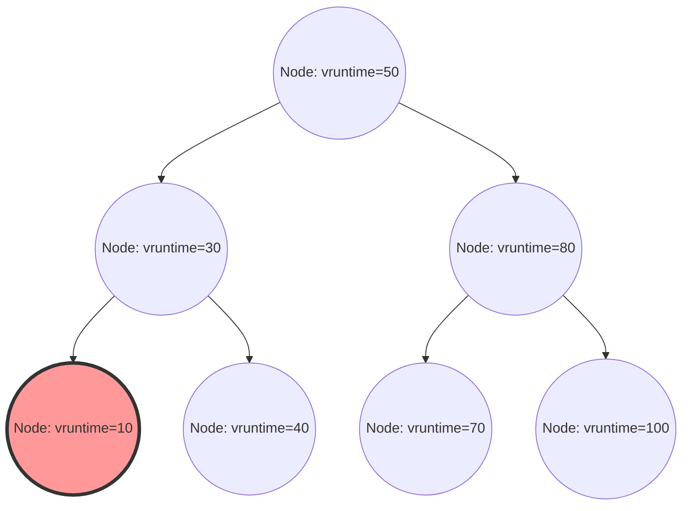

Linux 커널에서 시스템 전체의 성능, 처리량(throughput), 그리고 응답성을 결정짓는 가장 중요한 컴포넌트 중 하나가 프로세스 스케줄러입니다. 현대의 Linux(커널 2.6.23부터 6.5까지)에서 기본 스케줄러로 오랫동안 군림해 온 'Completely Fair Scheduler (CFS)'는 기존의 휴리스틱 기반 스케줄링에서 완전히 벗어나, 엄밀한 수학적 모델에 기반한 '완전한 공정성'을 추구한 걸작이라고 할 수 있습니다.

본 기사에서는 Linux 커널 내부 구조와 스케줄링 이론의 관점에서 CFS의 아키텍처, 가상 실행 시간(vruntime)의 수리적 계산, 레드-블랙 트리(Red-Black Tree)를 통한 런큐(runqueue) 관리, 멀티 코어 환경에서의 부하 분산 알고리즘, 나아가 최신 커널 6.6 이후에 도입된 EEVDF(Earliest Eligible Virtual Deadline First)로의 진화에 대해 소스 코드 수준의 해상도로 매우 상세하게 해설합니다. 커널 해커나 시스템 프로그래머, 로우 레벨의 성능 튜닝에 도전하는 엔지니어에게 CFS의 내부 구조를 깊이 이해하는 것은 피할 수 없는 길입니다.

## 제1장: Linux 스케줄러의 진화사와 CFS 탄생의 배경

CFS의 설계 사상과 그 아름다움을 깊이 이해하기 위해서는 Linux 커널의 역사에서 스케줄러가 어떤 과제에 직면했고 어떻게 진화해 왔는지를 살펴볼 필요가 있습니다. 스케줄링 알고리즘의 진화는 처리량(단위 시간당 처리량)과 지연 시간(레이턴시, 응답 시간)이라는 상충하는 요구 사항의 트레이드오프와의 치열한 싸움의 역사이기도 했습니다.

### 2.4 커널 시대 이전: O(N) 스케줄러의 한계와 에포크 기반의 딜레마

Linux 2.4 시대의 스케줄러는 단순하지만 당시의 표준적인 워크로드에는 충분히 대응할 수 있는 것이었습니다. 이 스케줄러는 에포크(Epoch) 기반 알고리즘을 채택하여 각 프로세스에 타임 슬라이스를 할당하고, 모든 프로세스가 타임 슬라이스를 다 쓰면 새로운 에포크가 시작되는 구조였습니다.

그러나 멀티 프로세서 시스템이 보급되기 시작하자, 이 스케줄러는 치명적인 아키텍처상의 결함을 드러내기 시작합니다. 그것은 계산 복잡도가 $O(N)$(N은 실행 가능한 프로세스 수)이라는 것이었습니다. 시스템 전체에 글로벌 런큐(실행 대기 큐)를 하나만 가졌고, 스케줄링할 때마다 큐 안의 '모든 프로세스'를 스캔하여 다음에 실행해야 할 최적의 프로세스(동적 우선순위가 가장 높은 것)를 결정했습니다.
더 심각했던 것은 배타적 제어(상호 배제)입니다. 단일 글로벌 스핀락(`runqueue_lock`)에 의해 런큐 전체가 보호되었기 때문에, CPU 코어 수가 증가함에 따라 락 경합이 심화되었습니다. 한 CPU가 다음에 실행할 프로세스를 찾는 동안 다른 모든 CPU는 블록되었고, 귀중한 CPU 사이클이 스핀락 대기(비지 루프)에 낭비되는 확장성(스케일러빌리티) 측면의 심각한 병목 현상(캐시 라인 바운싱)이 발생한 것입니다.

### 2.6 커널: Ingo Molnar와 O(1) 스케줄러의 혁신

이 확장성과 계산량 과제를 근본적으로 해결하기 위해, Linux 2.6 커널의 개발 과정에서 저명한 커널 해커인 Ingo Molnar에 의해 'O(1) 스케줄러'가 도입되었습니다. 이 스케줄러는 이름 그대로 시스템 내 프로세스의 수에 전혀 의존하지 않고, 항상 상수 시간 $O(1)$로 다음 프로세스를 선택할 수 있는 획기적인 알고리즘을 갖추고 있었습니다.

O(1) 스케줄러는 CPU(프로세서)마다 완전히 독립된 런큐(Per-CPU Runqueue)를 가져 글로벌 락을 폐지함으로써 멀티 프로세서 환경에서의 확장성 문제를 극적으로 개선했습니다. 각 런큐는 'Active 배열'과 'Expired 배열'이라는 두 개의 우선순위 배열을 유지했습니다. 배열은 140단계의 우선순위 레벨(0~139, 이 중 0~99가 실시간 우선순위, 100~139가 일반적인 nice 값에 대응)별 연결 리스트(`list_head`)로 구성됩니다.

프로세스의 선택은 매우 빠릅니다. 우선순위별 비트맵을 준비하고, 실행 가능한 프로세스가 존재하는 우선순위의 비트를 1로 설정합니다. CPU는 하드웨어가 제공하는 '최상위 비트 검색 명령'(x86의 `bsfl`이나 `lzcnt` 등)을 사용하여 가장 높은 우선순위를 상수 클럭으로 식별하고, 해당 우선순위 리스트의 맨 앞에 있는 프로세스를 $O(1)$로 페치(fetch)할 수 있었습니다. 프로세스가 타임 슬라이스를 다 쓰면 'Expired 배열'로 이동하고, 'Active 배열'이 비워지면 두 포인터를 스왑하는 것만으로 새로운 에포크가 즉시 시작됩니다.

그러나 O(1) 스케줄러는 성능 면에서는 완벽했지만, '인터랙티브성 판정'이라는 또 다른 거대한 딜레마를 안게 되었습니다. 데스크톱 환경에서의 사용자 경험(마우스의 반응성이나 창의 그리기 응답성)을 높이기 위해, 스케줄러는 프로세스가 I/O 바운드(인터랙티브)인지 CPU 바운드인지를 과거의 수면(sleep) 시간과 실행 시간의 비율로부터 휴리스틱(경험 법칙)으로 추측했습니다. 인터랙티브하다고 판정된 프로세스에는 동적인 우선순위 부스트(보너스)가 주어졌고, 타임 슬라이스가 소진되어도 Expired 배열로 이동하지 않고 Active 배열에 머무는 특례 처리가 이루어졌습니다.
이 휴리스틱 로직은 커널 버전이 올라갈 때마다 복잡하고 기괴해졌으며, 엣지 케이스에서는 멀티미디어 애플리케이션의 심각한 오디오 끊김이나 CPU 바운드 프로세스가 완전히 기아 상태(스타베이션)에 빠지는 이해할 수 없는 동작을 일으키는 원인이 되어버렸습니다.

### Con Kolivas의 RSDL과 완전 공정성으로의 패러다임 전환

O(1) 스케줄러의 극도로 복잡한 휴리스틱과 수렁에 빠진 튜닝에 이의를 제기한 사람이 마취과 의사이면서 커널 해커로도 활동하던 Con Kolivas입니다. 그는 "데스크톱의 응답성은 복잡한 추측 로직 같은 것 없이, 순수하게 공정한 분배를 하는 것만으로도 개선할 수 있다"고 주장하며 Staircase 스케줄러나 RSDL (Rotating Staircase Deadline) 스케줄러 같은 패치를 메일링 리스트(ML)에 제안했습니다.

Kolivas의 RSDL 스케줄러는 메인라인에 통합되지는 못했지만, 그 사상은 Ingo Molnar에게 결정적인 영감을 주었습니다. Ingo Molnar는 O(1) 스케줄러의 복잡한 동적 우선순위 계산과 휴리스틱 코드를 완전히 포기하고, "프로세스 간에 CPU 시간을 완전히 공평하게 분할한다"는 단일하고 아름다운 원칙에 기반한 완전히 새로운 스케줄러를 불과 몇 주 만에 작성했습니다. 이것이 'Completely Fair Scheduler (CFS)'입니다.
CFS는 Linux 2.6.23에서 메인라인에 병합되었고, 그 이후 15년 이상 Linux의 심장부로 계속 가동하게 됩니다. 이는 복잡한 경험 법칙에서 수학적 모델로의 회귀라는 OS 역사에서 매우 중요한 패러다임 전환이었습니다.

## 제2장: 완전 공정성(Fair Queuing)의 수학적 기초와 GPS 모델

CFS의 'Completely Fair(완전한 공정)'라는 개념은 단순한 슬로건이 아니라 운영 체제 이론과 네트워크 이론의 '이상적인 리소스 할당 모델'에 뿌리를 두고 있습니다.

### GPS(Generalized Processor Sharing) 모델의 이상향

스케줄링 이론에서 궁극적인 이상형은 GPS(Generalized Processor Sharing) 또는 Fluid(유체) 모델이라 불리는 개념입니다.
이상적인 GPS 프로세서는 물리적인 제약을 무시한 가상의 하드웨어입니다. 시스템에 $N$개의 실행 가능한 프로세스가 존재할 경우, GPS 프로세서는 각 프로세스에 대해 동시에, 병렬로, 정확히 $1/N$의 CPU 파워를 계속해서 제공합니다. 즉, CPU라는 리소스를 '시간적으로 분할(타임 슬라이스)'하여 교대로 실행하는 것이 아니라, '공간적(또는 성능적)으로 분할'하여 무한히 지연 없이 프로세스를 진행시키는 상태를 말합니다.

프로세스에 우선순위 차이(가중치: Weight)가 있는 경우, GPS 모델은 Weighted Fair Queuing (WFQ)로 확장됩니다. 시스템 내의 각 프로세스 $i$가 가중치 $w_i$를 가질 때, 프로세스 $i$는 항상 전체 가중치 합계에 대한 자신의 가중치 비율에 비례한 처리 능력을 '지속적'으로 받습니다. 수식으로 표현하면 프로세스 $i$가 받는 CPU 대역 $C_i$는 다음과 같습니다.

$$
C_i = \text{CPU Total Capacity} \times \frac{w_i}{\sum_{j=1}^{N} w_j}
$$

이 모델에서는 컨텍스트 스위치 오버헤드가 제로이며, 프로세스는 항상 자신의 권리인 CPU 대역을 소비하여 계속 진행합니다.

### 이산 시간에서의 GPS 근사와 CFS의 기본 정리

그러나 현실의 물리 CPU 코어는 어느 한순간에 동시에 하나의 명령어 열(스레드)만 실행할 수 있습니다(SMT/하이퍼스레딩 제외). GPS 모델을 그대로 물리 하드웨어상에 구현하는 것은 물리 법칙상 불가능합니다.
그렇기 때문에 시간을 세밀한 슬라이스로 분할하고 프로세스를 고속으로 전환(시분할 다중화)함으로써 거시적으로 보았을 때 GPS 모델을 근사(에뮬레이트)할 필요가 있습니다. 이것이 네트워크 라우터의 패킷 스케줄링(WFQ) 개념을 CPU 스케줄링에 응용한 CFS의 기본 원리입니다.

CFS의 알고리즘은 시스템상에서 실행 중인 프로세스가 만약 이상적인 GPS 프로세서 위에서 실행되고 있었다면 얻었을 '이상적인 CPU 시간'을 항상 계산하고 추적합니다. 그리고 현실의 CPU 위에서 실제로 소비한 시간과의 '오차(지연)'가 가장 큰 프로세스를 다음에 실행하도록 스케줄링을 수행합니다.
이 '이상적인 GPS 프로세서상에서의 진행 정도'를 추적하기 위한 가상의 시계야말로 제3장에서 자세히 설명할 '가상 실행 시간(vruntime)'입니다.

## 제3장: 가상 실행 시간(vruntime)의 수리와 계산 메커니즘

CFS 알고리즘의 핵심이자 모든 것을 지배하고 있는 것은 모든 프로세스(더 정확하게는 스케줄링의 기본 단위인 `sched_entity`)가 유지하고 있는 `vruntime` (Virtual Runtime)이라는 부호 없는 64비트 정수 변수입니다.
CFS의 스케줄링 규칙은 O(1) 스케줄러와 같은 복잡한 배열 조작이 없으며 놀라울 정도로 단순합니다.
**"항상 런큐 내에서 vruntime이 최소인 태스크를 선택하고 다음에 실행한다"**

### nice 값에서 가중치(Weight)로의 변환식

Linux에서는 사용자 공간에서 프로세스의 우선순위를 조정하기 위해 `-20`(최고 우선순위)부터 `19`(최저 우선순위)까지의 nice 값을 사용합니다. 기본값은 `0`입니다.
CFS에서는 이 nice 값을 직접 계산에 사용하지 않습니다. 대신 상대적인 CPU 할당 비율을 나타내는 '가중치(Weight)'로 변환합니다.

여기서의 설계 요구 사항은 'nice 값이 1 내려가면(우선순위가 올라가면) 다른 프로세스와 비교해 CPU 시간을 약 10% 더 얻고, nice 값이 1 올라가면 약 10% 적게 얻는다'는 것이었습니다. 이를 수리적으로 실현하기 위해 가중치는 nice 값에 대해 등비급수적으로 변하도록 정의되어 있습니다. 구체적으로 인접한 nice 값 사이의 가중치 비율(승수)은 약 $1.25$로 되어 있습니다.
$1.25^3 \approx 1.953 \approx 2.0$이 되므로, nice 값이 3 변하면 프로세스에 할당되는 CPU 시간이 약 2배 혹은 절반이 된다는 아름다운 관계성이 도출됩니다.

커널 내의 `kernel/sched/core.c`에는 이 이론에 기반한 룩업 테이블 `sched_prio_to_weight`가 정적으로 정의되어 있습니다.

```c
const int sched_prio_to_weight[40] = {
 /* -20 */     88761,     71755,     56483,     46273,     36291,
 /* -15 */     29154,     23254,     18705,     14949,     11916,
 /* -10 */      9548,      7620,      6100,      4904,      3906,
 /*  -5 */      3121,      2501,      1991,      1586,      1277,
 /*   0 */      1024,       820,       655,       526,       423,
 /*   5 */       335,       272,       215,       172,       137,
 /*  10 */       110,        87,        70,        56,        45,
 /*  15 */        36,        29,        23,        18,        15,
};
```
nice 값이 `0`인 태스크의 가중치는 `1024`로 정의되어 있으며, 이는 커널 내부에서 `NICE_0_LOAD`라는 매크로 상수로 취급됩니다. 모든 계산은 이 `1024`를 기준으로 이루어집니다.

### vruntime 증가의 수리 모델과 계산식

어떤 프로세스가 실제 물리 CPU 위에서 실시간 $\Delta exec$(나노초 단위)만큼 실행되었을 때, 그 프로세스의 `vruntime`은 다음 수식에 따라 증가합니다.

$$
vruntime \mathrel{+}= \Delta exec \times \frac{NICE\_0\_LOAD}{weight}
$$

이 식이 의미하는 바를 구체적인 nice 값에 대입해 고찰해 보겠습니다.

1. **nice 값이 `0`(가중치 `1024`)인 경우**: 
   $\frac{1024}{1024} = 1$이 됩니다. 따라서 $vruntime$은 실시간 $\Delta exec$와 완전히 같은 속도로 증가합니다. 실시간 10ms 실행되면 vruntime도 10ms(10,000,000ns) 진행됩니다.
2. **nice 값이 `-5`(가중치 `3121`, 고우선순위)인 경우**:
   $\frac{1024}{3121} \approx 0.328$이 됩니다. 즉, 실시간의 약 1/3 속도로만 $vruntime$이 증가합니다. vruntime의 증가가 느리다는 것은 다른 프로세스와 비교해 'vruntime이 최소'인 상태를 더 오래 유지할 수 있다는 의미이므로, 결과적으로 더 긴 시간 CPU를 점유할 수 있게 됩니다.
3. **nice 값이 `5`(가중치 `335`, 저우선순위)인 경우**:
   $\frac{1024}{335} \approx 3.05$가 됩니다. 실시간의 약 3배라는 맹렬한 속도로 $vruntime$이 증가합니다. 조금만 실행해도 vruntime이 급격하게 커지기 때문에 순식간에 다른 태스크에 추월당해 'vruntime 최소' 자리를 내어주고 CPU를 양보하게 됩니다.

이와 같이 CFS는 물리적인 실행 시간을 각 프로세스의 '가중치'로 정규화하여 단일한 절대적 지표 `vruntime`의 차원으로 끌어내림으로써 우선순위 제어와 공정성을 동시에 실현하고 있는 것입니다.

### 커널 구현에서의 나눗셈 회피와 고정 소수점 연산

수학적인 모델은 위와 같지만, OS 커널 깊숙한 곳에서 밀리초 단위로 수만 번 호출되는 스케줄러 경로에서 매번 $\frac{1}{weight}$의 나눗셈(제산 명령)을 실행하는 것은 성능상 매우 심각한 페널티(특히 오래된 아키텍처에서는 수십에서 수백 클럭 사이클의 지연)를 가져옵니다.

그렇기 때문에 Linux 커널은 나눗셈을 완전히 배제하기 위한 교묘한 최적화를 수행하고 있습니다. 미리 $\frac{2^{32}}{weight}$(역수에 $2^{32}$를 곱한 값)를 사전 계산한 또 다른 룩업 테이블 `sched_prio_to_wmult`를 준비하고, 곱셈과 32비트 오른쪽 시프트를 통해 나눗셈을 완전히 대체하고 있습니다(고정 소수점 연산의 기본 기법입니다).

```c
/* kernel/sched/fair.c : calc_delta_fair()의 논리 구조 */
static inline u64 calc_delta_fair(u64 delta, struct sched_entity *se)
{
    if (unlikely(se->load.weight != NICE_0_LOAD)) {
        /*
         * 나눗셈을 피하고 곱셈과 시프트 명령만으로
         * delta = delta * (NICE_0_LOAD / weight)를 계산한다
         */
        delta = __calc_delta(delta, NICE_0_LOAD, &se->load);
    }
    return delta;
}
```
타이머 인터럽트(Tick)가 발생할 때마다, 또는 컨텍스트 스위치가 발생할 때마다 `kernel/sched/fair.c`의 `update_curr()` 함수가 호출되어 현재 실행 중인 태스크의 실제 실행 시간이 정밀하게 측정되고, 위의 함수를 통해 `vruntime`이 엄밀하게 업데이트됩니다.

## 제4장: 레드-블랙 트리(Red-Black Tree)에 의한 런큐 관리와 스케줄링 엔티티

O(1) 스케줄러가 우선순위별 어레이(배열) 구조를 사용했던 반면, CFS는 균형 이진 탐색 트리의 일종인 '레드-블랙 트리(Red-Black Tree, RB-tree)'라는 세련된 자료 구조를 채택했습니다.

### cfs_rq 구조체와 sched_entity의 추상화

각 CPU는 전용 CFS 런큐 구조체 `struct cfs_rq`를 메모리 상에 유지합니다. 흥미로운 점은 런큐 안에 직접 저장되고 스케줄되는 객체가 프로세스 자체를 나타내는 `task_struct`가 아니라는 것입니다. CFS는 스케줄링 대상을 한 단계 더 추상화하여 `struct sched_entity`(스케줄링 엔티티)라는 구조체로 취급합니다.

이 추상화는 매우 중요합니다. 왜냐하면 이를 통해 스케줄되는 대상이 단일 프로세스이든 cgroups(Control Groups)에 의해 그룹화된 프로세스 집단이든, CFS 입장에서는 완전히 동일한 하나의 `sched_entity`로 투명하게 다룰 수 있기 때문입니다. 이에 따라 계층적인 그룹 스케줄링(Group Scheduling)이 우아하게 실현되어 있습니다.

### 레드-블랙 트리에 대한 조작과 알고리즘의 계산 복잡도

CFS는 런큐 내에 존재하는 모든 실행 가능한 엔티티를 `vruntime`을 키(정렬 기준)로 하여 레드-블랙 트리에 저장합니다. 이진 탐색 트리의 성질상 왼쪽 자식 노드는 부모 노드보다 값이 작고 오른쪽 자식 노드는 부모 노드보다 값이 크다는 규칙이 있습니다.

- **최적의 프로세스 검색(페치)**:
  CFS의 규칙은 '항상 vruntime이 최소인 것을 다음에 실행한다'입니다. 레드-블랙 트리에서 최소 노드는 루트에서 왼쪽으로 계속 따라간 끝, 즉 '트리의 가장 왼쪽 아래 노드(`rb_leftmost`)'에 존재합니다.
  CFS는 트리에 삽입이나 삭제가 이루어질 때마다 항상 이 `rb_leftmost` 노드에 대한 포인터를 캐시하여 유지하고 있습니다(`cfs_rq->rb_leftmost`). 따라서 스케줄러가 다음에 실행할 프로세스를 선택하는 처리(`pick_next_task_fair()`)는 트리를 탐색할 필요 없이 캐시된 포인터를 읽기만 하면 되므로 계산 복잡도는 $O(1)$로 완료됩니다.

- **노드 삽입과 삭제**:
  프로세스가 수면 상태에서 기상(Wake-up)하여 실행 가능 상태가 될 때, 혹은 실행을 마치고 CPU를 양보하고 큐로 돌아갈 때의 레드-블랙 트리 삽입(`enqueue_entity()`)이나 삭제(`dequeue_entity()`) 계산 복잡도는 큐 안의 요소 수를 N이라고 할 때 $O(\log N)$이 됩니다.
  O(1) 스케줄러와 비교하면 계산 복잡도 오더는 악화되었지만, 레드-블랙 트리는 항상 스스로 균형을 유지하여 트리의 높이가 $\log N$으로 억제되므로 시스템에 수만 개의 프로세스가 존재하더라도 트리의 높이는 십여 단에 불과합니다. 캐시 지역성을 고려하면 실용상의 CPU 사이클로서의 오버헤드는 극히 미미하며, O(1)의 복잡한 휴리스틱 로직을 실행하는 비용보다 훨씬 저렴하다는 것이 입증되었습니다.


*그림: vruntime을 키로 하는 레드-블랙 트리의 논리 구조. 항상 가장 왼쪽에 있는 노드(vruntime=10)가 다음에 실행될 프로세스로 캐시된다.*

### min_vruntime에 의한 오버플로우 대책과 기상 시 보정

`vruntime`은 64비트 부호 없는 정수(`u64`)이며 나노초 단위로 끊임없이 계속 증가합니다. 장기간 연속 가동하는 엔터프라이즈 서버 등에서는 수학적으로 오버플로우(값이 한계를 넘어 0으로 돌아가는 랩어라운드 현상)가 발생할 가능성이 항상 존재합니다.

게다가 실용상 더 빈번하게 문제가 되는 것은 새로 생성된 프로세스나 I/O 대기 등으로 장시간 수면하다가 몇 시간 만에 기상한 프로세스의 취급입니다. 이러한 프로세스의 `vruntime`이 0이나 예전 값 그대로라면 현재 시스템 내의 다른 프로세스의 `vruntime`(예를 들어 수조 나노초)과 비교해 압도적으로 작은 값이 되어버립니다. 그 결과 CFS는 "이 프로세스는 CPU를 전혀 사용하지 않아 극도로 불리한 상태에 있다"고 오인하여, 해당 프로세스의 `vruntime`이 다른 프로세스를 따라잡을 때까지 CPU를 완전히 독점(다른 모든 프로세스가 스타베이션에 빠짐)하게 만들어 버립니다.

이를 완벽하게 방지하기 위해 `cfs_rq` 구조체는 `min_vruntime`이라는 중요한 추적 변수를 유지하고 있습니다.
`min_vruntime`은 그 런큐 내에 현재 존재하는 모든 프로세스의 `vruntime` 중 최솟값을 추적하는 변수이지만, **'단조 증가'만을 허용한다**는 엄격한 규칙이 부과되어 있습니다. 즉, 과거로 역행하는 일은 결코 없습니다.

- **신규 프로세스(fork 시) 초기화**:
  새로운 프로세스가 생성되면 그 프로세스의 초기 `vruntime`은 0부터 시작하는 것이 아니라, 부모 프로세스의 `vruntime`이나 현재 런큐의 `min_vruntime`을 기준으로 합당한 값으로 오프셋 조정(초기화)됩니다.
- **기상 프로세스(Wake-up) 보정**:
  장시간 수면했던 프로세스가 기상하여 런큐로 돌아올 때 `enqueue_entity()` 함수 내에서 엄밀한 보정이 이루어집니다. 프로세스의 오래된 `vruntime`과 런큐의 `min_vruntime`에서 특정 페널티 값(`sysctl_sched_latency` 등에서 산출)을 뺀 값을 비교하여 큰 쪽을 채택합니다.
  즉 `se->vruntime = max_vruntime(se->vruntime, cfs_rq->min_vruntime - 보정값)`이 되어 시스템 전체 시계에 맞춰 강제적으로 시간이 '끌어올려'집니다. 이를 통해 장기 수면에서 복귀할 때 CPU를 부당하게 독점하는 것을 방지하면서, 짧은 수면(예를 들어 키보드 입력 대기)에서 복귀할 때는 적당한 지연 보너스를 주어 응답성을 확보하고 있습니다.

또한 커널 내부에서의 레드-블랙 트리 비교 함수(`entity_before()`) 등에서는 두 개의 `u64` 값 크기를 비교할 때 직접 비교하는 것이 아니라, 한 번 부호 있는 64비트 정수(`s64`)로 캐스트하여 뺄셈을 하고 그 결과의 양수/음수로 크기를 판정하고 있습니다. 이는 2의 보수 표현의 모듈러 산술을 활용한 해킹으로, 두 값의 차이가 $2^{63}$ 미만인 한, 한쪽이 오버플로우하여 0으로 돌아가더라도 정확한 시간적 순서 관계를 판정할 수 있기 때문에 랩어라운드 문제를 완전히 무해하게 만들고 있습니다.

## 제5장: 멀티 코어와 NUMA에서의 부하 분산(Load Balancing) 메커니즘

현대 하드웨어 아키텍처에서 싱글 코어 프로세서는 더 이상 존재하지 않으며, 수십에서 수백 개의 코어를 가진 멀티 코어, 나아가 메모리 접근 지연이 물리적 거리에 의존하는 NUMA(Non-Uniform Memory Access) 아키텍처가 일반적입니다.
CFS 단일 레드-블랙 트리 알고리즘이 단일 CPU 상에서 아무리 완벽한 공정성을 실현한다고 해도, 어떤 CPU 큐에는 프로세스가 100개 체류하여 비명을 지르고 있는데 옆 CPU는 완전히 유휴(idle) 상태로 놀고 있다면 시스템 전체의 처리량은 최악이 됩니다. 그러므로 멀티 코어 환경에서의 태스크 마이그레이션(이동)과 부하 분산은 매우 중요한 서브시스템입니다.

### sched_domain과 sched_group의 복잡한 계층 토폴로지

Linux 커널은 물리 하드웨어의 복잡한 CPU 토폴로지를 추상화하고 효율적으로 관리하기 위해 `sched_domain`과 `sched_group`이라는 계층적인 자료 구조를 구축합니다. 시스템 부팅 시 ACPI나 디바이스 트리에서 하드웨어 정보를 읽어 논리적인 계층 트리를 구축합니다.

예를 들어 두 개의 물리 소켓(NUMA 노드)을 가지고 각 소켓에 4개의 물리 코어가 있으며, 각각이 SMT(Hyper-Threading 등)를 활성화하여 총 16개의 논리 스레드를 가지는 시스템을 상상해 보십시오. 이 경우 스케줄러는 아래에서 위로 다음과 같은 계층(도메인)을 구축합니다.

1. **SMT(Simultaneous Multithreading) 도메인**:
   최하위 계층입니다. 같은 물리 코어를 공유하는 두 논리 스레드 간의 부하 분산을 담당합니다. 여기서는 L1/L2 캐시나 실행 유닛이 완전히 공유되므로 태스크를 이동시키는 비용(페널티)이 최소입니다.
2. **MC(Multi-Core) 도메인**:
   같은 물리 소켓(CPU 패키지) 상에 존재하는 여러 물리 코어 간의 부하 분산을 담당합니다. 보통 L3 캐시(LLC: Last Level Cache)를 공유하기 때문에 태스크 이동 시 캐시 미스에 의한 페널티는 중간 정도입니다.
3. **NUMA 도메인**:
   최상위 계층입니다. 다른 물리 소켓(NUMA 노드) 간의 부하 분산을 담당합니다. 이 영역을 넘어 프로세스를 이동시키면 프로세스가 사용하던 메모리에 대한 접근이 원격 메모리 접근이 되어 심각한 레이턴시 악화를 초래하므로 이동 페널티(저항값)가 극히 높게 설정되어 있습니다.

부하 분산(Load Balancing)은 타이머 인터럽트에 의한 주기적인 실행(Periodic Load Balance)과 CPU 런큐가 비워져 유휴 상태로 전환되기 직전의 실행(NewIdle Load Balance)이라는 두 가지 타이밍에 트리거됩니다.
알고리즘은 계층의 아래(SMT)에서 위(NUMA)로 순서대로 도메인을 따라갑니다. 각 도메인에서 소속된 `sched_group` 간의 평균 부하를 계산하고, 가장 부하가 높은 그룹에서 가장 부하가 낮은 그룹(자신)으로 도메인별 페널티 임계값을 초과하는 경우에만 태스크를 빼오는(풀링하는) 조작을 수행합니다.

### PELT (Per-Entity Load Tracking) 알고리즘의 수리

부하 분산에서 '그룹 간 부하'를 정확히 비교하기 위해서는 애초에 '태스크 부하'를 정확히 측정할 수 있어야 합니다. 과거의 Linux 커널에서는 런큐에 줄 서 있는 태스크의 수(큐 길이)를 순간적으로 샘플링하는 대략적인 기법이 사용되었는데, 이것으로는 급격하게 ON/OFF를 반복하는 버스트적인 태스크의 부하를 정확히 추정할 수 없어 부적절한 태스크 이동을 유발했습니다.

이 문제를 해결하기 위해 최근 도입되어 커널 스케줄링 정확도를 비약적으로 향상시킨 것이 **PELT (Per-Entity Load Tracking)** 알고리즘입니다.
PELT는 각 엔티티(프로세스나 cgroup)가 과거에 얼마나 많은 시간 동안 CPU를 소비했는지에 대한 '이력'을 지수 가중 이동 평균(EWMA: Exponentially Weighted Moving Average)을 사용하여 밀리초 단위의 해상도로 끊임없이 추적하고 감쇠시키는 알고리즘입니다.

시간 $t$에서의 어떤 태스크의 부하 $L_t$는 현재 기간의 CPU 소비량 $C_t$와 과거부터 누적된 부하 $L_{t-1}$을 사용하여 다음 점화식으로 계산됩니다.

$$ L_t = C_t + y \times L_{t-1} $$

여기서 $y$는 감쇠 계수(0보다 크고 1보다 작은 값)입니다. Linux 커널에서는 과거 이력의 영향이 정확히 32밀리초에 절반이 되도록(반감기 32ms) $y$의 값이 조정되어 있습니다($y^{32} = 0.5$).
이에 따라 태스크가 CPU를 사용하기 시작하면 부하 값은 부드럽게 상승하고 수면하면 부드럽게 감소합니다. PELT를 통해 얻은 매우 정확하고 안정적인 부하 지표는 CFS 부하 분산뿐만 아니라 CPU 동작 주파수를 동적으로 변경하는 절전 가버너(cpufreq의 Schedutil 가버너)에도 직접 공급되어 성능과 전력 효율의 최적의 균형을 실현하는 핵심 기술이 되었습니다.

### CFS Bandwidth Control (대역폭 제어: 쿼터와 스로틀링)

현대 클라우드 인프라나 컨테이너 기술(Docker, Kubernetes)의 기반으로서 절대 빠뜨릴 수 없는 기능이 cgroups를 통한 엄격한 CPU 리소스 사용량 제한(Bandwidth Control)입니다. CFS는 완전히 제어된 대역폭 할당 메커니즘을 내포하고 있습니다.

CFS 대역폭 제어는 `cpu.cfs_period_us`(기간)와 `cpu.cfs_quota_us`(쿼터/상한)라는 두 개의 파라미터로 정의됩니다.
예를 들어 period가 `100000`(100ms), quota가 `50000`(50ms)으로 설정된 cgroup에 속한 프로세스 군은 100ms라는 시간 틀 안에서 합쳐서 최대 50ms(1CPU 코어의 50%)만 물리 CPU를 사용하는 것이 허용됩니다.

프로세스가 실행되면 커널은 고정밀 타이머를 사용하여 소비된 실행 시간을 측정하고 cgroup에 할당된 쿼터에서 차감해 나갑니다. 프로세스가 쿼터를 모두 소진하면 극적인 조치가 취해집니다. CFS는 해당 cgroup에 속한 모든 엔티티를 런큐의 레드-블랙 트리에서 물리적으로 빼내어(dequeue), 실행 불가능한 '스로틀(Throttled)' 상태로서 전용 대기 리스트에 격리합니다.
이 상태가 되면 프로세스는 아무리 실행을 원해도 CPU를 일절 할당받지 못합니다. 다음 기간(period)이 시작되면 하드웨어 타이머가 발화하여 쿼터가 전량 보충(리프레시)되고 격리되었던 엔티티가 다시 레드-블랙 트리에 삽입(enqueue)되어 실행이 재개됩니다.
이 스로틀링 메커니즘은 매우 견고하여 멀티 테넌트 환경에서 특정 컨테이너가 폭주하여 다른 컨테이너의 CPU 리소스를 갉아먹는 '노이시 네이버 문제(Noisy Neighbor Problem)'를 막는 철벽 방어막으로 기능하고 있습니다.

## 제6장: 실시간 스케줄러와 최신 EEVDF(Earliest Eligible Virtual Deadline First)로의 진화

Linux에는 CFS(일반 프로세스용: `SCHED_NORMAL`, `SCHED_BATCH`, `SCHED_IDLE`)와는 완전히 분리된 POSIX 규격을 준수하는 실시간 스케줄링 정책(`SCHED_FIFO`, `SCHED_RR`)이 존재합니다.
실시간 프로세스는 0~99의 절대적인 우선순위(RT prio)를 가지며, 시스템 내에 실행 가능한 실시간 프로세스가 단 하나라도 존재하는 한 모든 CFS 프로세스(100~139의 우선순위 공간)는 완전히 CPU 실행권을 빼앗깁니다. 실시간 스케줄러는 레드-블랙 트리를 사용하지 않고, O(1) 스케줄러와 같은 우선순위별 배열과 비트맵을 사용한 매우 단순한 $O(1)$ 알고리즘으로 관리되며, 마이크로초 단위의 결정론적 응답성을 요구하는 산업용 제어나 오디오 처리 등에 사용됩니다.

### CFS의 구조적 한계와 레이턴시(지연) 보장의 부재

일반 프로세스 환경에서 CFS는 '장기적인 처리량에 있어서 수리적 완전 공정성'이라는 관점에서는 말 그대로 완벽에 가까운 성능을 달성했습니다. 하지만 시스템이 진화하고 데스크톱 환경이나 모바일 환경(Android 등)의 요구 사항이 엄격해짐에 따라, '특정 레이턴시(응답 시간)를 수 밀리초 이내로 보장한다'는 관점에서는 CFS의 아키텍처적 한계가 드러나기 시작했습니다.

휴리스틱을 배제하고 순수한 vruntime의 크기만으로 판단하는 CFS의 대가로, I/O 바운드 태스크(예를 들어 사용자 키 입력에 반응하여 수십 마이크로초만 즉시 실행되고 바로 다시 수면하는 UI 그리기 태스크)가 무거운 CPU 바운드 태스크(동영상 인코딩 등) 무리 속에서 일시적으로 '파묻혀' 스케줄링 순서가 뒤로 밀림으로써 화면의 불쾌한 끊김(UI 지터)을 발생시키는 일이 있었습니다.
이를 완화하기 위해 커널 개발자들은 CFS의 순수한 수학적 모델에 패치를 적용하여 `sysctl kernel.sched_wakeup_granularity_ns`(웨이크업 시 프리엠션 임계값)이나 `sched_min_granularity_ns` 등의 튜닝 파라미터를 추가했고, 더욱 수많은 미세한 휴리스틱 코드를 (아이러니하게도 O(1) 시대처럼) 다시 계속 추가하게 되었습니다. 하지만 이들은 대증 요법에 불과했고 본질적인 레이턴시의 수학적 보장에는 이르지 못했습니다.

### Linux 6.6의 혁명: EEVDF 스케줄러 도입

이 오랜 딜레마에 종지부를 찍고자 CFS 관리자인 Peter Zijlstra 등의 다대한 노력으로 Linux 6.6 커널에서 마침내 CFS의 핵심 알고리즘이 **EEVDF (Earliest Eligible Virtual Deadline First)**라 불리는 완전히 새로운 알고리즘으로 대체되었습니다. 소스 코드 상의 클래스명(`fair.c`나 `sched_class fair_sched_class`)은 호환성을 위해 유지되었지만, 그 심장부의 로직은 근본부터 일신된 것입니다.

EEVDF는 사실 1995년 Ion Stoica와 Hussein Abdel-Wahab이 발표한 역사 깊은 학술 논문의 알고리즘으로, 프로세스에 대한 '공정성(Fairness)'과 '레이턴시의 엄격한 보장(Latency Guarantee)'을 수학적으로 양립시킨다는 경이로운 특성을 가지고 있습니다.
EEVDF 알고리즘에서는 CFS의 단일 `vruntime`을 대신하여 프로세스 실행을 관리하기 위해 두 개의 중요한 시간적 지표를 계산하고 추적합니다.

1. **Eligible Time(자격 시간) 판정과 Lag(지연)**:
   EEVDF는 어떤 프로세스가 이상적인 GPS 모델과 비교해 현재 얼마나 'Lag(지연)'를 안고 있는지를 계산합니다. Lag가 양수 값인(이상적인 경우보다 실제 CPU 할당이 적은, 즉 부당한 대우를 받고 있는) 프로세스를 'Eligible(자격 있음)'이라고 판정합니다. 반대로 이상적인 경우보다 더 많이 CPU를 소비하고 있는 프로세스는 무자격 상태가 됩니다.
2. **Virtual Deadline(가상 데드라인) 계산**:
   프로세스가 요구하는 타임 슬라이스(CPU 시간)를 이상적인 GPS 프로세서 상에서 다 소화해야 할 가상의 마감 시간을 계산합니다.

EEVDF 스케줄링 규칙은 CFS보다 한 단계 더 고도화되어 다음과 같습니다.
**"현재 'Eligible'(자격을 충족하는) 상태에 있는 태스크 집합 중에서 Virtual Deadline(가상 데드라인)이 가장 빠른 것을 선택하여 다음에 실행한다"**

이 EEVDF로의 알고리즘 전환에 따른 혜택은 헤아릴 수 없습니다. CFS에서 수십 년에 걸쳐 축적되어 코드 베이스를 비대화시켰던 '웨이크업에 관한 다수의 휴리스틱 로직'이 불필요해져 일소(삭제)되었습니다.
나아가 프로세스별로 '요청하는 타임 슬라이스 길이'를 명시적으로 지정할 수 있는 프레임워크가 정비되었습니다(향후 cgroups 확장이나 새로운 `sched_setattr` 시스템 콜을 통해 사용자 공간에 공개될 예정입니다).
이를 통해 아주 짧은 타임 슬라이스를 요구하는 인터랙티브 UI 태스크에는 매우 가까운(빠른) Virtual Deadline이 산출, 설정되므로 무거운 연산 연산 태스크를 확실하게 선점(프리엠션)하여 즉시 실행될 것이 수학적으로 보장됩니다. 처리량을 희생하지 않고도 수 밀리초 단위의 마이크로 레이턴시를 완벽하게 제어할 수 있게 된 것입니다.

## 결론

Linux의 완전 공정 스케줄러(CFS)와 그 진화형인 EEVDF는 이상적인 GPS 모델과 네트워크 유래의 WFQ라는 심오한 이론적 배경을 가지며, 이를 `vruntime`의 수리와 레드-블랙 트리라는 세련된 자가 균형 자료 구조를 통해 커널 공간의 극단적인 성능 제약 속에서 실현해 낸 소프트웨어 공학의 극치라 할 수 있습니다.

멀티 프로세서 여명기의 락 경합 과제에서 시작하여 O(1) 스케줄러의 휴리스틱 함정을 거쳐 수학적 공정성으로의 회귀를 이룬 CFS. 나아가 멀티 코어화와 NUMA 토폴로지의 극단적인 복잡화에 대응하기 위한 PELT 알고리즘의 통합, 클라우드 시대를 지탱하는 cgroups에 의한 엄격한 대역폭 제어 실현을 거쳐, 그리고 현재 레이턴시 절대적 보장이라는 마지막 성배를 포함시킨 EEVDF로, Linux 스케줄러는 멈추지 않고 진화를 거듭하고 있습니다.

운영 체제의 핵심인 스케줄러의 역사적 변천과 수식으로 뒷받침된 내부 구조를 깊이 이해하는 것은 단순한 지적 호기심을 채우는 것을 넘어 시스템 전체 성능 병목 지점 특정, 멀티 스레드 프로그래밍에서의 동작 예측, 나아가 고도화된 애플리케이션 아키텍처 설계를 수행하는 데 있어 매우 강력한 무기가 될 것입니다.

이상 Linux 커널의 중추이자 모든 프로세스의 운명을 쥐고 있는 스케줄러의 심연한 세계에 대한 탐구였습니다.
