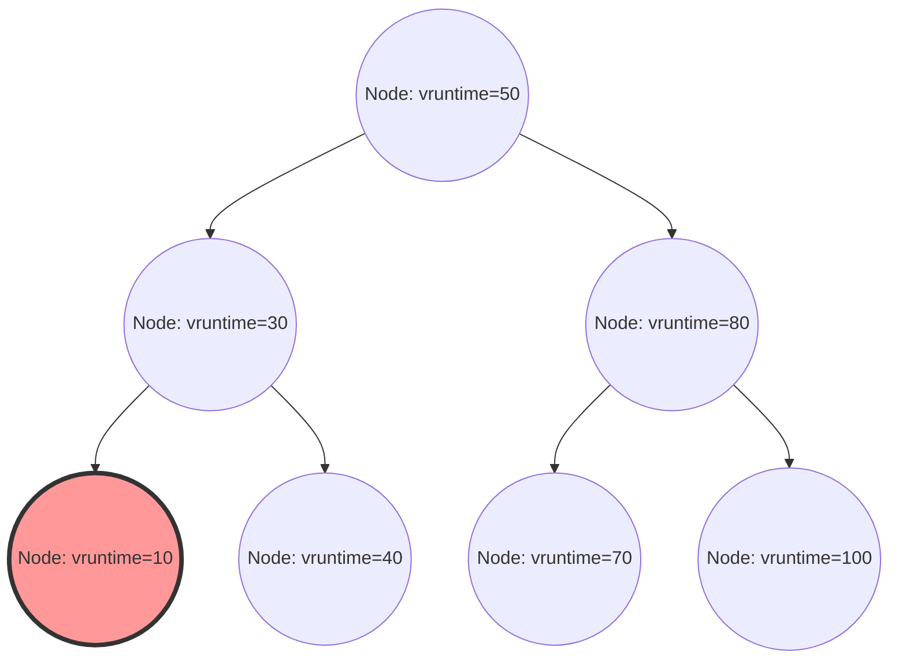

Linuxカーネルにおいて、システム全体のパフォーマンス、スループット、そして応答性を決定づける最も重要なコンポーネントの一つがプロセススケジューラです。現代のLinux（カーネル2.6.23から6.5まで）においてデフォルトスケジューラとして長年君臨してきた「Completely Fair Scheduler (CFS)」は、従来のヒューリスティックベースのスケジューリングから完全に脱却し、厳密な数学的モデルに基づく「完全な公平性」を追求した傑作と言えます。

本記事では、Linuxカーネル内部構造とスケジューリング理論の観点から、CFSのアーキテクチャ、仮想実行時間（vruntime）の数理計算、赤黒木（Red-Black Tree）によるランキュー管理、マルチコア環境における負荷分散アルゴリズム、さらには最新のカーネル6.6以降で導入されたEEVDF（Earliest Eligible Virtual Deadline First）への進化について、ソースコードレベルの解像度で極めて詳細に解説します。カーネルハッカーやシステムプログラマ、低レイヤのパフォーマンスチューニングに挑むエンジニアにとって、CFSの内部構造を深く理解することは避けて通れない道です。

## 第1章：Linuxスケジューラの進化史とCFS誕生の背景

CFSの設計思想とその美しさを深く理解するためには、Linuxカーネルの歴史においてスケジューラがどのような課題に直面し、いかにして進化してきたかを紐解く必要があります。スケジューリングアルゴリズムの進化は、スループット（単位時間あたりの処理量）とレイテンシ（応答時間）という相反する要件のトレードオフとの激しい戦いの歴史でもありました。

### 2.4カーネル時代以前：O(N)スケジューラの限界とエポックベースのジレンマ

Linux 2.4時代のスケジューラは、シンプルながらも当時の標準的なワークロードには十分に対応できるものでした。このスケジューラはエポック（Epoch）ベースのアルゴリズムを採用しており、各プロセスに対してタイムスライスを割り当て、すべてのプロセスがタイムスライスを使い切ると新しいエポックが開始されるという仕組みでした。

しかし、マルチプロセッサシステムが普及し始めると、このスケジューラは致命的なアーキテクチャ上の欠陥を露呈し始めます。それは計算量が $O(N)$（Nは実行可能プロセスの数）であることでした。システム全体でグローバルなランキュー（実行待ちキュー）を1つしか持たず、スケジューリングのたびにキュー内の「全てのプロセス」をスキャンして、次に実行すべき最適なプロセス（動的優先度が最も高いもの）を決定していました。
さらに深刻だったのは排他制御です。単一のグローバルなスピンロック（`runqueue_lock`）によってランキュー全体が保護されていたため、CPUコア数が増加するにつれてロックの競合が激化しました。あるCPUが次に実行するプロセスを探している間、他のすべてのCPUはブロックされ、貴重なCPUサイクルがスピンロックの待機（ビジーループ）に浪費されるという、スケーラビリティにおける深刻なボトルネック（キャッシュラインのバウンシング）が生じたのです。

### 2.6カーネル：Ingo MolnarとO(1)スケジューラの革新

このスケーラビリティと計算量の課題を根本から解決するため、Linux 2.6カーネルの開発過程で著名なカーネルハッカーであるIngo Molnarによって「O(1)スケジューラ」が導入されました。このスケジューラはその名の通り、システム内のプロセスの数に全く依存せず、常に定数時間 $O(1)$ で次のプロセスを選択できるという画期的なアルゴリズムを備えていました。

O(1)スケジューラは、CPU（プロセッサ）ごとに完全に独立したランキュー（Per-CPU Runqueue）を持ち、グローバルロックを廃止することでマルチプロセッサ環境でのスケーラビリティ問題を劇的に改善しました。各ランキューは「Active配列」と「Expired配列」という2つの優先度付き配列を保持していました。配列は140段階の優先度レベル（0〜139、うち0〜99がリアルタイム優先度、100〜139が通常のnice値に対応）ごとの連結リスト（`list_head`）で構成されています。

プロセスの選択は極めて高速です。優先度ごとのビットマップを用意し、実行可能なプロセスが存在する優先度のビットを1に立てます。CPUはハードウェアが提供する「最上位ビット検索命令」（x86の`bsfl`や`lzcnt`など）を使用することで、最も高い優先度を定数クロックで特定し、その優先度リストの先頭にあるプロセスを $O(1)$ でフェッチすることができました。プロセスがタイムスライスを使い切ると「Expired配列」に移動し、「Active配列」が空になると、両者のポインタをスワップするだけで新しいエポックが即座に開始されます。

しかし、O(1)スケジューラはパフォーマンス面では完璧であったものの、「インタラクティブ性の判定」という別の巨大なジレンマを抱え込むことになりました。デスクトップ環境におけるユーザーエクスペリエンス（マウスの追従性やウィンドウの描画応答性）を高めるため、スケジューラはプロセスがI/Oバウンド（インタラクティブ）かCPUバウンドかを、過去のスリープ時間と実行時間の比率からヒューリスティック（経験則）で推測していました。インタラクティブと判定されたプロセスには、動的な優先度ブースト（ボーナス）が与えられ、タイムスライスが尽きてもExpired配列に移動せずActive配列に留まる特例処理が行われました。
このヒューリスティックロジックはカーネルのバージョンアップのたびに複雑怪奇なものとなり、エッジケースではマルチメディアアプリケーションの深刻な音飛びや、CPUバウンドなプロセスが完全に飢餓状態（スターベーション）に陥るという不可解な挙動を引き起こす原因となってしまったのです。

### Con KolivasのRSDLと完全公平性へのパラダイムシフト

O(1)スケジューラの極めて複雑なヒューリスティックと泥沼のチューニングに異を唱えたのが、麻酔科医でありながらカーネルハッカーとしても活動していたCon Kolivasです。彼は「デスクトップの応答性は、複雑な推測ロジックなどなくても、純粋に公平な配分を行うだけで改善できる」と主張し、StaircaseスケジューラやRSDL (Rotating Staircase Deadline) スケジューラといったパッチをML（メーリングリスト）に提案しました。

KolivasのRSDLスケジューラはメインラインに取り込まれることはありませんでしたが、その思想はIngo Molnarに決定的なインスピレーションを与えました。Ingo Molnarは、O(1)スケジューラの複雑な動的優先度計算とヒューリスティックコードを完全に放棄し、「プロセス間でCPU時間を完全に公平に分割する」という単一の美しい原則に基づく全く新しいスケジューラをわずか数週間で書き上げました。これが「Completely Fair Scheduler (CFS)」です。
CFSはLinux 2.6.23でメインラインにマージされ、それ以降15年以上にわたりLinuxの心臓部として稼働し続けることになります。これは、複雑な経験則から数学的モデルへの回帰という、OSの歴史において極めて重要なパラダイムシフトでした。

## 第2章：完全公平性（Fair Queuing）の数学的基礎とGPSモデル

CFSの「Completely Fair（完全な公平）」という概念は、単なるスローガンではなく、オペレーティングシステム理論とネットワーク理論における「理想的なリソース割り当てモデル」に根ざしています。

### GPS（Generalized Processor Sharing）モデルの理想郷

スケジューリング理論における究極の理想形は、GPS（Generalized Processor Sharing）またはFluid（流体）モデルと呼ばれる概念です。
理想的なGPSプロセッサは、物理的な制約を無視した仮想的なハードウェアです。システムに $N$ 個の実行可能プロセスが存在する場合、GPSプロセッサは各プロセスに対して同時に、並列に、正確に $1/N$ のCPUパワーを提供し続けます。つまり、CPUというリソースを「時間的に分割（タイムスライス）」して交互に実行するのではなく、「空間的（または性能的）に分割」して無限に遅延ゼロでプロセスを進行させる状態を指します。

プロセスに優先度の違い（重み：Weight）がある場合、GPSモデルはWeighted Fair Queuing (WFQ) に拡張されます。システム内の各プロセス $i$ が重み $w_i$ を持つとき、プロセス $i$ は常に全体の重みの合計に対する自身の重みの比率に比例した処理能力を「継続的」に受け取ります。数式で表すと、プロセス $i$ が受け取るCPU帯域 $C_i$ は以下のようになります。

$$
C_i = \text{CPU Total Capacity} \times \frac{w_i}{\sum_{j=1}^{N} w_j}
$$

このモデルにおいては、コンテキストスイッチのオーバーヘッドはゼロであり、プロセスは常に自身の権利であるCPU帯域を消費して進行し続けます。

### 離散時間におけるGPSの近似とCFSの基本定理

しかし、現実の物理CPUコアは、ある瞬間に同時に1つの命令列（スレッド）しか実行することができません（SMT/ハイパースレッディングを除けば）。GPSモデルをそのまま物理ハードウェア上に実装することは物理法則上不可能です。
そのため、時間を細かなスライスに分割し、プロセスを高速に切り替える（時分割多重）ことで、巨視的に見たときにGPSモデルを近似（エミュレート）する必要があります。これがネットワークルーターにおけるパケットスケジューリング（WFQ）の概念をCPUスケジューリングに応用したCFSの基本原理です。

CFSのアルゴリズムは、システム上で実行されているプロセスが、仮に理想的なGPSプロセッサ上で実行されていたならば得られていたはずの「理想的なCPU時間」を常に計算・追跡します。そして、現実のCPU上で実際に消費した時間との「誤差（遅れ）」が最も大きいプロセスを次に実行するようにスケジューリングを行います。
この「理想的なGPSプロセッサ上での進行度合い」を追跡するための仮想的な時計こそが、第3章で詳しく解説する「仮想実行時間（vruntime）」です。

## 第3章：仮想実行時間（vruntime）の数理と計算メカニズム

CFSのアルゴリズムの中核であり、すべてを支配しているのが、すべてのプロセス（より正確にはスケジューリングの基本単位である `sched_entity`）が保持している `vruntime` (Virtual Runtime) という符号なし64ビット整数の変数です。
CFSのスケジューリングルールは、O(1)スケジューラのような複雑な配列操作を持たず、驚くほどシンプルです。
**「常にランキュー内で vruntime が最小のタスクを選択し、次に実行する」**

### nice値から重み（Weight）への変換式

Linuxでは、ユーザー空間からプロセスの優先度を調整するために、`-20` (最高優先度) から `19` (最低優先度) までの nice 値を使用します。デフォルト値は `0` です。
CFSでは、このnice値を直接計算に用いることはしません。その代わり、相対的なCPU割り当て比率を示す「重み（Weight）」に変換します。

ここでの設計要件は、「nice値が1つ下がる（優先度が上がる）と、他のプロセスと比較してCPU時間を約10%多く獲得し、nice値が1つ上がると約10%少なく獲得する」というものでした。これを数理的に実現するため、重みはnice値に対して等比級数的に変化するように定義されています。具体的には、隣接するnice値間の重みの比率（乗数）は約 $1.25$ とされています。
$1.25^3 \approx 1.953 \approx 2.0$ となるため、nice値が3変わると、プロセスに割り当てられるCPU時間が約2倍、あるいは半分になるという美しい関係性が導かれます。

カーネル内の `kernel/sched/core.c` には、この理論に基づくルックアップテーブル `sched_prio_to_weight` が静的に定義されています。

```c
const int sched_prio_to_weight[40] = {
 /* -20 */     88761,     71755,     56483,     46273,     36291,
 /* -15 */     29154,     23254,     18705,     14949,     11916,
 /* -10 */      9548,      7620,      6100,      4904,      3906,
 /*  -5 */      3121,      2501,      1991,      1586,      1277,
 /*   0 */      1024,       820,       655,       526,       423,
 /*   5 */       335,       272,       215,       172,       137,
 /*  10 */       110,        87,        70,        56,        45,
 /*  15 */        36,        29,        23,        18,        15,
};
```
nice値 `0` のタスクの重みは `1024` と定義されており、これはカーネル内部で `NICE_0_LOAD` というマクロ定数として扱われます。すべての計算はこの `1024` を基準に行われます。

### vruntime 増加の数理モデルと計算式

あるプロセスが実際の物理CPU上で実時間 $\Delta exec$ （ナノ秒単位）だけ実行されたとき、そのプロセスの `vruntime` は以下の数式に従って増加します。

$$
vruntime \mathrel{+}= \Delta exec \times \frac{NICE\_0\_LOAD}{weight}
$$

この式が意味するところを、具体的なnice値に当てはめて考察してみましょう。

1. **nice値が `0` (重み `1024`) の場合**： 
   $\frac{1024}{1024} = 1$ となります。したがって、$vruntime$ は実時間 $\Delta exec$ と全く同じペースで増加します。実時間10ms実行されれば、vruntimeも10ms（10,000,000ns）進みます。
2. **nice値が `-5` (重み `3121`、高優先度) の場合**：
   $\frac{1024}{3121} \approx 0.328$ となります。つまり、実時間の約 1/3 のペースでしか $vruntime$ が増加しません。vruntimeの増加が遅いということは、他のプロセスと比較して「vruntimeが最小」である状態をより長く保つことができるため、結果としてより長い時間CPUを占有できることになります。
3. **nice値が `5` (重み `335`、低優先度) の場合**：
   $\frac{1024}{335} \approx 3.05$ となります。実時間の約3倍の猛烈なペースで $vruntime$ が増加します。少し実行しただけでvruntimeが急激に大きくなるため、あっという間に他のタスクに追い抜かれ、「vruntime最小」の座を明け渡してCPUを譲ることになります。

このように、CFSは物理的な実行時間をそれぞれのプロセスの「重み」で正規化することで、単一の絶対的な指標 `vruntime` の次元に落とし込み、優先度制御と公平性を同時に実現しているのです。

### カーネル実装における割り算の回避と固定小数点演算

数学的なモデルは上記の通りですが、OSカーネルの奥深く、ミリ秒単位で数万回呼び出されるスケジューラパスにおいて、毎回 $\frac{1}{weight}$ の割り算（除算命令）を実行することは、パフォーマンス上極めて深刻なペナルティ（特に古いアーキテクチャでは数十から数百クロックサイクルの遅延）をもたらします。

そのため、Linuxカーネルは除算を完全に排除するための巧妙な最適化を行っています。あらかじめ $\frac{2^{32}}{weight}$ （逆数に $2^{32}$ を乗じた値）を事前計算したもう一つのルックアップテーブル `sched_prio_to_wmult` を用意し、乗算と32ビットの右シフトによって割り算を完全に代替しています（固定小数点演算の基本技法です）。

```c
/* kernel/sched/fair.c : calc_delta_fair() の論理構造 */
static inline u64 calc_delta_fair(u64 delta, struct sched_entity *se)
{
    if (unlikely(se->load.weight != NICE_0_LOAD)) {
        /*
         * 割り算を避け、乗算とシフト命令のみで
         * delta = delta * (NICE_0_LOAD / weight) を計算する
         */
        delta = __calc_delta(delta, NICE_0_LOAD, &se->load);
    }
    return delta;
}
```
タイマー割り込み（Tick）が発生するたび、またはコンテキストスイッチが発生するたびに `kernel/sched/fair.c` の `update_curr()` 関数が呼び出され、現在実行中のタスクの実際の実行時間が精緻に計測され、上記の関数を通じて `vruntime` が厳密に更新されます。

## 第4章：赤黒木（Red-Black Tree）によるランキュー管理とスケジューリングエンティティ

O(1)スケジューラが優先度別のアレイ（配列）構造を用いていたのに対し、CFSは平衡二分探索木の一種である「赤黒木 (Red-Black Tree, RB-tree)」という洗練されたデータ構造を採用しました。

### cfs_rq 構造体と sched_entity の抽象化

各CPUは専用のCFSランキュー構造体 `struct cfs_rq` をメモリ上に保持しています。興味深いのは、ランキューの中に直接格納されスケジュールされるオブジェクトは、プロセスそのものを表す `task_struct` ではないということです。CFSはスケジューリングの対象をより一段階抽象化し、`struct sched_entity`（スケジューリングエンティティ）という構造体として扱います。

この抽象化は極めて重要です。なぜならこれにより、スケジュールされる対象が単一のプロセスであっても、cgroups（Control Groups）によってグループ化されたプロセス群の集団であっても、CFSからは全く同じ1つの `sched_entity` として透過的に扱うことができるからです。これにより、階層的なグループスケジューリング（Group Scheduling）がエレガントに実現されています。

### 赤黒木に対する操作とアルゴリズムの計算量

CFSは、ランキュー内に存在するすべての実行可能なエンティティを、`vruntime` をキー（並び替えの基準）として赤黒木に格納します。二分探索木の性質上、左側の子ノードは親ノードよりも値が小さく、右側の子ノードは親ノードよりも値が大きいという規則があります。

- **最良のプロセスの検索（フェッチ）**：
  CFSのルールは「常に vruntime が最小のものを次に実行する」です。赤黒木において最小のノードは、ルートから左へ左へと辿り着いた末端、すなわち「木の最も左下のノード（`rb_leftmost`）」に存在します。
  CFSは、木に対して挿入や削除が行われるたびに、常にこの `rb_leftmost` ノードへのポインタをキャッシュして保持しています（`cfs_rq->rb_leftmost`）。したがって、スケジューラが次に実行すべきプロセスを選択する処理（`pick_next_task_fair()`）は、木の探索を行う必要がなく、キャッシュされたポインタを読み取るだけで済むため計算量は $O(1)$ で完了します。

- **ノードの挿入と削除**：
  プロセスがスリープ状態から起床（Wake-up）して実行可能状態になった際、あるいは実行を終えてCPUを譲りキューに戻る際の、赤黒木への挿入（`enqueue_entity()`）や削除（`dequeue_entity()`）の計算量は、キュー内の要素数を N とすると $O(\log N)$ となります。
  O(1)スケジューラと比較すると計算量オーダーは悪化していますが、赤黒木は常に自己平衡を保ち、木の高さが $\log N$ に抑えられるため、たとえシステムに数万のプロセスが存在していても木の高さは十数段にしかなりません。キャッシュの局所性も考慮すると、実用上のCPUサイクルとしてのオーバーヘッドは極めて微小であり、O(1)の複雑なヒューリスティックロジックを実行するコストよりも遥かに安上がりであることが実証されました。


*図: vruntimeをキーとする赤黒木の論理構造。常に最も左にあるノード（vruntime=10）が次に実行されるプロセスとしてキャッシュされる。*

### min_vruntime によるオーバーフロー対策と起床時補正

`vruntime` は64ビットの符号なし整数（`u64`）であり、ナノ秒単位で絶えず増加し続けます。長期間連続稼働するエンタープライズサーバーなどでは、数学的にオーバーフロー（値が限界を超えて0に戻るラップアラウンド現象）が発生する可能性が常に存在します。

さらに実用上より頻繁に問題となるのは、新たに生成されたばかりのプロセスや、I/O待ちなどで長時間スリープしていて数時間ぶりに起床したプロセスの扱いです。これらのプロセスの `vruntime` が0や古い値のままだと、現在のシステム内の他のプロセスの `vruntime`（例えば数兆ナノ秒）と比較して圧倒的に小さな値となってしまいます。その結果、CFSは「このプロセスはCPUを全く使っていない、極めて不遇な状態にある」と誤認し、そのプロセスの `vruntime` が他のプロセスに追いつくまで、CPUを完全に独占（他の全プロセスがスターベーションに陥る）させてしまいます。

これを完全に防ぐため、`cfs_rq` 構造体は `min_vruntime` という重要なトラッキング変数を保持しています。
`min_vruntime` は、そのランキュー内に現在存在している全プロセスの `vruntime` のうち、最小のものを追跡する変数ですが、**「単調増加」のみを許容する**という厳格なルールが課されています。つまり、過去に逆戻りすることは決してありません。

- **新規プロセス（fork時）の初期化**：
  新しいプロセスが生成されると、そのプロセスの初期 `vruntime` はゼロから始まるのではなく、親プロセスの `vruntime` や、現在のランキューの `min_vruntime` を基準とした妥当な値にオフセット調整（初期化）されます。
- **起床プロセス（Wake-up）の補正**：
  長時間スリープしていたプロセスが起床してランキューに戻る際、`enqueue_entity()` 関数内で厳密な補正が行われます。プロセスの古い `vruntime` と、ランキューの `min_vruntime` から特定のペナルティ値（`sysctl_sched_latency` などから算出）を引いた値を比較し、大きい方を採用します。
  つまり `se->vruntime = max_vruntime(se->vruntime, cfs_rq->min_vruntime - 補正値)` となり、システム全体の時計に合わせて強制的に時間が「引き上げ」られます。これにより、長期スリープからの復帰時にCPUを不当に独占することを防ぎつつ、短いスリープ（例えばキーボード入力待ち）からの復帰時には適度な遅延ボーナスを与えて応答性を確保しています。

また、カーネル内部での赤黒木の比較関数（`entity_before()`）などでは、2つの `u64` 値の大小を比較する際に直接比較するのではなく、一度符号付きの64ビット整数（`s64`）にキャストして引き算を行い、その結果の正負で大小を判定しています。これは2の補数表現のモジュラ算術を活用したハックであり、2つの値の差が $2^{63}$ 未満である限り、一方がオーバーフローして0に戻っていたとしても正確な時間的順序関係を判定できるため、ラップアラウンド問題を完全に無害化しています。

## 第5章：マルチコアとNUMAにおける負荷分散（Load Balancing）のメカニズム

現代のハードウェアアーキテクチャにおいて、シングルコアのプロセッサはもはや存在せず、数十から数百のコアを持つマルチコア、さらにはメモリアクセス遅延が物理的な距離に依存するNUMA（Non-Uniform Memory Access）アーキテクチャが一般的です。
CFS単体の赤黒木アルゴリズムが単一CPU上でどれほど完璧な公平性を実現していたとしても、あるCPUのキューにプロセスが100個滞留して悲鳴を上げている一方で、隣のCPUが完全にアイドル状態で遊んでいるようでは、システム全体としてのスループットは最悪となります。そのため、マルチコア環境におけるタスクの移行（マイグレーション）と負荷分散は極めて重要なサブシステムです。

### sched_domain と sched_group の複雑な階層トポロジ

Linuxカーネルは、物理ハードウェアの複雑なCPUトポロジを抽象化し、効率的に管理するために `sched_domain` と `sched_group` という階層的なデータ構造を構築します。システムの起動時にACPIやデバイスツリーからハードウェア情報を読み取り、論理的な階層ツリーを構築します。

たとえば、2つの物理ソケット（NUMAノード）を持ち、各ソケットに4つの物理コアがあり、それぞれがSMT（Hyper-Threading等）を有効にしていて合計16論理スレッドを持つシステムを想像してください。この場合、スケジューラは下から上へと以下のような階層（ドメイン）を構築します。

1. **SMT（Simultaneous Multithreading）ドメイン**:
   最下層です。同じ物理コアを共有する2つの論理スレッド間の負荷分散を担当します。ここではL1/L2キャッシュや実行ユニットが完全に共有されているため、タスクを移動させるコスト（ペナルティ）は最小です。
2. **MC（Multi-Core）ドメイン**:
   同じ物理ソケット（CPUパッケージ）上に存在する複数の物理コア間の負荷分散を担当します。通常、L3キャッシュ（LLC: Last Level Cache）を共有しているため、タスク移動時のキャッシュミスによるペナルティは中程度です。
3. **NUMAドメイン**:
   最上層です。異なる物理ソケット（NUMAノード）間の負荷分散を担当します。ここを跨いでプロセスを移動させると、プロセスが使用していたメモリへのアクセスがリモートメモリアクセスとなり、深刻なレイテンシ悪化を引き起こすため、移動のペナルティ（抵抗値）は極めて高く設定されています。

負荷分散（Load Balancing）は、タイマー割り込みによる定期的な実行（Periodic Load Balance）と、CPUのランキューが空になりアイドル状態に移行する直前の実行（NewIdle Load Balance）の2つのタイミングでトリガーされます。
アルゴリズムは階層の下（SMT）から上（NUMA）へと順番にドメインを辿ります。各ドメインにおいて、所属する `sched_group` 間の平均負荷を計算し、最も負荷が高いグループから最も負荷が低いグループ（自分自身）へ、ドメインごとのペナルティ閾値を超えている場合にのみ、タスクを引き抜く（プルする）操作を行います。

### PELT (Per-Entity Load Tracking) アルゴリズムの数理

負荷分散において「グループ間の負荷」を正確に比較するためには、そもそも「タスクの負荷」を正確に測定できなければなりません。かつてのLinuxカーネルでは、ランキューに並んでいるタスクの数（キュー長）を瞬間的にサンプリングする大雑把な手法が用いられていましたが、これでは急激にON/OFFを繰り返すバースト的なタスクの負荷を正確に見積もることができず、不適切なタスク移動を引き起こしていました。

この問題を解決するため、近年導入されカーネルのスケジューリング精度を飛躍的に向上させたのが **PELT (Per-Entity Load Tracking)** アルゴリズムです。
PELTは、各エンティティ（プロセスやcgroup）が過去にどれだけの時間CPUを消費したかという「履歴」を、指数加重移動平均 (EWMA: Exponentially Weighted Moving Average) を用いてミリ秒単位の解像度で絶えず追跡・減衰させるアルゴリズムです。

時間 $t$ におけるあるタスクの負荷 $L_t$ は、現在の期間のCPU消費量 $C_t$ と、過去から累積された負荷 $L_{t-1}$ を用いて以下の漸化式で計算されます。

$$ L_t = C_t + y \times L_{t-1} $$

ここで $y$ は減衰係数（0より大きく1より小さい値）です。Linuxカーネルでは、過去の履歴の影響が正確に32ミリ秒で半分になる（半減期が32ms）ように $y$ の値が調整されています（$y^{32} = 0.5$）。
これにより、タスクがCPUを使い始めると負荷値は滑らかに上昇し、スリープすると滑らかに減衰します。PELTによって得られた極めて正確で安定した負荷指標は、CFSの負荷分散だけでなく、CPUの動作周波数を動的に変更する省電力ガバナー（cpufreqのSchedutilガバナー）にも直接供給され、パフォーマンスと電力効率の最適なバランスを実現する中核技術となっています。

### CFS Bandwidth Control (帯域幅制御：クォータとスロットリング)

現代のクラウドインフラやコンテナ技術（Docker, Kubernetes）の基盤として絶対に欠かせない機能が、cgroups を通じた厳格なCPUリソースの使用量制限（Bandwidth Control）です。CFSは、完全に制御された帯域幅の割り当てメカニズムを内包しています。

CFSの帯域幅制御は、`cpu.cfs_period_us` （期間）と `cpu.cfs_quota_us` （クォータ/上限）という2つのパラメータで定義されます。
たとえば、periodが `100000` (100ms)、quotaが `50000` (50ms) に設定されたcgroupに属するプロセス群は、100msという時間枠の中で、合計して最大50ms（1CPUコアの50%）しか物理CPUを使用することが許されません。

プロセスが実行されると、カーネルは高精度のタイマーを用いて消費された実行時間を計測し、cgroupに割り当てられたクォータから減算していきます。プロセスがクォータを完全に使い切ると、劇的な処置が取られます。CFSはそのcgroupに属するすべてのエンティティをランキューの赤黒木から物理的に引き抜き（dequeue）、実行不可能な「スロットリング（Throttled）」状態として専用の待機リストに隔離します。
この状態になると、プロセスはどれだけ実行を望んでもCPUを一切割り当てられません。次の期間（period）が開始されると、ハードウェアタイマーが発火してクォータが全量補充（リフレッシュ）され、隔離されていたエンティティが再び赤黒木に挿入（enqueue）されて実行が再開されます。
このスロットリングのメカニズムは極めて強固であり、マルチテナント環境において特定のコンテナが暴走して他のコンテナのCPUリソースを食いつぶす「ノイジー・ネイバー問題（Noisy Neighbor Problem）」を防ぐ鉄壁の防御壁として機能しています。

## 第6章：リアルタイムスケジューラと最新のEEVDF（Earliest Eligible Virtual Deadline First）への進化

LinuxにはCFS（通常のプロセス用：`SCHED_NORMAL`, `SCHED_BATCH`, `SCHED_IDLE`）とは完全に分離された、POSIX規格に準拠するリアルタイムスケジューリングポリシー（`SCHED_FIFO`, `SCHED_RR`）が存在します。
リアルタイムプロセスは0〜99の絶対的な優先度（RT prio）を持ち、システム内に実行可能なリアルタイムプロセスが1つでも存在する限り、すべてのCFSプロセス（100〜139の優先度空間）は完全にCPU実行権を奪われます。リアルタイムスケジューラは赤黒木を使用せず、O(1)スケジューラのような優先度別の配列とビットマップを用いた極めてシンプルな $O(1)$ アルゴリズムで管理され、マイクロ秒単位の決定論的な応答性を要求される産業用制御やオーディオ処理などに用いられます。

### CFSの構造的限界とレイテンシ（遅延）保証の欠如

さて、通常のプロセス環境において、CFSは「長期的なスループットにおける数理的な完全公平性」という観点では文字通り完璧に近い性能を達成しました。しかし、システムが進化し、デスクトップ環境やモバイル環境（Androidなど）の要件が厳しくなるにつれ、「特定のレイテンシ（応答時間）を数ミリ秒以内で保証する」という観点において、CFSのアーキテクチャ上の限界が露呈し始めました。

ヒューリスティックを排除し、純粋なvruntimeの大小のみで判断するCFSの代償として、I/Oバウンドなタスク（例えば、ユーザーのキータッチに反応して数十マイクロ秒だけ直ちに実行され、すぐにまたスリープするようなUI描画タスク）が、重いCPUバウンドタスク（動画エンコードなど）の群れの中で一時的に「埋もれて」しまい、スケジューリングの順序が後回しにされることで、画面の不快なカクつき（UIジッター）を生じさせることがありました。
これを緩和するため、カーネル開発者たちはCFSの純粋な数学的モデルにパッチを当て、`sysctl kernel.sched_wakeup_granularity_ns` (ウェイクアップ時のプリエンプション閾値) や `sched_min_granularity_ns` などのチューニングパラメータを追加し、さらに数多くの微細なヒューリスティックコードを（皮肉なことにO(1)時代のように）再び追加し続けることになりました。しかし、これらは対症療法に過ぎず、本質的なレイテンシの数学的保証には至りませんでした。

### Linux 6.6の革命：EEVDFスケジューラの導入

この長年のジレンマに終止符を打つべく、CFSのメンテナであるPeter Zijlstraらの多大な尽力により、Linux 6.6カーネルにおいて、ついにCFSの中核アルゴリズムが **EEVDF (Earliest Eligible Virtual Deadline First)** と呼ばれる全く新しいアルゴリズムに完全に置き換えられました。ソースコード上のクラス名（`fair.c` や `sched_class fair_sched_class`）は互換性のため維持されましたが、その心臓部のロジックは根底から刷新されたのです。

EEVDFは、実は1995年にIon StoicaとHussein Abdel-Wahabによって発表された歴史ある学術論文のアルゴリズムであり、プロセスに対する「公平性（Fairness）」と「レイテンシの厳格な保証（Latency Guarantee）」を数学的に両立させるという驚異的な特性を持っています。
EEVDFアルゴリズムでは、CFSの単一の `vruntime` に代わり、プロセスの実行を管理するために2つの重要な時間的指標を計算し、追跡します。

1. **Eligible Time（資格時間）の判定と Lag（遅れ）**：
   EEVDFは、あるプロセスが理想的なGPSモデルと比較して、現在どれだけの「Lag（遅れ）」を抱えているかを計算します。Lagが正の値である（理想よりも実際のCPU割り当てが少ない、つまり不当に扱われている）プロセスを「Eligible（資格がある）」と判定します。逆に、理想よりも多くCPUを消費しているプロセスは非資格状態となります。
2. **Virtual Deadline（仮想デッドライン）の計算**：
   プロセスが要求するタイムスライス（CPU時間）を、理想的なGPSプロセッサ上で消化し終えるべき仮想的な締め切り時間を計算します。

EEVDFのスケジューリングルールは、CFSよりも一段階高度であり、以下のようになります。
**「現在『Eligible』（資格を満たす）状態にあるタスクの集合の中から、Virtual Deadline（仮想デッドライン）が最も早いものを選択して次に実行する」**

このEEVDFへのアルゴリズム移行による恩恵は計り知れません。CFSで数十年にわたり蓄積され、コードベースを肥大化させていた「ウェイクアップに関する多数のヒューリスティックロジック」が不要となり、一掃（削除）されました。
さらに、プロセスごとに「リクエストするタイムスライス長」を明示的に指定できる枠組みが整備されました（将来的にcgroupsの拡張や新しい `sched_setattr` システムコールを通じてユーザー空間に公開される予定です）。
これにより、極めて短いタイムスライスを要求するインタラクティブなUIタスクには、極めて近い（早い）Virtual Deadlineが算出・設定されるため、重い計算タスクを確実にプリエンプション（横取り）して即座に実行されることが数学的に保証されます。スループットを犠牲にすることなく、数ミリ秒単位のマイクロレイテンシを完全にコントロールできるようになったのです。

## 結論

Linuxの完全公平スケジューラ（CFS）、そしてその進化系であるEEVDFは、理想的なGPSモデルとネットワーク由来のWFQという深遠な理論的背景を持ち、それを `vruntime` の数理と赤黒木という洗練された自己平衡データ構造によって、カーネル空間における極端なパフォーマンス制約の中で実現したソフトウェア工学の極致と言えます。

マルチプロセッサの黎明期におけるロック競合の課題から始まり、O(1)スケジューラのヒューリスティックの罠を経て、数学的公平性への回帰を果たしたCFS。さらに、マルチコア化とNUMAトポロジの極端な複雑化に対応するためのPELTアルゴリズムの統合、クラウド時代を支えるcgroupsによる厳格な帯域幅制御の実現を経て、そして現在、レイテンシの絶対的保証という最後の聖杯を組み込んだEEVDFへと、Linuxのスケジューラは止まることなく進化を続けています。

オペレーティングシステムの中核であるスケジューラの歴史的変遷と、数式によって裏打ちされた内部構造を深く理解することは、単なる知識的欲求を満たすだけでなく、システム全体のパフォーマンスボトルネックの特定、マルチスレッドプログラミングにおける振る舞いの予測、さらには高度なアプリケーションアーキテクチャの設計を行う上で、非常に強力な武器となることでしょう。

以上、Linuxカーネルの中枢であり、すべてのプロセスの命運を握るスケジューラの深淵なる世界への探求でした。
