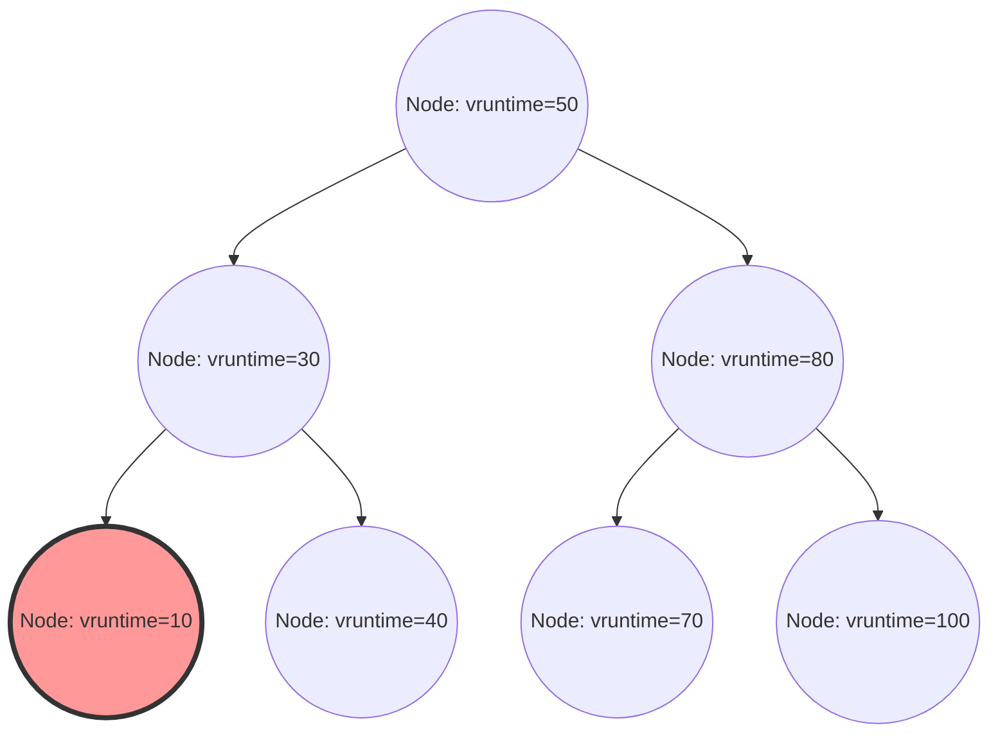

No kernel do Linux, um dos componentes mais importantes que determina o desempenho geral, a taxa de transferência (throughput) e a capacidade de resposta do sistema é o escalonador de processos. O "Completely Fair Scheduler (CFS)", que tem reinado por muito tempo como o escalonador padrão no Linux moderno (do kernel 2.6.23 até 6.5), pode ser considerado uma obra-prima que se afastou completamente do escalonamento tradicional baseado em heurísticas para buscar uma "justiça absoluta" baseada em um modelo matemático rigoroso.

Neste artigo, explicaremos em detalhes extremos, a nível de código-fonte, a arquitetura do CFS sob a perspectiva da estrutura interna do kernel Linux e da teoria de escalonamento. Abordaremos o cálculo matemático do tempo de execução virtual (vruntime), o gerenciamento de filas de execução (runqueues) por meio de árvores rubro-negras (Red-Black Trees), algoritmos de balanceamento de carga em ambientes multi-core e, além disso, a evolução para o EEVDF (Earliest Eligible Virtual Deadline First), introduzido nos kernels 6.6 e posteriores. Para hackers do kernel, programadores de sistemas e engenheiros que enfrentam o desafio do ajuste de desempenho de baixo nível, entender profundamente a estrutura interna do CFS é um caminho inevitável.

## Capítulo 1: A História da Evolução dos Escalonadores Linux e o Contexto da Criação do CFS

Para entender profundamente a filosofia de design e a beleza do CFS, é necessário desvendar quais desafios os escalonadores enfrentaram e como evoluíram ao longo da história do kernel Linux. A evolução dos algoritmos de escalonamento também tem sido uma história de batalhas ferozes com o trade-off entre dois requisitos conflitantes: taxa de transferência (a quantidade de processamento por unidade de tempo) e latência (tempo de resposta).

### A Era Anterior ao Kernel 2.4: Os Limites do Escalonador O(N) e o Dilema Baseado em Épocas

O escalonador da era do Linux 2.4 era simples, mas suficientemente capaz de lidar com as cargas de trabalho padrão da época. Este escalonador adotou um algoritmo baseado em épocas (Epoch), onde a cada processo era atribuída uma fatia de tempo (time slice), e quando todos os processos esgotavam suas fatias de tempo, uma nova época começava.

No entanto, à medida que os sistemas multiprocessadores começaram a se popularizar, este escalonador começou a expor falhas arquitetônicas fatais. A principal delas era que a complexidade de tempo era $O(N)$ (sendo N o número de processos executáveis). O sistema inteiro mantinha apenas uma única fila de execução global (runqueue) e, a cada escalonamento, o sistema precisava varrer "todos os processos" na fila para determinar o melhor processo para executar a seguir (aquele com a maior prioridade dinâmica).
Ainda mais grave era o controle de exclusão mútua. Como toda a fila de execução era protegida por um único spinlock global (`runqueue_lock`), a contenção de bloqueios (locks) se intensificava à medida que o número de núcleos da CPU aumentava. Enquanto uma CPU estava procurando o próximo processo a executar, todas as outras CPUs eram bloqueadas, desperdiçando preciosos ciclos de CPU na espera do spinlock (busy loop), o que criava um sério gargalo de escalabilidade (cache line bouncing).

### Kernel 2.6: Ingo Molnar e a Inovação do Escalonador O(1)

Para resolver fundamentalmente os problemas de escalabilidade e complexidade computacional, o famoso hacker do kernel Ingo Molnar introduziu o "Escalonador O(1)" durante o processo de desenvolvimento do kernel Linux 2.6. Como o nome sugere, este escalonador apresentava um algoritmo inovador que não dependia do número de processos no sistema e podia sempre selecionar o próximo processo em tempo constante $O(1)$.

O escalonador O(1) melhorou drasticamente o problema de escalabilidade em ambientes multiprocessadores ao ter uma fila de execução (Per-CPU Runqueue) completamente independente para cada CPU, eliminando o lock global. Cada fila de execução mantinha dois arrays com prioridades: o "Array Ativo (Active)" e o "Array Expirado (Expired)". Os arrays consistiam em listas encadeadas (`list_head`) para 140 níveis de prioridade (de 0 a 139, sendo 0 a 99 correspondentes à prioridade de tempo real e 100 a 139 correspondentes aos valores usuais de nice).

A seleção de processos era extremamente rápida. Um mapa de bits (bitmap) para cada prioridade era preparado e os bits das prioridades em que havia processos executáveis eram marcados com 1. A CPU usava as "instruções de busca do bit mais significativo" fornecidas pelo hardware (como `bsfl` e `lzcnt` no x86) para identificar a prioridade mais alta em ciclos de clock constantes, permitindo a busca do processo no topo daquela lista de prioridades em $O(1)$. Quando um processo esgotava sua fatia de tempo, ele era movido para o "Array Expirado" e, quando o "Array Ativo" ficava vazio, os ponteiros de ambos eram trocados para iniciar instantaneamente uma nova época.

No entanto, embora o escalonador O(1) fosse perfeito em termos de desempenho, ele acabou sofrendo com um outro enorme dilema: a "determinação da interatividade". Para melhorar a experiência do usuário em ambientes de desktop (capacidade de resposta do rastreamento do mouse e renderização de janelas), o escalonador estimava através de heurísticas (regras empíricas) se um processo era do tipo limitado por E/S (interativo) ou limitado por CPU (CPU bound), a partir da proporção do tempo de sono passado em relação ao tempo de execução. Aos processos determinados como interativos era concedido um aumento dinâmico de prioridade (bônus), e eles eram submetidos a um tratamento especial onde, mesmo que esgotassem suas fatias de tempo, permaneceriam no Array Ativo em vez de serem movidos para o Array Expirado.
Essa lógica heurística tornava-se cada vez mais bizarra e complexa a cada atualização de versão do kernel e, em casos extremos (edge cases), causava comportamentos inexplicáveis, como saltos severos de som em aplicativos multimídia ou a completa inanição (starvation) de processos limitados pela CPU.

### O RSDL de Con Kolivas e a Mudança de Paradigma para a Justiça Absoluta

Quem discordou das heurísticas extremamente complexas do escalonador O(1) e do atoleiro do tuning de desempenho foi Con Kolivas, que trabalhava como anestesiologista, mas também atuava como hacker do kernel. Ele argumentou que "a capacidade de resposta em desktops pode ser melhorada simplesmente com alocações puramente justas, sem a necessidade de lógicas complexas de estimativa", propondo patches como o escalonador Staircase e o escalonador RSDL (Rotating Staircase Deadline) nas listas de discussão.

O escalonador RSDL de Kolivas nunca foi integrado à linha principal (mainline), mas suas ideias forneceram uma inspiração decisiva a Ingo Molnar. Ingo Molnar abandonou completamente os cálculos complexos de prioridades dinâmicas e o código heurístico do escalonador O(1) e, em apenas algumas semanas, escreveu um escalonador totalmente novo baseado em um único e belo princípio: "dividir o tempo da CPU de forma completamente justa entre os processos". Este é o "Completely Fair Scheduler (CFS)".
O CFS foi mesclado à linha principal no Linux 2.6.23 e, desde então, operou continuamente como o coração do Linux por mais de 15 anos. Essa foi uma mudança de paradigma extremamente importante na história dos sistemas operacionais: o retorno de heurísticas complexas a modelos matemáticos.

## Capítulo 2: Os Fundamentos Matemáticos da Fila Justa (Fair Queuing) e o Modelo GPS

O conceito de "Completely Fair" (Totalmente Justo) do CFS não é um mero slogan, mas está enraizado no "modelo de alocação de recursos ideal" na teoria de sistemas operacionais e teoria de redes.

### A Utopia do Modelo GPS (Generalized Processor Sharing)

A forma ideal final na teoria do escalonamento é um conceito chamado de modelo GPS (Generalized Processor Sharing) ou modelo de Fluido (Fluid).
Um processador GPS ideal é um hardware virtual que ignora as restrições físicas. Se existem $N$ processos executáveis no sistema, o processador GPS fornece contínua, simultânea e exatamente $1/N$ do poder da CPU para cada processo. Ou seja, em vez de "dividir temporalmente" (time slice) o recurso da CPU e executá-los alternadamente, ele indica um estado onde o recurso é "dividido espacialmente (ou em termos de desempenho)" para avançar os processos infinitamente com zero atraso.

Quando há diferenças nas prioridades (peso: Weight) dos processos, o modelo GPS é expandido para o Weighted Fair Queuing (WFQ). Quando cada processo $i$ no sistema tem um peso $w_i$, o processo $i$ recebe "continuamente" uma capacidade de processamento proporcional à razão do seu próprio peso em relação à soma total dos pesos. Expresso matematicamente, a largura de banda da CPU $C_i$ recebida pelo processo $i$ é a seguinte:

$$
C_i = \text{CPU Total Capacity} \times \frac{w_i}{\sum_{j=1}^{N} w_j}
$$

Neste modelo, a sobrecarga de troca de contexto (context switch) é zero, e o processo continua avançando ao consumir constantemente a largura de banda da CPU a que tem direito.

### Aproximação do GPS em Tempo Discreto e o Teorema Fundamental do CFS

No entanto, o núcleo de uma CPU física real pode executar simultaneamente apenas uma única sequência de instruções (thread) a qualquer momento (exceto por SMT/Hyper-Threading). Implementar o modelo GPS como ele é em hardware físico é fisicamente impossível sob as leis da física.
Portanto, é necessário dividir o tempo em fatias finas e alternar rapidamente entre os processos (multiplexação por divisão de tempo) para aproximar (emular) o modelo GPS de forma macroscópica. Este é o princípio básico do CFS, aplicando o conceito de escalonamento de pacotes (WFQ) em roteadores de rede ao escalonamento de CPU.

O algoritmo CFS constantemente calcula e rastreia o "tempo ideal de CPU" que os processos em execução no sistema teriam obtido se estivessem, hipoteticamente, sendo executados num processador GPS ideal. Ele então realiza o escalonamento para executar a seguir o processo que tem a maior discrepância (atraso) em relação ao tempo real gasto na CPU física.
Este relógio virtual para rastrear o "grau de progresso em um processador GPS ideal" é exatamente o "tempo de execução virtual (vruntime)", que explicaremos em detalhes no Capítulo 3.

## Capítulo 3: A Matemática e o Mecanismo de Cálculo do Tempo de Execução Virtual (vruntime)

O núcleo do algoritmo CFS, que domina tudo, é uma variável de inteiro de 64 bits sem sinal chamada `vruntime` (Virtual Runtime), que é mantida por todos os processos (mais precisamente, a unidade básica de escalonamento, a `sched_entity`).
As regras de escalonamento do CFS não possuem manipulações complexas de arrays como o escalonador O(1), e são surpreendentemente simples.
**"Sempre selecione a tarefa com o menor vruntime na fila de execução e execute-a em seguida."**

### A Fórmula de Conversão do valor nice para Peso (Weight)

No Linux, usamos valores nice variando de `-20` (maior prioridade) a `19` (menor prioridade) para ajustar a prioridade de um processo a partir do espaço do usuário. O valor padrão é `0`.
No CFS, esses valores nice não são usados diretamente nos cálculos. Em vez disso, eles são convertidos em um "Peso (Weight)" que indica a razão de alocação relativa de CPU.

O requisito de design aqui era: "quando o valor nice é reduzido em 1 (aumento na prioridade), o processo ganha cerca de 10% a mais de tempo de CPU em relação a outros processos, e quando o valor nice é aumentado em 1, ele ganha cerca de 10% a menos". Para realizar isso matematicamente, os pesos são definidos para variar como uma progressão geométrica em relação aos valores nice. Especificamente, a taxa de proporção do peso (multiplicador) entre valores nice adjacentes é estabelecida em cerca de $1.25$.
Como $1.25^3 \approx 1.953 \approx 2.0$, uma mudança de 3 no valor nice leva à bela relação em que o tempo de CPU alocado para o processo é aproximadamente dobrado ou reduzido pela metade.

O código-fonte do kernel define estaticamente essa tabela de pesquisa baseada na teoria, `sched_prio_to_weight`, em `kernel/sched/core.c`.

```c
const int sched_prio_to_weight[40] = {
 /* -20 */     88761,     71755,     56483,     46273,     36291,
 /* -15 */     29154,     23254,     18705,     14949,     11916,
 /* -10 */      9548,      7620,      6100,      4904,      3906,
 /*  -5 */      3121,      2501,      1991,      1586,      1277,
 /*   0 */      1024,       820,       655,       526,       423,
 /*   5 */       335,       272,       215,       172,       137,
 /*  10 */       110,        87,        70,        56,        45,
 /*  15 */        36,        29,        23,        18,        15,
};
```
O peso de uma tarefa com um valor nice de `0` é definido como `1024`, que é tratado como a constante macro `NICE_0_LOAD` dentro do kernel. Todos os cálculos são feitos com base neste `1024`.

### O Modelo Matemático e a Fórmula para o Aumento do vruntime

Quando um processo é executado na CPU física real por um tempo real $\Delta exec$ (em nanossegundos), o `vruntime` desse processo aumenta de acordo com a seguinte fórmula:

$$
vruntime \mathrel{+}= \Delta exec \times \frac{NICE\_0\_LOAD}{weight}
$$

Vamos aplicar esta fórmula a valores nice específicos e considerar suas implicações.

1. **Quando o valor nice é `0` (peso `1024`)**:
   Temos $\frac{1024}{1024} = 1$. Portanto, o $vruntime$ aumenta exatamente no mesmo ritmo que o tempo real $\Delta exec$. Se executado em tempo real por 10ms, o vruntime também avançará em 10ms (10.000.000ns).
2. **Quando o valor nice é `-5` (peso `3121`, alta prioridade)**:
   Temos $\frac{1024}{3121} \approx 0.328$. Ou seja, o $vruntime$ aumenta a apenas cerca de 1/3 do ritmo do tempo real. Um aumento lento no vruntime significa que o processo pode manter o estado de "ter o menor vruntime" por mais tempo em comparação com outros processos, resultando na capacidade de monopolizar a CPU por um período maior.
3. **Quando o valor nice é `5` (peso `335`, baixa prioridade)**:
   Temos $\frac{1024}{335} \approx 3.05$. O $vruntime$ aumenta em um ritmo vertiginoso de cerca de três vezes o tempo real. Sendo executado apenas um pouco faz com que o vruntime se torne rapidamente muito grande e, em um piscar de olhos, seja ultrapassado por outras tarefas, cedendo o lugar de "menor vruntime" e abrindo mão da CPU.

Desta forma, o CFS normaliza o tempo de execução físico pelo "peso" de cada processo e o reduz à dimensão do índice único e absoluto `vruntime`, alcançando controle de prioridade e justiça simultaneamente.

### Evitando Divisões e Aritmética de Ponto Fixo na Implementação do Kernel

Embora o modelo matemático seja como o descrito acima, executar uma divisão pela fração $\frac{1}{weight}$ (instrução de divisão) toda vez no caminho do escalonamento, que é invocado dezenas de milhares de vezes por milissegundo nas profundezas do kernel do SO, resulta em penalidades de desempenho extremamente sérias (particularmente em arquiteturas mais antigas, resultando em dezenas a centenas de ciclos de clock de atraso).

Portanto, o kernel do Linux introduz uma otimização engenhosa para eliminar completamente as divisões. Ele prepara outra tabela de pesquisa `sched_prio_to_wmult` onde $\frac{2^{32}}{weight}$ (o inverso multiplicado por $2^{32}$) foi pré-calculado, substituindo completamente a divisão por multiplicações e um deslocamento à direita (shift-right) de 32 bits (a técnica fundamental de aritmética de ponto fixo).

```c
/* kernel/sched/fair.c : Estrutura lógica de calc_delta_fair() */
static inline u64 calc_delta_fair(u64 delta, struct sched_entity *se)
{
    if (unlikely(se->load.weight != NICE_0_LOAD)) {
        /*
         * Evita a divisão e calcula delta = delta * (NICE_0_LOAD / weight)
         * usando apenas instruções de multiplicação e deslocamento
         */
        delta = __calc_delta(delta, NICE_0_LOAD, &se->load);
    }
    return delta;
}
```
Sempre que uma interrupção de temporizador (Tick) ocorre, ou um context switch acontece, a função `update_curr()` em `kernel/sched/fair.c` é invocada. Ela mede rigorosamente o tempo real de execução da tarefa atualmente em execução e atualiza rigidamente o `vruntime` através da função acima.

## Capítulo 4: Gerenciamento da Fila de Execução Usando Árvore Rubro-Negra (Red-Black Tree) e Entidades de Escalonamento

Enquanto o escalonador O(1) usava estruturas de arrays separadas por prioridade, o CFS adotou uma estrutura de dados sofisticada chamada "Árvore Rubro-Negra (Red-Black Tree, RB-tree)", que é um tipo de árvore de busca binária balanceada.

### Estrutura cfs_rq e Abstração de sched_entity

Cada CPU retém na memória a sua própria estrutura CFS runqueue, `struct cfs_rq`. O mais interessante é que os objetos armazenados diretamente e escalonados dentro da fila não são `task_struct`, que representam o processo em si. O CFS abstrai o destino do escalonamento um nível além e o trata como uma estrutura `struct sched_entity` (entidade de escalonamento).

Essa abstração é extremamente importante. Isso porque, por meio dela, não importa se o objeto a ser escalonado é um processo único ou um grupo de processos aglomerados através dos cgroups (Control Groups), o CFS pode tratá-los transparentemente como exatamente a mesma e única `sched_entity`. O Group Scheduling (Escalonamento de Grupos) hierárquico é elegantemente alcançado através dessa estratégia.

### Operações na Árvore Rubro-Negra e Complexidade Computacional do Algoritmo

O CFS armazena todas as entidades executáveis que existem na fila de execução em uma árvore rubro-negra usando `vruntime` como a chave (critério de ordenação). Devido às propriedades de uma árvore de busca binária, há uma regra em que o nó filho da esquerda é menor que o nó pai, e o nó filho da direita é maior que o nó pai.

- **Busca pelo Melhor Processo (Fetch)**:
  A regra do CFS é "sempre executar o nó com o menor vruntime em seguida". O menor nó na árvore rubro-negra está no final extremo seguindo sempre para a esquerda a partir da raiz, isto é, "o nó mais à esquerda inferior da árvore (`rb_leftmost`)".
  Sempre que há uma inserção ou deleção na árvore, o CFS sempre retém um ponteiro para esse nó `rb_leftmost` em cache (`cfs_rq->rb_leftmost`). Consequentemente, a rotina onde o escalonador seleciona o próximo processo a ser executado (`pick_next_task_fair()`) não requer uma pesquisa na árvore. Ele só precisa ler o ponteiro em cache, completando assim o processo com complexidade de $O(1)$.

- **Inserção e Deleção de Nós**:
  Quando um processo desperta de um estado de suspensão (Wake-up) e se torna executável, ou quando termina a execução e devolve a CPU retornando para a fila, a complexidade computacional da inserção (`enqueue_entity()`) ou deleção (`dequeue_entity()`) na árvore rubro-negra é $O(\log N)$, onde N é o número de elementos na fila.
  Comparada ao escalonador O(1), a complexidade de ordem piorou. Contudo, dado que a árvore rubro-negra mantém sempre um auto-balanceamento, e a altura da árvore é mantida em $\log N$, mesmo se dezenas de milhares de processos existissem no sistema, a altura seria apenas em torno de uma dúzia de níveis. Considerando também a localidade de cache, a sobrecarga prática nos ciclos da CPU mostrou-se ser extremamente pequena, provando ser incrivelmente mais barata do que os custos de executar as lógicas heurísticas complexas $O(1)$.


*Figura: A estrutura lógica de uma árvore rubro-negra com o vruntime como chave. O nó mais à esquerda (vruntime=10) está sempre em cache como o próximo processo a ser executado.*

### Medidas de Prevenção de Overflow com min_vruntime e Correção ao Despertar

O `vruntime` é um inteiro de 64 bits sem sinal (`u64`) que aumenta incessantemente em nanossegundos. Para servidores empresariais que operam de forma contínua por longos períodos, sempre há a possibilidade matemática da ocorrência de um overflow (fenômeno de wraparound onde o valor excede seu limite e retorna a 0).

Um problema mais frequente na prática é o tratamento de processos recém-criados (via fork) ou de processos que dormiram por um longo tempo, esperando por E/S, e despertaram horas depois. Se o `vruntime` desses processos fosse deixado em zero ou no valor antigo, ele seria esmagadoramente pequeno em comparação com o `vruntime` de outros processos no sistema atual (por exemplo, vários trilhões de nanossegundos). Como resultado, o CFS identificaria incorretamente que "este processo não usou a CPU de forma alguma, estando em um estado extremamente desfavorecido", fazendo com que o processo monopolizasse a CPU inteiramente (causando a inanição de todos os outros processos) até que o seu `vruntime` alcançasse o dos outros.

Para prevenir isso completamente, a estrutura `cfs_rq` retém uma importante variável de rastreamento chamada `min_vruntime`.
O `min_vruntime` rastreia o menor `vruntime` de todos os processos atualmente presentes naquela fila de execução, mas uma regra rigorosa impõe que ele **"só pode ser aumentar monotonamente"**. Ou seja, ele nunca retrocede.

- **Inicialização de Novos Processos (no fork)**:
  Quando um novo processo é gerado, o seu `vruntime` inicial não começa do zero. Em vez disso, ele é ajustado (inicializado) para um valor razoável com base no `vruntime` de seu processo pai ou no `min_vruntime` da fila de execução atual.
- **Correção de Processos que Despertam (Wake-up)**:
  Quando um processo que estava dormindo por um longo tempo acorda e retorna para a fila de execução, uma correção rigorosa acontece dentro da função `enqueue_entity()`. Ele compara o `vruntime` antigo do processo com o valor de `min_vruntime` da fila de execução subtraído de um valor de penalidade específico (calculado a partir de `sysctl_sched_latency`, etc.), adotando o valor que for maior.
  Em outras palavras, `se->vruntime = max_vruntime(se->vruntime, cfs_rq->min_vruntime - valor_de_correcao)`. Assim, o tempo é obrigatoriamente "puxado" para cima, correspondendo ao relógio de todo o sistema. Isso previne que o processo monopolize injustamente a CPU ao retornar de um longo sono, ao mesmo tempo que confere um modesto atraso de bônus para garantir a capacidade de resposta ao voltar de um sono curto (como esperar por digitação no teclado).

Além disso, nas funções de comparação de árvores rubro-negras dentro do kernel (como `entity_before()`), ao comparar as magnitudes de dois valores `u64`, em vez de compará-los diretamente, eles são primeiro convertidos (cast) para inteiros com sinal de 64 bits (`s64`) e feita a subtração. O sinal (positivo ou negativo) do resultado determina o maior. Este é um hack que se aproveita da aritmética modular da representação de complemento de dois; contanto que a diferença entre os dois valores seja menor que $2^{63}$, a relação exata de ordem temporal pode ser julgada (mesmo que um dos valores sofra overflow e caia de volta para 0), tornando o problema de wraparound completamente inofensivo.

## Capítulo 5: O Mecanismo de Balanceamento de Carga (Load Balancing) em Ambientes Multi-core e NUMA

Em arquiteturas de hardware modernas, os processadores de núcleo único não existem mais, sendo comuns os ambientes multi-core, com dezenas a centenas de núcleos, bem como as arquiteturas NUMA (Non-Uniform Memory Access), onde as latências de acesso à memória dependem de distâncias físicas.
Independentemente de quão perfeita e justa a matemática do algoritmo de árvore rubro-negra do CFS seja em uma única CPU, se em outra CPU há uma fila com 100 tarefas congestionadas, enquanto a CPU vizinha está completamente ociosa, a taxa de transferência de todo o sistema será péssima. É por isso que o balanceamento de carga e a migração de tarefas em ambientes de múltiplos núcleos é um subsistema tão extremamente importante.

### A Complexa Topologia Hierárquica de sched_domain e sched_group

O kernel do Linux constrói estruturas hierárquicas de dados conhecidas como `sched_domain` e `sched_group` para abstrair as complexas topologias de CPU do hardware físico e gerenciá-las de forma eficiente. Ao inicializar o sistema, as informações de hardware são lidas do ACPI ou da Device Tree, construindo uma árvore hierárquica lógica.

Por exemplo, imagine um sistema com 2 soquetes físicos (nós NUMA). Cada soquete possui 4 núcleos físicos, cada um com SMT (Hyper-Threading, etc.) ativado, totalizando 16 threads lógicas. Neste caso, o escalonador constrói os seguintes domínios hierárquicos, de baixo para cima:

1. **Domínio SMT (Simultaneous Multithreading)**:
   A camada inferior. Lida com o balanceamento de carga entre duas threads lógicas compartilhando exatamente o mesmo núcleo físico. Visto que os caches L1/L2 e as unidades de execução são totalmente compartilhados, o custo (penalidade) de migrar tarefas aqui é mínimo.
2. **Domínio MC (Multi-Core)**:
   Lida com o balanceamento de carga de tarefas entre múltiplos núcleos físicos dentro do mesmo soquete físico (pacote de CPU). Usualmente, visto que o cache L3 (LLC: Last Level Cache) é compartilhado, a penalidade induzida por falhas de cache (cache miss) ao migrar processos é moderada.
3. **Domínio NUMA**:
   A camada superior. Lida com o balanceamento de carga entre soquetes físicos diferentes (nós NUMA). Se um processo atravessar esses domínios, os acessos à memória que o processo utilizava se tornarão acessos remotos à memória, causando uma degradação severa da latência, portanto a penalidade de migração (valor de resistência) é definida como extremamente alta.

O balanceamento de carga (Load Balancing) é acionado em duas ocasiões: por interrupção periódica de temporizador (Periodic Load Balance) e no momento imediato antes da fila de uma CPU esvaziar e ela transitar para o modo ocioso (NewIdle Load Balance).
O algoritmo percorre os domínios da base (SMT) ao topo (NUMA) sequencialmente. Em cada domínio, ele calcula a carga média entre os seus correspondentes `sched_group`. Apenas se exceder os limiares de penalidade de domínio, ele realiza a migração (puxar/pull) das tarefas, retirando-as do grupo com carga mais pesada para o grupo com menor carga (ele próprio).

### A Matemática do Algoritmo PELT (Per-Entity Load Tracking)

Para que o balanceamento de carga compare com precisão "a carga dos grupos", é fundamental que ele possa medir com precisão "a carga das tarefas". Antigamente, o kernel do Linux utilizava um método grosseiro de amostrar instantaneamente o número de tarefas na fila de execução (comprimento da fila), mas isso era inadequado para estimar com precisão o peso de tarefas repentinas (bursts) que repetiam ON/OFF rapidamente, provocando migrações inadequadas de tarefas.

Para resolver este problema, o que foi introduzido recentemente e melhorou drasticamente a precisão de escalonamento do kernel é o algoritmo **PELT (Per-Entity Load Tracking)**.
PELT é um algoritmo que rastreia continuamente e decai, com uma resolução de milissegundos usando a Média Móvel Exponencialmente Ponderada (EWMA - Exponentially Weighted Moving Average), o "histórico" de quanto tempo de CPU cada entidade (processo ou cgroup) consumiu no passado.

A carga de uma tarefa no instante de tempo $t$, denotada por $L_t$, é calculada usando o consumo de CPU do período atual $C_t$ e o acúmulo histórico $L_{t-1}$ com a seguinte relação de recorrência:

$$ L_t = C_t + y \times L_{t-1} $$

Onde $y$ é o fator de decaimento (um valor maior que 0 e menor que 1). No kernel do Linux, o valor de $y$ é ajustado de forma que o impacto do histórico passado diminua exatamente pela metade em 32 milissegundos (meia-vida de 32ms, ou seja, $y^{32} = 0.5$).
Como resultado, a carga aumenta de forma suave quando uma tarefa começa a usar a CPU e diminui de forma suave quando ela entra em sono. Os índices de carga extremamente precisos e estáveis obtidos pelo PELT são fornecidos não apenas para o balanceamento de carga do CFS, mas também diretamente para o governador de economia de energia que muda dinamicamente a frequência da CPU (o governador Schedutil do cpufreq), tornando-se a tecnologia central para alcançar o equilíbrio ideal entre desempenho e eficiência energética.

### CFS Bandwidth Control (Controle de Largura de Banda: Cotas e Throttling)

Uma funcionalidade absolutamente indispensável como alicerce das modernas infraestruturas de nuvem e tecnologias de contêineres (Docker, Kubernetes) é o rigoroso limite no uso dos recursos de CPU (Controle de Largura de Banda) através dos cgroups. O CFS contém um mecanismo de alocação de largura de banda perfeitamente controlável.

O controle de largura de banda do CFS é definido por dois parâmetros: `cpu.cfs_period_us` (período) e `cpu.cfs_quota_us` (cota/limite).
Por exemplo, processos pertencentes a um cgroup com period configurado para `100000` (100ms) e quota configurada para `50000` (50ms) têm permissão para usar a CPU física num total agregado de, no máximo, 50ms (50% de um núcleo da CPU) dentro de um intervalo de 100ms.

Quando os processos são executados, o kernel usa temporizadores de alta precisão para medir o tempo de execução consumido e vai subtraindo esse tempo da cota alocada ao cgroup. Quando os processos esgotam inteiramente a cota, uma medida dramática é tomada. O CFS remove fisicamente (dequeue) todas as entidades pertencentes àquele cgroup da árvore rubro-negra e as isola em uma lista de espera especial, em um estado não executável chamado de "Estrangulado (Throttled)".
Neste estado, os processos não recebem nenhum tempo de CPU, independentemente do quanto desejem executar. Quando o próximo período (period) iniciar, o temporizador de hardware é acionado, a cota é reposta inteiramente (refresh), e as entidades isoladas são reinseridas (enqueue) na árvore rubro-negra para retomar a execução.
Este mecanismo de throttling é extremamente robusto, funcionando como uma barreira de defesa impenetrável que previne o "Problema do Vizinho Barulhento (Noisy Neighbor Problem)", no qual um contêiner específico sai do controle e consome os recursos de CPU de outros contêineres em ambientes multilocatário (multi-tenant).

## Capítulo 6: Escalonadores de Tempo Real e a Evolução para o Moderno EEVDF (Earliest Eligible Virtual Deadline First)

O Linux possui políticas de escalonamento de tempo real em conformidade com o padrão POSIX (`SCHED_FIFO`, `SCHED_RR`), que estão completamente separadas do CFS (utilizado para processos regulares: `SCHED_NORMAL`, `SCHED_BATCH`, `SCHED_IDLE`).
Processos em tempo real possuem uma prioridade absoluta entre 0 e 99 (RT prio) e, contanto que haja um único processo em tempo real executável no sistema, todos os processos do CFS (espaço de prioridade 100 a 139) são totalmente destituídos de seus direitos de execução na CPU. O escalonador de tempo real não usa a árvore rubro-negra; em vez disso, é gerenciado por um algoritmo extremamente simples $O(1)$, que utiliza matrizes de prioridade e bitmaps como o antigo escalonador O(1), e é utilizado em controles industriais ou processamento de áudio onde respostas determinísticas de ordem de microssegundos são necessárias.

### Os Limites Estruturais do CFS e a Ausência de Garantias na Latência (Atrasos)

Agora, em ambientes de processos normais, o CFS alcançou um desempenho quase literalmente perfeito no aspecto da "total justiça matemática no throughput a longo prazo". No entanto, à medida que os sistemas evoluíram e os requisitos de ambientes desktop ou móveis (como o Android) se tornaram mais exigentes, os limites arquitetônicos do CFS começaram a ser expostos na questão da "garantia de latência (tempo de resposta) específica dentro de alguns milissegundos".

Como preço pela rejeição às heurísticas em favor do julgamento puramente através dos tamanhos de `vruntime`, o CFS permitia que tarefas dependentes de E/S (como tarefas de renderização de interface de usuário que respondem a toques de teclado em dezenas de microssegundos e logo dormem novamente) fossem temporariamente "enterradas" entre grupos de tarefas pesadas que demandam alta CPU (como codificação de vídeos), adiando o momento da sua vez e provocando solavancos desconfortáveis (UI jiggers).
Para amenizar isso, os desenvolvedores de kernel remendaram o modelo puramente matemático do CFS e continuaram a adicionar novos parâmetros de ajustes como o `sysctl kernel.sched_wakeup_granularity_ns` (limiar de preempção de despertar) ou `sched_min_granularity_ns`, e — ironicamente, voltando aos tempos do O(1) — adicionando inumeráveis códigos heurísticos menores. Contudo, estes eram apenas tratamentos sintomáticos e não trouxeram uma garantia matemática essencial para a latência.

### A Revolução do Linux 6.6: A Introdução do Escalonador EEVDF

Para colocar um ponto final nesse dilema de longa data, devido ao imenso esforço dos mantenedores do CFS como Peter Zijlstra, no kernel do Linux 6.6, o algoritmo central do CFS foi inteiramente substituído por um algoritmo completamente novo conhecido como **EEVDF (Earliest Eligible Virtual Deadline First)**. Os nomes das classes no código-fonte (`fair.c` e `sched_class fair_sched_class`) foram mantidos por questões de compatibilidade, mas a lógica central foi renovada desde suas bases.

EEVDF é, na verdade, um algoritmo clássico de artigo acadêmico apresentado em 1995 por Ion Stoica e Hussein Abdel-Wahab, o qual ostenta a formidável propriedade de conciliar matematicamente a "Justiça (Fairness)" dos processos com a "Garantia Rigorosa de Latência (Latency Guarantee)".
No algoritmo EEVDF, em lugar da métrica única de `vruntime` do CFS, dois importantes indicadores temporais são calculados e rastreados para governar as execuções dos processos:

1. **Julgamento do Tempo de Elegibilidade (Eligible Time) e o Atraso (Lag)**:
   O EEVDF calcula qual é a quantidade de "Atraso (Lag)" que um processo possui atualmente, em comparação com o modelo GPS ideal. Processos onde o Lag é positivo (isto é, estão recendo menos CPU que o ideal, logo sendo tratados de forma injusta) são avaliados como "Elegíveis (Eligible/Qualificados)". Ao contrário, os processos que consumiram mais do que o ideal tornam-se inelegíveis.
2. **Cálculo da Fronteira Virtual Crítica Temporal (Virtual Deadline)**:
   Para o intervalo de tempo de execução (time slice) que um processo necessita, calcula-se a fronteira limite virtual dentro da qual o uso deste tempo deve ser consumido de forma finalizada sobre o hipotético processador GPS ideal.

As regras normativas de escalonamento perante o EEVDF possuem um nível além do CFS, e determinam:
**"Dentre o conjunto de tarefas no estado presente avaliadas como 'Elegíveis', selecione para ser executada a seguir a unidade cujo limite de Fronteira Virtual Temporal (Virtual Deadline) é o mais antecipado (menor)."**

Os benefícios colhidos através desta transição algorítmica para o EEVDF são inestimáveis. As numerosas "lógicas de heurísticas conectadas ao despertar (wake-up)", que ao longo das décadas no CFS acumularam inchaço base no código, tornaram-se desnecessárias e foram exterminadas (removidas).
Adicionalmente, moldou-se a fundação de infraestrutura em que os "comprimentos dos fatiamentos requeridos" podem ser explicitamente indicados processualmente (projetado futuramente a aberturas do espaço de usuário por expansões de cgroups ou novos system calls de `sched_setattr`).
Graças a isto, tarefas interativas de UI exigindo fatias estritamente diminutas e muito responsivas passam a receber cômputos de prazos temporais de Virtual Deadline definidos num tempo incrivelmente curtos (próximos). Sendo garantidas matematicamente que as preempções (usurpações) contra cálculos pesados da CPU ocorram impiedosamente proporcionando reações instantâneas. Sem a demanda de quaisquer sacrifícios ou perdas sobre os resultados da vazão do sistema como um todo, viabilizou-se controlar totalmente as ordens temporais com margens estritas de micro latências.

## Conclusão

O Completamente Justo Escalonador (CFS) do Linux, e a sua evolução EEVDF, possuem um profundo contexto teórico proveniente do modelo ideal GPS e do modelo WFQ focado em redes. Pode-se afirmar ser isso um pináculo da engenharia de software, onde esta perfeição foi concretizada sob severas e opressivas restrições de processamento espacial em área do Kernel, efetuadas com recurso às matemáticas do `vruntime` unidas pelas eficientes matrizes de equilibragens refinadas nas rubro-negras.

Começando com o problema de contenção de bloqueios nos primórdios dos multiprocessadores, passando pelas armadilhas heurísticas do escalonador O(1), e retornando à justiça matemática com o CFS. Além disso, através da integração do algoritmo PELT para lidar com as complexidades extremas dos multi-cores e topologias NUMA, e da realização de um controle estrito de largura de banda por meio dos cgroups que suportam a era da nuvem, e agora para o EEVDF que incorpora o cálice sagrado da garantia absoluta de latência, o escalonador do Linux continua a evoluir sem parar.

Compreender profundamente a evolução histórica do escalonador, que é o núcleo do sistema operacional, e sua estrutura interna apoiada por fórmulas matemáticas, não servirá apenas para satisfazer a curiosidade intelectual, como também será uma ferramenta intensamente poderosa para detectar focos lentos de sistema, providenciar conjecturas em cenários paralelos nos reinos dos multi-threads e, evidentemente, suportar idealizações plenas no projeto de arquiteturas e aplicativos superiores de alto desempenho.

E assim concluímos nossa exploração ao mundo abissal do escalonador, o centro nervoso do kernel Linux, que detém o destino de todos os processos.
