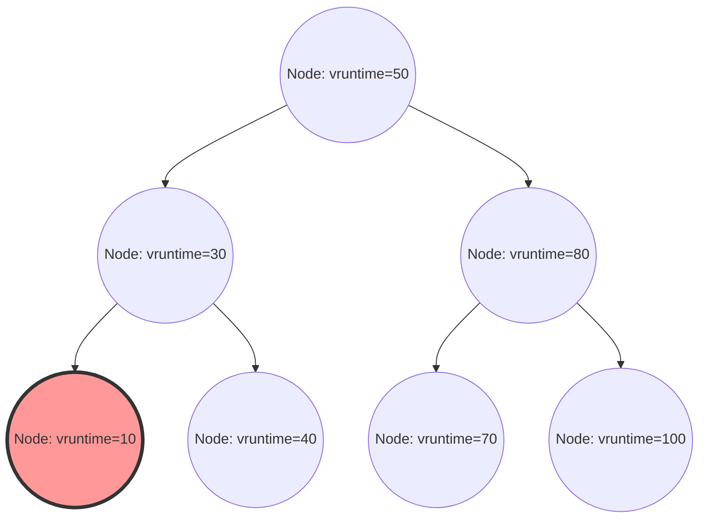

В ядре Linux одним из самых важных компонентов, определяющих производительность, пропускную способность и отзывчивость системы в целом, является планировщик процессов. «Completely Fair Scheduler (CFS)», который на протяжении многих лет господствовал в качестве планировщика по умолчанию в современном Linux (от версии ядра 2.6.23 до 6.5), полностью отказался от традиционного планирования на основе эвристики и по праву считается шедевром, стремящимся к «полной справедливости» на основе строгой математической модели.

В этой статье с точки зрения внутренней структуры ядра Linux и теории планирования мы предельно подробно, на уровне исходного кода, рассмотрим архитектуру CFS, математические вычисления виртуального времени выполнения (vruntime), управление очередью выполнения с помощью красно-черного дерева (Red-Black Tree), алгоритмы балансировки нагрузки в многоядерных средах, а также эволюцию в сторону EEVDF (Earliest Eligible Virtual Deadline First), внедренного в последних версиях ядра начиная с 6.6. Для хакеров ядра, системных программистов и инженеров, занимающихся настройкой производительности на низком уровне, глубокое понимание внутреннего устройства CFS является необходимым шагом.

## Глава 1: История эволюции планировщиков Linux и предпосылки создания CFS

Для того чтобы глубоко понять философию дизайна CFS и его красоту, необходимо проследить, с какими проблемами сталкивались планировщики в истории ядра Linux и как они развивались. Эволюция алгоритмов планирования была историей ожесточенной борьбы с компромиссами между противоречивыми требованиями: пропускной способностью (объемом обработки в единицу времени) и задержкой (временем отклика).

### До эры ядра 2.4: Ограничения планировщика O(N) и дилемма эпохального подхода

Планировщик времен ядра Linux 2.4 был простым, но вполне справлялся со стандартными рабочими нагрузками того времени. В этом планировщике использовался алгоритм на основе эпох (Epoch), при котором каждому процессу выделялся квант времени (timeslice), и когда все процессы исчерпывали свои кванты времени, начиналась новая эпоха.

Однако с началом широкого распространения многопроцессорных систем этот планировщик начал демонстрировать фатальные архитектурные недостатки. Вычислительная сложность составляла $O(N)$ (где N — количество готовых к выполнению процессов). В системе была только одна глобальная очередь выполнения (runqueue), и при каждом планировании сканировались «все процессы» в очереди, чтобы определить наиболее подходящий для следующего выполнения процесс (с наивысшим динамическим приоритетом).
Еще более серьезной проблемой был эксклюзивный контроль. Поскольку вся очередь выполнения была защищена единой глобальной спин-блокировкой (`runqueue_lock`), по мере увеличения количества ядер ЦП конкуренция за блокировку усиливалась. В то время как один ЦП искал следующий процесс для выполнения, все остальные ЦП блокировались, а ценные циклы процессора тратились на ожидание спин-блокировки (цикл ожидания), что приводило к серьезному узкому месту в масштабируемости (скачки кэш-строк).

### Ядро 2.6: Инго Молнар и инновация планировщика O(1)

Чтобы фундаментально решить эту проблему масштабируемости и вычислительной сложности, в процессе разработки ядра Linux 2.6 известный хакер ядра Инго Молнар (Ingo Molnar) внедрил «планировщик O(1)». Как следует из названия, этот планировщик обладал новаторским алгоритмом, который совершенно не зависел от количества процессов в системе и всегда мог выбрать следующий процесс за постоянное время $O(1)$.

Планировщик O(1) имел полностью независимую очередь выполнения (Per-CPU Runqueue) для каждого ЦП (процессора), и благодаря устранению глобальной блокировки радикально улучшил проблему масштабируемости в многопроцессорных средах. Каждая очередь выполнения содержала два массива с приоритетами: массив «Active» и массив «Expired». Массивы состояли из связных списков (`list_head`) для каждого из 140 уровней приоритета (от 0 до 139, из которых 0-99 — приоритеты реального времени, а 100-139 соответствуют обычным значениям nice).

Выбор процесса происходил чрезвычайно быстро. Подготавливалась битовая карта по приоритетам, и бит приоритета, для которого существовал процесс, готовый к выполнению, устанавливался в 1. ЦП с помощью предоставляемых аппаратным обеспечением инструкций поиска старшего бита (таких как `bsfl` или `lzcnt` в x86) определял наивысший приоритет за постоянное количество тактов и мог извлечь процесс, находящийся в начале этого списка приоритетов за $O(1)$. Когда процесс исчерпывал свой квант времени, он перемещался в массив «Expired», а когда массив «Active» становился пустым, достаточно было поменять местами указатели на них, чтобы мгновенно начать новую эпоху.

Однако, хотя планировщик O(1) был идеален с точки зрения производительности, он столкнулся с другой огромной дилеммой — «определением интерактивности». Для улучшения пользовательского опыта в настольных средах (отзывчивость движения мыши и отрисовки окон) планировщик на основе эвристики (эмпирических правил) пытался угадать, является ли процесс зависимым от ввода-вывода (I/O-bound, интерактивным) или зависимым от процессора (CPU-bound), исходя из соотношения времени сна и времени выполнения в прошлом. Процессам, признанным интерактивными, давалось динамическое повышение приоритета (бонус), и для них делалось исключение: даже при исчерпании кванта времени они не перемещались в массив Expired, а оставались в массиве Active.
Эта эвристическая логика становилась все более сложной и запутанной с каждым обновлением версии ядра, и в крайних случаях она стала причиной непонятного поведения, такого как серьезные прерывания звука в мультимедийных приложениях или полное голодание (starvation) процессов, зависимых от CPU.

### RSDL Кона Коливаса и смена парадигмы в сторону полной справедливости

Против чрезвычайно сложной эвристики планировщика O(1) и его утомительной настройки выступил Кон Коливас (Con Kolivas), работавший анестезиологом и по совместительству хакером ядра. Он утверждал, что «отзывчивость десктопа можно улучшить просто за счет чисто справедливого распределения ресурсов, без какой-либо сложной логики догадок», и предложил в список рассылки (ML) патчи для планировщика Staircase и планировщика RSDL (Rotating Staircase Deadline).

Хотя планировщик RSDL Коливаса так и не был включен в основную ветку, его идеи послужили решающим вдохновением для Инго Молнара. Инго Молнар полностью отказался от сложных вычислений динамических приоритетов и эвристического кода планировщика O(1) и всего за несколько недель написал совершенно новый планировщик, основанный на едином прекрасном принципе «абсолютно справедливого распределения процессорного времени между процессами». Это и был «Completely Fair Scheduler (CFS)».
CFS был объединен с основной веткой в Linux 2.6.23 и с тех пор работает как сердце Linux уже более 15 лет. Это был чрезвычайно важный сдвиг парадигмы в истории операционных систем: возвращение от сложных эмпирических правил к математической модели.

## Глава 2: Математические основы полной справедливости (Fair Queuing) и модель GPS

Концепция «Completely Fair (Полная справедливость)» в CFS — это не просто лозунг, она уходит корнями в «идеальную модель распределения ресурсов» в теории операционных систем и теории сетей.

### Утопия модели GPS (Generalized Processor Sharing)

Конечным идеалом в теории планирования является концепция, называемая моделью GPS (Generalized Processor Sharing) или Fluid (жидкостная).
Идеальный процессор GPS — это виртуальное оборудование, игнорирующее физические ограничения. Если в системе существует $N$ процессов, готовых к выполнению, процессор GPS будет предоставлять каждому процессу одновременно, параллельно и точно $1/N$ мощности ЦП. Иными словами, это не «временное разделение (квантование времени)» ресурса ЦП с попеременным выполнением, а «пространственное (или производительное) разделение», позволяющее процессам продвигаться с нулевой задержкой бесконечно.

Если процессы имеют разные приоритеты (веса: Weight), модель GPS расширяется до Weighted Fair Queuing (WFQ). Когда каждый процесс $i$ в системе имеет вес $w_i$, процесс $i$ всегда «непрерывно» получает вычислительную мощность, пропорциональную отношению его собственного веса к общей сумме весов. Математически, полоса пропускания ЦП $C_i$, получаемая процессом $i$, выражается следующим образом:

$$
C_i = \text{CPU Total Capacity} \times \frac{w_i}{\sum_{j=1}^{N} w_j}
$$

В этой модели накладные расходы на переключение контекста равны нулю, и процесс постоянно продолжает выполняться, потребляя ту полосу пропускания ЦП, на которую он имеет право.

### Аппроксимация GPS в дискретном времени и основная теорема CFS

Однако реальное физическое ядро ЦП может одновременно выполнять только одну последовательность инструкций (поток) в любой момент времени (за исключением SMT/Hyper-Threading). Реализовать модель GPS непосредственно на физическом оборудовании невозможно по законам физики.
Поэтому необходимо разделить время на мелкие кванты и быстро переключать процессы (мультиплексирование с разделением времени), чтобы при макроскопическом рассмотрении аппроксимировать (эмулировать) модель GPS. Это основной принцип CFS, применяющий концепцию планирования пакетов (WFQ) в сетевых маршрутизаторах к планированию ЦП.

Алгоритм CFS постоянно вычисляет и отслеживает «идеальное время ЦП», которое получил бы процесс, выполняющийся в системе, если бы он выполнялся на идеальном процессоре GPS. Затем он планирует на выполнение процесс, у которого «погрешность (отставание)» по сравнению со временем, фактически потребленным на реальном ЦП, является наибольшей.
Именно виртуальные часы для отслеживания этой «степени продвижения на идеальном процессоре GPS» являются «виртуальным временем выполнения (vruntime)», которое мы подробно рассмотрим в главе 3.

## Глава 3: Математика виртуального времени выполнения (vruntime) и механизмы вычислений

Ядром алгоритма CFS, управляющим всем, является переменная `vruntime` (Virtual Runtime) — 64-битное беззнаковое целое число, которое хранится у каждого процесса (точнее, у базовой единицы планирования `sched_entity`).
Правило планирования CFS не требует сложных операций с массивами, как в планировщике O(1), и удивительно просто:
**«Всегда выбирать задачу с наименьшим значением vruntime в очереди выполнения для следующего запуска»**

### Формула преобразования значения nice в вес (Weight)

В Linux для настройки приоритета процесса из пользовательского пространства используется значение nice от `-20` (наивысший приоритет) до `19` (низший приоритет). Значение по умолчанию — `0`.
CFS не использует это значение nice непосредственно в вычислениях. Вместо этого оно преобразуется в «вес (Weight)», который указывает на относительную долю распределения ресурсов ЦП.

Требованием к дизайну здесь было то, чтобы «при снижении значения nice на 1 (повышении приоритета) процесс получал примерно на 10% больше процессорного времени по сравнению с другими процессами, а при увеличении значения nice на 1 — примерно на 10% меньше». Для математической реализации этого вес определяется так, чтобы изменяться в геометрической прогрессии относительно значения nice. В частности, отношение (множитель) весов между соседними значениями nice составляет около $1.25$.
Поскольку $1.25^3 \approx 1.953 \approx 2.0$, выводится красивое соотношение: при изменении значения nice на 3 выделяемое процессу процессорное время увеличивается примерно в два раза или уменьшается вдвое.

В исходном коде ядра `kernel/sched/core.c` статически определена таблица поиска `sched_prio_to_weight`, основанная на этой теории.

```c
const int sched_prio_to_weight[40] = {
 /* -20 */     88761,     71755,     56483,     46273,     36291,
 /* -15 */     29154,     23254,     18705,     14949,     11916,
 /* -10 */      9548,      7620,      6100,      4904,      3906,
 /*  -5 */      3121,      2501,      1991,      1586,      1277,
 /*   0 */      1024,       820,       655,       526,       423,
 /*   5 */       335,       272,       215,       172,       137,
 /*  10 */       110,        87,        70,        56,        45,
 /*  15 */        36,        29,        23,        18,        15,
};
```
Вес для задачи со значением nice, равным `0`, определен как `1024`, что обрабатывается внутри ядра как макрос-константа `NICE_0_LOAD`. Все вычисления выполняются относительно этого значения `1024`.

### Математическая модель и формула расчета увеличения vruntime

Когда процесс выполняется на реальном физическом ЦП в течение реального времени $\Delta exec$ (в наносекундах), его `vruntime` увеличивается согласно следующей формуле:

$$
vruntime \mathrel{+}= \Delta exec \times \frac{NICE\_0\_LOAD}{weight}
$$

Давайте рассмотрим, что означает эта формула, применив ее к конкретным значениям nice.

1. **Если значение nice равно `0` (вес `1024`)**: 
   Мы получаем $\frac{1024}{1024} = 1$. Следовательно, $vruntime$ увеличивается точно в таком же темпе, как и реальное время $\Delta exec$. Если процесс выполняется 10 мс реального времени, vruntime также продвинется на 10 мс (10 000 000 нс).
2. **Если значение nice равно `-5` (вес `3121`, высокий приоритет)**:
   Мы получаем $\frac{1024}{3121} \approx 0.328$. То есть $vruntime$ увеличивается примерно в три раза медленнее реального времени. Медленный рост vruntime означает, что процесс может дольше сохранять состояние «наименьшего vruntime» по сравнению с другими процессами и, как следствие, дольше занимать ЦП.
3. **Если значение nice равно `5` (вес `335`, низкий приоритет)**:
   Мы получаем $\frac{1024}{335} \approx 3.05$. $vruntime$ увеличивается в бешенном темпе, примерно в 3 раза быстрее реального времени. Поскольку vruntime резко возрастает даже при кратковременном выполнении, процесс мгновенно обгоняется другими задачами, уступает место «наименьшего vruntime» и передает ЦП.

Таким образом, CFS нормализует физическое время выполнения на «вес» каждого процесса, сводя его к измерению единого абсолютного показателя `vruntime`, тем самым одновременно достигая контроля приоритета и справедливости.

### Избегание деления в реализации ядра и арифметика с фиксированной запятой

Хотя математическая модель описана выше, в глубине ядра ОС, в пути планировщика, который вызывается десятки тысяч раз каждую миллисекунду, выполнение деления $\frac{1}{weight}$ (инструкции деления) каждый раз влечет за собой чрезвычайно серьезные потери производительности (особенно на старых архитектурах — задержки от десятков до сотен тактовых циклов).

По этой причине ядро Linux использует хитроумную оптимизацию для полного исключения деления. Оно заранее вычисляет значения $\frac{2^{32}}{weight}$ (обратное значение, умноженное на $2^{32}$) и подготавливает еще одну таблицу поиска `sched_prio_to_wmult`, полностью заменяя деление умножением и 32-битным сдвигом вправо (это базовая техника арифметики с фиксированной запятой).

```c
/* kernel/sched/fair.c : calc_delta_fair() の論理構造 */
static inline u64 calc_delta_fair(u64 delta, struct sched_entity *se)
{
    if (unlikely(se->load.weight != NICE_0_LOAD)) {
        /*
         * 割り算を避け、乗算とシフト命令のみで
         * delta = delta * (NICE_0_LOAD / weight) を計算する
         */
        delta = __calc_delta(delta, NICE_0_LOAD, &se->load);
    }
    return delta;
}
```
При каждом прерывании таймера (Tick) или при каждом переключении контекста вызывается функция `update_curr()` из `kernel/sched/fair.c`, фактическое время выполнения текущей запущенной задачи точно измеряется, и `vruntime` строго обновляется с помощью вышеупомянутой функции.

## Глава 4: Управление очередью выполнения с помощью красно-черного дерева (Red-Black Tree) и сущности планирования

В то время как планировщик O(1) использовал структуру массивов по приоритетам, CFS применил сложную структуру данных, называемую «красно-черным деревом (Red-Black Tree, RB-tree)», которая является разновидностью сбалансированного бинарного дерева поиска.

### Структура cfs_rq и абстракция sched_entity

Каждый ЦП хранит в памяти выделенную структуру очереди выполнения CFS `struct cfs_rq`. Интересно то, что объекты, которые напрямую хранятся в очереди выполнения и планируются, не являются структурой `task_struct`, представляющей сам процесс. CFS абстрагирует объект планирования на еще один уровень и рассматривает его как структуру `struct sched_entity` (сущность планирования).

Эта абстракция чрезвычайно важна. Поскольку благодаря ей, будь то планируемый объект отдельным процессом или группой процессов, сгруппированных с помощью cgroups (Control Groups), CFS может прозрачно обращаться с ним как с одной и той же `sched_entity`. Это элегантно реализует иерархическое групповое планирование (Group Scheduling).

### Операции над красно-черным деревом и вычислительная сложность алгоритма

CFS сохраняет все готовые к выполнению сущности в очереди выполнения в красно-черном дереве, используя `vruntime` в качестве ключа (критерия сортировки). По свойствам бинарного дерева поиска левый дочерний узел меньше родительского узла, а правый дочерний узел больше родительского узла.

- **Поиск (извлечение) наилучшего процесса**:
  Правило CFS: «всегда выбирать для следующего выполнения процесс с наименьшим vruntime». В красно-черном дереве наименьший узел находится в самом конце при следовании от корня влево, то есть в «самом нижнем левом узле дерева (`rb_leftmost`)».
  При каждой вставке или удалении из дерева CFS всегда кэширует и сохраняет указатель на этот узел `rb_leftmost` (`cfs_rq->rb_leftmost`). Следовательно, процесс выбора следующего процесса для выполнения планировщиком (`pick_next_task_fair()`) не требует поиска по дереву — достаточно просто прочитать кэшированный указатель, поэтому вычислительная сложность составляет $O(1)$.

- **Вставка и удаление узлов**:
  Когда процесс пробуждается (Wake-up) из состояния сна и переходит в состояние готовности к выполнению, или когда он заканчивает выполнение, уступает ЦП и возвращается в очередь, вычислительная сложность вставки в красно-черное дерево (`enqueue_entity()`) или удаления (`dequeue_entity()`) составляет $O(\log N)$, где N — количество элементов в очереди.
  Хотя порядок сложности хуже по сравнению с планировщиком O(1), поскольку красно-черное дерево всегда поддерживает самобалансировку, его высота ограничена $\log N$. Таким образом, даже если в системе существуют десятки тысяч процессов, высота дерева составит всего несколько десятков уровней. Учитывая локальность кэша, практические накладные расходы в виде циклов процессора крайне малы, и было доказано, что это обходится гораздо дешевле, чем затраты на выполнение сложной эвристической логики O(1).


*Рис: Логическая структура красно-черного дерева с ключом vruntime. Крайний левый узел (vruntime=10) всегда кэшируется как следующий процесс для выполнения.*

### Меры противодействия переполнению с помощью min_vruntime и корректировка при пробуждении

`vruntime` — это 64-битное беззнаковое целое число (`u64`), которое постоянно увеличивается в наносекундах. На корпоративных серверах, работающих непрерывно в течение длительного времени, всегда существует математическая вероятность переполнения (явление циклического возврата к нулю, когда значение превышает предел).

Более частой проблемой на практике является обработка недавно созданных процессов или процессов, которые долгое время спали в ожидании ввода-вывода и проснулись спустя несколько часов. Если `vruntime` таких процессов остается равным 0 или старому значению, оно будет бесконечно малым по сравнению с `vruntime` других процессов в текущей системе (например, в триллионы наносекунд). В результате CFS ошибочно решит, что «этот процесс вообще не использовал ЦП и находится в крайне неблагоприятном положении», и позволит этому процессу полностью монополизировать ЦП, пока его `vruntime` не догонит другие процессы (все остальные процессы испытают голодание).

Чтобы полностью предотвратить это, структура `cfs_rq` хранит важную переменную отслеживания под названием `min_vruntime`.
`min_vruntime` — это переменная, которая отслеживает наименьшее значение `vruntime` среди всех процессов, в настоящее время находящихся в этой очереди выполнения, но на нее наложено строгое правило: **разрешено только «монотонное возрастание»**. То есть, она никогда не возвращается в прошлое.

- **Инициализация новых процессов (при fork)**:
  Когда создается новый процесс, его начальный `vruntime` начинается не с нуля, а смещается (инициализируется) к разумному значению на основе `vruntime` родительского процесса или `min_vruntime` текущей очереди выполнения.
- **Корректировка процессов при пробуждении (Wake-up)**:
  Когда процесс, который спал долгое время, просыпается и возвращается в очередь выполнения, в функции `enqueue_entity()` выполняется строгая корректировка. Старый `vruntime` процесса сравнивается со значением, полученным вычитанием определенного штрафа (рассчитываемого, например, из `sysctl_sched_latency`) из `min_vruntime` очереди выполнения, и берется большее из них.
  Иными словами, `se->vruntime = max_vruntime(se->vruntime, cfs_rq->min_vruntime - значение_коррекции)`, и время принудительно «подтягивается» к системным часам. Это предотвращает несправедливую монополизацию ЦП после длительного сна, но в то же время обеспечивает отзывчивость за счет предоставления умеренного бонуса за задержку при возвращении после короткого сна (например, ожидания ввода с клавиатуры).

Кроме того, в функциях сравнения красно-черного дерева внутри ядра (таких как `entity_before()`), при сравнении двух значений `u64`, они не сравниваются напрямую: сначала они приводятся к знаковому 64-битному целому числу (`s64`), затем выполняется вычитание, и по знаку результата определяется, какое значение больше. Это хак, использующий модульную арифметику в дополнительном коде (2's complement), и пока разница между двумя значениями составляет менее $2^{63}$, даже если одно из них переполнилось и вернулось к 0, можно точно определить временную последовательность, что делает проблему циклического переполнения полностью безвредной.

## Глава 5: Механизмы балансировки нагрузки (Load Balancing) в многоядерных и NUMA системах

В современной аппаратной архитектуре больше не существует одноядерных процессоров: обычным явлением стали многоядерные процессоры с десятками и сотнями ядер, а также архитектура NUMA (Non-Uniform Memory Access), в которой задержка доступа к памяти зависит от физического расстояния.
Неважно, насколько идеально алгоритм красно-черного дерева CFS обеспечивает справедливость на одном ЦП — если в очереди одного ЦП скопилось 100 процессов и он «стонет», а соседний ЦП полностью простаивает, пропускная способность системы в целом будет наихудшей. Поэтому миграция задач и балансировка нагрузки в многоядерных средах является чрезвычайно важной подсистемой.

### Сложная иерархическая топология sched_domain и sched_group

Для абстрагирования и эффективного управления сложной топологией ЦП физического оборудования ядро Linux создает иерархические структуры данных `sched_domain` и `sched_group`. При загрузке системы считывается информация об аппаратном обеспечении из ACPI или дерева устройств, и выстраивается логическое иерархическое дерево.

Представьте, например, систему с 2 физическими сокетами (узлами NUMA), каждый сокет имеет 4 физических ядра, на каждом из которых включен SMT (например, Hyper-Threading), что дает в общей сложности 16 логических потоков. В этом случае планировщик выстраивает следующую иерархию (домены) снизу вверх.

1. **Домен SMT (Simultaneous Multithreading)**:
   Самый нижний уровень. Отвечает за балансировку нагрузки между 2 логическими потоками, разделяющими одно физическое ядро. Поскольку здесь кэши L1/L2 и исполнительные устройства полностью общие, стоимость (штраф) перемещения задач минимальна.
2. **Домен MC (Multi-Core)**:
   Отвечает за балансировку нагрузки между несколькими физическими ядрами, находящимися на одном физическом сокете (процессорном пакете). Обычно они совместно используют кэш L3 (LLC: Last Level Cache), поэтому штраф от промахов в кэше при перемещении задач является средним.
3. **Домен NUMA**:
   Самый верхний уровень. Отвечает за балансировку нагрузки между разными физическими сокетами (узлами NUMA). Перемещение процесса через этот домен означает, что доступ к используемой процессом памяти станет удаленным доступом к памяти, что приведет к серьезному ухудшению задержки. Поэтому штраф (сопротивление) за такое перемещение установлен очень высоким.

Балансировка нагрузки (Load Balancing) инициируется в двух случаях: периодическое выполнение по прерыванию таймера (Periodic Load Balance) и выполнение непосредственно перед переходом ЦП в состояние простоя, когда его очередь выполнения становится пустой (NewIdle Load Balance).
Алгоритм поочередно проходит по доменам снизу иерархии (SMT) вверх (NUMA). В каждом домене он вычисляет среднюю нагрузку между принадлежащими ему `sched_group`, и извлекает (pull) задачи из группы с самой высокой нагрузкой в группу с самой низкой нагрузкой (в саму себя) только в том случае, если превышен порог штрафа для данного домена.

### Математика алгоритма PELT (Per-Entity Load Tracking)

Чтобы точно сравнивать «нагрузки между группами» при балансировке нагрузки, в первую очередь необходимо уметь точно измерять «нагрузку задачи». В старом ядре Linux использовался грубый метод мгновенной выборки количества задач, стоящих в очереди выполнения (длины очереди), но это не позволяло точно оценить нагрузку импульсных задач, которые быстро включаются и выключаются, что приводило к неадекватному перемещению задач.

Чтобы решить эту проблему, в последние годы был внедрен алгоритм **PELT (Per-Entity Load Tracking)**, который значительно повысил точность планирования в ядре.
PELT — это алгоритм, который непрерывно отслеживает и ослабляет с разрешением в миллисекундах «историю» того, сколько времени ЦП каждая сущность (процесс или cgroup) потребила в прошлом, используя экспоненциально взвешенное скользящее среднее (EWMA: Exponentially Weighted Moving Average).

Нагрузка задачи $L_t$ в момент времени $t$ вычисляется с использованием текущего потребления ЦП за период $C_t$ и накопленной нагрузки из прошлого $L_{t-1}$ с помощью следующего рекуррентного соотношения:

$$ L_t = C_t + y \times L_{t-1} $$

Где $y$ — это коэффициент затухания (значение больше 0 и меньше 1). В ядре Linux значение $y$ настроено так, что влияние прошлой истории уменьшается вдвое ровно за 32 миллисекунды (период полураспада 32 мс, то есть $y^{32} = 0.5$).
В результате, когда задача начинает использовать ЦП, значение нагрузки плавно возрастает, а когда она засыпает, оно плавно затухает. Чрезвычайно точный и стабильный показатель нагрузки, полученный благодаря PELT, не только используется для балансировки нагрузки CFS, но и напрямую подается в регулятор энергосбережения, который динамически изменяет рабочую частоту ЦП (регулятор Schedutil в cpufreq), становясь ключевой технологией для достижения оптимального баланса между производительностью и энергоэффективностью.

### CFS Bandwidth Control (Управление пропускной способностью: квоты и дросселирование)

Абсолютно незаменимой функцией в качестве основы для современной облачной инфраструктуры и контейнерных технологий (Docker, Kubernetes) является строгое ограничение использования ресурсов ЦП (Bandwidth Control) посредством cgroups. CFS содержит в себе полностью контролируемый механизм выделения пропускной способности.

Управление пропускной способностью в CFS определяется двумя параметрами: `cpu.cfs_period_us` (период) и `cpu.cfs_quota_us` (квота/верхний предел).
Например, группе процессов, принадлежащих cgroup с настроенным period `100000` (100 мс) и quota `50000` (50 мс), разрешается в совокупности использовать физический ЦП не более 50 мс (50% одного ядра ЦП) в течение 100-миллисекундного временного окна.

При выполнении процессов ядро измеряет потребленное время выполнения с помощью высокоточного таймера и вычитает его из квоты, выделенной cgroup. Если процесс полностью исчерпывает квоту, принимаются радикальные меры. CFS физически извлекает (dequeue) все сущности, принадлежащие этой cgroup, из красно-черного дерева очереди выполнения и изолирует их в специальном списке ожидания в состоянии «дросселирования (Throttled)», не позволяющем выполнение.
В этом состоянии процессам вообще не выделяется ЦП, независимо от того, насколько они хотят выполняться. В начале следующего периода (period) срабатывает аппаратный таймер, квота полностью пополняется (обновляется), и изолированные сущности снова вставляются (enqueue) в красно-черное дерево, возобновляя выполнение.
Этот механизм дросселирования чрезвычайно надежен и служит железной защитой от «проблемы шумного соседа (Noisy Neighbor Problem)» в многопользовательских средах, не позволяя определенному контейнеру выйти из-под контроля и поглотить ресурсы ЦП других контейнеров.

## Глава 6: Планировщик реального времени и эволюция к новейшему EEVDF (Earliest Eligible Virtual Deadline First)

В Linux, совершенно отдельно от CFS (предназначенного для обычных процессов: `SCHED_NORMAL`, `SCHED_BATCH`, `SCHED_IDLE`), существуют политики планирования реального времени, соответствующие стандарту POSIX (`SCHED_FIFO`, `SCHED_RR`).
Процессы реального времени имеют абсолютный приоритет от 0 до 99 (RT prio), и пока в системе существует хотя бы один готовый к выполнению процесс реального времени, все процессы CFS (пространство приоритетов 100-139) полностью лишаются права на выполнение на ЦП. Планировщик реального времени не использует красно-черные деревья, а управляется чрезвычайно простым алгоритмом $O(1)$ с использованием массивов по приоритетам и битовых карт, как в планировщике O(1). Он применяется в промышленном управлении и обработке звука, где требуется детерминированная отзывчивость в микросекундах.

### Структурные ограничения CFS и отсутствие гарантий задержки (latency)

Итак, в среде обычных процессов CFS достиг буквально близкой к совершенству производительности с точки зрения «математической полной справедливости в долгосрочной пропускной способности». Однако по мере развития систем и ужесточения требований в настольных и мобильных средах (таких как Android) стали проявляться архитектурные ограничения CFS в отношении «гарантии определенной задержки (времени отклика) в пределах нескольких миллисекунд».

В качестве цены за отказ от эвристики и вынесение суждений исключительно на основе величины vruntime, в CFS зависимые от ввода-вывода задачи (например, задачи отрисовки пользовательского интерфейса, которые должны немедленно выполняться в течение нескольких десятков микросекунд в ответ на нажатие клавиш пользователем, а затем снова засыпать) могли временно «теряться» среди группы тяжелых зависимых от процессора задач (таких как кодирование видео). Их очередь на планирование откладывалась, что вызывало неприятные подергивания экрана (UI jitter).
Чтобы смягчить это, разработчики ядра применяли патчи к чистой математической модели CFS, добавляли параметры настройки, такие как `sysctl kernel.sched_wakeup_granularity_ns` (порог вытеснения при пробуждении) и `sched_min_granularity_ns`, и продолжали снова добавлять многочисленный мелкий эвристический код (по иронии судьбы, как в эпоху O(1)). Однако все это было лишь симптоматическим лечением и не привело к фундаментальной математической гарантии задержки.

### Революция Linux 6.6: Внедрение планировщика EEVDF

Чтобы положить конец этой многолетней дилемме, благодаря огромным усилиям мейнтейнера CFS Питера Зийлстры (Peter Zijlstra) и других, в ядре Linux 6.6 центральный алгоритм CFS был наконец полностью заменен на совершенно новый алгоритм под названием **EEVDF (Earliest Eligible Virtual Deadline First)**. Имена классов в исходном коде (`fair.c` и `sched_class fair_sched_class`) были сохранены для совместимости, но логика их сердцевины была кардинально обновлена.

Алгоритм EEVDF на самом деле был представлен в исторической научной статье, опубликованной Ионом Стойкой (Ion Stoica) и Хуссейном Абдель-Вахабом (Hussein Abdel-Wahab) в 1995 году, и обладает удивительным свойством математически совмещать «справедливость (Fairness)» и «строгую гарантию задержки (Latency Guarantee)» для процессов.
Вместо единого `vruntime` из CFS алгоритм EEVDF вычисляет и отслеживает два важных временных показателя для управления выполнением процессов.

1. **Определение Eligible Time (Времени права) и Lag (Отставания)**:
   EEVDF вычисляет, насколько большое «отставание (Lag)» процесс имеет в настоящее время по сравнению с идеальной моделью GPS. Процесс с положительным значением Lag (фактическое выделение ЦП меньше идеального, то есть процесс ущемлен) определяется как «Eligible (имеющий право)». И наоборот, процесс, который потребил больше ЦП, чем в идеале, переходит в состояние отсутствия права (не-eligible).
2. **Расчет Virtual Deadline (Виртуального крайнего срока)**:
   Он вычисляет виртуальный крайний срок, до которого квант времени (время ЦП), запрашиваемый процессом, должен был бы закончиться на идеальном процессоре GPS.

Правило планирования EEVDF на уровень выше, чем у CFS, и звучит следующим образом:
**«Выбрать из множества задач, находящихся в настоящее время в состоянии «Eligible» (соответствующих критериям права), ту, у которой Virtual Deadline (виртуальный крайний срок) наступает раньше всех, и выполнить ее следующей»**

Преимущества от перехода на этот алгоритм EEVDF неизмеримы. «Многочисленная эвристическая логика, связанная с пробуждением», которая накапливалась в CFS десятилетиями и раздувала кодовую базу, стала ненужной и была удалена (очищена).
Кроме того, была подготовлена инфраструктура, позволяющая явно указывать «длину запрашиваемого кванта времени» для каждого процесса (в будущем планируется сделать ее доступной для пользовательского пространства через расширения cgroups или новый системный вызов `sched_setattr`).
Благодаря этому для интерактивных UI-задач, требующих крайне короткого кванта времени, вычисляется и устанавливается очень близкий (ранний) Virtual Deadline, что математически гарантирует надежное вытеснение (прерывание) тяжелых вычислительных задач и немедленное выполнение интерактивных. Стало возможным полностью контролировать микрозадержки на уровне нескольких миллисекунд без ущерба для пропускной способности.

## Заключение

Полностью справедливый планировщик Linux (CFS) и его эволюционное развитие EEVDF имеют глубокий теоретический фундамент в виде идеальной модели GPS и сетевого алгоритма WFQ. Можно сказать, что они представляют собой вершину программной инженерии, реализованную в условиях экстремальных ограничений производительности пространства ядра с помощью математики `vruntime` и сложной самобалансирующейся структуры данных красно-черного дерева.

Начиная с проблем конкуренции за блокировки на заре многопроцессорных систем, пройдя через ловушки эвристики планировщика O(1), CFS вернулся к математической справедливости. Затем была интеграция алгоритма PELT для работы с многоядерностью и крайней сложностью топологии NUMA, реализация строгого управления пропускной способностью через cgroups для поддержки облачной эры, и теперь — EEVDF, включающий в себя последний святой Грааль в виде абсолютной гарантии задержки. Планировщик Linux продолжает безостановочно развиваться.

Глубокое понимание исторических изменений планировщика, являющегося ядром операционной системы, и его внутренней структуры, подкрепленной математическими формулами, не только удовлетворяет жажду знаний, но и становится мощным оружием для выявления узких мест в производительности всей системы, прогнозирования поведения при многопоточном программировании и даже проектирования сложных архитектур приложений.

На этом наше погружение в глубокий мир планировщика, являющегося центром ядра Linux и определяющего судьбу всех процессов, завершено.
