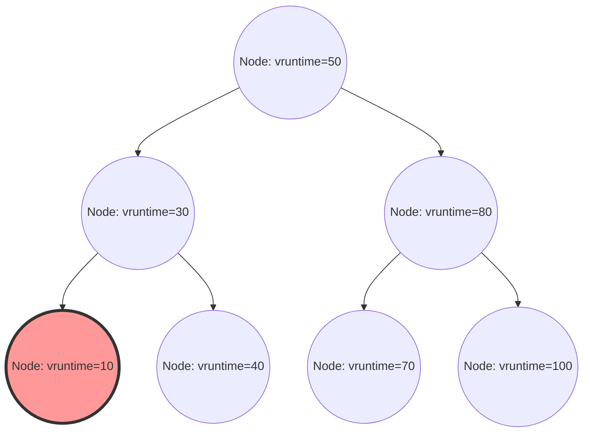

在Linux内核中，决定系统整体性能、吞吐量以及响应性的最重要组件之一就是进程调度器。在现代Linux（从内核2.6.23到6.5）中作为默认调度器长期称霸的“完全公平调度器（Completely Fair Scheduler, CFS）”，可以说是一项完全摆脱了传统的基于启发式的调度，转而追求基于严格数学模型实现“绝对公平”的杰作。

本文将从Linux内核内部结构和调度理论的角度，以源代码级别的解析度，极其详细地解说CFS的架构、虚拟运行时间（vruntime）的数学计算、通过红黑树（Red-Black Tree）实现的运行队列管理、多核环境下的负载均衡算法，以及在最新的内核6.6及之后版本中引入的向EEVDF（Earliest Eligible Virtual Deadline First）的演进。对于内核黑客、系统程序员，以及挑战底层性能调优的工程师来说，深入理解CFS的内部结构是必经之路。

## 第1章：Linux调度器的演进史与CFS诞生的背景

为了深刻理解CFS的设计理念及其精妙之处，我们有必要回顾一下在Linux内核的历史中，调度器面临过怎样的挑战，又是如何演进的。调度算法的演进史，其实也是一部与吞吐量（单位时间的处理量）和延迟（响应时间）这两个相互矛盾的需求所带来的权衡进行激烈抗争的历史。

### 2.4内核时代以前：O(N)调度器的局限性与基于Epoch的困境

Linux 2.4时代的调度器虽然简单，但对于当时标准的负载已经足够应付。该调度器采用了基于Epoch（纪元）的算法，为每个进程分配时间片，当所有进程都耗尽时间片后，便开始一个新的Epoch。

然而，随着多处理器系统的普及，这款调度器开始暴露出致命的架构缺陷。那就是它的时间复杂度为 $O(N)$（N为可执行进程的数量）。整个系统只有一个全局的运行队列（Runqueue），每次调度时都要扫描队列中的“所有进程”，从而决定下一个应该执行的最优进程（动态优先级最高的一个）。
更为严重的是排他控制问题。由于整个运行队列由一个单一的全局自旋锁（`runqueue_lock`）保护，随着CPU核心数的增加，锁的竞争变得异常激烈。当某个CPU正在寻找下一个要执行的进程时，其他所有CPU都会被阻塞，宝贵的CPU周期被浪费在等待自旋锁（忙等待）上，这就造成了可扩展性方面的严重瓶颈（缓存行伪共享/Bouncing）。

### 2.6内核：Ingo Molnar与O(1)调度器的革新

为了从根本上解决这个可扩展性和时间复杂度的问题，在Linux 2.6内核的开发过程中，著名的内核黑客Ingo Molnar引入了“O(1)调度器”。顾名思义，这款调度器配备了划时代的算法，其性能完全不依赖于系统内的进程数量，能够始终在常数时间 $O(1)$ 内选出下一个进程。

O(1)调度器为每个CPU（处理器）配备了完全独立的运行队列（Per-CPU Runqueue），通过废除全局锁，戏剧性地改善了多处理器环境下的可扩展性问题。每个运行队列维护着两个按优先级排序的数组：“Active（活跃）数组”和“Expired（过期）数组”。数组由140个优先级级别（0到139，其中0到99对应实时优先级，100到139对应普通的nice值）的链表（`list_head`）组成。

进程的选择极其迅速。系统准备了针对每个优先级的位图，如果有处于可执行状态的进程，就将该优先级对应的位设为1。CPU利用硬件提供的“寻找最高有效位指令”（如x86的`bsfl`或`lzcnt`等），即可在常数时钟周期内定位到最高优先级，并在 $O(1)$ 的时间内获取该优先级链表头部的进程。当进程耗尽时间片后就会被移到“Expired数组”，而当“Active数组”变空时，只需交换两者的指针，就能立刻开始新的Epoch。

然而，尽管O(1)调度器在性能上完美无缺，它却陷入了另一个巨大的困境：“交互性的判定”。为了提升桌面环境下的用户体验（鼠标跟随性、窗口绘制响应性等），调度器需要根据过去睡眠时间和执行时间的比例，通过启发式（经验法则）推测进程是I/O密集型（交互式）还是CPU密集型。被判定为交互式的进程会获得动态优先级提升（奖励），即使时间片耗尽也会受到特殊处理，不被移入Expired数组，而是继续留在Active数组中。
这种启发式逻辑随着内核的每次升级变得越来越晦涩复杂，在边缘情况下（Edge Case）甚至会导致多媒体应用出现严重的爆音，或者导致CPU密集型进程陷入完全饥饿（Starvation）等难以理解的异常行为。

### Con Kolivas的RSDL与向绝对公平范式转移

麻醉科医生兼内核黑客Con Kolivas对O(1)调度器极其复杂的启发式算法和陷入泥潭的调优提出了异议。他主张：“要改善桌面的响应性，根本不需要复杂的推测逻辑，纯粹进行公平分配就能实现”，并在邮件列表（ML）中提出了Staircase调度器和RSDL (Rotating Staircase Deadline) 调度器等补丁。

虽然Kolivas的RSDL调度器没有被合并到主线中，但他的思想给了Ingo Molnar决定性的启发。Ingo Molnar彻底放弃了O(1)调度器中复杂的动态优先级计算和启发式代码，在短短几周内编写出了一个基于“完全公平地在进程间分配CPU时间”这一单一优美原则的全新调度器。这就是“完全公平调度器 (CFS)”。
CFS在Linux 2.6.23中被合并至主线，并在其后的超过15年里作为Linux的核心持续运转。这是操作系统历史上极其重要的一次范式转移：从复杂的经验法则回归到了数学模型。

## 第2章：完全公平排队（Fair Queuing）的数学基础与GPS模型

CFS的“Completely Fair（完全公平）”概念不仅仅是一句口号，它深深植根于操作系统理论和网络理论中的“理想资源分配模型”。

### GPS（广义处理器共享）模型的理想乡

调度理论中的终极理想形态被称为GPS（Generalized Processor Sharing）或流体（Fluid）模型。
理想的GPS处理器是一种无视物理限制的虚拟硬件。当系统中存在 $N$ 个可执行进程时，GPS处理器会同时、并行且精确地向每个进程提供 $1/N$ 的CPU算力。也就是说，它不是将CPU这个资源进行“时间分割（时间片）”并交替执行，而是进行“空间（或性能）分割”，让进程在无限小且零延迟的状态下持续推进。

当进程存在优先级差异（权重：Weight）时，GPS模型将扩展为带权公平排队（Weighted Fair Queuing, WFQ）。当系统内的每个进程 $i$ 拥有权重 $w_i$ 时，进程 $i$ 总是会“持续地”接收到与其权重在总权重中占比成正比的计算能力。用数学公式表示，进程 $i$ 接收到的CPU带宽 $C_i$ 如下：

$$
C_i = \text{CPU Total Capacity} \times \frac{w_i}{\sum_{j=1}^{N} w_j}
$$

在这个模型中，上下文切换的开销为零，进程始终在消费自己应得的CPU带宽并持续推进。

### 离散时间中对GPS的近似与CFS的基本定理

然而，现实中的物理CPU核心在某一瞬间只能执行单一指令流（线程）（不考虑SMT/超线程的情况）。从物理规律上来说，无法将GPS模型原封不动地在物理硬件上实现。
因此，需要将时间划分为微小的切片，并在进程间进行高速切换（时分多路复用），从而在宏观上近似（模拟）GPS模型。这就是将网络路由器中的数据包调度（WFQ）概念应用到CPU调度上所形成的CFS基本原理。

CFS的算法会不断计算和追踪系统中运行的进程，如果它们是在理想的GPS处理器上运行的话，本应该获得的“理想CPU时间”。然后，在现实CPU上，它会选择与这个“理想CPU时间”偏差（即“落后”）最大的进程作为下一个执行对象。
追踪这个“在理想GPS处理器上的推进程度”的虚拟时钟，正是第3章将详细解说的“虚拟运行时间（vruntime）”。

## 第3章：虚拟运行时间（vruntime）的数学与计算机制

CFS算法的核心、支配一切的变量，是所有进程（更准确地说是调度的基本单位 `sched_entity`）都保有的一个无符号64位整数变量，名为 `vruntime` (Virtual Runtime)。
CFS的调度规则令人惊讶地简单，完全没有O(1)调度器那样复杂的数组操作：
**“始终选择运行队列中 vruntime 最小的任务并执行”**

### 从nice值到权重（Weight）的转换公式

在Linux中，通过用户空间调整进程优先级时，使用的是从 `-20` (最高优先级) 到 `19` (最低优先级) 的nice值。默认值为 `0`。
CFS在计算中并不直接使用这个nice值。相反，它会将其转换为表示相对CPU分配比例的“权重（Weight）”。

这里的设计要求是：“nice值每降低1（优先级升高），获得的CPU时间应比其他进程多约10%；nice值每升高1，获得的CPU时间应少约10%”。为了在数学上实现这一点，权重的定义相对于nice值呈等比级数变化。具体而言，相邻nice值之间的权重比率（乘数）约为 $1.25$。
因为 $1.25^3 \approx 1.953 \approx 2.0$，这推导出了一个优美的关系：nice值相差3，分配给进程的CPU时间将翻倍或减半。

在内核的 `kernel/sched/core.c` 中，基于这一理论静态定义了查找表 `sched_prio_to_weight`。

```c
const int sched_prio_to_weight[40] = {
 /* -20 */     88761,     71755,     56483,     46273,     36291,
 /* -15 */     29154,     23254,     18705,     14949,     11916,
 /* -10 */      9548,      7620,      6100,      4904,      3906,
 /*  -5 */      3121,      2501,      1991,      1586,      1277,
 /*   0 */      1024,       820,       655,       526,       423,
 /*   5 */       335,       272,       215,       172,       137,
 /*  10 */       110,        87,        70,        56,        45,
 /*  15 */        36,        29,        23,        18,        15,
};
```
nice值为 `0` 的任务，其权重被定义为 `1024`，在内核内部，这被当作名为 `NICE_0_LOAD` 的宏常量来处理。所有的计算都是以这个 `1024` 为基准进行的。

### vruntime 增长的数学模型与计算公式

当某个进程在实际的物理CPU上执行了一段实际时间 $\Delta exec$ （单位为纳秒）时，该进程的 `vruntime` 会根据以下公式增长：

$$
vruntime \mathrel{+}= \Delta exec \times \frac{NICE\_0\_LOAD}{weight}
$$

让我们将具体的nice值代入这个公式来思考它的含义：

1. **nice值为 `0` (权重 `1024`) 的情况**： 
   $\frac{1024}{1024} = 1$。因此，$vruntime$ 会以与实际时间 $\Delta exec$ 完全相同的速度增长。如果实际执行了10ms，vruntime也会前进10ms（10,000,000ns）。
2. **nice值为 `-5` (权重 `3121`，高优先级) 的情况**：
   $\frac{1024}{3121} \approx 0.328$。也就是说，$vruntime$ 的增长速度只有实际时间的约三分之一。vruntime增长慢，意味着它可以更长时间地保持“vruntime最小”的状态，从而能够占用CPU更长的时间。
3. **nice值为 `5` (权重 `335`，低优先级) 的情况**：
   $\frac{1024}{335} \approx 3.05$。$vruntime$ 会以实际时间约3倍的狂暴速度增长。只要稍微执行一点，vruntime就会急剧变大，瞬间被其他任务超越，从而让出“vruntime最小”的位置并交出CPU。

就这样，CFS通过将物理执行时间根据每个进程的“权重”进行标准化，降维到单一的绝对指标 `vruntime` 上，同时实现了优先级控制与公平性。

### 内核实现中除法的规避与定点数运算

虽然数学模型如上所述，但在OS内核深处、每毫秒被调用数万次的调度路径中，每次都执行 $\frac{1}{weight}$ 的除法（除法指令）会带来极其严重的性能惩罚（尤其是在老旧架构上，这可能需要几十到几百个时钟周期的延迟）。

因此，Linux内核为了彻底消除除法，进行了巧妙的优化。它预先计算了 $\frac{2^{32}}{weight}$ （倒数乘以 $2^{32}$）并存放在另一个查找表 `sched_prio_to_wmult` 中，通过乘法和32位右移操作完全替代了除法（这是定点数运算的基本技巧）。

```c
/* kernel/sched/fair.c : calc_delta_fair() 的逻辑结构 */
static inline u64 calc_delta_fair(u64 delta, struct sched_entity *se)
{
    if (unlikely(se->load.weight != NICE_0_LOAD)) {
        /*
         * 避免除法，仅使用乘法和移位指令
         * 计算 delta = delta * (NICE_0_LOAD / weight)
         */
        delta = __calc_delta(delta, NICE_0_LOAD, &se->load);
    }
    return delta;
}
```
每次发生定时器中断（Tick）或者上下文切换时，就会调用 `kernel/sched/fair.c` 中的 `update_curr()` 函数，精细地测量当前正在执行的任务的实际执行时间，并通过上述函数严格更新 `vruntime`。

## 第4章：基于红黑树（Red-Black Tree）的运行队列管理与调度实体

与O(1)调度器使用基于优先级的数组结构不同，CFS采用了一种名为“红黑树（Red-Black Tree, RB-tree）”的精炼数据结构（属于平衡二叉搜索树的一种）。

### cfs_rq 结构体与 sched_entity 的抽象化

每个CPU在内存中都持有一个专属的CFS运行队列结构体 `struct cfs_rq`。有趣的是，直接存放在运行队列中并被调度的对象，并不是代表进程本身的 `task_struct`。CFS将调度的对象进行了更高一层的抽象，作为名为 `struct sched_entity`（调度实体）的结构体来处理。

这种抽象极其重要。因为借助这一机制，无论被调度的对象是单个进程，还是通过cgroups（控制组）分组的进程集合，CFS都可以透明地将它们作为完全相同的 `sched_entity` 来对待。以此，层次化的组调度（Group Scheduling）得以优雅地实现。

### 对红黑树的操作与算法的时间复杂度

CFS将存在于运行队列中的所有可执行实体，以 `vruntime` 为键（排序基准）存储在红黑树中。根据二叉搜索树的性质，左侧子节点的值小于父节点，右侧子节点的值大于父节点。

- **查找（Fetch）最佳进程**：
  CFS的规则是“始终选择 vruntime 最小的那个进行下一次执行”。在红黑树中，最小的节点位于从根节点一直向左遍历的末端，即“树中最左下角的节点（`rb_leftmost`）”。
  CFS在每次向树中插入或删除节点时，总是会缓存并保留指向这个 `rb_leftmost` 节点的指针（`cfs_rq->rb_leftmost`）。因此，调度器选择下一个要执行的进程的过程（`pick_next_task_fair()`）无需遍历树，只需读取缓存的指针即可，其时间复杂度为 $O(1)$。

- **节点的插入与删除**：
  当进程从睡眠状态唤醒（Wake-up）变为可执行状态时，或者执行完毕交出CPU退回队列时，在红黑树中插入（`enqueue_entity()`）和删除（`dequeue_entity()`）的时间复杂度，如果队列中的元素数为 N，则为 $O(\log N)$。
  与O(1)调度器相比，虽然时间复杂度的阶数变差了，但由于红黑树始终保持自我平衡，树的高度被限制在 $\log N$，即使系统中存在数万个进程，树的高度也只有十几层。考虑到缓存局部性，实际在CPU周期上的开销极其微小，实践证明，这比执行O(1)中复杂的启发式逻辑成本要低廉得多。


*图：以vruntime为键的红黑树逻辑结构。位于最左侧的节点（vruntime=10）始终被缓存为下一个要执行的进程。*

### 借助 min_vruntime 的防溢出对策与唤醒时补偿

`vruntime` 是一个64位无符号整数（`u64`），以纳秒为单位持续不断地增加。在长期连续运行的企业级服务器等设备中，在数学上始终存在发生溢出（值超过极限后绕回至0，即回绕现象）的可能性。

此外，在实际应用中更常见的问题是关于刚创建的新进程，或是因为等待I/O等原因长时间睡眠后数小时才唤醒的进程的处理。如果这些进程的 `vruntime` 是0或者保持在一个旧值，那么与当前系统中其他进程的 `vruntime`（比如数万亿纳秒）相比，它的值就显得微乎其微。结果就是，CFS会误认为“这个进程完全没有用到CPU，处于极其悲惨的状态”，从而让该进程完全独占CPU（导致其他所有进程陷入饥饿状态），直到它的 `vruntime` 追上其他进程为止。

为了完全防止这种情况，`cfs_rq` 结构体维护着一个至关重要的追踪变量，名为 `min_vruntime`。
`min_vruntime` 追踪的是该运行队列中当前存在的所有进程中最小的 `vruntime` 值，但它被施加了一条严格的规则：**“仅允许单调递增”**。也就是说，它绝不会倒退回过去。

- **新进程（fork时）的初始化**：
  当新进程被创建时，其初始的 `vruntime` 不是从0开始，而是会基于父进程的 `vruntime` 或当前运行队列的 `min_vruntime`，通过偏移调整（初始化）为一个合理的值。
- **唤醒进程（Wake-up）的补偿**：
  长时间睡眠的进程被唤醒并回到运行队列时，在 `enqueue_entity()` 函数内部会进行严格的补偿计算。系统会比较进程的旧 `vruntime` 和运行队列的 `min_vruntime` 减去特定惩罚值（由 `sysctl_sched_latency` 等参数计算得出）后的值，取其中较大者。
  也就是说，`se->vruntime = max_vruntime(se->vruntime, cfs_rq->min_vruntime - 补偿值)`，进程的时间会被强制“拉高”以匹配系统的整体时钟。这既防止了从长期睡眠恢复后不合理地独占CPU，又在从短期睡眠（比如等待键盘输入）恢复时赋予适度的延迟奖励，从而保障了响应性。

此外，在内核内部用于红黑树比较的函数（`entity_before()`）中，比较两个 `u64` 值的大小时并非直接比较，而是先将它们转换为有符号的64位整数（`s64`）后相减，通过结果的正负来判断大小。这是一种利用2的补码表示中的模算术的黑客技巧（Hack）。只要两个值之间的差额小于 $2^{63}$，即使其中一个值已经溢出绕回为0，依然可以准确判定时间上的先后顺序，从而彻底消除了回绕问题的危害。

## 第5章：多核与NUMA架构下的负载均衡（Load Balancing）机制

在现代硬件架构中，单核处理器已不复存在，拥有数十乃至数百个核心的多核处理器，甚至内存访问延迟取决于物理距离的NUMA（Non-Uniform Memory Access，非统一内存访问）架构已经非常普遍。
无论CFS单独的红黑树算法在一个CPU上实现了多么完美的公平性，如果某个CPU的队列里堆积了100个进程不堪重负，而旁边的CPU却完全空闲，那么系统整体的吞吐量将会极为糟糕。因此，在多核环境下，任务的迁移（Migration）和负载均衡（Load Balancing）是一个至关重要的子系统。

### sched_domain 与 sched_group 的复杂层级拓扑

为了抽象物理硬件中复杂的CPU拓扑结构并对其进行高效管理，Linux内核构建了名为 `sched_domain` 和 `sched_group` 的层级数据结构。系统在启动时会从ACPI或设备树中读取硬件信息，从而构建逻辑层级树。

比如，想象一个系统有两个物理插槽（NUMA节点），每个插槽有4个物理核心，各自启用了SMT（如超线程），总共拥有16个逻辑线程。在这种情况下，调度器会自下而上构建如下的层级（域）：

1. **SMT（Simultaneous Multithreading）域**:
   最底层。负责在共享同一个物理核心的两个逻辑线程之间进行负载均衡。因为在这里L1/L2缓存和执行单元是完全共享的，所以迁移任务的成本（惩罚）极小。
2. **MC（Multi-Core）域**:
   负责在同一个物理插槽（CPU封装）上的多个物理核心之间进行负载均衡。通常它们共享L3缓存（LLC: Last Level Cache），因此在迁移任务时发生缓存未命中带来的惩罚属于中等程度。
3. **NUMA域**:
   最顶层。负责跨不同物理插槽（NUMA节点）之间的负载均衡。如果在此跨域迁移进程，该进程访问其曾使用的内存就会变成远程内存访问，引发严重的延迟恶化。因此，这种迁移的惩罚（阻力值）被设置得极高。

负载均衡会在两个时机被触发：由定时器中断定期触发的（Periodic Load Balance）和CPU运行队列变空准备进入空闲状态前夕触发的（NewIdle Load Balance）。
算法会按照从层级底部（SMT）到顶部（NUMA）的顺序依次遍历各个域。在每个域中，计算其所属 `sched_group` 之间的平均负载，只有当负载差异超过该域设定的惩罚阈值时，才会执行从负载最高的组向负载最低的组（即自己本身）拉取（Pull）任务的操作。

### PELT (Per-Entity Load Tracking) 算法的数学原理

为了在负载均衡中准确比较“组间负载”，首先必须能够精准测量“任务负载”。在以往的Linux内核中，采用的是瞬间采样运行队列中排队的任务数（队列长度）这种粗糙的方法，但这无法准确估算频繁开关的突发型任务的负载，从而导致了不恰当的任务迁移。

为了解决这个问题，近年来被引入并使内核调度精度实现飞跃性提升的是 **PELT (Per-Entity Load Tracking)** 算法。
PELT使用指数加权移动平均（EWMA: Exponentially Weighted Moving Average）算法，以毫秒级的精度，持续不断地追踪和衰减每个实体（进程或cgroup）在过去消耗了多少CPU时间的“历史记录”。

某任务在时间 $t$ 时的负载 $L_t$，由当前周期的CPU消耗量 $C_t$ 和从过去累积的负载 $L_{t-1}$ 通过以下递推公式计算得出：

$$ L_t = C_t + y \times L_{t-1} $$

这里的 $y$ 是衰减系数（一个大于0且小于1的值）。在Linux内核中，$y$ 的值被调整为过去历史记录的影响在刚好32毫秒后减半（半衰期为32ms）（$y^{32} = 0.5$）。
这样一来，当任务开始使用CPU时，其负载值会平滑上升；睡眠时，则会平滑下降。通过PELT获得的极其精确稳定的负载指标，不仅用于CFS的负载均衡，还直接提供给用于动态改变CPU运行频率的节能调节器（cpufreq的Schedutil governor），成为了实现性能与能效最佳平衡的核心技术。

### CFS Bandwidth Control (带宽控制：配额与节流)

作为现代云基础设施和容器技术（Docker, Kubernetes）基石且不可或缺的功能，是通过cgroups实现的严格的CPU资源使用量限制（Bandwidth Control）。CFS内部包含了一套受到完全控制的带宽分配机制。

CFS的带宽控制由两个参数定义：`cpu.cfs_period_us` （周期）和 `cpu.cfs_quota_us` （配额/上限）。
例如，属于 period 被设为 `100000` (100ms)、quota 被设为 `50000` (50ms) 的 cgroup 的进程集合，在一个100ms的时间窗口内，最多只被允许总共使用50ms（即1个CPU核心的50%）的物理CPU。

当进程执行时，内核利用高精度定时器测量所消耗的执行时间，并从分配给该cgroup的配额中扣除。当进程彻底耗尽配额时，系统将采取极端的处置手段。CFS会将该cgroup下的所有实体从运行队列的红黑树中物理拔除（dequeue），并隔离到专属的等待列表中，使其进入无法执行的“节流（Throttled）”状态。
在这种状态下，无论进程多么希望执行，都无法获得任何CPU分配。当下一个周期（period）开始，硬件定时器触发，配额会被全量补充（刷新），那些被隔离的实体将重新插入（enqueue）到红黑树中恢复执行。
这种节流机制异常坚固，在多租户环境中，它充当着防止某个容器失控而耗尽其他容器CPU资源的“吵闹的邻居问题（Noisy Neighbor Problem）”的铜墙铁壁。

## 第6章：实时调度器与向最新EEVDF（Earliest Eligible Virtual Deadline First）的演进

在Linux中，存在与CFS（用于普通进程：`SCHED_NORMAL`, `SCHED_BATCH`, `SCHED_IDLE`）完全分离的、遵循POSIX标准的实时调度策略（`SCHED_FIFO`, `SCHED_RR`）。
实时进程拥有0到99的绝对优先级（RT prio），只要系统中存在哪怕一个可执行的实时进程，所有的CFS进程（处于100到139优先级空间的进程）就会被彻底剥夺CPU的执行权。实时调度器不使用红黑树，而是像O(1)调度器那样，通过按优先级划分的数组和位图，利用极其简单的 $O(1)$ 算法进行管理。这常被用于要求微秒级确定性响应的工业控制或音频处理等领域。

### CFS的结构性局限与缺乏延迟（Latency）保证

在普通进程环境中，从“长期吞吐量上的数学绝对公平性”这一角度来看，CFS的确实现了近乎完美的性能。然而，随着系统的演进，桌面环境和移动环境（如Android等）的要求变得越来越严苛，“确保特定延迟（响应时间）在几毫秒以内”这一方面的架构性局限，便开始暴露出来。

作为摒弃启发式，纯粹依据vruntime大小进行判断的代价，I/O密集型任务（比如响应用户键盘输入只执行几十微秒然后立即再次睡眠的UI绘制任务），有时会在成群的重度CPU密集型任务（如视频编码等）中短暂“被淹没”。它们在调度顺序上被延后，从而引发屏幕产生令人不快的卡顿现象（UI Jitter）。
为了缓解这个问题，内核开发者们开始对CFS纯粹的数学模型打补丁，加入了如 `sysctl kernel.sched_wakeup_granularity_ns` (唤醒时的抢占阈值) 和 `sched_min_granularity_ns` 等调优参数，甚至（讽刺地像O(1)时代那样）持续增加许多微小的启发式代码。然而，这些仅仅是对症疗法，并未能在本质上实现对延迟的数学保证。

### Linux 6.6的革命：EEVDF调度器的引入

为了终结这一长年的困境，得益于CFS的维护者Peter Zijlstra等人的巨大努力，在Linux 6.6内核中，CFS的核心算法终于被彻底替换为一种名为 **EEVDF (Earliest Eligible Virtual Deadline First)** 的全新算法。尽管为了保持兼容性，源代码中的类名（如 `fair.c` 和 `sched_class fair_sched_class`）得以保留，但其核心逻辑却发生了翻天覆地的变化。

实际上，EEVDF是Ion Stoica和Hussein Abdel-Wahab早在1995年发表的一篇历史悠久的学术论文中提出的算法。该算法具有一个惊人的特性：在数学上同时实现了对进程的“公平性（Fairness）”和“严格的延迟保证（Latency Guarantee）”。
在EEVDF算法中，为了取代CFS中单一的 `vruntime`，系统会计算并追踪用于管理进程执行的两个重要的时间指标：

1. **Eligible Time（资格时间）的判定与 Lag（延迟落后）**：
   EEVDF会计算某个进程与理想的GPS模型相比，当前承受了多少“Lag（落后）”。如果Lag为正值（即实际分配到的CPU比理想情况少，受到了不公对待），该进程就会被判定为“Eligible（具备资格）”。反之，如果消耗的CPU比理想情况多，进程则进入非资格状态。
2. **Virtual Deadline（虚拟截止时间）的计算**：
   它会计算进程请求的时间片（CPU时间）在理想的GPS处理器上消化完毕时所对应的虚拟截止时间。

EEVDF的调度规则比CFS更进了一阶，具体如下：
**“从当前处于『Eligible』（满足资格）状态的任务集合中，选择Virtual Deadline（虚拟截止时间）最早的任务并执行”**

迁移到EEVDF算法带来的好处是不可估量的。在CFS中积累了数十年、导致代码库日益臃肿的“与唤醒相关的海量启发式逻辑”不再被需要，被一扫而空（全部删除）。
此外，系统还建立了一个框架，允许进程显式指定“请求的时间片长度”（未来计划通过cgroups扩展和新的 `sched_setattr` 系统调用暴露给用户空间）。
得益于此，那些请求极短时间片的交互式UI任务，会被计算并设定一个极近（极早）的Virtual Deadline，在数学上绝对保证它们能抢占沉重的计算任务并被立即执行。在不牺牲吞吐量的前提下，实现了对几毫秒级别的微延迟的完全掌控。

## 结论

Linux的完全公平调度器（CFS）及其进化版EEVDF，拥有理想的GPS模型与源自网络的WFQ这样深邃的理论背景，并通过 `vruntime` 的数学运算以及红黑树这一优雅的自平衡数据结构，在内核空间极其严苛的性能约束下得以实现，这堪称软件工程的巅峰之作。

从多处理器黎明时期的锁竞争挑战开始，经历了O(1)调度器的启发式陷阱，CFS完成了向数学公平性的回归。紧接着，为了应对多核化和NUMA拓扑极端复杂化，内核集成了PELT算法；为了支撑云时代，通过cgroups实现了严格的带宽控制。而现在，随着融入了绝对延迟保证这一终极圣杯的EEVDF的诞生，Linux的调度器依然在永不止步地进化。

深入理解作为操作系统核心的调度器的历史变迁以及以数学公式为背书的内部结构，不仅仅是为了满足知识上的渴望，它在定位系统整体性能瓶颈、预测多线程编程中的行为，乃至设计高级应用架构时，都将成为极具威力的武器。

以上，便是对Linux内核的中枢、掌握所有进程命运的调度器这一深渊世界的探索之旅。
