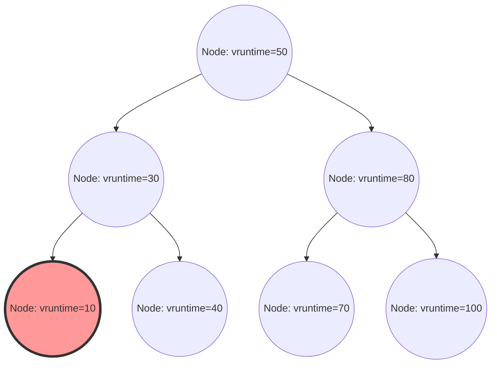

在 Linux 核心中，決定整體系統效能、吞吐量與回應速度的最重要元件之一，就是行程排程器 (Process Scheduler)。在現代 Linux (從核心 2.6.23 到 6.5) 中長期擔任預設排程器的「完全公平排程器 (Completely Fair Scheduler, CFS)」，完全擺脫了過去基於啟發式 (heuristic) 的排程方式，可以說是追求基於嚴格數學模型之「完全公平性」的傑作。

本文將從 Linux 核心內部結構與排程理論的角度，針對 CFS 的架構、虛擬執行時間 (vruntime) 的數學計算、透過紅黑樹 (Red-Black Tree) 進行的執行佇列 (runqueue) 管理、多核心環境下的負載平衡演算法，甚至是在最新核心 6.6 之後導入並演進的 EEVDF (Earliest Eligible Virtual Deadline First)，以原始碼等級的解析度進行極為詳細的解說。對於核心駭客 (kernel hacker)、系統程式設計師，以及挑戰底層效能調校的工程師而言，深入理解 CFS 的內部結構是必經之路。

## 第1章：Linux 排程器演進史與 CFS 誕生的背景

為了深入理解 CFS 的設計理念與其優美之處，我們必須回顧 Linux 核心歷史中，排程器曾經面臨過哪些挑戰，以及它是如何演進的。排程演算法的演進，同時也是一場與吞吐量 (單位時間內的處理量) 和延遲 (回應時間) 這兩個互相衝突的需求之間，進行權衡的激烈抗爭史。

### 2.4 核心時代以前：O(N) 排程器的極限與 Epoch 基礎的困境

Linux 2.4 時代的排程器雖然簡單，但已足以應付當時標準的工作負載。這個排程器採用了基於 Epoch (紀元) 的演算法，為每個行程分配時間切片 (time slice)，當所有行程都用完時間切片時，就會開始一個新的 Epoch。

然而，隨著多處理器系統開始普及，這個排程器開始暴露出致命的架構缺陷。那就是其時間複雜度為 $O(N)$ (N 為可執行行程的數量)。整個系統只有一個全域的執行佇列 (global runqueue)，每次進行排程時，都必須掃描佇列內的「所有行程」，來決定下一個應該執行的最佳行程 (動態優先權最高的行程)。
更嚴重的是互斥控制 (mutual exclusion)。由於整個執行佇列受到單一全域自旋鎖 (`runqueue_lock`) 的保護，隨著 CPU 核心數量的增加，鎖的競爭也變得非常激烈。當某個 CPU 正在尋找下一個要執行的行程時，其他所有的 CPU 都會被阻塞，寶貴的 CPU 週期被浪費在等待自旋鎖 (忙碌迴圈) 上，造成了擴展性上嚴重的瓶頸 (快取行彈跳，cache line bouncing)。

### 2.6 核心：Ingo Molnar 與 O(1) 排程器的革新

為了解決這個擴展性與運算複雜度的根本問題，在 Linux 2.6 核心的開發過程中，著名的核心駭客 Ingo Molnar 導入了「O(1) 排程器」。顧名思義，這個排程器具備了革命性的演算法，完全不依賴系統內的行程數量，能夠始終以常數時間 $O(1)$ 選擇下一個行程。

O(1) 排程器為每個 CPU (處理器) 配備了完全獨立的執行佇列 (Per-CPU Runqueue)，藉由廢除全域鎖，大幅改善了多處理器環境下的擴展性問題。每個執行佇列都保有了「Active 陣列」與「Expired 陣列」兩個帶有優先權的陣列。陣列由 140 個優先權等級 (0 到 139，其中 0 到 99 為即時優先權，100 到 139 對應一般的 nice 值) 的連結串列 (`list_head`) 所構成。

行程的選擇速度極快。它準備了各優先權的點陣圖 (bitmap)，只要該優先權存在可執行的行程，就將對應的位元設為 1。CPU 可以使用硬體提供的「尋找最高位元指令」(例如 x86 的 `bsfl` 或 `lzcnt` 等)，以常數時脈週期找出最高優先權，並以 $O(1)$ 的時間提取該優先權串列前端的行程。當行程耗盡時間切片時，就會移動到「Expired 陣列」，當「Active 陣列」變空時，只需交換兩者的指標，就能立即開始新的 Epoch。

然而，儘管 O(1) 排程器在效能方面堪稱完美，卻陷入了「互動性判定」這個巨大的困境。為了提升桌面環境的使用者體驗 (滑鼠追蹤性或視窗繪製的回應速度)，排程器會根據過去的睡眠時間與執行時間的比例，利用啟發式 (經驗法則) 來推測行程是 I/O 密集型 (互動式) 還是 CPU 密集型。被判定為互動式的行程會獲得動態的優先權提升 (紅利)，即使時間切片耗盡，也會獲得特例處理，留在 Active 陣列而不會移動到 Expired 陣列。
這種啟發式邏輯隨著核心版本的更新變得越來越複雜怪異，在邊緣情況下，會導致多媒體應用程式發生嚴重的爆音，或是 CPU 密集型行程完全陷入飢餓狀態 (starvation) 等不可思議的行為。

### Con Kolivas 的 RSDL 與完全公平性的典範轉移

對 O(1) 排程器極度複雜的啟發式邏輯與泥沼般的調校提出異議的，是身為麻醉科醫師同時也是核心駭客的 Con Kolivas。他主張「桌面的回應速度，不需要複雜的推測邏輯，純粹進行公平的分配就能改善」，並在郵件論壇 (ML) 上提出了 Staircase 排程器與 RSDL (Rotating Staircase Deadline) 排程器等修補程式。

雖然 Kolivas 的 RSDL 排程器最終沒有被整合進主線 (mainline) 核心，但其思想給了 Ingo Molnar 決定性的靈感。Ingo Molnar 完全放棄了 O(1) 排程器複雜的動態優先權計算與啟發式程式碼，僅花了幾週的時間，就寫出了一個基於「在行程間完全公平地分割 CPU 時間」這個單一優美原則的全新排程器。這就是「完全公平排程器 (CFS)」。
CFS 在 Linux 2.6.23 被合併到主線中，並在此後的 15 年多裡，持續作為 Linux 的心臟運作。這是作業系統歷史上，從複雜的經驗法則回歸數學模型的一個極其重要的典範轉移 (paradigm shift)。

## 第2章：完全公平性 (Fair Queuing) 的數學基礎與 GPS 模型

CFS 的「完全公平 (Completely Fair)」概念，並不僅僅是一個口號，而是根植於作業系統理論與網路理論中「理想的資源分配模型」。

### GPS (Generalized Processor Sharing) 模型的烏托邦

在排程理論中，終極的理想型態被稱為 GPS (Generalized Processor Sharing) 或流體 (Fluid) 模型。
理想的 GPS 處理器是一種忽略實體限制的虛擬硬體。當系統中存在 $N$ 個可執行行程時，GPS 處理器會對每個行程同時、平行且精確地持續提供 $1/N$ 的 CPU 能力。也就是說，它不是將 CPU 這個資源「在時間上分割 (時間切片)」並交替執行，而是「在空間 (或效能) 上分割」，讓行程在零延遲的狀態下無限地推進。

當行程之間存在優先權差異 (權重：Weight) 時，GPS 模型就會擴展為加權公平佇列 (Weighted Fair Queuing, WFQ)。當系統內的每個行程 $i$ 擁有權重 $w_i$ 時，行程 $i$ 總是能「持續地」接收到與其權重佔總權重比例成正比的處理能力。用數學公式表示，行程 $i$ 接收到的 CPU 頻寬 $C_i$ 如下：

$$
C_i = \text{CPU Total Capacity} \times \frac{w_i}{\sum_{j=1}^{N} w_j}
$$

在這個模型中，上下文切換 (context switch) 的額外負擔 (overhead) 為零，行程總是持續消耗其應得的 CPU 頻寬並推進。

### 離散時間下 GPS 的近似與 CFS 的基本定理

然而，現實中的實體 CPU 核心在任何瞬間都只能同時執行一個指令序列 (執行緒)(不考慮 SMT/超執行緒的情況下)。要將 GPS 模型直接實作在實體硬體上，在物理法則上是不可能的。
因此，必須將時間分割成微小的切片，並高速切換行程 (分時多工)，從巨觀的角度來近似 (模擬) GPS 模型。這就是將網路路由器中的封包排程 (WFQ) 概念應用於 CPU 排程的 CFS 基本原理。

CFS 的演算法會持續計算並追蹤系統上正在執行的行程，假設它們在理想的 GPS 處理器上執行時，本應獲得的「理想 CPU 時間」。然後，針對這個理想時間與現實 CPU 上實際消耗時間之間的「誤差 (落後)」最大的行程，進行排程讓其優先執行。
這個用來追蹤「理想 GPS 處理器上推進進度」的虛擬時鐘，正是第 3 章將詳細解說的「虛擬執行時間 (vruntime)」。

## 第3章：虛擬執行時間 (vruntime) 的數學原理與計算機制

CFS 演算法的核心，也是主宰一切的，是所有行程 (更準確地說，是排程的基本單位 `sched_entity`) 所持有的 `vruntime` (Virtual Runtime) 變數，它是一個無號 64 位元整數。
CFS 的排程規則不包含 O(1) 排程器那種複雜的陣列操作，而是令人驚訝的簡單：
**「永遠在執行佇列中選擇 vruntime 最小的任務，作為下一個執行的對象」**

### 從 nice 值到權重 (Weight) 的轉換公式

在 Linux 中，使用者空間使用從 `-20` (最高優先權) 到 `19` (最低優先權) 的 nice 值來調整行程的優先權。預設值為 `0`。
CFS 並不會直接將這個 nice 值用於計算。相反地，它會將其轉換為表示相對 CPU 分配比例的「權重 (Weight)」。

這裡的設計需求是：「nice 值每下降 1 (優先權提升)，與其他行程相比將獲得約 10% 更多的 CPU 時間；nice 值每上升 1，將獲得約 10% 更少的 CPU 時間」。為了在數學上實現這一點，權重被定義為相對於 nice 值呈幾何級數變化。具體來說，相鄰 nice 值之間的權重比例 (乘數) 被設定為大約 $1.25$。
因為 $1.25^3 \approx 1.953 \approx 2.0$，所以當 nice 值改變 3 時，分配給該行程的 CPU 時間大約會變成兩倍，或是一半，這導出了一個優美的關係。

在核心內的 `kernel/sched/core.c` 中，靜態定義了基於這個理論的查詢表 `sched_prio_to_weight`。

```c
const int sched_prio_to_weight[40] = {
 /* -20 */     88761,     71755,     56483,     46273,     36291,
 /* -15 */     29154,     23254,     18705,     14949,     11916,
 /* -10 */      9548,      7620,      6100,      4904,      3906,
 /*  -5 */      3121,      2501,      1991,      1586,      1277,
 /*   0 */      1024,       820,       655,       526,       423,
 /*   5 */       335,       272,       215,       172,       137,
 /*  10 */       110,        87,        70,        56,        45,
 /*  15 */        36,        29,        23,        18,        15,
};
```
nice 值為 `0` 的任務權重被定義為 `1024`，這在核心內部被視為 `NICE_0_LOAD` 這個巨集常數。所有的計算都是以這個 `1024` 為基準進行的。

### vruntime 增加的數學模型與計算公式

當某個行程在實際的實體 CPU 上執行了實際時間 $\Delta exec$ (奈秒為單位) 時，該行程的 `vruntime` 會依照以下數學公式增加：

$$
vruntime \mathrel{+}= \Delta exec \times \frac{NICE\_0\_LOAD}{weight}
$$

讓我們將這個公式套用在具體的 nice 值上，來探討它的意義。

1. **當 nice 值為 `0` (權重 `1024`) 時**：
   $\frac{1024}{1024} = 1$。因此，$vruntime$ 會以與實際時間 $\Delta exec$ 完全相同的速度增加。如果實際執行了 10ms，vruntime 也會前進 10ms (10,000,000ns)。
2. **當 nice 值為 `-5` (權重 `3121`，高優先權) 時**：
   $\frac{1024}{3121} \approx 0.328$。也就是說，$vruntime$ 只會以實際時間約 1/3 的速度增加。vruntime 增加得慢，代表它能比其他行程更長時間維持「vruntime 最小」的狀態，因此結果上就能夠佔用更長時間的 CPU。
3. **當 nice 值為 `5` (權重 `335`，低優先權) 時**：
   $\frac{1024}{335} \approx 3.05$。$vruntime$ 會以實際時間約 3 倍的驚人速度增加。只要執行一小段時間，vruntime 就會急劇增大，轉眼間就會被其他任務超越，交出「vruntime 最小」的寶座並讓出 CPU。

像這樣，CFS 藉由使用各個行程的「權重」對物理執行時間進行正規化 (normalization)，將其降維到單一且絕對的指標 `vruntime` 上，從而同時實現了優先權控制與公平性。

### 核心實作中避免除法與定點運算

雖然數學模型如上所述，但在作業系統核心深處，每毫秒會被呼叫數萬次的排程器路徑中，每次都執行 $\frac{1}{weight}$ 的除法 (除法指令)，在效能上會帶來極其嚴重的懲罰 (特別是在舊架構上，可能會有數十到數百個時脈週期的延遲)。

因此，Linux 核心為了完全排除除法，進行了巧妙的最佳化。它準備了另一個查詢表 `sched_prio_to_wmult`，預先計算了 $\frac{2^{32}}{weight}$ (倒數乘以 $2^{32}$ 的值)，並透過乘法與 32 位元的右移運算完全取代了除法 (這是定點運算的基本技巧)。

```c
/* kernel/sched/fair.c : calc_delta_fair() 的邏輯結構 */
static inline u64 calc_delta_fair(u64 delta, struct sched_entity *se)
{
    if (unlikely(se->load.weight != NICE_0_LOAD)) {
        /*
         * 避免除法，僅透過乘法與位移指令
         * 來計算 delta = delta * (NICE_0_LOAD / weight)
         */
        delta = __calc_delta(delta, NICE_0_LOAD, &se->load);
    }
    return delta;
}
```
每次發生計時器中斷 (Tick) 或發生上下文切換時，都會呼叫 `kernel/sched/fair.c` 中的 `update_curr()` 函式，精確測量當前執行任務的實際執行時間，並透過上述函式嚴格更新 `vruntime`。

## 第4章：透過紅黑樹 (Red-Black Tree) 進行的執行佇列管理與排程實體

相較於 O(1) 排程器使用按優先權劃分的陣列結構，CFS 採用了一種稱為「紅黑樹 (Red-Black Tree, RB-tree)」的平衡二元搜尋樹 (Balanced Binary Search Tree) 的精煉資料結構。

### cfs_rq 結構與 sched_entity 的抽象化

每個 CPU 在記憶體中都保有一個專屬的 CFS 執行佇列結構 `struct cfs_rq`。有趣的是，直接被儲存在執行佇列中並進行排程的物件，並不是代表行程本身的 `task_struct`。CFS 將被排程的對象進一步抽象化，並將其視為名為 `struct sched_entity` (排程實體) 的結構。

這種抽象化極其重要。因為如此一來，無論被排程的對象是單一行程，還是透過 cgroups (Control Groups) 組織起來的行程群組，CFS 都能將它們視為完全相同的單一 `sched_entity` 透明地處理。這使得階層式的群組排程 (Group Scheduling) 得以優雅地實現。

### 對紅黑樹的操作與演算法的時間複雜度

CFS 會將存在於執行佇列中的所有可執行實體，以 `vruntime` 作為鍵值 (排序標準) 儲存在紅黑樹中。基於二元搜尋樹的特性，左子節點的值會小於父節點，而右子節點的值會大於父節點。

- **搜尋 (提取) 最佳行程**：
  CFS 的規則是「永遠選擇 vruntime 最小的對象做為下一個執行的任務」。在紅黑樹中，最小的節點存在於從根節點一直往左走到底的末端，也就是「樹中最左下方的節點 (`rb_leftmost`)」。
  CFS 在每次對樹進行插入或刪除時，都會將指向這個 `rb_leftmost` 節點的指標快取起來 (`cfs_rq->rb_leftmost`)。因此，排程器選擇下一個應執行行程的處理程序 (`pick_next_task_fair()`)，不需要搜尋樹，只需讀取快取的指標即可，因此時間複雜度為 $O(1)$ 就能完成。

- **節點的插入與刪除**：
  當行程從睡眠狀態喚醒 (Wake-up) 並進入可執行狀態，或是結束執行交出 CPU 回到佇列時，向紅黑樹插入 (`enqueue_entity()`) 或刪除 (`dequeue_entity()`) 的時間複雜度為 $O(\log N)$ (假設佇列內元素數量為 N)。
  與 O(1) 排程器相比，時間複雜度等級雖然變差了，但由於紅黑樹總是保持自我平衡，樹的高度被限制在 $\log N$，即使系統中存在數萬個行程，樹的高度也只有十幾層。若考量到快取的局部性 (cache locality)，實務上消耗 CPU 週期的額外負擔極為微小，已被證實遠比執行 O(1) 排程器複雜的啟發式邏輯成本低得多。


*圖：以 vruntime 為鍵值的紅黑樹邏輯結構。最左邊的節點 (vruntime=10) 總是會被快取為下一個要執行的行程。*

### 透過 min_vruntime 防止溢位與喚醒時的修正

`vruntime` 是一個 64 位元無號整數 (`u64`)，並以奈秒為單位不斷增加。在長期連續運作的企業級伺服器中，在數學上始終存在著發生溢位 (overflow，數值超過極限後歸零的環繞現象) 的可能性。

此外，在實務上更常發生的問題是，如何處理剛建立的新行程，或是因為等待 I/O 等原因長時間睡眠後，時隔數小時才喚醒的行程。如果這些行程的 `vruntime` 仍然是 0 或舊的值，與目前系統中其他行程的 `vruntime` (例如數兆奈秒) 相比，將會是一個壓倒性小的數值。結果 CFS 會誤判「這個行程完全沒有使用 CPU，處於極度弱勢的狀態」，並讓它完全獨佔 CPU (導致其他所有行程陷入飢餓狀態)，直到它的 `vruntime` 追上其他行程為止。

為了完全防止這種情況發生，`cfs_rq` 結構保有了一個重要的追蹤變數 `min_vruntime`。
`min_vruntime` 是一個追蹤目前存在於該執行佇列中所有行程的 `vruntime` 的最小值的變數，但被賦予了一個嚴格的規則：**「只允許單調遞增」**。也就是說，它絕對不會往回退。

- **新行程 (fork 時) 的初始化**：
  建立新行程時，其初始 `vruntime` 不是從零開始，而是以父行程的 `vruntime` 或當前執行佇列的 `min_vruntime` 為基準，進行偏移調整 (初始化) 至一個合理的值。
- **喚醒行程 (Wake-up) 的修正**：
  當長時間睡眠的行程被喚醒並回到執行佇列時，會在 `enqueue_entity()` 函式內部進行嚴格的修正。會將行程的舊 `vruntime` 與執行佇列的 `min_vruntime` 減去特定懲罰值 (從 `sysctl_sched_latency` 等算出) 後的值進行比較，採用兩者中較大的一個。
  也就是 `se->vruntime = max_vruntime(se->vruntime, cfs_rq->min_vruntime - 修正值)`，強制將時間「拉高」以配合整個系統的時鐘。藉此，既能防止從長期睡眠恢復時不當獨佔 CPU，也能為從短暫睡眠 (例如等待鍵盤輸入) 恢復時給予適度的延遲紅利，以確保回應速度。

此外，在核心內部的紅黑樹比較函式 (`entity_before()`) 等地方，當比較兩個 `u64` 數值的大小時，並不會直接比較，而是先強制轉型為有號的 64 位元整數 (`s64`) 後進行減法，再透過結果的正負來判斷大小。這是一個利用二補數表示法 (two's complement) 的模算術 (modular arithmetic) 技巧，只要兩個數值的差小於 $2^{63}$，即使其中一個已經溢位歸零，也能準確判斷時間上的順序關係，從而完全無害化了環繞 (wraparound) 問題。

## 第5章：多核心與 NUMA 環境下的負載平衡 (Load Balancing) 機制

在現代的硬體架構中，單核心處理器已不復存在，擁有數十甚至數百個核心的多核心架構，甚至記憶體存取延遲取決於物理距離的 NUMA (Non-Uniform Memory Access) 架構，已經成為主流。
即使 CFS 單體的紅黑樹演算法在單一 CPU 上實現了多麼完美的公平性，如果某個 CPU 的佇列中積壓了 100 個行程而哀鴻遍野，而旁邊的 CPU 卻處於完全閒置的狀態，系統整體的吞吐量將會慘不忍睹。因此，多核心環境下的任務遷移 (Migration) 與負載平衡，是一個極為重要的子系統。

### sched_domain 與 sched_group 複雜的階層式拓撲

Linux 核心為了抽象化物理硬體複雜的 CPU 拓撲結構並進行有效管理，建構了 `sched_domain` 與 `sched_group` 這種階層式的資料結構。在系統開機時，會從 ACPI 或 Device Tree 讀取硬體資訊，建立邏輯上的階層樹。

例如，想像一個系統有 2 個實體插槽 (NUMA 節點)，每個插槽有 4 個實體核心，且每個核心都啟用了 SMT (Hyper-Threading 等)，總共有 16 個邏輯執行緒。在這種情況下，排程器會由下而上建立如下的階層 (Domain)：

1. **SMT (Simultaneous Multithreading) Domain**:
   最底層。負責在共享相同實體核心的兩個邏輯執行緒之間進行負載平衡。由於這裡完全共享了 L1/L2 快取與執行單元，因此轉移任務的成本 (懲罰) 是最小的。
2. **MC (Multi-Core) Domain**:
   負責在存在於同一個實體插槽 (CPU 封裝) 上的多個實體核心之間進行負載平衡。通常，因為共享 L3 快取 (LLC: Last Level Cache)，任務轉移時因快取未命中 (cache miss) 造成的懲罰為中等。
3. **NUMA Domain**:
   最頂層。負責在不同的實體插槽 (NUMA 節點) 之間進行負載平衡。如果跨越此層級轉移行程，行程正在使用的記憶體存取將變成遠端記憶體存取 (remote memory access)，會導致嚴重的延遲惡化，因此移動的懲罰 (阻力值) 被設定得非常高。

負載平衡 (Load Balancing) 會在兩個時機觸發：透過計時器中斷定期執行 (Periodic Load Balance)，以及當 CPU 執行佇列變空並即將進入閒置狀態前執行 (NewIdle Load Balance)。
演算法會依照階層由下 (SMT)往上 (NUMA) 循序遍歷各個 Domain。在每個 Domain 中，計算所屬 `sched_group` 之間的平均負載，只有當超過各 Domain 設定的懲罰閾值時，才會執行從負載最高的群組將任務拉取 (pull) 到負載最低的群組 (自己) 的操作。

### PELT (Per-Entity Load Tracking) 演算法的數學原理

在進行負載平衡時，為了能正確比較「群組之間的負載」，首先必須能夠精確測量「任務的負載」。過去的 Linux 核心採用的是瞬間取樣排隊在執行佇列中任務數量 (佇列長度) 的粗略手法，但這無法準確估算會劇烈切換 ON/OFF 的突發性 (bursty) 任務負載，導致了不適當的任務轉移。

為了解決這個問題，近年來導入並讓核心排程精確度飛躍性提升的，就是 **PELT (Per-Entity Load Tracking)** 演算法。
PELT 演算法利用指數加權移動平均 (EWMA: Exponentially Weighted Moving Average)，以毫秒級的解析度，持續追蹤並衰減各實體 (行程或 cgroup) 過去消耗了多少時間 CPU 的「歷史紀錄」。

任務在時間 $t$ 的負載 $L_t$，是使用當前期間的 CPU 消耗量 $C_t$ 以及過去累積的負載 $L_{t-1}$，透過以下遞迴公式計算出來的：

$$ L_t = C_t + y \times L_{t-1} $$

這裡的 $y$ 是衰減係數 (大於 0 且小於 1 的值)。在 Linux 核心中，設定 $y$ 的值使得過去歷史紀錄的影響精確地在 32 毫秒後減半 (半衰期為 32ms) ($y^{32} = 0.5$)。
藉由這個方法，當任務開始使用 CPU 時，負載值會平滑上升；當任務睡眠時，負載值會平滑衰減。透過 PELT 獲得的極其精確且穩定的負載指標，不僅供應給 CFS 的負載平衡，也直接供應給動態改變 CPU 運作頻率的省電調節器 (cpufreq 的 Schedutil governor)，成為實現效能與電源效率最佳平衡的核心技術。

### CFS Bandwidth Control (頻寬控制：配額與節流)

作為現代雲端基礎設施與容器技術 (Docker, Kubernetes) 基礎不可或缺的功能，就是透過 cgroups 進行嚴格的 CPU 資源使用量限制 (Bandwidth Control)。CFS 內建了完全受控的頻寬分配機制。

CFS 的頻寬控制由兩個參數定義：`cpu.cfs_period_us` (期間) 與 `cpu.cfs_quota_us` (配額/上限)。
例如，屬於設定了 period 為 `100000` (100ms)、quota 為 `50000` (50ms) 的 cgroup 內的行程群組，在 100ms 的時間範圍內，合計最多只能使用 50ms (1 個 CPU 核心的 50%) 的實體 CPU。

當行程開始執行時，核心會使用高精確度的計時器測量消耗的執行時間，並從分配給 cgroup 的配額中扣除。當行程完全耗盡配額時，就會採取激烈的處置措施。CFS 會將屬於該 cgroup 的所有實體從執行佇列的紅黑樹中實體拔除 (dequeue)，並將其隔離到專用的待命串列，標記為不可執行的「節流 (Throttled)」狀態。
一旦進入這種狀態，無論行程多麼渴望執行，都無法獲取任何 CPU 時間。當下一個期間 (period) 開始時，硬體計時器會觸發，全額補充 (refresh) 配額，被隔離的實體會再次被插入 (enqueue) 紅黑樹中並恢復執行。
這種節流機制極為強大，在多租戶 (multi-tenant) 環境中，它發揮著如同銅牆鐵壁般的防禦作用，防止特定容器失控並吞噬其他容器 CPU 資源的「吵雜鄰居問題 (Noisy Neighbor Problem)」。

## 第6章：即時排程器與演進至最新的 EEVDF (Earliest Eligible Virtual Deadline First)

Linux 中存在著符合 POSIX 標準的即時排程策略 (`SCHED_FIFO`, `SCHED_RR`)，它們與 CFS (一般行程用：`SCHED_NORMAL`, `SCHED_BATCH`, `SCHED_IDLE`) 是完全分離的。
即時行程擁有 0 到 99 的絕對優先權 (RT prio)。只要系統中存在哪怕只有一個可執行的即時行程，所有的 CFS 行程 (100 到 139 的優先權空間) 的 CPU 執行權就會被完全剝奪。即時排程器不使用紅黑樹，而是使用類似 O(1) 排程器那樣，按優先權劃分的陣列和點陣圖，以極為簡單的 $O(1)$ 演算法進行管理，被應用在要求微秒級確定性回應的工業控制或音訊處理等領域。

### CFS 的結構性極限與缺乏延遲 (Latency) 保證

回到一般行程環境，CFS 在「長期吞吐量的數學完全公平性」這個觀點上，達成了字面意義上近乎完美的效能。然而，隨著系統的演進，桌面環境或行動環境 (例如 Android) 的要求變得更加嚴苛，在「保證特定延遲 (回應時間) 於數毫秒之內」這個觀點上，CFS 架構上的極限開始暴露出來。

作為排除啟發式邏輯、純粹只以 vruntime 大小來做判斷的代價，I/O 密集型任務 (例如：為了回應使用者的鍵盤輸入，只立即執行數十微秒，接著又馬上進入睡眠的 UI 繪製任務)，在沉重的 CPU 密集型任務 (如影片編碼等) 群中，會暫時被「埋沒」，因為排程順序被延後，而導致畫面出現令人不快的卡頓 (UI Jitter)。
為了緩解這個現象，核心開發者們開始對 CFS 純粹的數學模型打修補程式，加入了 `sysctl kernel.sched_wakeup_granularity_ns` (喚醒時的搶佔閾值) 或 `sched_min_granularity_ns` 等調校參數，甚至 (諷刺地如同 O(1) 時代一樣) 持續加入了許多微小的啟發式程式碼。但這些都只是治標不治本，並未達到本質上對延遲的數學保證。

### Linux 6.6 的革命：導入 EEVDF 排程器

為了解決這個長年以來的兩難，在 CFS 維護者 Peter Zijlstra 等人的極大努力下，在 Linux 6.6 核心中，CFS 的核心演算法終於被完全替換為名為 **EEVDF (Earliest Eligible Virtual Deadline First)** 的全新演算法。雖然在原始碼中的類別名稱 (如 `fair.c` 或 `sched_class fair_sched_class`) 為了相容性而被保留，但其心臟部位的邏輯已被徹底翻新。

EEVDF 其實是 1995 年由 Ion Stoica 與 Hussein Abdel-Wahab 發表於歷史悠久之學術論文中的演算法，它具備了在數學上同時兼顧對行程的「公平性 (Fairness)」與「嚴格的延遲保證 (Latency Guarantee)」這項驚人的特性。
在 EEVDF 演算法中，取代了 CFS 單一的 `vruntime`，它會計算並追蹤兩個重要的時間指標來管理行程的執行。

1. **Eligible Time (資格時間) 的判定與 Lag (落後)**：
   EEVDF 會計算某個行程與理想的 GPS 模型相比，目前承受了多少的「Lag (落後)」。Lag 為正值 (實際分配到的 CPU 時間少於理想狀態，也就是受到不平等待遇) 的行程，會被判定為「Eligible (有資格)」。反之，消耗了比理想狀態更多 CPU 的行程，則會處於無資格狀態。
2. **Virtual Deadline (虛擬截止時間) 的計算**：
   計算行程要求的時間切片 (CPU 時間) 在理想的 GPS 處理器上應該消耗完畢的虛擬截止時間。

EEVDF 的排程規則比 CFS 更進一步，規則如下：
**「從目前處於『Eligible』(符合資格) 狀態的任務集合中，選擇 Virtual Deadline (虛擬截止時間) 最早的任務作為下一個執行的對象」**

這個演算法轉移至 EEVDF 所帶來的恩惠難以估量。在 CFS 中累積了數十年，導致程式碼庫變得臃腫的「許多關於喚醒的啟發式邏輯」變得不再需要，並被一掃而空 (刪除)。
此外，更建立了一個框架，允許每個行程明確指定「請求的時間切片長度」(預計未來會透過 cgroups 的擴充或新的 `sched_setattr` 系統呼叫，公開給使用者空間)。
藉此，對於要求極短時間切片的互動式 UI 任務，會計算並設定極近 (極早) 的 Virtual Deadline，在數學上保證了它們能確實搶佔 (preemption) 沉重的運算任務並立即執行。這使得在不犧牲吞吐量的情況下，得以完全控制數毫秒級的微小延遲。

## 結論

Linux 的完全公平排程器 (CFS)，以及其演進型態 EEVDF，擁有理想的 GPS 模型與源自網路的 WFQ 等深奧理論背景，並透過 `vruntime` 的數學原理與紅黑樹這種精煉的自我平衡資料結構，在核心空間極端的效能限制下實現，可以說是軟體工程的極致。

從多處理器黎明期的鎖競爭挑戰開始，歷經 O(1) 排程器的啟發式陷阱，CFS 實現了向數學公平性的回歸。接著，為了應對多核心化與極度複雜的 NUMA 拓撲而整合了 PELT 演算法；透過 cgroups 實現了支撐雲端時代的嚴格頻寬控制；到如今，整合了絕對保證延遲這個最終聖杯的 EEVDF，Linux 的排程器依然馬不停蹄地持續演進。

深入理解身為作業系統核心的排程器之歷史變遷與背後數學公式支撐的內部結構，不僅能滿足對知識的渴望，更能在找尋整體系統效能瓶頸、預測多執行緒程式設計中的行為，甚至在設計高階應用程式架構時，成為極其強大的武器。

以上，便是對作為 Linux 核心中樞、掌握所有行程命運之排程器深淵世界的探索。
