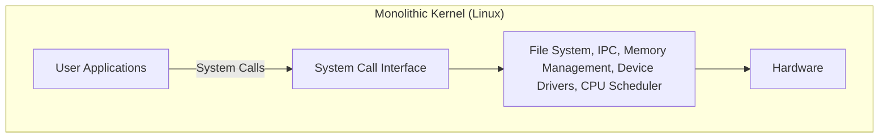
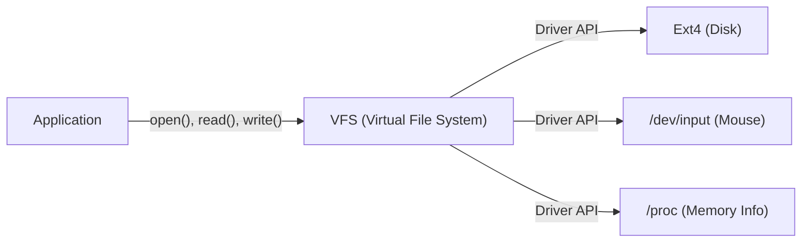

# مقدمة: بدأ كل شيء بمنشور واحد

في 25 أغسطس 1991، تم نشر رسالة متواضعة في مجموعة الأخبار `comp.os.minix`.

> "مرحبًا بكل من يستخدم minix - أنا أقوم بإنشاء نظام تشغيل (مجاني) (مجرد هواية، لن يكون كبيرًا واحترافيًا مثل gnu) للنسخ المتطابقة من 386(486) AT."

صاحب هذا المنشور كان لينوس تورفالدس (Linus Torvalds)، الذي كان آنذاك طالبًا في جامعة هلسنكي في فنلندا. في ذلك الوقت، كان نظام "MINIX" الذي طوره البروفيسور أندرو س. تانينباوم يستخدم على نطاق واسع لتعلم أنظمة التشغيل، ولكن وظائفه كانت محدودة لأغراض تعليمية، وكانت رخصته مقيدة. غير راضٍ عن تصميم MINIX، بدأ لينوس في كتابة محاكي طرفية يمكنه استغلال قدرات معالج Intel 386 الذي اشتراه بالكامل، والذي تطور في النهاية إلى نواة نظام تشغيل كامل (OS).

هذا المشروع الذي أسماه "مجرد هواية"، وبعد أكثر من 30 عامًا، نما ليصبح "لينكس" (Linux)، أحد أهم مشاريع البرمجيات في تاريخ البشرية، والذي يشغل 100% من أجهزة الكمبيوتر العملاقة في العالم، ومعظم الهواتف الذكية (Android)، والأغلبية الساحقة من البنية التحتية السحابية. في هذا المقال، سنتعمق في كيفية نشأة هذا اللينكس والخيارات المعمارية التي حددت نجاحه.

# فجر البرمجيات الحرة ومشروع GNU

لا يمكن الحديث عن تاريخ نواة لينكس دون ذكر مشروع GNU الذي قاده ريتشارد ستالمان (Richard Stallman).

بدأ مشروع GNU في عام 1983، وكان هدفه بناء نظام تشغيل كامل "GNU" (GNU's Not Unix!) يمكن لأي شخص استخدامه وتعديله وإعادة توزيعه بحرية، كبديل لأنظمة UNIX الاحتكارية. بحلول أوائل التسعينيات، أكمل مشروع GNU تقريبًا جميع المكونات اللازمة لنظام تشغيل، بما في ذلك مترجم C (GCC)، والغلاف (Bash)، والمحرر (Emacs)، والأدوات الأساسية.

ومع ذلك، كان الشيء الوحيد المفقود هو "النواة" (GNU Hurd) التي تشكل جوهر النظام. اعتمد Hurd بنية النواة الدقيقة (microkernel) المتقدمة، ولكن بسبب تعقيدها، واجهت عملية التطوير صعوبات.

في هذا التوقيت المثالي بالضبط، ظهرت نواة لينكس التي طورها لينوس. من خلال الجمع بين برمجيات GNU الغنية ونواة لينكس العملية، ولد لأول مرة نظام تشغيل حر وعملي بالكامل "GNU/Linux". هذا اللقاء المعجزة حرك تاريخ المصادر المفتوحة بشكل كبير.

# القرار المعماري: متجانسة أم دقيقة

أحد أشهر الخلافات في تاريخ تصميم نواة نظام التشغيل هو "نقاش تانينباوم-تورفالدس". في عام 1992، نشر البروفيسور تانينباوم، مؤلف MINIX، منشورًا ينتقد فيه بنية لينكس. كان عنوانه "LINUX is obsolete" (لينكس عفا عليه الزمن).

## هيكل النواة الدقيقة والنواة المتجانسة

كان التركيز في النقاش على فلسفة تصميم النواة.

**النواة المتجانسة (طريقة لينكس):**
طريقة يتم فيها تنفيذ جميع الوظائف الرئيسية لنظام التشغيل (إدارة الذاكرة، جدولة العمليات، نظام الملفات، برامج تشغيل الأجهزة، إلخ) في مساحة ذاكرة واحدة ضخمة (مساحة النواة).
- **المزايا:** عبء الاتصال بين المكونات منخفض، والأداء عالٍ جدًا.
- **العيوب:** قد يؤدي خطأ واحد (مثل خطأ في برنامج تشغيل الجهاز) إلى تعطل النواة بأكملها (Kernel Panic).

**النواة الدقيقة (طريقة MINIX و Hurd):**
طريقة يتم فيها وضع الحد الأدنى فقط من الوظائف (IPC، الجدولة الأساسية، إلخ) في مساحة النواة، ويتم تنفيذ أنظمة الملفات وبرامج التشغيل وما إلى ذلك كعمليات خادم مستقلة في مساحة المستخدم.
- **المزايا:** إذا تعطل برنامج تشغيل معين، فلا يتوقف نظام التشغيل بأكمله، مما يوفر موثوقية عالية ونمطية.
- **العيوب:** يحدث الاتصال بين العمليات (IPC) بشكل متكرر، ويميل تبديل السياق إلى إضعاف الأداء.

جادل تانينباوم بأن أنظمة التشغيل المستقبلية يجب أن تنتقل إلى نواة دقيقة موثوقة، وأن لينكس المتجانس هو "تراجع إلى نظام UNIX في السبعينيات". ومع ذلك، رد لينوس على ذلك من وجهة نظر براغماتية. مع الأجهزة في ذلك الوقت، لا يمكن تجاهل عقوبة الأداء للنواة الدقيقة، وعملت النواة المتجانسة بشكل أسرع وأكثر واقعية. ونتيجة لذلك، أثبت الأداء الساحق للينكس وقابليته للتوسع الديناميكي من خلال وحدات النواة القابلة للتحميل (LKM) التي تم تقديمها لاحقًا تفوق النواة المتجانسة.

# وراثة فلسفة UNIX: "كل شيء عبارة عن ملف"

نظرًا لأن لينكس تم تطويره كنسخة من UNIX، فإنه يرث "فلسفة UNIX" القوية. المفهوم الأكثر شهرة وأهمية هو مبدأ "كل شيء عبارة عن ملف" (Everything is a file).

في لينكس، يتم تجريد جميع الموارد كـ "ملفات" افتراضية، بدءًا من الأجهزة المادية مثل الأقراص الصلبة ولوحات المفاتيح والماوس والطابعات، وصولاً إلى معلومات العمليات ومقابس الشبكة.

على سبيل المثال، يتم التعامل مع القرص الصلب كـ `/dev/sda`، ومعلومات العمليات كملفات في دليل `/proc`، ومولد الأرقام العشوائية كـ `/dev/urandom`. وهذا يسمح للمطورين بالوصول إلى أنواع مختلفة تمامًا من الموارد باستخدام نفس الواجهة، ببساطة عن طريق استخدام وظائف القراءة والكتابة القياسية للملفات (`open()`, `read()`, `write()`, `close()`).

يتم توفير هذا التجريد القوي بواسطة **نظام الملفات الافتراضي (VFS)**. بفضل طبقة VFS، لا تحتاج التطبيقات إلى القلق بشأن أنواع الأجهزة المادية أو أنظمة الملفات الأساسية.

# الفصل الصارم بين مساحة النواة ومساحة المستخدم

مفهوم مهم آخر يدعم قوة نواة لينكس هو فصل مستويات الامتياز. باستخدام ميزات الأجهزة لوحدة المعالجة المركزية (مثل Ring 0 و Ring 3)، يتم فصل مساحة الذاكرة بصرامة إلى "مساحة النواة" (Kernel Space) و "مساحة المستخدم" (User Space).

1. **مساحة المستخدم (User Space):** منطقة آمنة تعمل فيها التطبيقات العادية (المتصفح، المحرر، قاعدة البيانات، إلخ). لا يمكنها الوصول المباشر إلى الأجهزة، وأي وصول غير مصرح به إلى الذاكرة يؤدي فقط إلى إنهاء العملية (Segfault).
2. **مساحة النواة (Kernel Space):** منطقة الامتياز التي تعمل فيها نواة نظام التشغيل. تتمتع بصلاحيات غير مقيدة للوصول إلى كل الذاكرة والأجهزة في النظام.

عندما تحاول برامج في مساحة المستخدم الكتابة إلى ملف أو التواصل عبر الشبكة، لا يمكنها تشغيل الأجهزة مباشرة. بدلاً من ذلك، يجب عليها "طلب" العمل من النواة من خلال واجهة خاصة تسمى **"نداءات النظام" (System Calls)**.

عند استدعاء نداء النظام، تقوم وحدة المعالجة المركزية بتبديل السياق وترقية مستوى الامتياز من وضع المستخدم إلى وضع النواة. بعد أن تقوم النواة بتشغيل الأجهزة بأمان، تعود مرة أخرى إلى وضع المستخدم. هذا الفصل الصارم يحمي النظام بأكمله من البرامج الضارة والتطبيقات التي تحتوي على أخطاء، ويحقق بيئة متعددة المهام مستقرة.

# الخلاصة: نجم عملاق يستمر في التطور

لينكس، الذي بدأ كـ "مجرد هواية" لـ لينوس تورفالدس، اندمج مع مُثُل GNU وتطور من خلال مساهمات الآلاف من المطورين (مجتمع الهاكرز) حول العالم.

العديد من القرارات المبكرة، مثل البنية التي فضلت الجانب العملي والأداء على التفوق النظري للنواة الدقيقة، والتجريد من خلال VFS، وآليات الحماية بواسطة مساحة النواة، لا تزال تشكل جوهره حتى اليوم. في العصر الحديث، لا يمكن تصور البنية التحتية لتكنولوجيا المعلومات بدون لينكس، من حاويات السحابة (Docker/Kubernetes) إلى أجهزة الكمبيوتر العملاقة للذكاء الاصطناعي وأجهزة إنترنت الأشياء (IoT).

تاريخ لينكس هو أجمل مثال يثبت إلى أي مدى يمكن للبشرية إنشاء برمجيات عظيمة عندما يتم الجمع بين التصميم المعماري الممتاز ونموذج التطوير مفتوح المصدر.
