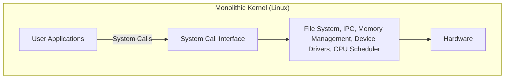
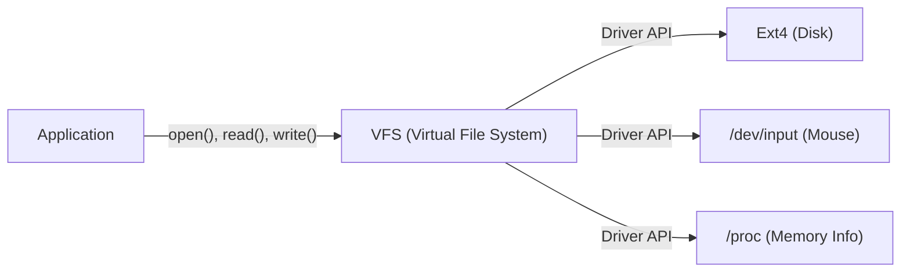

# Prolog: Alles begann mit einem einzigen Beitrag

Am 25. August 1991 wurde eine bescheidene Nachricht in der Newsgruppe `comp.os.minix` veröffentlicht.

> "Hello everybody out there using minix - I'm doing a (free) operating system (just a hobby, won't be big and professional like gnu) for 386(486) AT clones."

Der Autor dieses Beitrags war Linus Torvalds, damals Student an der Universität Helsinki in Finnland. Zu dieser Zeit hatte "MINIX", das von Professor Andrew S. Tanenbaum entwickelt und weithin zum Erlernen von Betriebssystemen verwendet wurde, aufgrund seines Bildungszwecks eingeschränkte Funktionen und Lizenzbeschränkungen. Unzufrieden mit dem Design von MINIX begann Linus mit der Entwicklung eines Terminal-Emulators, der die Fähigkeiten des von ihm gekauften Intel 386-Prozessors voll ausschöpfen konnte, was sich schließlich zum Kernel eines vollständigen Betriebssystems (OS) entwickelte.

Dieses Projekt, das er als "nur ein Hobby" (just a hobby) bezeichnete, wuchs in über 30 Jahren zu einem der wichtigsten Softwareprojekte in der Geschichte der Menschheit heran: "Linux", das 100% der Supercomputer der Welt, die Mehrheit der Smartphones (Android) und die überwältigende Mehrheit der Cloud-Infrastruktur antreibt. In diesem Artikel werden wir tief eintauchen, wie Linux geboren wurde und welche architektonischen Entscheidungen seinen Erfolg bestimmten.

# Der Beginn der freien Software und das GNU-Projekt

Wenn man über die Geschichte des Linux-Kernels spricht, darf die Existenz des GNU-Projekts unter der Leitung von Richard Stallman nicht übersehen werden.

Das 1983 gestartete GNU-Projekt hatte zum Ziel, im Gegensatz zu proprietären (geschlossenen und kostenpflichtigen) UNIX-Systemen ein komplettes Betriebssystem "GNU" (GNU's Not Unix!) zu entwickeln, das jeder frei nutzen, verändern und weiterverbreiten kann. Bis Anfang der 1990er Jahre hatte das GNU-Projekt fast alle für ein Betriebssystem notwendigen Komponenten fertiggestellt, wie den C-Compiler (GCC), die Shell (Bash), den Editor (Emacs) und grundlegende Core-Utilities.

Das einzige, was jedoch fehlte, war der "Kernel" (GNU Hurd), der Kern des Systems. Hurd verwendete eine fortschrittliche Microkernel-Architektur, aber seine Entwicklung geriet aufgrund seiner Komplexität ins Stocken.

Genau zu diesem perfekten Zeitpunkt erschien der von Linus entwickelte Linux-Kernel. Durch die Kombination der reichhaltigen Software-Suite von GNU mit dem praktisch funktionierenden Linux-Kernel wurde erstmals ein vollständig freies und praktisches Betriebssystem, das "GNU/Linux"-System, geboren. Diese wundersame Begegnung veränderte die Geschichte von Open Source maßgeblich.

# Architektonische Entscheidung: Monolithisch oder Micro?

Beim Design von OS-Kerneln ist eine der berühmtesten Kontroversen der Geschichte die "Tanenbaum-Torvalds-Debatte". Im Jahr 1992 veröffentlichte Professor Tanenbaum, der Autor von MINIX, eine Kritik an der Linux-Architektur mit dem Titel "LINUX is obsolete" (Linux ist veraltet).

## Struktur von Microkerneln und monolithischen Kerneln

Der Kern der Debatte war die Designphilosophie des Kernels.

**Monolithischer Kernel (Der Linux-Ansatz):**
Eine Methode, bei der alle Hauptfunktionen des Betriebssystems (Speicherverwaltung, Prozess-Scheduling, Dateisystem, Gerätetreiber usw.) in einem einzigen, riesigen Speicherbereich (Kernelraum) ausgeführt werden.
- **Vorteile:** Sehr hohe Leistung mit wenig Overhead für die Kommunikation zwischen den Komponenten.
- **Nachteile:** Ein einzelner Fehler (z.B. ein Gerätetreiberfehler) birgt das Risiko, den gesamten Kernel zum Absturz zu bringen (Kernel Panic).

**Microkernel (Der MINIX- und Hurd-Ansatz):**
Nur die minimalen Funktionen (IPC, grundlegendes Scheduling usw.) werden im Kernelraum platziert, während Dateisysteme, Treiber usw. als unabhängige Serverprozesse im Benutzerraum ausgeführt werden.
- **Vorteile:** Selbst wenn ein bestimmter Treiber abstürzt, stoppt nicht das gesamte Betriebssystem, was eine hohe Zuverlässigkeit und Modularität bietet.
- **Nachteile:** Interprozesskommunikation (IPC) tritt häufig auf und Leistungseinbußen aufgrund von Kontextwechseln (Context Switches) sind wahrscheinlich.

Tanenbaum argumentierte, dass zukünftige Betriebssysteme zu hochzuverlässigen Microkerneln übergehen sollten und dass das monolithische Linux "ein Rückschritt in das UNIX der 1970er Jahre" sei. Linus widersprach dem jedoch aus einer pragmatischen Perspektive. Mit der damaligen Hardware konnte die Leistungseinbuße eines Microkernels nicht ignoriert werden, und der monolithische Kernel funktionierte viel schneller und realistischer. Letztendlich bewiesen die überwältigende Leistung von Linux und die dynamische Erweiterbarkeit durch die später eingeführten ladbaren Kernelmodule (LKM) bewiesen die Überlegenheit des monolithischen Kernels.

# Erbe der UNIX-Philosophie: "Everything is a file"

Da Linux als UNIX-Klon entwickelt wurde, erbte es die mächtige "UNIX-Philosophie". Das bekannteste und wichtigste Konzept ist das Prinzip, dass "alles eine Datei ist" (Everything is a file).

In Linux werden alle Ressourcen, von Hardwaregeräten wie Festplatten, Tastaturen, Mäusen und Druckern bis hin zu Prozessinformationen und Netzwerk-Sockets, als virtuelle "Dateien" abstrahiert.

Beispielsweise wird eine Festplatte als `/dev/sda` behandelt, Prozessinformationen als Dateien unter dem Verzeichnis `/proc` und der Zufallszahlengenerator als `/dev/urandom`. Dadurch können Entwickler auf völlig unterschiedliche Arten von Ressourcen mit der gleichen Schnittstelle zugreifen, indem sie lediglich Standard-Dateilese-/schreibfunktionen (`open()`, `read()`, `write()`, `close()`) verwenden.

Diese leistungsstarke Abstraktion wird durch das **VFS (Virtual File System)** bereitgestellt. Dank der VFS-Schicht müssen sich Anwendungen überhaupt nicht um die Art des zugrunde liegenden physischen Geräts oder Dateisystems kümmern.

# Strikte Trennung von Kernelraum und Benutzerraum

Ein weiteres wichtiges Konzept, das die Robustheit des Linux-Kernels untermauert, ist die Trennung der Berechtigungsebenen. Unter Verwendung der Hardwarefunktionen der CPU (wie Ring 0 und Ring 3) wird der Speicherplatz strikt in "Kernelraum" und "Benutzerraum" unterteilt.

1. **Benutzerraum (User Space):** Ein sicherer Bereich, in dem normale Anwendungen (Browser, Editoren, Datenbanken usw.) ausgeführt werden. Sie können nicht direkt auf die Hardware zugreifen, und illegale Speicherzugriffe führen nur dazu, dass der Prozess als "Speicherzugriffsfehler" (Segfault) zwangsweise beendet wird.
2. **Kernelraum (Kernel Space):** Der privilegierte Bereich, in dem der OS-Kernel arbeitet. Er hat unbegrenzten Zugriff auf den gesamten Systemspeicher und die Hardwaregeräte.

Wenn Programme im Benutzerraum in Dateien schreiben oder über das Netzwerk kommunizieren, können sie die Hardware nicht direkt manipulieren. Stattdessen müssen sie den Kernel über eine spezielle Schnittstelle namens **"Systemaufruf" (System Call)** "bitten", die Arbeit zu erledigen.

Wenn ein Systemaufruf ausgelöst wird, führt die CPU einen Kontextwechsel durch und erhöht die Berechtigungsebene vom Benutzermodus in den Kernelmodus. Nachdem der Kernel die Hardware sicher manipuliert hat, kehrt er in den Benutzermodus zurück. Diese strikte Trennung schützt das gesamte System vor bösartigen Programmen oder fehlerhaften Anwendungen und realisiert eine stabile Multitasking-Umgebung.

# Fazit: Ein sich ständig weiterentwickelnder Riesenstern

Was als "kleines Hobby" von Linus Torvalds begann, verband sich mit den Idealen von GNU und entwickelte sich durch die Beiträge von Tausenden von Entwicklern (der Hacker-Community) auf der ganzen Welt weiter.

Viele der frühen Entscheidungen – eine Architektur, die Pragmatismus und Leistung über die theoretische Überlegenheit des Microkernels stellte, die Abstraktion durch das VFS und der Schutzmechanismus durch den Kernelraum – bilden noch heute das Fundament. In der heutigen Zeit, von Cloud-Containern (Docker/Kubernetes) über KI-Supercomputer bis hin zu IoT-Geräten, ist eine IT-Infrastruktur ohne Linux undenkbar.

Die Geschichte von Linux ist das schönste Beispiel dafür, was für großartige Software die Menschheit erschaffen kann, wenn ein exzellentes Architekturdesign mit dem Open-Source-Entwicklungsmodell kombiniert wird.
