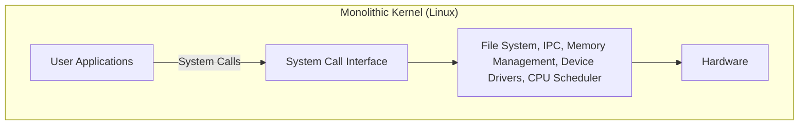
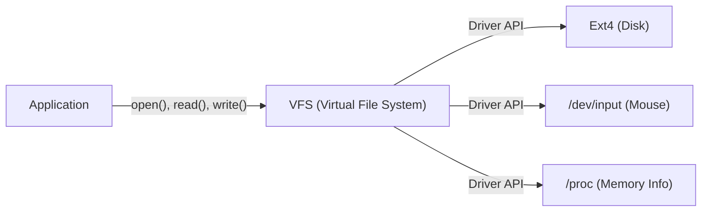

# Introduction: It All Started with a Single Post

On August 25, 1991, a modest message was posted to the newsgroup `comp.os.minix`.

> "Hello everybody out there using minix - I'm doing a (free) operating system (just a hobby, won't be big and professional like gnu) for 386(486) AT clones."

The author of this post was Linus Torvalds, then a student at the University of Helsinki in Finland. At the time, "MINIX", created by Professor Andrew S. Tanenbaum and widely used for studying operating systems, was limited in functionality due to its educational purpose and had licensing restrictions. Dissatisfied with MINIX's design, Linus began creating a terminal emulator to fully utilize the capabilities of his newly purchased Intel 386 processor, which eventually evolved into the kernel of a complete operating system (OS).

This project, which he called "just a hobby," has grown over more than 30 years into "Linux," one of the most important software projects in human history, powering 100% of the world's supercomputers, the vast majority of smartphones (Android), and the overwhelming majority of cloud infrastructure. In this article, we will delve deep into how Linux was born and what architectural choices determined its success.

# The Dawn of Free Software and the GNU Project

When discussing the history of the Linux kernel, the presence of the GNU Project led by Richard Stallman is indispensable.

Launched in 1983, the goal of the GNU Project was to build "GNU (GNU's Not Unix!)," a complete OS that anyone could freely use, modify, and redistribute, in contrast to proprietary (closed source, commercial) UNIX systems. By the early 1990s, the GNU Project had completed almost all the components necessary for an OS, including a C compiler (GCC), shell (Bash), editor (Emacs), and basic core utilities.

However, the only missing piece was the "kernel (GNU Hurd)," the core of the system. Hurd adopted an advanced microkernel architecture, but its development struggled due to its complexity.

It was exactly at this exquisite timing that the Linux kernel, developed by Linus, appeared. By combining GNU's rich suite of software with a practically working Linux kernel, a fully free and practical OS, the "GNU/Linux" system, was born for the first time. This miraculous encounter greatly moved the history of open source.

# Architectural Decisions: Monolithic or Micro?

In OS kernel design, one of the most famous debates in history is the "Tanenbaum-Torvalds debate." In 1992, Professor Tanenbaum, the creator of MINIX, made a post criticizing Linux's architecture. The title was "LINUX is obsolete."

## Microkernel and Monolithic Kernel Structures

The focus of the debate was the design philosophy of the kernel.

**Monolithic Kernel (Linux's approach):**
A method where all major OS functions (memory management, process scheduling, file system, device drivers, etc.) are executed in a single huge memory space (kernel space).
- **Advantages:** Low communication overhead between components, resulting in very high performance.
- **Disadvantages:** A single bug (e.g., a device driver error) risks causing the entire kernel to crash (kernel panic).

**Microkernel (MINIX and Hurd's approach):**
A method where only minimal functions (IPC, basic scheduling, etc.) are placed in the kernel space, while the file system, drivers, and other components run as independent server processes in the user space.
- **Advantages:** Even if a specific driver crashes, the entire OS does not stop, offering high system reliability and modularity.
- **Disadvantages:** Inter-process communication (IPC) occurs frequently, easily leading to performance degradation due to context switching.

Tanenbaum argued that future OSes should transition to highly reliable microkernels, and that the monolithic Linux was a "step back to 1970s UNIX." However, Linus countered this from a pragmatic standpoint. On the hardware of the time, the performance penalty of microkernels could not be ignored, and the monolithic kernel worked much faster and more realistically. As a result, Linux's overwhelming performance, and the dynamic extensibility introduced later by Loadable Kernel Modules (LKM), proved the superiority of the monolithic kernel.

# Inheriting the UNIX Philosophy: "Everything is a file"

Because Linux was developed as a UNIX clone, it inherits the powerful "UNIX philosophy." The most famous and important concept among them is the principle that "Everything is a file."

In Linux, all resources, from hardware devices like hard drives, keyboards, mice, and printers, to process information and network sockets, are abstracted as virtual "files."

For example, a hard disk is treated as `/dev/sda`, process information as a set of files under the `/proc` directory, and the random number generator as `/dev/urandom`. This allows developers to access completely different types of resources with the same interface simply by using standard file read/write functions (`open()`, `read()`, `write()`, `close()`).

Providing this powerful abstraction is the **VFS (Virtual File System)**. The existence of the VFS layer means that applications do not need to be aware of the types of physical devices or file systems behind it.

# Strict Separation of Kernel Space and User Space

Another important concept that supports the robustness of the Linux kernel is the separation of privilege levels. Using CPU hardware features (such as Ring 0 and Ring 3), memory space is strictly separated into "kernel space" and "user space."

1. **User Space:** A secure area where normal applications (browsers, editors, databases, etc.) run. They cannot directly access hardware, and unauthorized access to memory will forcefully terminate only the process as a "Segmentation Fault (Segfault)."
2. **Kernel Space:** A privileged area where the OS kernel operates. It has unrestricted access rights to all memory and hardware devices of the system.

When a program in user space wants to write to a file or perform network communication, it cannot manipulate the hardware directly. Instead, it must "request" the kernel to perform the task through a special interface called a **"System Call."**

When a system call is invoked, the CPU performs a context switch, elevating the privilege level from user mode to kernel mode. After the kernel safely manipulates the hardware, it returns to user mode. This strict separation protects the entire system from malicious programs or buggy applications, realizing a stable multitasking environment.

# Conclusion: A Continuously Evolving Giant

Starting as Linus Torvalds's "little hobby," Linux combined with GNU's philosophy and evolved through the contributions of thousands of developers (the hacker community) around the world.

Many of its early decisions—an architecture that valued practicality and performance over the theoretical superiority of microkernels, abstraction by VFS, and protection mechanisms by kernel space—still support its foundation today. In modern times, from cloud containers (Docker/Kubernetes) to AI supercomputers and IoT devices, IT infrastructure without Linux is inconceivable.

The history of Linux is perhaps the most beautiful example proving how great software humanity can create when an excellent architectural design is combined with the open-source development model.
