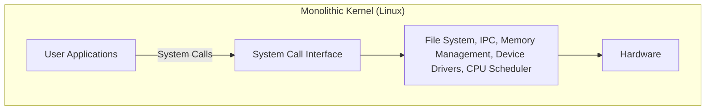
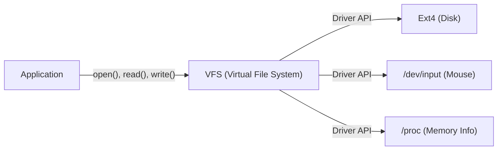

# Introducción: Todo comenzó con una sola publicación

El 25 de agosto de 1991, se publicó un modesto mensaje en el grupo de noticias `comp.os.minix`.

> "Hello everybody out there using minix - I'm doing a (free) operating system (just a hobby, won't be big and professional like gnu) for 386(486) AT clones."

El autor de esta publicación era Linus Torvalds, entonces estudiante de la Universidad de Helsinki en Finlandia. En ese momento, "MINIX", creado por el profesor Andrew S. Tanenbaum y ampliamente utilizado para estudiar sistemas operativos, tenía una funcionalidad limitada debido a su propósito educativo y restricciones de licencia. Insatisfecho con el diseño de MINIX, Linus comenzó a crear un emulador de terminal para aprovechar al máximo las capacidades de su procesador Intel 386 recién adquirido, que eventualmente evolucionó hasta convertirse en el kernel de un sistema operativo (SO) completo.

Este proyecto, que llamó "solo un pasatiempo", ha crecido durante más de 30 años hasta convertirse en "Linux", uno de los proyectos de software más importantes en la historia de la humanidad, impulsando el 100% de las supercomputadoras del mundo, la gran mayoría de los teléfonos inteligentes (Android) y la abrumadora mayoría de la infraestructura de la nube. En este artículo, profundizaremos en cómo nació Linux y qué decisiones arquitectónicas determinaron su éxito.

# El amanecer del software libre y el Proyecto GNU

Al hablar de la historia del kernel de Linux, es indispensable la presencia del Proyecto GNU liderado por Richard Stallman.

Lanzado en 1983, el objetivo del Proyecto GNU era construir "GNU (GNU's Not Unix!)", un SO completo que cualquiera pudiera usar, modificar y redistribuir libremente, en contraste con los sistemas UNIX propietarios (de código cerrado, comerciales). A principios de la década de 1990, el Proyecto GNU había completado casi todos los componentes necesarios para un SO, incluido un compilador de C (GCC), un shell (Bash), un editor (Emacs) y utilidades básicas del núcleo.

Sin embargo, la única pieza que faltaba era el "kernel (GNU Hurd)", el núcleo del sistema. Hurd adoptó una arquitectura avanzada de microkernel, pero su desarrollo tuvo dificultades debido a su complejidad.

Fue exactamente en este momento exquisito que apareció el kernel de Linux, desarrollado por Linus. Al combinar el rico conjunto de software de GNU con un kernel de Linux que funcionaba de forma práctica, nació por primera vez un SO completamente libre y práctico, el sistema "GNU/Linux". Este encuentro milagroso movió enormemente la historia del código abierto.

# Decisiones arquitectónicas: ¿Monolítico o Micro?

En el diseño del kernel del SO, uno de los debates más famosos de la historia es el "debate Tanenbaum-Torvalds". En 1992, el profesor Tanenbaum, creador de MINIX, hizo una publicación criticando la arquitectura de Linux. El título era "LINUX is obsolete" (LINUX es obsoleto).

## Estructuras del Microkernel y el Kernel Monolítico

El foco del debate fue la filosofía de diseño del kernel.

**Kernel Monolítico (enfoque de Linux):**
Un método donde todas las funciones principales del SO (gestión de memoria, programación de procesos, sistema de archivos, controladores de dispositivos, etc.) se ejecutan en un único y enorme espacio de memoria (espacio del kernel).
- **Ventajas:** Baja sobrecarga de comunicación entre componentes, lo que resulta en un rendimiento muy alto.
- **Desventajas:** Un solo error (por ejemplo, un error en el controlador de dispositivo) corre el riesgo de provocar la caída de todo el kernel (kernel panic).

**Microkernel (enfoque de MINIX y Hurd):**
Un método donde solo las funciones mínimas (IPC, programación básica, etc.) se ubican en el espacio del kernel, mientras que el sistema de archivos, los controladores y otros componentes se ejecutan como procesos de servidor independientes en el espacio del usuario.
- **Ventajas:** Incluso si un controlador específico falla, todo el SO no se detiene, ofreciendo una alta confiabilidad y modularidad del sistema.
- **Desventajas:** La comunicación entre procesos (IPC) ocurre con frecuencia, lo que fácilmente lleva a una degradación del rendimiento debido al cambio de contexto.

Tanenbaum argumentó que los futuros SO deberían hacer la transición a microkernels altamente confiables, y que el Linux monolítico era un "paso atrás hacia el UNIX de los años 70". Sin embargo, Linus refutó esto desde un punto de vista pragmático. En el hardware de la época, la penalización de rendimiento de los microkernels no se podía ignorar, y el kernel monolítico funcionaba de manera mucho más rápida y realista. Como resultado, el rendimiento abrumador de Linux, y la extensibilidad dinámica introducida más tarde por los Módulos de Kernel Cargables (LKM), demostraron la superioridad del kernel monolítico.

# Heredando la Filosofía UNIX: "Everything is a file"

Debido a que Linux se desarrolló como un clon de UNIX, hereda la poderosa "filosofía UNIX". El concepto más famoso e importante entre ellos es el principio de que "Todo es un archivo" (Everything is a file).

En Linux, todos los recursos, desde dispositivos de hardware como discos duros, teclados, ratones e impresoras, hasta información de procesos y sockets de red, se abstraen como "archivos" virtuales.

Por ejemplo, un disco duro se trata como `/dev/sda`, la información de los procesos como un conjunto de archivos bajo el directorio `/proc`, y el generador de números aleatorios como `/dev/urandom`. Esto permite a los desarrolladores acceder a tipos de recursos completamente diferentes con la misma interfaz simplemente utilizando funciones estándar de lectura/escritura de archivos (`open()`, `read()`, `write()`, `close()`).

Proporcionando esta poderosa abstracción está el **VFS (Virtual File System)**. La existencia de la capa VFS significa que las aplicaciones no necesitan ser conscientes de los tipos de dispositivos físicos o sistemas de archivos detrás de ella.

# Estricta separación del Espacio del Kernel y el Espacio del Usuario

Otro concepto importante que apoya la robustez del kernel de Linux es la separación de los niveles de privilegio. Utilizando las características de hardware de la CPU (como Ring 0 y Ring 3), el espacio de memoria se separa estrictamente en "espacio del kernel" (kernel space) y "espacio del usuario" (user space).

1. **Espacio del Usuario:** Un área segura donde se ejecutan las aplicaciones normales (navegadores, editores, bases de datos, etc.). No pueden acceder directamente al hardware, y el acceso no autorizado a la memoria terminará por la fuerza solo al proceso como un "Fallo de Segmentación" (Segfault).
2. **Espacio del Kernel:** Un área privilegiada donde opera el kernel del SO. Tiene derechos de acceso sin restricciones a toda la memoria y a los dispositivos de hardware del sistema.

Cuando un programa en el espacio del usuario quiere escribir en un archivo o realizar comunicación de red, no puede manipular el hardware directamente. En su lugar, debe "solicitar" al kernel que realice la tarea a través de una interfaz especial llamada **"Llamada al Sistema"** (System Call).

Cuando se invoca una llamada al sistema, la CPU realiza un cambio de contexto, elevando el nivel de privilegio del modo usuario al modo kernel. Después de que el kernel manipula el hardware de manera segura, regresa al modo usuario. Esta estricta separación protege todo el sistema de programas maliciosos o aplicaciones con errores, logrando un entorno multitarea estable.

# Conclusión: Un gigante en continua evolución

Comenzando como el "pequeño pasatiempo" de Linus Torvalds, Linux se combinó con la filosofía de GNU y evolucionó a través de las contribuciones de miles de desarrolladores (la comunidad hacker) de todo el mundo.

Muchas de sus primeras decisiones —una arquitectura que valoró la practicidad y el rendimiento sobre la superioridad teórica de los microkernels, la abstracción mediante VFS y los mecanismos de protección del espacio del kernel— todavía respaldan su base en la actualidad. En los tiempos modernos, desde contenededores en la nube (Docker/Kubernetes) hasta supercomputadoras de inteligencia artificial y dispositivos IoT, la infraestructura de TI sin Linux es inconcebible.

La historia de Linux es quizás el ejemplo más hermoso que demuestra lo grandioso que puede ser el software que la humanidad puede crear cuando un excelente diseño arquitectónico se combina con el modelo de desarrollo de código abierto.
