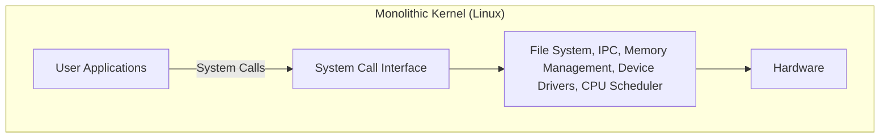
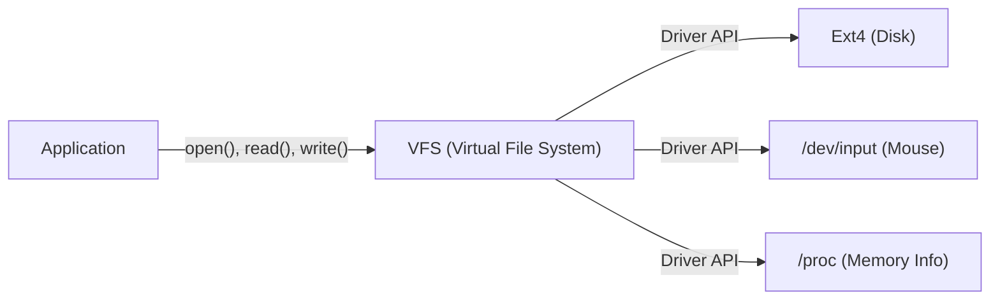

# Prologue : Tout a commencé par un message

Le 25 août 1991, un message modeste a été posté sur le groupe de discussion `comp.os.minix`.

> "Hello everybody out there using minix - I'm doing a (free) operating system (just a hobby, won't be big and professional like gnu) for 386(486) AT clones."

L'auteur de ce message était Linus Torvalds, alors étudiant à l'Université d'Helsinki en Finlande. À l'époque, « MINIX », développé par le professeur Andrew S. Tanenbaum et largement utilisé pour l'apprentissage des systèmes d'exploitation, avait des fonctionnalités limitées en raison de son objectif éducatif, ainsi que des restrictions de licence. Insatisfait de la conception de MINIX, Linus a commencé à créer un émulateur de terminal capable de tirer pleinement parti du processeur Intel 386 qu'il avait acheté, ce qui a fini par évoluer vers le noyau d'un système d'exploitation (OS) complet.

Ce projet, qu'il a appelé "juste un passe-temps" (just a hobby), est devenu, plus de 30 ans plus tard, l'un des projets logiciels les plus importants de l'histoire de l'humanité : "Linux", qui fait tourner 100 % des supercalculateurs du monde, la majorité des smartphones (Android) et l'écrasante majorité des infrastructures cloud. Dans cet article, nous allons examiner en profondeur comment Linux est né et quels choix d'architecture ont déterminé son succès.

# L'aube du logiciel libre et le projet GNU

Lorsqu'on parle de l'histoire du noyau Linux, on ne peut ignorer l'existence du projet GNU dirigé par Richard Stallman.

L'objectif du projet GNU, lancé en 1983, était de construire "GNU" (GNU's Not Unix!), un système d'exploitation complet que chacun pourrait librement utiliser, modifier et redistribuer, par opposition aux systèmes UNIX propriétaires (fermés et payants). Au début des années 1990, le projet GNU avait achevé presque tous les composants nécessaires à un OS, tels que le compilateur C (GCC), le shell (Bash), l'éditeur (Emacs) et les utilitaires de base.

Cependant, il ne manquait qu'une seule chose : le "noyau" (GNU Hurd), le cœur du système. Hurd utilisait une architecture de micro-noyau avancée, mais son développement rencontrait des difficultés en raison de sa complexité.

C'est à ce moment précis que le noyau Linux, développé par Linus, est apparu. En combinant la riche suite de logiciels de GNU avec le noyau Linux fonctionnel et pratique, le tout premier système d'exploitation entièrement libre et pratique, "GNU/Linux", est né. Cette rencontre miraculeuse a considérablement changé l'histoire de l'open source.

# Décision architecturale : Monolithique ou Micro ?

Dans la conception des noyaux d'OS, l'une des controverses les plus célèbres de l'histoire est le "débat Tanenbaum-Torvalds". En 1992, le professeur Tanenbaum, auteur de MINIX, a posté une critique de l'architecture de Linux intitulée "LINUX is obsolete" (Linux est obsolète).

## Structure des micro-noyaux et des noyaux monolithiques

Le cœur du débat portait sur la philosophie de conception du noyau.

**Noyau monolithique (L'approche de Linux) :**
C'est une méthode où toutes les fonctions principales de l'OS (gestion de la mémoire, ordonnancement des processus, système de fichiers, pilotes de périphériques, etc.) s'exécutent dans un seul espace mémoire géant (l'espace noyau).
- **Avantages :** Très haute performance avec peu de frais généraux (overhead) pour la communication entre les composants.
- **Inconvénients :** Un seul bug (comme une erreur de pilote de périphérique) risque de provoquer le plantage de l'ensemble du noyau (kernel panic).

**Micro-noyau (L'approche de MINIX et Hurd) :**
Seules les fonctions minimales (IPC, ordonnancement de base, etc.) sont placées dans l'espace noyau, tandis que les systèmes de fichiers, les pilotes, etc., s'exécutent en tant que processus serveurs indépendants dans l'espace utilisateur.
- **Avantages :** Même si un pilote spécifique plante, l'ensemble de l'OS ne s'arrête pas, offrant une fiabilité et une modularité élevées.
- **Inconvénients :** La communication inter-processus (IPC) est fréquente, entraînant souvent une dégradation des performances due aux changements de contexte (context switches).

Tanenbaum a fait valoir que les futurs systèmes d'exploitation devraient migrer vers des micro-noyaux hautement fiables, et que le Linux monolithique était "une régression vers l'UNIX des années 1970". Cependant, Linus a réfuté cela d'un point de vue pragmatique. Avec le matériel de l'époque, la pénalité de performance d'un micro-noyau ne pouvait être ignorée, et le noyau monolithique fonctionnait de manière beaucoup plus rapide et réaliste. En fin de compte, les performances écrasantes de Linux et l'extensibilité dynamique apportée par les modules de noyau chargeables (LKM) introduits par la suite ont prouvé la supériorité du noyau monolithique.

# Héritage de la philosophie UNIX : "Everything is a file"

Étant développé comme un clone d'UNIX, Linux hérite de la puissante "philosophie UNIX". Le concept le plus célèbre et le plus important est le principe selon lequel "tout est un fichier" (Everything is a file).

Dans Linux, toutes les ressources, des périphériques matériels comme les disques durs, claviers, souris et imprimantes, jusqu'aux informations de processus et sockets réseau, sont abstraites sous forme de "fichiers" virtuels.

Par exemple, un disque dur est traité comme `/dev/sda`, les informations de processus comme des fichiers dans le répertoire `/proc`, et le générateur de nombres aléatoires comme `/dev/urandom`. Ainsi, les développeurs peuvent accéder à des types de ressources complètement différents avec la même interface, simplement en utilisant des fonctions de lecture/écriture de fichiers standard (`open()`, `read()`, `write()`, `close()`).

Cette puissante abstraction est fournie par le **VFS (Virtual File System)**. Grâce à la couche VFS, les applications n'ont pas du tout besoin de se soucier du type de périphérique physique ou de système de fichiers sous-jacent.

# Séparation stricte entre l'espace noyau et l'espace utilisateur

Un autre concept important qui sous-tend la robustesse du noyau Linux est la séparation des niveaux de privilèges. En utilisant les fonctionnalités matérielles du CPU (telles que Ring 0 et Ring 3), l'espace mémoire est strictement séparé en "espace noyau" et "espace utilisateur".

1. **Espace utilisateur (User Space) :** Une zone sûre où les applications normales (navigateurs, éditeurs, bases de données, etc.) s'exécutent. Elles ne peuvent pas accéder directement au matériel, et les accès mémoire illégaux entraînent uniquement l'arrêt forcé du processus sous forme de "défaut de segmentation" (Segfault).
2. **Espace noyau (Kernel Space) :** La zone privilégiée où s'exécute le noyau de l'OS. Il a un accès illimité à toute la mémoire du système et aux périphériques matériels.

Lorsque les programmes de l'espace utilisateur écrivent dans des fichiers ou communiquent sur le réseau, ils ne peuvent pas manipuler directement le matériel. Au lieu de cela, ils doivent "demander" au noyau de faire le travail via une interface spéciale appelée **"Appel système" (System Call)**.

Lorsqu'un appel système est invoqué, le CPU effectue un changement de contexte et élève le niveau de privilège du mode utilisateur au mode noyau. Une fois que le noyau a manipulé le matériel en toute sécurité, il retourne en mode utilisateur. Cette séparation stricte protège l'ensemble du système contre les programmes malveillants ou les applications buggées, réalisant ainsi un environnement multitâche stable.

# Conclusion : Une étoile géante en constante évolution

Commencé comme un "petit passe-temps" par Linus Torvalds, Linux s'est combiné aux idéaux de GNU et a évolué grâce aux contributions de milliers de développeurs (la communauté des hackers) à travers le monde.

Beaucoup de ses décisions initiales—une architecture qui privilégie le pragmatisme et les performances plutôt que la supériorité théorique du micro-noyau, l'abstraction par le VFS et les mécanismes de protection par l'espace noyau—continuent de soutenir ses fondations aujourd'hui. À l'ère moderne, des conteneurs cloud (Docker/Kubernetes) aux supercalculateurs d'IA en passant par les appareils IoT, une infrastructure informatique sans Linux est impensable.

L'histoire de Linux est sans doute le plus bel exemple prouvant la grandeur des logiciels que l'humanité peut créer lorsqu'une excellente conception architecturale est associée au modèle de développement open source.
