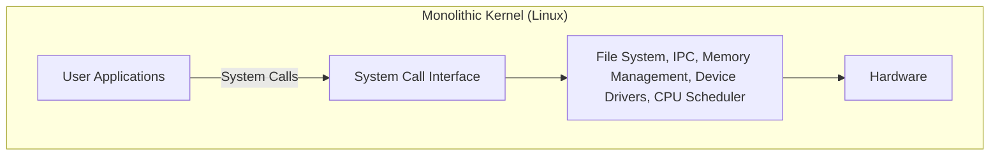
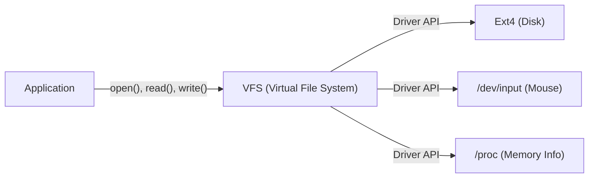

# प्रस्तावना: सब कुछ एक पोस्ट से शुरू हुआ

25 अगस्त 1991 को, `comp.os.minix` न्यूज़ग्रुप में एक विनम्र संदेश पोस्ट किया गया था।

> "minix का उपयोग करने वाले सभी लोगों को नमस्कार - मैं 386(486) AT क्लोन के लिए एक (मुफ्त) ऑपरेटिंग सिस्टम (सिर्फ एक शौक, gnu की तरह बड़ा और पेशेवर नहीं होगा) बना रहा हूँ।"

इस पोस्ट के लेखक लिनुस टोरवाल्ड्स (Linus Torvalds) थे, जो उस समय फ़िनलैंड में हेलसिंकी विश्वविद्यालय के एक छात्र थे। उस समय, प्रोफ़ेसर एंड्रयू एस. तानेनबाम द्वारा बनाया गया "MINIX" OS सीखने के लिए व्यापक रूप से उपयोग किया जाता था, लेकिन शैक्षिक उद्देश्यों के कारण इसके कार्य सीमित थे और इसके लाइसेंस पर भी प्रतिबंध थे। MINIX के डिज़ाइन से असंतुष्ट, लिनुस ने एक टर्मिनल एमुलेटर लिखना शुरू किया जो उनके द्वारा खरीदे गए Intel 386 प्रोसेसर की क्षमताओं का पूरी तरह से उपयोग कर सके, और यह अंततः एक पूर्ण ऑपरेटिंग सिस्टम (OS) कर्नेल में विकसित हुआ।

यह प्रोजेक्ट जिसे उन्होंने "सिर्फ एक शौक" कहा था, 30 से अधिक वर्षों के बाद "लिनक्स" (Linux) बन गया है, जो मानव इतिहास के सबसे महत्वपूर्ण सॉफ्टवेयर प्रोजेक्ट्स में से एक है, जो दुनिया के 100% सुपर कंप्यूटर, अधिकांश स्मार्टफोन (Android) और क्लाउड इंफ्रास्ट्रक्चर के विशाल बहुमत को चलाता है। इस लेख में, हम गहराई से जानेंगे कि लिनक्स कैसे पैदा हुआ और किन वास्तुशिल्प विकल्पों ने इसकी सफलता तय की।

# मुफ्त सॉफ्टवेयर का उदय और GNU प्रोजेक्ट

लिनक्स कर्नेल के इतिहास के बारे में बात करते समय रिचर्ड स्टॉलमैन (Richard Stallman) के नेतृत्व वाले GNU प्रोजेक्ट का उल्लेख करना आवश्यक है।

1983 में शुरू किए गए GNU प्रोजेक्ट का लक्ष्य मालिकाना (बंद और सशुल्क) UNIX सिस्टम के विकल्प के रूप में एक पूर्ण OS "GNU" (GNU's Not Unix!) का निर्माण करना था, जिसे कोई भी स्वतंत्र रूप से उपयोग, संशोधित और पुनर्वितरित कर सके। 1990 के दशक की शुरुआत तक, GNU प्रोजेक्ट ने OS के लिए आवश्यक लगभग सभी घटकों को पूरा कर लिया था, जिसमें एक C कंपाइलर (GCC), एक शेल (Bash), एक संपादक (Emacs) और मुख्य उपयोगिताएँ शामिल थीं।

हालाँकि, एकमात्र कमी सिस्टम का मुख्य भाग "कर्नेल" (GNU Hurd) था। Hurd ने एक उन्नत माइक्रोकर्नेल वास्तुकला अपनाई, लेकिन इसकी जटिलता के कारण विकास में कठिनाई हुई।

इसी सटीक समय पर लिनुस द्वारा विकसित लिनक्स कर्नेल दिखाई दिया। GNU के समृद्ध सॉफ़्टवेयर और एक व्यावहारिक लिनक्स कर्नेल के संयोजन से, पहली बार एक पूरी तरह से मुफ़्त और व्यावहारिक OS "GNU/Linux" सिस्टम का जन्म हुआ। इस चमत्कारी मुलाकात ने ओपन-सोर्स के इतिहास को बहुत प्रभावित किया।

# वास्तुकला का निर्णय: मोनोलिथिक या माइक्रो

OS कर्नेल डिज़ाइन के इतिहास में सबसे प्रसिद्ध विवादों में से एक "तानेनबाम-टोरवाल्ड्स विवाद" है। 1992 में, MINIX के लेखक प्रोफ़ेसर तानेनबाम ने लिनक्स की वास्तुकला की आलोचना करते हुए एक पोस्ट किया। इसका शीर्षक था "LINUX is obsolete" (लिनक्स पुराना हो गया है)।

## माइक्रोकर्नेल और मोनोलिथिक कर्नेल की संरचना

बहस का मुख्य बिंदु कर्नेल की डिज़ाइन फिलॉसफी थी।

**मोनोलिथिक कर्नेल (लिनक्स का तरीका):**
एक ऐसी विधि जिसमें OS के सभी मुख्य कार्य (मेमोरी प्रबंधन, प्रक्रिया शेड्यूलिंग, फ़ाइल सिस्टम, डिवाइस ड्राइवर, आदि) एक विशाल मेमोरी स्पेस (कर्नेल स्पेस) में निष्पादित किए जाते हैं।
- **फायदे:** घटकों के बीच संचार का ओवरहेड कम है, और प्रदर्शन बहुत उच्च है।
- **नुकसान:** एक बग (जैसे डिवाइस ड्राइवर में त्रुटि) पूरे कर्नेल को क्रैश (कर्नेल पैनिक) कर सकता है।

**माइक्रोकर्नेल (MINIX और Hurd का तरीका):**
कर्नेल स्पेस में केवल न्यूनतम कार्य (IPC, बुनियादी शेड्यूलिंग, आदि) रखे जाते हैं, और फ़ाइल सिस्टम और ड्राइवर उपयोगकर्ता स्पेस में स्वतंत्र सर्वर प्रक्रियाओं के रूप में चलाए जाते हैं।
- **फायदे:** यदि कोई विशिष्ट ड्राइवर क्रैश हो जाता है, तो पूरा OS नहीं रुकता, जो उच्च विश्वसनीयता और मॉड्यूलरिटी प्रदान करता है।
- **नुकसान:** अंतर-प्रक्रिया संचार (IPC) अक्सर होता है, और कॉन्टेक्स्ट स्विचिंग से प्रदर्शन कम होने की संभावना होती है।

तानेनबाम ने तर्क दिया कि भविष्य के OS को एक विश्वसनीय माइक्रोकर्नेल में जाना चाहिए, और मोनोलिथिक लिनक्स "1970 के दशक के UNIX में पीछे हटना" है। हालाँकि, लिनुस ने व्यावहारिक दृष्टिकोण से इसका खंडन किया। उस समय के हार्डवेयर के साथ, माइक्रोकर्नेल के प्रदर्शन के नुकसान को नज़रअंदाज़ नहीं किया जा सकता था, और मोनोलिथिक कर्नेल बहुत तेज़ और अधिक वास्तविक रूप से काम करता था। नतीजतन, लिनक्स के जबरदस्त प्रदर्शन और बाद में पेश किए गए लोडेबल कर्नेल मॉड्यूल (LKM) द्वारा प्रदान की गई गतिशील विस्तारशीलता ने मोनोलिथिक कर्नेल की श्रेष्ठता साबित कर दी।

# UNIX दर्शन की विरासत: "सब कुछ एक फ़ाइल है"

चूंकि लिनक्स को UNIX क्लोन के रूप में विकसित किया गया था, इसलिए इसे शक्तिशाली "UNIX दर्शन" विरासत में मिला। इनमें सबसे प्रसिद्ध और महत्वपूर्ण अवधारणा "सब कुछ एक फ़ाइल है" (Everything is a file) का सिद्धांत है।

लिनक्स में, हार्ड ड्राइव, कीबोर्ड, माउस और प्रिंटर जैसे हार्डवेयर उपकरणों से लेकर प्रक्रिया जानकारी और नेटवर्क सॉकेट तक सभी संसाधनों को आभासी "फ़ाइलों" के रूप में अमूर्त किया जाता है।

उदाहरण के लिए, हार्ड डिस्क को `/dev/sda` के रूप में माना जाता है, प्रक्रिया की जानकारी `/proc` निर्देशिका के तहत फ़ाइलें हैं, और यादृच्छिक संख्या जनरेटर `/dev/urandom` है। यह डेवलपर्स को मानक फ़ाइल रीड/राइट फ़ंक्शंस (`open()`, `read()`, `write()`, `close()`) का उपयोग करके समान इंटरफ़ेस के साथ पूरी तरह से अलग प्रकार के संसाधनों तक पहुंचने की अनुमति देता है।

यह शक्तिशाली अमूर्तन **वर्चुअल फ़ाइल सिस्टम (VFS)** द्वारा प्रदान किया जाता है। VFS परत की उपस्थिति के कारण, अनुप्रयोगों को अंतर्निहित भौतिक उपकरणों या फ़ाइल सिस्टम के प्रकार के बारे में जागरूक होने की आवश्यकता नहीं है।

# कर्नेल स्पेस और यूजर स्पेस का सख्त अलगाव

लिनक्स कर्नेल की मजबूती का समर्थन करने वाली एक और महत्वपूर्ण अवधारणा विशेषाधिकार स्तरों का अलगाव है। CPU के हार्डवेयर फीचर्स (जैसे Ring 0 और Ring 3) का उपयोग करके, मेमोरी स्पेस को सख्ती से "कर्नेल स्पेस" और "यूजर स्पेस" में विभाजित किया गया है।

1. **यूजर स्पेस (User Space):** सुरक्षित क्षेत्र जहां सामान्य अनुप्रयोग (ब्राउज़र, संपादक, डेटाबेस आदि) चलते हैं। वे सीधे हार्डवेयर तक नहीं पहुंच सकते, और मेमोरी तक अनधिकृत पहुंच केवल प्रक्रिया को समाप्त (Segfault) कर देती है।
2. **कर्नेल स्पेस (Kernel Space):** विशेषाधिकार प्राप्त क्षेत्र जहां OS कर्नेल काम करता है। इसके पास सिस्टम की सभी मेमोरी और हार्डवेयर उपकरणों तक असीमित पहुंच है।

जब यूजर स्पेस में प्रोग्राम फ़ाइलों को लिखते हैं या नेटवर्क पर संचार करते हैं, तो वे सीधे हार्डवेयर को संचालित नहीं कर सकते। इसके बजाय, उन्हें **"सिस्टम कॉल" (System Calls)** नामक विशेष इंटरफ़ेस के माध्यम से कर्नेल से काम करने का "अनुरोध" करना पड़ता है।

जब एक सिस्टम कॉल का आह्वान किया जाता है, तो CPU एक कॉन्टेक्स्ट स्विच करता है और विशेषाधिकार स्तर को उपयोगकर्ता मोड से कर्नेल मोड में अपग्रेड करता है। कर्नेल द्वारा सुरक्षित रूप से हार्डवेयर को संचालित करने के बाद, यह वापस उपयोगकर्ता मोड में लौट आता है। यह सख्त अलगाव पूरे सिस्टम को दुर्भावनापूर्ण प्रोग्रामों और छोटी-मोटी त्रुटियों वाले अनुप्रयोगों से बचाता है, और एक स्थिर मल्टीटास्किंग वातावरण का एहसास कराता है।

# निष्कर्ष: एक विशाल तारा जो विकसित होता रहता है

लिनक्स, जो लिनुस टोरवाल्ड्स के "सिर्फ एक शौक" के रूप में शुरू हुआ, GNU के आदर्शों के साथ विलीन हो गया और दुनिया भर के हजारों डेवलपर्स (हैकर समुदाय) के योगदान से विकसित हुआ।

कई शुरुआती निर्णय, जैसे कि वह वास्तुकला जो माइक्रोकर्नेल की सैद्धांतिक श्रेष्ठता पर व्यावहारिकता और प्रदर्शन को महत्व देती थी, VFS के माध्यम से अमूर्तन, और कर्नेल स्पेस द्वारा सुरक्षा तंत्र, आज भी इसके मूल का समर्थन करते हैं। आधुनिक युग में, क्लाउड कंटेनर (Docker/Kubernetes) से लेकर AI सुपरकंप्यूटर और IoT उपकरणों तक, लिनक्स के बिना IT बुनियादी ढांचे की कल्पना नहीं की जा सकती है।

लिनक्स का इतिहास यह साबित करने वाला सबसे सुंदर उदाहरण है कि मानवता कितना महान सॉफ्टवेयर बना सकती है जब उत्कृष्ट वास्तुशिल्प डिजाइन और एक ओपन-सोर्स विकास मॉडल को जोड़ा जाता है।
