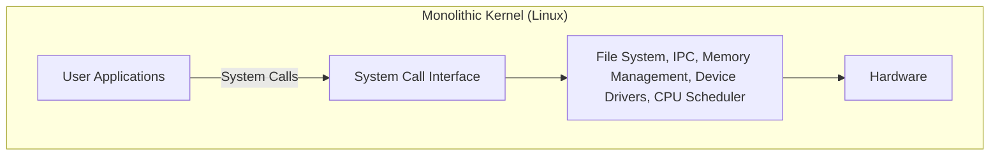
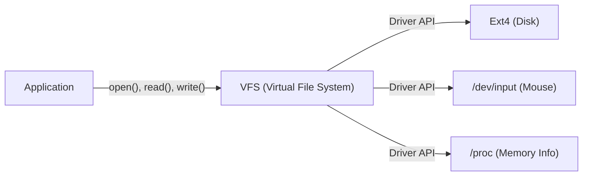

# Pengantar: Semuanya Dimulai dari Satu Postingan

Pada 25 Agustus 1991, sebuah pesan sederhana diposting di newsgroup `comp.os.minix`.

> "Hello everybody out there using minix - I'm doing a (free) operating system (just a hobby, won't be big and professional like gnu) for 386(486) AT clones."

Penulis postingan tersebut adalah Linus Torvalds, seorang mahasiswa di Universitas Helsinki, Finlandia saat itu. Pada masa itu, "MINIX" yang dikembangkan oleh Profesor Andrew S. Tanenbaum banyak digunakan untuk mempelajari OS. Namun, karena ditujukan untuk tujuan pendidikan, fungsinya terbatas dan lisensinya memiliki pembatasan. Linus tidak puas dengan desain MINIX dan mulai membuat terminal emulator untuk memanfaatkan sepenuhnya prosesor Intel 386 yang ia beli, yang pada akhirnya berkembang menjadi kernel sistem operasi (OS) yang lengkap.

Proyek yang ia sebut "hanya hobi (just a hobby)" ini, setelah lebih dari 30 tahun, telah berkembang menjadi "Linux", salah satu proyek perangkat lunak terpenting dalam sejarah umat manusia yang menjalankan 100% superkomputer dunia, sebagian besar ponsel cerdas (Android), dan mayoritas infrastruktur cloud. Artikel ini akan menggali secara mendalam bagaimana Linux lahir dan pilihan arsitektur apa yang menentukan keberhasilannya.

# Fajar Perangkat Lunak Bebas dan Proyek GNU

Dalam menceritakan sejarah kernel Linux, keberadaan Proyek GNU yang dipimpin oleh Richard Stallman tidak bisa diabaikan.

Tujuan Proyek GNU yang dimulai pada tahun 1983 adalah untuk membangun "GNU (GNU's Not Unix!)", sebuah sistem operasi lengkap yang dapat digunakan, dimodifikasi, dan didistribusikan kembali secara bebas oleh siapa saja, sebagai alternatif dari sistem UNIX proprietari (tertutup dan berbayar). Menjelang awal 1990-an, Proyek GNU telah menyelesaikan hampir semua komponen yang dibutuhkan untuk sebuah OS, seperti kompiler C (GCC), shell (Bash), editor (Emacs), dan utilitas inti dasar.

Namun, satu-satunya yang kurang adalah "kernel (GNU Hurd)", yang merupakan inti dari sistem. Hurd menggunakan arsitektur mikrokernel yang canggih, namun pengembangannya terhambat karena kompleksitasnya.

Tepat pada waktu yang sangat pas inilah kernel Linux yang dikembangkan oleh Linus muncul. Dengan menggabungkan perangkat lunak kaya dari GNU dan kernel Linux yang berfungsi secara praktis, untuk pertama kalinya sistem OS yang sepenuhnya bebas dan praktis, yaitu "GNU/Linux", lahir. Pertemuan ajaib ini telah menggerakkan sejarah open source secara signifikan.

# Keputusan Arsitektur: Monolitik atau Mikro

Dalam desain kernel OS, salah satu perdebatan paling terkenal dalam sejarah adalah "Perdebatan Tanenbaum-Torvalds". Pada tahun 1992, Profesor Tanenbaum, pencipta MINIX, memposting kritik terhadap arsitektur Linux dengan judul "LINUX is obsolete (Linux sudah usang)".

## Struktur Mikrokernel dan Kernel Monolitik

Inti dari perdebatan ini adalah filosofi desain kernel.

**Kernel Monolitik (Pendekatan Linux):**
Sebuah pendekatan di mana seluruh fungsi utama OS (manajemen memori, penjadwalan proses, sistem file, driver perangkat, dll.) dijalankan dalam satu ruang memori yang sangat besar (ruang kernel).
- **Kelebihan:** Overhead komunikasi antar komponen rendah, performa sangat tinggi.
- **Kekurangan:** Sebuah bug (misalnya kesalahan driver perangkat) berisiko menyebabkan seluruh kernel crash (kernel panic).

**Mikrokernel (Pendekatan MINIX dan Hurd):**
Sebuah pendekatan di mana hanya fungsi minimum (IPC, penjadwalan dasar, dll.) yang ditempatkan di ruang kernel, sementara sistem file, driver, dan lain-lain dijalankan sebagai proses server independen di ruang pengguna.
- **Kelebihan:** Jika driver tertentu crash, OS secara keseluruhan tidak akan berhenti, sehingga memiliki keandalan dan modularitas sistem yang tinggi.
- **Kekurangan:** Komunikasi antar proses (IPC) yang sering terjadi dapat menyebabkan penurunan performa karena pergantian konteks (context switch).

Tanenbaum berargumen bahwa OS masa depan harus beralih ke mikrokernel yang sangat andal, dan Linux yang monolitik adalah "kemunduran ke UNIX tahun 1970-an". Namun, Linus membantah hal ini dari sudut pandang pragmatisme. Pada perangkat keras saat itu, penalti performa dari mikrokernel tidak bisa diabaikan, dan kernel monolitik beroperasi jauh lebih cepat serta realistis. Pada akhirnya, performa luar biasa Linux dan kemampuan perluasan dinamis melalui Loadable Kernel Modules (LKM) yang diperkenalkan kemudian, membuktikan keunggulan kernel monolitik.

# Pewarisan Filosofi UNIX: "Everything is a file"

Karena Linux dikembangkan sebagai klon UNIX, ia mewarisi "Filosofi UNIX" yang kuat. Konsep yang paling terkenal dan penting di dalamnya adalah prinsip "semuanya adalah file (Everything is a file)".

Di Linux, segala sumber daya, mulai dari perangkat keras seperti hard drive, keyboard, mouse, printer, hingga informasi proses dan soket jaringan, diabstraksikan sebagai "file" virtual.

Sebagai contoh, hard disk diperlakukan sebagai `/dev/sda`, informasi proses sebagai kumpulan file dalam direktori `/proc`, dan generator angka acak sebagai `/dev/urandom`. Hal ini memungkinkan pengembang untuk mengakses berbagai jenis sumber daya yang sama sekali berbeda melalui antarmuka yang sama, cukup dengan menggunakan fungsi baca/tulis file standar (`open()`, `read()`, `write()`, `close()`).

Abstraksi yang kuat ini disediakan oleh **VFS (Virtual File System)**. Dengan adanya lapisan VFS, aplikasi tidak perlu peduli dengan jenis perangkat fisik atau sistem file yang ada di latar belakang.

# Pemisahan Tegas Antara Ruang Kernel dan Ruang Pengguna

Konsep penting lain yang mendukung ketahanan kernel Linux adalah pemisahan tingkat hak istimewa (privilege). Dengan memanfaatkan fitur perangkat keras CPU (seperti Ring 0 dan Ring 3), memori secara tegas dipisahkan menjadi "Ruang Kernel" dan "Ruang Pengguna".

1. **Ruang Pengguna (User Space):** Area aman tempat aplikasi biasa (browser, editor, database, dll.) dijalankan. Aplikasi ini tidak dapat mengakses perangkat keras secara langsung, dan akses memori yang tidak sah hanya akan menyebabkan proses tersebut dihentikan secara paksa sebagai "Kesalahan Segmentasi (Segfault)".
2. **Ruang Kernel (Kernel Space):** Area berhak istimewa tempat kernel OS beroperasi. Memiliki hak akses tak terbatas ke seluruh memori sistem dan perangkat keras.

Ketika program di ruang pengguna melakukan operasi seperti menulis ke file atau komunikasi jaringan, ia tidak dapat mengoperasikan perangkat keras secara langsung. Sebaliknya, ia harus "meminta" kernel untuk melakukan pekerjaan tersebut melalui antarmuka khusus yang disebut **"System Call"**.

Saat system call dipanggil, CPU melakukan pergantian konteks dan meningkatkan tingkat hak istimewa dari mode pengguna ke mode kernel. Setelah kernel dengan aman mengoperasikan perangkat keras, CPU kembali ke mode pengguna. Pemisahan yang ketat ini melindungi sistem secara keseluruhan dari program jahat atau aplikasi yang memiliki bug, serta mewujudkan lingkungan multitasking yang stabil.

# Kesimpulan: Bintang Raksasa yang Terus Berkembang

Linux, yang dimulai sebagai "sekadar hobi" Linus Torvalds, telah berevolusi melalui perpaduan dengan filosofi GNU dan kontribusi dari ribuan pengembang (komunitas hacker) di seluruh dunia.

Sebagian besar keputusan awal—seperti arsitektur yang mengutamakan kepraktisan dan performa daripada keunggulan teoretis mikrokernel, abstraksi VFS, dan mekanisme perlindungan ruang kernel—masih menjadi fondasinya hingga hari ini. Di era modern ini, mulai dari kontainer cloud (Docker/Kubernetes), superkomputer AI, hingga perangkat IoT, infrastruktur TI tanpa Linux adalah hal yang mustahil dibayangkan.

Sejarah Linux adalah contoh terindah yang membuktikan betapa hebatnya perangkat lunak yang bisa diciptakan umat manusia ketika desain arsitektur yang brilian digabungkan dengan model pengembangan sumber terbuka.
