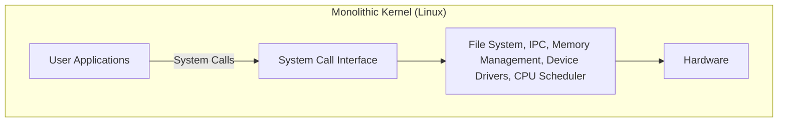
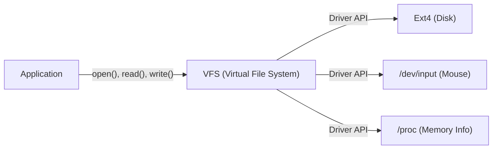

# 서장: 모든 것은 하나의 게시물에서 시작되었다

1991년 8월 25일, 뉴스그룹 `comp.os.minix`에 소박한 메시지 하나가 게시되었습니다.

> "Hello everybody out there using minix - I'm doing a (free) operating system (just a hobby, won't be big and professional like gnu) for 386(486) AT clones."

이 게시물의 주인공은 당시 핀란드 헬싱키 대학교의 학생이었던 리누스 토발즈(Linus Torvalds)입니다. 당시 OS 학습용으로 널리 사용되던 앤드류 S. 타넨바움(Andrew S. Tanenbaum) 교수의 'MINIX'는 교육 목적이었기 때문에 기능이 제한적이었고 라이선스에도 제약이 있었습니다. 리누스는 MINIX의 설계에 불만을 품고 자신이 구매한 Intel 386 프로세서의 기능을 완전히 끌어낼 수 있는 터미널 에뮬레이터를 만들기 시작했으며, 이것이 이윽고 완전한 운영 체제(OS)의 커널로 발전하게 되었습니다.

그가 '단순한 취미(just a hobby)'라고 불렀던 이 프로젝트는 그 후 30년 이상의 세월이 흘러 전 세계 슈퍼컴퓨터의 100%, 스마트폰의 대다수(Android), 그리고 클라우드 인프라의 압도적 다수를 구동하는, 인류 역사상 가장 중요한 소프트웨어 프로젝트 중 하나인 'Linux'로 성장하게 됩니다. 본 기사에서는 이 Linux가 어떻게 탄생했으며, 어떠한 아키텍처의 선택이 그 성공을 결정지었는지 깊이 파헤쳐 보겠습니다.

# 자유 소프트웨어의 여명과 GNU 프로젝트

Linux 커널의 역사를 말할 때, 리처드 스톨만(Richard Stallman)이 이끄는 GNU 프로젝트의 존재를 빼놓을 수 없습니다.

1983년에 시작된 GNU 프로젝트의 목표는 독점적(비공개·유료)인 UNIX 시스템에 대항하여, 누구나 자유롭게 이용·수정·재배포할 수 있는 완전한 OS 'GNU(GNU's Not Unix!)'를 구축하는 것이었습니다. 1990년대 초반까지 GNU 프로젝트는 C 컴파일러(GCC), 셸(Bash), 에디터(Emacs), 기본적인 코어 유틸리티 등 OS에 필요한 거의 모든 컴포넌트를 완성한 상태였습니다.

하지만 유일하게 부족했던 것이 시스템의 핵심인 '커널(GNU Hurd)'이었습니다. Hurd는 선진적인 마이크로커널 아키텍처를 채택하고 있었지만, 그 복잡성으로 인해 개발은 난항을 겪고 있었습니다.

바로 이 절묘한 타이밍에 등장한 것이 리누스가 개발한 Linux 커널입니다. GNU의 풍부한 소프트웨어 군과 실용적으로 동작하는 Linux 커널이 결합함으로써 처음으로 완전히 자유롭고 실용적인 OS인 'GNU/Linux' 시스템이 탄생했습니다. 이 기적적인 만남이 오픈 소스의 역사를 크게 움직인 것입니다.

# 아키텍처의 결단: 모놀리식이냐, 마이크로냐

OS 커널 설계에 있어서 역사상 가장 유명한 논쟁 중 하나가 '타넨바움-토발즈 논쟁'입니다. 1992년 MINIX의 원작자인 타넨바움 교수는 Linux의 아키텍처를 비판하는 글을 게시했습니다. 그 제목은 'LINUX is obsolete(Linux는 구식이다)'였습니다.

## 마이크로커널과 모놀리식 커널의 구조

논쟁의 초점이 된 것은 커널의 설계 사상입니다.

**모놀리식 커널(Linux 방식):**
OS의 주요 기능(메모리 관리, 프로세스 스케줄링, 파일 시스템, 디바이스 드라이버 등)을 모두 하나의 거대한 메모리 공간(커널 공간)에서 실행하는 방식입니다.
- **장점:** 컴포넌트 간 통신의 오버헤드가 적고 퍼포먼스가 매우 높다.
- **단점:** 하나의 버그(예: 디바이스 드라이버의 오류)가 커널 전체의 충돌(커널 패닉)을 일으킬 위험이 있다.

**마이크로커널(MINIX나 Hurd 방식):**
커널 공간에는 최소한의 기능(IPC, 기본적인 스케줄링 등)만을 두고, 파일 시스템이나 드라이버 등은 사용자 공간의 독립적인 서버 프로세스로 실행하는 방식입니다.
- **장점:** 특정 드라이버가 충돌해도 OS 전체는 멈추지 않아 시스템의 신뢰성과 모듈성이 높다.
- **단점:** 프로세스 간 통신(IPC)이 빈번하게 발생하여 컨텍스트 스위치로 인한 퍼포먼스 저하가 생기기 쉽다.

타넨바움은 미래의 OS는 신뢰성 높은 마이크로커널로 이행해야 하며, 모놀리식인 Linux는 '1970년대의 UNIX로의 퇴행'이라고 주장했습니다. 그러나 리누스는 실용주의적 입장에서 이에 반론했습니다. 당시의 하드웨어에서는 마이크로커널의 퍼포먼스 페널티를 무시할 수 없었으며, 모놀리식 커널이 훨씬 더 빠르고 현실적으로 동작했던 것입니다. 결과적으로 Linux의 압도적인 퍼포먼스와 그 후에 도입된 적재 가능 커널 모듈(LKM)에 의한 동적 확장성이 모놀리식 커널의 우위성을 입증하게 되었습니다.

# UNIX 철학의 계승: "Everything is a file"

Linux는 UNIX 클론으로 개발되었기 때문에 강력한 'UNIX 철학'을 계승하고 있습니다. 그 중에서 가장 유명하고 중요한 개념이 '모든 것은 파일이다(Everything is a file)'라는 원칙입니다.

Linux에서는 하드 드라이브, 키보드, 마우스, 프린터 등의 하드웨어 디바이스부터 프로세스 정보, 네트워크 소켓에 이르기까지 모든 리소스가 가상의 '파일'로 추상화됩니다.

예를 들어 하드 디스크는 `/dev/sda`, 프로세스 정보는 `/proc` 디렉터리 아래의 파일 군, 난수 생성기는 `/dev/urandom`으로 취급됩니다. 이를 통해 개발자는 표준적인 파일 읽기/쓰기 함수(`open()`, `read()`, `write()`, `close()`)를 사용하는 것만으로 전혀 다른 종류의 리소스에 동일한 인터페이스로 접근할 수 있습니다.

이 강력한 추상화를 제공하는 것이 **VFS(Virtual File System)**입니다. VFS 계층이 존재함으로써 애플리케이션은 배후에 있는 물리 디바이스나 파일 시스템의 종류를 전혀 의식할 필요가 없습니다.

# 커널 공간과 사용자 공간의 엄격한 분리

Linux 커널의 견고함을 뒷받침하는 또 다른 중요한 개념이 권한 수준의 분리입니다. CPU의 하드웨어 기능(Ring 0과 Ring 3 등)을 이용하여 메모리 공간을 '커널 공간'과 '사용자 공간'으로 엄격하게 분리하고 있습니다.

1. **사용자 공간(User Space):** 일반적인 애플리케이션(브라우저, 에디터, 데이터베이스 등)이 실행되는 안전한 영역. 하드웨어에 직접 접근할 수 없으며, 메모리에 대한 부정 접근은 '세그멘테이션 폴트(Segfault)'로서 프로세스만이 강제 종료됩니다.
2. **커널 공간(Kernel Space):** OS 커널이 동작하는 특권 영역. 시스템의 모든 메모리나 하드웨어 디바이스에 무제한으로 접근할 수 있는 권한을 가집니다.

사용자 공간의 프로그램이 파일 쓰기나 네트워크 통신 등을 수행할 경우, 직접 하드웨어를 조작할 수는 없습니다. 대신 **'시스템 콜(System Call)'**이라고 불리는 특별한 인터페이스를 통해 커널에 작업을 '의뢰'해야 합니다.

시스템 콜이 호출되면 CPU는 컨텍스트 스위치를 수행하여 사용자 모드에서 커널 모드로 권한 수준을 격상시킵니다. 커널이 안전하게 하드웨어를 조작한 후 다시 사용자 모드로 돌아옵니다. 이 엄격한 분리를 통해 악의적인 프로그램이나 버그가 있는 애플리케이션으로부터 시스템 전체를 보호하고 안정적인 멀티태스킹 환경을 구현하고 있는 것입니다.

# 결론: 끊임없이 진화하는 거성

리누스 토발즈의 '소소한 취미'로 시작된 Linux는 GNU의 이념과 결합하고, 전 세계의 수천 명이 넘는 개발자들(해커 커뮤니티)의 기여에 의해 진화를 거듭했습니다.

마이크로커널의 이론적 우위성보다 실용성과 퍼포먼스를 중시한 아키텍처, VFS에 의한 추상화, 커널 공간에 의한 보호 메커니즘 등 초기의 결정 중 많은 부분이 오늘날에도 그 근간을 지탱하고 있습니다. 현대에는 클라우드 컨테이너(Docker/Kubernetes), AI 슈퍼컴퓨터, IoT 디바이스에 이르기까지 Linux 없는 IT 인프라는 상상할 수 없습니다.

Linux의 역사는 뛰어난 아키텍처 설계와 오픈 소스라는 개발 모델이 결합했을 때, 인류가 얼마나 위대한 소프트웨어를 만들어 낼 수 있는지를 증명하는 가장 아름다운 실제 사례라고 할 수 있을 것입니다.
