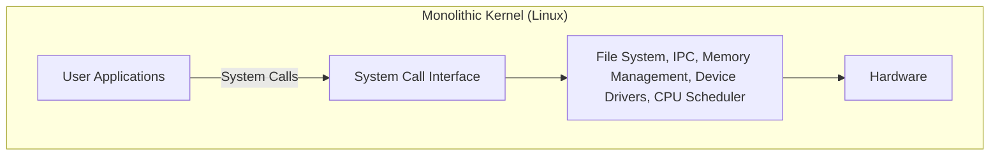
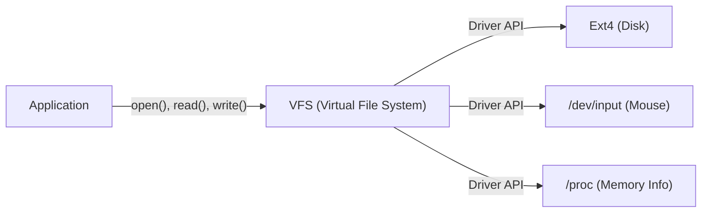

# 序章：すべては一つの投稿から始まった

1991年8月25日、ニュースグループ `comp.os.minix` に、ある控えめなメッセージが投稿されました。

> "Hello everybody out there using minix - I'm doing a (free) operating system (just a hobby, won't be big and professional like gnu) for 386(486) AT clones."

この投稿の主こそ、当時フィンランドのヘルシンキ大学の学生だったリーナス・トーバルズ（Linus Torvalds）です。当時、OSの学習用として広く使われていたAndrew S. Tanenbaum教授による「MINIX」は、教育目的ゆえに機能が制限されており、ライセンスにも制約がありました。リーナスはMINIXの設計に不満を持ち、自身が購入したIntel 386プロセッサの機能を完全に引き出せるターミナルエミュレータを作り始め、それがやがて完全なオペレーティングシステム（OS）のカーネルへと発展していきました。

彼が「単なる趣味（just a hobby）」と呼んだこのプロジェクトは、その後30年以上の時を経て、世界のスーパーコンピュータの100%、スマートフォンの大半（Android）、そしてクラウドインフラの圧倒的多数を稼働させる、人類史上最も重要なソフトウェアプロジェクトの一つである「Linux」へと成長を遂げます。本記事では、このLinuxがいかにして誕生し、どのようなアーキテクチャの選択がその成功を決定づけたのかを深く掘り下げます。

# 自由なソフトウェアの夜明けとGNUプロジェクト

Linuxカーネルの歴史を語る上で、Richard Stallman（リチャード・ストールマン）が率いるGNUプロジェクトの存在を欠かすことはできません。

1983年に開始されたGNUプロジェクトの目標は、プロプライエタリ（非公開・有償）なUNIXシステムに対して、誰もが自由に利用・改変・再配布できる完全なOS「GNU（GNU's Not Unix!）」を構築することでした。1990年代初頭までに、GNUプロジェクトはCコンパイラ（GCC）、シェル（Bash）、エディタ（Emacs）、基本的なコアユーティリティ群など、OSに必要なほぼすべてのコンポーネントを完成させていました。

しかし、唯一欠けていたのがシステムの核となる「カーネル（GNU Hurd）」でした。Hurdは先進的なマイクロカーネルアーキテクチャを採用していましたが、その複雑さゆえに開発は難航していました。

まさにこの絶妙なタイミングで登場したのが、リーナスの開発したLinuxカーネルです。GNUの豊富なソフトウェア群と、実用的に動作するLinuxカーネルが結びつくことで、初めて完全に自由で実用的なOS「GNU/Linux」システムが誕生しました。この奇跡的な出会いが、オープンソースの歴史を大きく動かしたのです。

# アーキテクチャの決断：モノリシックか、マイクロか

OSカーネルの設計において、歴史上最も有名な論争の一つが「Tanenbaum-Torvalds論争」です。1992年、MINIXの作者であるTanenbaum教授は、Linuxのアーキテクチャを批判する投稿を行いました。そのタイトルは「LINUX is obsolete（Linuxは時代遅れである）」というものでした。

## マイクロカーネルとモノリシックカーネルの構造

議論の的となったのは、カーネルの設計思想です。

**モノリシックカーネル（Linuxの方式）:**
OSの主要な機能（メモリ管理、プロセススケジューリング、ファイルシステム、デバイスドライバなど）をすべて一つの巨大なメモリ空間（カーネル空間）で実行する方式です。
- **利点:** コンポーネント間の通信のオーバーヘッドが少なく、パフォーマンスが非常に高い。
- **欠点:** 一つのバグ（例えばデバイスドライバのエラー）がカーネル全体のクラッシュ（カーネルパニック）を引き起こすリスクがある。

**マイクロカーネル（MINIXやHurdの方式）:**
カーネル空間には最小限の機能（IPC、基本的なスケジューリングなど）のみを置き、ファイルシステムやドライバなどはユーザー空間の独立したサーバープロセスとして実行する方式です。
- **利点:** 特定のドライバがクラッシュしてもOS全体は停止せず、システムの信頼性とモジュール性が高い。
- **欠点:** プロセス間通信（IPC）が頻発し、コンテキストスイッチによるパフォーマンスの低下が生じやすい。

Tanenbaumは、将来のOSは信頼性の高いマイクロカーネルに移行するべきであり、モノリシックなLinuxは「1970年代のUNIXへの退行」だと主張しました。しかし、リーナスは実用主義の立場からこれに反論しました。当時のハードウェアではマイクロカーネルのパフォーマンスのペナルティは無視できず、モノリシックカーネルの方がはるかに高速かつ現実的に動作したのです。結果として、Linuxの圧倒的なパフォーマンスと、その後に導入されたローダブル・カーネル・モジュール（LKM）による動的な拡張性が、モノリシックカーネルの優位性を実証することになりました。

# UNIX哲学の継承："Everything is a file"

LinuxはUNIXクローンとして開発されたため、強力な「UNIX哲学」を継承しています。その中で最も有名かつ重要な概念が「すべてはファイルである（Everything is a file）」という原則です。

Linuxにおいて、ハードドライブ、キーボード、マウス、プリンターなどのハードウェアデバイスから、プロセス情報、ネットワークソケットに至るまで、あらゆるリソースは仮想的な「ファイル」として抽象化されます。

例えば、ハードディスクは `/dev/sda`、プロセス情報は `/proc` ディレクトリ下のファイル群、乱数生成器は `/dev/urandom` として扱われます。これにより、開発者は標準的なファイルの読み書き関数（`open()`, `read()`, `write()`, `close()`）を使うだけで、全く異なる種類のリソースに同じインターフェースでアクセスすることができます。

この強力な抽象化を提供するのが**VFS（Virtual File System）**です。VFS層が存在することで、アプリケーションは背後にある物理デバイスやファイルシステムの種類を一切意識する必要がありません。

# カーネル空間とユーザー空間の厳格な分離

Linuxカーネルの堅牢性を支えるもう一つの重要な概念が、特権レベルの分離です。CPUのハードウェア機能（Ring 0 と Ring 3など）を利用して、メモリ空間を「カーネル空間」と「ユーザー空間」に厳格に分離しています。

1. **ユーザー空間（User Space）:** 通常のアプリケーション（ブラウザ、エディタ、データベースなど）が実行される安全な領域。ハードウェアに直接アクセスすることはできず、メモリへの不正アクセスは「セグメンテーションフォールト（Segfault）」としてプロセスのみが強制終了されます。
2. **カーネル空間（Kernel Space）:** OSカーネルが動作する特権領域。システムの全メモリやハードウェアデバイスに無制限にアクセスできる権限を持ちます。

ユーザー空間のプログラムがファイルへの書き込みやネットワーク通信などを行う場合、直接ハードウェアを操作することはできません。代わりに**「システムコール」**と呼ばれる特別なインターフェースを通じて、カーネルに作業を「依頼」する必要があります。

システムコールが呼び出されると、CPUはコンテキストスイッチを行い、ユーザーモードからカーネルモードへと特権レベルを昇格させます。カーネルが安全にハードウェアを操作した後、再びユーザーモードに戻ります。この厳格な分離により、悪意のあるプログラムやバグのあるアプリケーションからシステム全体を保護し、安定したマルチタスク環境を実現しているのです。

# まとめ：進化し続ける巨星

リーナス・トーバルズの「ちょっとした趣味」として始まったLinuxは、GNUの理念と結合し、世界中の数千人を超える開発者たち（ハッカーコミュニティ）の貢献によって進化を遂げました。

マイクロカーネルの理論的優位性よりも実用性とパフォーマンスを重んじたアーキテクチャ、VFSによる抽象化、カーネル空間による保護メカニズムなど、初期の決定の多くが今日でもその根幹を支えています。現代では、クラウドコンテナ（Docker/Kubernetes）、AIスーパーコンピュータ、IoTデバイスに至るまで、LinuxなしのITインフラは考えられません。

Linuxの歴史は、優れたアーキテクチャ設計とオープンソースという開発モデルが組み合わさった時、人類がどれほど偉大なソフトウェアを生み出せるのかを証明する、最も美しい実例と言えるでしょう。
