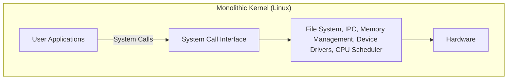
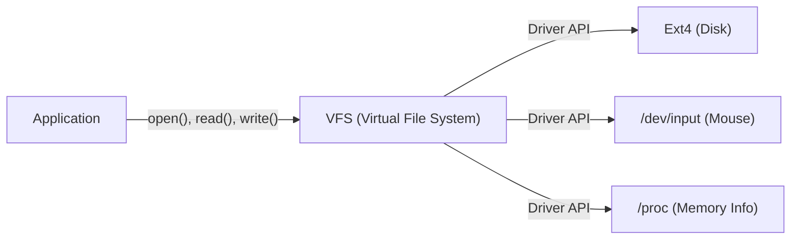

# Prólogo: Tudo Começou com uma Única Postagem

Em 25 de agosto de 1991, uma mensagem modesta foi postada no grupo de notícias `comp.os.minix`.

> "Hello everybody out there using minix - I'm doing a (free) operating system (just a hobby, won't be big and professional like gnu) for 386(486) AT clones."

O autor desta postagem era Linus Torvalds, então um estudante da Universidade de Helsinque, na Finlândia. Naquela época, o "MINIX", desenvolvido pelo Professor Andrew S. Tanenbaum, era amplamente utilizado para fins educacionais em sistemas operacionais, mas suas funcionalidades e licença eram restritas. Insatisfeito com o design do MINIX, Linus começou a criar um emulador de terminal para aproveitar ao máximo o processador Intel 386 que havia comprado, o que eventualmente se transformou em um kernel completo de sistema operacional (SO).

O que ele chamou de "apenas um hobby (just a hobby)" cresceu ao longo de mais de 30 anos para se tornar o "Linux", um dos projetos de software mais importantes da história humana, executando 100% dos supercomputadores do mundo, a maioria dos smartphones (Android) e a esmagadora maioria da infraestrutura em nuvem. Este artigo se aprofunda em como o Linux nasceu e quais escolhas arquitetônicas determinaram seu sucesso.

# O Amanhecer do Software Livre e o Projeto GNU

Ao discutir a história do kernel Linux, a existência do Projeto GNU, liderado por Richard Stallman, não pode ser ignorada.

O objetivo do Projeto GNU, iniciado em 1983, era construir o "GNU (GNU's Not Unix!)", um sistema operacional completo que qualquer pessoa pudesse usar, modificar e redistribuir livremente, em oposição aos sistemas UNIX proprietários (fechados e pagos). No início da década de 1990, o Projeto GNU já havia concluído quase todos os componentes necessários para um SO, incluindo um compilador C (GCC), shell (Bash), editor (Emacs) e um conjunto básico de utilitários principais.

No entanto, a única peça que faltava era o "kernel (GNU Hurd)", o núcleo do sistema. O Hurd adotava uma arquitetura avançada de microkernel, mas seu desenvolvimento enfrentou dificuldades devido à sua complexidade.

Foi nesse momento perfeito que surgiu o kernel Linux desenvolvido por Linus. Ao combinar a rica coleção de software do GNU com o kernel Linux funcional e prático, o primeiro sistema operacional totalmente livre e utilizável, "GNU/Linux", nasceu. Esse encontro milagroso impulsionou significativamente a história do código aberto.

# Decisão Arquitetônica: Monolítico ou Microkernel

Um dos debates mais famosos da história do design de kernels de SO é o "Debate Tanenbaum-Torvalds". Em 1992, o Professor Tanenbaum, criador do MINIX, publicou uma postagem criticando a arquitetura do Linux, intitulada "LINUX is obsolete (O Linux está obsoleto)".

## Estrutura do Microkernel e Kernel Monolítico

O foco do debate era a filosofia de design do kernel.

**Kernel Monolítico (Abordagem do Linux):**
Uma abordagem na qual todas as funções principais do SO (gerenciamento de memória, escalonamento de processos, sistema de arquivos, drivers de dispositivos, etc.) são executadas em um único e vasto espaço de memória (espaço do kernel).
- **Vantagens:** Baixa sobrecarga de comunicação entre componentes e desempenho extremamente alto.
- **Desvantagens:** Um único bug (como um erro em um driver de dispositivo) tem o risco de causar o travamento de todo o kernel (kernel panic).

**Microkernel (Abordagem do MINIX e Hurd):**
Uma abordagem na qual apenas o mínimo necessário de funcionalidades (IPC, escalonamento básico, etc.) reside no espaço do kernel, enquanto o sistema de arquivos, drivers e outros são executados como processos de servidores independentes no espaço do usuário.
- **Vantagens:** Se um driver específico falhar, o SO não para inteiramente, resultando em alta confiabilidade e modularidade do sistema.
- **Desvantagens:** A comunicação interprocessos (IPC) frequente pode causar quedas de desempenho devido às trocas de contexto (context switch).

Tanenbaum argumentou que os SOs do futuro deveriam migrar para microkernels de alta confiabilidade e que o Linux monolítico era "um retrocesso ao UNIX dos anos 70". Contudo, Linus contestou isso do ponto de vista do pragmatismo. Nos hardwares da época, a penalidade de desempenho do microkernel não podia ser ignorada, e um kernel monolítico operava de forma muito mais rápida e realista. No final, o desempenho impressionante do Linux, juntamente com a escalabilidade dinâmica proporcionada pelos Módulos de Kernel Carregáveis (LKM - Loadable Kernel Modules) introduzidos mais tarde, provaram a superioridade do kernel monolítico.

# A Herança da Filosofia UNIX: "Everything is a file"

Como o Linux foi desenvolvido como um clone do UNIX, ele herdou a forte "Filosofia UNIX". O conceito mais famoso e importante é o princípio de que "tudo é um arquivo (Everything is a file)".

No Linux, todos os recursos — desde dispositivos de hardware, como discos rígidos, teclados, mouses e impressoras, até informações sobre processos e soquetes de rede — são abstraídos como "arquivos" virtuais.

Por exemplo, um disco rígido é tratado como `/dev/sda`, as informações de processos como arquivos no diretório `/proc`, e um gerador de números aleatórios como `/dev/urandom`. Isso permite que desenvolvedores acessem tipos de recursos completamente diferentes usando a mesma interface padrão de leitura e gravação de arquivos (`open()`, `read()`, `write()`, `close()`).

Essa poderosa abstração é fornecida pelo **VFS (Virtual File System)**. Graças à camada VFS, as aplicações não precisam se preocupar com os dispositivos físicos ou tipos de sistema de arquivos subjacentes.

# A Separação Estrita entre Espaço do Kernel e Espaço do Usuário

Outro conceito importante que sustenta a robustez do kernel Linux é a separação dos níveis de privilégio. Utilizando recursos de hardware da CPU (como Ring 0 e Ring 3), o espaço de memória é rigidamente separado em "Espaço do Kernel" e "Espaço do Usuário".

1. **Espaço do Usuário (User Space):** Uma área segura onde aplicativos normais (navegadores, editores, bancos de dados, etc.) são executados. Esses aplicativos não podem acessar o hardware diretamente, e acessos irregulares à memória resultam apenas no encerramento forçado do processo como uma "Falha de Segmentação (Segfault)".
2. **Espaço do Kernel (Kernel Space):** Uma área privilegiada onde o kernel do SO opera. Tem acesso irrestrito a toda a memória do sistema e aos dispositivos de hardware.

Quando um programa no espaço do usuário precisa gravar em um arquivo ou realizar comunicação de rede, ele não pode operar o hardware diretamente. Em vez disso, ele deve "solicitar" que o kernel faça o trabalho através de uma interface especial chamada **"Chamada de Sistema (System Call)"**.

Quando uma chamada de sistema é invocada, a CPU realiza uma troca de contexto e eleva o nível de privilégio do modo de usuário para o modo de kernel. Depois que o kernel opera o hardware de forma segura, a CPU retorna ao modo de usuário. Essa separação estrita protege todo o sistema contra programas maliciosos ou aplicativos com bugs, garantindo um ambiente multitarefa estável.

# Conclusão: Um Gigante em Constante Evolução

O Linux, que começou como um "mero hobby" de Linus Torvalds, evoluiu através de sua combinação com a filosofia GNU e as contribuições de milhares de desenvolvedores (a comunidade hacker) ao redor do mundo.

Muitas de suas decisões iniciais — como a arquitetura que priorizava a praticidade e o desempenho em vez das vantagens teóricas do microkernel, a abstração pelo VFS e os mecanismos de proteção do espaço do kernel — continuam sustentando a sua base até hoje. Na era moderna, de contêineres na nuvem (Docker/Kubernetes) a supercomputadores de IA e dispositivos IoT, uma infraestrutura de TI sem Linux é inconcebível.

A história do Linux é o exemplo mais belo que prova os fantásticos softwares que a humanidade pode criar quando um projeto arquitetônico brilhante se encontra com um modelo de desenvolvimento de código aberto.
