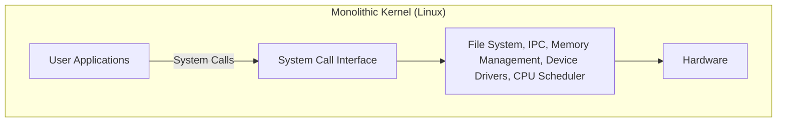
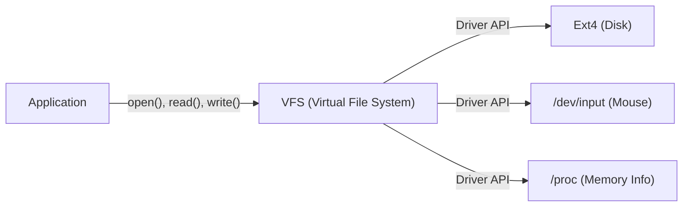

# Пролог: Все началось с одного поста

25 августа 1991 года в ньюсгруппе `comp.os.minix` появилось скромное сообщение.

> "Hello everybody out there using minix - I'm doing a (free) operating system (just a hobby, won't be big and professional like gnu) for 386(486) AT clones."

Автором этого поста был Линус Торвальдс (Linus Torvalds), тогда еще студент Хельсинкского университета в Финляндии. В то время "MINIX", созданный профессором Эндрю С. Таненбаумом (Andrew S. Tanenbaum) и широко используемый для изучения операционных систем, был ограничен в функциональности из-за своих образовательных целей и имел лицензионные ограничения. Линус был недоволен архитектурой MINIX и начал создавать эмулятор терминала, чтобы полностью использовать возможности своего процессора Intel 386. Вскоре это переросло в ядро полноценной операционной системы (ОС).

Этот проект, который он назвал "просто хобби (just a hobby)", спустя более 30 лет вырос в один из самых важных программных проектов в истории человечества — "Linux", который сегодня управляет 100% суперкомпьютеров в мире, большинством смартфонов (Android) и подавляющим большинством облачной инфраструктуры. В этой статье мы глубоко погрузимся в историю создания Linux и выясним, какие архитектурные решения определили его успех.

# Рассвет свободного программного обеспечения и проект GNU

Говоря об истории ядра Linux, нельзя не упомянуть проект GNU, возглавляемый Ричардом Столлманом (Richard Stallman).

Целью проекта GNU, запущенного в 1983 году, было создание "GNU (GNU's Not Unix!)" — полностью свободной операционной системы, которую каждый мог бы свободно использовать, изменять и распространять, в противовес проприетарным (закрытым и платным) UNIX-системам. К началу 1990-х годов проект GNU завершил создание почти всех компонентов, необходимых для ОС, таких как C-компилятор (GCC), оболочка (Bash), редактор (Emacs) и базовые наборы утилит (coreutils).

Однако единственным недостающим элементом было "ядро (GNU Hurd)", сердце системы. Hurd использовал передовую микроядерную архитектуру, но из-за ее сложности разработка шла с трудом.

Именно в этот идеальный момент появилось ядро Linux, разработанное Линусом. Объединение богатого набора программного обеспечения GNU с практически работающим ядром Linux впервые привело к рождению полностью свободной и практичной операционной системы "GNU/Linux". Эта чудесная встреча во многом определила историю открытого исходного кода.

# Архитектурные решения: Монолитное или микроядро

Одним из самых известных споров в истории проектирования ядер ОС является "спор Таненбаума и Торвальдса". В 1992 году профессор Таненбаум, автор MINIX, опубликовал пост с критикой архитектуры Linux. Он назывался "LINUX is obsolete (Linux устарел)".

## Структура микроядра и монолитного ядра

Предметом обсуждения стала концепция архитектуры ядра.

**Монолитное ядро (подход Linux):**
Архитектура, при которой все основные функции ОС (управление памятью, планирование процессов, файловые системы, драйверы устройств и т.д.) выполняются в едином огромном адресном пространстве (пространстве ядра).
- **Преимущества:** Низкие накладные расходы на обмен данными между компонентами, что обеспечивает очень высокую производительность.
- **Недостатки:** Один баг (например, ошибка в драйвере устройства) несет риск сбоя всего ядра (kernel panic).

**Микроядро (подход MINIX и Hurd):**
Архитектура, при которой в пространстве ядра находятся только минимально необходимые функции (IPC, базовое планирование и т.д.), а файловые системы, драйверы и прочее выполняются как независимые серверные процессы в пользовательском пространстве.
- **Преимущества:** Сбой конкретного драйвера не останавливает всю ОС, что обеспечивает высокую надежность и модульность системы.
- **Недостатки:** Частое межпроцессное взаимодействие (IPC) и переключения контекста легко приводят к снижению производительности.

Таненбаум утверждал, что ОС будущего должны перейти на надежные микроядра, а монолитный Linux — это "шаг назад к UNIX 1970-х годов". Однако Линус возразил ему с позиций прагматизма. На аппаратном обеспечении того времени штраф за производительность микроядра нельзя было игнорировать, а монолитное ядро работало гораздо быстрее и реалистичнее. В результате подавляющая производительность Linux и появившаяся позже динамическая расширяемость за счет загружаемых модулей ядра (LKM) доказали превосходство монолитных ядер.

# Наследие философии UNIX: "Everything is a file"

Поскольку Linux разрабатывался как клон UNIX, он унаследовал мощную "философию UNIX". Самой известной и важной концепцией в ней является принцип "Всё есть файл (Everything is a file)".

В Linux любые ресурсы — от аппаратных устройств (жесткие диски, клавиатуры, мыши, принтеры) до информации о процессах и сетевых сокетов — абстрагируются в виде виртуальных "файлов".

Например, жесткий диск рассматривается как `/dev/sda`, информация о процессах — как набор файлов в каталоге `/proc`, а генератор случайных чисел — как `/dev/urandom`. Благодаря этому разработчики могут использовать стандартные функции чтения/записи файлов (`open()`, `read()`, `write()`, `close()`) для доступа к совершенно разным типам ресурсов с единым интерфейсом.

Эту мощную абстракцию обеспечивает **VFS (Virtual File System)**. Наличие слоя VFS позволяет приложениям вообще не задумываться о типах нижележащих физических устройств или файловых систем.

# Строгое разделение пространства ядра и пользовательского пространства

Еще одной важной концепцией, поддерживающей надежность ядра Linux, является разделение уровней привилегий. Используя аппаратные возможности CPU (например, Ring 0 и Ring 3), память строго разделена на "пространство ядра" и "пользовательское пространство".

1. **Пользовательское пространство (User Space):** Безопасная область, где выполняются обычные приложения (браузеры, редакторы, базы данных и т.д.). Они не могут напрямую обращаться к оборудованию, а несанкционированный доступ к памяти приводит к принудительному завершению только самого процесса (Ошибка сегментации / Segfault).
2. **Пространство ядра (Kernel Space):** Привилегированная область, где работает ядро ОС. Имеет неограниченные права на доступ ко всей памяти системы и аппаратным устройствам.

Когда программа в пользовательском пространстве выполняет запись в файл или осуществляет сетевое взаимодействие, она не может напрямую управлять оборудованием. Вместо этого ей необходимо "запросить" ядро выполнить работу через специальный интерфейс, называемый **"системным вызовом" (system call)**.

При вызове системного вызова CPU выполняет переключение контекста, повышая уровень привилегий с пользовательского режима до режима ядра. После того как ядро безопасно управляет оборудованием, оно снова возвращается в пользовательский режим. Такое строгое разделение защищает всю систему от вредоносных программ и приложений с ошибками, обеспечивая стабильную многозадачную среду.

# Заключение: Вечно развивающийся гигант

Linux, начавшийся как "просто хобби" Линуса Торвальдса, объединился с идеалами GNU и эволюционировал благодаря вкладу более чем тысяч разработчиков со всего мира (сообщества хакеров).

Многие из ранних решений — архитектура, которая ценила практичность и производительность выше теоретического превосходства микроядер, абстракция посредством VFS, механизмы защиты в пространстве ядра — до сих пор остаются его фундаментом. В наше время IT-инфраструктуру невозможно представить без Linux: от облачных контейнеров (Docker/Kubernetes) до суперкомпьютеров ИИ и IoT-устройств.

История Linux — это, пожалуй, самый прекрасный пример, доказывающий, насколько великое программное обеспечение может создать человечество, когда сочетаются выдающееся архитектурное проектирование и модель разработки с открытым исходным кодом.
