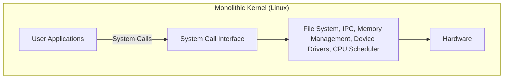
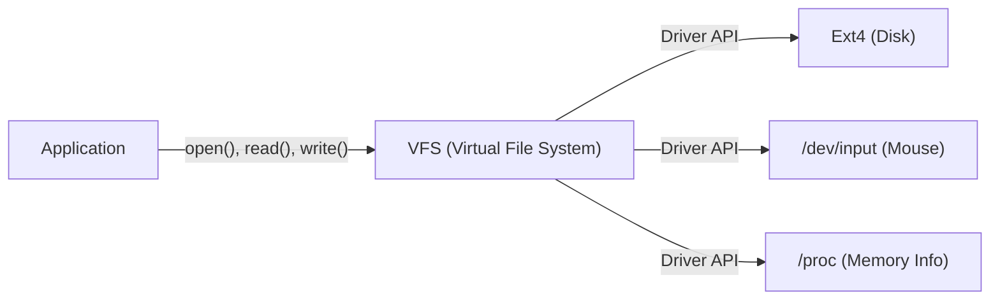

# 序章：一切从一个帖子开始

1991年8月25日，在新闻组 `comp.os.minix` 上，出现了一条低调的帖子。

> "Hello everybody out there using minix - I'm doing a (free) operating system (just a hobby, won't be big and professional like gnu) for 386(486) AT clones."

这篇帖子的作者，正是当时芬兰赫尔辛基大学的学生林纳斯·托瓦兹（Linus Torvalds）。当时，Andrew S. Tanenbaum 教授编写的“MINIX”作为操作系统学习工具被广泛使用，但由于其教育目的，功能受到限制，且许可证也有约束。林纳斯对 MINIX 的设计感到不满，于是为了完全发挥他购买的 Intel 386 处理器的性能，开始编写一个终端模拟器，这最终发展成为一个完整的操作系统（OS）内核。

他当时称之为“只是一个业余爱好（just a hobby）”的项目，在经过30多年的发展后，成长为人类历史上最重要的软件项目之一——“Linux”，它运行着世界上100%的超级计算机、绝大多数的智能手机（Android），以及绝大部分的云基础设施。本文将深入探讨Linux是如何诞生的，以及哪些架构选择决定了它的成功。

# 自由软件的黎明与 GNU 项目

在讲述 Linux 内核的历史时，不能不提到由理查德·斯托曼（Richard Stallman）领导的 GNU 项目。

1983年启动的 GNU 项目的目标是构建一个完全免费、任何人都可以自由使用、修改和重新分发的完整操作系统“GNU（GNU's Not Unix!）”，以对抗专有（闭源且收费）的 UNIX 系统。到 1990 年代初，GNU 项目已经完成了 OS 所需的几乎所有组件，包括 C 编译器（GCC）、Shell（Bash）、编辑器（Emacs）以及基础的核心实用工具集。

然而，唯一缺少的就是系统核心的“内核（GNU Hurd）”。Hurd 采用了先进的微内核架构，但由于其复杂性，开发进展缓慢。

正是在这个绝佳的时机，林纳斯开发的 Linux 内核出现了。GNU 丰富的软件群与实用的 Linux 内核相结合，首次诞生了完全自由且实用的操作系统“GNU/Linux”系统。这次奇迹般的相遇，极大地推动了开源历史的发展。

# 架构的决断：宏内核还是微内核

在操作系统内核的设计中，历史上最著名的争论之一就是“Tanenbaum-Torvalds 争论”。1992 年，MINIX 的作者 Tanenbaum 教授发表了一篇批评 Linux 架构的帖子。其标题是“LINUX is obsolete（Linux 已经过时）”。

## 微内核与宏内核的结构

争论的焦点是内核的设计思想。

**宏内核（Linux 的方式）:**
将 OS 的主要功能（内存管理、进程调度、文件系统、设备驱动等）全部运行在一个巨大的内存空间（内核空间）中的方式。
- **优点:** 组件间通信的开销小，性能极高。
- **缺点:** 一个漏洞（例如设备驱动程序的错误）就有可能导致整个内核崩溃（内核恐慌，Kernel Panic）。

**微内核（MINIX 和 Hurd 的方式）:**
在内核空间中仅保留最基本的功能（IPC、基本调度等），而将文件系统、驱动程序等作为独立的服务进程运行在用户空间的方式。
- **优点:** 即使某个特定驱动崩溃，也不会导致整个 OS 停止，系统的可靠性和模块化程度高。
- **缺点:** 进程间通信（IPC）频繁，容易因上下文切换导致性能下降。

Tanenbaum 主张，未来的操作系统应该向高可靠性的微内核转型，而采用宏内核的 Linux 则是“向 1970 年代 UNIX 的倒退”。然而，林纳斯从实用主义的立场对此进行了反驳。在当时的硬件条件下，微内核的性能损失是不容忽视的，而宏内核运行起来要快得多，也更现实。结果，Linux 压倒性的性能优势，以及后来引入的可加载内核模块（LKM）带来的动态扩展性，证明了宏内核的优越性。

# UNIX 哲学的传承："Everything is a file"

因为 Linux 是作为 UNIX 克隆开发的，所以它继承了强大的“UNIX 哲学”。其中最著名且重要的概念就是“一切皆文件（Everything is a file）”的原则。

在 Linux 中，从硬盘、键盘、鼠标、打印机等硬件设备，到进程信息、网络套接字，所有的资源都被抽象为虚拟的“文件”。

例如，硬盘被处理为 `/dev/sda`，进程信息是 `/proc` 目录下的文件，随机数生成器则是 `/dev/urandom`。因此，开发者只需使用标准的文件读写函数（`open()`, `read()`, `write()`, `close()`），就可以用相同的接口访问完全不同类型的资源。

提供这种强大抽象的就是 **VFS（虚拟文件系统，Virtual File System）**。由于 VFS 层的存在，应用程序完全不需要关心底层的物理设备或文件系统的类型。

# 内核空间与用户空间的严格分离

支撑 Linux 内核稳健性的另一个重要概念，是特权级别的分离。通过利用 CPU 的硬件功能（如 Ring 0 和 Ring 3），将内存空间严格分离为“内核空间”和“用户空间”。

1. **用户空间（User Space）:** 普通应用程序（浏览器、编辑器、数据库等）运行的安全区域。不能直接访问硬件，对内存的非法访问会导致该进程被强制终止，并报出“段错误（Segmentation fault）”。
2. **内核空间（Kernel Space）:** OS 内核运行的特权区域。拥有无限制访问系统所有内存和硬件设备的权限。

当用户空间的程序需要写入文件或进行网络通信时，它不能直接操作硬件。相反，必须通过被称为 **“系统调用（System Call）”** 的特殊接口，向内核“请求”执行这些操作。

当系统调用被触发时，CPU 会进行上下文切换，将特权级别从用户模式提升至内核模式。内核安全地操作硬件后，再次返回到用户模式。这种严格的分离保护了整个系统免受恶意程序或有漏洞的应用程序的破坏，从而实现了稳定的多任务环境。

# 总结：不断进化的巨星

作为林纳斯·托瓦兹“一个小小的业余爱好”而诞生的 Linux，结合了 GNU 的理念，并通过全球成千上万开发者（黑客社区）的贡献，实现了惊人的进化。

比起微内核的理论优势，更注重实用性和性能的架构、通过 VFS 实现的抽象化、内核空间的保护机制等，这些初期的许多决定，至今依然是其根基。在现代，从云容器（Docker/Kubernetes）、AI 超级计算机到物联网设备，没有 Linux 的 IT 基础设施是难以想象的。

Linux 的历史，是卓越的架构设计与开源开发模式相结合时，人类能创造出多么伟大软件的最美例证。
