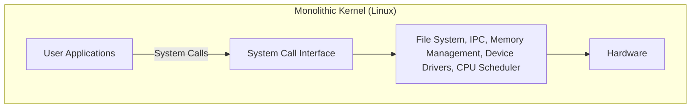
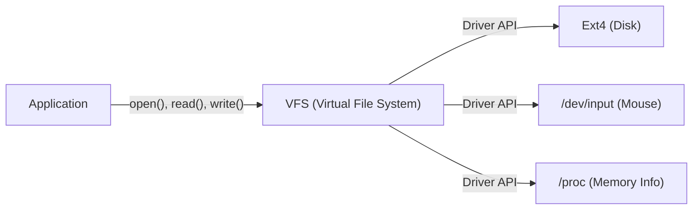

# 序章：一切從一則貼文開始

1991年8月25日，在新聞群組 `comp.os.minix` 上，出現了一則低調的貼文。

> "Hello everybody out there using minix - I'm doing a (free) operating system (just a hobby, won't be big and professional like gnu) for 386(486) AT clones."

這篇貼文的作者，正是當時芬蘭赫爾辛基大學的學生林納斯·托瓦茲（Linus Torvalds）。當時，Andrew S. Tanenbaum 教授編寫的「MINIX」作為作業系統學習工具被廣泛使用，但由於其教育目的，功能受到限制，且授權也有約束。林納斯對 MINIX 的設計感到不滿，於是為了完全發揮他購買的 Intel 386 處理器的效能，開始編寫一個終端機模擬器，這最終發展成為一個完整的作業系統（OS）核心。

他當時稱之為「只是一個業餘愛好（just a hobby）」的專案，在經過30多年的發展後，成長為人類歷史上最重要的軟體專案之一——「Linux」，它運行著世界上100%的超級電腦、絕大多數的智慧型手機（Android），以及絕大部分的雲端基礎設施。本文將深入探討Linux是如何誕生的，以及哪些架構選擇決定了它的成功。

# 自由軟體的黎明與 GNU 專案

在講述 Linux 核心的歷史時，不能不提到由理查·斯托曼（Richard Stallman）領導的 GNU 專案。

1983年啟動的 GNU 專案的目標是建構一個完全免費、任何人都可以自由使用、修改和重新散布的完整作業系統「GNU（GNU's Not Unix!）」，以對抗專有（閉源且收費）的 UNIX 系統。到 1990 年代初，GNU 專案已經完成了 OS 所需的幾乎所有元件，包括 C 編譯器（GCC）、Shell（Bash）、編輯器（Emacs）以及基礎的核心實用工具集。

然而，唯一缺少的就是系統核心的「核心（GNU Hurd）」。Hurd 採用了先進的微核心架構，但由於其複雜性，開發進展緩慢。

正是在這個絕佳的時機，林納斯開發的 Linux 核心出現了。GNU 豐富的軟體群與實用的 Linux 核心相結合，首次誕生了完全自由且實用的作業系統「GNU/Linux」系統。這次奇蹟般的相遇，極大地推動了開源歷史的發展。

# 架構的決斷：單體核心還是微核心

在作業系統核心的設計中，歷史上最著名的爭論之一就是「Tanenbaum-Torvalds 爭論」。1992 年，MINIX 的作者 Tanenbaum 教授發表了一篇批評 Linux 架構的貼文。其標題是「LINUX is obsolete（Linux 已經過時）」。

## 微核心與單體核心的結構

爭論的焦點是核心的設計思想。

**單體核心（Linux 的方式）:**
將 OS 的主要功能（記憶體管理、行程排程、檔案系統、裝置驅動等）全部運行在一個巨大的記憶體空間（核心空間）中的方式。
- **優點:** 元件間通訊的額外負擔小，效能極高。
- **缺點:** 一個漏洞（例如裝置驅動程式的錯誤）就有可能導致整個核心崩潰（核心恐慌，Kernel Panic）。

**微核心（MINIX 和 Hurd 的方式）:**
在核心空間中僅保留最基本的功能（IPC、基本排程等），而將檔案系統、驅動程式等作為獨立的服務行程運行在使用者空間的方式。
- **優點:** 即使某個特定驅動崩潰，也不會導致整個 OS 停止，系統的可靠性和模組化程度高。
- **缺點:** 行程間通訊（IPC）頻繁，容易因上下文交換導致效能下降。

Tanenbaum 主張，未來的作業系統應該向高可靠性的微核心轉型，而採用單體核心的 Linux 則是「向 1970 年代 UNIX 的倒退」。然而，林納斯從實用主義的立場對此進行了反駁。在當時的硬體條件下，微核心的效能損失是不容忽視的，而單體核心運行起來要快得多，也更現實。結果，Linux 壓倒性的效能優勢，以及後來引入的可載入核心模組（LKM）帶來的動態擴充性，證明了單體核心的優越性。

# UNIX 哲學的傳承："Everything is a file"

因為 Linux 是作為 UNIX 複製版開發的，所以它繼承了強大的「UNIX 哲學」。其中最著名且重要的概念就是「一切皆檔案（Everything is a file）」的原則。

在 Linux 中，從硬碟、鍵盤、滑鼠、印表機等硬體設備，到行程資訊、網路通訊端，所有的資源都被抽象為虛擬的「檔案」。

例如，硬碟被處理為 `/dev/sda`，行程資訊是 `/proc` 目錄下的檔案，亂數產生器則是 `/dev/urandom`。因此，開發者只需使用標準的檔案讀寫函式（`open()`, `read()`, `write()`, `close()`），就可以用相同的介面存取完全不同類型的資源。

提供這種強大抽象的就是 **VFS（虛擬檔案系統，Virtual File System）**。由於 VFS 層的存在，應用程式完全不需要關心底層的實體設備或檔案系統的類型。

# 核心空間與使用者空間的嚴格分離

支撐 Linux 核心穩健性的另一個重要概念，是特權級別的分離。透過利用 CPU 的硬體功能（如 Ring 0 和 Ring 3），將記憶體空間嚴格分離為「核心空間」和「使用者空間」。

1. **使用者空間（User Space）:** 普通應用程式（瀏覽器、編輯器、資料庫等）運行的安全區域。不能直接存取硬體，對記憶體的非法存取會導致該行程被強制終止，並報出「記憶體區段錯誤（Segmentation fault）」。
2. **核心空間（Kernel Space）:** OS 核心運行的特權區域。擁有無限制存取系統所有記憶體和硬體設備的權限。

當使用者空間的程式需要寫入檔案或進行網路通訊時，它不能直接操作硬體。相反，必須透過被稱為 **「系統呼叫（System Call）」** 的特殊介面，向核心「請求」執行這些操作。

當系統呼叫被觸發時，CPU 會進行上下文交換，將特權級別從使用者模式提升至核心模式。核心安全地操作硬體後，再次返回到使用者模式。這種嚴格的分離保護了整個系統免受惡意程式或有漏洞的應用程式的破壞，從而實現了穩定的多工環境。

# 總結：不斷進化的巨星

作為林納斯·托瓦茲「一個小小的業餘愛好」而誕生的 Linux，結合了 GNU 的理念，並透過全球成千上萬開發者（駭客社群）的貢獻，實現了驚人的進化。

比起微核心的理論優勢，更注重實用性和效能的架構、透過 VFS 實現的抽象化、核心空間的保護機制等，這些初期的許多決定，至今依然是其根基。在現代，從雲端容器（Docker/Kubernetes）、AI 超級電腦到物聯網設備，沒有 Linux 的 IT 基礎設施是難以想像的。

Linux 的歷史，是卓越的架構設計與開源開發模式相結合時，人類能創造出多麼偉大軟體的最美例證。
