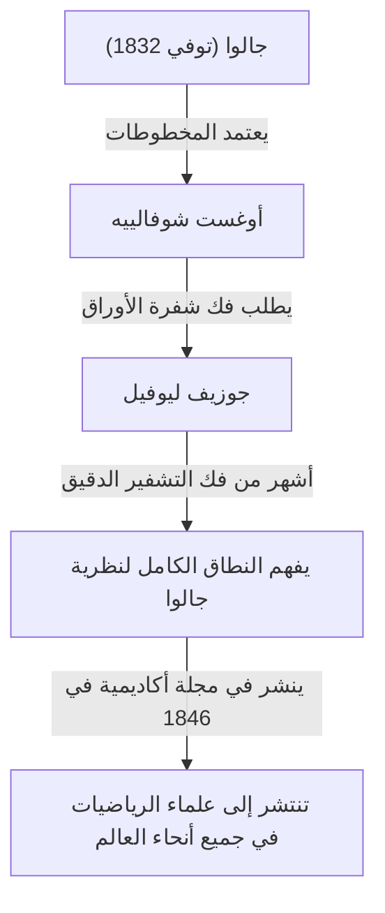

## مقدمة

في تاريخ الرياضيات، كان القرن التاسع عشر فترة حاسمة حيث تطور التحليل والجبر إلى شكلهما الحديث. وفي قلب هذه الحركة كان عالم الرياضيات الفرنسي **جوزيف ليوفيل** (1809-1882). أسس نظريات أساسية في التحليل المركب وكان أول شخص في تاريخ البشرية يثبت بشكل ملموس وجود "الأعداد المتسامية". كما أنه معروف جيدًا بأنه المتبرع الذي قام بفك شفرة ونشر المخطوطات الصعبة لإيفاريست جالوا. في هذا المقال، سنتعمق في حياة ليوفيل المضطربة وفي **إنجازاته الرياضية** العديدة.

## نشأته وتعليمه

ولد جوزيف ليوفيل في 24 مارس 1809، في سان أومير، با دو كاليه، فرنسا. كان والده رجل عسكري يخدم في جيش نابليون. خلال طفولته المبكرة، تنقل من مكان إلى آخر اتباعًا لمهام والده، لكنه استقر في النهاية في باريس، حيث أتيحت له الفرصة لتلقي تعليم ممتاز.

في عام 1825، التحق بـ **المدرسة المتعددة التكنولوجية** (École Polytechnique) المرموقة، حيث تعلم على يد أبرز علماء الرياضيات في ذلك العصر. ثم تقدم لاحقًا إلى **المدرسة الوطنية للجسور والطرق** (École des Ponts et Chaussées) لدراسة الهندسة المدنية، لكن قلبه كان دائمًا معلقًا بالرياضيات البحتة. في النهاية، تخلى عن مسيرته المهنية كمهندس وعقد العزم بحزم على متابعة طريق الرياضيات.

## إنقاذ مخطوطات جالوا

عند الحديث عن ليوفيل، لا يمكن للمرء أن يغفل قصة كيف أنقذ مخطوطات العبقري الشاب **إيفاريست جالوا**. فقد جالوا حياته في مبارزة في سن مبكرة تبلغ 20 عامًا، ولكن قبل وفاته مباشرة، عهد باكتشافاته الرياضية إلى صديقه أوغست شوفالييه.

كان ليوفيل هو من سلط الضوء على نظرية جالوا، التي تم تجاهلها وإساءة فهمها لفترة طويلة. في عام 1843، درس أوراق جالوا بدقة وأدرك أنها تحتوي على اكتشافات مهمة للغاية فيما يتعلق بقابلية حل المعادلات الجبرية. في عام 1846، نشر ليوفيل أوراق جالوا في المجلة الأكاديمية التي أسسها، *Journal de Mathématiques Pures et Appliquées*، وبذلك قدمها للعالم.

## الإنجازات الرياضية

### 1. مبرهنة ليوفيل في التحليل المركب

أعظم مساهمة لليوفيل في مجال التحليل المركب هي **مبرهنة ليوفيل**. تنص هذه المبرهنة على أن "أي دالة تكون كاملة (هولومورفية على المستوى المركب بأكمله) ومحدودة يجب أن تكون دالة ثابتة".

يُعبر عنها بدقة باستخدام الصيغ الرياضية، إذا كانت الدالة $f(z)$ كاملة ويوجد رقم حقيقي موجب $M$ بحيث يكون $|f(z)| \leq M$ لجميع $z \in \mathbb{C}$، فإن $f(z)$ هو ثابت.

$$
\text{إذا كانت } f(z) \text{ دالة كاملة ومحدودة، إذن } f(z) = C \text{ (ثابت).}
$$

هذه النظرية قوية بشكل مذهل وتُستخدم لتقديم براهين موجزة للغاية للنظرية الأساسية في الجبر (والتي تنص على أن كل كثيرة حدود غير ثابتة ذات متغير واحد بمعاملات مركبة لها جذر مركب واحد على الأقل).

### 2. اكتشاف الأعداد المتسامية وأعداد ليوفيل

واحدة من المشاكل الكبرى غير المحلولة في الرياضيات حتى النصف الأول من القرن التاسع عشر كانت: "هل الأعداد المتسامية (الأعداد المركبة التي ليست جذورًا لأي معادلة حدودية غير صفرية ذات معاملات كسرية) موجودة؟" في عام 1844، أثبت ليوفيل أن الأعداد الحقيقية التي تستوفي شروطًا معينة هي أعداد متسامية، وبالتالي بنى أعدادًا متسامية محددة لأول مرة في تاريخ البشرية. تُعرف هذه باسم **أعداد ليوفيل**.

يُعرّف عدد ليوفيل بأنه عدد غير نسبي يمكن "تقريبه بشكل جيد جدًا" بواسطة أعداد نسبية. يُعرّف ثابت ليوفيل التمثيلي $L$ على النحو التالي:

$$
L = \sum_{n=1}^{\infty} 10^{-n!} = 0.110001000000000000000001000\dots
$$

في هذا العدد، يوجد $1$ في المنازل العشرية المقابلة لـ $1!$, $2!$, $3!$, $4!$ $\dots$، ويوجد $0$ في كل مكان آخر. أثبت ليوفيل **مبرهنة تقريب ليوفيل**، والتي تنص على أنه "هناك حد للدقة التي يمكن بها تقريب أي عدد غير نسبي جبري بواسطة الأعداد النسبية". ثم أثبت بعد ذلك أن العدد $L$ أعلاه، والذي يتجاوز هذا الحد، لا يمكن أن يكون عددًا جبريًا (وبالتالي فهو عدد متسامٍ).

### 3. نظرية شتورم-ليوفيل

قام ليوفيل، بالاشتراك مع عالم الرياضيات المعاصر له تشارلز فرانسوا شتورم، ببناء النظرية العامة المتعلقة بمشاكل القيمة الحدية للمعادلات التفاضلية العادية الخطية من الرتبة الثانية. يُعرف هذا باسم **نظرية شتورم-ليوفيل**.

توفر هذه النظرية إطارًا قويًا للتعامل مع مشاكل القيم الذاتية التي تنشأ عند حل المعادلات التفاضلية الجزئية، مثل معادلة الحرارة ومعادلة الموجة، باستخدام طريقة فصل المتغيرات. تُكتب معادلة شتورم-ليوفيل القياسية على النحو التالي:

$$
-\frac{d}{dx} \left( p(x) \frac{dy}{dx} \right) + q(x)y = \lambda w(x)y
$$

هنا، $\lambda$ هي القيمة الذاتية و $w(x)$ هي دالة الوزن. أثبتت نظريتهم أن الدوال الذاتية المقابلة للقيم الذاتية المختلفة تمتلك تعامدًا، مما يضع الأساس للتحليل الدالي في ميكانيكا الكم الحديثة والرياضيات التطبيقية.

### 4. مساهمات أخرى

يمتلك ليوفيل نظريات تحمل اسمه في مجموعة واسعة من المجالات. ويشمل ذلك **مبرهنة ليوفيل في نظرية جالوا التفاضلية**، والتي تحدد ما إذا كان يمكن التعبير عن المشتق العكسي لدالة أولية مرة أخرى كدالة أولية، ونظريته في الأنظمة الديناميكية التي توضح حفظ حجم مساحة الطور.

## مساهماته كمربي ومحرر

ساهم ليوفيل بشكل كبير ليس فقط من خلال أبحاثه الخاصة ولكن أيضًا في تطوير المجتمع الرياضي. في عام 1836، أسس *Journal de Mathématiques Pures et Appliquées*. غالبًا ما يشار إليها ببساطة باسم "مجلة ليوفيل"، وهي تستمر في النشر حتى اليوم كواحدة من المجلات الرياضية الفرنسية الرائدة.

علاوة على ذلك، عمل كأستاذ في المدرسة المتعددة التكنولوجية وكوليج دو فرانس، وقام برعاية العديد من علماء الرياضيات الشباب. كانت محاضراته معروفة بكونها صارمة بشكل لا يصدق لكنها عاطفية، وتلهم طلابه بعمق.

## حياته اللاحقة وإرثه

كرس ليوفيل حياته كلها للرياضيات. كما شارك بشكل مؤقت في الأنشطة السياسية، حيث تم انتخابه كعضو في الجمعية التأسيسية خلال الثورة الفرنسية عام 1848، لكنه عاد إلى العالم الأكاديمي بعد خسارته في انتخابات لاحقة.

في 8 سبتمبر 1882، توفي جوزيف ليوفيل في باريس. النظريات والمفاهيم التي تركها وراءه أصبحت ضرورية ليس فقط للرياضيات البحتة، ولكن لتقدم الفيزياء والهندسة. على وجه الخصوص، لولا أنه أنقذ مخطوطات جالوا، لكان تطور الجبر الحديث قد تأخر على الأرجح لعقود.

لا تزال مساهماته تُكرم حتى يومنا هذا، حيث حُفر اسمه في التاريخ، بما في ذلك فوهة بركانية على القمر سميت "ليوفيل" تكريماً له.
