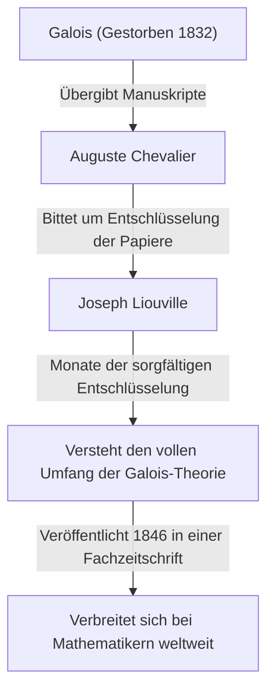

## Einführung

In der Geschichte der Mathematik war das 19. Jahrhundert eine entscheidende Zeit, in der sich Analysis und Algebra in ihre moderne Form entwickelten. Im Zentrum dieser Bewegung stand der französische Mathematiker **Joseph [Liouville](https://kenji.blog/de/p/liouville/)** (1809–1882). Er etablierte grundlegende Theoreme in der komplexen Analysis und war der erste Mensch in der Geschichte, der die Existenz „transzendenter Zahlen“ konkret bewies. Er ist auch bekannt als der Wohltäter, der die schwierigen Manuskripte von [Évariste Galois](/de/p/galois/) entschlüsselte und veröffentlichte. In diesem Artikel werden wir tief in das turbulente Leben von [Liouville](https://kenji.blog/de/p/liouville/) und seine zahlreichen **mathematischen Errungenschaften** eintauchen.

## Frühes Leben und Ausbildung

Joseph [Liouville](https://kenji.blog/de/p/liouville/) wurde am 24. März 1809 in Saint-Omer, Pas-de-Calais, Frankreich, geboren. Sein Vater war ein Militär in der Armee von Napoleon. In seiner frühen Kindheit zog er den Stationierungen seines Vaters folgend von Ort zu Ort, ließ sich aber schließlich in Paris nieder, wo er die Möglichkeit hatte, eine hervorragende Ausbildung zu erhalten.

Im Jahr 1825 trat er in die renommierte **École Polytechnique** ein, wo er von den prominentesten Mathematikern seiner Zeit lernte. Später wechselte er an die **École des Ponts et Chaussées**, um Bauingenieurwesen zu studieren, aber sein Herz schlug immer für die reine Mathematik. Letztendlich gab er seine Karriere als Ingenieur auf und beschloss fest, den Weg der Mathematik zu verfolgen.

## Die Rettung der Manuskripte von [Galois](https://kenji.blog/de/p/galois/)

Wenn man über [Liouville](https://kenji.blog/de/p/liouville/) spricht, darf man die Geschichte nicht auslassen, wie er die Manuskripte des jungen Genies **[Évariste Galois](/de/p/galois/)** rettete. [Galois](https://kenji.blog/de/p/galois/) verlor sein Leben in einem Duell im jungen Alter von 20 Jahren, aber kurz vor seinem Tod vertraute er seine mathematischen Entdeckungen seinem Freund Auguste Chevalier an.

Es war [Liouville](https://kenji.blog/de/p/liouville/), der Licht auf die Theorie von Galois warf, die lange Zeit ignoriert und missverstanden worden war. Im Jahr 1843 studierte er Galois' Papiere gründlich und erkannte, dass sie zutiefst wichtige Entdeckungen bezüglich der Lösbarkeit von algebraischen Gleichungen enthielten. 1846 veröffentlichte Liouville [Galois](https://kenji.blog/de/p/galois/)' Papiere in der von ihm gegründeten Fachzeitschrift *Journal de Mathématiques Pures et Appliquées* und präsentierte sie so der Welt.

## Mathematische Errungenschaften

### 1. Der Satz von [Liouville](https://kenji.blog/de/p/liouville/) in der komplexen Analysis

[Liouville](https://kenji.blog/de/p/liouville/)s größter Beitrag auf dem Gebiet der komplexen Analysis ist der **Satz von [Liouville](https://kenji.blog/de/p/liouville/)**. Dieser Satz besagt, dass „jede Funktion, die ganz (holomorph über die gesamte komplexe Ebene) und beschränkt ist, eine konstante Funktion sein muss.“

Streng mit mathematischen Formeln ausgedrückt: Wenn eine Funktion $f(z)$ ganz ist und eine positive reelle Zahl $M$ existiert, so dass $|f(z)| \leq M$ für alle $z \in \mathbb{C}$ gilt, dann ist $f(z)$ eine Konstante.

$$
\text{Wenn } f(z) \text{ eine ganze und beschränkte Funktion ist, dann ist } f(z) = C \text{ (konstant).}
$$

Dieser Satz ist erstaunlich mächtig und wird verwendet, um extrem prägnante Beweise für den [Fundamentalsatz der Algebra](https://kenji.blog/de/p/fundamental-theorem-of-algebra/) zu liefern (welcher besagt, dass jedes nichtkonstante Polynom mit komplexen Koeffizienten mindestens eine komplexe Wurzel hat).

### 2. Entdeckung transzendenter Zahlen und der [Liouville](https://kenji.blog/de/p/liouville/)-Zahlen

Eines der großen ungelösten Probleme der Mathematik bis in die erste Hälfte des 19. Jahrhunderts war: „Gibt es transzendente Zahlen (komplexe Zahlen, die nicht Wurzeln einer Polynomgleichung mit rationalen Koeffizienten sind)?“ 1844 bewies [Liouville](https://kenji.blog/de/p/liouville/), dass reelle Zahlen, die bestimmte Bedingungen erfüllen, transzendent sind, und konstruierte so zum ersten Mal in der Geschichte spezifische transzendente Zahlen. Diese sind als **[Liouville](https://kenji.blog/de/p/liouville/)-Zahlen** bekannt.

Eine [Liouville](https://kenji.blog/de/p/liouville/)-Zahl ist als irrationale Zahl definiert, die durch rationale Zahlen „sehr gut approximiert“ werden kann. Die repräsentative [Liouville](https://kenji.blog/de/p/liouville/)-Konstante $L$ ist wie folgt definiert:

$$
L = \sum_{n=1}^{\infty} 10^{-n!} = 0.110001000000000000000001000\dots
$$

In dieser Zahl steht eine $1$ an den Dezimalstellen, die $1!$, $2!$, $3!$, $4!$ $\dots$ entsprechen, und überall sonst eine $0$. [Liouville](https://kenji.blog/de/p/liouville/) bewies den **[Liouville](https://kenji.blog/de/p/liouville/)schen Approximationssatz**, der besagt, dass „es eine Grenze für die Genauigkeit gibt, mit der eine algebraische irrationale Zahl durch rationale Zahlen approximiert werden kann“. Er zeigte dann, dass die obige Zahl $L$, die diese Grenze überschreitet, keine algebraische Zahl sein kann (und somit eine transzendente Zahl ist).

### 3. Sturm-[Liouville](https://kenji.blog/de/p/liouville/)-Theorie

Zusammen mit seinem zeitgenössischen Mathematiker Charles-François Sturm entwickelte [Liouville](https://kenji.blog/de/p/liouville/) die allgemeine Theorie zu Randwertproblemen für lineare gewöhnliche Differentialgleichungen zweiter Ordnung. Dies ist als **Sturm-[Liouville](https://kenji.blog/de/p/liouville/)-Theorie** bekannt.

Diese Theorie bietet einen leistungsstarken Rahmen zur Behandlung von Eigenwertproblemen, die beim Lösen partieller Differentialgleichungen wie der Wärmeleitungsgleichung und der Wellengleichung mit der Methode der Variablentrennung auftreten. Eine Standard-Sturm-[Liouville](https://kenji.blog/de/p/liouville/)-Gleichung wird wie folgt geschrieben:

$$
-\frac{d}{dx} \left( p(x) \frac{dy}{dx} \right) + q(x)y = \lambda w(x)y
$$

Hierbei ist $\lambda$ der Eigenwert und $w(x)$ die Gewichtsfunktion. Ihre Theorie bewies, dass Eigenfunktionen, die zu verschiedenen Eigenwerten gehören, Orthogonalität besitzen, und legte damit den Grundstein für die Funktionalanalysis in der modernen Quantenmechanik und angewandten Mathematik.

### 4. Weitere Beiträge

[Liouville](https://kenji.blog/de/p/liouville/) hat in den unterschiedlichsten Bereichen Sätze, die seinen Namen tragen. Dazu gehören der **Satz von Liouville in der differentiellen [Galois](https://kenji.blog/de/p/galois/)-Theorie**, der bestimmt, ob die Stammfunktion einer elementaren Funktion wieder als elementare Funktion ausgedrückt werden kann, und sein Satz in dynamischen Systemen, der die Erhaltung des Phasenraumvolumens zeigt.

## Beiträge als Pädagoge und Herausgeber

[Liouville](https://kenji.blog/de/p/liouville/) leistete nicht nur durch seine eigene Forschung, sondern auch durch die Entwicklung der mathematischen Gemeinschaft bedeutende Beiträge. 1836 gründete er das *Journal de Mathématiques Pures et Appliquées*. Oft einfach als „Journal de [Liouville](https://kenji.blog/de/p/liouville/)“ bezeichnet, wird es noch heute als eines der führenden französischen mathematischen Journale veröffentlicht.

Darüber hinaus war er als Professor an der École Polytechnique und am Collège de France tätig und förderte viele junge Mathematiker. Seine Vorlesungen waren dafür bekannt, unglaublich streng und dennoch leidenschaftlich zu sein, was seine Studenten zutiefst inspirierte.

## Späteres Leben und Vermächtnis

[Liouville](https://kenji.blog/de/p/liouville/) widmete sein ganzes Leben der Mathematik. Er war auch vorübergehend politisch aktiv und wurde während der Französischen Revolution 1848 als Mitglied der verfassungsgebenden Versammlung gewählt, kehrte aber nach einer verlorenen späteren Wahl in die akademische Welt zurück.

Am 8. September 1882 verstarb Joseph [Liouville](https://kenji.blog/de/p/liouville/) in Paris. Die Theoreme und Konzepte, die er hinterließ, sind nicht nur für die reine Mathematik, sondern auch für den Fortschritt der Physik und Ingenieurwissenschaften unverzichtbar geworden. Insbesondere wenn er [Galois](https://kenji.blog/de/p/galois/)' Manuskripte nicht gerettet hätte, wäre die Entwicklung der modernen Algebra wahrscheinlich um Jahrzehnte verzögert worden.

Seine Beiträge werden bis heute geehrt, und sein Name ist in die Geschichte eingraviert, unter anderem durch einen Mondkrater namens „[Liouville](https://kenji.blog/de/p/liouville/)“, der ihm zu Ehren benannt wurde.

