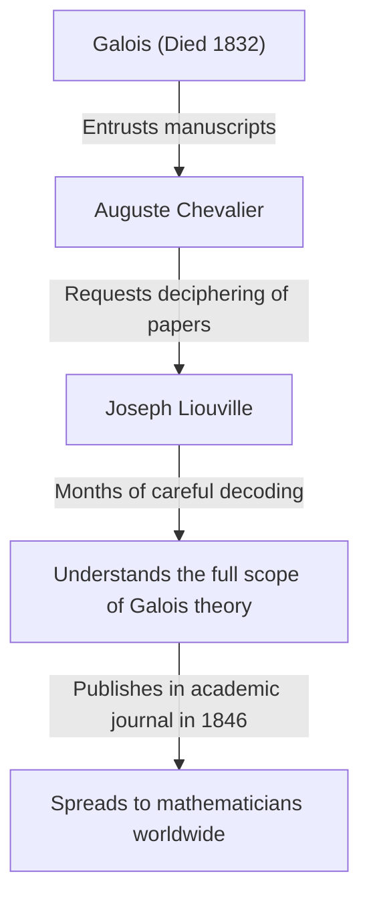

## Introduction

In the history of mathematics, the 19th century was a crucial period when analysis and algebra developed into their modern forms. At the center of this movement was the French mathematician **Joseph [Liouville](https://kenji.blog/en/p/liouville/)** (1809–1882). He established foundational theorems in complex analysis and was the first person in human history to concretely prove the existence of "transcendental numbers." He is also well known as the benefactor who deciphered and published the challenging manuscripts of Évariste Galois. In this article, we will delve deeply into [Liouville](https://kenji.blog/en/p/liouville/)'s turbulent life and his numerous **mathematical achievements**.

## Early Life and Education

Joseph [Liouville](https://kenji.blog/en/p/liouville/) was born on March 24, 1809, in Saint-Omer, Pas-de-Calais, France. His father was a military man serving in Napoleon's army. During his early childhood, he moved from place to place following his father's assignments, but eventually settled in Paris, where he had the opportunity to receive an excellent education.

In 1825, he entered the prestigious **École Polytechnique**, where he learned from the most prominent mathematicians of the era. He later advanced to the **École des Ponts et Chaussées** to study civil engineering, but his heart was always set on pure mathematics. Ultimately, he abandoned his career as an engineer and firmly resolved to pursue the path of mathematics.

## Rescuing [Galois](https://kenji.blog/en/p/galois/)'s Manuscripts

When discussing [Liouville](https://kenji.blog/en/p/liouville/), one cannot omit the story of how he saved the manuscripts of the young genius **Évariste Galois**. [Galois](https://kenji.blog/en/p/galois/) lost his life in a duel at the young age of 20, but just before his death, he entrusted his mathematical discoveries to his friend Auguste Chevalier.

It was [Liouville](https://kenji.blog/en/p/liouville/) who shed light on Galois's theory, which had been ignored and misunderstood for a long time. In 1843, he thoroughly studied Galois's papers and realized they contained profoundly important discoveries regarding the solvability of algebraic equations. In 1846, Liouville published [Galois](https://kenji.blog/en/p/galois/)'s papers in the academic journal he had founded, the *Journal de Mathématiques Pures et Appliquées*, thereby presenting them to the world.

## Mathematical Achievements

### 1. [Liouville](https://kenji.blog/en/p/liouville/)'s Theorem in Complex Analysis

[Liouville](https://kenji.blog/en/p/liouville/)'s greatest contribution in the field of complex analysis is **[Liouville](https://kenji.blog/en/p/liouville/)'s Theorem**. This theorem states that "any function that is entire (holomorphic over the whole complex plane) and bounded must be a constant function."

Expressed rigorously using mathematical formulas, if a function $f(z)$ is entire and there exists a positive real number $M$ such that $|f(z)| \leq M$ for all $z \in \mathbb{C}$, then $f(z)$ is a constant.

$$
\text{If } f(z) \text{ is an entire and bounded function, then } f(z) = C \text{ (constant).}
$$

This theorem is astonishingly powerful and is used to provide extremely concise proofs for the [Fundamental Theorem of Algebra](https://kenji.blog/en/p/fundamental-theorem-of-algebra/) (which states that every non-constant single-variable polynomial with complex coefficients has at least one complex root).

### 2. Discovery of Transcendental Numbers and [Liouville](https://kenji.blog/en/p/liouville/) Numbers

One of the major unsolved problems in mathematics up to the first half of the 19th century was: "Do transcendental numbers (complex numbers that are not roots of any non-zero polynomial equation with rational coefficients) exist?" In 1844, [Liouville](https://kenji.blog/en/p/liouville/) proved that real numbers satisfying certain conditions are transcendental, thus constructing specific transcendental numbers for the first time in human history. These are known as **[Liouville](https://kenji.blog/en/p/liouville/) numbers**.

A [Liouville](https://kenji.blog/en/p/liouville/) number is defined as an irrational number that can be "very well approximated" by rational numbers. The representative [Liouville](https://kenji.blog/en/p/liouville/) constant $L$ is defined as follows:

$$
L = \sum_{n=1}^{\infty} 10^{-n!} = 0.110001000000000000000001000\dots
$$

In this number, there is a $1$ at the decimal places corresponding to $1!$, $2!$, $3!$, $4!$ $\dots$, and a $0$ everywhere else. [Liouville](https://kenji.blog/en/p/liouville/) proved the **[Liouville](https://kenji.blog/en/p/liouville/) approximation theorem**, which states that "there is a limit to the accuracy with which any algebraic irrational number can be approximated by rational numbers." He then demonstrated that the number $L$ above, which exceeds this limit, cannot be an algebraic number (and is therefore a transcendental number).

### 3. Sturm-[Liouville](https://kenji.blog/en/p/liouville/) Theory

Together with his contemporary mathematician Charles-François Sturm, [Liouville](https://kenji.blog/en/p/liouville/) built the general theory regarding boundary value problems for second-order linear ordinary differential equations. This is known as the **Sturm-[Liouville](https://kenji.blog/en/p/liouville/) theory**.

This theory provides a powerful framework for handling eigenvalue problems that arise when solving partial differential equations, such as the heat equation and the wave equation, using the method of separation of variables. A standard Sturm-[Liouville](https://kenji.blog/en/p/liouville/) equation is written as follows:

$$
-\frac{d}{dx} \left( p(x) \frac{dy}{dx} \right) + q(x)y = \lambda w(x)y
$$

Here, $\lambda$ is the eigenvalue and $w(x)$ is the weight function. Their theory proved that eigenfunctions corresponding to different eigenvalues possess orthogonality, thereby laying the foundation for functional analysis in modern quantum mechanics and applied mathematics.

### 4. Other Contributions

[Liouville](https://kenji.blog/en/p/liouville/) has theorems bearing his name across a wide variety of fields. These include **Liouville's theorem in differential [Galois theory](https://kenji.blog/en/p/galois-theory/)**, which determines whether the antiderivative of an elementary function can again be expressed as an elementary function, and his theorem in dynamical systems showing the conservation of phase-space volume.

## Contributions as an Educator and Editor

[Liouville](https://kenji.blog/en/p/liouville/) contributed significantly not only through his own research but also to the development of the mathematical community. In 1836, he founded the *Journal de Mathématiques Pures et Appliquées*. Often referred to simply as the "Journal de [Liouville](https://kenji.blog/en/p/liouville/)," it continues to be published today as a premier French mathematical journal.

Furthermore, he served as a professor at the École Polytechnique and the Collège de France, nurturing many young mathematicians. His lectures were known to be incredibly rigorous yet passionate, deeply inspiring his students.

## Later Life and Legacy

[Liouville](https://kenji.blog/en/p/liouville/) dedicated his entire life to mathematics. He was also temporarily involved in political activities, being elected as a member of the Constituent Assembly during the French Revolution of 1848, but he returned to the academic world after losing a subsequent election.

On September 8, 1882, Joseph [Liouville](https://kenji.blog/en/p/liouville/) passed away in Paris. The theorems and concepts he left behind have become essential not just for pure mathematics, but for the advancement of physics and engineering. In particular, had he not saved [Galois](https://kenji.blog/en/p/galois/)'s manuscripts, the development of modern algebra would likely have been delayed by decades.

His contributions continue to be honored to this day, with his name engraved in history, including a crater on the moon named "[Liouville](https://kenji.blog/en/p/liouville/)" in his honor.

