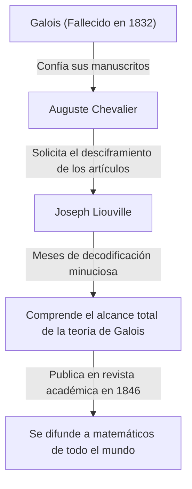

## Introducción

En la historia de las matemáticas, el siglo XIX fue un período crucial en el que el análisis y el álgebra se desarrollaron hasta alcanzar su forma moderna. En el centro de este movimiento se encontraba el matemático francés **Joseph Liouville** (1809–1882). Estableció teoremas fundamentales en el análisis complejo y fue la primera persona en la historia humana en demostrar concretamente la existencia de los "números trascendentes". También es bien conocido como el benefactor que descifró y publicó los desafiantes manuscritos de [Évariste Galois](https://kenji.blog/p/galois/). En este artículo, profundizaremos en la turbulenta vida de Liouville y en sus numerosos **logros matemáticos**.

## Primeros Años y Educación

Joseph Liouville nació el 24 de marzo de 1809 en Saint-Omer, Pas-de-Calais, Francia. Su padre era un militar que servía en el ejército de Napoleón. Durante su primera infancia, se mudó de un lugar a otro siguiendo las asignaciones de su padre, pero finalmente se estableció en París, donde tuvo la oportunidad de recibir una excelente educación.

En 1825, ingresó en la prestigiosa **École Polytechnique**, donde aprendió de los matemáticos más destacados de la época. Posteriormente avanzó a la **École des Ponts et Chaussées** para estudiar ingeniería civil, pero su corazón siempre estuvo en las matemáticas puras. Finalmente, abandonó su carrera como ingeniero y se resolvió firmemente a seguir el camino de las matemáticas.

## El Rescate de los Manuscritos de Galois

Al hablar de Liouville, no se puede omitir la historia de cómo salvó los manuscritos del joven genio **[Évariste Galois](https://kenji.blog/p/galois/)**. Galois perdió la vida en un duelo a la temprana edad de 20 años, pero justo antes de su muerte, confió sus descubrimientos matemáticos a su amigo Auguste Chevalier.

Fue Liouville quien arrojó luz sobre la teoría de Galois, que había sido ignorada e incomprendida durante mucho tiempo. En 1843, estudió exhaustivamente los artículos de Galois y se dio cuenta de que contenían descubrimientos profundamente importantes con respecto a la solubilidad de las ecuaciones algebraicas. En 1846, Liouville publicó los artículos de Galois en la revista académica que él mismo había fundado, el *Journal de Mathématiques Pures et Appliquées*, presentándolos así al mundo.

## Logros Matemáticos

### 1. El Teorema de Liouville en Análisis Complejo

La mayor contribución de Liouville en el campo del análisis complejo es el **Teorema de Liouville**. Este teorema establece que "toda función entera (holomorfa en todo el plano complejo) y acotada debe ser una función constante".

Expresado rigurosamente utilizando fórmulas matemáticas, si una función $f(z)$ es entera y existe un número real positivo $M$ tal que $|f(z)| \leq M$ para todo $z \in \mathbb{C}$, entonces $f(z)$ es una constante.

$$
\text{Si } f(z) \text{ es una función entera y acotada, entonces } f(z) = C \text{ (constante).}
$$

Este teorema es asombrosamente poderoso y se utiliza para proporcionar demostraciones extremadamente concisas del [Teorema Fundamental del Álgebra](https://kenji.blog/p/fundamental-theorem-of-algebra/) (que establece que todo polinomio de una sola variable no constante con coeficientes complejos tiene al menos una raíz compleja).

### 2. Descubrimiento de los Números Trascendentes y los Números de Liouville

Uno de los principales problemas no resueltos en matemáticas hasta la primera mitad del siglo XIX era: "¿Existen los números trascendentes (números complejos que no son raíces de ninguna ecuación polinómica no nula con coeficientes racionales)?". En 1844, Liouville demostró que los números reales que satisfacen ciertas condiciones son trascendentes, construyendo así números trascendentes específicos por primera vez en la historia humana. Estos se conocen como **números de Liouville**.

Un número de Liouville se define como un número irracional que puede ser "muy bien aproximado" por números racionales. La constante de Liouville representativa $L$ se define de la siguiente manera:

$$
L = \sum_{n=1}^{\infty} 10^{-n!} = 0.110001000000000000000001000\dots
$$

En este número, hay un $1$ en los lugares decimales correspondientes a $1!$, $2!$, $3!$, $4!$ $\dots$, y un $0$ en todos los demás lugares. Liouville demostró el **teorema de aproximación de Liouville**, que establece que "hay un límite en la precisión con la que cualquier número irracional algebraico puede ser aproximado por números racionales". Luego demostró que el número $L$ anterior, que excede este límite, no puede ser un número algebraico (y por lo tanto es un número trascendente).

### 3. Teoría de Sturm-Liouville

Junto con el matemático contemporáneo Charles-François Sturm, Liouville construyó la teoría general con respecto a los problemas de valor límite para ecuaciones diferenciales ordinarias lineales de segundo orden. Esto se conoce como la **teoría de Sturm-Liouville**.

Esta teoría proporciona un marco poderoso para manejar los problemas de autovalores que surgen al resolver ecuaciones diferenciales parciales, como la ecuación del calor y la ecuación de onda, utilizando el método de separación de variables. Una ecuación de Sturm-Liouville estándar se escribe de la siguiente manera:

$$
-\frac{d}{dx} \left( p(x) \frac{dy}{dx} \right) + q(x)y = \lambda w(x)y
$$

Aquí, $\lambda$ es el autovalor y $w(x)$ es la función de peso. Su teoría demostró que las autofunciones correspondientes a diferentes autovalores poseen ortogonalidad, sentando así las bases para el análisis funcional en la mecánica cuántica moderna y las matemáticas aplicadas.

### 4. Otras Contribuciones

Liouville tiene teoremas que llevan su nombre en una amplia variedad de campos. Estos incluyen el **teorema de Liouville en la teoría de Galois diferencial**, que determina si la antiderivada de una función elemental puede volver a expresarse como una función elemental, y su teorema en sistemas dinámicos que muestra la conservación del volumen en el espacio de fase.

## Contribuciones como Educador y Editor

Liouville contribuyó significativamente no solo a través de su propia investigación sino también al desarrollo de la comunidad matemática. En 1836, fundó el *Journal de Mathématiques Pures et Appliquées*. A menudo referido simplemente como el "Journal de Liouville", continúa publicándose hoy en día como una de las principales revistas matemáticas francesas.

Además, se desempeñó como profesor en la École Polytechnique y el Collège de France, nutriendo a muchos jóvenes matemáticos. Se sabía que sus conferencias eran increíblemente rigurosas pero apasionadas, inspirando profundamente a sus estudiantes.

## Vida Posterior y Legado

Liouville dedicó toda su vida a las matemáticas. También se involucró temporalmente en actividades políticas, siendo elegido como miembro de la Asamblea Constituyente durante la Revolución Francesa de 1848, pero regresó al mundo académico tras perder una elección posterior.

El 8 de septiembre de 1882, Joseph Liouville falleció en París. Los teoremas y conceptos que dejó atrás se han vuelto esenciales no solo para las matemáticas puras, sino también para el avance de la física y la ingeniería. En particular, si no hubiera salvado los manuscritos de Galois, el desarrollo del álgebra moderna probablemente se habría retrasado décadas.

Sus contribuciones continúan siendo honradas hasta el día de hoy, con su nombre grabado en la historia, incluido un cráter en la luna llamado "Liouville" en su honor.
