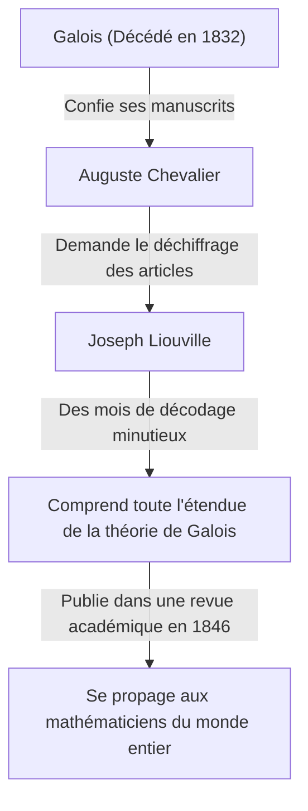

## Introduction

Dans l'histoire des mathématiques, le 19e siècle fut une période cruciale où l'analyse et l'algèbre se sont développées pour prendre leur forme moderne. Au centre de ce mouvement se trouvait le mathématicien français **Joseph Liouville** (1809–1882). Il a établi des théorèmes fondamentaux en analyse complexe et fut la première personne dans l'histoire de l'humanité à prouver concrètement l'existence des « nombres transcendants ». Il est également bien connu comme le bienfaiteur qui a déchiffré et publié les manuscrits complexes d'[Évariste Galois](https://kenji.blog/p/galois/). Dans cet article, nous explorerons en profondeur la vie mouvementée de Liouville et ses nombreuses **réalisations mathématiques**.

## Jeunesse et Éducation

Joseph Liouville est né le 24 mars 1809 à Saint-Omer, dans le Pas-de-Calais, en France. Son père était un militaire servant dans l'armée de Napoléon. Durant sa petite enfance, il a déménagé de lieu en lieu au gré des affectations de son père, mais s'est finalement installé à Paris, où il a eu l'opportunité de recevoir une excellente éducation.

En 1825, il entre à la prestigieuse **École Polytechnique**, où il apprend des mathématiciens les plus éminents de l'époque. Il intègre ensuite l'**École des Ponts et Chaussées** pour étudier le génie civil, mais son cœur a toujours penché pour les mathématiques pures. Finalement, il abandonne sa carrière d'ingénieur et se résout fermement à suivre la voie des mathématiques.

## Le Sauvetage des Manuscrits de Galois

Lorsque l'on parle de Liouville, on ne peut omettre l'histoire de la façon dont il a sauvé les manuscrits du jeune génie **[Évariste Galois](https://kenji.blog/p/galois/)**. Galois a perdu la vie dans un duel à l'âge de 20 ans, mais juste avant sa mort, il avait confié ses découvertes mathématiques à son ami Auguste Chevalier.

C'est Liouville qui a mis en lumière la théorie de Galois, qui avait été longtemps ignorée et incomprise. En 1843, il étudie minutieusement les articles de Galois et réalise qu'ils contiennent des découvertes extrêmement importantes concernant la résolubilité des équations algébriques. En 1846, Liouville publie les articles de Galois dans la revue académique qu'il a lui-même fondée, le *Journal de Mathématiques Pures et Appliquées*, les présentant ainsi au monde.

## Réalisations Mathématiques

### 1. Le Théorème de Liouville en Analyse Complexe

La plus grande contribution de Liouville dans le domaine de l'analyse complexe est le **théorème de Liouville**. Ce théorème stipule que « toute fonction entière (holomorphe sur tout le plan complexe) et bornée est nécessairement une fonction constante ».

Exprimé rigoureusement à l'aide de formules mathématiques, si une fonction $f(z)$ est entière et qu'il existe un nombre réel positif $M$ tel que $|f(z)| \leq M$ pour tout $z \in \mathbb{C}$, alors $f(z)$ est une constante.

$$
\text{Si } f(z) \text{ est une fonction entière et bornée, alors } f(z) = C \text{ (constante).}
$$

Ce théorème est étonnamment puissant et est utilisé pour fournir des preuves extrêmement concises du théorème fondamental de l'algèbre (qui stipule que tout polynôme non constant à coefficients complexes admet au moins une racine complexe).

### 2. Découverte des Nombres Transcendants et Nombres de Liouville

L'un des grands problèmes non résolus en mathématiques jusqu'à la première moitié du 19e siècle était : « Les nombres transcendants (nombres complexes qui ne sont racines d'aucune équation polynomiale non nulle à coefficients rationnels) existent-ils ? » En 1844, Liouville a prouvé que les nombres réels satisfaisant certaines conditions sont transcendants, construisant ainsi des nombres transcendants spécifiques pour la première fois dans l'histoire de l'humanité. Ces nombres sont connus sous le nom de **nombres de Liouville**.

Un nombre de Liouville est défini comme un nombre irrationnel qui peut être « très bien approché » par des nombres rationnels. La constante de Liouville représentative $L$ est définie comme suit :

$$
L = \sum_{n=1}^{\infty} 10^{-n!} = 0.110001000000000000000001000\dots
$$

Dans ce nombre, il y a un $1$ aux décimales correspondant à $1!$, $2!$, $3!$, $4!$ $\dots$, et un $0$ partout ailleurs. Liouville a prouvé le **théorème d'approximation de Liouville**, qui stipule que « il y a une limite à la précision avec laquelle un nombre irrationnel algébrique peut être approché par des nombres rationnels ». Il a ensuite démontré que le nombre $L$ ci-dessus, qui dépasse cette limite, ne peut pas être un nombre algébrique (et est donc un nombre transcendant).

### 3. Théorie de Sturm-Liouville

Avec son contemporain le mathématicien Charles-François Sturm, Liouville a construit la théorie générale concernant les problèmes aux limites pour les équations différentielles ordinaires linéaires du second ordre. C'est ce qu'on appelle la **théorie de Sturm-Liouville**.

Cette théorie fournit un cadre puissant pour traiter les problèmes de valeurs propres qui surviennent lors de la résolution d'équations aux dérivées partielles, telles que l'équation de la chaleur et l'équation des ondes, en utilisant la méthode de séparation des variables. Une équation de Sturm-Liouville standard s'écrit comme suit :

$$
-\frac{d}{dx} \left( p(x) \frac{dy}{dx} \right) + q(x)y = \lambda w(x)y
$$

Ici, $\lambda$ est la valeur propre et $w(x)$ est la fonction de poids. Leur théorie a prouvé que les fonctions propres correspondant à différentes valeurs propres possèdent une orthogonalité, jetant ainsi les bases de l'analyse fonctionnelle dans la mécanique quantique moderne et les mathématiques appliquées.

### 4. Autres Contributions

Liouville a des théorèmes portant son nom dans une grande variété de domaines. Ceux-ci incluent le **théorème de Liouville en théorie de Galois différentielle**, qui détermine si la primitive d'une fonction élémentaire peut à nouveau être exprimée comme une fonction élémentaire, et son théorème sur les systèmes dynamiques démontrant la conservation du volume dans l'espace des phases.

## Contributions en tant qu'Éducateur et Éditeur

Liouville a contribué de manière significative non seulement par ses propres recherches mais aussi au développement de la communauté mathématique. En 1836, il fonde le *Journal de Mathématiques Pures et Appliquées*. Souvent appelé simplement le « Journal de Liouville », il continue d'être publié aujourd'hui comme l'une des principales revues mathématiques françaises.

De plus, il a été professeur à l'École Polytechnique et au Collège de France, formant de nombreux jeunes mathématiciens. Ses cours étaient réputés pour être incroyablement rigoureux mais passionnés, inspirant profondément ses étudiants.

## Fin de Vie et Héritage

Liouville a consacré toute sa vie aux mathématiques. Il s'est également impliqué temporairement dans des activités politiques, étant élu membre de l'Assemblée constituante lors de la Révolution française de 1848, mais il est retourné au monde universitaire après avoir perdu une élection ultérieure.

Le 8 septembre 1882, Joseph Liouville s'est éteint à Paris. Les théorèmes et concepts qu'il a laissés derrière lui sont devenus essentiels non seulement pour les mathématiques pures, mais aussi pour l'avancement de la physique et de l'ingénierie. En particulier, s'il n'avait pas sauvé les manuscrits de Galois, le développement de l'algèbre moderne aurait probablement été retardé de plusieurs décennies.

Ses contributions continuent d'être honorées à ce jour, son nom étant gravé dans l'histoire, y compris par un cratère sur la lune nommé « Liouville » en son honneur.
