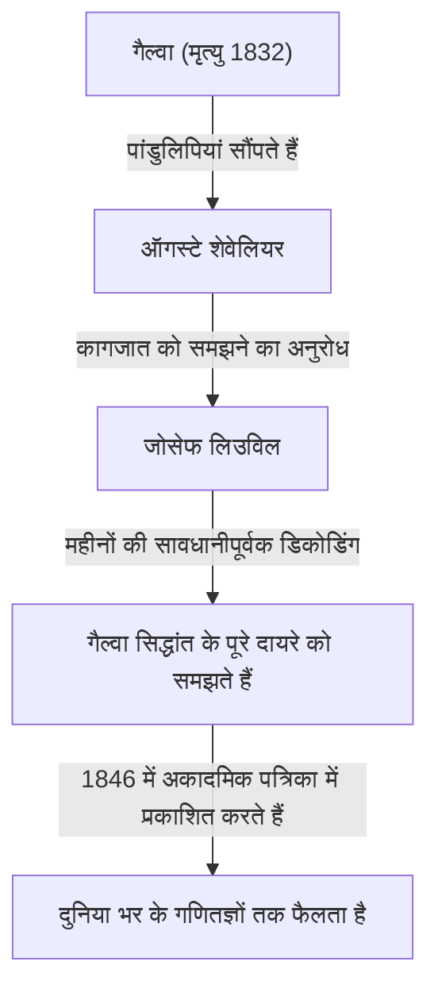

## परिचय

गणित के इतिहास में, 19वीं सदी एक महत्वपूर्ण अवधि थी जब विश्लेषण और बीजगणित अपने आधुनिक रूपों में विकसित हुए। इस आंदोलन के केंद्र में फ्रांसीसी गणितज्ञ **जोसेफ लिउविल** (1809-1882) थे। उन्होंने जटिल विश्लेषण में मूलभूत प्रमेयों की स्थापना की और मानव इतिहास में "पारलौकिक संख्याओं" के अस्तित्व को ठोस रूप से साबित करने वाले पहले व्यक्ति थे। उन्हें उस उपकारक के रूप में भी जाना जाता है जिसने एवारीस्ट गैल्वा की चुनौतीपूर्ण पांडुलिपियों को समझा और प्रकाशित किया। इस लेख में, हम लिउविल के अशांत जीवन और उनकी कई **गणितीय उपलब्धियों** में गहराई से उतरेंगे।

## प्रारंभिक जीवन और शिक्षा

जोसेफ लिउविल का जन्म 24 मार्च 1809 को फ्रांस के पास-डी-कलैस के सेंट-ओमर में हुआ था। उनके पिता नेपोलियन की सेना में सेवा करने वाले एक सैन्य अधिकारी थे। अपने शुरुआती बचपन के दौरान, वे अपने पिता के असाइनमेंट के बाद एक स्थान से दूसरे स्थान पर चले गए, लेकिन अंततः पेरिस में बस गए, जहाँ उन्हें उत्कृष्ट शिक्षा प्राप्त करने का अवसर मिला।

1825 में, उन्होंने प्रतिष्ठित **इकोल पॉलीटेक्निक** (École Polytechnique) में प्रवेश लिया, जहाँ उन्होंने उस युग के सबसे प्रमुख गणितज्ञों से सीखा। बाद में उन्होंने सिविल इंजीनियरिंग का अध्ययन करने के लिए **इकोल डेस पोंट्स एट चौसीज़** (École des Ponts et Chaussées) में प्रवेश लिया, लेकिन उनका दिल हमेशा शुद्ध गणित पर सेट था। अंततः, उन्होंने एक इंजीनियर के रूप में अपना करियर छोड़ दिया और गणित के मार्ग को आगे बढ़ाने का दृढ़ संकल्प लिया।

## गैल्वा की पांडुलिपियों को बचाना

लिउविल पर चर्चा करते समय, कोई भी उस कहानी को छोड़ नहीं सकता है कि कैसे उन्होंने युवा प्रतिभा **एवारीस्ट गैल्वा** की पांडुलिपियों को बचाया। 20 साल की कम उम्र में गैल्वा ने एक द्वंद्वयुद्ध में अपनी जान गंवा दी थी, लेकिन अपनी मृत्यु से ठीक पहले, उन्होंने अपनी गणितीय खोजों को अपने दोस्त ऑगस्टे शेवेलियर को सौंप दिया था।

यह लिउविल ही थे जिन्होंने गैल्वा के सिद्धांत पर प्रकाश डाला, जिसे लंबे समय तक अनदेखा और गलत समझा गया था। 1843 में, उन्होंने गैल्वा के कागजात का पूरी तरह से अध्ययन किया और महसूस किया कि उनमें बीजगणितीय समीकरणों की घुलनशीलता के बारे में गहराई से महत्वपूर्ण खोजें हैं। 1846 में, लिउविल ने गैल्वा के कागजात को अपने द्वारा स्थापित अकादमिक पत्रिका, *Journal de Mathématiques Pures et Appliquées* में प्रकाशित किया, जिससे उन्हें दुनिया के सामने पेश किया गया।

## गणितीय उपलब्धियां

### 1. जटिल विश्लेषण में लिउविल की प्रमेय

जटिल विश्लेषण के क्षेत्र में लिउविल का सबसे बड़ा योगदान **लिउविल की प्रमेय** है। यह प्रमेय बताता है कि "कोई भी फलन जो संपूर्ण (संपूर्ण जटिल तल पर होलोमोर्फिक) और परिबद्ध है, एक अचर फलन होना चाहिए।"

गणितीय सूत्रों का उपयोग करके कड़ाई से व्यक्त किया गया है, यदि एक फलन $f(z)$ संपूर्ण है और एक सकारात्मक वास्तविक संख्या $M$ मौजूद है जिससे सभी $z \in \mathbb{C}$ के लिए $|f(z)| \leq M$ हो, तो $f(z)$ एक स्थिरांक है।

$$
\text{यदि } f(z) \text{ एक संपूर्ण और परिबद्ध फलन है, तो } f(z) = C \text{ (स्थिरांक)।}
$$

यह प्रमेय आश्चर्यजनक रूप से शक्तिशाली है और इसका उपयोग बीजगणित के मौलिक प्रमेय (जिसमें कहा गया है कि जटिल गुणांक वाले प्रत्येक गैर-निरंतर एकल-चर बहुपद में कम से कम एक जटिल मूल होता है) के लिए अत्यंत संक्षिप्त प्रमाण प्रदान करने के लिए किया जाता है।

### 2. पारलौकिक संख्याओं और लिउविल संख्याओं की खोज

19वीं सदी के पूर्वार्ध तक गणित में प्रमुख अनसुलझी समस्याओं में से एक थी: "क्या पारलौकिक संख्याएँ (जटिल संख्याएँ जो परिमेय गुणांक वाले किसी भी गैर-शून्य बहुपद समीकरण की मूल नहीं हैं) मौजूद हैं?" 1844 में, लिउविल ने साबित किया कि कुछ शर्तों को पूरा करने वाली वास्तविक संख्याएं पारलौकिक हैं, इस प्रकार मानव इतिहास में पहली बार विशिष्ट पारलौकिक संख्याओं का निर्माण हुआ। इन्हें **लिउविल संख्या** के रूप में जाना जाता है।

लिउविल संख्या को एक अपरिमेय संख्या के रूप में परिभाषित किया गया है जिसे परिमेय संख्याओं द्वारा "बहुत अच्छी तरह से अनुमानित" किया जा सकता है। प्रतिनिधि लिउविल स्थिरांक $L$ को इस प्रकार परिभाषित किया गया है:

$$
L = \sum_{n=1}^{\infty} 10^{-n!} = 0.110001000000000000000001000\dots
$$

इस संख्या में, $1!$, $2!$, $3!$, $4!$ $\dots$ के अनुरूप दशमलव स्थानों पर $1$ है, और हर दूसरी जगह $0$ है। लिउविल ने **लिउविल सन्निकटन प्रमेय** साबित किया, जो बताता है कि "एक सीमा है जिस सटीकता के साथ किसी भी बीजगणितीय अपरिमेय संख्या का परिमेय संख्याओं द्वारा अनुमान लगाया जा सकता है।" फिर उन्होंने प्रदर्शित किया कि उपरोक्त संख्या $L$, जो इस सीमा से अधिक है, एक बीजगणितीय संख्या नहीं हो सकती है (और इसलिए एक पारलौकिक संख्या है)।

### 3. स्टर्म-लिउविल सिद्धांत

अपने समकालीन गणितज्ञ चार्ल्स-फ्रांकोइस स्टर्म के साथ, लिउविल ने द्वितीय-क्रम रैखिक साधारण अंतर समीकरणों के लिए सीमा मूल्य समस्याओं के संबंध में सामान्य सिद्धांत का निर्माण किया। इसे **स्टर्म-लिउविल सिद्धांत** के रूप में जाना जाता है।

यह सिद्धांत आंशिक अवकल समीकरणों को हल करते समय उत्पन्न होने वाली आइगेनवैल्यू समस्याओं को संभालने के लिए एक शक्तिशाली रूपरेखा प्रदान करता है, जैसे कि ऊष्मा समीकरण और तरंग समीकरण, चर के पृथक्करण की विधि का उपयोग करते हुए। एक मानक स्टर्म-लिउविल समीकरण इस प्रकार लिखा जाता है:

$$
-\frac{d}{dx} \left( p(x) \frac{dy}{dx} \right) + q(x)y = \lambda w(x)y
$$

यहाँ, $\lambda$ आइगेनवैल्यू है और $w(x)$ वजन फलन है। उनके सिद्धांत ने साबित कर दिया कि अलग-अलग आइगेनवैल्यू के अनुरूप आइगेनफंक्शन में ऑर्थोगोनैलिटी होती है, जिससे आधुनिक क्वांटम यांत्रिकी और अनुप्रयुक्त गणित में कार्यात्मक विश्लेषण की नींव पड़ती है।

### 4. अन्य योगदान

लिउविल के पास कई क्षेत्रों में उनके नाम के प्रमेय हैं। इनमें **अंतर गैल्वा सिद्धांत में लिउविल की प्रमेय** शामिल है, जो यह निर्धारित करता है कि किसी प्रारंभिक कार्य के एंटीडेरिवेटिव को फिर से प्रारंभिक कार्य के रूप में व्यक्त किया जा सकता है या नहीं, और गतिशील प्रणालियों में उनका प्रमेय जो चरण-स्थान की मात्रा के संरक्षण को दर्शाता है।

## एक शिक्षक और संपादक के रूप में योगदान

लिउविल ने न केवल अपने शोध के माध्यम से बल्कि गणितीय समुदाय के विकास में भी महत्वपूर्ण योगदान दिया। 1836 में, उन्होंने *Journal de Mathématiques Pures et Appliquées* की स्थापना की। अक्सर "जर्नल डी लिउविल" के रूप में जाना जाता है, यह आज भी एक प्रमुख फ्रांसीसी गणितीय पत्रिका के रूप में प्रकाशित होता है।

इसके अलावा, उन्होंने इकोल पॉलीटेक्निक और कॉलेज डी फ्रांस में एक प्रोफेसर के रूप में कार्य किया, कई युवा गणितज्ञों का पोषण किया। उनके व्याख्यान अविश्वसनीय रूप से कठोर लेकिन भावुक होने के लिए जाने जाते थे, जो उनके छात्रों को गहराई से प्रेरित करते थे।

## बाद का जीवन और विरासत

लिउविल ने अपना पूरा जीवन गणित को समर्पित कर दिया। वे 1848 की फ्रांसीसी क्रांति के दौरान संविधान सभा के सदस्य के रूप में चुने जाने के कारण अस्थायी रूप से राजनीतिक गतिविधियों में भी शामिल रहे, लेकिन बाद में चुनाव हारने के बाद वे शैक्षणिक दुनिया में लौट आए।

8 सितंबर, 1882 को जोसेफ लिउविल का पेरिस में निधन हो गया। उनके द्वारा छोड़े गए प्रमेय और अवधारणाएं न केवल शुद्ध गणित के लिए, बल्कि भौतिकी और इंजीनियरिंग की प्रगति के लिए आवश्यक हो गए हैं। विशेष रूप से, यदि उन्होंने गैल्वा की पांडुलिपियों को नहीं बचाया होता, तो आधुनिक बीजगणित के विकास में संभवतः दशकों की देरी हो जाती।

उनके योगदान को आज भी सम्मानित किया जाता है, इतिहास में उनका नाम उकेरा गया है, जिसमें चंद्रमा पर उनके सम्मान में नामित "लिउविल" नामक एक गड्ढा भी शामिल है।

