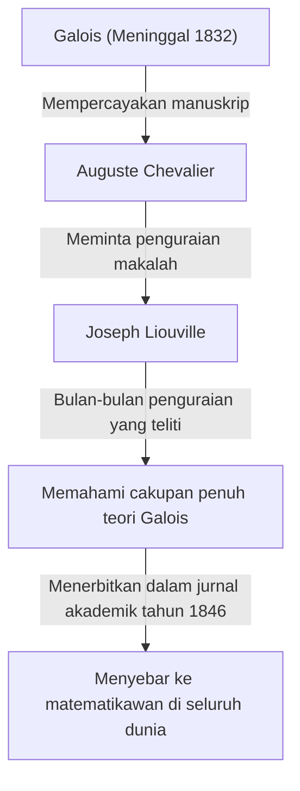

## Pengantar

Dalam sejarah matematika, abad ke-19 adalah periode krusial ketika analisis dan aljabar berkembang menjadi bentuk modernnya. Di pusat pergerakan ini terdapat matematikawan Prancis **Joseph Liouville** (1809–1882). Ia meletakkan dasar-dasar teorema dalam analisis kompleks dan menjadi orang pertama dalam sejarah manusia yang secara konkret membuktikan keberadaan "bilangan transenden". Ia juga dikenal luas sebagai dermawan yang menguraikan dan menerbitkan manuskrip-manuskrip Évariste Galois yang menantang. Dalam artikel ini, kita akan menggali lebih dalam kehidupan Liouville yang penuh gejolak dan berbagai **pencapaian matematis**-nya.

## Kehidupan Awal dan Pendidikan

Joseph Liouville lahir pada 24 Maret 1809, di Saint-Omer, Pas-de-Calais, Prancis. Ayahnya adalah seorang tentara yang bertugas di pasukan Napoleon. Selama masa kanak-kanaknya, ia berpindah-pindah dari satu tempat ke tempat lain mengikuti penugasan ayahnya, tetapi akhirnya menetap di Paris, tempat ia memiliki kesempatan untuk menerima pendidikan yang sangat baik.

Pada tahun 1825, ia masuk ke **École Polytechnique** yang bergengsi, di mana ia belajar dari matematikawan paling terkemuka pada zaman itu. Ia kemudian melanjutkan ke **École des Ponts et Chaussées** untuk belajar teknik sipil, tetapi hatinya selalu tertuju pada matematika murni. Pada akhirnya, ia meninggalkan kariernya sebagai insinyur dan dengan teguh memutuskan untuk mengejar jalan matematika.

## Menyelamatkan Manuskrip Galois

Saat membahas Liouville, orang tidak dapat mengabaikan kisah tentang bagaimana ia menyelamatkan manuskrip jenius muda **Évariste Galois**. Galois kehilangan nyawanya dalam duel di usia muda 20 tahun, tetapi tepat sebelum kematiannya, ia mempercayakan penemuan matematisnya kepada temannya, Auguste Chevalier.

Liouville-lah yang menjelaskan teori Galois, yang telah lama diabaikan dan disalahpahami. Pada tahun 1843, ia mempelajari secara menyeluruh makalah Galois dan menyadari bahwa makalah-makalah itu berisi penemuan yang sangat penting mengenai kelarutan persamaan aljabar. Pada tahun 1846, Liouville menerbitkan makalah Galois di jurnal akademik yang didirikannya, *Journal de Mathématiques Pures et Appliquées*, dengan demikian memperkenalkannya kepada dunia.

## Pencapaian Matematis

### 1. Teorema Liouville dalam Analisis Kompleks

Kontribusi terbesar Liouville dalam bidang analisis kompleks adalah **Teorema Liouville**. Teorema ini menyatakan bahwa "fungsi apa pun yang seluruhnya (holomorfik pada seluruh bidang kompleks) dan terbatas haruslah merupakan fungsi konstan".

Dinyatakan secara ketat menggunakan rumus matematika, jika sebuah fungsi $f(z)$ bersifat utuh dan terdapat bilangan real positif $M$ sedemikian rupa sehingga $|f(z)| \leq M$ untuk semua $z \in \mathbb{C}$, maka $f(z)$ adalah sebuah konstanta.

$$
\text{Jika } f(z) \text{ adalah fungsi yang utuh dan terbatas, maka } f(z) = C \text{ (konstanta).}
$$

Teorema ini sangat kuat dan digunakan untuk memberikan bukti yang sangat ringkas untuk Teorema Dasar Aljabar (yang menyatakan bahwa setiap polinomial non-konstan bervariabel tunggal dengan koefisien kompleks memiliki setidaknya satu akar kompleks).

### 2. Penemuan Bilangan Transenden dan Bilangan Liouville

Salah satu masalah besar yang belum terpecahkan dalam matematika hingga paruh pertama abad ke-19 adalah: "Apakah bilangan transenden (bilangan kompleks yang bukan akar dari persamaan polinomial tak nol mana pun dengan koefisien rasional) ada?" Pada tahun 1844, Liouville membuktikan bahwa bilangan real yang memenuhi kondisi tertentu bersifat transenden, dengan demikian menyusun bilangan transenden spesifik untuk pertama kalinya dalam sejarah manusia. Ini dikenal sebagai **bilangan Liouville**.

Bilangan Liouville didefinisikan sebagai bilangan irasional yang dapat "diperkirakan dengan sangat baik" oleh bilangan rasional. Konstanta Liouville yang representatif $L$ didefinisikan sebagai berikut:

$$
L = \sum_{n=1}^{\infty} 10^{-n!} = 0.110001000000000000000001000\dots
$$

Dalam angka ini, terdapat angka $1$ pada tempat desimal yang sesuai dengan $1!$, $2!$, $3!$, $4!$ $\dots$, dan angka $0$ di tempat lainnya. Liouville membuktikan **teorema aproksimasi Liouville**, yang menyatakan bahwa "ada batas keakuratan dengan mana setiap bilangan irasional aljabar dapat dihampiri oleh bilangan rasional". Dia kemudian menunjukkan bahwa bilangan $L$ di atas, yang melebihi batas ini, tidak dapat menjadi bilangan aljabar (dan karena itu merupakan bilangan transenden).

### 3. Teori Sturm-Liouville

Bersama dengan ahli matematika sezamannya Charles-François Sturm, Liouville membangun teori umum mengenai masalah nilai batas untuk persamaan diferensial biasa linier orde dua. Ini dikenal sebagai **teori Sturm-Liouville**.

Teori ini memberikan kerangka kerja yang kuat untuk menangani masalah nilai eigen yang timbul saat memecahkan persamaan diferensial parsial, seperti persamaan kalor dan persamaan gelombang, menggunakan metode pemisahan variabel. Persamaan standar Sturm-Liouville ditulis sebagai berikut:

$$
-\frac{d}{dx} \left( p(x) \frac{dy}{dx} \right) + q(x)y = \lambda w(x)y
$$

Di sini, $\lambda$ adalah nilai eigen dan $w(x)$ adalah fungsi bobot. Teori mereka membuktikan bahwa fungsi eigen yang sesuai dengan nilai eigen yang berbeda memiliki ortogonalitas, sehingga meletakkan dasar bagi analisis fungsional dalam mekanika kuantum modern dan matematika terapan.

### 4. Kontribusi Lainnya

Liouville memiliki teorema yang menyandang namanya di berbagai bidang. Ini termasuk **teorema Liouville dalam teori diferensial Galois**, yang menentukan apakah antiturunan dari fungsi dasar dapat dinyatakan lagi sebagai fungsi dasar, dan teoremanya dalam sistem dinamis yang menunjukkan kekekalan volume ruang fase.

## Kontribusi sebagai Pendidik dan Editor

Liouville berkontribusi secara signifikan tidak hanya melalui penelitiannya sendiri tetapi juga pada pengembangan komunitas matematika. Pada tahun 1836, ia mendirikan *Journal de Mathématiques Pures et Appliquées*. Sering disebut hanya sebagai "Journal de Liouville", jurnal ini terus diterbitkan hingga hari ini sebagai jurnal matematika Prancis terkemuka.

Lebih jauh lagi, ia menjabat sebagai profesor di École Polytechnique dan Collège de France, membina banyak ahli matematika muda. Kuliah-kuliahnya dikenal sangat ketat namun penuh semangat, yang sangat menginspirasi mahasiswanya.

## Kehidupan Akhir dan Warisan

Liouville mengabdikan seluruh hidupnya untuk matematika. Ia juga sempat terlibat dalam kegiatan politik, terpilih sebagai anggota Majelis Konstituante selama Revolusi Prancis 1848, tetapi ia kembali ke dunia akademis setelah kalah dalam pemilihan berikutnya.

Pada 8 September 1882, Joseph Liouville meninggal dunia di Paris. Teorema dan konsep yang ditinggalkannya telah menjadi sangat penting bukan hanya untuk matematika murni, tetapi untuk kemajuan fisika dan teknik. Secara khusus, seandainya ia tidak menyelamatkan manuskrip-manuskrip Galois, perkembangan aljabar modern kemungkinan akan tertunda selama beberapa dekade.

Kontribusinya terus dihormati hingga hari ini, dengan namanya terukir dalam sejarah, termasuk sebuah kawah di bulan yang dinamai "Liouville" untuk menghormatinya.
