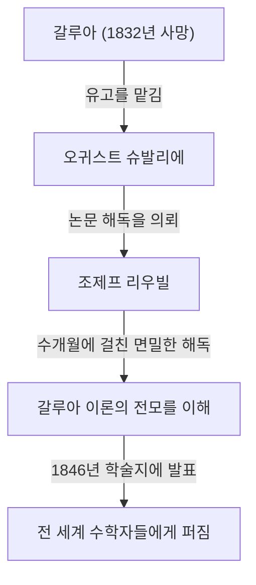

## 소개

수학의 역사에서 19세기는 해석학과 대수학이 현대적인 형태로 발전한 중요한 시기였습니다. 이 움직임의 중심에는 프랑스의 수학자 **조제프 리우빌** (Joseph Liouville, 1809–1882)이 있었습니다. 그는 복소해석학의 기본 정리를 확립했으며 인류 역사상 최초로 "초월수"의 존재를 구체적으로 증명했습니다. 그는 또한 에바리스투 갈루아의 난해한 유고를 해독하고 출판한 은인으로도 잘 알려져 있습니다. 이 글에서는 리우빌의 파란만장한 생애와 그가 남긴 수많은 **수학적 업적** 에 대해 깊이 있게 파헤쳐 봅니다.

## 초기 생애와 교육

조제프 리우빌은 1809년 3월 24일 프랑스 파드칼레의 생토메르에서 태어났습니다. 그의 아버지는 나폴레옹 군대에 복무하던 군인이었습니다. 유년 시절에는 아버지의 부임을 따라 여러 곳을 전전했지만, 마침내 파리에 정착하여 훌륭한 교육을 받을 기회를 얻었습니다.

1825년, 그는 명문 **에콜 폴리테크니크** (École Polytechnique)에 입학하여 당대 최고의 수학자들로부터 배웠습니다. 이후 **에콜 데 퐁 제 쇼세** (École des Ponts et Chaussées)로 진학하여 토목공학을 공부했지만, 그의 마음은 항상 순수 수학을 향해 있었습니다. 결국 그는 엔지니어로서의 경력을 포기하고 수학의 길을 걷기로 굳게 다짐합니다.

## 갈루아의 유고 구출

리우빌을 이야기할 때 젊은 천재 **에바리스투 갈루아** (Évariste Galois)의 유고를 구한 일화를 빼놓을 수 없습니다. 갈루아는 20세의 젊은 나이에 결투로 목숨을 잃었지만, 죽기 직전 자신의 수학적 발견을 친구 오귀스트 슈발리에에게 맡겼습니다.

오랫동안 무시되고 오해받았던 갈루아의 이론에 빛을 비춘 사람이 바로 리우빌이었습니다. 1843년에 그는 갈루아의 논문을 철저히 연구했고, 그 안에 대수 방정식의 가해성에 관한 대단히 중요한 발견이 포함되어 있음을 깨달았습니다. 1846년, 리우빌은 자신이 창간한 학술지인 《순수 및 응용 수학 저널》(Journal de Mathématiques Pures et Appliquées)에 갈루아의 논문을 게재하여 세상에 알렸습니다.

## 수학적 업적

### 1. 복소해석학에서의 리우빌의 정리

복소해석학 분야에서 리우빌이 남긴 가장 큰 공헌은 **리우빌의 정리** 입니다. 이 정리는 "복소평면 전체에서 정칙(전해석적)이며 유계인 함수는 상수 함수뿐이다"라는 것입니다.

수학 공식을 사용하여 엄밀하게 표현하면, 함수 $f(z)$가 전해석적이고 모든 $z \in \mathbb{C}$에 대해 $|f(z)| \leq M$을 만족하는 양의 실수 $M$이 존재한다면, $f(z)$는 상수입니다.

$$
\text{만약 } f(z) \text{ 가 전해석적이고 유계인 함수라면, } f(z) = C \text{ (상수)이다.}
$$

이 정리는 놀라울 정도로 강력하며, 대수학의 기본 정리(복소수 계수를 갖는 모든 상수가 아닌 일변수 다항식은 적어도 하나의 복소수 근을 갖는다)에 대한 매우 간결한 증명을 제공하는 데 사용됩니다.

### 2. 초월수의 발견과 리우빌 수

19세기 전반까지 수학계의 큰 미해결 문제 중 하나는 "초월수(유리수 계수를 갖는 0이 아닌 다항 방정식의 근이 될 수 없는 복소수)가 존재하는가?"였습니다. 1844년 리우빌은 특정 조건을 만족하는 실수가 초월수임을 증명하여 인류 역사상 처음으로 특정한 초월수를 구성했습니다. 이것이 **리우빌 수** 로 알려져 있습니다.

리우빌 수는 유리수에 의해 "매우 잘 근사될 수 있는" 무리수로 정의됩니다. 대표적인 리우빌 상수 $L$은 다음과 같이 정의됩니다.

$$
L = \sum_{n=1}^{\infty} 10^{-n!} = 0.110001000000000000000001000\dots
$$

이 수는 소수점 이하 $1!$, $2!$, $3!$, $4!$ $\dots$ 의 위치에 $1$이 있고 그 외의 모든 곳에는 $0$이 있습니다. 리우빌은 "어떤 대수적 무리수라도 유리수에 의해 근사될 수 있는 정확도에는 한계가 있다"는 **리우빌 근사 정리** 를 증명했습니다. 그런 다음 이 한계를 초과하는 위의 수 $L$이 대수적 수가 될 수 없음(따라서 초월수임)을 입증했습니다.

### 3. 스튀름-리우빌 이론

동시대의 수학자 샤를프랑수아 스튀름과 함께 리우빌은 2계 선형 상미분 방정식의 경계값 문제에 관한 일반 이론을 구축했습니다. 이것이 **스튀름-리우빌 이론** 으로 알려져 있습니다.

이 이론은 변수 분리법을 사용하여 열 방정식이나 파동 방정식과 같은 편미분 방정식을 풀 때 발생하는 고유값 문제를 처리하는 강력한 틀을 제공합니다. 표준 스튀름-리우빌 방정식은 다음과 같이 작성됩니다.

$$
-\frac{d}{dx} \left( p(x) \frac{dy}{dx} \right) + q(x)y = \lambda w(x)y
$$

여기서 $\lambda$는 고유값이고 $w(x)$는 가중 함수입니다. 그들의 이론은 서로 다른 고유값에 대응하는 고유함수들이 직교성을 가짐을 증명했으며, 이로써 현대 양자역학과 응용수학에서 함수해석학의 기초를 다졌습니다.

### 4. 기타 공헌

리우빌은 다양한 분야에 걸쳐 자신의 이름을 딴 정리들을 남겼습니다. 여기에는 초등 함수의 역도함수가 다시 초등 함수로 표현될 수 있는지 여부를 결정하는 **미분 갈루아 이론에서의 리우빌의 정리** 와 위상 공간 부피의 보존을 보여주는 역학계에서의 그의 정리가 포함됩니다.

## 교육자 및 편집자로서의 공헌

리우빌은 자신의 연구뿐만 아니라 수학계의 발전에도 크게 기여했습니다. 1836년에 그는 《순수 및 응용 수학 저널》을 창간했습니다. 흔히 "리우빌 저널"로 불리는 이 저널은 오늘날에도 프랑스의 주요 수학 저널로 계속 출판되고 있습니다.

또한 그는 에콜 폴리테크니크와 콜레주 드 프랑스에서 교수로 재직하며 많은 젊은 수학자들을 양성했습니다. 그의 강의는 믿을 수 없을 정도로 엄격하면서도 열정적이어서 학생들에게 깊은 영감을 주었습니다.

## 말년과 유산

리우빌은 평생을 수학에 바쳤습니다. 그는 일시적으로 정치 활동에도 참여하여 1848년 프랑스 혁명 당시 제헌의회 의원으로 선출되었으나, 이후 선거에서 낙선한 뒤 학계로 돌아왔습니다.

1882년 9월 8일, 조제프 리우빌은 파리에서 세상을 떠났습니다. 그가 남긴 정리와 개념들은 순수 수학뿐만 아니라 물리학과 공학의 발전에도 필수적인 것이 되었습니다. 특히 그가 갈루아의 유고를 구하지 않았다면 현대 대수학의 발전은 아마도 수십 년 지연되었을 것입니다.

그의 공헌은 오늘날까지도 칭송받고 있으며, 그의 이름을 딴 달의 분화구 "리우빌"을 비롯하여 역사에 그의 이름이 새겨져 있습니다.
