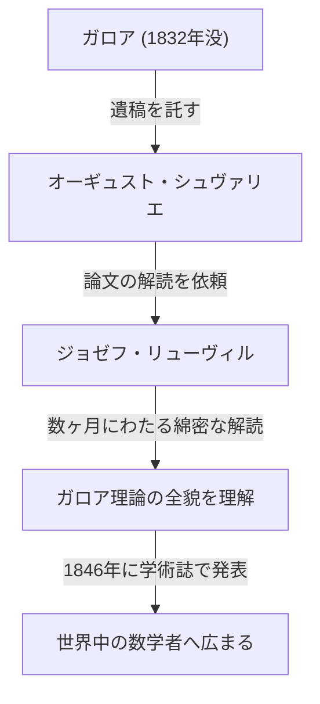

## はじめに

数学の歴史において、19世紀は解析学や代数学が近代的な形へと発展した重要な時期でした。その中心にいた人物の一人が、フランスの数学者 **ジョゼフ・リューヴィル** （Joseph Liouville, 1809–1882）です。彼は複素解析における基本的な定理を確立し、人類で初めて「超越数」の存在を具体的に証明しました。また、[エヴァリスト・ガロア](https://kenji.blog/p/galois/)の難解な遺稿を解読し、世に送り出した恩人としても知られています。本記事では、リューヴィルの波乱に満ちた生涯と、彼が残した数々の **数学的業績** について深く掘り下げます。

## 生い立ちと教育

ジョゼフ・リューヴィルは1809年3月24日、フランスのパ＝ド＝カレー県サン＝トメールで生まれました。彼の父親は軍人であり、ナポレオンの軍隊に従軍していました。幼少期は父親の赴任に伴い各地を転々としましたが、やがてパリに定住し、そこで優れた教育を受ける機会を得ます。

1825年、彼は名門 **エコール・ポリテクニーク** （École Polytechnique）に入学し、当時の最高峰の数学者たちから学びました。さらにその後、 **エコール・デ・ポン・ゼ・ショセ** （École des Ponts et Chaussées）に進学して土木工学を学びますが、彼の心は常に純粋数学に向いていました。最終的に彼はエンジニアとしてのキャリアを捨て、数学の道へ進む決意を固めます。

## ガロアの遺稿の救済

リューヴィルの名前を語る上で欠かせないのが、若き天才 **[エヴァリスト・ガロア](https://kenji.blog/p/galois/)** （[Évariste Galois](https://kenji.blog/p/galois/)）の遺稿を救ったエピソードです。ガロアは20歳という若さで決闘により命を落としましたが、死の直前に友人のオーギュスト・シュヴァリエに自身の数学的発見を託していました。

長らく理解されずに放置されていたガロアの理論に光を当てたのが、リューヴィルでした。彼は1843年にガロアの論文を深く研究し、それが代数方程式の可解性に関する極めて重要な発見であることを理解しました。1846年、リューヴィルは自身が創刊した学術誌『純粋・応用数学雑誌』（Journal de Mathématiques Pures et Appliquées）にガロアの論文を掲載し、世界に発表しました。

## 数学的業績

### 1. 複素解析におけるリューヴィルの定理

リューヴィルが複素解析の分野で残した最大の功績が **リューヴィルの定理** です。この定理は、「複素平面全体で正則（微分可能）であり、かつ有界な関数は定数関数に限る」というものです。

数式を用いて厳密に表現すると、関数 $f(z)$ が全平面で正則であり、ある正の実数 $M$ が存在してすべての $z \in \mathbb{C}$ に対して $|f(z)| \leq M$ が成り立つならば、$f(z)$ は定数となります。

$$
\text{もし } f(z) \text{ が整関数で有界ならば、} f(z) = C \text{ (定数) である。}
$$

この定理は驚くほど強力であり、[代数学の基本定理](https://kenji.blog/p/fundamental-theorem-of-algebra/)（任意の複素数係数の非定数多項式は少なくとも1つの複素数の根を持つ）を極めて簡潔に証明するために用いられます。

### 2. 超越数の発見とリューヴィル数

19世紀前半までの数学界における大きな未解決問題の一つが、「超越数（有理数係数の代数方程式の根にならない複素数）は存在するのか？」というものでした。リューヴィルは1844年に、特定の条件を満たす実数が超越数であることを証明し、人類で初めて具体的な超越数を構成しました。これが **リューヴィル数** です。

リューヴィル数は、有理数によって「非常に良く近似できる」無理数として定義されます。代表的なリューヴィル定数 $L$ は次のように定義されます：

$$
L = \sum_{n=1}^{\infty} 10^{-n!} = 0.110001000000000000000001000\dots
$$

この数は、小数点以下の $1!$、$2!$、$3!$、$4!$ $\dots$ の位置に $1$ があり、それ以外はすべて $0$ となる数です。リューヴィルは、「任意の代数的無理数は、有理数による近似の精度に限界がある」という **リューヴィルの近似定理** を証明し、この限界を超える上記の数 $L$ が代数的数になり得ない（つまり超越数である）ことを示しました。

### 3. スツルム＝リューヴィル理論

リューヴィルは、同時代の数学者シャルル＝フランソワ・スツルムとともに、二階線形常微分方程式の境界値問題に関する一般理論を構築しました。これが **スツルム＝リューヴィル理論** です。

この理論は、熱伝導方程式や波動方程式などの偏微分方程式を変数分離法で解く際に現れる固有値問題を扱うための強力な枠組みを提供します。標準的なスツルム＝リューヴィル方程式は以下のように記述されます：

$$
-\frac{d}{dx} \left( p(x) \frac{dy}{dx} \right) + q(x)y = \lambda w(x)y
$$

ここで、 $\lambda$ は固有値であり、 $w(x)$ は重み関数です。彼らの理論は、異なる固有値に対応する固有関数が直交性を持つことを証明し、現代の量子力学や応用数学における関数解析の基礎を築きました。

### 4. その他の貢献

他にも、微積分学において「初等関数の不定積分が再び初等関数で表せるか」を判定する **リューヴィルの定理 (微分[ガロア理論](https://kenji.blog/p/galois-theory/))** や、力学系における相空間の体積保存を示す定理など、多岐にわたる分野で彼の名前を冠した定理が存在します。

## 教育者および編集者としての功績

リューヴィルは自身の研究だけでなく、数学界の発展にも大きく貢献しました。1836年、彼は『純粋・応用数学雑誌』を創刊しました。この雑誌は通称「リューヴィル誌」とも呼ばれ、現在でもフランスを代表する重要な数学誌として刊行され続けています。

また、彼はエコール・ポリテクニークやコレージュ・ド・フランスで教授を務め、多くの後進を育成しました。彼の講義は非常に厳密でありながら情熱的で、学生たちに深いインスピレーションを与えました。

## 晩年と遺産

リューヴィルは生涯を通じて数学に身を捧げました。彼は政治的な活動にも一時的に関与し、1848年のフランス革命時には憲法制定議会の議員に選出されましたが、選挙での落選を機に再び学問の世界へ戻りました。

1882年9月8日、ジョゼフ・リューヴィルはパリでその生涯を閉じました。彼の遺した定理や概念は、純粋数学のみならず物理学や工学の発展にも不可欠なものとなっています。特に彼がガロアの遺稿を救い出さなければ、現代の代数学の発展は数十年遅れていたことでしょう。

彼の功績は、月にあるクレーター「リューヴィル」としてその名が刻まれるなど、今もなお称えられ続けています。
