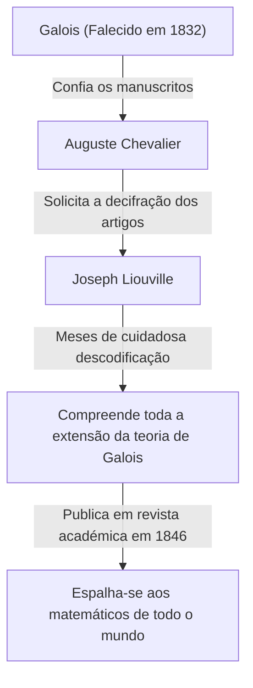

## Introdução

Na história da matemática, o século XIX foi um período crucial em que a análise e a álgebra se desenvolveram até às suas formas modernas. No centro deste movimento estava o matemático francês **Joseph Liouville** (1809–1882). Ele estabeleceu teoremas fundamentais em análise complexa e foi a primeira pessoa na história humana a provar concretamente a existência de "números transcendentes". Ele também é bem conhecido como o benfeitor que decifrou e publicou os desafiadores manuscritos de Évariste Galois. Neste artigo, aprofundaremos a vida turbulenta de Liouville e as suas numerosas **conquistas matemáticas**.

## Primeiros Anos e Educação

Joseph Liouville nasceu em 24 de março de 1809, em Saint-Omer, Pas-de-Calais, França. O seu pai era um militar servindo no exército de Napoleão. Durante a sua infância, mudou-se de lugar em lugar acompanhando as missões do seu pai, mas acabou por se estabelecer em Paris, onde teve a oportunidade de receber uma excelente educação.

Em 1825, ingressou na prestigiada **École Polytechnique**, onde aprendeu com os matemáticos mais proeminentes da época. Mais tarde, avançou para a **École des Ponts et Chaussées** para estudar engenharia civil, mas o seu coração esteve sempre voltado para a matemática pura. Por fim, abandonou a sua carreira como engenheiro e decidiu firmemente seguir o caminho da matemática.

## O Resgate dos Manuscritos de Galois

Ao discutir Liouville, não se pode omitir a história de como ele salvou os manuscritos do jovem génio **Évariste Galois**. Galois perdeu a vida num duelo com a tenra idade de 20 anos, mas imediatamente antes da sua morte, confiou as suas descobertas matemáticas ao seu amigo Auguste Chevalier.

Foi Liouville quem lançou luz sobre a teoria de Galois, que tinha sido ignorada e incompreendida durante muito tempo. Em 1843, estudou exaustivamente os artigos de Galois e percebeu que continham descobertas profundamente importantes no que diz respeito à resolubilidade de equações algébricas. Em 1846, Liouville publicou os artigos de Galois na revista académica que ele próprio fundara, o *Journal de Mathématiques Pures et Appliquées*, apresentando-os assim ao mundo.

## Conquistas Matemáticas

### 1. O Teorema de Liouville na Análise Complexa

A maior contribuição de Liouville no campo da análise complexa é o **Teorema de Liouville**. Este teorema afirma que "qualquer função que seja inteira (holomorfa em todo o plano complexo) e limitada deve ser uma função constante".

Expresso rigorosamente utilizando fórmulas matemáticas, se uma função $f(z)$ é inteira e existe um número real positivo $M$ tal que $|f(z)| \leq M$ para todo $z \in \mathbb{C}$, então $f(z)$ é uma constante.

$$
\text{Se } f(z) \text{ é uma função inteira e limitada, então } f(z) = C \text{ (constante).}
$$

Este teorema é espantosamente poderoso e é utilizado para fornecer provas extremamente concisas do Teorema Fundamental da Álgebra (que afirma que todo polinómio não constante de uma variável com coeficientes complexos tem pelo menos uma raiz complexa).

### 2. Descoberta dos Números Transcendentes e Números de Liouville

Um dos maiores problemas por resolver na matemática até à primeira metade do século XIX era: "Existem números transcendentes (números complexos que não são raízes de nenhuma equação polinomial não nula com coeficientes racionais)?". Em 1844, Liouville provou que números reais que satisfazem certas condições são transcendentes, construindo assim números transcendentes específicos pela primeira vez na história humana. Estes são conhecidos como **números de Liouville**.

Um número de Liouville é definido como um número irracional que pode ser "muito bem aproximado" por números racionais. A constante representativa de Liouville $L$ é definida da seguinte forma:

$$
L = \sum_{n=1}^{\infty} 10^{-n!} = 0.110001000000000000000001000\dots
$$

Neste número, há um $1$ nas casas decimais correspondentes a $1!$, $2!$, $3!$, $4!$ $\dots$, e um $0$ em todos os outros lugares. Liouville provou o **teorema da aproximação de Liouville**, que afirma que "há um limite para a precisão com a qual qualquer número irracional algébrico pode ser aproximado por números racionais". Em seguida, demonstrou que o número $L$ acima, que excede este limite, não pode ser um número algébrico (e é, portanto, um número transcendente).

### 3. Teoria de Sturm-Liouville

Juntamente com o matemático contemporâneo Charles-François Sturm, Liouville construiu a teoria geral referente aos problemas de valor limite para equações diferenciais ordinárias lineares de segunda ordem. Isto é conhecido como a **teoria de Sturm-Liouville**.

Esta teoria fornece uma estrutura poderosa para lidar com problemas de autovalores que surgem ao resolver equações diferenciais parciais, como a equação do calor e a equação da onda, utilizando o método de separação de variáveis. Uma equação padrão de Sturm-Liouville é escrita da seguinte forma:

$$
-\frac{d}{dx} \left( p(x) \frac{dy}{dx} \right) + q(x)y = \lambda w(x)y
$$

Aqui, $\lambda$ é o autovalor e $w(x)$ é a função peso. A sua teoria provou que as autofunções correspondentes a diferentes autovalores possuem ortogonalidade, lançando assim as bases para a análise funcional na mecânica quântica moderna e na matemática aplicada.

### 4. Outras Contribuições

Liouville tem teoremas com o seu nome numa grande variedade de campos. Estes incluem o **teorema de Liouville na teoria de Galois diferencial**, que determina se a antiderivada de uma função elementar pode novamente ser expressa como uma função elementar, e o seu teorema em sistemas dinâmicos que mostra a conservação do volume no espaço de fase.

## Contribuições como Educador e Editor

Liouville contribuiu significativamente não só através da sua própria investigação, mas também para o desenvolvimento da comunidade matemática. Em 1836, fundou o *Journal de Mathématiques Pures et Appliquées*. Frequentemente referido simplesmente como "Journal de Liouville", continua a ser publicado hoje em dia como uma das principais revistas matemáticas francesas.

Além disso, atuou como professor na École Polytechnique e no Collège de France, nutrindo muitos jovens matemáticos. As suas palestras eram conhecidas por serem incrivelmente rigorosas mas apaixonadas, inspirando profundamente os seus estudantes.

## Vida Tardia e Legado

Liouville dedicou toda a sua vida à matemática. Também esteve temporariamente envolvido em atividades políticas, sendo eleito membro da Assembleia Constituinte durante a Revolução Francesa de 1848, mas regressou ao mundo académico depois de perder uma eleição subsequente.

No dia 8 de setembro de 1882, Joseph Liouville faleceu em Paris. Os teoremas e conceitos que deixou para trás tornaram-se essenciais não apenas para a matemática pura, mas para o avanço da física e da engenharia. Em particular, se não tivesse salvo os manuscritos de Galois, o desenvolvimento da álgebra moderna teria provavelmente sido atrasado em décadas.

As suas contribuições continuam a ser honradas até hoje, com o seu nome gravado na história, incluindo uma cratera na lua chamada "Liouville" em sua honra.
