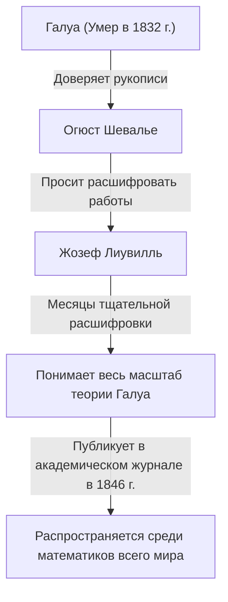

## Введение

В истории математики 19 век был важнейшим периодом, когда анализ и алгебра развились до своих современных форм. В центре этого движения находился французский математик **Жозеф Лиувилль** (1809–1882). Он установил фундаментальные теоремы в комплексном анализе и стал первым человеком в истории человечества, который конкретно доказал существование «трансцендентных чисел». Он также широко известен как благодетель, расшифровавший и опубликовавший сложные рукописи Эвариста Галуа. В этой статье мы глубоко погрузимся в бурную жизнь Лиувилля и его многочисленные **математические достижения**.

## Ранние годы и образование

Жозеф Лиувилль родился 24 марта 1809 года в Сент-Омере, Па-де-Кале, Франция. Его отец был военным, служившим в армии Наполеона. В раннем детстве он переезжал с места на место, следуя за назначениями отца, но в конце концов поселился в Париже, где у него появилась возможность получить отличное образование.

В 1825 году он поступил в престижную **Политехническую школу** (École Polytechnique), где учился у самых выдающихся математиков той эпохи. Позже он перешел в **Школу мостов и дорог** (École des Ponts et Chaussées) для изучения гражданского строительства, но его сердце всегда принадлежало чистой математике. В конечном итоге он отказался от карьеры инженера и твердо решил следовать по пути математики.

## Спасение рукописей Галуа

Обсуждая Лиувилля, нельзя обойти вниманием историю о том, как он спас рукописи молодого гения **Эвариста Галуа**. Галуа погиб на дуэли в юном возрасте 20 лет, но незадолго до своей смерти он доверил свои математические открытия своему другу Огюсту Шевалье.

Именно Лиувилль пролил свет на теорию Галуа, которая долгое время игнорировалась и оставалась непонятой. В 1843 году он тщательно изучил работы Галуа и понял, что они содержат глубоко важные открытия относительно разрешимости алгебраических уравнений. В 1846 году Лиувилль опубликовал работы Галуа в академическом журнале, который сам же и основал, *Journal de Mathématiques Pures et Appliquées*, тем самым представив их миру.

## Математические достижения

### 1. Теорема Лиувилля в комплексном анализе

Величайшим вкладом Лиувилля в области комплексного анализа является **Теорема Лиувилля**. Эта теорема гласит, что «любая функция, которая является целой (голоморфной на всей комплексной плоскости) и ограниченной, должна быть постоянной функцией».

Выражаясь строго с использованием математических формул, если функция $f(z)$ является целой и существует положительное действительное число $M$ такое, что $|f(z)| \leq M$ для всех $z \in \mathbb{C}$, то $f(z)$ является константой.

$$
\text{Если } f(z) \text{ — целая и ограниченная функция, то } f(z) = C \text{ (константа).}
$$

Эта теорема удивительно сильна и используется для предоставления чрезвычайно кратких доказательств Основной теоремы алгебры (которая гласит, что каждый непостоянный многочлен от одной переменной с комплексными коэффициентами имеет по крайней мере один комплексный корень).

### 2. Открытие трансцендентных чисел и числа Лиувилля

Одной из главных нерешенных проблем в математике до первой половины 19 века было: «Существуют ли трансцендентные числа (комплексные числа, которые не являются корнями ни одного ненулевого полиномиального уравнения с рациональными коэффициентами)?» В 1844 году Лиувилль доказал, что действительные числа, удовлетворяющие определенным условиям, являются трансцендентными, тем самым впервые в истории человечества сконструировав конкретные трансцендентные числа. Они известны как **числа Лиувилля**.

Число Лиувилля определяется как иррациональное число, которое может быть «очень хорошо приближено» рациональными числами. Репрезентативная константа Лиувилля $L$ определяется следующим образом:

$$
L = \sum_{n=1}^{\infty} 10^{-n!} = 0.110001000000000000000001000\dots
$$

В этом числе $1$ стоит в десятичных знаках, соответствующих $1!$, $2!$, $3!$, $4!$ $\dots$, и $0$ везде в остальных местах. Лиувилль доказал **теорему Лиувилля о приближении**, которая гласит, что «существует предел точности, с которой любое алгебраическое иррациональное число может быть приближено рациональными числами». Затем он продемонстрировал, что приведенное выше число $L$, которое превышает этот предел, не может быть алгебраическим числом (и, следовательно, является трансцендентным числом).

### 3. Теория Штурма-Лиувилля

Вместе со своим современником, математиком Шарлем-Франсуа Штурмом, Лиувилль построил общую теорию краевых задач для линейных обыкновенных дифференциальных уравнений второго порядка. Это известно как **теория Штурма-Лиувилля**.

Эта теория предоставляет мощный аппарат для решения задач на собственные значения, которые возникают при решении дифференциальных уравнений в частных производных, таких как уравнение теплопроводности и волновое уравнение, с использованием метода разделения переменных. Стандартное уравнение Штурма-Лиувилля записывается следующим образом:

$$
-\frac{d}{dx} \left( p(x) \frac{dy}{dx} \right) + q(x)y = \lambda w(x)y
$$

Здесь $\lambda$ — собственное значение, а $w(x)$ — весовая функция. Их теория доказала, что собственные функции, соответствующие различным собственным значениям, обладают ортогональностью, тем самым заложив основу для функционального анализа в современной квантовой механике и прикладной математике.

### 4. Другие вклады

В честь Лиувилля названы теоремы в самых разных областях. К ним относятся **теорема Лиувилля в дифференциальной теории Галуа**, которая определяет, может ли первообразная элементарной функции снова быть выражена как элементарная функция, и его теорема в динамических системах, показывающая сохранение фазового объема.

## Вклад как педагога и редактора

Лиувилль внес значительный вклад не только благодаря своим собственным исследованиям, но и в развитие математического сообщества. В 1836 году он основал *Journal de Mathématiques Pures et Appliquées*. Часто называемый просто «Журнал Лиувилля», он продолжает издаваться и сегодня как один из ведущих французских математических журналов.

Кроме того, он работал профессором в Политехнической школе и Коллеж де Франс, воспитывая многих молодых математиков. Его лекции, как известно, были невероятно строгими, но страстными, что глубоко вдохновляло его учеников.

## Поздние годы и наследие

Лиувилль посвятил всю свою жизнь математике. Он также временно участвовал в политической деятельности, будучи избранным членом Учредительного собрания во время Французской революции 1848 года, но вернулся в академический мир после поражения на последующих выборах.

8 сентября 1882 года Жозеф Лиувилль скончался в Париже. Оставленные им теоремы и концепции стали важными не только для чистой математики, но и для развития физики и инженерии. В частности, если бы он не спас рукописи Галуа, развитие современной алгебры, вероятно, было бы отложено на десятилетия.

Его вклад продолжает почитаться и по сей день, а его имя навсегда вписано в историю, в том числе кратер на Луне назван «Лиувилль» в его честь.

