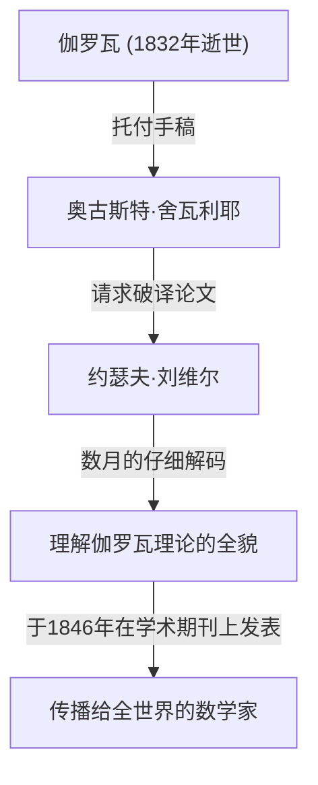

## 引言

在数学史上，19世纪是分析学和代数学发展成现代形式的关键时期。处于这一运动中心的是法国数学家 **约瑟夫·刘维尔** （Joseph Liouville，1809–1882）。他在复分析领域确立了基础定理，并且是人类历史上第一个具体证明“超越数”存在的人。他同样以破译并出版埃瓦里斯特·伽罗瓦艰深的手稿的恩人身份而闻名。在本文中，我们将深入探讨刘维尔波澜壮阔的一生及其众多的 **数学成就** 。

## 早年生活与教育

约瑟夫·刘维尔于1809年3月24日出生在法国加来海峡省的圣奥梅尔。他的父亲是一名在拿破仑军队服役的军人。在童年早期，他跟随父亲的调动四处奔波，但最终定居巴黎，在那里他有机会接受了极好的教育。

1825年，他进入了享有盛誉的 **巴黎综合理工学院** （École Polytechnique），在那里他向那个时代最杰出的数学家们学习。随后他又进入 **国立桥路学校** （École des Ponts et Chaussées）学习土木工程，但他的心始终向往纯数学。最终，他放弃了工程师的职业，坚定地踏上了数学之路。

## 拯救伽罗瓦的手稿

在讨论刘维尔时，不能不提他如何拯救年轻天才 **埃瓦里斯特·伽罗瓦** （Évariste Galois）手稿的故事。伽罗瓦在20岁时因决斗英年早逝，但在死前，他将自己的数学发现托付给了朋友奥古斯特·舍瓦利耶。

正是刘维尔为被长期忽视和误解的伽罗瓦理论带来了曙光。1843年，他彻底研究了伽罗瓦的论文，并意识到其中包含了关于代数方程可解性的极其重要的发现。1846年，刘维尔在自己创办的学术期刊《纯粹与应用数学杂志》（Journal de Mathématiques Pures et Appliquées）上发表了伽罗瓦的论文，从而将其展示给了全世界。

## 数学成就

### 1. 复分析中的刘维尔定理

刘维尔在复分析领域最伟大的贡献是 **刘维尔定理** 。该定理指出：“任何在整个复平面上全纯且有界的函数，必定是常数函数。”

用数学公式严格表达，如果函数 $f(z)$ 是整函数，并且存在一个正实数 $M$，使得对于所有的 $z \in \mathbb{C}$，都有 $|f(z)| \leq M$，那么 $f(z)$ 是一个常数。

$$
\text{如果 } f(z) \text{ 是一个有界整函数，那么 } f(z) = C \text{ (常数)。}
$$

这个定理惊人地强大，被用来为代数基本定理（指出每个具有复系数的非非零一元多项式至少有一个复数根）提供极其简洁的证明。

### 2. 超越数与刘维尔数的发现

直到19世纪上半叶，数学界一个主要的未解之谜是：“超越数（不是任何具有有理系数的非零多项式方程的根的复数）存在吗？”1844年，刘维尔证明了满足特定条件的实数是超越数，从而在人类历史上首次构造了具体的超越数。这些被称为 **刘维尔数** 。

刘维尔数被定义为可以被有理数“极好地近似”的无理数。代表性的刘维尔常数 $L$ 定义如下：

$$
L = \sum_{n=1}^{\infty} 10^{-n!} = 0.110001000000000000000001000\dots
$$

在这个数字中，在对应于 $1!$, $2!$, $3!$, $4!$ $\dots$ 的小数位上是 $1$，其他地方都是 $0$。刘维尔证明了 **刘维尔逼近定理** ，该定理指出“任何代数无理数能被有理数近似的精度是有限度的”。然后他证明了超过这个限度的上述数字 $L$，不能是代数数（因此是超越数）。

### 3. 斯图姆-刘维尔理论

与同时代的数学家查尔斯-弗朗索瓦·斯图姆一起，刘维尔建立了关于二阶线性常微分方程边界值问题的一般理论。这被称为 **斯图姆-刘维尔理论** 。

该理论提供了一个强大的框架，用于处理在使用分离变量法求解偏微分方程（如热传导方程和波动方程）时出现的特征值问题。标准的斯图姆-刘维尔方程如下所示：

$$
-\frac{d}{dx} \left( p(x) \frac{dy}{dx} \right) + q(x)y = \lambda w(x)y
$$

在这里，$\lambda$ 是特征值，$w(x)$ 是权重函数。他们的理论证明了对应于不同特征值的特征函数具有正交性，从而为现代量子力学和应用数学中的泛函分析奠定了基础。

### 4. 其他贡献

刘维尔在许多不同领域都有以他名字命名的定理。这些包括 **微分伽罗瓦理论中的刘维尔定理** （用于决定初等函数的原函数是否可以再次表示为初等函数），以及他在动力系统中表明相空间体积守恒的定理。

## 作为教育家和编辑的贡献

刘维尔不仅通过自己的研究，而且为数学界的发展做出了重大贡献。1836年，他创办了《纯粹与应用数学杂志》。这本杂志通常简称为“刘维尔杂志”，至今仍作为法国一流的数学期刊出版。

此外，他还在巴黎综合理工学院和法兰西公学院担任教授，培养了许多年轻的数学家。他的讲课以令人难以置信的严谨和充满激情而闻名，深深地启发了他的学生们。

## 晚年与遗产

刘维尔将他的一生献给了数学。他也曾短暂参与政治活动，在1848年法国大革命期间被选为制宪会议成员，但在随后的一次选举中落败后，他又回到了学术界。

1882年9月8日，约瑟夫·刘维尔在巴黎逝世。他留下的定理和概念不仅对纯数学，而且对物理学和工程学的进步都变得至关重要。特别是，如果他没有拯救伽罗瓦的手稿，现代代数的发展很可能会推迟几十年。

他的贡献至今备受推崇，他的名字被铭刻在历史中，包括月球上的一个陨石坑为了纪念他而被命名为“刘维尔”。
