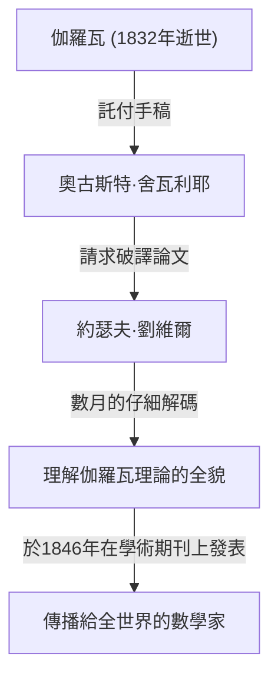

## 引言

在數學史上，19世紀是分析學和代數學發展成現代形式的關鍵時期。處於這一運動中心的是法國數學家 **約瑟夫·劉維爾** （Joseph [Liouville](https://kenji.blog/zh-tw/p/liouville/)，1809–1882）。他在複分析領域確立了基礎定理，並且是人類歷史上第一個具體證明「超越數」存在的人。他同樣以破譯並出版[埃瓦里斯特·伽羅瓦](https://kenji.blog/zh-tw/p/galois/)艱深的手稿的恩人身份而聞名。在本文中，我們將深入探討劉維爾波瀾壯闊的一生及其眾多的 **數學成就** 。

## 早年生活與教育

約瑟夫·劉維爾於1809年3月24日出生在法國加來海峽省的聖奧梅爾。他的父親是一名在拿破崙軍隊服役的軍人。在童年早期，他跟隨父親的調動四處奔波，但最終定居巴黎，在那裡他有機會接受了極好的教育。

1825年，他進入了享有盛譽的 **巴黎綜合理工學院** （École Polytechnique），在那裡他向那個時代最傑出的數學家們學習。隨後他又進入 **國立橋路學校** （École des Ponts et Chaussées）學習土木工程，但他的心始終嚮往純數學。最終，他放棄了工程師的職業，堅定地踏上了數學之路。

## 拯救伽羅瓦的手稿

在討論劉維爾時，不能不提他如何拯救年輕天才 **[埃瓦里斯特·伽羅瓦](https://kenji.blog/zh-tw/p/galois/)** （[Évariste Galois](https://kenji.blog/zh-tw/p/galois/)）手稿的故事。伽羅瓦在20歲時因決鬥英年早逝，但在死前，他將自己的數學發現託付給了朋友奧古斯特·舍瓦利耶。

正是劉維爾為被長期忽視和誤解的伽羅瓦理論帶來了曙光。1843年，他徹底研究了伽羅瓦的論文，並意識到其中包含了關於代數方程可解性的極其重要的發現。1846年，劉維爾在自己創辦的學術期刊《純粹與應用數學雜誌》（Journal de Mathématiques Pures et Appliquées）上發表了伽羅瓦的論文，從而將其展示給了全世界。

## 數學成就

### 1. 複分析中的劉維爾定理

劉維爾在複分析領域最偉大的貢獻是 **劉維爾定理** 。該定理指出：「任何在整個複平面上全純且有界的函數，必定是常數函數。」

用數學公式嚴格表達，如果函數 $f(z)$ 是整函數，並且存在一個正實數 $M$，使得對於所有的 $z \in \mathbb{C}$，都有 $|f(z)| \leq M$，那麼 $f(z)$ 是一個常數。

$$
\text{如果 } f(z) \text{ 是一個有界整函數，那麼 } f(z) = C \text{ (常數)。}
$$

這個定理驚人地強大，被用來為[代數基本定理](https://kenji.blog/zh-tw/p/fundamental-theorem-of-algebra/)（指出每個具有複係數的非非零一元多項式至少有一個複數根）提供極其簡潔的證明。

### 2. 超越數與劉維爾數的發現

直到19世紀上半葉，數學界一個主要的未解之謎是：「超越數（不是任何具有有理係數的非零多項式方程的根的複數）存在嗎？」1844年，劉維爾證明了滿足特定條件的實數是超越數，從而在人類歷史上首次構造了具體的超越數。這些被稱為 **劉維爾數** 。

劉維爾數被定義為可以被有理數「極好地近似」的無理數。代表性的劉維爾常數 $L$ 定義如下：

$$
L = \sum_{n=1}^{\infty} 10^{-n!} = 0.110001000000000000000001000\dots
$$

在這個數字中，在對應於 $1!$, $2!$, $3!$, $4!$ $\dots$ 的小數位上是 $1$，其他地方都是 $0$。劉維爾證明了 **劉維爾逼近定理** ，該定理指出「任何代數無理數能被有理數近似的精度是有限度的」。然後他證明了超過這個限度的上述數字 $L$，不能是代數數（因此是超越數）。

### 3. 斯圖姆-劉維爾理論

與同時代的數學家查爾斯-弗朗索瓦·斯圖姆一起，劉維爾建立了關於二階線性常微分方程邊界值問題的一般理論。這被稱為 **斯圖姆-劉維爾理論** 。

該理論提供了一個強大的框架，用於處理在使用分離變量法求解偏微分方程（如熱傳導方程和波動方程）時出現的特徵值問題。標準的斯圖姆-劉維爾方程如下所示：

$$
-\frac{d}{dx} \left( p(x) \frac{dy}{dx} \right) + q(x)y = \lambda w(x)y
$$

在這裡，$\lambda$ 是特徵值，$w(x)$ 是權重函數。他們的理論證明了對應於不同特徵值的特徵函數具有正交性，從而為現代量子力學和應用數學中的泛函分析奠定了基礎。

### 4. 其他貢獻

劉維爾在許多不同領域都有以他名字命名的定理。這些包括 **微分伽羅瓦理論中的劉維爾定理** （用於決定初等函數的原函數是否可以再次表示為初等函數），以及他在動力系統中表明相空間體積守恆的定理。

## 作為教育家和編輯的貢獻

劉維爾不僅通過自己的研究，而且為數學界的發展做出了重大貢獻。1836年，他創辦了《純粹與應用數學雜誌》。這本雜誌通常簡稱為「劉維爾雜誌」，至今仍作為法國一流的數學期刊出版。

此外，他還在巴黎綜合理工學院和法蘭西公學院擔任教授，培養了許多年輕的數學家。他的講課以令人難以置信的嚴謹和充滿激情而聞名，深深地啟發了他的學生們。

## 晚年與遺產

劉維爾將他的一生獻給了數學。他也曾短暫參與政治活動，在1848年法國大革命期間被選為制憲會議成員，但在隨後的一次選舉中落敗後，他又回到了學術界。

1882年9月8日，約瑟夫·劉維爾在巴黎逝世。他留下的定理和概念不僅對純數學，而且對物理學和工程學的進步都變得至關重要。特別是，如果他沒有拯救伽羅瓦的手稿，現代代數的發展很可能會推遲幾十年。

他的貢獻至今備受推崇，他的名字被銘刻在歷史中，包括月球上的一個隕石坑為了紀念他而被命名為「劉維爾」。

