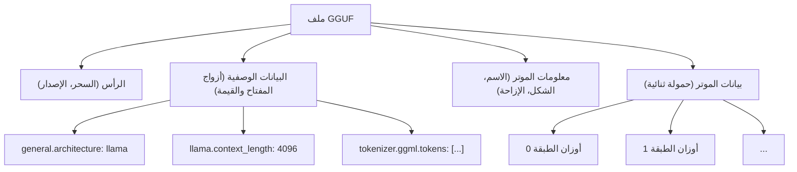
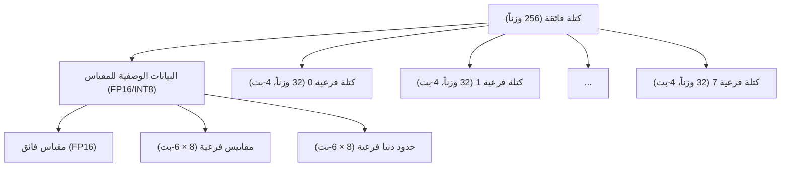
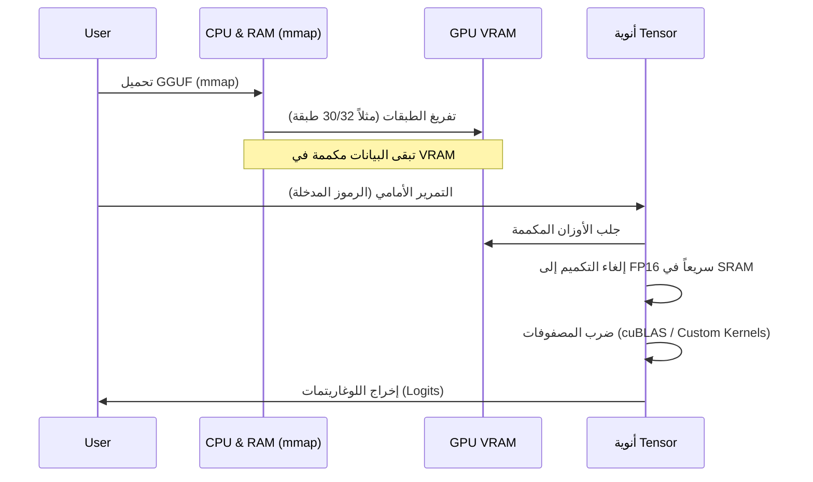

## 1. مقدمة: لماذا تحتاج النماذج اللغوية الكبيرة (LLM) إلى التكميم (Quantization)؟

التطور الأخير في النماذج اللغوية الكبيرة (LLMs) ملحوظ بشكل كبير، ولكن خلف الكواليس ظهرت مشاكل خطيرة تتمثل في "استنفاد الموارد الحسابية" و"عنق الزجاجة في النطاق الترددي للذاكرة". على سبيل المثال، إذا تم تحميل نموذج يحتوي على 70 مليار (70B) معلمة مثل Llama 3 في الذاكرة باستخدام النقطة العائمة القياسية 16 بت (FP16)، فإنه يستهلك حوالي 140 جيجابايت من VRAM/RAM للمعلمات فقط. وإذا أضفنا سياق الاستدلال (ذاكرة التخزين المؤقت KV)، فلن يعمل إلا إذا تم ربط وحدات معالجة رسومات (GPU) متطورة مخصصة لمراكز البيانات (مثل NVIDIA A100 80GB أو H100 80GB) في مجموعة (Cluster).

كمنقذ لتمكين تشغيل النماذج اللغوية الكبيرة للمطورين الأفراد وعلى الأجهزة الطرفية (مثل أجهزة MacBook وأجهزة الكمبيوتر الشخصية المخصصة للألعاب)، ظهرت **llama.cpp** وفي صميمها **تقنية التكميم (Quantization)**. وبشكل خاص، تعد صيغة الملفات **GGUF (GPT-Generated Unified Format)** وخوارزمية التكميم المتقدمة القائمة على الكتل والتي تسمى **k-quants**، نهجًا ثوريًا يضغط حجم النموذج إلى أجزاء صغيرة من حجمه الأصلي، مع الحد من تدهور دقة النموذج (Perplexity) إلى أدنى مستوى ممكن.

في هذه المقالة، سنشرح بالتفصيل تقنية التكميم في llama.cpp بدءًا من خلفيتها الرياضية، والاختلافات عن صيغة GGML، والهيكل التفصيلي لصيغة GGUF، وصولاً إلى الآلية الداخلية لـ k-quants.

---

## 2. الأساس الرياضي للتكميم (Quantization)

في سياق النماذج اللغوية الكبيرة، يشير التكميم إلى عملية تعيين القيم المستمرة (أو أرقام النقطة العائمة عالية الدقة) إلى قيم منفصلة بعدد بتات أقل (مثل INT8 و INT4 و INT3 وما إلى ذلك).

### 2.1. المعادلة الأساسية للتكميم الخطي

النهج الأبسط هو التكميم الخطي (تكميم Min-Max). لنفترض أن موتر الوزن (Weight Tensor) الأصلي عالي الدقة هو $W$، وموتر الأعداد الصحيحة المكمم هو $W_q$.

$$ W_q = \text{round}\left( \frac{W}{S} \right) + Z $$

حيث:
- $S$ هو **عامل المقياس (Scale Factor)**، والذي يحدد حجم الخطوة (الدقة) للتكميم.
- $Z$ هي **نقطة الصفر (Zero-point)**، وهي قيمة انحياز تستخدم لإزاحة القيمة التي سيقابلها الرقم الحقيقي $0.0$ كقيمة صحيحة بعد التكميم.
- $\text{round}(\cdot)$ هي دالة التقريب إلى أقرب عدد صحيح.

من خلال إلغاء التكميم (Dequantization)، نقوم باستعادة الوزن الحقيقي التقريبي $\tilde{W}$ أثناء الاستدلال.

$$ \tilde{W} = S \times (W_q - Z) $$

### 2.2. التكميم المتماثل مقابل التكميم غير المتماثل

بناءً على كيفية التعامل مع نقطة الصفر $Z$، ينقسم الأمر بشكل أساسي إلى طريقتين:

1. **التكميم غير المتماثل (Asymmetric Quantization)**
   يتم التعيين باستخدام الحد الأدنى $W_{\min}$ والحد الأقصى $W_{\max}$ للبيانات.
   $$ S = \frac{W_{\max} - W_{\min}}{2^b - 1}, \quad Z = \text{round}\left(-\frac{W_{\min}}{S}\right) $$
   حيث $b$ هو عدد بتات التكميم (مثال: إذا كان 4 بت، فإن $2^4-1 = 15$). نظرًا لوجود حاجة للاحتفاظ بـ $Z$، يزداد العبء الحسابي والذاكرة قليلاً.

2. **التكميم المتماثل (Symmetric Quantization)**
   يتم التعيين حول الصفر باستخدام الحد الأقصى للقيمة المطلقة للبيانات ($Z=0$).
   $$ S = \frac{\max(|W_{\max}|, |W_{\min}|)}{2^{b-1} - 1}, \quad Z = 0 $$
   اعتمدت عمليات التكميم المبكرة في llama.cpp (مثل Q4_0 القديم) التكميم المتماثل، ونظرًا لعدم وجود حد $Z$، فإن لها ميزة تسريع حسابات الضرب النقطي بشكل كبير باستخدام تعليمات SIMD.

---

## 3. التطور من GGML إلى GGUF وهيكل الملف

عند الحديث عن llama.cpp، لا يمكننا تجاهل مكتبة عمليات الموترات (Tensor) المكتوبة بلغة C++ **GGML**، وصيغة الملفات المشتقة منها **GGUF**.

### 3.1. تحديات GGML

كانت الإصدارات الأولى من llama.cpp تستخدم صيغة `ggml` (ومتغيراتها مثل `ggjt`). ومع ذلك، كانت تعاني من المشاكل التالية:
- **نقص قابلية التوسع:** كانت الأرقام السحرية (Magic numbers) والمعلمات الفائقة مبرمجة بشكل ثابت (Hardcoded) بطول وترتيب ثابتين، مما أدى إلى تغييرات جذرية مع كل إضافة لهندسة نموذج جديدة (مثل: Llama و Falcon و Mixtral وما إلى ذلك) أو رمز مميز (Tokenizer) جديد.
- **فقدان التوافقية مع الإصدارات السابقة:** تم تحديث الصيغة بشكل متكرر، مما أدى غالبًا إلى حالات لا يمكن فيها قراءة ملفات النماذج القديمة بواسطة أحدث إصدارات llama.cpp.

### 3.2. ولادة صيغة GGUF

تم تقديم **GGUF** في أغسطس 2023، وهي صيغة عالية التنوع مصممة لحل هذه المشكلات. أكبر ميزة لها هي اعتمادها على **هيكل بيانات وصفية (Metadata) يعتمد على المفتاح والقيمة (Key-Value)**.

يوضح مخطط Mermaid التالي الشكل المجرد لهيكل ملف GGUF.



**المزايا الرئيسية لـ GGUF:**
1. **المرونة:** يتم تخزين جميع المعلمات الفائقة للنموذج، وإعدادات RoPE (Rotary Positional Embedding)، وبيانات مفردات الرموز (Tokenizer) كأزواج مفتاح-قيمة مسماة. يتم تجاهل المفاتيح غير المعروفة، مما يجعل إضافة ميزات جديدة أمراً سهلاً.
2. **الاستقلالية عن ترتيب البايتات (Endianness):** تعتمد GGUF على ترتيب البايتات الصغير (Little-endian) بشكل افتراضي، ولكنها تحتوي صراحة على علامة (Flag) للترتيب، مما يجعلها قابلة للنقل بأمان عبر البنى المختلفة.
3. **التحسين لـ mmap (تخطيط الذاكرة):** تتم محاذاة (Padding) بيانات الموتر عند حدود معينة، ويمكن تعيينها مباشرة من القرص إلى مساحة الذاكرة باستخدام استدعاء النظام `mmap()` في نظام التشغيل. ونتيجة لذلك، يصبح وقت التهيئة لتحميل النموذج فعليًا صفراً.

---

## 4. أعماق k-quants: التكميم المتقدم القائم على الكتل

الجوهر الحقيقي لصيغة GGUF هو آلية **k-quants (K-quantization)** المسؤولة عن ضغط أوزان النموذج.

عادةً، تقترب أوزان الشبكات العصبية من التوزيع الطبيعي عند النظر إلى الطبقة ككل، ولكن توجد محلياً قيم متطرفة (Outliers). إذا قمنا بتكميم أوزان الطبقة بأكملها باستخدام عامل مقياس $S$ موحد، فإن القيم المتطرفة ستسحب المقياس، وسيتم فقدان معلومات الأوزان الصغيرة تمامًا.

لمنع ذلك، تقوم llama.cpp بتنفيذ **التكميم القائم على الكتل (Block-wise Quantization)**. يتم تقسيم موتر الأوزان إلى كتل صغيرة (مثلاً 32 عنصرًا أو 256 عنصرًا)، وتحصل كل كتلة على عامل مقياس (ونقطة صفر) خاص بها.

### 4.1. حدود التكميم القديم (Q4_0, Q4_1)

كان `Q4_0` الأولي يستخدم 32 وزنًا من نوع FP16 ككتلة واحدة، ويتشارك عامل مقياس FP16 واحد.
- حجم الكتلة: 32
- الذاكرة: 1 مقياس (16 بت) + 32 وزنًا بـ 4-بت (128 بت) = 144 بت
- عدد البتات الفعال لكل عنصر (bpw: bits per weight): $144 / 32 = 4.5$ bpw

على الرغم من أن هذا ممتاز، إلا أن حدود الدقة ونسبة الضغط أصبحت واضحة. هنا ظهرت **k-quants** بهيكل هرمي أكثر تعقيدًا وتطوراً.

### 4.2. الهيكل الهرمي للكتل الفائقة والكتل الفرعية (مثال Q4_K_M)

تمتلك k-quants هيكلاً هرمياً يتكون من "كتل فائقة (Super-block)" كبيرة، و"كتل فرعية (Sub-block)" أصغر مضمنة بداخلها. بفضل هذا، يتم تكميم البيانات الوصفية (مثل قيم المقياس) نفسها، مما يقلل bpw إلى أقصى حد مع الحفاظ على الدقة.

لنلقِ نظرة على هيكل **Q4_K_M**، وهو الإعداد الأكثر شيوعًا. يستخدم Q4_K_M كتلة فائقة مكونة من 256 عنصرًا.



يتم تعريف البنية الفعلية في C++ (GGML) بشكل مفاهيمي على النحو التالي:

```cpp
// الهيكل المفاهيمي لـ block_q4_K في llama.cpp
#define QK_K 256

struct block_q4_K {
    uint8_t d[2];          // المقياس الفائق للكتلة الفائقة بأكملها (مثل FP16 x 2)
    uint8_t scales[12];    // بيانات مجمعة تحتوي على مقياس 6-بت والحد الأدنى 6-بت (نقطة الصفر) لـ 8 كتل فرعية (32 عنصرًا لكل منها)
    uint8_t qs[QK_K/2];    // بيانات الأوزان المكممة بـ 4-بت (256 عنصرًا / 2 = 128 بايت)
};
```

**عملية إلغاء التكميم (Dequantization) الرياضية:**

يتم حساب القيمة الحقيقية التقريبية $\tilde{W}_{i, j}$ للعنصر $j$ ($0 \le j < 32$) داخل الكتلة الفرعية $i$ ($0 \le i < 8$) على النحو التالي:

$$ \tilde{W}_{i, j} = S_{\text{super}} \times s_i \times (w_{i, j} - m_i) $$

- $S_{\text{super}}$: مقياس النقطة العائمة للكتلة الفائقة بأكملها
- $s_i$: مقياس 6-بت المكمم للكتلة الفرعية $i$
- $m_i$: الحد الأدنى (نقطة الصفر) 6-بت المكمم للكتلة الفرعية $i$
- $w_{i, j}$: وزن التكميم 4-بت ($0 \dots 15$)

من خلال هذا الهيكل الهرمي، مع الحفاظ على القدرة على التكيف مع القيم المتطرفة، يتم تقليل مساحة الذاكرة التي تشغلها عوامل المقياس نفسها بشكل كبير. يحقق Q4_K_M إجماليًا يبلغ حوالي **4.8 bpw**.

### 4.3. خيارات k-quants المتنوعة

تقدم llama.cpp العديد من المتغيرات اعتمادًا على الغرض. تشير اللواحق (S, M, L) بعد "K" إلى الحجم.

| الصيغة | BPW (بت لكل وزن) | نظرة عامة والميزات |
| :--- | :---: | :--- |
| **Q2_K** | 2.5～3.3 | ضغط أقصى. انخفاض كبير في الدقة، لكنه مخصص للبيئات التي تحتوي على VRAM قليل جدًا. |
| **Q3_K_M** | 3.3 | المعيار لتكميم 3 بت. يتدهور أكثر من Q4 ولكنه غالباً ما يبقى ضمن الحدود المقبولة. |
| **Q4_K_M** | 4.8 | **النقطة المثالية الموصى بها**. يوازن بين خفض حجم النموذج إلى النصف والحفاظ على الدقة. |
| **Q5_K_M** | 5.5 | عندما تتطلب دقة أعلى. يمثل موقعاً وسطاً بين Q4 و FP16. |
| **Q6_K** | 6.6 | يحافظ على Perplexity (حيرة) متطابقة تقريبًا مع FP16، لكن حجم الملف أكبر. |
| **Q8_0** | 8.5 | يعادل INT8. يستخدم بشكل رئيسي للموترات الوسيطة أثناء الاستدلال، أو في الطبقة الأخيرة فقط. |

※ يتم متوسط BPW الفعلي عبر النموذج بأكمله نظرًا لأنه يتم تطبيق التكميم المختلط (Mixed Quantization) اعتمادًا على موترات النموذج (على سبيل المثال، إسقاط Q/K/V في Attention، أو أوزان FFN). داخلياً يتم إجراء تحسينات مثل تكميم الموترات المهمة بـ Q6 والباقي بـ Q4.

---

## 5. تحسين أداء الاستدلال: تعليمات SIMD ومعمارية CUDA

مجرد تحميل نموذج GGUF في الذاكرة لن يؤدي إلى تسريع الاستدلال. يمثل الجزء الأكبر من الاستدلال في النماذج اللغوية الكبيرة "ضرب المصفوفات (Matrix-Vector Multiplication، واختصاراً GEMV، أو Matrix-Matrix، GEMM)". المفتاح هو كيفية تسريع عمليات الضرب والجمع بين الأوزان المكممة والتنشيطات (بيانات الإدخال) المحفوظة بتنسيق FP16 (أو FP32).

### 5.1. استخدام تعليمات SIMD في بيئة وحدة المعالجة المركزية (CPU)

السرعة المذهلة التي تفتخر بها llama.cpp في استدلال وحدة المعالجة المركزية (CPU) ترجع إلى تحسين **SIMD (Single Instruction, Multiple Data)** على مستوى التجميع (Assembly).
على سبيل المثال، تستفيد بشكل كامل من مجموعات تعليمات **AVX2** أو **AVX-512** على معالجات Intel/AMD، وتعليمات **ARM NEON** على Apple Silicon.

أثناء الاستدلال، لا يتم إرجاع $W_q$ إلى FP32 (إلغاء التكميم) أولاً ثم إجراء الضرب.
بل يتم تكميم جانب التنشيطات ديناميكياً (Dynamic Quantization، عادةً إلى INT8) على مستوى الكتلة، ويتم حساب العمليات الصحيحة لـ **INT8 $\times$ INT4** دفعة واحدة باستخدام تعليمات الضرب النقطي الخاصة بـ SIMD (مثل: `vdpaddd` أو `_mm256_madd_epi16`). بفضل ذلك، في المتراكم النهائي (Accumulator)، يتم تحويل القيم مرة أخرى إلى FP32 وضربها في عامل المقياس، مما يحقق إنتاجية مذهلة (Throughput).

### 5.2. التفريغ (Offload) في بيئة GPU (cuBLAS / CUDA)

لم تعد llama.cpp تقتصر على دعم CPU فحسب، بل توفر أيضًا دعمًا قويًا لوحدات معالجة الرسومات من NVIDIA (CUBLAS / CUDA).
من الممكن تفريغ جزء من طبقات ملف GGUF أو جميعها إلى VRAM (خيار `--n-gpu-layers`).



عند الحساب على GPU، يكون النطاق الترددي للذاكرة (Memory Bandwidth) لـ VRAM هو العائق الأكبر. وبما أن الأوزان مضغوطة بتقنية k-quants، يتم تقليل كمية نقل البيانات من VRAM إلى وحدات الحساب في GPU (SM: Streaming Multiprocessor أو أنوية Tensor) إلى 1/3 ~ 1/4. في اللحظة التي تصل فيها الأوزان إلى وحدة الحساب، يتم إلغاء تكميمها (فك ضغطها) سريعًا إلى FP16، ويتم تنفيذ ضرب المصفوفات بسرعة فائقة باستخدام Tensor Core.
بعبارة أخرى، يمكن القول إن التكميم يتم **"ليس لتقليل حجم العمليات الحسابية" بل "لتقليل كمية نقل البيانات من الذاكرة"**.

---

## 6. أمثلة عملية لمقايضة (Trade-off) بين استهلاك الذاكرة والأداء

هنا، لنأخذ نموذج Llama 3 8B كمثال لنتعرف على المواصفات المطلوبة بناءً على مستوى تكميم GGUF. (الأرقام هي قيم تقريبية)

| النموذج/التكميم | حجم الملف | VRAM/RAM المطلوب | سرعة الاستدلال (تقريبية) | تدهور Perplexity |
| :--- | :--- | :--- | :--- | :--- |
| **Llama-3-8B (FP16)** | حوالي 16 GB | 18 GB أو أكثر | الأساس | لا يوجد (الأساس) |
| **Llama-3-8B (Q8_0)** | حوالي 8.5 GB | 10 GB أو أكثر | سريعة | شبه معدوم |
| **Llama-3-8B (Q6_K)** | حوالي 6.6 GB | 8 GB أو أكثر | سريعة جداً | ضئيل جداً |
| **Llama-3-8B (Q4_K_M)** | حوالي 4.9 GB | 6.5 GB أو أكثر | الأسرع والأمثل | ضمن الحدود، ضئيل |
| **Llama-3-8B (Q3_K_M)** | حوالي 3.9 GB | 5.5 GB أو أكثر | الأسرع | ملحوظ قليلاً |
| **Llama-3-8B (Q2_K)** | حوالي 3.0 GB | 4.5 GB أو أكثر | سريعة | تدهور واضح |

**ملاحظة هامة (تأثير ذاكرة التخزين المؤقت KV):**
في استدلال النماذج اللغوية الكبيرة، كلما زاد طول السياق (عدد الرموز في الموجه)، لا تزيد الأوزان فحسب بل يزداد استهلاك الذاكرة بشكل انفجاري بسبب **ذاكرة التخزين المؤقت KV (KV Cache)** التي تحفظ حالة الانتباه (Attention) السابقة.
على سبيل المثال، إذا كان طول السياق 8192 رمزاً، ستستهلك ذاكرة KV وحدها عدة جيجابايتات. ولذلك، في الاستخدام الفعلي، من الضروري الاحتفاظ بهامش إضافي (Headroom) يعادل `حجم ملف النموذج + حوالي 1.5GB إلى 3GB`. السبب في التوصية بـ Q4_K_M هو أنه حتى مع تخصيص مساحة لـ KV Cache، فإنه يوفر توازناً مثالياً يسمح بتشغيل آمن على بطاقات الرسومات الشائعة المزودة بـ 8GB VRAM (مثل RTX 3060 / 4060).

في الإصدارات الأخيرة من llama.cpp، تمت إضافة **ميزة تكميم ذاكرة التخزين المؤقت KV بحد ذاتها إلى Q8_0 أو Q4_0**، وهناك جهود مستمرة لزيادة طول السياق بشكل أكبر.

---

## 7. الخاتمة

في هذه المقالة، قمنا بالتعمق في الهيكل الداخلي لصيغة GGUF وتقنية تكميم k-quants، والتي تعد قلب llama.cpp النابض.

1. **مرونة GGUF:** بفضل هيكل البيانات الوصفية الذي يعتمد على المفتاح والقيمة، تم بناء نظام بيئي قوي يمكنه مواكبة التطور السريع للنماذج اللغوية الكبيرة (وظهور بنيات نماذج جديدة) دون تغييرات جذرية تدمر التوافق.
2. **ضغط أقصى مع k-quants:** من خلال إدارة عامل المقياس بشكل هرمي عبر الكتل الفائقة والكتل الفرعية، أمكن تحقيق ضغط مذهل بمتوسط 4.8 بت لكل وزن (Q4_K_M) مع الحفاظ على معلومات القيم المتطرفة.
3. **تجاوز عنق الزجاجة في النطاق الترددي للذاكرة:** من خلال تنفيذ تطبيقات Kernel متقدمة في SIMD و CUDA، أتاح إجراء الحسابات مع إلغاء التكميم سريعاً (On-the-fly) تقليل كمية نقل بيانات VRAM، مما أدى إلى تحسين سرعة الاستدلال بشكل كبير.

إن القوة التقنية لـ llama.cpp، والتي تدفع نحو ديمقراطية الذكاء الاصطناعي، تتجاوز كونها مجرد أداة ويمكن القول إنها من أرقى قمم هندسة البرمجيات الحديثة. من خلال فهم خوارزمية التكميم وآلية صيغة GGUF، ستتمكن من اختيار النموذج الأنسب لبيئتك وإجراء ضبط الأداء بدقة أكبر.

### روابط مرجعية
- [مستودع llama.cpp على GitHub](https://github.com/ggerganov/llama.cpp)
- [مواصفات صيغة GGUF](https://github.com/ggerganov/ggml/blob/master/docs/gguf.md)
- [طلب السحب (PR) الخاص بتنفيذ K-quants](https://github.com/ggerganov/llama.cpp/pull/1684)

(النهاية)
