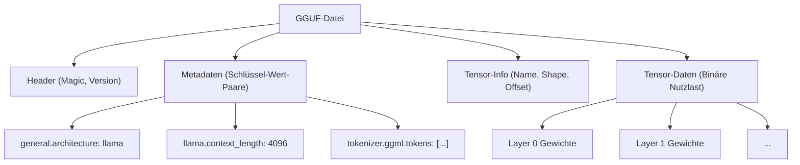
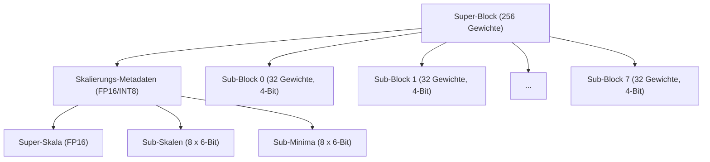
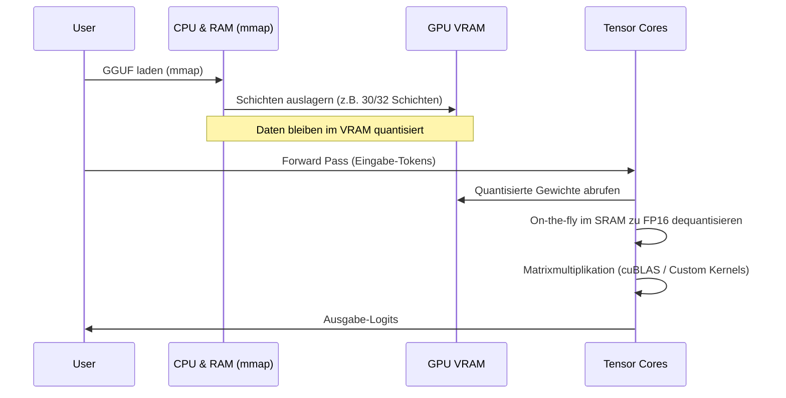

## 1. Einführung: Warum benötigen LLMs Quantisierung?

Die Entwicklung von großen Sprachmodellen (LLM: Large Language Models) in den letzten Jahren war bemerkenswert, aber im Hintergrund sind ernsthafte Probleme aufgetreten: "Erschöpfung der Rechenressourcen" und "Engpässe bei der Speicherbandbreite". Wenn beispielsweise ein Modell mit 70B (70 Milliarden) Parametern wie Llama 3 im standardmäßigen 16-Bit-Gleitkommaformat (FP16) in den Speicher geladen wird, verbrauchen allein die Parameter etwa 140 GB VRAM/RAM. Wenn der Kontext (KV-Cache) während der Inferenz hinzugefügt wird, funktioniert dies nicht, ohne mehrere High-End-GPUs für Rechenzentren (wie NVIDIA A100 80GB oder H100 80GB) in einem Cluster zusammenzufassen.

Als Retter für die Ausführung von LLMs auf Edge-Geräten (wie MacBooks oder gängigen Gaming-PCs) für einzelne Entwickler tauchten **llama.cpp** und seine Kerntechnologie, die **Quantisierung (Quantization)**, auf. Insbesondere das Dateiformat **GGUF (GPT-Generated Unified Format)** und ein fortschrittlicher blockbasierter Quantisierungsalgorithmus namens **k-quants** sind bahnbrechende Methoden, die die Modellgröße auf einen Bruchteil komprimieren, während die Verschlechterung der Modellgenauigkeit (Perplexity) so gering wie möglich gehalten wird.

In diesem Artikel werden wir alles vom mathematischen Hintergrund der Quantisierung in llama.cpp über die Unterschiede zum GGML-Format und die detaillierte Struktur des GGUF-Formats bis hin zu den internen Mechanismen von k-quants ausführlich erklären.

---

## 2. Mathematische Grundlagen der Quantisierung

Im Kontext von LLMs bezieht sich Quantisierung auf den Vorgang, kontinuierliche Werte (oder hochpräzise Gleitkommazahlen) auf diskrete Werte mit einer geringeren Anzahl von Bits (wie INT8, INT4, INT3) abzubilden.

### 2.1. Grundlegende Formeln der linearen Quantisierung

Der einfachste Ansatz ist die lineare Quantisierung (Min-Max-Quantisierung). Sei der ursprüngliche hochpräzise Gewichtstensor $W$ und der quantisierte Ganzzahl-Tensor $W_q$.

$$ W_q = \text{round}\left( \frac{W}{S} \right) + Z $$

Hierbei ist:
- $S$ der **Skalierungsfaktor (Scale Factor)**, der die Schrittgröße (Auflösung) der Quantisierung bestimmt.
- $Z$ der **Nullpunkt (Zero-point)**, ein Bias-Wert, um zu verschieben, welchem ganzzahligen Wert nach der Quantisierung die reelle Zahl $0.0$ entspricht.
- $\text{round}(\cdot)$ die Funktion zur Rundung auf die nächste Ganzzahl.

Durch inverse Quantisierung (Dequantization) wird während der Inferenz ein ungefähres reelles Gewicht $\tilde{W}$ wiederhergestellt.

$$ \tilde{W} = S \times (W_q - Z) $$

### 2.2. Symmetrische vs. asymmetrische Quantisierung

Abhängig von der Behandlung des Nullpunkts $Z$ gibt es im Wesentlichen zwei Methoden.

1. **Asymmetrische Quantisierung (Asymmetric Quantization)**
   Mappt die Daten unter Verwendung des Minimalwerts $W_{\min}$ und des Maximalwerts $W_{\max}$.
   $$ S = \frac{W_{\max} - W_{\min}}{2^b - 1}, \quad Z = \text{round}\left(-\frac{W_{\min}}{S}\right) $$
   Hier ist $b$ die Anzahl der Quantisierungsbits (z.B. für 4 Bit ist $2^4-1 = 15$). Da $Z$ beibehalten werden muss, erhöht sich der Rechen- und Speicher-Overhead geringfügig.

2. **Symmetrische Quantisierung (Symmetric Quantization)**
   Verwendet den maximalen absoluten Wert der Daten, um sie um Null herum abzubilden ($Z=0$).
   $$ S = \frac{\max(|W_{\max}|, |W_{\min}|)}{2^{b-1} - 1}, \quad Z = 0 $$
   Frühe Quantisierungen in llama.cpp (wie das Legacy Q4_0) verwendeten eine symmetrische Quantisierung. Da es keinen $Z$-Term gibt, hat dies den Vorteil, dass die Berechnung des inneren Produkts mit SIMD-Befehlen stark beschleunigt wird.

---

## 3. Entwicklung von GGML zu GGUF und Dateistruktur

Bei der Diskussion über llama.cpp sind die in C++ geschriebene Tensor-Berechnungsbibliothek **GGML** und das daraus abgeleitete Dateiformat **GGUF** unerlässlich.

### 3.1. Probleme mit GGML

Frühe Versionen von llama.cpp verwendeten das `ggml`-Format (und Varianten wie `ggjt`). Diese hatten jedoch die folgenden Probleme:
- **Fehlende Erweiterbarkeit:** Magische Zahlen und Hyperparameter waren mit fester Länge und Reihenfolge hartcodiert, was bei jedem Hinzufügen einer neuen Modellarchitektur (z. B. Llama, Falcon, Mixtral usw.) oder eines neuen Tokenizers zu Breaking Changes führte.
- **Verlust der Abwärtskompatibilität:** Formate wurden häufig aktualisiert, was oft dazu führte, dass ältere Modelldateien in neueren Versionen von llama.cpp nicht mehr geladen werden konnten.

### 3.2. Die Geburt des GGUF-Formats

Das im August 2023 eingeführte **GGUF** ist ein äußerst vielseitiges Format, das zur Lösung dieser Probleme entwickelt wurde. Sein Hauptmerkmal ist die Einführung einer **Metadatenstruktur basierend auf Schlüssel-Wert-Paaren (Key-Value)**.

Das folgende Mermaid-Diagramm ist eine abstrahierte Darstellung der GGUF-Dateistruktur.



**Hauptvorteile von GGUF:**
1. **Flexibilität:** Modell-Hyperparameter, RoPE (Rotary Positional Embedding)-Einstellungen, Tokenizer-Vokabulardaten usw. werden alle als benannte Key-Value-Paare gespeichert. Unbekannte Schlüssel werden ignoriert, was das Hinzufügen neuer Funktionen erleichtert.
2. **Endian-Unabhängigkeit:** GGUF verwendet standardmäßig Little-Endian, verfügt jedoch über ein explizites Flag, sodass es sicher portabel zwischen verschiedenen Architekturen ist.
3. **Optimierung für mmap (Memory Mapping):** Tensor-Daten werden an bestimmten Grenzen ausgerichtet (Padding) und können über den `mmap()`-Systemaufruf des Betriebssystems direkt von der Festplatte in den Speicherraum abgebildet werden. Dadurch wird die Initialisierungszeit für das Laden des Modells praktisch auf Null reduziert.

---

## 4. Die Tiefen von k-quants: Fortgeschrittene blockbasierte Quantisierung

Das wahre Herzstück des GGUF-Formats ist der Mechanismus **k-quants (K-quantization)**, der für die Komprimierung der Modellgewichte verantwortlich ist.

Die Gewichte eines normalen neuronalen Netzwerks haben eine Form, die über die gesamte Schicht hinweg fast einer Normalverteilung entspricht, aber lokal gibt es Ausreißer (Outliers). Wenn man die Gewichte der gesamten Schicht mit einem einheitlichen Skalierungsfaktor $S$ quantisiert, gehen Informationen über kleine Gewichte aufgrund des Einflusses der Ausreißer vollständig verloren.

Um dies zu verhindern, führt llama.cpp eine **blockbasierte Quantisierung (Block-wise Quantization)** durch. Der Gewichtstensor wird in kleine Blöcke (z.B. 32 oder 256 Elemente) unterteilt, und jeder Block hat einen eigenen spezifischen Skalierungsfaktor (und Nullpunkt).

### 4.1. Grenzen der Legacy-Quantisierung (Q4_0, Q4_1)

Das frühe `Q4_0` fasste 32 FP16-Gewichte in einem einzigen Block zusammen und teilte einen FP16-Skalierungsfaktor.
- Blockgröße: 32
- Speicher: 1 Skala (16 Bit) + 32 x 4-Bit-Gewichte (128 Bit) = 144 Bit
- Effektive Bits pro Gewicht (bpw: bits per weight): $144 / 32 = 4,5$ bpw

Dies ist bereits gut genug, aber die Grenzen von Genauigkeit und Kompressionsrate wurden sichtbar. Hier kam **k-quants** mit einer komplexeren und feineren hierarchischen Struktur ins Spiel.

### 4.2. Hierarchische Struktur von Super-Blöcken und Sub-Blöcken (Beispiel: Q4_K_M)

k-quants haben eine hierarchische Struktur mit großen "Super-Blöcken (Super-block)" und kleinen "Sub-Blöcken (Sub-block)" darin. Dadurch wird auch eine Quantisierung der Metadaten selbst (wie Skalierungswerte) durchgeführt, was die bpw auf das Äußerste senkt und gleichzeitig die Genauigkeit beibehält.

Schauen wir uns die Struktur von **Q4_K_M**, der beliebtesten Einstellung, an. Q4_K_M verwendet einen Super-Block mit 256 Elementen.



In C++ (GGML) ist die tatsächliche Struktur wie folgt definiert:

```cpp
// Konzeptionelle Struktur von block_q4_K in llama.cpp
#define QK_K 256

struct block_q4_K {
    uint8_t d[2];          // Super-Skala für den gesamten Super-Block (z. B. FP16 x 2)
    uint8_t scales[12];    // Gepackte Daten: 6-Bit-Skalen und 6-Bit-Minima (Nullpunkte) von 8 Sub-Blöcken (je 32 Elemente)
    uint8_t qs[QK_K/2];    // Auf 4-Bit quantisierte Gewichtsdaten (256 Elemente / 2 = 128 Bytes)
};
```

**Mathematischer Prozess der inversen Quantisierung (Dequantization):**

Der angenäherte reelle Wert $\tilde{W}_{i, j}$ des Elements $j$ ($0 \le j < 32$) im Sub-Block $i$ ($0 \le i < 8$) wird wie folgt berechnet:

$$ \tilde{W}_{i, j} = S_{\text{super}} \times s_i \times (w_{i, j} - m_i) $$

- $S_{\text{super}}$: Gleitkomma-Skalierung für den gesamten Super-Block
- $s_i$: Quantisierte 6-Bit-Skala für den Sub-Block $i$
- $m_i$: Quantisiertes 6-Bit-Minimum (Nullpunkt) für den Sub-Block $i$
- $w_{i, j}$: Quantisiertes 4-Bit-Gewicht ($0 \dots 15$)

Durch diese hierarchische Struktur wird die Speicherbelegung durch den Skalierungsfaktor drastisch reduziert, während die Anpassungsfähigkeit an Ausreißer erhalten bleibt. Q4_K_M erreicht insgesamt etwa **4,8 bpw**.

### 4.3. Verschiedene k-quants-Optionen

llama.cpp bietet je nach Zweck eine Vielzahl von Variationen. Die Suffixe (S, M, L) nach dem "K" geben die Größe an.

| Format | BPW (Bits pro Gewicht) | Übersicht und Eigenschaften |
| :--- | :---: | :--- |
| **Q2_K** | 2,5–3,3 | Extrem komprimiert. Die Genauigkeit nimmt erheblich ab, aber für Umgebungen mit extrem wenig VRAM gedacht. |
| **Q3_K_M** | 3,3 | Standard für 3-Bit-Quantisierung. Schlechter als Q4, liegt aber oft im akzeptablen Bereich. |
| **Q4_K_M** | 4,8 | **Empfohlener Sweet Spot**. Halbierung der Modellgröße bei gleichzeitiger Beibehaltung der Genauigkeit. |
| **Q5_K_M** | 5,5 | Wenn höhere Genauigkeit erforderlich ist. Zwischenposition zwischen Q4 und FP16. |
| **Q6_K** | 6,6 | Behält fast die gleiche Perplexity wie FP16 bei, hat aber eine größere Dateigröße. |
| **Q8_0** | 8,5 | Entspricht INT8. Wird hauptsächlich für Zwischentensoren bei der Inferenzberechnung und nur in der letzten Schicht verwendet. |

※ Die tatsächlichen BPW werden über das gesamte Modell gemittelt, da abhängig vom Tensor des Modells (z. B. Q/K/V-Projektion in der Attention oder FFN-Gewicht) eine gemischte Quantisierung (Mixed Quantization) durchgeführt wird. Wichtige Tensoren werden mit Q6 quantisiert, andere mit Q4, was intern als Optimierung stattfindet.

---

## 5. Leistungsoptimierung bei der Inferenz: SIMD und CUDA-Architektur

Einfach das GGUF-Modell in den Speicher zu laden, macht die Inferenz noch nicht schnell. Der Großteil der LLM-Inferenz besteht aus der "Matrix-Vektor-Multiplikation" (GEMV oder Matrix-Matrix, GEMM). Der Schlüssel liegt in der Beschleunigung der Multiply-Accumulate-Operationen zwischen den quantisierten Gewichten und den in FP16 (oder FP32) gehaltenen Aktivierungen (Eingabedaten).

### 5.1. Nutzung von SIMD-Befehlen in CPU-Umgebungen

Die erstaunliche Geschwindigkeit von llama.cpp bei der CPU-Inferenz liegt an der **SIMD-Optimierung (Single Instruction, Multiple Data)** auf Assembler-Ebene.
Beispielsweise nutzt es die **AVX2**- oder **AVX-512**-Befehlssätze auf Intel/AMD-CPUs und **ARM NEON** auf Apple Silicon vollständig aus.

Während der Inferenz wird $W_q$ nicht explizit zurück in FP32 konvertiert (dequantisiert), bevor die Multiplikation durchgeführt wird.
Auch die Aktivierungsseite wird dynamisch blockweise quantisiert (Dynamic Quantization, normalerweise nach INT8), und die Ganzzahl-Operationen **INT8 $\times$ INT4** werden auf einmal mithilfe spezieller SIMD-Skalarprodukt-Befehle (z. B. `vdpaddd` oder `_mm256_madd_epi16`) berechnet. Durch Konvertierung des endgültigen Akkumulators zurück nach FP32 und Multiplikation mit dem Skalierungsfaktor wird ein bemerkenswerter Durchsatz erzielt.

### 5.2. Offloading auf die GPU-Umgebung (cuBLAS / CUDA)

Neuere Versionen von llama.cpp unterstützen nicht nur CPUs, sondern bieten auch eine starke Unterstützung für NVIDIA-GPUs (CUBLAS / CUDA).
Es ist möglich, einen Teil oder alle Schichten der GGUF-Datei in den VRAM auszulagern (`--n-gpu-layers` Option).



Bei Berechnungen auf der GPU wird die Speicherbandbreite (Memory Bandwidth) des VRAM zum größten Engpass. Da die Gewichte mit k-quants komprimiert sind, reduziert sich die Datenübertragungsmenge vom VRAM zu den Recheneinheiten der GPU (SM: Streaming Multiprocessor oder Tensor Cores) auf 1/3 bis 1/4. In dem Moment, in dem die Gewichte die Recheneinheit erreichen, werden sie "on-the-fly" (im laufenden Betrieb) zu FP16 dequantisiert (entpackt), und die Matrixmultiplikation wird mithilfe von Tensor Cores extrem schnell durchgeführt.
Mit anderen Worten: Die Quantisierung erfolgt **nicht "um die Rechenmenge zu reduzieren", sondern "um die Speicherübertragungsmenge zu reduzieren"**.

---

## 6. Spezifisches Beispiel für den Kompromiss zwischen Speichernutzung und Leistung

Lassen Sie uns anhand des Modells Llama 3 8B die erforderlichen Spezifikationen für verschiedene Quantisierungsstufen in GGUF betrachten. (Die Zahlen sind ungefähre Richtwerte.)

| Modell / Quantisierung | Dateigröße | Benötigter VRAM/RAM | Inferenzgeschwindigkeit (Schätzung) | Perplexity-Verschlechterung |
| :--- | :--- | :--- | :--- | :--- |
| **Llama-3-8B (FP16)** | Ca. 16 GB | 18 GB oder mehr | Basislinie | Keine (Base) |
| **Llama-3-8B (Q8_0)** | Ca. 8,5 GB | 10 GB oder mehr | Schnell | Fast null |
| **Llama-3-8B (Q6_K)** | Ca. 6,6 GB | 8 GB oder mehr | Sehr schnell | Sehr klein |
| **Llama-3-8B (Q4_K_M)** | Ca. 4,9 GB | 6,5 GB oder mehr | Am schnellsten / Optimal | Akzeptabel / Gering |
| **Llama-3-8B (Q3_K_M)** | Ca. 3,9 GB | 5,5 GB oder mehr | Am schnellsten | Etwas auffällig |
| **Llama-3-8B (Q2_K)** | Ca. 3,0 GB | 4,5 GB oder mehr | Schnell | Deutliche Verschlechterung |

**Hinweis (Einfluss des KV-Caches):**
Bei der Inferenz mit LLMs nimmt der Speicherverbrauch des **KV-Caches**, der die vergangenen Attention-Zustände speichert, bei zunehmender Kontextlänge (Anzahl der Tokens in der Eingabeaufforderung) explosionsartig zu, nicht nur die Gewichte des Modells.
Wenn der Kontext beispielsweise 8192 Token beträgt, verbraucht allein der KV-Cache mehrere GB. Daher muss in der Praxis ein Spielraum (Headroom) von `Dateigröße des Modells + ca. 1,5 GB bis 3 GB` vorgesehen werden. Der Grund, warum Q4_K_M empfohlen wird, liegt darin, dass es genau die richtige Balance bietet, um sicher auf einer GPU mit 8 GB VRAM (wie RTX 3060 / 4060) zu laufen, selbst wenn dieser KV-Cache gesichert ist.

In den neueren Versionen von llama.cpp wurde auch eine Funktion zur **Quantisierung des KV-Caches selbst in Q8_0 oder Q4_0** hinzugefügt, und es werden kontinuierliche Anstrengungen unternommen, um die Kontextlänge weiter zu erhöhen.

---

## 7. Zusammenfassung

In diesem Artikel haben wir uns eingehend mit der internen Struktur des GGUF-Formats, dem Herzstück von llama.cpp, und der k-quants-Quantisierungstechnologie befasst.

1. **Flexibilität von GGUF:** Durch eine Metadatenstruktur vom Typ Schlüssel-Wert wurde ein robustes Ökosystem aufgebaut, das selbst bei schnellen Entwicklungen von LLMs (wie der Einführung neuer Modellarchitekturen) ohne Breaking Changes mithalten kann.
2. **Extreme Komprimierung durch k-quants:** Durch die hierarchische Verwaltung der Skalierungsfaktoren in Super-Blöcken und Sub-Blöcken wurde eine erstaunliche Komprimierung von durchschnittlich 4,8 Bit pro Gewicht (Q4_K_M) erreicht, während die Informationen der Ausreißer erhalten blieben.
3. **Behebung des Engpasses bei der Speicherbandbreite:** Durch die Reduzierung der VRAM-Übertragungsmenge durch "On-the-fly"-Dequantisierung und -Berechnung, ermöglicht durch fortschrittliche Kernel-Implementierungen in SIMD und CUDA, wurde die Inferenzgeschwindigkeit drastisch erhöht.

Die technologischen Fähigkeiten von llama.cpp, das die Demokratisierung der KI vorantreibt, sprengen den Rahmen eines bloßen Werkzeugs, und es ist keine Übertreibung zu sagen, dass es heute einen der Höhepunkte der Softwareentwicklung darstellt. Das Verständnis des Quantisierungsalgorithmus und der Mechanismen des GGUF-Formats wird Ihnen helfen, das optimale Modell für Ihre Umgebung genauer auszuwählen und das Performance-Tuning effizienter durchzuführen.

### Referenz-Links
- [llama.cpp GitHub Repository](https://github.com/ggerganov/llama.cpp)
- [GGUF Format Specification](https://github.com/ggerganov/ggml/blob/master/docs/gguf.md)
- [K-quants Implementation PR](https://github.com/ggerganov/llama.cpp/pull/1684)

(Ende)
