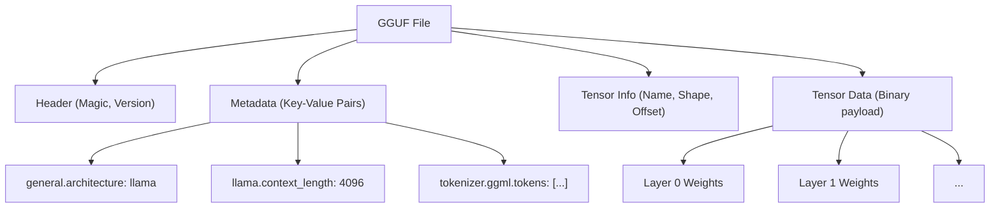
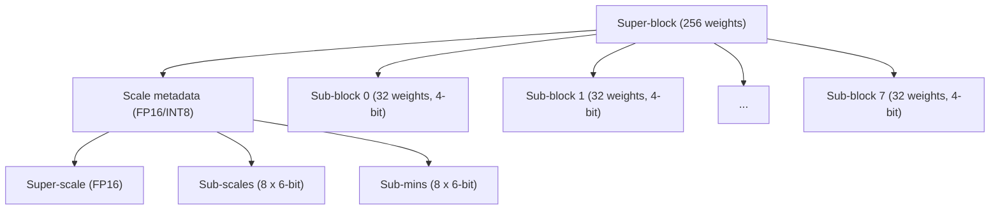
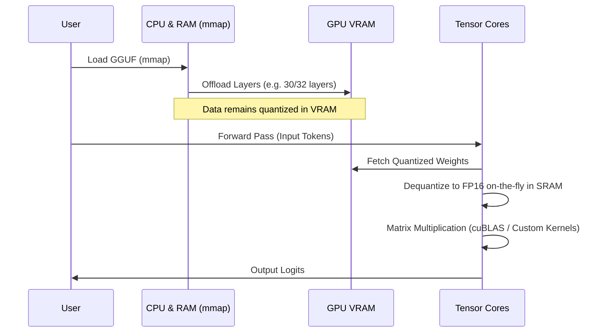

## 1. Introduction: Why Do LLMs Need Quantization?

The recent evolution of Large Language Models (LLMs) has been remarkable, but behind the scenes, serious problems of "exhaustion of computational resources" and "memory bandwidth bottlenecks" have emerged. For example, if a 70B (70 billion) parameter model like Llama 3 is loaded into memory in standard 16-bit floating-point (FP16), the parameters alone consume about 140GB of VRAM/RAM. When the context during inference (KV cache) is added to this, it will not run unless multiple high-end GPUs for data centers (such as NVIDIA A100 80GB or H100 80GB) are clustered together.

To save individual developers and edge devices (like MacBooks and standard gaming PCs) wanting to run LLMs, **llama.cpp** and its core **Quantization** technology appeared as a savior. In particular, the **GGUF (GPT-Generated Unified Format)** file format and the advanced block-wise quantization algorithm called **k-quants** are revolutionary methods that compress the model size to a fraction while minimizing the degradation of model accuracy (Perplexity).

This article thoroughly explains the mathematical background of quantization in llama.cpp, its differences from the GGML format, the detailed structure of the GGUF format, and the internal mechanisms of k-quants.

---

## 2. Mathematical Foundations of Quantization

Quantization in the context of LLMs refers to the operation of mapping continuous values (or high-precision floating-point numbers) to discrete values with a smaller number of bits (INT8, INT4, INT3, etc.).

### 2.1. Basic Formulas of Linear Quantization

The simplest approach is linear quantization (Min-Max quantization). Let $W$ be the original high-precision weight tensor, and $W_q$ be the quantized integer tensor.

$$ W_q = \text{round}\left( \frac{W}{S} \right) + Z $$

Here,
- $S$ is the **Scale Factor**, which determines the step size (resolution) of the quantization.
- $Z$ is the **Zero-point**, which is a bias value used to shift what integer value the real number $0.0$ corresponds to after quantization.
- $\text{round}(\cdot)$ is a function that rounds to the nearest integer.

By dequantization, the approximate real weights $\tilde{W}$ are restored during inference.

$$ \tilde{W} = S \times (W_q - Z) $$

### 2.2. Symmetric Quantization vs. Asymmetric Quantization

Depending on the treatment of the zero-point $Z$, it is broadly divided into two methods.

1. **Asymmetric Quantization**
   It maps using the minimum value $W_{\min}$ and the maximum value $W_{\max}$ of the data.
   $$ S = \frac{W_{\max} - W_{\min}}{2^b - 1}, \quad Z = \text{round}\left(-\frac{W_{\min}}{S}\right) $$
   Here $b$ is the number of quantization bits (e.g., for 4 bits, $2^4-1 = 15$). Because it is necessary to hold $Z$, the computation and memory overhead slightly increase.

2. **Symmetric Quantization**
   It uses the maximum absolute value of the data and maps around zero ($Z=0$).
   $$ S = \frac{\max(|W_{\max}|, |W_{\min}|)}{2^{b-1} - 1}, \quad Z = 0 $$
   Early quantization in llama.cpp (like the legacy Q4_0) adopted symmetric quantization, and since there is no $Z$ term, it has the advantage of significantly speeding up dot product calculations with SIMD instructions.

---

## 3. The Evolution from GGML to GGUF and File Structure

When talking about llama.cpp, the tensor math library **GGML** written in C++, and its derived file format **GGUF**, are indispensable.

### 3.1. Issues with GGML

Early llama.cpp used the `ggml` format (and variants like `ggjt`). However, these had the following problems:
- **Lack of extensibility:** Magic numbers and hyperparameters were hardcoded in fixed lengths and a fixed order, causing breaking changes every time a new model architecture (e.g., Llama, Falcon, Mixtral, etc.) or a new tokenizer was added.
- **Loss of backward compatibility:** The format was frequently updated, leading to many situations where old model files could not be read by the latest llama.cpp.

### 3.2. The Birth of the GGUF Format

**GGUF**, introduced in August 2023, is a highly versatile format designed to solve these problems. Its most significant feature is the adoption of a **Key-Value-based metadata structure**.

The Mermaid diagram below abstracts the file structure of GGUF.



**Main Advantages of GGUF:**
1. **Flexibility:** All model hyperparameters, RoPE (Rotary Positional Embedding) settings, tokenizer vocabulary data, etc., are stored as named Key-Value pairs. Unknown keys are ignored, making it easy to add new features.
2. **Endian-independent:** GGUF adopts little-endian by default, but it explicitly holds a flag, making it safely portable across different architectures.
3. **Optimized for mmap (Memory Mapping):** Tensor data is aligned (padded) to specific boundaries and can be mapped directly from the disk into the memory space using the OS's `mmap()` system call. As a result, the initialization time for loading the model becomes virtually zero.

---

## 4. The Depths of k-quants: Advanced Block-wise Quantization

The true value of the GGUF format lies in the mechanism called **k-quants (K-quantization)**, which is responsible for compressing model weights.

Normally, the weights of a neural network take a shape close to a normal distribution when looking at the entire layer, but Outliers exist locally. If the weights of an entire layer are quantized with a uniform scale factor $S$, the information of small weights will be completely lost due to being dragged by outliers.

To prevent this, llama.cpp performs **Block-wise Quantization**. The weight tensor is divided into small blocks (e.g., 32 elements or 256 elements), and each block is given its own unique scale factor (and zero-point).

### 4.1. Limitations of Legacy Quantization (Q4_0, Q4_1)

The early `Q4_0` treated 32 FP16 weights as one block and shared one FP16 scale factor.
- Block size: 32
- Memory: 1 scale (16-bit) + 32 4-bit weights (128-bit) = 144-bit
- Effective bits per weight (bpw): $144 / 32 = 4.5$ bpw

Even this was excellent enough, but the limits of accuracy and compression ratio became apparent. Thus, **k-quants** emerged, featuring a more complex and sophisticated hierarchical structure.

### 4.2. Hierarchical Structure of Super-blocks and Sub-blocks (Example of Q4_K_M)

k-quants has a hierarchical structure consisting of large "Super-blocks" and small "Sub-blocks" contained within them. This allows the metadata itself (such as scale values) to be quantized, maintaining accuracy while reducing bpw to the absolute limit.

Let's look at the structure of **Q4_K_M**, which is the most popular configuration. Q4_K_M uses a super-block of 256 elements.



The actual structure in C++ (GGML) is defined conceptually as follows:

```cpp
// Conceptual structure of block_q4_K in llama.cpp
#define QK_K 256

struct block_q4_K {
    uint8_t d[2];          // Super-scale for the entire super-block (e.g., FP16 x 2)
    uint8_t scales[12];    // Packed data of 6-bit scales and 6-bit minimums (zero-points) for 8 sub-blocks (32 elements each)
    uint8_t qs[QK_K/2];    // Weight data quantized in 4-bit (256 elements / 2 = 128 bytes)
};
```

**Mathematical Dequantization Process:**

The approximate real value $\tilde{W}_{i, j}$ of element $j$ ($0 \le j < 32$) within sub-block $i$ ($0 \le i < 8$) is calculated as follows:

$$ \tilde{W}_{i, j} = S_{\text{super}} \times s_i \times (w_{i, j} - m_i) $$

- $S_{\text{super}}$: Floating-point scale for the entire super-block
- $s_i$: 6-bit scale quantized for sub-block $i$
- $m_i$: 6-bit minimum (zero-point) quantized for sub-block $i$
- $w_{i, j}$: 4-bit quantized weight ($0 \dots 15$)

This hierarchical structure drastically reduces the memory footprint occupied by the scale factors themselves while maintaining adaptability to outliers. Q4_K_M achieves around **4.8 bpw** overall.

### 4.3. Diverse k-quants Options

llama.cpp provides a number of variations depending on the purpose. The suffixes after "K" (S, M, L) represent the relative size.

| Format | BPW (Bits per Weight) | Overview and Features |
| :--- | :---: | :--- |
| **Q2_K** | 2.5～3.3 | Extreme compression. Accuracy drops significantly, but meant for environments with extremely low VRAM. |
| **Q3_K_M** | 3.3 | Standard for 3-bit quantization. It degrades more than Q4 but often stays within acceptable limits. |
| **Q4_K_M** | 4.8 | **Recommended sweet spot**. Achieves both a halving of model size and maintenance of accuracy. |
| **Q5_K_M** | 5.5 | When higher accuracy is required. Positioned halfway between Q4 and FP16. |
| **Q6_K** | 6.6 | Maintains Perplexity almost equivalent to FP16, but the file size is relatively large. |
| **Q8_0** | 8.5 | Equivalent to INT8. Mainly used for intermediate tensors for computation during inference, or only in the final layer. |

* Note: The actual BPW is averaged over the entire model, as Mixed Quantization is performed depending on the model's tensors (for example, whether it is a Q/K/V projection in Attention, or FFN weights). Optimizations such as quantizing important tensors with Q6 and others with Q4 are performed internally.

---

## 5. Performance Optimization During Inference: SIMD and CUDA Architectures

Merely loading a GGUF model into memory does not speed up inference. The majority of LLM inference is "Matrix Multiplication" (Matrix-Vector Multiplication, abbreviated as GEMV, or Matrix-Matrix, GEMM). The key is how to speed up the multiply-accumulate operations between quantized weights and activations (input data) held in FP16 (or FP32).

### 5.1. Utilizing SIMD Instructions in CPU Environments

The reason llama.cpp boasts tremendous speed in CPU inference lies in **SIMD (Single Instruction, Multiple Data)** optimization at the assembly level.
For example, it fully utilizes the **AVX2** or **AVX-512** instruction sets on Intel/AMD CPUs, and **ARM NEON** on Apple Silicon.

During inference, it does not bother to revert (dequantize) $W_q$ to FP32 before multiplying.
The activation side is also dynamically quantized in blocks (Dynamic Quantization, typically to INT8), and integer operations of **INT8 $\times$ INT4** are computed at once using special SIMD dot-product instructions (e.g., `vdpaddd` or `_mm256_madd_epi16`). By converting it back to FP32 in the final accumulator and multiplying by the scale factor, it achieves incredible throughput.

### 5.2. Offloading in GPU Environments (cuBLAS / CUDA)

Recent versions of llama.cpp have strong support for NVIDIA GPUs (CUBLAS / CUDA) as well as CPUs.
It is possible to offload some or all layers of a GGUF file to VRAM (using the `--n-gpu-layers` option).



When computing on a GPU, the Memory Bandwidth of VRAM becomes the biggest bottleneck. Because the weights are compressed with k-quants, the amount of data transferred from VRAM to the GPU's compute units (SM: Streaming Multiprocessors or Tensor Cores) is reduced to 1/3 to 1/4. The moment the weights reach the compute units, they are dequantized to FP16 on-the-fly, and matrix multiplication is executed ultra-fast using Tensor Cores.
In other words, quantization is performed **not to "reduce the amount of computation," but to "reduce the amount of memory transfer"**.

---

## 6. Specific Examples of Memory Usage vs. Performance Trade-offs

Here, let's look at the required specifications for each quantization level of GGUF, taking the Llama 3 8B model as an example. (The numbers are rough estimates.)

| Model / Quantization | File Size | Required VRAM/RAM | Inference Speed (Est.) | Perplexity Degradation |
| :--- | :--- | :--- | :--- | :--- |
| **Llama-3-8B (FP16)** | Approx. 16 GB | 18 GB or more | Baseline | None (Base) |
| **Llama-3-8B (Q8_0)** | Approx. 8.5 GB | 10 GB or more | Fast | Near zero |
| **Llama-3-8B (Q6_K)** | Approx. 6.6 GB | 8 GB or more | Very Fast | Minimal |
| **Llama-3-8B (Q4_K_M)** | Approx. 4.9 GB | 6.5 GB or more | Fastest / Optimal | Acceptable / Slight |
| **Llama-3-8B (Q3_K_M)** | Approx. 3.9 GB | 5.5 GB or more | Fastest | Somewhat noticeable |
| **Llama-3-8B (Q2_K)** | Approx. 3.0 GB | 4.5 GB or more | Fast | Obvious degradation |

**Important Note (Impact of KV Cache):**
In LLM inference, as the context length (number of prompt tokens) becomes longer, not only the model weights but also the memory consumption of the **KV Cache**, which stores past Attention states, increases explosively.
For example, if the context is 8192 tokens, the KV cache alone consumes several GBs. Therefore, in actual operation, it is necessary to secure a margin (Headroom) of `Model File Size + Approx. 1.5GB to 3GB`. The reason Q4_K_M is recommended is because it perfectly strikes a balance, safely running on standard GPUs with 8GB VRAM (like RTX 3060 / 4060) even with this KV cache reserved.

In recent versions of llama.cpp, a **feature to quantize the KV cache itself to Q8_0 or Q4_0** has also been added, and continuous efforts are being made to further extend the context length.

---

## 7. Conclusion

In this article, we delved deep into and explained the internal structure of the GGUF format and k-quants quantization technology, which are the heart of llama.cpp.

1. **Flexibility of GGUF:** With a Key-Value-based metadata structure, it has built a robust ecosystem capable of following the rapid evolution of LLMs (the emergence of new model architectures) without breaking changes.
2. **Extreme Compression with k-quants:** By managing hierarchical scale factors with super-blocks and sub-blocks, it achieved incredible compression of an average of 4.8 bits per weight (Q4_K_M) while preserving outlier information.
3. **Elimination of Memory Bandwidth Bottleneck:** Through advanced kernel implementations in SIMD and CUDA, performing computations while dequantizing on-the-fly reduces VRAM transfer volumes and dramatically improves inference speed.

The technological prowess of llama.cpp, which advances the democratization of AI, is no exaggeration to call one of the peaks of modern software engineering, transcending the boundaries of a mere tool. By understanding the quantization algorithms and the mechanics of the GGUF format, you will be able to choose the most suitable model for your environment and perform performance tuning more accurately.

### Reference Links
- [llama.cpp GitHub Repository](https://github.com/ggerganov/llama.cpp)
- [GGUF Format Specification](https://github.com/ggerganov/ggml/blob/master/docs/gguf.md)
- [K-quants Implementation PR](https://github.com/ggerganov/llama.cpp/pull/1684)

(End)

