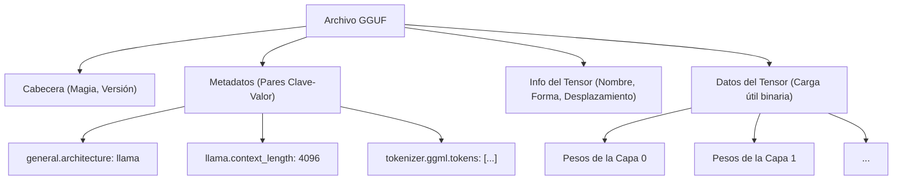
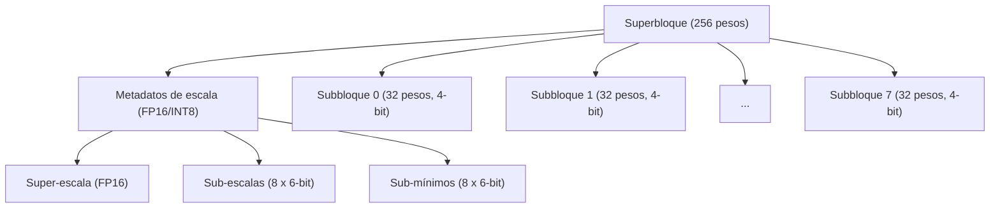
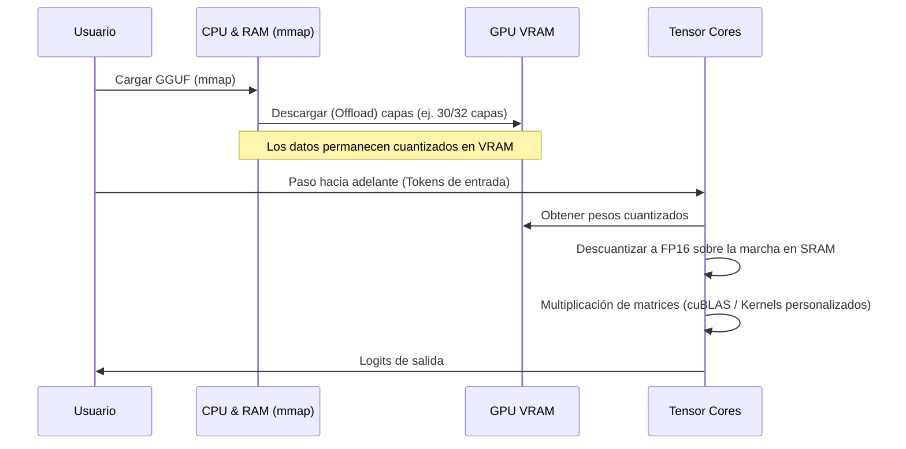

## 1. Introducción: ¿Por qué los LLM necesitan cuantización?

El reciente avance de los modelos de lenguaje grande (LLM: Large Language Models) ha sido notable, pero detrás de escena han surgido problemas graves como el "agotamiento de recursos de cómputo" y el "cuello de botella del ancho de banda de memoria". Por ejemplo, si se carga en memoria un modelo de 70B (70 mil millones) de parámetros como Llama 3 utilizando el estándar de coma flotante de 16 bits (FP16), solo los parámetros consumirán unos 140 GB de VRAM/RAM. Si a esto le sumamos el contexto durante la inferencia (caché KV), el modelo no podrá funcionar sin agrupar en un clúster múltiples GPU de gama alta para centros de datos (como NVIDIA A100 de 80 GB o H100 de 80 GB).

Como salvador para ejecutar LLMs en dispositivos edge (como MacBooks o PCs de gaming comunes) y para desarrolladores individuales, apareció **llama.cpp** y su tecnología principal, la **cuantización (Quantization)**. En particular, el formato de archivo **GGUF (GPT-Generated Unified Format)** y el avanzado algoritmo de cuantización por bloques llamado **k-quants** son métodos innovadores que comprimen el tamaño del modelo a una fracción de su original, minimizando al máximo la degradación en la precisión (Perplejidad) del mismo.

En este artículo, explicaremos exhaustivamente desde los fundamentos matemáticos de la cuantización en llama.cpp, la diferencia con el formato GGML, la estructura detallada del formato GGUF, hasta los mecanismos internos de k-quants.

---

## 2. Fundamentos matemáticos de la cuantización (Quantization)

En el contexto de los LLM, la cuantización se refiere a la operación de mapear valores continuos (o números de coma flotante de alta precisión) a valores discretos representados con menos bits (INT8, INT4, INT3, etc.).

### 2.1. Fórmulas básicas de la cuantización lineal

El enfoque más simple es la cuantización lineal (cuantización Min-Max). Sea $W$ el tensor de pesos original de alta precisión y $W_q$ el tensor de enteros cuantizado.

$$ W_q = \text{round}\left( \frac{W}{S} \right) + Z $$

Donde:
- $S$ es el **Factor de escala (Scale Factor)**, que determina el tamaño del paso de cuantización (resolución).
- $Z$ es el **Punto cero (Zero-point)**, un valor de sesgo (bias) para desplazar a qué valor entero cuantizado corresponde el número real $0.0$.
- $\text{round}(\cdot)$ es la función de redondeo al entero más cercano.

Mediante la descuantización (Dequantization), se restaura el peso real aproximado $\tilde{W}$ durante la inferencia.

$$ \tilde{W} = S \times (W_q - Z) $$

### 2.2. Cuantización simétrica vs Cuantización asimétrica

Dependiendo del tratamiento del punto cero $Z$, se divide principalmente en dos métodos:

1. **Cuantización asimétrica (Asymmetric Quantization)**
   Mapea utilizando el valor mínimo $W_{\min}$ y el valor máximo $W_{\max}$ de los datos.
   $$ S = \frac{W_{\max} - W_{\min}}{2^b - 1}, \quad Z = \text{round}\left(-\frac{W_{\min}}{S}\right) $$
   Donde $b$ es el número de bits de cuantización (ej: $2^4-1 = 15$ para 4 bits). Debido a que es necesario almacenar $Z$, la sobrecarga de cálculo y de memoria aumenta ligeramente.

2. **Cuantización simétrica (Symmetric Quantization)**
   Mapea los valores alrededor del cero utilizando el valor máximo absoluto de los datos ($Z=0$).
   $$ S = \frac{\max(|W_{\max}|, |W_{\min}|)}{2^{b-1} - 1}, \quad Z = 0 $$
   Las versiones iniciales de la cuantización de llama.cpp (por ejemplo, el formato heredado Q4_0) adoptaron la cuantización simétrica. La falta del término $Z$ tiene la gran ventaja de acelerar significativamente el cálculo del producto escalar con instrucciones SIMD.

---

## 3. Evolución de GGML a GGUF y estructura de archivos

Al hablar de llama.cpp, es imprescindible mencionar la biblioteca de operaciones con tensores escrita en C++, **GGML**, y el formato de archivo derivado de ella, **GGUF**.

### 3.1. Problemas de GGML

Las versiones iniciales de llama.cpp usaban el formato `ggml` (y variantes como `ggjt`). Sin embargo, estos presentaban los siguientes problemas:
- **Falta de extensibilidad:** Los números mágicos y los hiperparámetros estaban codificados rígidamente (hardcoded) en un orden y longitud fijos. Cada vez que se agregaba una nueva arquitectura de modelo (ej: Llama, Falcon, Mixtral, etc.) o un nuevo tokenizador, se producían cambios destructivos (breaking changes).
- **Pérdida de retrocompatibilidad:** El formato se actualizaba con tanta frecuencia que los archivos de modelos antiguos no se podían leer en las versiones recientes de llama.cpp de forma recurrente.

### 3.2. Nacimiento del formato GGUF

Introducido en agosto de 2023, **GGUF** es un formato altamente versátil diseñado para resolver estos problemas. Su característica más importante es la adopción de una **estructura de metadatos basada en clave-valor (Key-Value)**.

El siguiente diagrama Mermaid abstrae la estructura de un archivo GGUF.



**Principales ventajas de GGUF:**
1. **Flexibilidad:** Todos los hiperparámetros del modelo, la configuración de RoPE (Rotary Positional Embedding), los datos del vocabulario del tokenizador, etc., se almacenan como pares Clave-Valor con nombre. Las claves desconocidas se ignoran, lo que facilita agregar nuevas funciones.
2. **Independencia del Endianness:** GGUF adopta Little Endian de forma predeterminada, pero incluye un indicador explícito, por lo que es portátil de manera segura incluso entre arquitecturas diferentes.
3. **Optimización para mmap (mapeo de memoria):** Los datos de los tensores están alineados (padded) en límites específicos de la memoria, permitiendo mapearlos directamente desde el disco al espacio de memoria mediante la llamada al sistema `mmap()` del SO. Esto reduce el tiempo de inicialización de carga del modelo prácticamente a cero.

---

## 4. Las profundidades de k-quants: Cuantización avanzada por bloques

El verdadero potencial del formato GGUF radica en el mecanismo llamado **k-quants (K-quantization)**, que se encarga de la compresión de los pesos del modelo.

En general, los pesos de una red neuronal tienen una forma cercana a una distribución normal cuando se observan a nivel de capa completa, pero localmente existen valores atípicos (Outliers). Si se cuantizan los pesos de toda una capa con un único factor de escala $S$ uniforme, los valores atípicos arrastrarán la escala y la información de los pesos más pequeños se perderá por completo.

Para evitar esto, llama.cpp realiza una **cuantización por bloques (Block-wise Quantization)**. Consiste en dividir el tensor de pesos en bloques pequeños (por ejemplo, 32 o 256 elementos) y asignar a cada bloque su propio factor de escala (y punto cero).

### 4.1. Límites de la cuantización heredada (Q4_0, Q4_1)

El inicial `Q4_0` agrupaba 32 pesos FP16 en un solo bloque y compartía 1 factor de escala FP16.
- Tamaño del bloque: 32
- Memoria: 1 escala (16 bits) + 32 pesos de 4 bits (128 bits) = 144 bits
- Bits efectivos por peso (bpw: bits per weight): $144 / 32 = 4.5$ bpw

Aunque esto es bastante bueno, los límites entre la precisión y la tasa de compresión se hicieron evidentes. Así es como surgieron los **k-quants**, que tienen una estructura jerárquica mucho más compleja y sofisticada.

### 4.2. Estructura jerárquica de superbloques y subbloques (Ejemplo de Q4_K_M)

k-quants tiene una estructura jerárquica compuesta por "Superbloques (Super-blocks)" grandes y pequeños "Subbloques (Sub-blocks)" contenidos en su interior. Mediante esto, también cuantiza los propios metadatos (como los valores de escala), reduciendo los bpw al mínimo mientras mantiene la precisión.

Veamos la estructura de la configuración más popular, **Q4_K_M**. En Q4_K_M, se utiliza un superbloque de 256 elementos.



La estructura real en C++ (GGML) se define conceptualmente de la siguiente manera:

```cpp
// Estructura conceptual de block_q4_K en llama.cpp
#define QK_K 256

struct block_q4_K {
    uint8_t d[2];          // Súper-escala de todo el superbloque (FP16 x 2, etc.)
    uint8_t scales[12];    // Datos empaquetados de escalas de 6-bit y mínimos de 6-bit (puntos cero) para 8 subbloques (32 elementos cada uno)
    uint8_t qs[QK_K/2];    // Datos de pesos cuantizados a 4-bit (256 elementos / 2 = 128 bytes)
};
```

**Proceso matemático de descuantización (Dequantization):**

El valor real aproximado $\tilde{W}_{i, j}$ del elemento $j$ ($0 \le j < 32$) dentro del subbloque $i$ ($0 \le i < 8$) se calcula de la siguiente manera:

$$ \tilde{W}_{i, j} = S_{\text{super}} \times s_i \times (w_{i, j} - m_i) $$

- $S_{\text{super}}$: Escala de punto flotante de todo el superbloque
- $s_i$: Escala cuantizada a 6-bit para el subbloque $i$
- $m_i$: Valor mínimo cuantizado a 6-bit (punto cero) para el subbloque $i$
- $w_{i, j}$: Peso cuantizado a 4-bit ($0 \dots 15$)

Gracias a esta estructura jerárquica, se mantiene la adaptabilidad a los valores atípicos, a la vez que se reduce drásticamente la cantidad de memoria ocupada por los propios factores de escala. En conjunto, Q4_K_M logra un aproximado de **4.8 bpw**.

### 4.3. Diversas opciones de k-quants

llama.cpp ofrece múltiples variaciones según el objetivo. Los sufijos después de la "K" (S, M, L) indican el tamaño.

| Formato | BPW (Bits por Peso) | Descripción y características |
| :--- | :---: | :--- |
| **Q2_K** | 2.5～3.3 | Compresión extrema. La precisión se degrada considerablemente, pero es útil en entornos con muy poca VRAM. |
| **Q3_K_M** | 3.3 | Estándar para la cuantización de 3 bits. Se degrada más que Q4, pero a menudo se mantiene dentro de márgenes aceptables. |
| **Q4_K_M** | 4.8 | **El punto óptimo recomendado (sweet spot)**. Equilibra la reducción a la mitad del tamaño del modelo manteniendo una buena precisión. |
| **Q5_K_M** | 5.5 | Cuando se requiere mayor precisión. Una posición intermedia entre Q4 y FP16. |
| **Q6_K** | 6.6 | Mantiene una Perplejidad casi equivalente a FP16, pero el tamaño del archivo es mayor. |
| **Q8_0** | 8.5 | Equivalente a INT8. Principalmente usado para tensores intermedios durante la inferencia o utilizado solo en la última capa. |

※ El BPW real se promedia sobre el modelo completo, ya que internamente se realiza una cuantización mixta (Mixed Quantization) dependiendo del tensor del modelo (por ejemplo, proyecciones Q/K/V de Attention frente a los pesos FFN). Se aplican optimizaciones internas, como cuantizar los tensores importantes en Q6 y el resto en Q4.

---

## 5. Optimización del rendimiento en la inferencia: Arquitecturas SIMD y CUDA

El solo hecho de cargar un modelo GGUF en memoria no hace que la inferencia sea rápida. La mayor parte de la inferencia de un LLM es una "multiplicación de matriz-vector (Matrix-Vector Multiplication, abreviado GEMV, o Matriz-Matriz, GEMM)". La clave reside en cómo acelerar la operación de suma de productos (dot product) entre los pesos cuantizados y las activaciones (datos de entrada) retenidas en FP16 (o FP32).

### 5.1. Aprovechamiento de instrucciones SIMD en entornos de CPU

La sorprendente velocidad que presume llama.cpp en la inferencia por CPU se debe a su optimización **SIMD (Single Instruction, Multiple Data)** a nivel de ensamblador.
Por ejemplo, en procesadores Intel/AMD, aprovecha al máximo los conjuntos de instrucciones **AVX2** o **AVX-512**, y en Apple Silicon, las instrucciones **ARM NEON**.

Durante la inferencia, no se convierte (Dequantize) intencionalmente $W_q$ de vuelta a FP32 para luego realizar la multiplicación.
El lado de las activaciones también se cuantiza dinámicamente por bloques (Dynamic Quantization, generalmente hacia INT8), y se calcula el producto en bloque mediante aritmética de enteros **INT8 $\times$ INT4** utilizando instrucciones SIMD especiales para el producto escalar (ej. `vdpaddd` o `_mm256_madd_epi16`). Al devolver el acumulador final a FP32 y multiplicarlo por el factor de escala, se logra un rendimiento asombroso.

### 5.2. Descarga (Offload) en entornos de GPU (cuBLAS / CUDA)

Recientemente, llama.cpp no solo soporta CPUs, sino que cuenta con un poderoso soporte para GPUs de NVIDIA (CUBLAS / CUDA).
Es posible descargar (offload) partes o todas las capas del archivo GGUF a la VRAM (mediante la opción `--n-gpu-layers`).



Cuando se realizan cálculos en la GPU, el ancho de banda de la memoria de video (Memory Bandwidth) se convierte en el mayor cuello de botella. Dado que los pesos están comprimidos con k-quants, la transferencia de datos desde la VRAM a las unidades de cálculo de la GPU (SM: Streaming Multiprocessor o Tensor Cores) se reduce a un tercio o a un cuarto. En el instante exacto en que los pesos llegan a la unidad de cómputo, se descuantizan (expanden) a FP16 sobre la marcha, y utilizando los Tensor Cores, se ejecutan las multiplicaciones de matrices a velocidad ultra alta.
En otras palabras, la cuantización **se realiza no para "reducir la cantidad de cálculos", sino para "reducir la cantidad de transferencia de memoria"**.

---

## 6. Ejemplos concretos del balance (trade-off) entre uso de memoria y rendimiento

Tomemos como ejemplo el modelo Llama 3 de 8B para ver los requisitos técnicos según el nivel de cuantización de GGUF. (Las cifras son una estimación orientativa).

| Modelo/Cuantización | Tamaño del archivo | VRAM/RAM necesaria | Velocidad de inferencia (est.) | Degradación de Perplejidad |
| :--- | :--- | :--- | :--- | :--- |
| **Llama-3-8B (FP16)** | Aprox. 16 GB | 18 GB o más | Referencia | Ninguna (Base) |
| **Llama-3-8B (Q8_0)** | Aprox. 8.5 GB | 10 GB o más | Rápida | Casi nula |
| **Llama-3-8B (Q6_K)** | Aprox. 6.6 GB | 8 GB o más | Muy rápida | Mínima |
| **Llama-3-8B (Q4_K_M)** | Aprox. 4.9 GB | 6.5 GB o más | La más rápida / Óptima | Aceptable / Minúscula |
| **Llama-3-8B (Q3_K_M)** | Aprox. 3.9 GB | 5.5 GB o más | La más rápida | Algo notable |
| **Llama-3-8B (Q2_K)** | Aprox. 3.0 GB | 4.5 GB o más | Rápida | Degradación evidente |

**Punto de atención (El impacto de la caché KV):**
Durante la inferencia de un LLM, a medida que la longitud del contexto (número de tokens en el prompt) aumenta, el consumo de memoria se incrementa de manera explosiva no solo por los pesos del modelo, sino también por la **Caché KV**, que guarda el estado histórico de Attention.
Por ejemplo, si el contexto tiene 8192 tokens, la caché KV por sí sola consumirá varios gigabytes. Por tanto, en la operación real, es necesario asegurar un margen (Headroom) de `Tamaño del archivo del modelo + Aprox. 1.5GB ~ 3GB`. La razón por la que se recomienda Q4_K_M es porque, incluso reservando este espacio para la caché KV, representa el equilibrio ideal para funcionar con seguridad en una GPU común de 8 GB de VRAM (como una RTX 3060 / 4060).

En las versiones recientes de llama.cpp, se ha añadido también **la función de cuantizar la propia Caché KV a Q8_0 o Q4_0**, de manera que se investiga incesantemente para poder extender aún más la longitud de los contextos.

---

## 7. Conclusión

En este artículo, hemos profundizado en la estructura interna del formato GGUF y la tecnología de cuantización k-quants, que conforman el núcleo de llama.cpp.

1. **La flexibilidad de GGUF:** Su estructura de metadatos tipo clave-valor ha construido un sólido ecosistema capaz de seguir el rápido ritmo evolutivo de los LLM (con la aparición de nuevas arquitecturas de modelos) sin sufrir cambios destructivos.
2. **Compresión extrema mediante k-quants:** A través de la gestión jerárquica de los factores de escala en superbloques y subbloques, se ha logrado una asombrosa compresión promedio de 4.8 bits por peso (en Q4_K_M), conservando al mismo tiempo la información de los valores atípicos.
3. **Resolución del cuello de botella en el ancho de banda de memoria:** Mediante el uso de sofisticadas implementaciones de kernels en SIMD y CUDA, y al realizar la descuantización al vuelo mientras se calcula, se reduce la cantidad de transferencia hacia/desde la VRAM, lo que mejora drásticamente la velocidad de inferencia.

Se podría decir, sin exagerar, que el poder tecnológico detrás de llama.cpp, que está impulsando la democratización de la IA, va mucho más allá de ser una simple herramienta y representa una de las cumbres de la ingeniería de software moderna. Al comprender los algoritmos de cuantización y los mecanismos del formato GGUF, podrá seleccionar el modelo ideal y ajustar el rendimiento (performance tuning) de forma más precisa para su propio entorno.

### Enlaces de referencia
- [Repositorio en GitHub de llama.cpp](https://github.com/ggerganov/llama.cpp)
- [Especificación del formato GGUF](https://github.com/ggerganov/ggml/blob/master/docs/gguf.md)
- [PR de la implementación de K-quants](https://github.com/ggerganov/llama.cpp/pull/1684)

(Fin)
