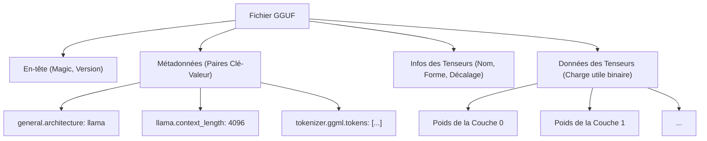
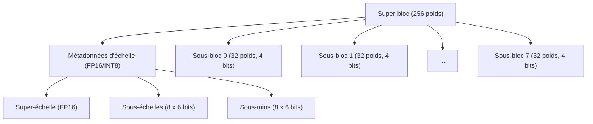
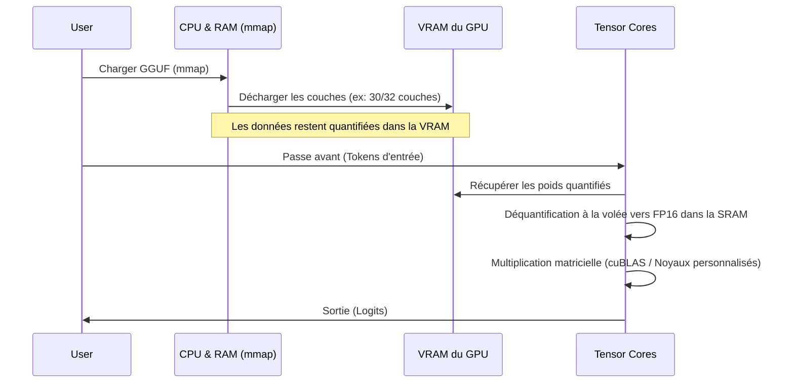

## 1. Introduction : Pourquoi les LLM ont-ils besoin de quantification ?

Bien que l'évolution récente des grands modèles de langage (LLM : Large Language Models) soit remarquable, en coulisses, l'« épuisement des ressources de calcul » et les « goulots d'étranglement de la bande passante mémoire » sont devenus de graves problèmes. Par exemple, si l'on charge en mémoire un modèle de 70B (70 milliards) de paramètres comme Llama 3 avec une virgule flottante standard de 16 bits (FP16), les paramètres seuls consomment environ 140 Go de VRAM/RAM. Si l'on y ajoute le contexte lors de l'inférence (cache KV), cela ne peut fonctionner sans regrouper plusieurs GPU haut de gamme pour centres de données (NVIDIA A100 80 Go ou H100 80 Go).

C'est là qu'interviennent **llama.cpp** et sa **technologie de quantification (Quantization)**, devenus les sauveurs permettant aux développeurs individuels ou aux appareils périphériques (MacBook ou PC de jeu classique) de faire fonctionner des LLM. En particulier, le format de fichier **GGUF (GPT-Generated Unified Format)** et l'algorithme avancé de quantification par blocs appelé **k-quants** constituent une méthode révolutionnaire qui comprime la taille du modèle à une fraction de l'original tout en minimisant la dégradation de la précision du modèle (Perplexité).

Dans cet article, nous expliquerons en profondeur la quantification dans llama.cpp, depuis les bases mathématiques, les différences avec le format GGML, la structure détaillée du format GGUF, jusqu'au mécanisme interne de k-quants.

---

## 2. Bases mathématiques de la quantification (Quantization)

Dans le contexte des LLM, la quantification désigne l'opération consistant à mapper des valeurs continues (ou des nombres à virgule flottante de haute précision) vers des valeurs discrètes avec un nombre de bits inférieur (INT8, INT4, INT3, etc.).

### 2.1. Formules de base de la quantification linéaire

L'approche la plus simple est la quantification linéaire (quantification Min-Max). Soit $W$ le tenseur de poids d'origine de haute précision et $W_q$ le tenseur d'entiers quantifié.

$$ W_q = \text{round}\left( \frac{W}{S} \right) + Z $$

Où :
- $S$ est le **facteur d'échelle (Scale Factor)**, qui détermine la taille de pas (résolution) de la quantification.
- $Z$ est le **point zéro (Zero-point)**, une valeur de biais permettant de décaler la valeur entière quantifiée correspondant au nombre réel $0.0$.
- $\text{round}(\cdot)$ est la fonction d'arrondi à l'entier le plus proche.

Lors de l'inférence, la déquantification (Dequantization) restaure un poids réel approximatif $\tilde{W}$.

$$ \tilde{W} = S \times (W_q - Z) $$

### 2.2. Quantification symétrique vs Quantification asymétrique

Selon le traitement du point zéro $Z$, on distingue principalement deux méthodes.

1. **Quantification asymétrique (Asymmetric Quantization)**
   Mappage en utilisant la valeur minimale $W_{\min}$ et la valeur maximale $W_{\max}$ des données.
   $$ S = \frac{W_{\max} - W_{\min}}{2^b - 1}, \quad Z = \text{round}\left(-\frac{W_{\min}}{S}\right) $$
   Où $b$ est le nombre de bits de quantification (par exemple, pour 4 bits, $2^4-1 = 15$). Étant donné qu'il est nécessaire de conserver $Z$, la surcharge en calcul et en mémoire augmente légèrement.

2. **Quantification symétrique (Symmetric Quantization)**
   Mappage centré sur zéro en utilisant la valeur absolue maximale des données ($Z=0$).
   $$ S = \frac{\max(|W_{\max}|, |W_{\min}|)}{2^{b-1} - 1}, \quad Z = 0 $$
   Les premières quantifications de llama.cpp (comme l'ancien Q4_0) adoptaient la quantification symétrique. Sans le terme $Z$, cette méthode présente l'avantage d'accélérer considérablement le calcul du produit scalaire avec les instructions SIMD.

---

## 3. L'évolution de GGML vers GGUF et la structure des fichiers

Pour parler de llama.cpp, il est indispensable de mentionner **GGML**, une bibliothèque de calcul tensoriel écrite en C++, et **GGUF**, le format de fichier qui en dérive.

### 3.1. Les défis de GGML

Les premières versions de llama.cpp utilisaient le format `ggml` (ainsi que ses variantes comme `ggjt`). Cependant, elles présentaient les problèmes suivants :
- **Manque d'extensibilité :** Les nombres magiques et les hyperparamètres étaient codés en dur avec une longueur et un ordre fixes. Chaque ajout d'une nouvelle architecture de modèle (ex : Llama, Falcon, Mixtral, etc.) ou d'un nouveau tokenizer entraînait des modifications destructives.
- **Perte de rétrocompatibilité :** Le format étant fréquemment mis à jour, il arrivait souvent que les anciens fichiers de modèles ne puissent plus être lus par les versions récentes de llama.cpp.

### 3.2. La naissance du format GGUF

Introduit en août 2023, **GGUF** est un format très polyvalent conçu pour résoudre ces problèmes. Sa principale caractéristique est l'adoption d'une **structure de métadonnées basée sur des paires clé-valeur (Key-Value)**.

Le diagramme Mermaid suivant résume la structure d'un fichier GGUF.



**Principaux avantages de GGUF :**
1. **Flexibilité :** Tous les hyperparamètres du modèle, les paramètres RoPE (Rotary Positional Embedding), les données de vocabulaire du tokenizer, etc., sont stockés sous forme de paires clé-valeur nommées. Les clés inconnues étant ignorées, l'ajout de nouvelles fonctionnalités est facile.
2. **Indépendance vis-à-vis du boutisme (Endianness) :** Bien que GGUF utilise le little-endian par défaut, il possède un indicateur explicite, le rendant sûr et portable entre différentes architectures.
3. **Optimisation pour le mmap (Memory Mapping) :** Les données des tenseurs sont alignées sur des limites spécifiques (padding) et peuvent être mappées directement depuis le disque vers l'espace mémoire via l'appel système `mmap()` de l'OS. Ainsi, le temps d'initialisation du chargement du modèle est virtuellement nul.

---

## 4. Les profondeurs de k-quants : Quantification avancée par blocs

Le véritable atout du format GGUF réside dans **k-quants (K-quantization)**, le mécanisme responsable de la compression des poids du modèle.

Généralement, les poids d'un réseau de neurones suivent une distribution proche de la normale sur l'ensemble d'une couche, mais il existe des valeurs aberrantes (Outliers) localement. Si l'on quantifie les poids d'une couche entière avec un facteur d'échelle $S$ uniforme, l'information des petits poids sera complètement écrasée par les valeurs aberrantes.

Pour éviter cela, llama.cpp utilise une **quantification par blocs (Block-wise Quantization)**. Les tenseurs de poids sont divisés en petits blocs (par exemple, 32 éléments ou 256 éléments), et chaque bloc possède son propre facteur d'échelle (et son point zéro).

### 4.1. Limites de la quantification ancienne (Q4_0, Q4_1)

L'ancien format `Q4_0` regroupait 32 poids FP16 en un seul bloc et partageait un facteur d'échelle FP16.
- Taille du bloc : 32
- Mémoire : 1 échelle (16 bits) + 32 poids de 4 bits (128 bits) = 144 bits
- Nombre effectif de bits par élément (bpw : bits per weight) : $144 / 32 = 4,5$ bpw

Bien que ce soit suffisamment performant, les limites en termes de précision et de taux de compression devenaient visibles. C'est là qu'est apparu **k-quants**, avec sa structure hiérarchique plus complexe et plus raffinée.

### 4.2. Structure hiérarchique des super-blocs et sous-blocs (Exemple de Q4_K_M)

k-quants possède une structure hiérarchique composée d'un grand « super-bloc (Super-block) » et de petits « sous-blocs (Sub-block) » à l'intérieur. Cela permet de quantifier les métadonnées elles-mêmes (comme les valeurs d'échelle) et de réduire le bpw au minimum tout en maintenant la précision.

Examinons la structure de **Q4_K_M**, qui est la configuration la plus populaire. Q4_K_M utilise un super-bloc de 256 éléments.



En C++ (GGML), la structure réelle est conceptuellement définie comme suit :

```cpp
// Structure conceptuelle de block_q4_K dans llama.cpp
#define QK_K 256

struct block_q4_K {
    uint8_t d[2];          // Super-échelle pour l'ensemble du super-bloc (FP16 x 2, etc.)
    uint8_t scales[12];    // Données compressées de l'échelle sur 6 bits et de la valeur minimale (point zéro) sur 6 bits pour les 8 sous-blocs (32 éléments chacun)
    uint8_t qs[QK_K/2];    // Données de poids quantifiées sur 4 bits (256 éléments / 2 = 128 octets)
};
```

**Processus mathématique de déquantification (Dequantization) :**

La valeur réelle approximative $\tilde{W}_{i, j}$ de l'élément $j$ ($0 \le j < 32$) dans le sous-bloc $i$ ($0 \le i < 8$) est calculée comme suit :

$$ \tilde{W}_{i, j} = S_{\text{super}} \times s_i \times (w_{i, j} - m_i) $$

- $S_{\text{super}}$ : Échelle en virgule flottante de l'ensemble du super-bloc
- $s_i$ : Échelle quantifiée sur 6 bits pour le sous-bloc $i$
- $m_i$ : Valeur minimale (point zéro) quantifiée sur 6 bits pour le sous-bloc $i$
- $w_{i, j}$ : Poids quantifié sur 4 bits ($0 \dots 15$)

Grâce à cette structure hiérarchique, l'espace mémoire occupé par le facteur d'échelle lui-même est drastiquement réduit, tout en maintenant l'adaptabilité aux valeurs aberrantes. Q4_K_M atteint environ **4,8 bpw** au total.

### 4.3. Diverses options k-quants

llama.cpp offre de nombreuses variations selon vos besoins. Le suffixe après "K" (S, M, L) indique la taille.

| Format | BPW (Bits per Weight) | Aperçu et caractéristiques |
| :--- | :---: | :--- |
| **Q2_K** | 2,5～3,3 | Compression extrême. Baisse significative de la précision, destiné aux environnements avec très peu de VRAM. |
| **Q3_K_M** | 3,3 | Standard de la quantification à 3 bits. Se dégrade plus que Q4 mais reste souvent dans une plage acceptable. |
| **Q4_K_M** | 4,8 | **Le compromis idéal recommandé (Sweet spot)**. Équilibre entre la réduction de taille de moitié et le maintien de la précision. |
| **Q5_K_M** | 5,5 | Pour ceux qui recherchent une plus grande précision. Position intermédiaire entre Q4 et FP16. |
| **Q6_K** | 6,6 | Maintient une Perplexité presque équivalente à FP16, mais la taille du fichier est plus grande. |
| **Q8_0** | 8,5 | Équivalent à INT8. Principalement utilisé pour les tenseurs intermédiaires lors des calculs d'inférence, ou seulement dans la dernière couche. |

*Remarque : Le BPW réel est moyenné sur l'ensemble du modèle car une quantification mixte (Mixed Quantization) est appliquée en fonction du tenseur (par exemple, projection Q/K/V de l'Attention vs poids FFN). En interne, des optimisations sont effectuées, comme la quantification des tenseurs importants en Q6 et le reste en Q4.*

---

## 5. Optimisation des performances lors de l'inférence : SIMD et architecture CUDA

Charger un modèle GGUF en mémoire ne rend pas l'inférence plus rapide à lui seul. La majeure partie de l'inférence d'un LLM est un "produit matriciel (Matrix-Vector Multiplication, ou GEMV, ou Matrix-Matrix, GEMM)". La clé de l'accélération réside dans le calcul efficace du produit scalaire entre les poids quantifiés et les activations (données d'entrée) conservées en FP16 (ou FP32).

### 5.1. Utilisation des instructions SIMD dans un environnement CPU

La raison pour laquelle llama.cpp affiche des vitesses incroyables pour l'inférence CPU réside dans l'optimisation **SIMD (Single Instruction, Multiple Data)** au niveau de l'assembleur.
Par exemple, sur les processeurs Intel/AMD, les jeux d'instructions **AVX2** et **AVX-512** sont pleinement utilisés, et sur Apple Silicon, c'est **ARM NEON**.

Pendant l'inférence, $W_q$ n'est pas reconverti en FP32 (déquantifié) avant la multiplication.
Les activations sont également quantifiées dynamiquement par bloc (Dynamic Quantization, généralement vers INT8), et des calculs d'entiers **INT8 $\times$ INT4** sont effectués en une seule fois à l'aide d'instructions spéciales de produit scalaire SIMD (ex : `vdpaddd` ou `_mm256_madd_epi16`). Le résultat est reconverti en FP32 dans l'accumulateur final et multiplié par le facteur d'échelle, permettant d'atteindre un débit phénoménal.

### 5.2. Déchargement (Offloading) dans un environnement GPU (cuBLAS / CUDA)

Les versions récentes de llama.cpp offrent également un support très robuste pour les GPU NVIDIA (CUBLAS / CUDA), et non seulement pour le CPU.
Il est possible de décharger tout ou partie des couches d'un fichier GGUF dans la VRAM (avec l'option `--n-gpu-layers`).



Lors des calculs sur GPU, la bande passante de la VRAM (Memory Bandwidth) constitue le plus grand goulot d'étranglement. Étant donné que les poids sont compressés avec k-quants, la quantité de données transférées de la VRAM vers les unités de calcul du GPU (SM : Streaming Multiprocessor ou Tensor Cores) est réduite au tiers ou au quart. Dès que les poids atteignent l'unité de calcul, ils sont déquantifiés à la volée en FP16, et la multiplication matricielle est exécutée à très haute vitesse grâce aux Tensor Cores.
En d'autres termes, la quantification n'est **pas effectuée pour "réduire la quantité de calculs", mais pour "réduire la quantité de données transférées"**.

---

## 6. Exemples concrets du compromis entre utilisation de la mémoire et performances

Prenons le modèle Llama 3 8B comme exemple pour examiner les spécifications requises selon le niveau de quantification GGUF. (Les valeurs sont des estimations approximatives)

| Modèle / Quantification | Taille du fichier | VRAM/RAM requise | Vitesse d'inférence | Dégradation (Perplexité) |
| :--- | :--- | :--- | :--- | :--- |
| **Llama-3-8B (FP16)** | Env. 16 Go | 18 Go ou plus | Référence | Aucune (Base) |
| **Llama-3-8B (Q8_0)** | Env. 8,5 Go | 10 Go ou plus | Rapide | Presque zéro |
| **Llama-3-8B (Q6_K)** | Env. 6,6 Go | 8 Go ou plus | Très rapide | Minime |
| **Llama-3-8B (Q4_K_M)** | Env. 4,9 Go | 6,5 Go ou plus | La plus rapide / optimale | Acceptable / Légère |
| **Llama-3-8B (Q3_K_M)** | Env. 3,9 Go | 5,5 Go ou plus | La plus rapide | Plutôt visible |
| **Llama-3-8B (Q2_K)** | Env. 3,0 Go | 4,5 Go ou plus | Rapide | Dégradation évidente |

**Attention (Impact du cache KV) :**
Lors de l'inférence LLM, lorsque la longueur du contexte (nombre de tokens du prompt) augmente, la consommation de mémoire du **cache KV** (qui stocke les états d'Attention passés) explose, en plus de celle des poids du modèle.
Par exemple, pour un contexte de 8192 tokens, le cache KV seul consomme plusieurs Go. Par conséquent, en utilisation réelle, il est nécessaire de conserver une marge (Headroom) de `taille du fichier modèle + environ 1,5 Go à 3 Go`. La raison pour laquelle Q4_K_M est recommandé est qu'il représente l'équilibre parfait permettant de fonctionner en toute sécurité sur un GPU équipé de 8 Go de VRAM (comme la RTX 3060 / 4060), tout en réservant l'espace pour ce cache KV.

Récemment, llama.cpp a ajouté une fonctionnalité permettant de **quantifier le cache KV lui-même en Q8_0 ou Q4_0**, et les efforts visant à étendre davantage la longueur du contexte sont continus.

---

## 7. Conclusion

Dans cet article, nous avons exploré en profondeur le fonctionnement interne du format GGUF et de la technologie de quantification k-quants, qui constituent le cœur de llama.cpp.

1. **La flexibilité de GGUF :** Grâce à une structure de métadonnées de type clé-valeur, GGUF a mis en place un écosystème robuste capable de suivre l'évolution rapide des LLM (apparition de nouvelles architectures) sans subir de modifications destructives.
2. **Compression extrême grâce à k-quants :** La gestion hiérarchique des facteurs d'échelle avec les super-blocs et sous-blocs permet de conserver les informations des valeurs aberrantes tout en atteignant une compression incroyable de 4,8 bits en moyenne par poids (Q4_K_M).
3. **Résolution du goulot d'étranglement de la mémoire :** Grâce à des implémentations avancées de noyaux SIMD et CUDA, la déquantification à la volée réduit les transferts depuis la VRAM et améliore considérablement la vitesse d'inférence.

La prouesse technologique de llama.cpp, qui favorise la démocratisation de l'IA, dépasse le simple statut d'outil et peut sans exagération être considérée comme l'un des sommets de l'ingénierie logicielle moderne. En comprenant l'algorithme de quantification et la structure du format GGUF, vous serez en mesure de choisir le modèle le plus adapté à votre environnement et d'effectuer des ajustements de performance avec une plus grande précision.

### Liens utiles
- [Référentiel GitHub de llama.cpp](https://github.com/ggerganov/llama.cpp)
- [Spécifications du format GGUF](https://github.com/ggerganov/ggml/blob/master/docs/gguf.md)
- [Pull Request sur l'implémentation de k-quants](https://github.com/ggerganov/llama.cpp/pull/1684)

(Fin)

