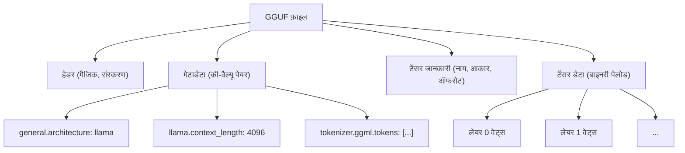
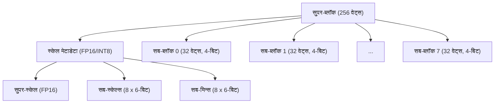
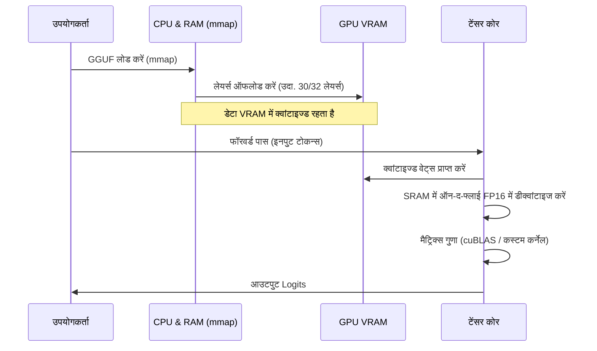

## 1. परिचय: LLM को क्वांटाइजेशन की आवश्यकता क्यों है?

हाल के वर्षों में लार्ज लैंग्वेज मॉडल्स (LLM: Large Language Models) का विकास उल्लेखनीय रहा है, लेकिन इसके पीछे "कंप्यूटिंग संसाधनों की कमी" और "मेमोरी बैंडविड्थ की रुकावट" जैसी गंभीर समस्याएं सामने आई हैं। उदाहरण के लिए, यदि Llama 3 जैसे 70B (70 बिलियन) पैरामीटर वाले मॉडल को मानक 16-बिट फ्लोटिंग पॉइंट (FP16) में मेमोरी में लोड किया जाता है, तो केवल पैरामीटर लगभग 140GB VRAM/RAM की खपत करते हैं। जब इसमें इन्फरेंस के दौरान कॉन्टेक्स्ट (KV कैश) जोड़ा जाता है, तो यह डेटा सेंटर के लिए बने हाई-एंड GPU (NVIDIA A100 80GB या H100 80GB) के मल्टीपल क्लस्टर्स के बिना काम नहीं करेगा।

व्यक्तिगत डेवलपर्स और एज डिवाइस (MacBook या सामान्य गेमिंग PC) पर LLM चलाने के लिए एक तारणहार के रूप में **llama.cpp** और इसकी मुख्य **क्वांटाइजेशन (Quantization) तकनीक** सामने आई। विशेष रूप से, **GGUF (GPT-Generated Unified Format)** नामक एक फ़ाइल फॉर्मेट और **k-quants** नामक एक उन्नत ब्लॉक-स्तरीय क्वांटाइजेशन एल्गोरिथम मॉडल के आकार को कुछ अंश तक सिकोड़ने के लिए एक क्रांतिकारी तरीका है, जबकि मॉडल की सटीकता (Perplexity) में कमी को कम से कम रखा जाता है।

इस लेख में, हम llama.cpp में क्वांटाइजेशन की गणितीय पृष्ठभूमि, GGML फॉर्मेट के साथ अंतर, GGUF फॉर्मेट की विस्तृत संरचना, और k-quants के आंतरिक तंत्र को गहराई से समझाएंगे।

---

## 2. क्वांटाइजेशन (Quantization) का गणितीय आधार

LLM के संदर्भ में क्वांटाइजेशन का अर्थ है निरंतर मानों (या उच्च-परिशुद्धता फ्लोटिंग-पॉइंट नंबरों) को कम बिट्स (INT8, INT4, INT3, आदि) वाले असतत (discrete) मानों में मैप करना।

### 2.1. लीनियर क्वांटाइजेशन का मूल सूत्र

सबसे सरल दृष्टिकोण लीनियर क्वांटाइजेशन (Min-Max क्वांटाइजेशन) है। मान लें कि मूल उच्च-परिशुद्धता वेट (weight) टेंसर $W$ है और क्वांटाइज्ड इंटीजर टेंसर $W_q$ है।

$$ W_q = \text{round}\left( \frac{W}{S} \right) + Z $$

जहाँ,
- $S$ **स्केल फैक्टर (Scale Factor)** है, जो क्वांटाइजेशन के स्टेप साइज (रेज़ोल्यूशन) को निर्धारित करता है।
- $Z$ **जीरो-पॉइंट (Zero-point)** है, जो एक बायस वैल्यू है और क्वांटाइजेशन के बाद वास्तविक संख्या $0.0$ को संबंधित पूर्णांक मान में शिफ्ट करता है।
- $\text{round}(\cdot)$ निकटतम पूर्णांक पर राउंडिंग फ़ंक्शन है।

डीक्वांटाइजेशन (Dequantization) के माध्यम से, इन्फरेंस के दौरान अनुमानित वास्तविक वेट $\tilde{W}$ को बहाल किया जाता है।

$$ \tilde{W} = S \times (W_q - Z) $$

### 2.2. सिमेट्रिक क्वांटाइजेशन बनाम असिमेट्रिक क्वांटाइजेशन

जीरो-पॉइंट $Z$ को संभालने के तरीके के आधार पर इसे मुख्य रूप से दो विधियों में विभाजित किया गया है।

1. **असिमेट्रिक क्वांटाइजेशन (Asymmetric Quantization)**
   डेटा के न्यूनतम मान $W_{\min}$ और अधिकतम मान $W_{\max}$ का उपयोग करके मैपिंग की जाती है।
   $$ S = \frac{W_{\max} - W_{\min}}{2^b - 1}, \quad Z = \text{round}\left(-\frac{W_{\min}}{S}\right) $$
   यहाँ $b$ क्वांटाइजेशन बिट्स की संख्या है (उदाहरण के लिए, 4 बिट्स के लिए $2^4-1 = 15$)। चूँकि $Z$ को बनाए रखना आवश्यक है, इसलिए गणना और मेमोरी ओवरहेड थोड़ा बढ़ जाता है।

2. **सिमेट्रिक क्वांटाइजेशन (Symmetric Quantization)**
   डेटा के पूर्ण मान (absolute value) के अधिकतम मान का उपयोग करके शून्य के चारों ओर मैपिंग की जाती है ($Z=0$)।
   $$ S = \frac{\max(|W_{\max}|, |W_{\min}|)}{2^{b-1} - 1}, \quad Z = 0 $$
   llama.cpp का शुरुआती क्वांटाइजेशन (उदाहरण के लिए लिगेसी Q4_0) सिमेट्रिक क्वांटाइजेशन का उपयोग करता है, और क्योंकि इसमें $Z$ टर्म नहीं होता है, इसका लाभ यह है कि SIMD निर्देशों के साथ डॉट प्रोडक्ट गणना बहुत तेज़ हो जाती है।

---

## 3. GGML से GGUF तक का विकास और फ़ाइल संरचना

llama.cpp की चर्चा करते समय, C++ में लिखी गई टेंसर गणना लाइब्रेरी **GGML** और इससे प्राप्त फ़ाइल स्वरूप **GGUF** अपरिहार्य हैं।

### 3.1. GGML की चुनौतियाँ

प्रारंभिक llama.cpp `ggml` फॉर्मेट (और `ggjt` जैसे वेरिएंट) का उपयोग करता था। हालाँकि, इनमें निम्नलिखित समस्याएँ थीं:
- **विस्तार का अभाव:** मैजिक नंबर और हाइपरपैरामीटर निश्चित लंबाई और निश्चित क्रम में हार्डकोड किए गए थे, जिसके परिणामस्वरूप हर बार नए मॉडल आर्किटेक्चर (जैसे: Llama, Falcon, Mixtral) या नए टोकनाइज़र जोड़े जाने पर विनाशकारी परिवर्तन (breaking changes) हुए।
- **बैकवर्ड कम्पैटिबिलिटी का नुकसान:** फॉर्मेट को बार-बार अपडेट किया जाता था, और पुरानी मॉडल फ़ाइलें नवीनतम llama.cpp द्वारा नहीं पढ़ी जा सकती थीं।

### 3.2. GGUF फॉर्मेट का जन्म

अगस्त 2023 में पेश किया गया **GGUF**, इन समस्याओं को हल करने के लिए डिज़ाइन किया गया एक अत्यधिक बहुमुखी (versatile) फॉर्मेट है। इसकी सबसे बड़ी विशेषता **की-वैल्यू (Key-Value) आधारित मेटाडेटा संरचना** को अपनाना है।

नीचे दिया गया Mermaid आरेख GGUF की फ़ाइल संरचना का एक एब्सट्रेक्ट रूप है।



**GGUF के मुख्य लाभ:**
1. **लचीलापन (Flexibility):** मॉडल के हाइपरपैरामीटर, RoPE (Rotary Positional Embedding) सेटिंग्स, टोकनाइज़र के शब्दावली (vocabulary) डेटा आदि सभी को नामित की-वैल्यू पेयर के रूप में संग्रहीत किया जाता है। अज्ञात कीज़ (keys) को अनदेखा कर दिया जाता है, जिससे नई सुविधाएँ जोड़ना आसान हो जाता है।
2. **एंडियन-स्वतंत्र (Endian-independent):** GGUF डिफ़ॉल्ट रूप से लिटिल-एंडियन को अपनाता है, लेकिन क्योंकि इसमें स्पष्ट रूप से एक फ्लैग होता है, यह विभिन्न आर्किटेक्चर के बीच सुरक्षित रूप से पोर्टेबल है।
3. **mmap (मेमोरी मैपिंग) के लिए ऑप्टिमाइज़ेशन:** टेंसर डेटा एक विशिष्ट सीमा पर अलाइन (पैडिंग) होता है और OS के `mmap()` सिस्टम कॉल का उपयोग करके डिस्क से सीधे मेमोरी स्पेस में मैप किया जा सकता है। इससे मॉडल लोड करने का इनिशियलाइज़ेशन समय लगभग शून्य हो जाता है।

---

## 4. k-quants की गहराई: उन्नत ब्लॉक-स्तरीय क्वांटाइजेशन

GGUF फॉर्मेट की वास्तविक शक्ति **k-quants (K-quantization)** है, जो मॉडल वेट्स को कंप्रेस करने के लिए जिम्मेदार है।

आमतौर पर, न्यूरल नेटवर्क के वेट्स पूरे लेयर में सामान्य वितरण (normal distribution) के करीब होते हैं, लेकिन स्थानीय रूप से आउटलायर्स (Outliers) मौजूद होते हैं। यदि पूरे लेयर के वेट्स को एक समान स्केल फैक्टर $S$ के साथ क्वांटाइज किया जाता है, तो आउटलायर्स के कारण छोटे वेट्स की जानकारी पूरी तरह से खो जाती है।

इसे रोकने के लिए, llama.cpp **ब्लॉक-स्तरीय क्वांटाइजेशन (Block-wise Quantization)** करता है। वेट टेंसर को छोटे ब्लॉक्स (उदाहरण के लिए 32 एलीमेंट या 256 एलीमेंट) में विभाजित किया जाता है, और प्रत्येक ब्लॉक का अपना विशिष्ट स्केल फैक्टर (और जीरो-पॉइंट) होता है।

### 4.1. लिगेसी क्वांटाइजेशन (Q4_0, Q4_1) की सीमाएँ

शुरुआती `Q4_0` में 32 FP16 वेट्स का एक ब्लॉक था जो एक FP16 स्केल फैक्टर साझा करता था।
- ब्लॉक साइज: 32
- मेमोरी: 1 स्केल (16bit) + 32 4bit वेट्स (128bit) = 144bit
- प्रति एलीमेंट प्रभावी बिट्स (bpw: bits per weight): $144 / 32 = 4.5$ bpw

हालांकि यह काफी उत्कृष्ट है, सटीकता और कम्प्रेशन अनुपात की सीमाएं दिखाई देने लगीं। यहीं पर **k-quants** सामने आया, जिसकी पदानुक्रमित (hierarchical) संरचना अधिक जटिल और परिष्कृत है।

### 4.2. सुपरब्लॉक और सबब्लॉक की पदानुक्रमित संरचना (Q4_K_M का उदाहरण)

k-quants की एक पदानुक्रमित संरचना है जिसमें बड़े "सुपर-ब्लॉक (Super-block)" और उनके भीतर छोटे "सब-ब्लॉक (Sub-block)" होते हैं। यह मेटाडेटा (स्केल वैल्यू आदि) को भी क्वांटाइज करता है, जिससे सटीकता बनाए रखते हुए bpw को न्यूनतम किया जा सके।

आइए **Q4_K_M** की संरचना को देखें, जो सबसे लोकप्रिय सेटिंग है। Q4_K_M 256 एलीमेंट के सुपरब्लॉक का उपयोग करता है।



C++ (GGML) में वास्तविक संरचना को इस प्रकार परिभाषित किया गया है:

```cpp
// llama.cpp में block_q4_K की वैचारिक संरचना
#define QK_K 256

struct block_q4_K {
    uint8_t d[2];          // पूरे सुपर-ब्लॉक का सुपर-स्केल (जैसे FP16 x 2)
    uint8_t scales[12];    // 8 सब-ब्लॉक (प्रत्येक 32 एलीमेंट) का 6-बिट स्केल और 6-बिट न्यूनतम मान (जीरो-पॉइंट) पैक्ड डेटा
    uint8_t qs[QK_K/2];    // 4-बिट क्वांटाइज्ड वेट डेटा (256 एलीमेंट / 2 = 128 बाइट्स)
};
```

**गणितीय डीक्वांटाइजेशन (Dequantization) प्रक्रिया:**

सब-ब्लॉक $i$ ($0 \le i < 8$) के भीतर एलीमेंट $j$ ($0 \le j < 32$) का अनुमानित वास्तविक मान $\tilde{W}_{i, j}$ इस प्रकार कैलकुलेट किया जाता है:

$$ \tilde{W}_{i, j} = S_{\text{super}} \times s_i \times (w_{i, j} - m_i) $$

- $S_{\text{super}}$: पूरे सुपरब्लॉक के लिए फ्लोटिंग-पॉइंट स्केल
- $s_i$: सबब्लॉक $i$ के लिए क्वांटाइज्ड 6-बिट स्केल
- $m_i$: सबब्लॉक $i$ के लिए क्वांटाइज्ड 6-बिट न्यूनतम मान (जीरो-पॉइंट)
- $w_{i, j}$: 4-बिट क्वांटाइज्ड वेट ($0 \dots 15$)

यह पदानुक्रमित संरचना आउटलायर्स को अनुकूलित करने की क्षमता बनाए रखती है, जबकि स्केल फैक्टर द्वारा उपयोग की जाने वाली मेमोरी को काफी कम कर देती है। Q4_K_M कुल मिलाकर लगभग **4.8 bpw** प्राप्त करता है।

### 4.3. विविध k-quants विकल्प

llama.cpp उद्देश्य के आधार पर कई प्रकार के विकल्प प्रदान करता है। "K" के बाद के सफिक्स (S, M, L) आकार को इंगित करते हैं।

| फॉर्मेट | BPW (Bits per Weight) | अवलोकन और विशेषताएं |
| :--- | :---: | :--- |
| **Q2_K** | 2.5～3.3 | अत्यधिक कम्प्रेशन। सटीकता काफी कम हो जाती है, लेकिन उन वातावरणों के लिए उपयोगी है जहां VRAM बहुत कम है। |
| **Q3_K_M** | 3.3 | 3-बिट क्वांटाइजेशन का मानक। Q4 से खराब है, लेकिन अक्सर स्वीकार्य सीमा के भीतर रहता है। |
| **Q4_K_M** | 4.8 | **अनुशंसित स्वीट स्पॉट**। मॉडल के आकार को आधा करने और सटीकता बनाए रखने दोनों में संतुलन प्रदान करता है। |
| **Q5_K_M** | 5.5 | जब अधिक सटीकता की आवश्यकता हो। Q4 और FP16 के बीच एक मध्यवर्ती स्थिति। |
| **Q6_K** | 6.6 | FP16 के लगभग समान Perplexity बनाए रखता है, लेकिन फ़ाइल का आकार बड़ा होता है। |
| **Q8_0** | 8.5 | INT8 के बराबर। मुख्य रूप से इन्फरेंस के दौरान इंटरमीडिएट टेंसर गणना के लिए या केवल अंतिम लेयर में उपयोग किया जाता है। |

*ध्यान दें: वास्तविक BPW मॉडल के टेंसर (उदाहरण के लिए, Attention के Q/K/V प्रोजेक्शन, या FFN वेट्स) के आधार पर मिश्रित क्वांटाइजेशन (Mixed Quantization) द्वारा मॉडल भर में औसत निकाला जाता है। महत्वपूर्ण टेंसर को Q6 में और अन्य को Q4 में क्वांटाइज करने जैसे ऑप्टिमाइज़ेशन आंतरिक रूप से किए जाते हैं।*

---

## 5. इन्फरेंस के दौरान प्रदर्शन अनुकूलन: SIMD और CUDA आर्किटेक्चर

केवल GGUF मॉडल को मेमोरी में लोड करने से इन्फरेंस तेज़ नहीं होता है। LLM इन्फरेंस का अधिकांश भाग "मैट्रिक्स गुणन (Matrix-Vector Multiplication, जिसे GEMV या Matrix-Matrix, GEMM कहा जाता है)" है। क्वांटाइज्ड वेट्स और FP16 (या FP32) में रखे गए एक्टिवेशन (इनपुट डेटा) के बीच गुणा-और-जोड़ (multiply-accumulate) संचालन को तेज़ करना यहाँ कुंजी है।

### 5.1. CPU वातावरण में SIMD निर्देशों का उपयोग

llama.cpp CPU इन्फरेंस में अपनी अद्भुत गति का श्रेय असेंबली-स्तर के **SIMD (Single Instruction, Multiple Data)** ऑप्टिमाइज़ेशन को देता है।
उदाहरण के लिए, Intel/AMD CPUs पर, यह **AVX2** और **AVX-512** का पूरा उपयोग करता है, और Apple Silicon पर, यह **ARM NEON** निर्देश सेट का पूरा उपयोग करता है।

इन्फरेंस के दौरान, यह गुणा करने से पहले $W_q$ को FP32 में वापस (Dequantize) नहीं करता है।
एक्टिवेशन पक्ष को भी ब्लॉक दर ब्लॉक गतिशील रूप से क्वांटाइज किया जाता है (Dynamic Quantization, आमतौर पर INT8 में), और **INT8 $\times$ INT4** पूर्णांक गणनाओं को SIMD के विशेष डॉट-प्रोडक्ट निर्देशों (जैसे `vdpaddd` या `_mm256_madd_epi16`) का उपयोग करके एक साथ प्रोसेस किया जाता है। अंतिम एक्यूमुलेटर (accumulator) में इसे FP32 पर वापस करके और स्केल फैक्टर से गुणा करके, यह अभूतपूर्व थ्रूपुट (throughput) प्राप्त करता है।

### 5.2. GPU वातावरण (cuBLAS / CUDA) में ऑफलोडिंग

नवीनतम llama.cpp में केवल CPU के लिए ही नहीं, बल्कि NVIDIA GPUs (CUBLAS / CUDA) के लिए भी शक्तिशाली समर्थन है।
GGUF फ़ाइल के कुछ या सभी लेयर्स को VRAM में ऑफलोड किया जा सकता है (`--n-gpu-layers` विकल्प)।



GPU पर गणना करते समय, VRAM की बैंडविड्थ (Memory Bandwidth) सबसे बड़ी रुकावट होती है। चूंकि वेट्स को k-quants द्वारा कंप्रेस किया जाता है, VRAM से GPU की गणना इकाई (SM: Streaming Multiprocessor या Tensor Cores) तक डेटा ट्रांसफर मात्रा 1/3 से 1/4 तक कम हो जाती है। जिस क्षण वेट्स गणना इकाई तक पहुंचते हैं, उन्हें ऑन-द-फ्लाई (on-the-fly) FP16 में डीक्वांटाइज (विस्तारित) किया जाता है, और टेंसर कोर (Tensor Core) का उपयोग करके अल्ट्रा-हाई-स्पीड मैट्रिक्स गुणन निष्पादित किया जाता है।
दूसरे शब्दों में, यह कहा जा सकता है कि क्वांटाइजेशन **"कम्प्यूटेशनल लोड को कम करने" के लिए नहीं, बल्कि "मेमोरी ट्रांसफर वॉल्यूम को कम करने" के लिए किया जाता है**।

---

## 6. मेमोरी उपयोग और प्रदर्शन ट्रेड-ऑफ़ का विशिष्ट उदाहरण

यहां, आइए Llama 3 8B मॉडल का उदाहरण लेते हुए GGUF क्वांटाइजेशन स्तर के आधार पर आवश्यक स्पेक्स देखें। (संख्याएं केवल एक अनुमान हैं)

| मॉडल/क्वांटाइजेशन | फ़ाइल का आकार | आवश्यक VRAM/RAM | इन्फरेंस गति (अनुमान) | Perplexity गिरावट |
| :--- | :--- | :--- | :--- | :--- |
| **Llama-3-8B (FP16)** | लगभग 16 GB | 18 GB से अधिक | बेसलाइन | कोई नहीं (Base) |
| **Llama-3-8B (Q8_0)** | लगभग 8.5 GB | 10 GB से अधिक | तेज़ | लगभग शून्य |
| **Llama-3-8B (Q6_K)** | लगभग 6.6 GB | 8 GB से अधिक | बहुत तेज़ | न्यूनतम |
| **Llama-3-8B (Q4_K_M)** | लगभग 4.9 GB | 6.5 GB से अधिक | सबसे तेज़/इष्टतम | स्वीकार्य/न्यूनतम |
| **Llama-3-8B (Q3_K_M)** | लगभग 3.9 GB | 5.5 GB से अधिक | सबसे तेज़ | थोड़ी ध्यान देने योग्य |
| **Llama-3-8B (Q2_K)** | लगभग 3.0 GB | 4.5 GB से अधिक | तेज़ | स्पष्ट गिरावट |

**ध्यान रखने योग्य बातें (KV कैश का प्रभाव):**
LLM इन्फरेंस में, जैसे-जैसे कॉन्टेक्स्ट की लंबाई (प्रॉम्प्ट में टोकन की संख्या) बढ़ती है, न স্বয়ংক্রিয় रूप से मॉडल वेट्स बल्कि पिछली Attention स्थिति को सेव करने वाले **KV कैश** की मेमोरी खपत भी बहुत तेज़ी से बढ़ती है।
उदाहरण के लिए, 8192 टोकन के कॉन्टेक्स्ट के लिए, केवल KV कैश कई GB की खपत करता है। इसलिए, वास्तविक उपयोग में, `मॉडल फ़ाइल आकार + लगभग 1.5GB से 3GB` का मार्जिन (Headroom) सुरक्षित करना आवश्यक है। Q4_K_M की सिफारिश करने का कारण यह है कि इस KV कैश को सुरक्षित करने के बाद भी, यह एक बेहतरीन विकल्प है जो सामान्य 8GB VRAM वाले GPU (जैसे RTX 3060 / 4060) पर सुरक्षित रूप से काम करता है।

हाल के llama.cpp में, **KV कैश को ही Q8_0 या Q4_0 में क्वांटाइज करने का फीचर** भी जोड़ा गया है, और कॉन्टेक्स्ट की लंबाई को और बढ़ाने के लिए लगातार प्रयास किए जा रहे हैं।

---

## 7. निष्कर्ष

इस लेख में, हमने llama.cpp के मूल भाग, GGUF फॉर्मेट और k-quants क्वांटाइजेशन तकनीक की आंतरिक संरचना के बारे में गहराई से बताया है।

1. **GGUF का लचीलापन:** की-वैल्यू (Key-Value) मेटाडेटा संरचना के साथ, इसने एक मजबूत इकोसिस्टम बनाया है जो बिना विनाशकारी परिवर्तनों (breaking changes) के LLM (नए मॉडल आर्किटेक्चर का उद्भव) के तेजी से विकास को अपना सकता है।
2. **k-quants के माध्यम से अत्यधिक कम्प्रेशन:** सुपर-ब्लॉक और सब-ब्लॉक के पदानुक्रमित स्केल फैक्टर प्रबंधन के माध्यम से, यह आउटलायर्स (outliers) की जानकारी बनाए रखते हुए प्रति वेट औसत 4.8 बिट्स (Q4_K_M) का अविश्वसनीय कम्प्रेशन प्राप्त करता है।
3. **मेमोरी बैंडविड्थ की रुकावट को दूर करना:** SIMD और CUDA में उन्नत कर्नेल कार्यान्वयन के कारण, यह ऑन-द-फ्लाई डीक्वांटाइजेशन के साथ गणना करके VRAM ट्रांसफर वॉल्यूम को कम करता है और इन्फरेंस की गति में काफी सुधार करता है।

llama.cpp की तकनीकी क्षमता, जो AI के लोकतंत्रीकरण को बढ़ावा दे रही है, केवल एक उपकरण होने से कहीं आगे जाती है और इसे आधुनिक सॉफ्टवेयर इंजीनियरिंग के शिखरों में से एक कहना अतिशयोक्ति नहीं होगी। क्वांटाइजेशन एल्गोरिथम और GGUF फॉर्मेट के तंत्र को समझकर, आप अपने वातावरण के लिए सबसे उपयुक्त मॉडल का चयन करने और अधिक सटीक रूप से प्रदर्शन ट्यूनिंग (performance tuning) करने में सक्षम होंगे।

### संदर्भ लिंक
- [llama.cpp GitHub Repository](https://github.com/ggerganov/llama.cpp)
- [GGUF Format Specification](https://github.com/ggerganov/ggml/blob/master/docs/gguf.md)
- [K-quants Implementation PR](https://github.com/ggerganov/llama.cpp/pull/1684)

(समाप्त)
