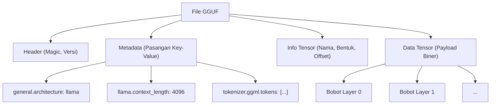
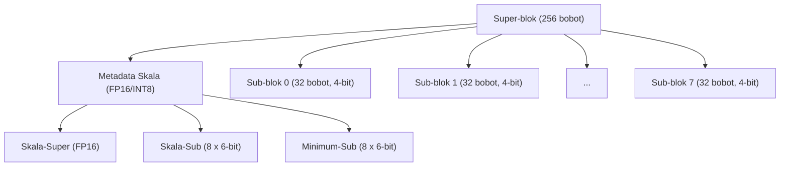
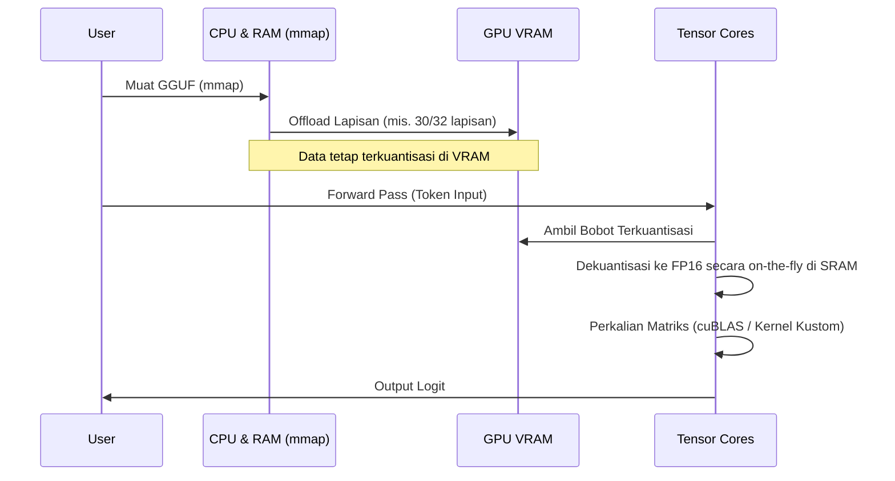

## 1. Pendahuluan: Mengapa LLM Membutuhkan Kuantisasi?

Perkembangan Large Language Models (LLM) dalam beberapa tahun terakhir sangat luar biasa, namun di balik itu muncul masalah serius berupa "penipisan sumber daya komputasi" dan "bottleneck bandwidth memori". Misalnya, jika kita memuat model dengan 70B (70 miliar) parameter seperti Llama 3 ke dalam memori menggunakan presisi 16-bit floating-point (FP16) standar, parameternya saja akan mengonsumsi sekitar 140GB VRAM/RAM. Jika ditambah dengan konteks saat inferensi (KV cache), model ini tidak akan berjalan tanpa mengelompokkan beberapa GPU high-end untuk pusat data (NVIDIA A100 80GB atau H100 80GB).

Sebagai penyelamat untuk menjalankan LLM bagi pengembang individu dan perangkat edge (MacBook dan PC gaming umum), muncullah **llama.cpp** dan teknologi intinya yaitu **Kuantisasi (Quantization)**. Secara khusus, format file yang disebut **GGUF (GPT-Generated Unified Format)** dan algoritma kuantisasi berbasis blok tingkat lanjut yang disebut **k-quants**, merupakan metode revolusioner yang menekan penurunan akurasi model (Perplexity) seminimal mungkin sambil mengompresi ukuran model menjadi sebagian kecil saja.

Artikel ini akan membahas secara menyeluruh tentang llama.cpp, mulai dari latar belakang matematika dari kuantisasinya, perbedaannya dengan format GGML, struktur detail dari format GGUF, hingga mekanisme internal dari k-quants.

---

## 2. Dasar Matematika dari Kuantisasi (Quantization)

Kuantisasi dalam konteks LLM merujuk pada operasi memetakan nilai kontinu (atau angka floating-point berpresisi tinggi) ke nilai diskrit dengan jumlah bit yang lebih sedikit (INT8, INT4, INT3, dll.).

### 2.1. Rumus Dasar Kuantisasi Linear

Pendekatan paling sederhana adalah kuantisasi linear (Min-Max Quantization). Misalkan tensor bobot berpresisi tinggi asli adalah $W$, dan tensor bilangan bulat terkuantisasi adalah $W_q$.

$$ W_q = \text{round}\left( \frac{W}{S} \right) + Z $$

Di mana,
- $S$ adalah **Faktor Skala (Scale Factor)**, yang menentukan ukuran langkah (resolusi) kuantisasi.
- $Z$ adalah **Zero-point**, yang merupakan nilai bias untuk menggeser ke nilai bilangan bulat mana bilangan real $0.0$ dipetakan setelah kuantisasi.
- $\text{round}(\cdot)$ adalah fungsi pembulatan ke bilangan bulat terdekat.

Melalui dekuantisasi (Dequantization), perkiraan bobot bilangan real $\tilde{W}$ dipulihkan selama inferensi.

$$ \tilde{W} = S \times (W_q - Z) $$

### 2.2. Kuantisasi Simetris vs Kuantisasi Asimetris

Berdasarkan cara menangani Zero-point $Z$, ini sebagian besar dibagi menjadi dua metode.

1. **Kuantisasi Asimetris (Asymmetric Quantization)**
   Memetakan menggunakan nilai minimum $W_{\min}$ dan nilai maksimum $W_{\max}$ dari data.
   $$ S = \frac{W_{\max} - W_{\min}}{2^b - 1}, \quad Z = \text{round}\left(-\frac{W_{\min}}{S}\right) $$
   Di mana $b$ adalah jumlah bit kuantisasi (contoh: jika 4 bit, $2^4-1 = 15$). Karena perlu menyimpan $Z$, komputasi dan overhead memori akan sedikit meningkat.

2. **Kuantisasi Simetris (Symmetric Quantization)**
   Menggunakan nilai maksimum absolut dari data, dan memetakan dengan titik nol sebagai pusat ($Z=0$).
   $$ S = \frac{\max(|W_{\max}|, |W_{\min}|)}{2^{b-1} - 1}, \quad Z = 0 $$
   Kuantisasi awal di llama.cpp (misalnya Q4_0 warisan) menggunakan kuantisasi simetris, dan karena tidak ada istilah $Z$, ia memiliki keuntungan berupa penghitungan produk titik (dot product) yang sangat cepat dengan instruksi SIMD.

---

## 3. Evolusi dari GGML ke GGUF dan Struktur File

Saat membahas llama.cpp, kita tidak boleh melupakan **GGML**, sebuah pustaka operasi tensor yang ditulis dalam C++, dan **GGUF**, format file turunan darinya.

### 3.1. Tantangan GGML

llama.cpp versi awal menggunakan format `ggml` (dan variannya seperti `ggjt`). Namun, ada beberapa masalah dengan ini.
- **Kurangnya Ekstensibilitas:** Magic number dan hyperparameter dikodekan secara statis (hardcoded) dengan panjang dan urutan tetap, sehingga setiap kali arsitektur model baru (misal: Llama, Falcon, Mixtral, dll.) atau tokenizer baru ditambahkan, akan terjadi perubahan yang merusak kompatibilitas.
- **Hilangnya Kompatibilitas Mundur (Backward Compatibility):** Format sering diperbarui, sehingga sering terjadi situasi di mana file model lama tidak dapat dibaca oleh llama.cpp versi terbaru.

### 3.2. Lahirnya Format GGUF

**GGUF**, yang diperkenalkan pada Agustus 2023, adalah format sangat serbaguna yang dirancang untuk memecahkan masalah ini. Fitur terbesarnya adalah adopsi **struktur metadata berbasis Key-Value**.

Diagram Mermaid di bawah ini mengabstraksikan struktur file GGUF.



**Keuntungan Utama GGUF:**
1. **Fleksibilitas:** Hyperparameter model, pengaturan RoPE (Rotary Positional Embedding), data kosakata tokenizer, dll. semuanya disimpan sebagai pasangan Key-Value bernama. Karena kunci yang tidak dikenal diabaikan, fitur baru mudah ditambahkan.
2. **Independen Endianness:** GGUF menggunakan little-endian secara default, namun portabel secara aman antar arsitektur yang berbeda karena memiliki flag secara eksplisit.
3. **Optimalisasi untuk mmap (Memory Mapping):** Data tensor diselaraskan (padding) pada batas tertentu, dan dapat dipetakan langsung dari disk ke ruang memori menggunakan sistem panggilan `mmap()` dari OS. Hal ini membuat waktu inisialisasi pemuatan model pada dasarnya menjadi nol.

---

## 4. Kedalaman k-quants: Kuantisasi Berbasis Blok Tingkat Lanjut

Nilai sesungguhnya dari format GGUF adalah **k-quants (K-quantization)**, yaitu mekanisme yang bertanggung jawab atas kompresi bobot model.

Bobot pada jaringan saraf biasa (neural networks) memiliki bentuk yang mendekati distribusi normal saat dilihat secara keseluruhan pada satu lapisan, tetapi ada nilai pencilan (Outliers) secara lokal. Jika bobot seluruh lapisan dikuantisasi dengan faktor skala $S$ yang seragam, informasi dari bobot kecil akan sepenuhnya hilang karena tertarik oleh pencilan.

Untuk mencegah hal ini, llama.cpp melakukan **Kuantisasi Berbasis Blok (Block-wise Quantization)**. Tensor bobot dibagi menjadi blok-blok kecil (misalnya 32 elemen atau 256 elemen), dan setiap blok diberikan faktor skala (serta zero-point) yang unik.

### 4.1. Keterbatasan Kuantisasi Warisan (Q4_0, Q4_1)

`Q4_0` awal menjadikan 32 bobot FP16 sebagai satu blok dan berbagi satu faktor skala FP16.
- Ukuran blok: 32
- Memori: 1 skala (16-bit) + 32 bobot 4-bit (128-bit) = 144 bit
- Bit efektif per elemen (bpw: bits per weight): $144 / 32 = 4,5$ bpw

Meskipun ini sudah cukup baik, batasan akurasi dan rasio kompresi mulai terlihat. Untuk mengatasi itu, hadirlah **k-quants**, yang memiliki struktur hierarkis yang lebih kompleks dan halus.

### 4.2. Struktur Hierarkis Super-blok dan Sub-blok (Contoh Q4_K_M)

k-quants memiliki struktur hierarkis yang terdiri dari "Super-blok (Super-block)" berukuran besar, dan "Sub-blok (Sub-block)" berukuran kecil yang tercakup di dalamnya. Dengan ini, kuantisasi juga dilakukan pada metadata itu sendiri (seperti nilai skala), untuk menurunkan bpw seminimal mungkin sambil mempertahankan akurasi.

Mari kita lihat struktur dari pengaturan yang paling populer, yaitu **Q4_K_M**. Pada Q4_K_M, super-blok dengan 256 elemen digunakan.



Struktur aktual dalam C++ (GGML) didefinisikan secara konseptual seperti berikut ini.

```cpp
// Struktur konseptual dari block_q4_K dalam llama.cpp
#define QK_K 256

struct block_q4_K {
    uint8_t d[2];          // Skala-super untuk seluruh super-blok (contoh FP16 x 2)
    uint8_t scales[12];    // Data gabungan dari skala 6-bit dan nilai minimum (zero-point) 6-bit untuk 8 sub-blok (masing-masing 32 elemen)
    uint8_t qs[QK_K/2];    // Data bobot yang dikuantisasi dalam 4-bit (256 elemen / 2 = 128 byte)
};
```

**Proses Dekuantisasi Matematika:**

Nilai perkiraan bilangan real $\tilde{W}_{i, j}$ untuk elemen $j$ ($0 \le j < 32$) dalam sub-blok $i$ ($0 \le i < 8$) dihitung sebagai berikut.

$$ \tilde{W}_{i, j} = S_{\text{super}} \times s_i \times (w_{i, j} - m_i) $$

- $S_{\text{super}}$: Skala floating-point untuk seluruh super-blok
- $s_i$: Skala 6-bit yang dikuantisasi untuk sub-blok $i$
- $m_i$: Nilai minimum (zero-point) 6-bit yang dikuantisasi untuk sub-blok $i$
- $w_{i, j}$: Bobot kuantisasi 4-bit ($0 \dots 15$)

Berkat struktur hierarkis ini, memori yang ditempati oleh faktor skala itu sendiri berkurang drastis sekaligus mempertahankan kemampuan beradaptasi terhadap nilai pencilan. Q4_K_M secara keseluruhan mencapai sekitar **4,8 bpw**.

### 4.3. Beragam Opsi k-quants

llama.cpp menyediakan banyak variasi tergantung pada tujuannya. Akhiran setelah "K" (S, M, L) menunjukkan seberapa besar ukurannya.

| Format | BPW (Bits per Weight) | Ringkasan dan Fitur |
| :--- | :---: | :--- |
| **Q2_K** | 2,5～3,3 | Kompresi ekstrem. Akurasi menurun drastis, tetapi ditujukan untuk lingkungan dengan VRAM yang sangat minim. |
| **Q3_K_M** | 3,3 | Standar kuantisasi 3-bit. Lebih menurun dibanding Q4, namun seringkali masih dalam batas yang bisa ditoleransi. |
| **Q4_K_M** | 4,8 | **Sweet spot yang direkomendasikan**. Menyeimbangkan separuh ukuran model dan mempertahankan akurasi. |
| **Q5_K_M** | 5,5 | Ketika akurasi yang lebih tinggi dibutuhkan. Berada di posisi menengah antara Q4 dan FP16. |
| **Q6_K** | 6,6 | Mempertahankan Perplexity yang hampir setara dengan FP16, tetapi ukuran file sedikit lebih besar. |
| **Q8_0** | 8,5 | Setara dengan INT8. Terutama digunakan untuk tensor perantara perhitungan saat inferensi, atau hanya pada lapisan terakhir. |

※BPW aktual dirata-ratakan pada seluruh model, karena kuantisasi campuran (Mixed Quantization) dilakukan bergantung pada tensor model (misalnya proyeksi Q/K/V pada Attention, atau bobot FFN). Optimalisasi internal dilakukan dengan mengkuantisasi tensor penting dengan Q6 dan yang lainnya dengan Q4.

---

## 5. Optimalisasi Performa Inferensi: Arsitektur SIMD dan CUDA

Sekadar memuat model GGUF ke dalam memori tidak membuat inferensi menjadi cepat. Sebagian besar inferensi LLM adalah "Perkalian Matriks (Matrix-Vector Multiplication, disingkat GEMV, atau Matrix-Matrix, GEMM)". Kuncinya adalah bagaimana mempercepat operasi penjumlahan-perkalian (multiply-accumulate) dari bobot terkuantisasi dan aktivasi (data input) yang dipertahankan dalam FP16 (atau FP32).

### 5.1. Pemanfaatan Instruksi SIMD pada Lingkungan CPU

Kecepatan luar biasa llama.cpp pada inferensi CPU disebabkan oleh optimalisasi **SIMD (Single Instruction, Multiple Data)** di level assembly.
Misalnya, instruksi **AVX2** dan **AVX-512** sepenuhnya dimanfaatkan pada CPU Intel/AMD, serta **ARM NEON** pada Apple Silicon.

Selama inferensi, perkalian tidak dilakukan dengan sengaja mengembalikan $W_q$ ke FP32 (Dequantize) terlebih dahulu.
Aktivasi juga dikuantisasi secara dinamis per blok (Dynamic Quantization, biasanya menjadi INT8), dan perhitungan integer **INT8 $\times$ INT4** dihitung sekaligus menggunakan instruksi dot product khusus pada SIMD (contoh: `vdpaddd` atau `_mm256_madd_epi16`). Throughput yang luar biasa dicapai dengan mengembalikannya ke FP32 dan mengalikannya dengan faktor skala di akumulator akhir.

### 5.2. Offload di Lingkungan GPU (cuBLAS / CUDA)

llama.cpp baru-baru ini juga memiliki dukungan kuat untuk GPU NVIDIA (CUBLAS / CUDA), tidak hanya untuk CPU.
Sebagian atau seluruh layer file GGUF dapat di-offload ke VRAM (opsi `--n-gpu-layers`).



Saat melakukan komputasi pada GPU, bandwidth VRAM (Memory Bandwidth) menjadi bottleneck utama. Karena bobot dikompresi menggunakan k-quants, jumlah transfer data dari VRAM ke unit komputasi GPU (SM: Streaming Multiprocessor atau Tensor Cores) berkurang hingga 1/3 ~ 1/4. Begitu bobot tiba di unit komputasi, ia didekuantisasi (diekstrak) menjadi FP16 secara *on-the-fly*, dan perkalian matriks dieksekusi dalam kecepatan sangat tinggi menggunakan Tensor Core.
Dengan kata lain, kuantisasi dilakukan **"bukan untuk mengurangi jumlah komputasi", melainkan "untuk mengurangi jumlah transfer memori"**.

---

## 6. Contoh Nyata: Trade-off Penggunaan Memori dan Performa

Di sini, mari kita lihat spesifikasi yang dibutuhkan berdasarkan tingkat kuantisasi GGUF menggunakan contoh model Llama 3 8B. (Angka merupakan perkiraan umum)

| Model/Kuantisasi | Ukuran File | VRAM/RAM yang Dibutuhkan | Kecepatan Inferensi (Perkiraan) | Penurunan Perplexity |
| :--- | :--- | :--- | :--- | :--- |
| **Llama-3-8B (FP16)** | Sekitar 16 GB | Lebih dari 18 GB | Standar | Tidak ada (Base) |
| **Llama-3-8B (Q8_0)** | Sekitar 8,5 GB | Lebih dari 10 GB | Cepat | Hampir nol |
| **Llama-3-8B (Q6_K)** | Sekitar 6,6 GB | Lebih dari 8 GB | Sangat cepat | Sangat kecil |
| **Llama-3-8B (Q4_K_M)** | Sekitar 4,9 GB | Lebih dari 6,5 GB | Paling cepat・Optimal | Dalam batas toleransi・Kecil |
| **Llama-3-8B (Q3_K_M)** | Sekitar 3,9 GB | Lebih dari 5,5 GB | Paling cepat | Agak menonjol |
| **Llama-3-8B (Q2_K)** | Sekitar 3,0 GB | Lebih dari 4,5 GB | Cepat | Penurunan yang jelas |

**Catatan Penting (Pengaruh KV Cache):**
Pada inferensi LLM, jika panjang konteks (jumlah token dari prompt) semakin panjang, tidak hanya bobot model, tetapi juga konsumsi memori untuk **KV Cache**, yang menyimpan kondisi Attention masa lalu, akan meledak secara drastis.
Sebagai contoh, dengan konteks sepanjang 8192 token, ia bisa menghabiskan beberapa GB hanya untuk KV Cache. Oleh karena itu, dalam penerapan sebenarnya, batas aman (Headroom) sekitar `Ukuran file model + sekitar 1,5GB~3GB` harus disisihkan. Alasan utama mengapa Q4_K_M direkomendasikan adalah karena meskipun KV cache ini diamankan, ia tetap menjadi titik keseimbangan yang pas dan aman berjalan pada GPU dengan memori VRAM 8GB umum (seperti RTX 3060 / 4060).

Dalam llama.cpp versi terbaru, fitur untuk **mengkuantisasi KV cache itu sendiri menjadi Q8_0 atau Q4_0** juga telah ditambahkan, sehingga selalu ada upaya tanpa henti untuk lebih memperpanjang panjang konteks.

---

## 7. Kesimpulan

Pada artikel ini, kita telah menggali lebih dalam dan menjelaskan tentang struktur internal dari format GGUF dan teknologi kuantisasi k-quants, yang merupakan jantung dari llama.cpp.

1. **Fleksibilitas GGUF:** Melalui struktur metadata berbasis Key-Value, ekosistem yang tangguh telah dibangun sehingga dapat mengikuti perkembangan pesat LLM (seperti kemunculan arsitektur model baru) tanpa menyebabkan perubahan yang merusak kompatibilitas.
2. **Kompresi Ekstrem oleh k-quants:** Dengan manajemen faktor skala hierarkis dari super-blok dan sub-blok, llama.cpp berhasil mempertahankan informasi nilai pencilan, sambil mencapai rasio kompresi menakjubkan dengan rata-rata 4,8 bit per bobot (Q4_K_M).
3. **Mengatasi Bottleneck Bandwidth Memori:** Penerapan kernel canggih untuk SIMD dan CUDA yang melakukan komputasi serentak dengan dekuantisasi on-the-fly, dapat mengurangi jumlah transfer dari VRAM dan secara dramatis meningkatkan kecepatan inferensi.

Kemampuan teknologi dari llama.cpp dalam mendorong demokratisasi AI bukan sekadar alat bantu biasa, tidak berlebihan jika dikatakan bahwa ini adalah salah satu pencapaian tertinggi dalam rekayasa perangkat lunak modern. Memahami algoritma kuantisasi dan mekanisme format GGUF akan membantu Anda memilih model paling sesuai untuk lingkungan Anda sendiri dan menjalankan penyesuaian performa (performance tuning) yang lebih akurat.

### Tautan Referensi
- [Repositori GitHub llama.cpp](https://github.com/ggerganov/llama.cpp)
- [Spesifikasi Format GGUF](https://github.com/ggerganov/ggml/blob/master/docs/gguf.md)
- [PR Implementasi K-quants](https://github.com/ggerganov/llama.cpp/pull/1684)

(Selesai)
