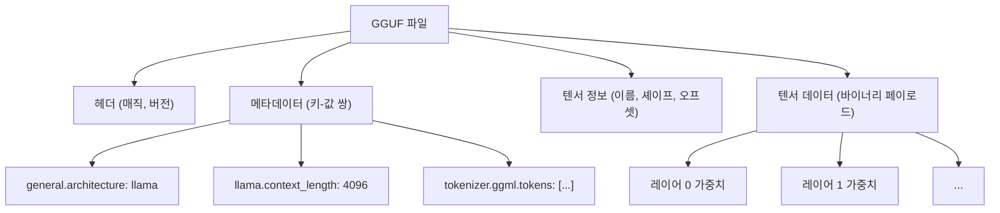
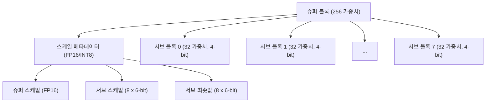
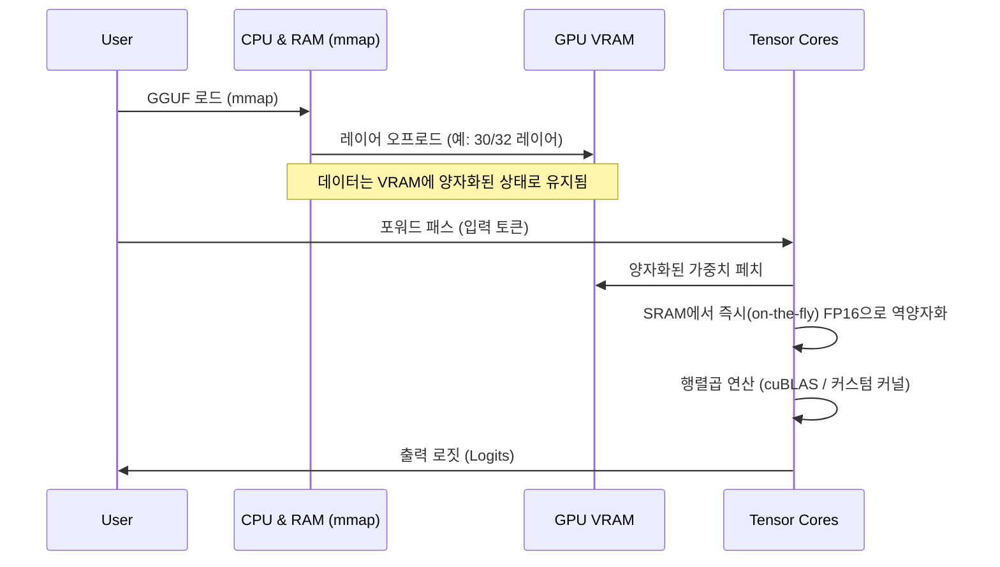

## 1. 들어가며: 왜 LLM에는 양자화가 필요한가?

최근 대규모 언어 모델(LLM: Large Language Models)의 발전은 눈부실 정도이지만, 그 이면에는 '컴퓨팅 자원의 고갈'과 '메모리 대역폭의 병목 현상'이라는 심각한 문제가 떠오르고 있습니다. 예를 들어, Llama 3와 같은 70B(700억) 파라미터 모델을 표준적인 16비트 부동소수점(FP16)으로 메모리에 로드할 경우, 파라미터만으로 약 140GB의 VRAM/RAM을 소비합니다. 여기에 추론 시의 컨텍스트(KV 캐시)가 더해지면, 데이터센터용 하이엔드 GPU(NVIDIA A100 80GB나 H100 80GB)를 여러 대 클러스터링하지 않고서는 작동하지 않습니다.

개인 개발자나 엣지 디바이스(MacBook이나 일반적인 게이밍 PC)에서 LLM을 구동시키기 위한 구세주로 등장한 것이 **llama.cpp**와 그 핵심을 이루는 **양자화(Quantization) 기술**입니다. 특히 **GGUF (GPT-Generated Unified Format)**라는 파일 포맷과 **k-quants**라고 불리는 고도화된 블록 단위의 양자화 알고리즘은, 모델의 정확도(Perplexity) 저하를 극한까지 억제하면서 모델 크기를 몇 분의 일로 압축하는 획기적인 기법입니다.

본 문서에서는 이 llama.cpp에서의 양자화의 수학적 배경부터 GGML 형식과의 차이, GGUF 포맷의 상세한 구조, 그리고 k-quants의 내부 메커니즘에 이르기까지 철저하게 해설합니다.

---

## 2. 양자화(Quantization)의 수학적 기초

LLM의 문맥에서 양자화란, 연속적인 값(또는 고정밀도의 부동소수점 수)을 더 적은 비트 수(INT8, INT4, INT3 등)의 이산적인 값으로 매핑하는 작업을 의미합니다.

### 2.1. 선형 양자화의 기본 수식

가장 단순한 접근법은 선형 양자화(Min-Max 양자화)입니다. 원래의 고정밀도 가중치 텐서를 $W$, 양자화된 정수 텐서를 $W_q$라고 합시다.

$$ W_q = \text{round}\left( \frac{W}{S} \right) + Z $$

여기서,
- $S$는 **스케일 팩터(Scale Factor)**이며, 양자화의 스텝 크기(해상도)를 결정합니다.
- $Z$는 **제로 포인트(Zero-point)**이며, 실수의 $0.0$이 양자화 후의 어떤 정수값에 대응할지를 시프트하기 위한 바이어스 값입니다.
- $\text{round}(\cdot)$는 가장 가까운 정수로의 반올림 함수입니다.

역양자화(Dequantization)를 통해, 추론 시에는 근사적인 실수 가중치 $\tilde{W}$를 복원합니다.

$$ \tilde{W} = S \times (W_q - Z) $$

### 2.2. 대칭 양자화 vs 비대칭 양자화

제로 포인트 $Z$를 다루는 방식에 따라 크게 두 가지 방식으로 나뉩니다.

1. **비대칭 양자화 (Asymmetric Quantization)**
   데이터의 최솟값 $W_{\min}$과 최댓값 $W_{\max}$를 사용하여 매핑합니다.
   $$ S = \frac{W_{\max} - W_{\min}}{2^b - 1}, \quad Z = \text{round}\left(-\frac{W_{\min}}{S}\right) $$
   여기서 $b$는 양자화 비트 수입니다(예: 4비트라면 $2^4-1 = 15$). $Z$를 유지할 필요가 있기 때문에 계산과 메모리 오버헤드가 약간 증가합니다.

2. **대칭 양자화 (Symmetric Quantization)**
   데이터의 절댓값의 최댓값을 사용하여 0을 중심으로 매핑합니다($Z=0$).
   $$ S = \frac{\max(|W_{\max}|, |W_{\min}|)}{2^{b-1} - 1}, \quad Z = 0 $$
   llama.cpp의 초창기 양자화(예를 들어 레거시인 Q4_0 등)는 대칭 양자화를 채택하고 있으며, $Z$ 항이 없기 때문에 SIMD 명령에서의 내적 계산이 매우 빨라진다는 장점이 있습니다.

---

## 3. GGML에서 GGUF로의 진화와 파일 구조

llama.cpp를 논할 때 빼놓을 수 없는 것이, C++로 작성된 텐서 연산 라이브러리 **GGML**과 거기서 파생된 파일 포맷 **GGUF**입니다.

### 3.1. GGML의 과제

초기 llama.cpp는 `ggml` 포맷(및 `ggjt` 등의 변종)을 사용하고 있었습니다. 하지만 이들에는 다음과 같은 문제가 있었습니다.
- **확장성 부족:** 매직 넘버나 하이퍼파라미터가 고정 길이·고정 순서로 하드코딩되어 있어, 새로운 모델 아키텍처(예: Llama, Falcon, Mixtral 등)나 새로운 토크나이저를 추가할 때마다 파괴적인 변경이 발생했습니다.
- **하위 호환성 상실:** 포맷이 빈번하게 업데이트되어, 오래된 모델 파일을 최신 llama.cpp에서 읽어 들이지 못하는 사태가 다수 발생했습니다.

### 3.2. GGUF 포맷의 탄생

2023년 8월에 도입된 **GGUF**는 이러한 문제들을 해결하기 위해 설계된 범용성 높은 포맷입니다. 가장 큰 특징은 **키-값(Key-Value) 기반의 메타데이터 구조**를 채택했다는 것입니다.

아래의 Mermaid 다이어그램은 GGUF의 파일 구조를 추상화한 것입니다.



**GGUF의 주요 이점:**
1. **유연성:** 모델의 하이퍼파라미터나 RoPE(Rotary Positional Embedding) 설정, 토크나이저의 어휘 데이터 등을 모두 이름이 지정된 Key-Value 쌍으로 저장합니다. 알 수 없는 키는 무시되므로 새로운 기능의 추가가 쉽습니다.
2. **엔디안 독립성:** GGUF는 기본적으로 리틀 엔디안을 채택하고 있지만, 명시적으로 플래그를 가지기 때문에 다른 아키텍처 간에도 안전하게 이식 가능합니다.
3. **mmap(메모리 매핑) 최적화:** 텐서 데이터는 특정 경계로 정렬(패딩)되어 있으며, OS의 `mmap()` 시스템 콜을 사용하여 디스크에서 직접 메모리 공간으로 매핑 가능합니다. 이를 통해 모델 읽기의 초기화 시간이 사실상 제로가 됩니다.

---

## 4. k-quants의 심연: 고도화된 블록 단위 양자화

GGUF 포맷의 진면목은 모델 가중치의 압축을 담당하는 **k-quants (K-quantization)**라는 메커니즘입니다.

일반적인 신경망의 가중치는 레이어 전체로 보면 정규분포에 가까운 형태를 띠고 있지만, 국소적으로는 이상치(Outliers)가 존재합니다. 일률적인 스케일 팩터 $S$로 레이어 전체의 가중치를 양자화하면, 이상치에 끌려가서 작은 가중치의 정보가 완전히 소실되어 버립니다.

이를 방지하기 위해 llama.cpp에서는 **블록 단위 양자화(Block-wise Quantization)**를 수행합니다. 가중치 텐서를 작은 블록(예를 들어 32요소나 256요소)으로 분할하고, 블록마다 고유한 스케일 팩터(및 제로 포인트)를 가지게 하는 것입니다.

### 4.1. 레거시 양자화(Q4_0, Q4_1)의 한계

초기의 `Q4_0`은 32개의 FP16 가중치를 하나의 블록으로 하고, 1개의 FP16 스케일 팩터를 공유했습니다.
- 블록 크기: 32
- 메모리: 1개의 스케일(16bit) + 32개의 4bit 가중치(128bit) = 144bit
- 요소당 실효 비트 수 (bpw: bits per weight): $144 / 32 = 4.5$ bpw

이것만으로도 충분히 우수하지만, 정확도와 압축률의 한계가 보이기 시작했습니다. 그래서 등장한 것이 더욱 복잡하고 정교한 계층 구조를 가지는 **k-quants**입니다.

### 4.2. 슈퍼 블록과 서브 블록의 계층 구조 (Q4_K_M의 예)

k-quants는 커다란 '슈퍼 블록(Super-block)'과 그 내부에 포함되는 작은 '서브 블록(Sub-block)'이라는 계층 구조를 가집니다. 이를 통해 메타데이터(스케일 값 등) 자체의 양자화도 수행하여, 극한까지 bpw를 낮추면서 정확도를 유지합니다.

가장 인기 있는 설정인 **Q4_K_M**의 구조를 살펴봅시다. Q4_K_M에서는 256요소의 슈퍼 블록을 사용합니다.



C++(GGML)에서 실제 구조체는 다음과 같이 정의되어 있습니다.

```cpp
// llama.cpp의 block_q4_K 개념적 구조
#define QK_K 256

struct block_q4_K {
    uint8_t d[2];          // 슈퍼 블록 전체의 슈퍼 스케일 (FP16 x 2 등)
    uint8_t scales[12];    // 8개의 서브 블록(각 32요소)의 6-bit 스케일과 6-bit 최솟값(제로 포인트)을 팩(pack)한 데이터
    uint8_t qs[QK_K/2];    // 4-bit로 양자화된 가중치 데이터 (256요소 / 2 = 128 bytes)
};
```

**수학적인 역양자화(Dequantization) 처리:**

서브 블록 $i$($0 \le i < 8$) 내의 요소 $j$($0 \le j < 32$)의 근사적인 실수값 $\tilde{W}_{i, j}$는 다음과 같이 계산됩니다.

$$ \tilde{W}_{i, j} = S_{\text{super}} \times s_i \times (w_{i, j} - m_i) $$

- $S_{\text{super}}$: 슈퍼 블록 전체의 부동소수점 스케일
- $s_i$: 서브 블록 $i$용으로 양자화된 6-bit 스케일
- $m_i$: 서브 블록 $i$용으로 양자화된 6-bit 최솟값(제로 포인트)
- $w_{i, j}$: 4-bit의 양자화 가중치 ($0 \dots 15$)

이 계층 구조를 통해 이상치에 대한 적응력을 유지하면서, 스케일 팩터 자체가 차지하는 메모리 양을 극적으로 감소시킵니다. Q4_K_M은 전체적으로 **4.8 bpw** 정도를 실현합니다.

### 4.3. 다양한 k-quants 옵션

llama.cpp는 목적에 따라 다양한 변형을 제공하고 있습니다. "K" 뒤의 접미사(S, M, L)는 크기의 대소를 나타냅니다.

| 포맷 | BPW (Bits per Weight) | 개요 및 특징 |
| :--- | :---: | :--- |
| **Q2_K** | 2.5～3.3 | 극한까지 압축. 정확도 저하가 뚜렷하지만, VRAM이 극단적으로 적은 환경용. |
| **Q3_K_M** | 3.3 | 3비트 양자화의 표준. Q4보다는 열화되지만 허용 범위 내에 들어오는 경우가 많음. |
| **Q4_K_M** | 4.8 | **권장되는 스위트스팟(Sweet spot)**. 모델 크기의 반감과 정확도 유지를 양립. |
| **Q5_K_M** | 5.5 | 더 높은 정확도를 원할 경우. Q4와 FP16의 중간적인 위치. |
| **Q6_K** | 6.6 | FP16과 거의 동등한 Perplexity를 유지하지만, 파일 크기는 큰 편. |
| **Q8_0** | 8.5 | INT8 상당. 주로 추론 시의 계산용 중간 텐서나, 최종 레이어에서만 사용됨. |

※실제 BPW는 모델의 텐서(예를 들어 Attention의 Q/K/V 프로젝션인지, FFN의 가중치인지)에 따라 혼합 양자화(Mixed Quantization)가 이루어지기 때문에, 모델 전체로 평균화됩니다. 중요한 텐서는 Q6으로, 그 외는 Q4로 양자화하는 등의 최적화가 내부적으로 수행되고 있습니다.

---

## 5. 추론 시의 성능 최적화: SIMD와 CUDA 아키텍처

GGUF 모델을 메모리에 로드한 것만으로는 추론이 빨라지지 않습니다. LLM 추론의 대부분은 '행렬곱(Matrix-Vector Multiplication, 줄여서 GEMV, 혹은 Matrix-Matrix, GEMM)'입니다. 양자화된 가중치와, FP16(또는 FP32)으로 유지되고 있는 활성화(입력 데이터)의 적화(Multiply-Accumulate) 연산을 어떻게 고속화할지가 관건입니다.

### 5.1. CPU 환경에서의 SIMD 명령 활용

llama.cpp가 CPU 추론에서 경이적인 속도를 자랑하는 것은, 어셈블리 레벨에서의 **SIMD (Single Instruction, Multiple Data)** 최적화에 있습니다.
예를 들어 Intel/AMD의 CPU에서는 **AVX2**나 **AVX-512**, Apple Silicon에서는 **ARM 대각선(NEON)** 명령셋을 십분 활용합니다.

추론 중, 굳이 $W_q$를 FP32로 되돌려서(Dequantize해서) 곱셈을 수행하는 것은 아닙니다.
활성화 측도 블록 단위로 동적 양자화(Dynamic Quantization, 보통은 INT8로 양자화)하고, **INT8 $\times$ INT4**의 정수 연산을 SIMD의 특수한 점곱 명령(예: `vdpaddd`나 `_mm256_madd_epi16`)을 사용하여 단숨에 계산합니다. 최종적인 누산기(Accumulator)에서 FP32로 되돌려 스케일 팩터를 곱함으로써 경이적인 처리량을 실현하고 있습니다.

### 5.2. GPU 환경 (cuBLAS / CUDA)에서의 오프로드

최근의 llama.cpp는 CPU뿐만 아니라, NVIDIA GPU에 대한 강력한 지원(CUBLAS / CUDA)도 가지고 있습니다.
GGUF 파일의 일부 또는 전부의 레이어를 VRAM으로 오프로드하는 것이 가능합니다(`--n-gpu-layers` 옵션).



GPU 상에서 계산할 경우, VRAM의 대역폭(Memory Bandwidth)이 최대의 병목이 됩니다. 가중치가 k-quants로 압축되어 있기 때문에, VRAM에서 GPU의 연산 유닛(SM: Streaming Multiprocessor나 텐서 코어)으로의 데이터 전송량이 1/3 ~ 1/4로 감소합니다. 계산 유닛에 가중치가 도달하는 순간에 실시간(on-the-fly)으로 FP16으로 역양자화(전개)되며, 텐서 코어를 사용하여 초고속으로 행렬곱이 실행됩니다.
즉, 양자화는 **'계산량을 줄이기' 위해서가 아니라 '메모리 전송량을 줄이기' 위해서 수행되고 있다**고 할 수 있습니다.

---

## 6. 메모리 사용량과 성능의 트레이드오프 구체적 예시

여기서, Llama 3 8B 모델을 예로 들어, GGUF의 양자화 레벨별 요구 스펙을 살펴보겠습니다. (수치는 대략적인 기준입니다)

| 모델/양자화 | 파일 크기 | 필요한 VRAM/RAM | 추론 속도(기준) | Perplexity 열화 |
| :--- | :--- | :--- | :--- | :--- |
| **Llama-3-8B (FP16)** | 약 16 GB | 18 GB 이상 | 기준 | 없음 (Base) |
| **Llama-3-8B (Q8_0)** | 약 8.5 GB | 10 GB 이상 | 고속 | 거의 없음 |
| **Llama-3-8B (Q6_K)** | 약 6.6 GB | 8 GB 이상 | 매우 고속 | 극소 |
| **Llama-3-8B (Q4_K_M)** | 약 4.9 GB | 6.5 GB 이상 | 최속·최적 | 허용 범위·미미함 |
| **Llama-3-8B (Q3_K_M)** | 약 3.9 GB | 5.5 GB 이상 | 최속 | 약간 눈에 띔 |
| **Llama-3-8B (Q2_K)** | 약 3.0 GB | 4.5 GB 이상 | 고속 | 명백한 열화 |

**주의점 (KV 캐시의 영향):**
LLM 추론에 있어서, 컨텍스트 길이(프롬프트의 토큰 수)가 길어지면, 모델의 가중치뿐만 아니라 과거의 Attention 상태를 보존하는 **KV 캐시**의 메모리 소비가 폭발적으로 증가합니다.
예를 들어 컨텍스트가 8192 토큰인 경우, KV 캐시만으로 수 GB를 소비합니다. 따라서 실제 운용에서는 `모델 파일 크기 + 약 1.5GB～3GB`의 여유 공간(Headroom)을 확보해 둘 필요가 있습니다. Q4_K_M이 권장되는 이유는 이 KV 캐시를 확보하더라도 일반적인 8GB VRAM 탑재 GPU(RTX 3060 / 4060 등)에서 안전하게 동작하는 절묘한 라인이기 때문입니다.

최근의 llama.cpp에서는 이 **KV 캐시 자체를 Q8_0이나 Q4_0으로 양자화하는 기능**도 추가되어 있어, 컨텍스트 길이를 더욱 늘리기 위한 노력이 끊임없이 이루어지고 있습니다.

---

## 7. 요약

본 문서에서는 llama.cpp의 심장부인 GGUF 포맷과 k-quants 양자화 기술의 내부 구조에 대해 깊이 파고들어 해설했습니다.

1. **GGUF의 유연성:** 키-값 형태의 메타데이터 구조를 통해, LLM의 급속한 진화(새로운 모델 아키텍처의 등장)에도 파괴적인 변경 없이 따라갈 수 있는 견고한 생태계를 구축했습니다.
2. **k-quants를 통한 극한의 압축:** 슈퍼 블록과 서브 블록의 계층적인 스케일 팩터 관리를 통해, 이상치의 정보를 유지하면서 가중치 1개당 평균 4.8비트(Q4_K_M)라는 놀라운 압축을 실현했습니다.
3. **메모리 대역폭 병목 해소:** SIMD나 CUDA에서의 고도화된 커널 구현을 통해, 실시간으로 역양자화하며 계산을 수행함으로써 VRAM 전송량을 줄이고 추론 속도를 극적으로 향상시켰습니다.

AI의 민주화를 추진하는 llama.cpp의 기술력은 단순한 도구의 틀을 넘어 현대 소프트웨어 엔지니어링의 최고봉 중 하나라고 해도 과언이 아닙니다. 양자화 알고리즘이나 GGUF 포맷의 원리를 이해함으로써, 자신의 환경에 가장 적합한 모델을 선택하거나 성능 튜닝을 더 정확하게 수행할 수 있을 것입니다.

### 참고 링크
- [llama.cpp GitHub Repository](https://github.com/ggerganov/llama.cpp)
- [GGUF Format Specification](https://github.com/ggerganov/ggml/blob/master/docs/gguf.md)
- [K-quants Implementation PR](https://github.com/ggerganov/llama.cpp/pull/1684)

(끝)
