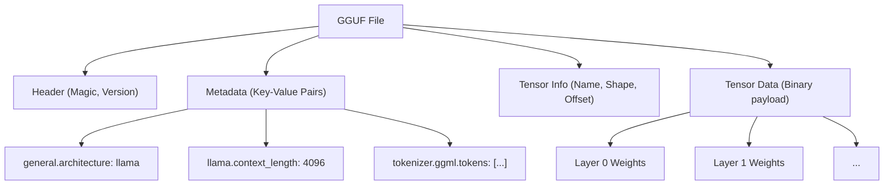
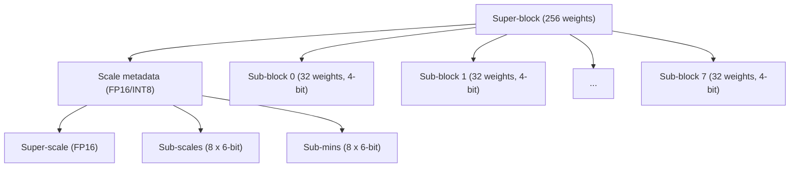
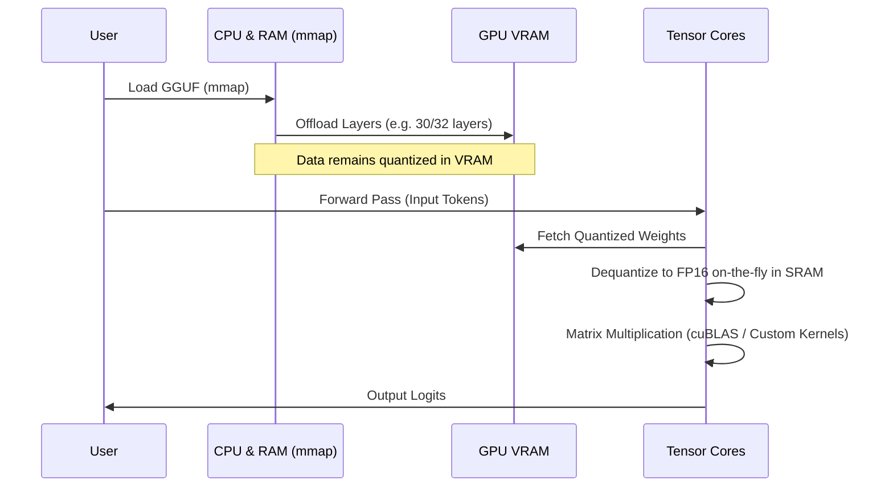

## 1. はじめに：なぜLLMには量子化が必要なのか？

近年の大規模言語モデル（LLM: Large Language Models）の進化は目覚ましいものがありますが、その裏で「計算資源の枯渇」と「メモリ帯域のボトルネック」という深刻な問題が浮上しています。例えば、Llama 3 のような 70B（700億）パラメータのモデルを、標準的な 16ビット浮動小数点（FP16）でメモリにロードした場合、パラメータだけで約 140GB の VRAM/RAM を消費します。これに推論時のコンテキスト（KVキャッシュ）が加わると、データセンター向けのハイエンドGPU（NVIDIA A100 80GB や H100 80GB）を複数台クラスタリングしなければ動作しません。

個人開発者やエッジデバイス（MacBookや一般的なゲーミングPC）でLLMを動作させるための救世主として登場したのが **llama.cpp** とその中核を成す **量子化（Quantization）技術** です。特に **GGUF (GPT-Generated Unified Format)** というファイルフォーマットと、**k-quants** と呼ばれる高度なブロック単位の量子化アルゴリズムは、モデルの精度（Perplexity）の低下を極限まで抑えつつ、モデルサイズを数分の一に圧縮する画期的な手法です。

本記事では、この llama.cpp における量子化の数学的背景から、GGML形式との違い、GGUFフォーマットの詳細な構造、そして k-quants の内部メカニズムに至るまで、徹底的に解説します。

---

## 2. 量子化（Quantization）の数学的基礎

LLMの文脈における量子化とは、連続的な値（あるいは高精度の浮動小数点数）を、より少ないビット数（INT8, INT4, INT3 など）の離散的な値にマッピングする操作を指します。

### 2.1. 線形量子化の基本数式

最も単純なアプローチは線形量子化（Min-Max量子化）です。元の高精度の重みテンソルを $W$、量子化された整数テンソルを $W_q$ とします。

$$ W_q = \text{round}\left( \frac{W}{S} \right) + Z $$

ここで、
- $S$ は **スケールファクタ（Scale Factor）** であり、量子化のステップサイズ（解像度）を決定します。
- $Z$ は **ゼロポイント（Zero-point）** であり、実数の $0.0$ が量子化後のどの整数値に対応するかをシフトするためのバイアス値です。
- $\text{round}(\cdot)$ は最近接整数への丸め関数です。

逆量子化（Dequantization）により、推論時には近似的な実数重み $\tilde{W}$ を復元します。

$$ \tilde{W} = S \times (W_q - Z) $$

### 2.2. 対称量子化 vs 非対称量子化

ゼロポイント $Z$ の扱いにより、大きく二つの方式に分かれます。

1. **非対称量子化 (Asymmetric Quantization)**
   データの最小値 $W_{\min}$ と最大値 $W_{\max}$ を用いてマッピングします。
   $$ S = \frac{W_{\max} - W_{\min}}{2^b - 1}, \quad Z = \text{round}\left(-\frac{W_{\min}}{S}\right) $$
   ここで $b$ は量子化ビット数（例：4ビットなら $2^4-1 = 15$）。$Z$ を保持する必要があるため、計算とメモリのオーバーヘッドがわずかに増えます。

2. **対称量子化 (Symmetric Quantization)**
   データの絶対値の最大値を用いて、ゼロを中心にマッピングします（$Z=0$）。
   $$ S = \frac{\max(|W_{\max}|, |W_{\min}|)}{2^{b-1} - 1}, \quad Z = 0 $$
   llama.cppの初期の量子化（例えばレガシーな Q4_0 など）は対称量子化を採用しており、$Z$ の項がないためSIMD命令での内積計算が非常に高速化されるという利点があります。

---

## 3. GGMLからGGUFへの進化とファイル構造

llama.cpp を語る上で欠かせないのが、C++で書かれたテンソル演算ライブラリ **GGML** と、そこから派生したファイルフォーマット **GGUF** です。

### 3.1. GGMLの課題

初期の llama.cpp は `ggml` フォーマット（および `ggjt` などの亜種）を使用していました。しかし、これらには以下の問題がありました。
- **拡張性の欠如:** マジックナンバーやハイパーパラメータが固定長・固定順序でハードコードされており、新しいモデルアーキテクチャ（例: Llama, Falcon, Mixtral など）や新しいトークナイザを追加するたびに破壊的変更が生じた。
- **後方互換性の喪失:** フォーマットが頻繁にアップデートされ、古いモデルファイルが最新の llama.cpp で読み込めなくなる事態が多発しました。

### 3.2. GGUFフォーマットの誕生

2023年8月に導入された **GGUF** は、これらの問題を解決するために設計された汎用性の高いフォーマットです。最大の特徴は、**キー・バリュー（Key-Value）ベースのメタデータ構造** を採用したことです。

以下の Mermaid 図は、GGUFのファイル構造を抽象化したものです。



**GGUFの主な利点:**
1. **柔軟性:** モデルのハイパーパラメータやRoPE（Rotary Positional Embedding）の設定、トークナイザの語彙データなどをすべて名前付きの Key-Value ペアとして格納。未知のキーは無視されるため、新機能の追加が容易。
2. **エンディアン非依存:** GGUFはデフォルトでリトルエンディアンを採用していますが、明示的にフラグを持つため異なるアーキテクチャ間でも安全にポータブルです。
3. **mmap(メモリマッピング)への最適化:** テンソルデータは特定の境界でアライメント（パディング）されており、OSの `mmap()` システムコールを用いてディスクから直接メモリ空間にマップ可能です。これにより、モデル読み込みの初期化時間が事実上ゼロになります。

---

## 4. k-quants の深淵：高度なブロック単位量子化

GGUFフォーマットの真骨頂は、モデルウェイトの圧縮を担う **k-quants (K-quantization)** という仕組みです。

通常のニューラルネットワークの重みは、層全体で見ると正規分布に近い形をしていますが、局所的には外れ値（Outliers）が存在します。一律のスケールファクタ $S$ で層全体の重みを量子化すると、外れ値に引きずられて小さな重みの情報が完全に失われてしまいます。

これを防ぐため、llama.cppでは **ブロック単位量子化（Block-wise Quantization）** を行います。重みテンソルを小さなブロック（例えば 32要素 や 256要素）に分割し、ブロックごとに固有のスケールファクタ（およびゼロポイント）を持たせるのです。

### 4.1. レガシーな量子化（Q4_0, Q4_1）の限界

初期の `Q4_0` は、32個のFP16重みを1つのブロックとし、1つのFP16スケールファクタを共有していました。
- ブロックサイズ: 32
- メモリ: 1つのスケール(16bit) + 32個の4bitウェイト(128bit) = 144bit
- 要素あたりの実効ビット数 (bpw: bits per weight): $144 / 32 = 4.5$ bpw

これでも十分に優秀ですが、精度と圧縮率の限界が見えてきました。そこで登場したのが、より複雑で精巧な階層構造を持つ **k-quants** です。

### 4.2. スーパーブロックとサブブロックの階層構造（Q4_K_M の例）

k-quants は、大きな「スーパーブロック（Super-block）」と、その内側に含まれる小さな「サブブロック（Sub-block）」という階層構造を持ちます。これにより、メタデータ（スケール値など）自体の量子化も行い、極限まで bpw を下げつつ精度を保ちます。

最も人気のある設定である **Q4_K_M** の構造を見てみましょう。Q4_K_M では、256要素のスーパーブロックを使用します。



C++（GGML）における実際の構造体は以下のように定義されています。

```cpp
// llama.cpp における block_q4_K の概念的な構造
#define QK_K 256

struct block_q4_K {
    uint8_t d[2];          // スーパーブロック全体のスーパー・スケール (FP16 x 2 など)
    uint8_t scales[12];    // 8つのサブブロック(32要素ずつ)の 6-bit スケールと 6-bit 最小値(ゼロポイント)をパックしたデータ
    uint8_t qs[QK_K/2];    // 4-bit で量子化されたウェイトデータ (256要素 / 2 = 128 bytes)
};
```

**数学的なデキュー（Dequantization）処理：**

サブブロック $i$（$0 \le i < 8$）内の要素 $j$（$0 \le j < 32$）の近似的な実数値 $\tilde{W}_{i, j}$ は、以下のように計算されます。

$$ \tilde{W}_{i, j} = S_{\text{super}} \times s_i \times (w_{i, j} - m_i) $$

- $S_{\text{super}}$: スーパーブロック全体の浮動小数点スケール
- $s_i$: サブブロック $i$ 用に量子化された 6-bit スケール
- $m_i$: サブブロック $i$ 用に量子化された 6-bit 最小値（ゼロポイント）
- $w_{i, j}$: 4-bit の量子化ウェイト ($0 \dots 15$)

この階層構造により、外れ値への適応力を維持しながら、スケールファクタ自体が占めるメモリ量を劇的に削減しています。Q4_K_M は全体で **4.8 bpw** 程度を実現します。

### 4.3. 多様な k-quants オプション

llama.cpp は目的に応じて多数のバリエーションを提供しています。「K」の後ろのサフィックス（S, M, L）はサイズの大小を表します。

| フォーマット | BPW (Bits per Weight) | 概要と特徴 |
| :--- | :---: | :--- |
| **Q2_K** | 2.5～3.3 | 極限まで圧縮。精度低下が著しいが、VRAMが極端に少ない環境用。 |
| **Q3_K_M** | 3.3 | 3ビット量子化の標準。Q4よりは劣化するが許容範囲内に収まることが多い。 |
| **Q4_K_M** | 4.8 | **推奨されるスイートスポット**。モデルサイズの半減と精度の維持を両立。 |
| **Q5_K_M** | 5.5 | より高精度を求める場合。Q4とFP16の中間的な立ち位置。 |
| **Q6_K** | 6.6 | FP16とほぼ同等のPerplexityを維持するが、ファイルサイズは大きめ。 |
| **Q8_0** | 8.5 | INT8相当。主に推論時の計算用中間テンソルや、最終層でのみ使用される。 |

※実際のBPWは、モデルのテンソル（例えば Attention の Q/K/V プロジェクションか、FFNの重みか）によって、混合量子化（Mixed Quantization）が行われるため、モデル全体で平均化されます。重要なテンソルはQ6で、それ以外をQ4で量子化するなどの最適化が内部で行われています。

---

## 5. 推論時のパフォーマンス最適化：SIMDとCUDAアーキテクチャ

GGUFモデルをメモリにロードしただけでは、推論は高速になりません。LLMの推論の大半は「行列積（Matrix-Vector Multiplication, 略して GEMV、あるいは Matrix-Matrix, GEMM）」です。量子化された重みと、FP16（またはFP32）で保持されているアクティベーション（入力データ）の積和演算をいかに高速化するかが鍵です。

### 5.1. CPU環境におけるSIMD命令の活用

llama.cpp がCPU推論において驚異的な速度を誇るのは、アセンブリ・レベルでの **SIMD (Single Instruction, Multiple Data)** 最適化にあります。
例えば Intel/AMD の CPU では **AVX2** や **AVX-512**、Apple Silicon では **ARM NEON** 命令セットをフル活用します。

推論中、わざわざ $W_q$ を FP32 に戻して（Dequantizeして）から掛け算を行うわけではありません。
アクティベーション側もブロック単位で動的に量子化（Dynamic Quantization、通常は INT8 へ量子化）し、**INT8 $\times$ INT4** の整数演算を SIMD の特殊なドット積命令（例: `vdpaddd` や `_mm256_madd_epi16`）を用いて一気に計算します。最終的なアキュムレータで FP32 に戻してスケールファクタを掛けることで、驚異的なスループットを実現しています。

### 5.2. GPU環境 (cuBLAS / CUDA) でのオフロード

最近の llama.cpp は CPU だけでなく、NVIDIA GPU に対する強力なサポート（CUBLAS / CUDA）も持っています。
GGUFファイルの一部または全部の層をVRAMにオフロードすることが可能です（`--n-gpu-layers` オプション）。



GPU上で計算する場合、VRAMの帯域幅（Memory Bandwidth）が最大のボトルネックになります。重みが k-quants で圧縮されているため、VRAMからGPUの演算ユニット（SM: Streaming Multiprocessor や Tensor Cores）へのデータ転送量が 1/3 ～ 1/4 に削減されます。計算ユニットに重みが到達した瞬間に、オンザフライでFP16にデキュー（展開）され、Tensor Core を使って超高速に行列積が実行されます。
つまり、量子化は**「計算量を減らす」ためではなく「メモリ転送量を減らす」ために行われている**と言えます。

---

## 6. メモリ使用量と性能のトレードオフの具体例

ここで、Llama 3 8B モデルを例に、GGUFの量子化レベル別の要求スペックを見てみましょう。（数値はおおよその目安です）

| モデル/量子化 | ファイルサイズ | 必要なVRAM/RAM | 推論速度(目安) | Perplexity劣化 |
| :--- | :--- | :--- | :--- | :--- |
| **Llama-3-8B (FP16)** | 約 16 GB | 18 GB以上 | 基準 | なし (Base) |
| **Llama-3-8B (Q8_0)** | 約 8.5 GB | 10 GB以上 | 高速 | ほぼゼロ |
| **Llama-3-8B (Q6_K)** | 約 6.6 GB | 8 GB以上 | 非常に高速 | 極小 |
| **Llama-3-8B (Q4_K_M)** | 約 4.9 GB | 6.5 GB以上 | 最速・最適 | 許容範囲・微小 |
| **Llama-3-8B (Q3_K_M)** | 約 3.9 GB | 5.5 GB以上 | 最速 | やや目立つ |
| **Llama-3-8B (Q2_K)** | 約 3.0 GB | 4.5 GB以上 | 高速 | 明らかな劣化 |

**注意点 (KVキャッシュの影響):**
LLMの推論において、コンテキスト長（プロンプトのトークン数）が長くなると、モデルの重みだけでなく、過去のAttention状態を保存する **KVキャッシュ** のメモリ消費が爆発的に増加します。
例えばコンテキストが 8192 トークンの場合、KVキャッシュだけで数GBを消費します。したがって、実運用では `モデルファイルサイズ + 約1.5GB～3GB` のマージン（Headroom）を確保しておく必要があります。Q4_K_M が推奨される理由は、このKVキャッシュを確保しても、一般的な 8GB VRAM 搭載の GPU（RTX 3060 / 4060 など）で安全に動作する絶妙なラインだからです。

最近の llama.cpp では、この **KVキャッシュ自体を Q8_0 や Q4_0 で量子化する機能** も追加されており、コンテキスト長をさらに伸ばすための工夫が絶え間なく行われています。

---

## 7. まとめ

本記事では、llama.cpp の心臓部である GGUF フォーマットと k-quants 量子化技術の内部構造について、深く掘り下げて解説しました。

1. **GGUFの柔軟性:** キー・バリュー型のメタデータ構造により、LLMの急速な進化（新しいモデルアーキテクチャの登場）にも破壊的変更なしに追従できる強固なエコシステムを構築しました。
2. **k-quantsによる極限圧縮:** スーパーブロックとサブブロックの階層的なスケールファクタ管理により、外れ値の情報を保持しつつ、重み1つあたり平均 4.8 ビット（Q4_K_M）という驚異的な圧縮を実現しました。
3. **メモリ帯域ネックの解消:** SIMDやCUDAにおける高度なカーネル実装により、オンザフライでデキューしながら計算を行うことで、VRAM転送量を削減し、推論スピードを劇的に向上させました。

AIの民主化を推し進める llama.cpp の技術力は、単なるツールの枠を超え、現代のソフトウェア・エンジニアリングの最高峰の一つと言っても過言ではありません。量子化アルゴリズムやGGUFフォーマットの仕組みを理解することで、ご自身の環境に最適なモデルの選択や、パフォーマンスチューニングがより正確に行えるようになるでしょう。

### 参考リンク
- [llama.cpp GitHub Repository](https://github.com/ggerganov/llama.cpp)
- [GGUF Format Specification](https://github.com/ggerganov/ggml/blob/master/docs/gguf.md)
- [K-quants Implementation PR](https://github.com/ggerganov/llama.cpp/pull/1684)

（おわり）

