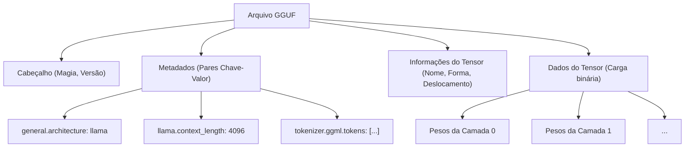
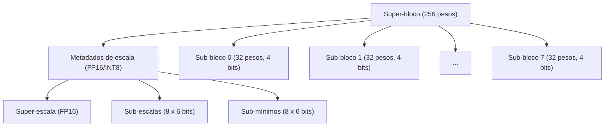
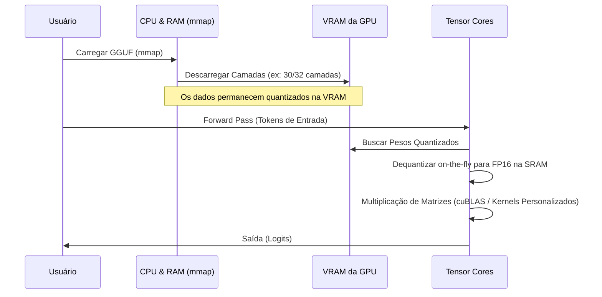

## 1. Introdução: Por que os LLMs precisam de quantização?

O recente avanço dos grandes modelos de linguagem (LLMs: Large Language Models) tem sido notável, mas nos bastidores surgiram problemas sérios: o "esgotamento dos recursos computacionais" e o "gargalo da largura de banda da memória". Por exemplo, se você carregar um modelo de 70B (70 bilhões) de parâmetros como o Llama 3 na memória usando o padrão de ponto flutuante de 16 bits (FP16), apenas os parâmetros consumirão cerca de 140 GB de VRAM/RAM. Quando o contexto (cache KV) durante a inferência é adicionado a isso, ele não funcionará a menos que se utilize múltiplos clusters de GPUs de ponta para data centers (como NVIDIA A100 80GB ou H100 80GB).

O **llama.cpp** e sua tecnologia central de **Quantização (Quantization)** surgiram como salvadores para permitir que desenvolvedores individuais e dispositivos de borda (MacBooks e PCs gamers comuns) executem LLMs. Em particular, o formato de arquivo chamado **GGUF (GPT-Generated Unified Format)** e o algoritmo avançado de quantização baseado em blocos chamado **k-quants** são métodos revolucionários que comprimem o tamanho do modelo para uma fração do seu original, enquanto minimizam a degradação da precisão do modelo (Perplexidade) ao limite absoluto.

Neste artigo, explicaremos de forma abrangente desde os fundamentos matemáticos da quantização no llama.cpp, as diferenças em relação ao formato GGML, a estrutura detalhada do formato GGUF, até o mecanismo interno do k-quants.

---

## 2. Fundamentos Matemáticos da Quantização (Quantization)

No contexto de LLMs, a quantização refere-se à operação de mapear valores contínuos (ou números de ponto flutuante de alta precisão) em valores discretos com um número menor de bits (INT8, INT4, INT3, etc.).

### 2.1. Fórmulas Básicas da Quantização Linear

A abordagem mais simples é a quantização linear (Quantização Min-Max). Suponha que o tensor de pesos original de alta precisão seja $W$, e o tensor de inteiros quantizado seja $W_q$.

$$ W_q = \text{round}\left( \frac{W}{S} \right) + Z $$

Onde,
- $S$ é o **Fator de Escala (Scale Factor)**, que determina o tamanho do passo (resolução) da quantização.
- $Z$ é o **Ponto Zero (Zero-point)**, que é um valor de viés para deslocar para qual valor inteiro o número real $0.0$ corresponde após a quantização.
- $\text{round}(\cdot)$ é a função de arredondamento para o número inteiro mais próximo.

Através da dequantização (Dequantization), um peso real aproximado $\tilde{W}$ é restaurado durante a inferência.

$$ \tilde{W} = S \times (W_q - Z) $$

### 2.2. Quantização Simétrica vs Quantização Assimétrica

Dependendo do tratamento do ponto zero $Z$, os métodos podem ser amplamente divididos em dois tipos.

1. **Quantização Assimétrica (Asymmetric Quantization)**
   Mapeia os dados usando o valor mínimo $W_{\min}$ e o valor máximo $W_{\max}$.
   $$ S = \frac{W_{\max} - W_{\min}}{2^b - 1}, \quad Z = \text{round}\left(-\frac{W_{\min}}{S}\right) $$
   Aqui, $b$ é o número de bits da quantização (ex: para 4 bits, $2^4-1 = 15$). Como é necessário manter $Z$, a sobrecarga de cálculo e memória aumenta ligeiramente.

2. **Quantização Simétrica (Symmetric Quantization)**
   Mapeia ao redor de zero usando o valor máximo absoluto dos dados ($Z=0$).
   $$ S = \frac{\max(|W_{\max}|, |W_{\min}|)}{2^{b-1} - 1}, \quad Z = 0 $$
   A quantização inicial do llama.cpp (por exemplo, o antigo Q4_0) adotava a quantização simétrica e, por não haver o termo $Z$, tinha a vantagem de tornar o cálculo do produto escalar com instruções SIMD extremamente rápido.

---

## 3. A Evolução do GGML para o GGUF e a Estrutura de Arquivos

Indispensável ao falar sobre o llama.cpp é o **GGML**, uma biblioteca de operações de tensores escrita em C++, e o formato de arquivo **GGUF** derivado dela.

### 3.1. Os Desafios do GGML

As versões iniciais do llama.cpp usavam o formato `ggml` (e variantes como `ggjt`). No entanto, eles tinham os seguintes problemas:
- **Falta de extensibilidade:** Números mágicos e hiperparâmetros eram codificados diretamente com comprimentos e ordens fixas, o que causava alterações que quebravam a compatibilidade sempre que uma nova arquitetura de modelo (ex: Llama, Falcon, Mixtral, etc.) ou um novo tokenizador era adicionado.
- **Perda de compatibilidade com versões anteriores:** O formato era atualizado com frequência, ocorrendo muitas situações em que arquivos de modelos mais antigos não podiam mais ser carregados nas versões mais recentes do llama.cpp.

### 3.2. O Nascimento do Formato GGUF

Introduzido em agosto de 2023, o **GGUF** é um formato altamente versátil projetado para resolver esses problemas. Sua maior característica é a adoção de uma **estrutura de metadados baseada em Chave-Valor (Key-Value)**.

O diagrama Mermaid a seguir é uma abstração da estrutura de um arquivo GGUF.



**Principais vantagens do GGUF:**
1. **Flexibilidade:** Todos os hiperparâmetros do modelo, configurações de RoPE (Rotary Positional Embedding), dados de vocabulário do tokenizador, etc., são armazenados como pares de Chave-Valor nomeados. Chaves desconhecidas são ignoradas, facilitando a adição de novos recursos.
2. **Independência de Endianness:** O GGUF adota o little-endian por padrão, mas possui um sinalizador (flag) explícito, de modo que é portável de forma segura entre arquiteturas diferentes.
3. **Otimização para mmap (mapeamento de memória):** Os dados do tensor são alinhados (com preenchimento) em limites específicos e podem ser mapeados diretamente do disco para o espaço de memória usando a chamada de sistema `mmap()` do SO. Com isso, o tempo de inicialização para carregar o modelo é virtualmente zero.

---

## 4. O Abismo dos k-quants: Quantização Avançada Baseada em Blocos

O verdadeiro valor do formato GGUF é o mecanismo chamado **k-quants (K-quantization)**, que é responsável por comprimir os pesos do modelo.

Geralmente, os pesos de uma rede neural têm uma forma próxima de uma distribuição normal quando se observa toda a camada, mas localmente existem valores atípicos (Outliers). Se você quantizar os pesos de toda a camada com um fator de escala uniforme $S$, as informações dos pesos menores serão completamente perdidas, arrastadas pelos valores atípicos.

Para evitar isso, o llama.cpp realiza a **quantização baseada em blocos (Block-wise Quantization)**. Os tensores de pesos são divididos em pequenos blocos (por exemplo, 32 elementos ou 256 elementos), e cada bloco tem seu próprio fator de escala (e ponto zero).

### 4.1. Limitações da Quantização Legada (Q4_0, Q4_1)

O `Q4_0` inicial agrupava 32 pesos FP16 em um bloco e compartilhava um fator de escala FP16.
- Tamanho do bloco: 32
- Memória: 1 escala (16 bits) + 32 pesos de 4 bits (128 bits) = 144 bits
- Bits efetivos por elemento (bpw: bits per weight): $144 / 32 = 4.5$ bpw

Embora isso já seja bastante bom, os limites de precisão e taxa de compressão tornaram-se evidentes. Foi então que surgiram os **k-quants**, que possuem uma estrutura hierárquica mais complexa e refinada.

### 4.2. Estrutura Hierárquica de Super-blocos e Sub-blocos (Exemplo do Q4_K_M)

O k-quants tem uma estrutura hierárquica com um grande "Super-bloco (Super-block)" e pequenos "Sub-blocos (Sub-blocks)" contidos dentro dele. Isso permite quantizar até mesmo os próprios metadados (como os valores de escala), mantendo a precisão enquanto reduz o bpw ao limite extremo.

Vejamos a estrutura do **Q4_K_M**, a configuração mais popular. O Q4_K_M usa super-blocos de 256 elementos.



A estrutura real em C++ (GGML) é definida conceitualmente da seguinte forma:

```cpp
// Estrutura conceitual de block_q4_K no llama.cpp
#define QK_K 256

struct block_q4_K {
    uint8_t d[2];          // Super-escala de todo o super-bloco (ex: FP16 x 2)
    uint8_t scales[12];    // Dados empacotados com a escala de 6 bits e valor mínimo de 6 bits (ponto zero) de 8 sub-blocos (32 elementos cada)
    uint8_t qs[QK_K/2];    // Dados de pesos quantizados em 4 bits (256 elementos / 2 = 128 bytes)
};
```

**Processo matemático de dequantização:**

O valor real aproximado $\tilde{W}_{i, j}$ do elemento $j$ ($0 \le j < 32$) dentro do sub-bloco $i$ ($0 \le i < 8$) é calculado da seguinte forma:

$$ \tilde{W}_{i, j} = S_{\text{super}} \times s_i \times (w_{i, j} - m_i) $$

- $S_{\text{super}}$: Escala de ponto flutuante de todo o super-bloco
- $s_i$: Escala quantizada em 6 bits para o sub-bloco $i$
- $m_i$: Valor mínimo quantizado em 6 bits (ponto zero) para o sub-bloco $i$
- $w_{i, j}$: Peso quantizado de 4 bits ($0 \dots 15$)

Com essa estrutura hierárquica, mantendo a capacidade de adaptação a valores atípicos, a quantidade de memória ocupada pelos próprios fatores de escala é drasticamente reduzida. O Q4_K_M alcança no geral cerca de **4.8 bpw**.

### 4.3. Diversas Opções dos k-quants

O llama.cpp oferece muitas variações dependendo do propósito. O sufixo após o "K" (S, M, L) indica o tamanho.

| Formato | BPW (Bits por Peso) | Visão Geral e Características |
| :--- | :---: | :--- |
| **Q2_K** | 2.5～3.3 | Compressão extrema. Queda significativa na precisão, mas ideal para ambientes com VRAM extremamente baixa. |
| **Q3_K_M** | 3.3 | Padrão para quantização de 3 bits. Piora em relação ao Q4, mas frequentemente fica dentro de limites aceitáveis. |
| **Q4_K_M** | 4.8 | **Ponto ideal recomendado**. Equilibra a redução pela metade do tamanho do modelo com a manutenção da precisão. |
| **Q5_K_M** | 5.5 | Quando é necessária maior precisão. Posição intermediária entre o Q4 e o FP16. |
| **Q6_K** | 6.6 | Mantém uma Perplexidade quase equivalente à do FP16, mas com um tamanho de arquivo maior. |
| **Q8_0** | 8.5 | Equivalente ao INT8. Usado principalmente para tensores intermediários em cálculos durante a inferência ou apenas nas camadas finais. |

*Nota: O BPW real é nivelado (média) em todo o modelo através de uma Quantização Mista (Mixed Quantization) dependendo do tipo do tensor no modelo (por exemplo, se é uma projeção Q/K/V da Attention ou os pesos da FFN). Otimizações são feitas internamente, como quantizar tensores importantes em Q6 e o resto em Q4.*

---

## 5. Otimização do Desempenho de Inferência: SIMD e Arquitetura CUDA

Apenas carregar um modelo GGUF na memória não torna a inferência rápida. A maior parte da inferência de LLMs é a "Multiplicação de Matrizes (Matrix-Vector Multiplication, abreviado como GEMV, ou Matrix-Matrix, GEMM)". A chave é como acelerar a operação de produto e soma dos pesos quantizados com as ativações (dados de entrada) mantidas em FP16 (ou FP32).

### 5.1. Utilização de Instruções SIMD em Ambiente CPU

A razão pela qual o llama.cpp possui uma velocidade incrível na inferência por CPU se deve à otimização **SIMD (Single Instruction, Multiple Data)** em nível de assembly.
Por exemplo, as CPUs Intel/AMD utilizam totalmente os conjuntos de instruções **AVX2** ou **AVX-512**, enquanto o Apple Silicon utiliza as instruções **ARM NEON**.

Durante a inferência, $W_q$ não é intencionalmente convertido de volta para FP32 (dequantizado) antes de fazer a multiplicação.
O lado das ativações também é quantizado dinamicamente bloco a bloco (Dynamic Quantization, geralmente para INT8), e a operação com inteiros de **INT8 $\times$ INT4** é calculada de uma vez usando instruções SIMD especiais de produto escalar (ex: `vdpaddd` ou `_mm256_madd_epi16`). Ao converter de volta para FP32 no acumulador final e multiplicar pelo fator de escala, alcança-se um throughput incrível.

### 5.2. Descarregamento (Offload) em Ambiente GPU (cuBLAS / CUDA)

Recentemente, o llama.cpp não possui apenas suporte para CPU, mas também um suporte robusto para GPUs NVIDIA (CUBLAS / CUDA).
É possível descarregar parte ou a totalidade das camadas do arquivo GGUF para a VRAM (através da opção `--n-gpu-layers`).



Ao processar na GPU, a largura de banda de memória (Memory Bandwidth) da VRAM se torna o maior gargalo. Como os pesos estão comprimidos com k-quants, a quantidade de dados transferida da VRAM para as unidades de computação da GPU (SM: Streaming Multiprocessor ou Tensor Cores) é reduzida a cerca de 1/3 ~ 1/4. No exato momento em que os pesos chegam à unidade de cálculo, eles são dequantizados (descompactados) on-the-fly para FP16, e a multiplicação de matrizes é executada em altíssima velocidade usando o Tensor Core.
Em outras palavras, pode-se dizer que a quantização não é feita para "reduzir a quantidade de cálculos", mas sim para **"reduzir a quantidade de transferências de memória"**.

---

## 6. Exemplo Concreto do Trade-off entre Uso de Memória e Desempenho

Abaixo, usando o modelo Llama 3 8B como exemplo, vejamos as especificações exigidas por nível de quantização do GGUF. (Os valores são apenas estimativas aproximadas)

| Modelo/Quantização | Tamanho do Arquivo | VRAM/RAM Necessária | Velocidade de Inferência (Estimativa) | Degradação da Perplexidade |
| :--- | :--- | :--- | :--- | :--- |
| **Llama-3-8B (FP16)** | Aprox. 16 GB | 18 GB ou mais | Base | Nenhuma (Base) |
| **Llama-3-8B (Q8_0)** | Aprox. 8.5 GB | 10 GB ou mais | Rápida | Quase zero |
| **Llama-3-8B (Q6_K)** | Aprox. 6.6 GB | 8 GB ou mais | Muito rápida | Mínima |
| **Llama-3-8B (Q4_K_M)** | Aprox. 4.9 GB | 6.5 GB ou mais | Mais rápida e ideal | Aceitável e pequena |
| **Llama-3-8B (Q3_K_M)** | Aprox. 3.9 GB | 5.5 GB ou mais | Mais rápida | Um pouco perceptível |
| **Llama-3-8B (Q2_K)** | Aprox. 3.0 GB | 4.5 GB ou mais | Rápida | Degradação óbvia |

**Atenção (O impacto do cache KV):**
Na inferência de LLMs, conforme o tamanho do contexto (número de tokens no prompt) aumenta, o consumo de memória do **cache KV**, que guarda os estados passados da Attention além dos pesos do modelo, aumenta explosivamente.
Por exemplo, com um contexto de 8192 tokens, apenas o cache KV já consome vários GBs. Portanto, para o uso real, é necessário garantir uma margem (Headroom) de `tamanho do arquivo do modelo + aprox. 1.5GB a 3GB`. O motivo pelo qual o Q4_K_M é recomendado é que ele atinge a medida exata para rodar com segurança numa placa de vídeo comum com 8GB de VRAM (como RTX 3060 / 4060) mesmo com essa alocação de cache KV.

Em versões recentes do llama.cpp, foi adicionada a funcionalidade para **quantizar o próprio cache KV em Q8_0 ou Q4_0**, de modo que há um esforço constante para possibilitar contextos ainda mais longos.

---

## 7. Conclusão

Neste artigo, exploramos profundamente a estrutura interna do formato GGUF e da tecnologia de quantização k-quants, que formam o coração do llama.cpp.

1. **Flexibilidade do GGUF:** O uso de uma estrutura de metadados do tipo chave-valor construiu um ecossistema robusto, capaz de acompanhar a rápida evolução dos LLMs (surgimento de novas arquiteturas) sem causar quebras de compatibilidade.
2. **Compressão Extrema via k-quants:** O gerenciamento hierárquico dos fatores de escala através de super-blocos e sub-blocos permitiu uma incrível taxa de compressão, alcançando em média 4.8 bits por peso (Q4_K_M), mantendo as informações de valores atípicos.
3. **Resolução do Gargalo da Largura de Banda de Memória:** Implementações avançadas de kernels no SIMD e em CUDA permitiram a realização dos cálculos combinados com a dequantização on-the-fly, o que reduziu drasticamente o tráfego da VRAM e impulsionou imensamente a velocidade de inferência.

Pode-se dizer sem exagero que a destreza técnica do llama.cpp em promover a democratização da IA vai além da simples criação de uma ferramenta, situando-se em um dos mais altos níveis da engenharia de software contemporânea. Ao compreender a mecânica dos algoritmos de quantização e o formato GGUF, você poderá selecionar o modelo mais adequado e ajustar com precisão a performance de acordo com o seu ambiente.

### Links de Referência
- [Repositório GitHub do llama.cpp](https://github.com/ggerganov/llama.cpp)
- [Especificação do Formato GGUF](https://github.com/ggerganov/ggml/blob/master/docs/gguf.md)
- [PR de Implementação dos K-quants](https://github.com/ggerganov/llama.cpp/pull/1684)

(Fim)

