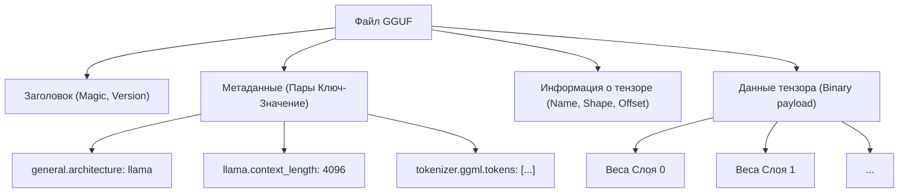
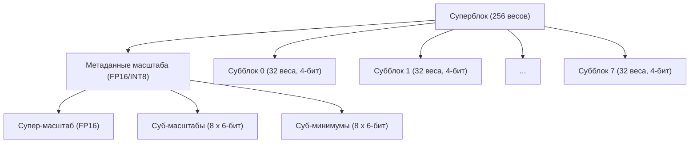
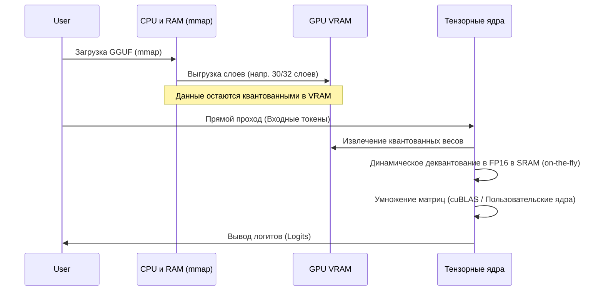

## 1. Введение: Почему LLM нужно квантование?

Эволюция больших языковых моделей (LLM: Large Language Models) в последние годы поразительна, но за ней скрываются серьезные проблемы: "истощение вычислительных ресурсов" и "узкое место пропускной способности памяти". Например, если загрузить модель с 70 миллиардами параметров (70B), такую как Llama 3, в память с использованием стандартных 16-битных чисел с плавающей запятой (FP16), только параметры займут около 140 ГБ VRAM/RAM. Если к этому добавить контекст во время логического вывода (KV кэш), модель не будет работать без кластеризации нескольких высококлассных GPU для дата-центров (NVIDIA A100 80GB или H100 80GB).

Спасителем, появившимся для запуска LLM индивидуальными разработчиками и на периферийных устройствах (MacBook или обычные игровые ПК), стал **llama.cpp** и лежащая в его основе **технология квантования (Quantization)**. В частности, формат файлов **GGUF (GPT-Generated Unified Format)** и продвинутый алгоритм блочного квантования, известный как **k-quants**, представляют собой революционный метод сжатия размера модели в несколько раз, максимально ограничивая при этом снижение точности модели (Perplexity).

В этой статье мы подробно объясним квантование в llama.cpp, начиная с математических основ, различий с форматом GGML, детальной структуры формата GGUF и заканчивая внутренними механизмами k-quants.

---

## 2. Математические основы квантования (Quantization)

В контексте LLM квантование относится к операции отображения непрерывных значений (или высокоточных чисел с плавающей запятой) в дискретные значения с меньшим количеством бит (INT8, INT4, INT3 и т.д.).

### 2.1. Базовые формулы линейного квантования

Самым простым подходом является линейное квантование (Min-Max квантование). Пусть $W$ - исходный тензор весов с высокой точностью, а $W_q$ - квантованный целочисленный тензор.

$$ W_q = \text{round}\left( \frac{W}{S} \right) + Z $$

Где,
- $S$ - это **масштабный коэффициент (Scale Factor)**, определяющий размер шага (разрешение) квантования.
- $Z$ - это **нулевая точка (Zero-point)**, значение смещения для сдвига, определяющее, какому целому значению после квантования соответствует вещественный $0.0$.
- $\text{round}(\cdot)$ - функция округления до ближайшего целого.

При обратном квантовании (Dequantization) во время логического вывода восстанавливаются приблизительные вещественные веса $\tilde{W}$.

$$ \tilde{W} = S \times (W_q - Z) $$

### 2.2. Симметричное и асимметричное квантование

В зависимости от обработки нулевой точки $Z$, методы делятся на два основных типа.

1. **Асимметричное квантование (Asymmetric Quantization)**
   Отображение использует минимальное значение данных $W_{\min}$ и максимальное значение $W_{\max}$.
   $$ S = \frac{W_{\max} - W_{\min}}{2^b - 1}, \quad Z = \text{round}\left(-\frac{W_{\min}}{S}\right) $$
   Где $b$ - количество бит квантования (например, для 4 бит $2^4-1 = 15$). Поскольку необходимо хранить $Z$, незначительно увеличиваются накладные расходы на вычисления и память.

2. **Симметричное квантование (Symmetric Quantization)**
   Отображение центрируется вокруг нуля с использованием максимального абсолютного значения данных ($Z=0$).
   $$ S = \frac{\max(|W_{\max}|, |W_{\min}|)}{2^{b-1} - 1}, \quad Z = 0 $$
   Раннее квантование llama.cpp (например, унаследованное Q4_0) использовало симметричное квантование. Поскольку член $Z$ отсутствует, преимуществом является значительное ускорение вычислений скалярного произведения с помощью инструкций SIMD.

---

## 3. Эволюция от GGML к GGUF и структура файла

Говоря о llama.cpp, нельзя не упомянуть **GGML**, библиотеку тензорных вычислений, написанную на C++, и производный от нее формат файлов **GGUF**.

### 3.1. Проблемы GGML

Ранний llama.cpp использовал формат `ggml` (и его варианты, такие как `ggjt`). Однако у них были следующие проблемы:
- **Отсутствие расширяемости:** Магические числа и гиперпараметры были жестко закодированы (hardcoded) с фиксированной длиной и порядком, что приводило к разрушительным изменениям каждый раз при добавлении новой архитектуры модели (например, Llama, Falcon, Mixtral и т.д.) или нового токенизатора.
- **Потеря обратной совместимости:** Формат часто обновлялся, из-за чего старые файлы моделей часто переставали читаться в последних версиях llama.cpp.

### 3.2. Рождение формата GGUF

**GGUF**, представленный в августе 2023 года, является универсальным форматом, разработанным для решения этих проблем. Его главная особенность - принятие **структуры метаданных на основе пар ключ-значение (Key-Value)**.

Следующая диаграмма Mermaid абстрактно показывает файловую структуру GGUF.



**Основные преимущества GGUF:**
1. **Гибкость:** Все настройки, такие как гиперпараметры модели, конфигурация RoPE (Rotary Positional Embedding), данные словаря токенизатора и т.д., хранятся в виде именованных пар Key-Value. Неизвестные ключи игнорируются, что упрощает добавление новых функций.
2. **Независимость от порядка байтов (Endianness):** GGUF по умолчанию использует порядок от младшего к старшему (Little-endian), но имеет явный флаг, что делает его безопасно переносимым между различными архитектурами.
3. **Оптимизация для mmap (отображение в память):** Данные тензоров выровнены (с отступами) по определенным границам, что позволяет отображать их напрямую с диска в адресное пространство памяти с помощью системного вызова ОС `mmap()`. Благодаря этому время инициализации при загрузке модели практически равно нулю.

---

## 4. Глубины k-quants: Продвинутое блочное квантование

Истинная ценность формата GGUF заключается в механизме **k-quants (K-quantization)**, отвечающем за сжатие весов модели.

Обычно веса нейронной сети близки к нормальному распределению, если рассматривать слой целиком, но локально существуют выбросы (Outliers). Если квантовать веса всего слоя с помощью единого масштабного коэффициента $S$, масштаб будет искажен выбросами, и информация о малых весах будет полностью потеряна.

Чтобы предотвратить это, llama.cpp выполняет **блочное квантование (Block-wise Quantization)**. Тензор весов разбивается на небольшие блоки (например, по 32 или 256 элементов), и каждому блоку присваивается свой собственный масштабный коэффициент (и нулевая точка).

### 4.1. Ограничения унаследованного квантования (Q4_0, Q4_1)

В раннем `Q4_0` блок состоял из 32 весов FP16 и имел один общий масштабный коэффициент FP16.
- Размер блока: 32
- Память: 1 масштаб (16 бит) + 32 4-битных веса (128 бит) = 144 бита
- Эффективное количество бит на элемент (bpw: bits per weight): $144 / 32 = 4.5$ bpw

Хотя это уже было довольно эффективно, проявились пределы точности и степени сжатия. Тогда и появился **k-quants**, имеющий более сложную и продуманную иерархическую структуру.

### 4.2. Иерархическая структура суперблоков и субблоков (Пример Q4_K_M)

k-quants имеет иерархическую структуру, состоящую из больших "Суперблоков (Super-block)" и содержащихся в них меньших "Субблоков (Sub-block)". Это позволяет также квантовать сами метаданные (значения масштаба и т.д.), предельно снижая bpw при сохранении точности.

Давайте рассмотрим структуру **Q4_K_M**, которая является наиболее популярной конфигурацией. Q4_K_M использует суперблок из 256 элементов.



Фактическая структура в C++ (GGML) концептуально определяется следующим образом:

```cpp
// Концептуальная структура block_q4_K в llama.cpp
#define QK_K 256

struct block_q4_K {
    uint8_t d[2];          // Супер-масштаб для всего суперблока (например, FP16 x 2)
    uint8_t scales[12];    // Упакованные данные: 6-битные масштабы и 6-битные минимумы (нулевые точки) для 8 субблоков (по 32 элемента)
    uint8_t qs[QK_K/2];    // Данные весов, квантованные до 4 бит (256 элементов / 2 = 128 байт)
};
```

**Математический процесс деквантования (Dequantization):**

Приблизительное вещественное значение $\tilde{W}_{i, j}$ элемента $j$ ($0 \le j < 32$) внутри субблока $i$ ($0 \le i < 8$) вычисляется следующим образом:

$$ \tilde{W}_{i, j} = S_{\text{super}} \times s_i \times (w_{i, j} - m_i) $$

- $S_{\text{super}}$: Масштаб с плавающей запятой для всего суперблока
- $s_i$: 6-битный масштаб, квантованный для субблока $i$
- $m_i$: 6-битный минимум (нулевая точка), квантованный для субблока $i$
- $w_{i, j}$: 4-битный квантованный вес ($0 \dots 15$)

Благодаря этой иерархической структуре, сохраняя способность адаптироваться к выбросам, резко сокращается объем памяти, занимаемый самими масштабными коэффициентами. Q4_K_M достигает в целом около **4.8 bpw**.

### 4.3. Разнообразие опций k-quants

llama.cpp предлагает множество вариаций в зависимости от цели. Суффиксы (S, M, L) после "K" обозначают размер (маленький, средний, большой).

| Формат | BPW (Bits per Weight) | Обзор и особенности |
| :--- | :---: | :--- |
| **Q2_K** | 2.5～3.3 | Экстремальное сжатие. Значительное падение точности, но подходит для сред с крайне малым объемом VRAM. |
| **Q3_K_M** | 3.3 | Стандарт для 3-битного квантования. Уступает Q4, но часто остается в пределах допустимого. |
| **Q4_K_M** | 4.8 | **Рекомендуемая золотая середина**. Баланс между уменьшением размера модели вдвое и сохранением точности. |
| **Q5_K_M** | 5.5 | Когда требуется более высокая точность. Промежуточное положение между Q4 и FP16. |
| **Q6_K** | 6.6 | Сохраняет Perplexity почти на уровне FP16, но размер файла больше. |
| **Q8_0** | 8.5 | Эквивалент INT8. Используется в основном для промежуточных тензоров при логическом выводе вычислений и только в финальных слоях. |

※ Фактический BPW усредняется по всей модели, поскольку выполняется смешанное квантование (Mixed Quantization) в зависимости от тензоров модели (например, проекции Q/K/V в Attention или веса в FFN). Внутри производится оптимизация, при которой важные тензоры квантуются в Q6, а остальные - в Q4.

---

## 5. Оптимизация производительности при логическом выводе: архитектуры SIMD и CUDA

Простая загрузка модели GGUF в память не делает логический вывод быстрым. Большая часть логического вывода в LLM - это «умножение матрицы на вектор (Matrix-Vector Multiplication, или GEMV, или Matrix-Matrix, GEMM)». Ключ к успеху - это то, как ускорить операцию умножения и сложения между квантованными весами и активациями (входными данными), хранящимися в FP16 (или FP32).

### 5.1. Использование инструкций SIMD в процессорных средах

Невероятная скорость, с которой llama.cpp работает при логическом выводе на CPU, обусловлена оптимизацией **SIMD (Single Instruction, Multiple Data)** на уровне ассемблера.
Например, он в полной мере использует наборы инструкций **AVX2** и **AVX-512** на процессорах Intel/AMD, и **ARM NEON** на Apple Silicon.

Во время логического вывода не тратится время на возвращение $W_q$ в формат FP32 (деквантование) перед умножением.
Сторона активации также динамически квантуется блоками (Dynamic Quantization, обычно в INT8), и целочисленные операции **INT8 $\times$ INT4** вычисляются сразу с использованием специальных инструкций скалярного произведения SIMD (например, `vdpaddd` или `_mm256_madd_epi16`). В конечном аккумуляторе происходит преобразование обратно в FP32 и умножение на масштабный коэффициент, что обеспечивает поразительную пропускную способность.

### 5.2. Разгрузка в средах GPU (cuBLAS / CUDA)

Современный llama.cpp имеет надежную поддержку не только CPU, но и GPU NVIDIA (CUBLAS / CUDA).
Можно выгрузить (offload) некоторые или все слои файла GGUF в VRAM (опция `--n-gpu-layers`).



При вычислениях на GPU пропускная способность памяти (Memory Bandwidth) VRAM становится самым большим узким местом. Поскольку веса сжаты с помощью k-quants, объем данных, передаваемых из VRAM в вычислительные блоки GPU (SM: Streaming Multiprocessor или Tensor Cores), сокращается в 3-4 раза. В тот момент, когда веса достигают вычислительного блока, они динамически деквантуются (разворачиваются) в FP16, и с помощью Tensor Cores выполняется сверхбыстрое умножение матриц.
Другими словами, можно сказать, что квантование выполняется **не для "уменьшения объема вычислений", а для "уменьшения объема передаваемых данных из памяти"**.

---

## 6. Конкретные примеры компромисса между использованием памяти и производительностью

Здесь, на примере модели Llama 3 8B, давайте посмотрим на требования к спецификациям для каждого уровня квантования GGUF. (Цифры являются приблизительными ориентирами.)

| Модель / Квантование | Размер файла | Требуемая VRAM/RAM | Скорость вывода (ориентир) | Снижение Perplexity |
| :--- | :--- | :--- | :--- | :--- |
| **Llama-3-8B (FP16)** | Около 16 ГБ | от 18 ГБ | Базовая | Нет (Base) |
| **Llama-3-8B (Q8_0)** | Около 8.5 ГБ | от 10 ГБ | Высокая | Почти нулевое |
| **Llama-3-8B (Q6_K)** | Около 6.6 ГБ | от 8 ГБ | Очень высокая | Минимальное |
| **Llama-3-8B (Q4_K_M)** | Около 4.9 ГБ | от 6.5 ГБ | Самая быстрая / Оптимальная | В допустимых пределах / Небольшое |
| **Llama-3-8B (Q3_K_M)** | Около 3.9 ГБ | от 5.5 ГБ | Самая быстрая | Немного заметное |
| **Llama-3-8B (Q2_K)** | Около 3.0 ГБ | от 4.5 ГБ | Высокая | Очевидное снижение |

**Внимание (Влияние KV-кэша):**
При логическом выводе LLM, когда длина контекста (количество токенов промпта) увеличивается, потребление памяти взрывообразно растет не только из-за весов модели, но и из-за **KV-кэша**, который сохраняет прошлые состояния Attention.
Например, если длина контекста составляет 8192 токена, только KV-кэш будет потреблять несколько гигабайт. Поэтому при реальном использовании необходимо обеспечить запас (Headroom) в размере `Размер файла модели + около 1.5 ГБ ~ 3 ГБ`. Причина, по которой рекомендуется Q4_K_M, заключается в том, что это идеальная линия, при которой даже с учетом резервирования этого KV-кэша модель безопасно работает на типичном графическом процессоре с 8 ГБ VRAM (например, RTX 3060 / 4060).

В последних версиях llama.cpp также была добавлена **функция квантования самого KV-кэша в Q8_0 или Q4_0**, и постоянно ведется работа по дальнейшему увеличению длины контекста.

---

## 7. Заключение

В этой статье мы глубоко погрузились во внутреннюю структуру формата GGUF и технологии квантования k-quants, которые являются сердцем llama.cpp.

1. **Гибкость GGUF:** Структура метаданных типа "ключ-значение" создала надежную экосистему, которая может идти в ногу с быстрой эволюцией LLM (появление новых архитектур моделей) без разрушительных изменений.
2. **Экстремальное сжатие с помощью k-quants:** Иерархическое управление масштабными коэффициентами суперблоков и субблоков позволило добиться удивительного сжатия - в среднем 4.8 бита на вес (Q4_K_M) - с сохранением информации о выбросах.
3. **Устранение узкого места пропускной способности памяти:** Продвинутые реализации ядер для SIMD и CUDA позволили выполнять вычисления с динамическим деквантованием (on-the-fly), что сократило объем передаваемых данных из VRAM и значительно повысило скорость логического вывода.

Технологическое мастерство llama.cpp, способствующее демократизации ИИ, выходит за рамки простого инструмента и, без преувеличения, является одной из вершин современной программной инженерии. Поняв алгоритм квантования и структуру формата GGUF, вы сможете более точно выбирать оптимальную модель для вашей среды и выполнять настройку производительности.

### Полезные ссылки
- [llama.cpp GitHub Repository](https://github.com/ggerganov/llama.cpp)
- [GGUF Format Specification](https://github.com/ggerganov/ggml/blob/master/docs/gguf.md)
- [K-quants Implementation PR](https://github.com/ggerganov/llama.cpp/pull/1684)

(Конец)
