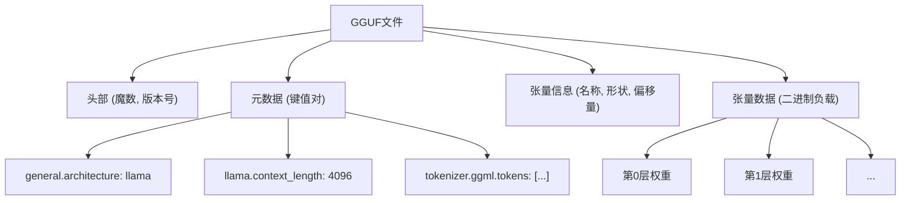
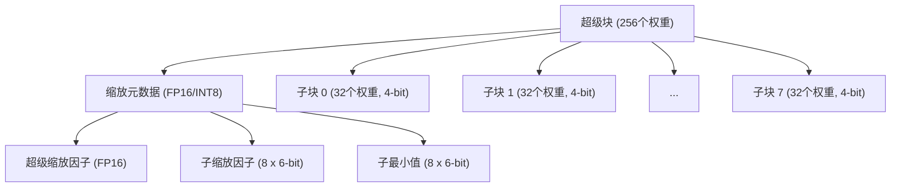
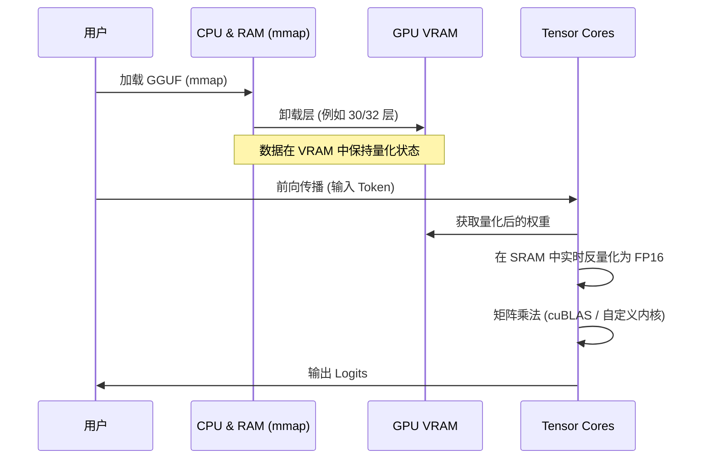

## 1. 引言：为什么LLM需要量化？

近年来，大规模语言模型（LLM: Large Language Models）的进化非常显著，但在其背后，“计算资源枯竭”和“内存带宽瓶颈”这两个严重的问题浮出水面。例如，如果将 Llama 3 这样具有 70B（700亿）参数的模型以标准的 16位浮点数（FP16）加载到内存中，仅参数就会消耗约 140GB 的 VRAM/RAM。如果再加上推理时的上下文（KV缓存），除非将多台面向数据中心的高端GPU（NVIDIA A100 80GB 或 H100 80GB）进行集群，否则无法运行。

为了让个人开发者和边缘设备（MacBook或一般的游戏PC）也能运行LLM，**llama.cpp** 及其核心的 **量化（Quantization）技术** 作为救世主应运而生。特别是名为 **GGUF (GPT-Generated Unified Format)** 的文件格式以及被称为 **k-quants** 的高级块级量化算法，这是一种在极力抑制模型精度（Perplexity）下降的同时，将模型大小压缩到几分之一的突破性方法。

本文将从 llama.cpp 中量化的数学背景开始，彻底解析它与 GGML 格式的区别、GGUF 格式的详细结构，以及 k-quants 的内部机制。

---

## 2. 量化（Quantization）的数学基础

在 LLM 的语境中，量化是指将连续的值（或高精度的浮点数）映射为位数更少（INT8、INT4、INT3 等）的离散值的操作。

### 2.1. 线性量化的基本公式

最简单的方法是线性量化（Min-Max量化）。假设原始的高精度权重张量为 $W$，量化后的整数张量为 $W_q$。

$$ W_q = \text{round}\left( \frac{W}{S} \right) + Z $$

这里，
- $S$ 是 **缩放因子（Scale Factor）**，决定了量化的步长（分辨率）。
- $Z$ 是 **零点（Zero-point）**，它是一个偏置值，用于平移实数 $0.0$ 在量化后对应的整数值。
- $\text{round}(\cdot)$ 是向最近整数取整的函数。

通过反量化（Dequantization），在推理时还原出近似的实数权重 $\tilde{W}$。

$$ \tilde{W} = S \times (W_q - Z) $$

### 2.2. 对称量化 vs 非对称量化

根据零点 $Z$ 的处理方式，主要分为两种方式。

1. **非对称量化 (Asymmetric Quantization)**
   使用数据的最小值 $W_{\min}$ 和最大值 $W_{\max}$ 进行映射。
   $$ S = \frac{W_{\max} - W_{\min}}{2^b - 1}, \quad Z = \text{round}\left(-\frac{W_{\min}}{S}\right) $$
   其中 $b$ 是量化位数（例如：4位的话 $2^4-1 = 15$）。由于需要保留 $Z$，计算和内存的开销会略微增加。

2. **对称量化 (Symmetric Quantization)**
   使用数据绝对值的最大值，以零为中心进行映射（$Z=0$）。
   $$ S = \frac{\max(|W_{\max}|, |W_{\min}|)}{2^{b-1} - 1}, \quad Z = 0 $$
   llama.cpp 早期的量化（例如传统的 Q4_0 等）采用了对称量化，由于没有 $Z$ 项，其优点是使用 SIMD 指令进行内积计算时速度非常快。

---

## 3. 从 GGML 到 GGUF 的进化与文件结构

谈到 llama.cpp，就不得不提用 C++ 编写的张量运算库 **GGML**，以及由此派生出的文件格式 **GGUF**。

### 3.1. GGML的挑战

早期的 llama.cpp 使用 `ggml` 格式（以及 `ggjt` 等变体）。然而，这些格式存在以下问题：
- **缺乏可扩展性：** 魔数和超参数以固定长度、固定顺序硬编码在内，每次添加新的模型架构（如 Llama, Falcon, Mixtral 等）或新的分词器时，都会产生破坏性更改。
- **丧失向后兼容性：** 格式更新频繁，导致旧的模型文件经常无法被最新版本的 llama.cpp 读取。

### 3.2. GGUF格式的诞生

2023年8月引入的 **GGUF** 是一种为了解决这些问题而设计的高通用性格式。其最大的特点是采用了 **基于键值对（Key-Value）的元数据结构**。

下面的 Mermaid 图抽象展示了 GGUF 的文件结构。



**GGUF的主要优点：**
1. **灵活性：** 将模型的超参数、RoPE（Rotary Positional Embedding）设置、分词器的词汇数据等全部作为命名的键值对存储。未知的键会被忽略，因此很容易添加新功能。
2. **端序无关：** GGUF 默认采用小端序，但由于带有显式的标志，因此在不同架构之间也具有安全的便携性。
3. **针对 mmap (内存映射) 优化：** 张量数据在特定的边界上进行了对齐（填充），可以使用操作系统的 `mmap()` 系统调用直接从磁盘映射到内存空间。这使得模型加载的初始化时间几乎为零。

---

## 4. k-quants 的深渊：高级的块级量化

GGUF 格式的精髓在于负责压缩模型权重的 **k-quants (K-quantization)** 机制。

通常神经网络的权重，从整个层来看接近正态分布，但在局部存在异常值（Outliers）。如果用统一的缩放因子 $S$ 对整个层的权重进行量化，就会被异常值拖累，导致小权重的信息完全丢失。

为了防止这种情况，llama.cpp 进行了 **块级量化（Block-wise Quantization）**。将权重张量分割成小块（例如 32 个元素或 256 个元素），并让每个块拥有自己独有的缩放因子（和零点）。

### 4.1. 传统量化（Q4_0, Q4_1）的局限性

早期的 `Q4_0` 将 32 个 FP16 权重作为一个块，并共享 1 个 FP16 缩放因子。
- 块大小: 32
- 内存: 1个缩放(16bit) + 32个4bit权重(128bit) = 144bit
- 每个元素的有效位数 (bpw: bits per weight): $144 / 32 = 4.5$ bpw

这已经足够优秀，但也看到了精度和压缩率的极限。于是，具有更复杂、更精细层次结构的 **k-quants** 登场了。

### 4.2. 超级块与子块的层次结构（以 Q4_K_M 为例）

k-quants 拥有一个层次结构：大的“超级块（Super-block）”和包含在其中的小的“子块（Sub-block）”。通过这种方式，对元数据（缩放值等）本身也进行了量化，在极限降低 bpw 的同时保持精度。

让我们来看看最受欢迎的设置 **Q4_K_M** 的结构。Q4_K_M 使用 256 个元素的超级块。



在 C++（GGML）中，实际的结构体定义如下。

```cpp
// llama.cpp 中 block_q4_K 的概念结构
#define QK_K 256

struct block_q4_K {
    uint8_t d[2];          // 整个超级块的超级缩放因子 (如 FP16 x 2)
    uint8_t scales[12];    // 8个子块(每块32元素)的 6-bit 缩放因子和 6-bit 最小值(零点)打包后的数据
    uint8_t qs[QK_K/2];    // 4-bit 量化后的权重数据 (256元素 / 2 = 128 字节)
};
```

**数学反量化（Dequantization）处理：**

子块 $i$（$0 \le i < 8$）内的元素 $j$（$0 \le j < 32$）的近似实数值 $\tilde{W}_{i, j}$ 的计算方法如下：

$$ \tilde{W}_{i, j} = S_{\text{super}} \times s_i \times (w_{i, j} - m_i) $$

- $S_{\text{super}}$: 整个超级块的浮点数缩放因子
- $s_i$: 为子块 $i$ 量化的 6-bit 缩放因子
- $m_i$: 为子块 $i$ 量化的 6-bit 最小值（零点）
- $w_{i, j}$: 4-bit 的量化权重 ($0 \dots 15$)

通过这种层次结构，在保持对异常值适应能力的同时，极大地减少了缩放因子本身所占用的内存量。Q4_K_M 整体实现了约 **4.8 bpw**。

### 4.3. 多样化的 k-quants 选项

llama.cpp 根据不同目的提供了多种变体。“K” 后面的后缀（S, M, L）代表大小。

| 格式 | BPW (Bits per Weight) | 概要与特征 |
| :--- | :---: | :--- |
| **Q2_K** | 2.5～3.3 | 极限压缩。精度下降显著，适用于 VRAM 极少的环境。 |
| **Q3_K_M** | 3.3 | 3位量化的标准。比 Q4 退化，但通常在可接受范围内。 |
| **Q4_K_M** | 4.8 | **推荐的黄金分割点**。兼顾模型大小减半和精度维持。 |
| **Q5_K_M** | 5.5 | 要求更高精度时使用。介于 Q4 和 FP16 之间的定位。 |
| **Q6_K** | 6.6 | 维持与 FP16 几乎同等的 Perplexity，但文件体积较大。 |
| **Q8_0** | 8.5 | 相当于 INT8。主要用于推理时的计算用中间张量，或仅在最后一层使用。 |

※ 实际的 BPW 会根据模型的张量（例如 Attention 的 Q/K/V 投影，还是 FFN 的权重），进行混合量化（Mixed Quantization），从而在整个模型中求平均。内部会进行优化，例如将重要的张量用 Q6 量化，其他的用 Q4 量化。

---

## 5. 推理时的性能优化：SIMD 与 CUDA 架构

仅仅将 GGUF 模型加载到内存中，推理并不会变快。LLM 推理的大部分是“矩阵乘法（Matrix-Vector Multiplication，简称 GEMV，或 Matrix-Matrix，GEMM）”。关键在于如何加速量化后的权重与保持为 FP16（或 FP32）的激活值（输入数据）之间的乘加运算。

### 5.1. CPU环境下的 SIMD 指令利用

llama.cpp 在 CPU 推理中引以为傲的惊人速度，归功于汇编级别的 **SIMD (Single Instruction, Multiple Data)** 优化。
例如在 Intel/AMD 的 CPU 上充分利用 **AVX2** 或 **AVX-512**，在 Apple Silicon 上充分利用 **ARM NEON** 指令集。

在推理过程中，并不是特意将 $W_q$ 还原为 FP32（反量化）之后再进行乘法运算。
而是对激活值一侧也按块进行动态量化（Dynamic Quantization，通常量化为 INT8），并利用 SIMD 特殊的点积指令（例如 `vdpaddd` 或 `_mm256_madd_epi16`），一次性计算 **INT8 $\times$ INT4** 的整数运算。通过在最终的累加器中恢复为 FP32 并乘以缩放因子，实现了惊人的吞吐量。

### 5.2. GPU 环境 (cuBLAS / CUDA) 的卸载

最近的 llama.cpp 不仅支持 CPU，还对 NVIDIA GPU 有着强大的支持（CUBLAS / CUDA）。
可以将 GGUF 文件的部分或全部层卸载（Offload）到 VRAM 中（使用 `--n-gpu-layers` 选项）。



在 GPU 上计算时，VRAM 的带宽（Memory Bandwidth）是最大的瓶颈。由于权重被 k-quants 压缩，从 VRAM 到 GPU 运算单元（SM: Streaming Multiprocessor 或 Tensor Cores）的数据传输量减少到了 1/3 ～ 1/4。在权重到达计算单元的瞬间，会实时被反量化（展开）为 FP16，并使用 Tensor Core 进行超高速的矩阵乘法。
也就是说，进行量化**不是为了“减少计算量”，而是为了“减少内存传输量”**。

---

## 6. 内存使用量与性能权衡的具体例子

在这里，以 Llama 3 8B 模型为例，让我们看看不同 GGUF 量化级别的要求配置。（数值为大致参考）

| 模型/量化 | 文件大小 | 所需VRAM/RAM | 推理速度(参考) | Perplexity 劣化 |
| :--- | :--- | :--- | :--- | :--- |
| **Llama-3-8B (FP16)** | 约 16 GB | 18 GB以上 | 基准 | 无 (Base) |
| **Llama-3-8B (Q8_0)** | 约 8.5 GB | 10 GB以上 | 高速 | 几乎为零 |
| **Llama-3-8B (Q6_K)** | 约 6.6 GB | 8 GB以上 | 非常高速 | 极小 |
| **Llama-3-8B (Q4_K_M)** | 约 4.9 GB | 6.5 GB以上 | 最快・最佳 | 可接受・微小 |
| **Llama-3-8B (Q3_K_M)** | 约 3.9 GB | 5.5 GB以上 | 最快 | 稍显明显 |
| **Llama-3-8B (Q2_K)** | 约 3.0 GB | 4.5 GB以上 | 高速 | 明显劣化 |

**注意点 (KV缓存的影响):**
在 LLM 推理中，如果上下文长度（提示词的 Token 数）变长，不仅是模型的权重，保存过去 Attention 状态的 **KV缓存** 的内存消耗也会爆炸式增加。
例如上下文为 8192 个 Token 时，仅 KV缓存 就会消耗数 GB。因此，在实际应用中，需要保留 `模型文件大小 + 约1.5GB～3GB` 的余量（Headroom）。推荐使用 Q4_K_M 的原因在于，即使保留了这个 KV缓存，它也是能在配备普通 8GB VRAM 的 GPU（如 RTX 3060 / 4060 等）上安全运行的绝佳折中方案。

最近的 llama.cpp 还加入了 **将 KV缓存本身用 Q8_0 或 Q4_0 进行量化** 的功能，为了进一步延长上下文长度而不断进行着各种创新。

---

## 7. 总结

本文深入挖掘并讲解了作为 llama.cpp 心脏的 GGUF 格式以及 k-quants 量化技术的内部结构。

1. **GGUF的灵活性：** 凭借键值对型的元数据结构，构建了一个强大的生态系统，即使面对 LLM 的快速进化（新模型架构的出现），也能在不产生破坏性更改的情况下跟上步伐。
2. **k-quants带来的极限压缩：** 通过超级块和子块的层次化缩放因子管理，在保留异常值信息的同时，实现了每个权重平均 4.8 位（Q4_K_M）的惊人压缩。
3. **消除内存带宽瓶颈：** 通过在 SIMD 和 CUDA 中的高级内核实现，在实时反量化的同时进行计算，从而减少了 VRAM 传输量，显著提升了推理速度。

推动 AI 民主化的 llama.cpp 的技术实力，可以说已经超越了单纯工具的范畴，是现代软件工程的最高峰之一。通过理解量化算法和 GGUF 格式的原理，你将能够更准确地为自己的环境选择最合适的模型并进行性能调优。

### 参考链接
- [llama.cpp GitHub Repository](https://github.com/ggerganov/llama.cpp)
- [GGUF Format Specification](https://github.com/ggerganov/ggml/blob/master/docs/gguf.md)
- [K-quants Implementation PR](https://github.com/ggerganov/llama.cpp/pull/1684)

（完）

