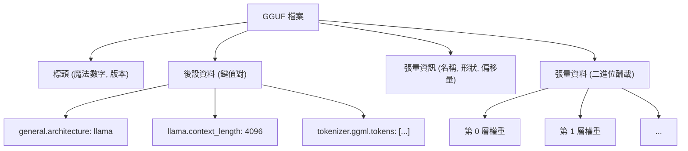
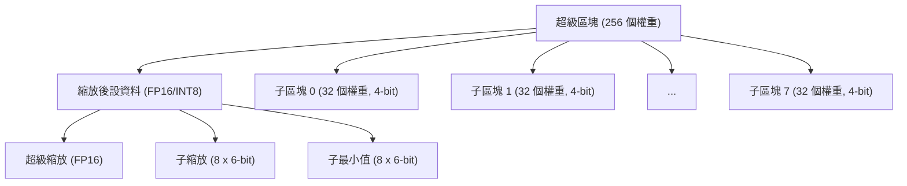
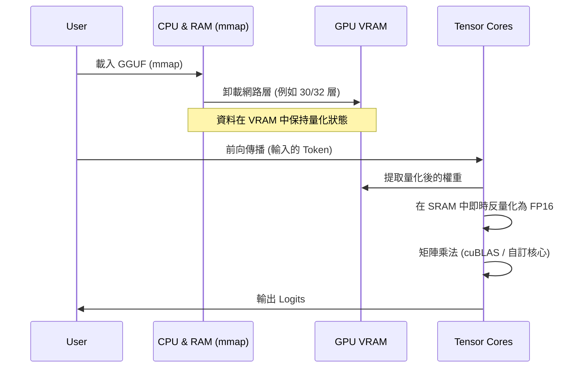

## 1. 前言：為什麼 LLM 需要量化？

近年來大型語言模型（LLM: Large Language Models）的發展雖然令人矚目，但其背後卻浮現了「運算資源枯竭」與「記憶體頻寬瓶頸」等嚴重的問題。例如，若將像 Llama 3 這樣擁有 70B（700 億）參數的模型，以標準的 16 位元浮點數（FP16）載入記憶體中，光是參數就會消耗約 140GB 的 VRAM/RAM。如果再加上推論時的上下文（KV 快取），除非將多台資料中心用的高階 GPU（NVIDIA A100 80GB 或 H100 80GB）組成叢集，否則根本無法運作。

為了讓個人開發者與邊緣裝置（MacBook 或一般的電競 PC）也能夠執行 LLM，作為救星登場的就是 **llama.cpp** 以及其核心的**量化（Quantization）技術**。尤其是被稱為 **GGUF (GPT-Generated Unified Format)** 的檔案格式，以及名為 **k-quants** 的進階區塊層級量化演算法，這是一種在將模型準確度（Perplexity）下降程度抑制到極限的同時，將模型大小壓縮至數分之一的革命性手法。

本文將從 llama.cpp 中量化的數學背景開始，徹底解說與 GGML 格式的差異、GGUF 格式的詳細結構，乃至於 k-quants 的內部機制。

---

## 2. 量化（Quantization）的數學基礎

在 LLM 的語境中，量化是指將連續的值（或高精度的浮點數）映射到較少位元數（INT8, INT4, INT3 等）的離散值的操作。

### 2.1. 線性量化的基本數學公式

最簡單的方法是線性量化（Min-Max 量化）。假設原本的高精度權重張量為 $W$，量化後的整數張量為 $W_q$。

$$ W_q = \text{round}\left( \frac{W}{S} \right) + Z $$

在這裡：
- $S$ 是**縮放因子（Scale Factor）**，決定了量化的步長（解析度）。
- $Z$ 是**零點（Zero-point）**，是為了偏移實數的 $0.0$ 對應到量化後的哪個整數值而設置的偏差值。
- $\text{round}(\cdot)$ 是四捨五入至最近整數的函數。

透過反量化（Dequantization），在推論時可以還原出近似的實數權重 $\tilde{W}$。

$$ \tilde{W} = S \times (W_q - Z) $$

### 2.2. 對稱量化 vs 非對稱量化

根據零點 $Z$ 的處理方式，大致可分為兩種方式：

1. **非對稱量化 (Asymmetric Quantization)**
   使用資料的最小值 $W_{\min}$ 與最大值 $W_{\max}$ 進行映射。
   $$ S = \frac{W_{\max} - W_{\min}}{2^b - 1}, \quad Z = \text{round}\left(-\frac{W_{\min}}{S}\right) $$
   此處 $b$ 為量化位元數（例如：4 位元則是 $2^4-1 = 15$）。由於必須保留 $Z$，計算與記憶體的額外開銷（overhead）會稍微增加。

2. **對稱量化 (Symmetric Quantization)**
   使用資料絕對值的最大值，以零為中心進行映射（$Z=0$）。
   $$ S = \frac{\max(|W_{\max}|, |W_{\min}|)}{2^{b-1} - 1}, \quad Z = 0 $$
   llama.cpp 早期的量化（例如傳統的 Q4_0 等）採用了對稱量化，因為沒有 $Z$ 這一項，這帶來了使用 SIMD 指令計算內積時能大幅加速的優勢。

---

## 3. 從 GGML 到 GGUF 的進化與檔案結構

談到 llama.cpp，就不得不提以 C++ 撰寫的張量運算函式庫 **GGML**，以及由此衍生出的檔案格式 **GGUF**。

### 3.1. GGML 的課題

早期的 llama.cpp 使用的是 `ggml` 格式（以及 `ggjt` 等變體）。然而，這些格式存在以下問題：
- **缺乏擴充性：** 魔法數字 (Magic numbers) 與超參數以固定長度、固定順序被寫死在程式碼中 (hardcoded)，每次加入新的模型架構（例如：Llama, Falcon, Mixtral 等）或新的分詞器 (Tokenizer) 時，都會產生破壞性的變更。
- **喪失向下相容性：** 格式更新頻繁，導致舊的模型檔案在最新的 llama.cpp 中無法讀取的情況屢見不鮮。

### 3.2. GGUF 格式的誕生

為了解決這些問題，於 2023 年 8 月導入的 **GGUF** 是被設計為具有高度通用性的格式。其最大的特色在於採用了**基於鍵值對（Key-Value）的後設資料（Metadata）結構**。

以下的 Mermaid 圖是 GGUF 檔案結構的抽象化表示。



**GGUF 的主要優點：**
1. **彈性：** 模型的超參數、RoPE（旋轉位置嵌入, Rotary Positional Embedding）的設定、分詞器的詞彙資料等，全數作為具名的 Key-Value 對儲存。由於未知的鍵會被忽略，因此新增功能變得非常容易。
2. **與位元組順序 (Endian) 無關：** GGUF 預設採用小端序 (Little-endian)，但因為具有明確的旗標標示，所以在不同架構之間也能安全地移植。
3. **對 mmap (記憶體映射) 的最佳化：** 張量資料在特定的邊界上對齊（Padding），可以使用作業系統的 `mmap()` 系統呼叫將其從磁碟直接映射到記憶體空間中。這樣一來，模型載入的初始化時間實際上降為了零。

---

## 4. k-quants 的深淵：進階的區塊層級量化

GGUF 格式的真正精髓在於負責壓縮模型權重的 **k-quants (K-quantization)** 機制。

通常神經網路的權重，若從整個神經層來看會呈現接近常態分布的形狀，但局部上仍會存在離群值（Outliers）。如果用單一的縮放因子 $S$ 來量化整層的權重，就會被離群值拉扯，導致較小權重的資訊完全流失。

為防止這種情況，llama.cpp 進行了**區塊層級量化（Block-wise Quantization）**。它將權重張量分割成小區塊（例如 32 個元素或 256 個元素），並讓每個區塊擁有專屬的縮放因子（與零點）。

### 4.1. 傳統量化（Q4_0, Q4_1）的極限

早期的 `Q4_0` 是將 32 個 FP16 權重當作 1 個區塊，並共用 1 個 FP16 的縮放因子。
- 區塊大小：32
- 記憶體：1 個縮放因子 (16-bit) + 32 個 4-bit 權重 (128-bit) = 144-bit
- 每個元素的實質位元數 (bpw: bits per weight)：$144 / 32 = 4.5$ bpw

雖然這樣已經十分優秀，但準確度與壓縮率的極限也逐漸顯現。於是，擁有更複雜且精巧階層結構的 **k-quants** 登場了。

### 4.2. 超級區塊與子區塊的階層結構（以 Q4_K_M 為例）

k-quants 擁有巨大的「超級區塊（Super-block）」以及包含在其中的微小「子區塊（Sub-block）」這樣的階層結構。藉由這種設計，它連後設資料（例如縮放值）本身也進行了量化，在將 bpw 降到極限的同時維持了準確度。

我們來看看最受歡迎的設定 **Q4_K_M** 的結構。在 Q4_K_M 中，使用了 256 個元素的超級區塊。



在 C++（GGML）中實際的結構體定義如下：

```cpp
// llama.cpp 中 block_q4_K 的概念性結構
#define QK_K 256

struct block_q4_K {
    uint8_t d[2];          // 整個超級區塊的超級縮放因子 (例如 FP16 x 2)
    uint8_t scales[12];    // 將 8 個子區塊 (各 32 個元素) 的 6-bit 縮放因子與 6-bit 最小值 (零點) 封裝在一起的資料
    uint8_t qs[QK_K/2];    // 以 4-bit 量化的權重資料 (256 元素 / 2 = 128 bytes)
};
```

**數學上的反量化（Dequantization）處理：**

子區塊 $i$（$0 \le i < 8$）內的元素 $j$（$0 \le j < 32$）的近似實數值 $\tilde{W}_{i, j}$，計算方式如下：

$$ \tilde{W}_{i, j} = S_{\text{super}} \times s_i \times (w_{i, j} - m_i) $$

- $S_{\text{super}}$：整個超級區塊的浮點數縮放因子
- $s_i$：專門為子區塊 $i$ 量化的 6-bit 縮放因子
- $m_i$：專門為子區塊 $i$ 量化的 6-bit 最小值（零點）
- $w_{i, j}$：4-bit 的量化權重 ($0 \dots 15$)

透過這種階層結構，在維持對離群值適應力的同時，大幅減少了縮放因子本身所佔用的記憶體量。Q4_K_M 整體實現了約 **4.8 bpw** 的表現。

### 4.3. 多樣的 k-quants 選項

llama.cpp 根據目的提供了許多變體。「K」後面的後綴詞（S, M, L）代表大小。

| 格式 | BPW (Bits per Weight) | 概要與特色 |
| :--- | :---: | :--- |
| **Q2_K** | 2.5～3.3 | 壓縮至極限。準確度下降顯著，適用於 VRAM 極度匱乏的環境。 |
| **Q3_K_M** | 3.3 | 3 位元量化的標準。雖比 Q4 劣化，但通常落在可接受範圍內。 |
| **Q4_K_M** | 4.8 | **推薦的絕佳平衡點 (Sweet Spot)**。兼顧模型大小減半與準確度維持。 |
| **Q5_K_M** | 5.5 | 尋求更高準確度時使用。介於 Q4 與 FP16 之間的位置。 |
| **Q6_K** | 6.6 | 維持與 FP16 幾乎同等的 Perplexity，但檔案大小較大。 |
| **Q8_0** | 8.5 | 相當於 INT8。主要用於推論時的計算用中間張量，或僅在最終層使用。 |

※ 實際的 BPW 會根據模型的張量（例如 Attention 的 Q/K/V 投影，或是 FFN 的權重）進行混合量化（Mixed Quantization），因此會在整個模型中進行平均。內部會進行優化，將重要的張量以 Q6 量化，其他的則以 Q4 量化。

---

## 5. 推論時的效能最佳化：SIMD 與 CUDA 架構

單純將 GGUF 模型載入記憶體，推論速度並不會變快。LLM 的推論大部分是「矩陣乘積（Matrix-Vector Multiplication，簡稱 GEMV，或是 Matrix-Matrix，簡稱 GEMM）」。關鍵在於如何加速量化後的權重與保持為 FP16（或 FP32）的激活值（輸入資料）之間的乘積和運算。

### 5.1. CPU 環境下 SIMD 指令的運用

llama.cpp 在 CPU 推論上擁有驚人速度的原因，在於組合語言層級的 **SIMD (Single Instruction, Multiple Data)** 最佳化。
例如在 Intel/AMD 的 CPU 上會充分活用 **AVX2** 或 **AVX-512**，在 Apple Silicon 上則是 **ARM NEON** 指令集。

在推論中，並不會特地將 $W_q$ 轉回 FP32（反量化）後再進行乘法運算。
激活值那一方也會以區塊為單位進行動態量化（Dynamic Quantization，通常是量化成 INT8），並使用 SIMD 的特殊點積指令（例：`vdpaddd` 或 `_mm256_madd_epi16`）一口氣計算 **INT8 $\times$ INT4** 的整數運算。最後在累加器（Accumulator）中轉回 FP32 並乘上縮放因子，藉此實現了驚人的吞吐量。

### 5.2. 在 GPU 環境 (cuBLAS / CUDA) 的卸載 (Offload)

最近的 llama.cpp 不僅支援 CPU，對 NVIDIA GPU 也有強大的支援（CUBLAS / CUDA）。
可以將 GGUF 檔案的部分或全部網路層卸載到 VRAM 中（`--n-gpu-layers` 選項）。



當在 GPU 上計算時，VRAM 的頻寬（Memory Bandwidth）會成為最大的瓶頸。由於權重被 k-quants 壓縮，從 VRAM 到 GPU 運算單元（SM: Streaming Multiprocessor 或 Tensor Cores）的資料傳輸量被減少到了 1/3 ～ 1/4。在權重抵達運算單元的瞬間，就會被即時（On-the-fly）反量化（展開）為 FP16，並利用 Tensor Core 進行超高速的矩陣乘法。
也就是說，可以認為量化**不是為了「減少計算量」，而是為了「減少記憶體傳輸量」而進行的**。

---

## 6. 記憶體使用量與效能取捨的具體例子

在此，我們以 Llama 3 8B 模型為例，來看看各個 GGUF 量化等級的需求規格。（數值僅供大略參考）

| 模型/量化 | 檔案大小 | 需要的 VRAM/RAM | 推論速度(參考) | Perplexity 劣化 |
| :--- | :--- | :--- | :--- | :--- |
| **Llama-3-8B (FP16)** | 約 16 GB | 18 GB 以上 | 基準 | 無 (Base) |
| **Llama-3-8B (Q8_0)** | 約 8.5 GB | 10 GB 以上 | 快速 | 幾乎為零 |
| **Llama-3-8B (Q6_K)** | 約 6.6 GB | 8 GB 以上 | 非常快 | 極小 |
| **Llama-3-8B (Q4_K_M)** | 約 4.9 GB | 6.5 GB 以上 | 最快・最佳 | 容許範圍・微小 |
| **Llama-3-8B (Q3_K_M)** | 約 3.9 GB | 5.5 GB 以上 | 最快 | 稍微明顯 |
| **Llama-3-8B (Q2_K)** | 約 3.0 GB | 4.5 GB 以上 | 快速 | 明顯劣化 |

**注意事項 (KV 快取的影響)：**
在 LLM 的推論中，當上下文長度（提示詞的 Token 數量）變長時，不僅是模型的權重，用來保存過去 Attention 狀態的 **KV 快取** 的記憶體消耗量也會爆發性地增加。
例如，當上下文為 8192 個 Token 時，光是 KV 快取就會消耗數 GB。因此，在實際運用上，必須保留 `模型檔案大小 + 約 1.5GB～3GB` 的餘裕空間（Headroom）。之所以推薦 Q4_K_M，是因為即使保留了這個 KV 快取空間，它也能在一般搭載 8GB VRAM 的 GPU（如 RTX 3060 / 4060 等）上安全運作，是一條非常絕妙的分界線。

在最近的 llama.cpp 中，也加入了**將這個 KV 快取本身以 Q8_0 或 Q4_0 進行量化的功能**，為了進一步延長上下文長度的巧思不斷推陳出新。

---

## 7. 總結

本文深入探討並解說了身為 llama.cpp 心臟部位的 GGUF 格式與 k-quants 量化技術的內部結構。

1. **GGUF 的彈性：** 透過鍵值對（Key-Value）型的後設資料結構，建立了一個堅固的生態系統，即使面對 LLM 的急速進化（新模型架構的出現），也能在沒有破壞性變更的情況下隨之發展。
2. **k-quants 的極限壓縮：** 透過超級區塊與子區塊的階層性縮放因子管理，在保留離群值資訊的同時，達成了每個權重平均僅需 4.8 位元（Q4_K_M）的驚人壓縮率。
3. **消除記憶體頻寬瓶頸：** 透過在 SIMD 或 CUDA 中實作的高階核心程式碼（Kernel），在即時反量化的同時進行計算，減少了 VRAM 的傳輸量，並飛躍性地提升了推論速度。

推動 AI 民主化的 llama.cpp 技術能力，已經超越了單純工具的範疇，說它是現代軟體工程的最高峰之一也不為過。只要理解了量化演算法與 GGUF 格式的機制，就能夠更精確地為您的環境選擇最合適的模型，並進行效能調校。

### 參考連結
- [llama.cpp GitHub Repository](https://github.com/ggerganov/llama.cpp)
- [GGUF Format Specification](https://github.com/ggerganov/ggml/blob/master/docs/gguf.md)
- [K-quants Implementation PR](https://github.com/ggerganov/llama.cpp/pull/1684)

（完）

